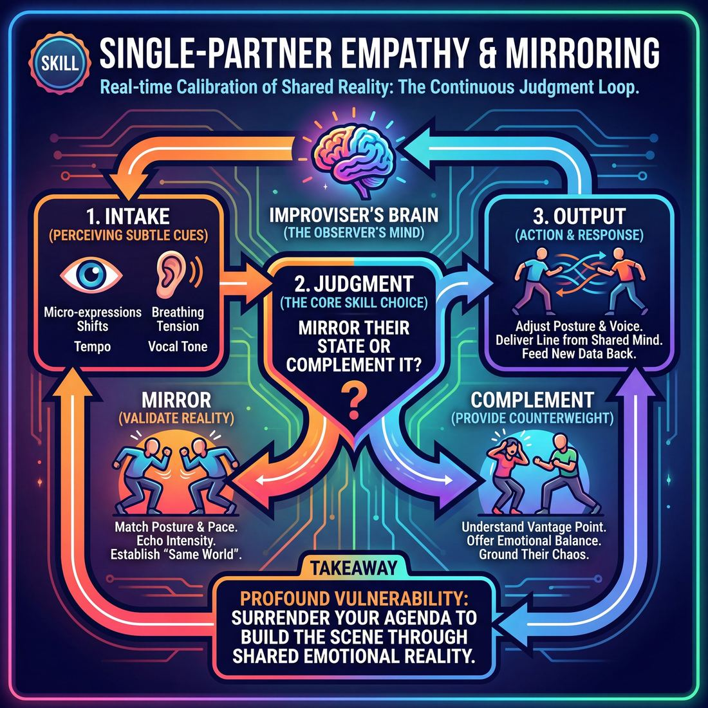
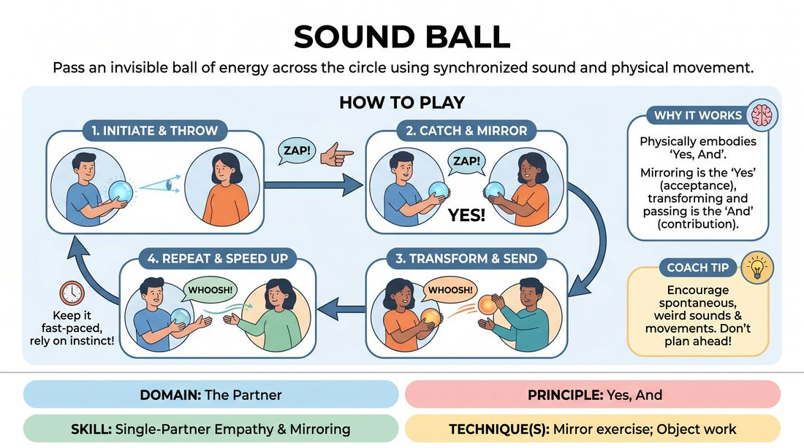
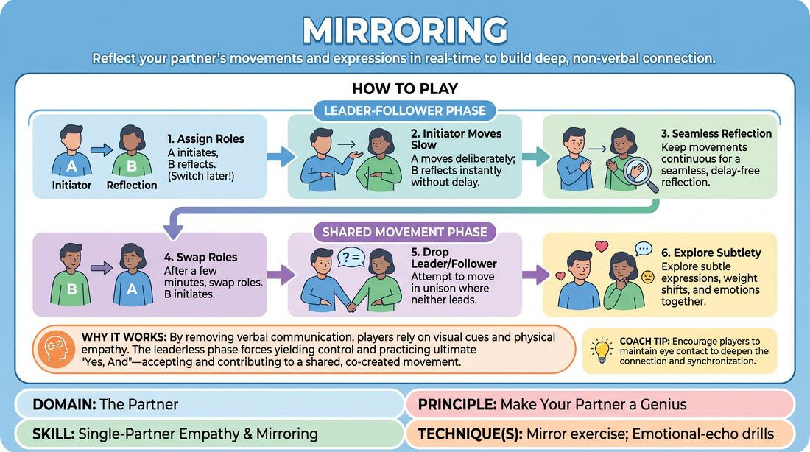

# Week 10 — Two Minds, One Mirror
> *Attune to one partner until you move as one.*

| Course | Week | Domain | Focus | Stage |
|---|---|---|---|---|
| Foundations — The Brave Beginner | 10/16 | D2 — The Partner | `D2.S3` — Single-Partner Empathy & Mirroring | Novice → Advanced Beginner |

## ⏱️ Session flow (60 minutes)

| Time | Block |
|---|---|
| 0:00–0:05 | Arrival & safety check-in |
| 0:05–0:15 | Warm-up game |
| 0:15–0:27 | **1. Today's theory** |
| 0:27–0:52 | **2. Today's games** |
| 0:52–1:00 | **3. Reflection & debrief** |

## 1. 🧠 Today's theory

**Focus:** `D2.S3` — Single-Partner Empathy & Mirroring  
**Maturity goal today:** Adv. Beginner: clean mirror exercise; emotional echo.

{ .infographic }

- **The big idea:** Attune to one partner until you move as one.
- **Where you are on the path:** Adv. Beginner: clean mirror exercise; emotional echo.
- **The one cue to coach:** *“Share the lead. Make it impossible to tell who's following.”*

!!! abstract "📖 Go deeper"
    Read the full write-up: [Single-Partner Empathy & Mirroring](../../content/02_the-partner/02_S3__single-partner-empathy-and-mirroring.md)

## 2. 🎲 Today's games

#### Warm-up — Sound Ball

> Pass an invisible ball of energy across the circle using synchronized sound and physical movement.

{ .infographic }

`Players 4+` · `~5 min` · `Complexity 1/5` · `Energy high` · `Props: none`

**Trains:** Single-Partner Empathy & Mirroring · _connection_

**How to play**

1. Form a standing circle facing inward, ensuring everyone can make eye contact with all other participants.
2. The facilitator initiates the game by holding an imaginary ball of energy, shaping it with their hands, and establishing eye contact with a specific player across the circle.
3. The sender throws the imaginary ball to the chosen receiver, accompanying the throw with a distinct, abstract vocal sound and a clear, committed physical gesture.
4. The receiver must immediately catch the ball by mirroring the exact sound and physical gesture of the sender as closely as possible.
5. Once the catch is completed and mirrored, the receiver instantly transforms the ball, creating a brand-new sound and physical gesture to pass to a different player in the circle.
6. The play continues in this manner, with each player catching and mirroring the incoming offer before immediately sending a new, spontaneous offer to someone else.
7. Keep the momentum fast-paced, encouraging players to rely on instinct rather than planning their sounds or movements in advance.

[Open the full game card »](../../games/D2_P2_S3_T1_G840__sound-ball.md)

#### Core game — The Mirror

> Reflect your partner's movements and expressions in real-time to build deep, non-verbal connection.

{ .infographic }

`Players 2+` · `~5 min` · `Complexity 1/5` · `Energy low` · `Props: none`

**Trains:** Single-Partner Empathy & Mirroring · _connection_

**How to play**

1. Assign one player in each pair as Player A, the initiator, and the other as Player B, the reflection.
2. Player A begins to move slowly and deliberately, using their face, torso, and limbs, while Player B mirrors every movement in real-time.
3. Instruct Player A to keep movements slow and continuous so that Player B can follow without a noticeable delay, making the reflection look seamless.
4. After a couple of minutes, signal the pairs to swap roles, with Player B becoming the initiator and Player A becoming the reflection.
5. After another couple of minutes, instruct both players to drop the roles of leader and follower, attempting to move together in unison where neither is consciously leading.
6. Encourage players to explore subtle facial expressions, shifts in weight, and emotional states alongside physical gestures during this shared phase.

[Open the full game card »](../../games/D2_P3_S3_T1_G770__mirroring.md)

??? note "🎒 Backup games — if you have time, or a game falls flat"
    *Swap-ins drawn from the same maturity band; not part of the timed hour.*
    - **[Yippee Connection](../../games/D2_P2_S3_T1_G906__yipee.md)** — `4+` · `~5m` · `Cx 1/5` · `Energy high` · _Single-Partner Empathy & Mirroring_
    - **[The Mutation Circle](../../games/D2_P2_S3_T1_G916__accepting-circle.md)** — `4+` · `~5m` · `Cx 1/5` · `Energy medium` · _Single-Partner Empathy & Mirroring_

## 3. 💭 Self-reflection

**Deepen your improv**
1. How did it feel to immediately mirror your partner's sound and movement without judging it first?
2. What happened to the group's energy when we stopped planning our next move and focused entirely on the person throwing to us?

**Beyond the stage**
3. True attunement means matching another's energy before steering it. With whom in your life could more mirroring — listening to mood, not just words — build trust?

---
⬅️ *Previous:* [W09 — Make Your Partner a Genius](week-09.md)  ·  *Next:* [W11 — Status: High & Low](week-11.md) ➡️
