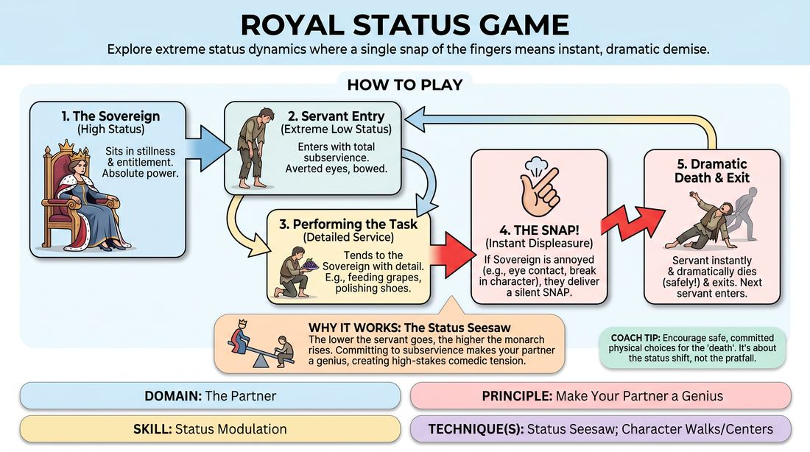

# Week 11 — Status: High & Low
> *Status is something you do, not something you are.*

| Course | Week | Domain | Focus | Stage |
|---|---|---|---|---|
| Foundations — The Brave Beginner | 11/16 | D2 — The Partner | `D2.S2` — Status Modulation | Novice → Advanced Beginner |

## ⏱️ Session flow (60 minutes)

| Time | Block |
|---|---|
| **0:00–0:05** | 🤝 Arrival & safety check-in |
| **0:05–0:15** | 🔥 Warm-up — *The Sovereign's Snap* |
| **0:15–0:27** | 🧠 Theory — *Status Modulation* |
| **0:27–0:52** | 🎲 Game 1 — *Status Spectrum Party* |
| **0:52–1:00** | 💭 Reflection & debrief |

## 1. 🧠 Today's theory

**Focus:** `D2.S2` — Status Modulation  
**Maturity goal today:** Adv. Beginner: play an assigned high or low status.

{ .infographic }

- **The big idea:** Status is something you do, not something you are.
- **Where you are on the path:** Adv. Beginner: play an assigned high or low status.
- **The one cue to coach:** *“Small status moves. A chin lift is enough.”*

!!! abstract "📖 Go deeper"
    Read the full write-up: [Status Modulation](../../content/02_the-partner/02_S2__status-modulation.md)

## 2. 🎲 Today's games

#### Warm-up — The Sovereign's Snap

> Explore extreme status dynamics where a single snap of the fingers means instant, dramatic demise.

{ .infographic }

`Players 3+` · `~10 min` · `Complexity 2/5` · `Energy medium` · `Props: none`

**Trains:** Status Modulation · _skill drill_

**How to play**

1. Designate one player to sit on the throne as the Sovereign, embodying absolute high status through posture, stillness, and entitlement.
2. The remaining players line up off-stage as Servants, waiting to enter the court one at a time.
3. The first Servant enters the space, immediately establishing an extreme low-status relationship to the Sovereign through physical posture, averted eyes, and tentative movement.
4. The Servant must perform a specific task to tend to the Sovereign (e.g., feeding them imaginary grapes, polishing their shoes, brushing their hair) using detailed physical object work.
5. The Sovereign remains demanding and easily displeased. If the Servant breaks character, makes direct eye contact, acts too familiar, or simply annoys the Sovereign, the Sovereign snaps their fingers.
6. Upon hearing the snap, the Servant must instantly and dramatically die (safely collapsing to the floor) and then drag themselves or be dragged off-stage.
7. The next Servant in line immediately enters, adapting their approach based on the previous Servant's demise to try a different low-status tactic.

[Open the full game card »](../../games/D2_P3_S2_T1_G822__royal-status-game.md){target=_blank rel=noopener}

#### Core game — Status Spectrum Party

> Navigate a social gathering while physicalizing a secret status rank from one to ten.

{ .infographic }

`Players 5+` · `~15 min` · `Complexity 2/5` · `Energy medium` · `Props: required`

**Trains:** Status Modulation · _skill drill_

**How to play**

1. Establish a specific social setting for the scene, such as a high-end gallery opening, a corporate networking event, or a neighborhood block party.
2. Distribute one secret numbered card (from 1 to 10) to each player. Instruct players to look at their number privately and pocket it without revealing it to anyone else.
3. Explain the scale: 1 represents the absolute lowest status in the room (extremely deferential, avoiding space, minimal eye contact), while 10 represents the absolute highest status (commanding space, sustained eye contact, relaxed posture).
4. Have players enter the playing space one by one or in small groups, immediately adopting the physical walk, posture, and attitude of their assigned number.
5. Instruct players to mingle and engage in casual conversation, focusing heavily on how they use physical space, eye contact, and vocal tone to express their relative rank.
6. Encourage players to actively adjust their behavior based on who they are interacting with, lifting their partner's status up or yielding to it to make the relationship clear.
7. Freeze the action after 5 to 7 minutes of active mingling.
8. Have the group observe the frozen tableau, then go around and have players guess each other's numbers based on the physical and verbal behaviors exhibited during the scene before revealing the actual cards.

[Open the full game card »](../../games/D2_P3_S2_T2_G847__status-party.md){target=_blank rel=noopener}

??? note "🎒 Backup games — if you have time, or a game falls flat"
    *Swap-ins drawn from the same maturity band; not part of the timed hour.*
    - **[Cooperative Tug of War](../../games/D2_P3_S2_T1_G877__tug-of-war.md){target=_blank rel=noopener}** — `2+` · `~5m` · `Cx 2/5` · `Energy medium` · _Status Modulation_
    - **[Proximity Stakes](../../games/D2_P2_S2_T0_G1026__distance-game.md){target=_blank rel=noopener}** — `2–2` · `~5m` · `Cx 2/5` · `Energy medium` · _Status Modulation_

## 3. 💭 Self-reflection

**Deepen your improv**
1. How did lowering your own status as a servant actually give the Sovereign more power and make them look better?
2. What physical choices (posture, eye contact, speed) made the high status feel authentic rather than just cartoonish?

**Beyond the stage**
3. Status is something we do, not who we are. Where do you habitually play high or low at work — and where would deliberately shifting it serve the relationship?

---
⬅️ *Previous:* [W10 — Two Minds, One Mirror](week-10.md)  ·  *Next:* [W12 — Show, Don't Tell — Build a World](week-12.md) ➡️
