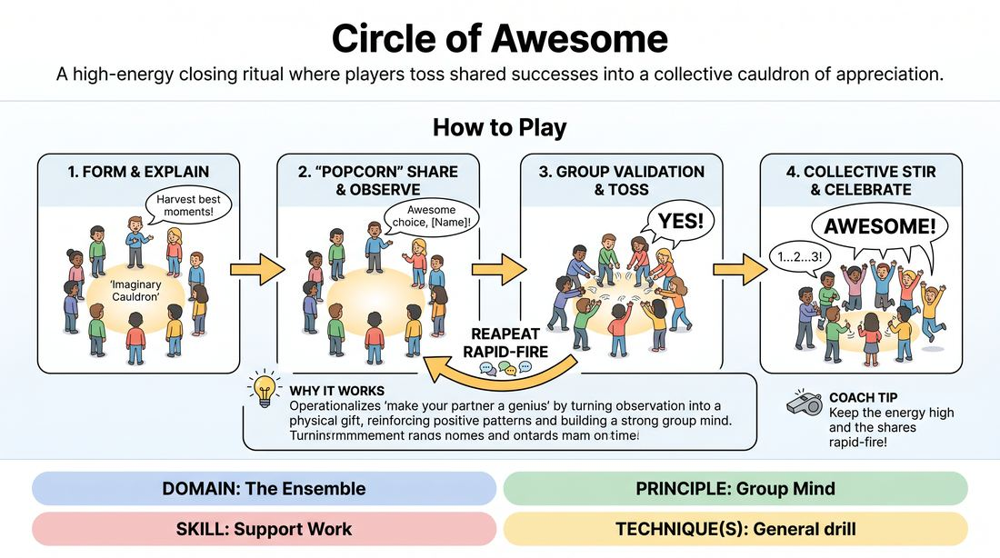

# Week 14 — We're a Team
> *Enter to give, not to take; the group mind beats the individual.*

| Course | Week | Domain | Focus | Stage |
|---|---|---|---|---|
| Foundations — The Brave Beginner | 14/16 | D4 — The Ensemble | `D4.S2` — Support Work | Novice → Advanced Beginner |

## ⏱️ Session flow (60 minutes)

| Time | Block |
|---|---|
| **0:00–0:05** | 🤝 Arrival & safety check-in |
| **0:05–0:15** | 🔥 Warm-up — *I'm Great, You're Great* |
| **0:15–0:27** | 🧠 Theory — *Support Work* |
| **0:27–0:52** | 🎲 Game 1 — *The Memory Cauldron* |
| **0:52–1:00** | 💭 Reflection & debrief |

## 1. 🧠 Today's theory

**Focus:** `D4.S2` — Support Work  
**Maturity goal today:** Adv. Beginner: a clean walk-on / tap-in on instruction.

{ .infographic }

- **The big idea:** Enter to give, not to take; the group mind beats the individual.
- **Where you are on the path:** Adv. Beginner: a clean walk-on / tap-in on instruction.
- **The one cue to coach:** *“Walk on to help. Give one thing, then get out.”*

!!! abstract "📖 Go deeper"
    Read the full write-up: [Support Work](../../content/04_the-ensemble/04_S2__support-work.md)

## 2. 🎲 Today's games

#### Warm-up — I'm Great, You're Great

> A high-energy, rapid-fire celebration of self, partner, and ensemble connection.

{ .infographic }

`Players 4+` · `~3 min` · `Complexity 1/5` · `Energy high` · `Props: none`

**Trains:** Support Work · _connection_

**How to play**

1. Instruct all players to begin moving dynamically around the room, filling the empty spaces and maintaining a high energy level.
2. Explain that when they make eye contact with another player, they must immediately step toward each other to form a temporary pair.
3. Once paired, both players must look each other in the eye and simultaneously chant three distinct phrases with matching gestures: 'I'm great!' (pointing to themselves), 'You're great!' (pointing to their partner), and 'We're great!' (raising their hands in the air).
4. Immediately following the final phrase, the partners must deliver an enthusiastic high-five.
5. After the high-five, both players must instantly break apart, resume moving through the space, and seek out a new partner.
6. Encourage players to keep moving and repeating this cycle rapidly, aiming to connect with as many different people in the room as possible within the time limit.
7. Call an end to the activity after approximately two to three minutes, once the room reaches a peak of high energy and laughter.

[Open the full game card »](../../games/D4_P1_S2_T0_G735__i-m-great-you-re-great-we-re-great.md){target=_blank rel=noopener}

#### Core game — The Memory Cauldron

> A high-energy closing ritual where players toss shared successes into a collective cauldron of appreciation.

{ .infographic }

`Players 3+` · `~5 min` · `Complexity 1/5` · `Energy medium` · `Props: none`

**Trains:** Support Work · _connection_

**How to play**

1. Form a standing circle with all participants, leaving an open space in the center representing an imaginary cauldron.
2. Explain that the goal is to collectively harvest and celebrate the best moments, offers, and discoveries of the session.
3. Any player can speak up at any time in a popcorn style to call out a specific moment they appreciated, focusing on another player's contribution.
4. Immediately after a memory is shared, the entire group must shout a unified word of agreement, such as 'Yes!', while physically miming the action of grabbing that memory and tossing it into the center cauldron.
5. Continue this popcorn-style sharing, allowing multiple players to contribute their favorite moments and keeping the energy high with rapid-fire physical tosses.
6. Once the sharing naturally winds down, the facilitator guides the group to step forward and mime stirring the giant cauldron together.
7. On a count of three, the entire group leaps into the air, throwing their hands up, and shouts a final, unifying word to close the session.

[Open the full game card »](../../games/D4_P1_S2_T0_G667__circle-of-awesome.md){target=_blank rel=noopener}

??? note "🎒 Backup games — if you have time, or a game falls flat"
    *Swap-ins drawn from the same maturity band; not part of the timed hour.*
    - **[The Welcome Ovation](../../games/D4_P1_S2_T0_G777__name-and-applause.md){target=_blank rel=noopener}** — `3+` · `~5m` · `Cx 1/5` · `Energy high` · _Support Work_
    - **[Vocal Symphony](../../games/D4_P1_S2_T0_G788__orchestra.md){target=_blank rel=noopener}** — `4+` · `~5m` · `Cx 1/5` · `Energy medium` · _Support Work_

## 3. 💭 Self-reflection

**Deepen your improv**
1. How did it feel to declare your own greatness and your partner's greatness at the exact same time?
2. What happened to the energy in the room as we repeated this simple, positive interaction?

**Beyond the stage**
3. Great support enters to give, not to take. Where could you step in to fill a gap for your team and then get out of the way — without grabbing credit?

---
⬅️ *Previous:* [W13 — Make It Make Sense](week-13.md)  ·  *Next:* [W15 — Playing to the Back Row](week-15.md) ➡️
