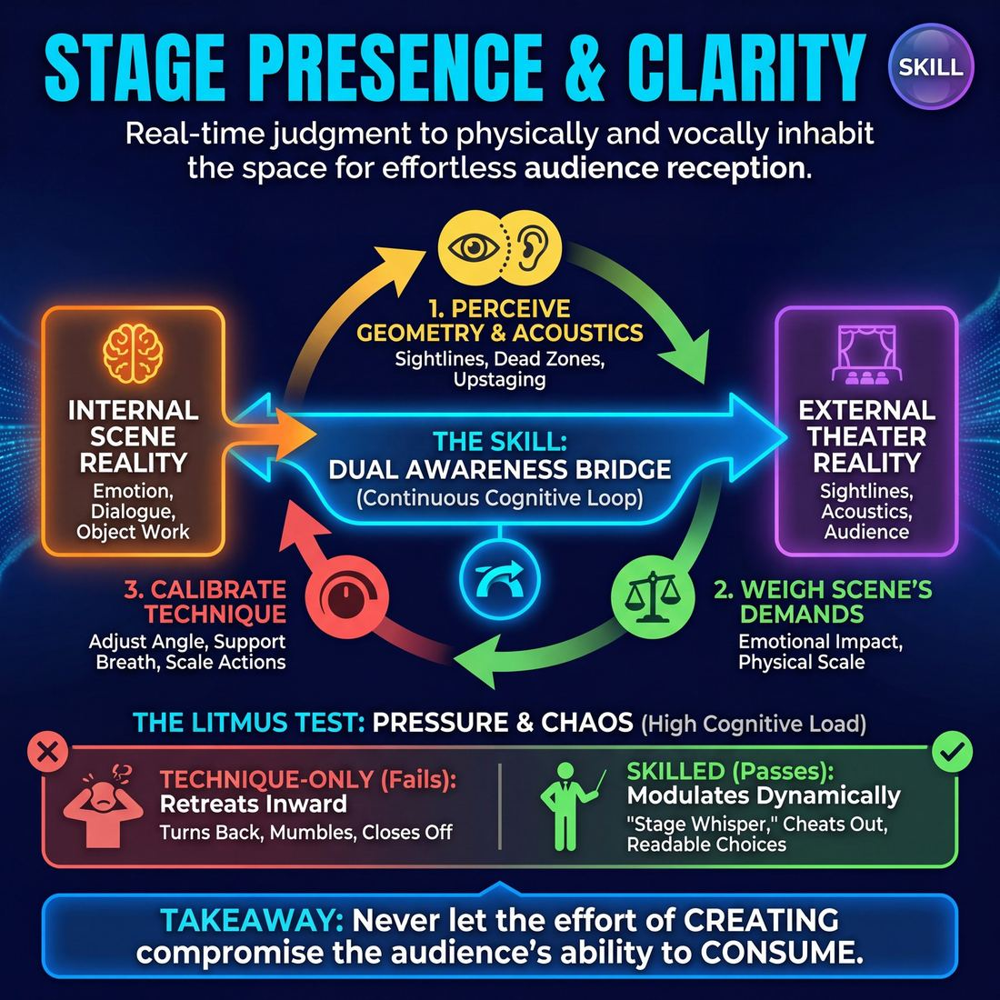

# Week 15 — Playing to the Back Row
> *Make every choice readable and generous for the whole room.*

| Course | Week | Domain | Focus | Stage |
|---|---|---|---|---|
| Foundations — The Brave Beginner | 15/16 | D5 — The Audience | `D5.S3` — Stage Presence & Clarity | Novice → Advanced Beginner |

## ⏱️ Session flow (60 minutes)

| Time | Block |
|---|---|
| 0:00–0:05 | Arrival & safety check-in |
| 0:05–0:15 | Warm-up game |
| 0:15–0:27 | **1. Today's theory** |
| 0:27–0:52 | **2. Today's games** |
| 0:52–1:00 | **3. Reflection & debrief** |

## 1. 🧠 Today's theory

**Focus:** `D5.S3` — Stage Presence & Clarity  
**Maturity goal today:** Adv. Beginner: cheat out and project when reminded.

{ .infographic }

- **The big idea:** Make every choice readable and generous for the whole room.
- **Where you are on the path:** Adv. Beginner: cheat out and project when reminded.
- **The one cue to coach:** *“Open up. Let them see your face and your choice.”*

!!! abstract "📖 Go deeper"
    Read the full write-up: [Stage Presence & Clarity](../../content/05_the-audience/05_S3__stage-presence-and-clarity.md)

## 2. 🎲 Today's games

#### Warm-up — The Visionary Lecture

> Co-deliver a polished, high-stakes keynote presentation on a completely absurd, made-up topic.

{ .infographic }

`Players 2–2` · `~5 min` · `Complexity 2/5` · `Energy medium` · `Props: none`

**Trains:** Stage Presence & Clarity · _mixed_

**How to play**

1. Ask the audience for a highly specific, slightly absurd topic combining two unrelated fields (e.g., 'The Quantum Physics of Breadmaking').
2. The two players step forward, immediately adopting a confident, high-status posture, imagining they are wearing invisible headset microphones.
3. Player A begins the presentation with a grand, sweeping opening statement, projecting their voice to the back wall of the theater to establish immediate authority.
4. Player B seamlessly takes over, introducing a personal anecdote or a 'slide' that illustrates the point, using clear physical gestures to point to an imaginary projection screen behind them.
5. The players alternate speaking, ensuring an even back-and-forth dynamic where neither dominates, and each treats the other's statements as absolute, rehearsed truth.
6. Both players must actively justify any unexpected choices, slips of the tongue, or bizarre claims made by their partner, framing them as intentional, groundbreaking insights.
7. The presentation builds to a profound, inspiring philosophical takeaway or call to action, concluding with a synchronized, confident bow.

[Open the full game card »](../../games/D5_P2_S3_T2_G862__ted-talks.md)

#### Core game — The Open Frame

> Master physical sightlines and body angles to share every silent choice with the entire room.

{ .infographic }

`Players 3+` · `~15 min` · `Complexity 2/5` · `Energy medium` · `Props: required`

**Trains:** Stage Presence & Clarity · _skill drill_

**How to play**

1. Select two to three players to step onto the stage and assign them a simple, physically-focused scenario involving the provided props (e.g., inspecting a stolen coin or reading a secret letter).
2. Instruct the players to begin the scene, focusing on their characters' objectives while keeping their bodies, faces, and props open to the audience.
3. The facilitator and remaining players watch from the audience area, actively tracking sightlines, physical angles, and prop visibility.
4. Whenever a player turns their back completely, blocks a partner, hides a prop, or masks an emotional reaction, the facilitator calls 'Freeze!'
5. While the players hold their physical positions, the facilitator identifies the obscured element (e.g., 'We lost your face when you looked down' or 'The letter is hidden in your palm').
6. Instruct the frozen players to slowly adjust their physical angles, shift their weight, or tilt the prop until the action is fully visible to the back row, without changing the emotional reality of the scene.
7. Once the adjustment is visually clear, the facilitator calls 'Resume!', and the players continue the scene from their newly adjusted, open positions.
8. Rotate players every three to four minutes, ensuring everyone has a turn to experience the physical adjustments on stage.

[Open the full game card »](../../games/D5_P1_S3_T1_G508__the-transparent-scene-cheating-out-for-audience-clarity.md)

??? note "🎒 Backup games — if you have time, or a game falls flat"
    *Swap-ins drawn from the same maturity band; not part of the timed hour.*
    - **[Pet Peeves](../../games/D1_P3_S1_T2_G801__pet-peeves.md)** — `2+` · `~10m` · `Cx 1/5` · `Energy low` · _Unfiltered Spontaneity_
    - **[Finger Applause](../../games/D5_P1_S1_T1_G1066__finger-applause.md)** — `4+` · `~2m` · `Cx 1/5` · `Energy medium` · _Room Reading_

## 3. 💭 Self-reflection

**Deepen your improv**
1. How did projecting your voice and adopting a high-status posture change your internal level of confidence?
2. What strategies did you use to make your partner's wildest claims sound like pre-planned, scientific facts?

**Beyond the stage**
3. Stage presence is making your choices readable and generous. In a presentation or pitch, how could you 'cheat out' — make your intent unmistakably clear to everyone?

---
⬅️ *Previous:* [W14 — We're a Team](week-14.md)  ·  *Next:* [W16 — Putting It Together — Showcase](week-16.md) ➡️
