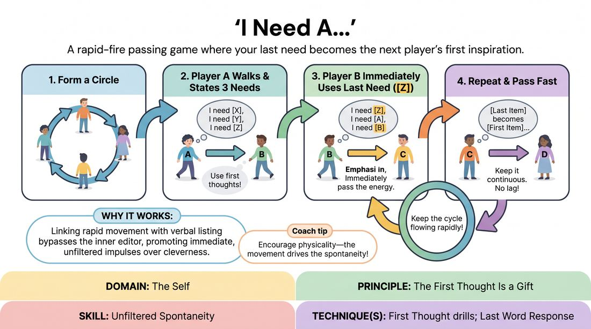
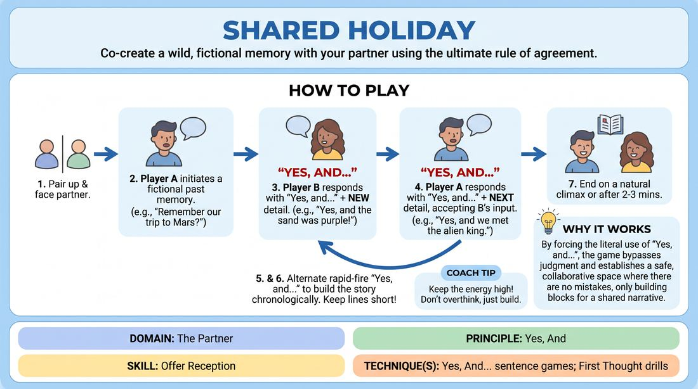
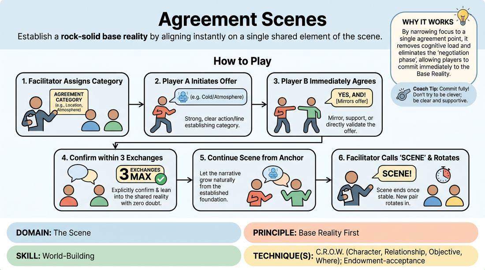

# Week 16 — Putting It Together — Showcase
> *A first short-form set: safety, spontaneity, partnership, scene.*

| Course | Week | Domain | Focus | Stage |
|---|---|---|---|---|
| Foundations — The Brave Beginner | 16/16 | All domains (integration) | `D2.S4` — Offer Reception | Novice → Advanced Beginner |

!!! note "Builds on"
    Everything in the Beginner course.

## ⏱️ Session flow (60 minutes)

| Time | Block |
|---|---|
| **0:00–0:05** | 🤝 Arrival & safety check-in |
| **0:05–0:15** | 🔥 Warm-up — *I Need A...* |
| **0:15–0:27** | 🧠 Theory — *Offer Reception* |
| **0:27–0:39** | 🎲 Game 1 — *Shared Adventure* |
| **0:39–0:52** | 🎲 Game 2 — *Agreement Anchors* |
| **0:52–1:00** | 💭 Reflection & debrief |

## 1. 🧠 Today's theory

**Focus:** `D2.S4` — Offer Reception  
**Also touches:** `D1.S1` — Unfiltered Spontaneity, `D2.S1` — Active Listening, `D3.S5` — World-Building  
**Maturity goal today:** Adv. Beginner: sustain the fundamentals across a short, friendly set.

{ .infographic }

- **The big idea:** A first short-form set: safety, spontaneity, partnership, scene.
- **Where you are on the path:** Adv. Beginner: sustain the fundamentals across a short, friendly set.
- **The one cue to coach:** *“Trust the basics. Have fun. Support each other.”*

!!! abstract "📖 Go deeper"
    Read the full write-up: [Offer Reception](../../content/02_the-partner/02_S4__offer-reception.md)
    · [Unfiltered Spontaneity](../../content/01_the-self/01_S1__unfiltered-spontaneity.md)
    · [Active Listening](../../content/02_the-partner/02_S1__active-listening.md)
    · [World-Building](../../content/03_the-scene/03_S5__world-building.md)

## 2. 🎲 Today's games

#### Warm-up — I Need A...

> A rapid-fire passing game where your last need becomes the next player's first inspiration.

{ .infographic }

`Players 5+` · `~5 min` · `Complexity 1/5` · `Energy high` · `Props: none`

**Trains:** Unfiltered Spontaneity · _skill drill_

**How to play**

1. Form a standing circle with all participants.
2. Player A initiates the game by walking across the circle toward another player (Player B).
3. While walking, Player A must state three things they 'need' in the format: 'I need [X], I need [Y], and I need [Z].' These should be the absolute first things that pop into their head.
4. Player A arrives at Player B's spot, and Player B immediately begins walking toward a new player (Player C).
5. As Player B walks, they must start their list of three needs using Player A's third need ([Z]) as their first need: 'I need [Z], I need [A], and I need [B].'
6. This pattern continues with each receiving player immediately converting the previous player's final item into their own first item as they cross the circle.
7. Keep the physical movement and verbal delivery continuous, aiming for zero lag time between one person finishing and the next person starting their walk.

[Open the full game card »](../../games/D1_P4_S1_T2_G734__i-need-a.md){target=_blank rel=noopener}

#### Core game — Shared Adventure

> Co-create a wild, fictional memory with your partner using the ultimate rule of agreement.

{ .infographic }

`Players 2+` · `~5 min` · `Complexity 1/5` · `Energy medium` · `Props: none`

**Trains:** Offer Reception · _connection_

**How to play**

1. Divide the group into pairs and have them stand or sit facing one another.
2. Player A initiates the conversation by establishing a fictional shared memory from a past trip or event.
3. Player B must respond by starting their sentence with the exact words, 'Yes, and...' followed by a new detail that builds on Player A's premise.
4. Player A then responds with 'Yes, and...' adding another detail, accepting everything Player B just established as absolute truth.
5. The partners continue to alternate back and forth, with every single line beginning with 'Yes, and...' to construct a detailed, chronological narrative of their shared adventure.
6. Encourage players to keep their sentences relatively short to allow for rapid-fire exchange and to prevent one person from dominating the narrative.
7. Run the exercise for two to three minutes, or until the story reaches a natural, high-energy climax.

[Open the full game card »](../../games/D2_P2_S4_T1_G835__shared-holiday.md){target=_blank rel=noopener}

#### Core game — Agreement Anchors

> Establish a rock-solid base reality by aligning instantly on a single shared element of the scene.

{ .infographic }

`Players 2+` · `~15 min` · `Complexity 2/5` · `Energy medium` · `Props: none`

**Trains:** World-Building · _skill drill_

**How to play**

1. The facilitator calls up two players to the performance space and assigns them a specific 'Agreement Category' (e.g., 'Location' or 'Atmosphere').
2. Player A enters the space and initiates with a clear physical action, posture, or line of dialogue that establishes the assigned category.
3. Player B immediately enters, observes Player A's offer, and mirrors, supports, or directly agrees with that established element through their own physical choices and dialogue.
4. Both players must explicitly confirm and lean into this shared reality within the first three exchanges, ensuring there is zero doubt about the chosen category.
5. Once the agreement is firmly established (the 'anchor' is set), the players continue the scene for one to two minutes, letting the narrative grow naturally from this stable foundation.
6. The facilitator calls 'scene' once the base reality is fully realized and stable, then rotates in a new pair with a different category.

[Open the full game card »](../../games/D3_P2_S5_T1_G629__agreement-scenes.md){target=_blank rel=noopener}

??? note "🎒 Backup games — if you have time, or a game falls flat"
    *Swap-ins drawn from the same maturity band; not part of the timed hour.*
    - **[Rapid Fire Association](../../games/D1_P4_S1_T1_G1068__firing-squad.md){target=_blank rel=noopener}** — `3+` · `~5m` · `Cx 1/5` · `Energy high` · _Unfiltered Spontaneity_
    - **[Yes, Let's!](../../games/D2_P2_S4_T1_G905__yes-let-s.md){target=_blank rel=noopener}** — `3+` · `~5m` · `Cx 1/5` · `Energy high` · _Offer Reception_

## 3. 💭 Self-reflection

**Deepen your improv**
1. How did it feel to have your first word chosen for you by the previous player?
2. What happened to your brain when you tried to plan your three items in advance versus when you just let them fly?

**Beyond the stage**
3. Look back across this course. Which single skill changed the most for you — and where, outside improv, do you most want to keep practising it?

---
⬅️ *Previous:* [W15 — Playing to the Back Row](week-15.md)
