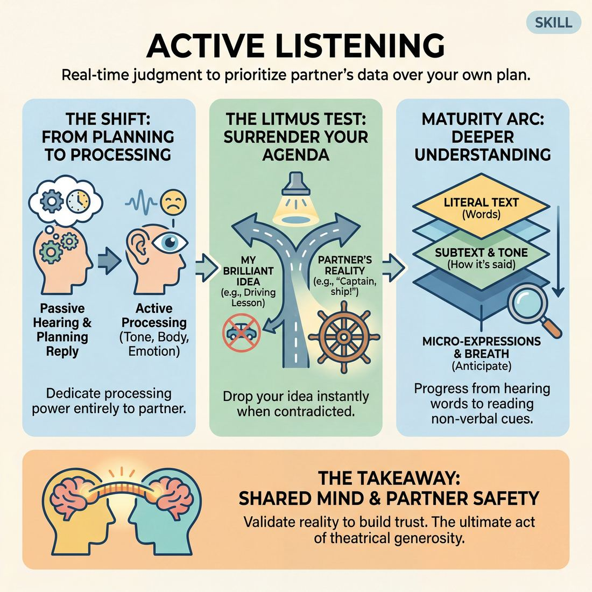
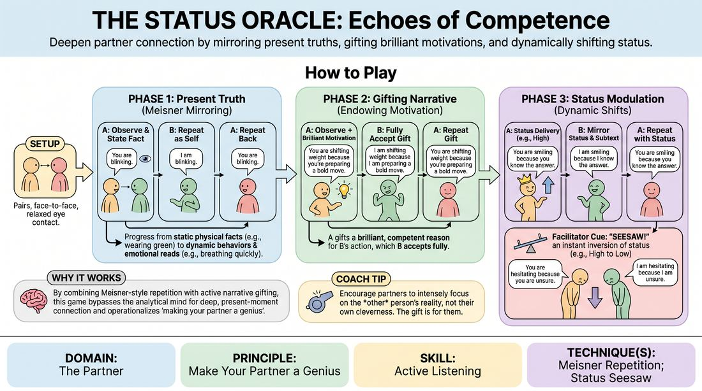
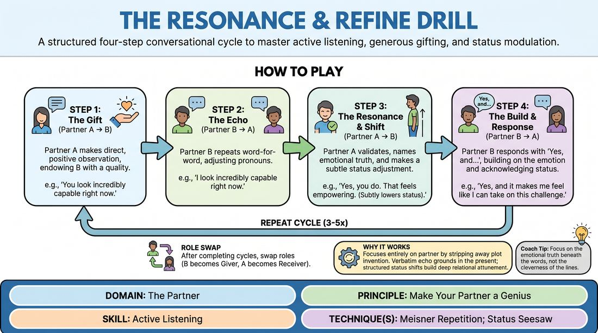

# Week 04 — Listening for Subtext
> *Hear what's underneath the words and build on the specific offer.*

| Course | Week | Domain | Focus | Stage |
|---|---|---|---|---|
| Choices Under Pressure — The Competent Improviser | 4/18 | D2 — The Partner | `D2.S1` — Active Listening | Competent |

## ⏱️ Session flow (60 minutes)

| Time | Block |
|---|---|
| **0:00–0:05** | 🤝 Arrival & safety check-in |
| **0:05–0:15** | 🔥 Warm-up — *The Status Oracle* |
| **0:15–0:27** | 🧠 Theory — *Active Listening* |
| **0:27–0:52** | 🎲 Game 1 — *Echo and Elevate* |
| **0:52–1:00** | 💭 Reflection & debrief |

## 1. 🧠 Today's theory

**Focus:** `D2.S1` — Active Listening  
**Maturity goal today:** Competent: build on the partner's *specific* offers.

{ .infographic }

- **The big idea:** Hear what's underneath the words and build on the specific offer.
- **Where you are on the path:** Competent: build on the partner's *specific* offers.
- **The one cue to coach:** *“What did they really mean? Build on that.”*

!!! abstract "📖 Go deeper"
    Read the full write-up: [Active Listening](../../content/02_the-partner/02_S1__active-listening.md)

## 2. 🎲 Today's games

#### Warm-up — The Status Oracle

> Deepen partner connection by mirroring present truths, gifting brilliant motivations, and dynamically shifting status.

{ .infographic }

`Players 2+` · `~20 min` · `Complexity 3/5` · `Energy medium` · `Props: none`

**Trains:** Active Listening · _connection_

**How to play**

1. Divide the group into pairs and have partners stand or sit facing each other at a comfortable distance, establishing steady, relaxed eye contact.
2. Begin Phase 1 (Present Truth): Partner A makes a simple, undeniable, present-tense observation about Partner B's physical reality (e.g., 'You are blinking' or 'You are wearing a green shirt').
3. Partner B immediately repeats the observation back, changing the pronoun to 'I' (e.g., 'I am wearing a green shirt'), which Partner A then repeats back to Partner B to lock in the loop.
4. Instruct Partner A to gradually transition their observations from static physical facts to dynamic behaviors and non-judgmental emotional reads (e.g., 'You are shifting your weight' or 'You look thoughtful').
5. Transition to Phase 2 (Gifting Narrative): Partner A now adds a brilliant, competent motivation to their observation, explaining why Partner B is doing what they are doing (e.g., 'You are shifting your weight because you are preparing to take a bold step forward').
6. Partner B must fully accept this endowment by repeating the entire statement as their own truth ('I am shifting my weight because I am preparing to take a bold step forward'), embodying the motivation instantly.
7. Transition to Phase 3 (Status Modulation): Partner A continues the observations and narrative gifts, but now delivers them with a distinct, embodied status offer (either elevating Partner B's status with deference, or lowering it with mild superiority).
8. Partner B accepts both the verbal gift and the status dynamic, mirroring the emotional subtext and physical posture of that status level in their repetition.
9. Introduce the 'Seesaw' cue: When the facilitator calls out 'Seesaw!', Partner A must instantly invert the status dynamic (e.g., shifting from high to low status), and Partner B must immediately adapt and mirror the new dynamic.

[Open the full game card »](../../games/D2_P3_S1_T1_G048__the-status-oracle-echoes-of-competence.md){target=_blank rel=noopener}

#### Core game — Echo and Elevate

> A structured four-step conversational cycle to master active listening, generous gifting, and status modulation.

{ .infographic }

`Players 2+` · `~10 min` · `Complexity 3/5` · `Energy low` · `Props: none`

**Trains:** Active Listening · _skill drill_

**How to play**

1. Divide the group into pairs, designating one player as Partner A (the Giver) and the other as Partner B (the Receiver) for the first round.
2. Step 1 (The Gift): Partner A makes a direct, positive observation about Partner B, endowing them with a specific quality, emotion, or capability (e.g., 'You look incredibly calm, like you have everything under control').
3. Step 2 (The Echo): Partner B repeats Partner A's statement word-for-word, adjusting only the pronouns to accept the endowment fully (e.g., 'I look incredibly calm, like I have everything under control').
4. Step 3 (The Resonance & Shift): Partner A validates Partner B's echo, names an underlying emotional truth, and makes a subtle, deliberate status adjustment—either stepping slightly up or down in relation to B (e.g., 'Yes, and that calm makes me feel safe enough to let go of my own worries').
5. Step 4 (The Build & Response): Partner B responds with a 'Yes, and...' statement that builds on the emotional truth while acknowledging and responding to Partner A's status shift (e.g., 'Yes, and I will make sure we both get through this safely').
6. Repeat this exact four-line cycle three to five times, allowing the content to evolve naturally from the previous cycle while maintaining the rigid structural pattern.
7. After completing the designated cycles, have the partners swap roles so Partner B becomes the Giver and Partner A becomes the Receiver.

[Open the full game card »](../../games/D2_P3_S1_T1_G150__the-resonance-refine-drill.md){target=_blank rel=noopener}

??? note "🎒 Backup games — if you have time, or a game falls flat"
    *Swap-ins drawn from the same maturity band; not part of the timed hour.*
    - **[The Subtext Echo Chamber](../../games/D2_P2_S1_T1_G211__the-echo-chamber-of-evolving-gifts.md){target=_blank rel=noopener}** — `2+` · `~5m` · `Cx 3/5` · `Energy low` · _Active Listening_
    - **[Choreographed Consensus](../../games/D2_P3_S1_T1_G309__the-choreographed-consensus.md){target=_blank rel=noopener}** — `2+` · `~15m` · `Cx 3/5` · `Energy medium` · _Active Listening_

## 3. 💭 Self-reflection

**Deepen your improv**
1. How did it feel to have your partner instantly assign a brilliant, deep motivation to your simple physical movements?
2. What physical cues did you rely on to detect your partner's status shifts before they even finished speaking?

**Beyond the stage**
3. Recall a meeting where you were loading your reply instead of listening. What did you miss? What would change if you reacted first and built second?

---
⬅️ *Previous:* [W03 — The Power of Stillness](week-03.md)  ·  *Next:* [W05 — The Status Seesaw](week-05.md) ➡️
