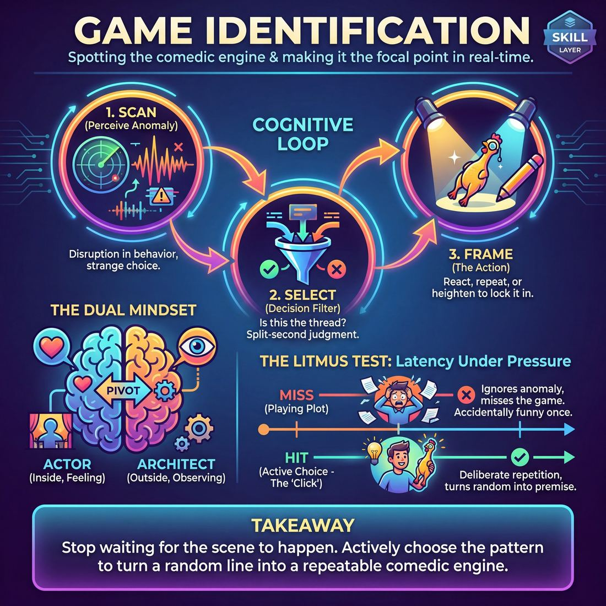

# Week 07 — Finding the Game
> *Spot the first unusual thing and make it the engine [GAME].*

| Course | Week | Domain | Focus | Stage |
|---|---|---|---|---|
| Choices Under Pressure — The Competent Improviser | 7/18 | D3 — The Scene | `D3.S1` — Game Identification | Competent |

!!! note "Builds on"
    W4–6 — a tuned partnership can now find and play a pattern.

## ⏱️ Session flow (60 minutes)

| Time | Block |
|---|---|
| 0:00–0:05 | Arrival & safety check-in |
| 0:05–0:15 | Warm-up game |
| 0:15–0:27 | **1. Today's theory** |
| 0:27–0:52 | **2. Today's games** |
| 0:52–1:00 | **3. Reflection & debrief** |

## 1. 🧠 Today's theory

**Focus:** `D3.S1` — Game Identification  
**Maturity goal today:** Competent: identify the game *during* the scene.

{ .infographic }

- **The big idea:** Spot the first unusual thing and make it the engine [GAME].
- **Where you are on the path:** Competent: identify the game *during* the scene.
- **The one cue to coach:** *“What's the one funny thing? Do it again.”*

!!! abstract "📖 Go deeper"
    Read the full write-up: [Game Identification](../../content/03_the-scene/03_S1__game-identification.md)

## 2. 🎲 Today's games

#### Warm-up — Premise Purge

> Strip away narrative clutter to isolate, commit to, and relentlessly escalate a single comedic game.

`Players 2+` · `~15 min` · `Complexity 3/5` · `Energy medium` · `Props: none`

**Trains:** Game Identification · _skill drill_

[Open the full game card »](../../games/D3_P2_S1_T1_G329__premise-purge-the-focus-enforcer.md)

#### Core game — The Pattern Weaver

> Spot the emerging comedic engine, call it out, and jump in to escalate it.

`Players 3+` · `~15 min` · `Complexity 3/5` · `Energy medium` · `Props: none`

**Trains:** Game Identification · _skill drill_

[Open the full game card »](../../games/D3_P0_S1_T1_G485__the-narrative-pattern-weaver.md)

??? note "🎒 Backup games — if you have time, or a game falls flat"
    *Swap-ins drawn from the same maturity band; not part of the timed hour.*
    - **[The Instant Spark](../../games/D3_P2_S1_T2_G590__the-rapid-ignition.md)** — `2+` · `~10m` · `Cx 3/5` · `Energy medium` · _Game Identification_
    - **[The Observation Audit](../../games/D3_P2_S1_T1_G753__krypton-factor.md)** — `3+` · `~15m` · `Cx 3/5` · `Energy medium` · _Game Identification_

## 3. 💭 Self-reflection

**Deepen your improv**
1. How did it feel to restart the scene with a singular, pre-determined focus compared to improvising completely in the dark?
2. What strategies did you use to reframe unexpected or 'off-game' offers so they fit the established premise?

**Beyond the stage**
3. Finding the game means spotting the one interesting pattern and committing. In a project or hobby, what's the 'unusual thing' worth amplifying instead of smoothing away?

---
⬅️ *Previous:* [W06 — Gifting that Serves](week-06.md)  ·  *Next:* [W08 — Heightening the Pattern](week-08.md) ➡️
