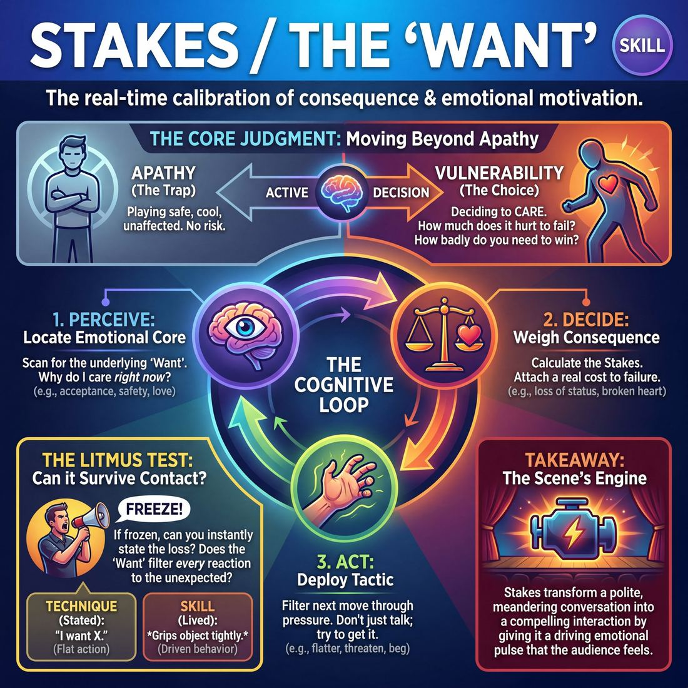
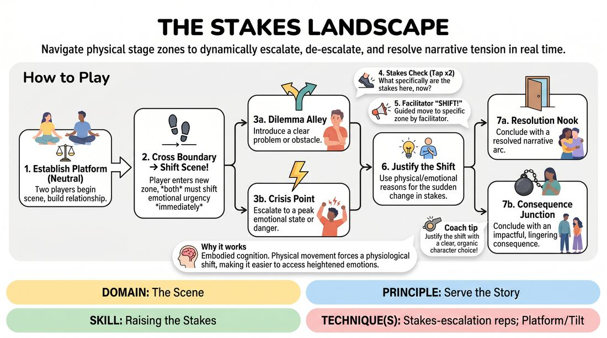

# Week 10 — What's at Stake
> *Give the character something to lose, so we care.*

| Course | Week | Domain | Focus | Stage |
|---|---|---|---|---|
| Choices Under Pressure — The Competent Improviser | 10/18 | D3 — The Scene | `D3.S4` — Stakes / The “Want” | Competent |

## ⏱️ Session flow (60 minutes)

| Time | Block |
|---|---|
| 0:00–0:05 | Arrival & safety check-in |
| 0:05–0:15 | Warm-up game |
| 0:15–0:27 | **1. Today's theory** |
| 0:27–0:52 | **2. Today's games** |
| 0:52–1:00 | **3. Reflection & debrief** |

## 1. 🧠 Today's theory

**Focus:** `D3.S4` — Stakes / The “Want”  
**Also touches:** `D3.S7` — Raising the Stakes  
**Maturity goal today:** Competent: establish what's at risk for the character.

{ .infographic }

- **The big idea:** Give the character something to lose, so we care.
- **Where you are on the path:** Competent: establish what's at risk for the character.
- **The one cue to coach:** *“What happens if they fail? Make it matter.”*

!!! abstract "📖 Go deeper"
    Read the full write-up: [Stakes / The “Want”](../../content/03_the-scene/03_S4__stakes-the-want.md)
    · [Raising the Stakes](../../content/03_the-scene/03_S7__raising-the-stakes.md)

## 2. 🎲 Today's games

#### Warm-up — The Truth Cascade

> Escalate dramatic tension instantly by justifying and integrating sudden, high-stakes narrative truths.

{ .infographic }

`Players 3+` · `~15 min` · `Complexity 3/5` · `Energy medium` · `Props: none`

**Trains:** Raising the Stakes · _narrative_

**How to play**

1. Invite two players to the stage to begin a grounded, realistic scene based on a simple relationship suggestion.
2. Allow the players to establish their characters, relationship, and environment naturally for about one to two minutes.
3. At a moment of potential stagnation or when a narrative shift is needed, the facilitator calls 'Freeze!' and both players halt mid-action.
4. The facilitator delivers a single, clear, declarative statement—a 'Cascade Truth'—that introduces a high-stakes obstacle or reveals a hidden motivation.
5. While remaining frozen, the players take a brief silent moment to process how this new truth logically fits into their established reality.
6. Upon the facilitator calling 'Unfreeze!', one or both players must immediately deliver dialogue that justifies how this truth is active in their world.
7. The players continue the scene, fully embodying the heightened stakes and allowing the new reality to dictate their emotional choices.
8. Repeat this freeze-and-reveal cycle two to three times, with each new truth building incrementally on the previous ones.
9. End the scene organically after the final escalation has been fully integrated and explored.

[Open the full game card »](../../games/D3_P4_S7_T1_G290__the-cascade.md)

#### Core game — Stakes Topography

> Navigate physical stage zones to dynamically escalate, de-escalate, and resolve narrative tension in real time.

{ .infographic }

`Players 2+` · `~15 min` · `Complexity 3/5` · `Energy medium` · `Props: required`

**Trains:** Raising the Stakes · _narrative_

**How to play**

1. Two players enter the 'Neutral Ground' zone and begin a scene, establishing their characters, relationship, and a basic platform.
2. As the scene progresses, players may physically step into an adjacent zone. The moment a player crosses a boundary, both players must immediately shift the scene's dramatic tension to match that zone's description.
3. If a player enters 'Dilemma Alley', they must introduce a clear problem or personal obstacle; if they enter 'Crisis Point', they must escalate the situation to an urgent, high-stakes emergency requiring immediate action.
4. To help players align, any player can tap the floor twice to initiate a 'Stakes Check', asking: 'What specifically are the stakes here, now?' The partner must instantly answer in character, clarifying the current dramatic urgency.
5. After players demonstrate comfort with self-directed movement, the facilitator introduces guided shifts by calling out 'SHIFT!' and pointing to a specific zone, forcing the players to move instantly and justify the sudden transition.
6. Players must use physical body language, emotional shifts, and dialogue to organically justify why their characters are suddenly experiencing the stakes of the new zone.
7. The scene concludes once the players navigate through a complete narrative arc, ending in either 'Resolution Nook' or 'Consequence Junction', and the facilitator calls 'Scene'.

[Open the full game card »](../../games/D3_P4_S7_T1_G306__the-stakes-landscape.md)

??? note "🎒 Backup games — if you have time, or a game falls flat"
    *Swap-ins drawn from the same maturity band; not part of the timed hour.*
    - **[The Pressure Cooker](../../games/D3_P4_S7_T1_G612__the-pressure-cooker.md)** — `3+` · `~10m` · `Cx 3/5` · `Energy medium` · _Raising the Stakes_
    - **[Undercurrents](../../games/D3_P1_S4_T1_G565__undercurrents.md)** — `2+` · `~15m` · `Cx 3/5` · `Energy medium` · _Stakes / The “Want”_

## 3. 💭 Self-reflection

**Deepen your improv**
1. How did receiving an external truth change your character's immediate objective or 'want'?
2. What strategies did you use to make a sudden, surprising truth feel like it had been there the entire time?

**Beyond the stage**
3. We care when something is at stake. In your goals this quarter, what do you genuinely stand to lose or gain — and are you letting yourself feel it?

---
⬅️ *Previous:* [W09 — The Story Spine](week-09.md)  ·  *Next:* [W11 — Which Engine? Game vs Story](week-11.md) ➡️
