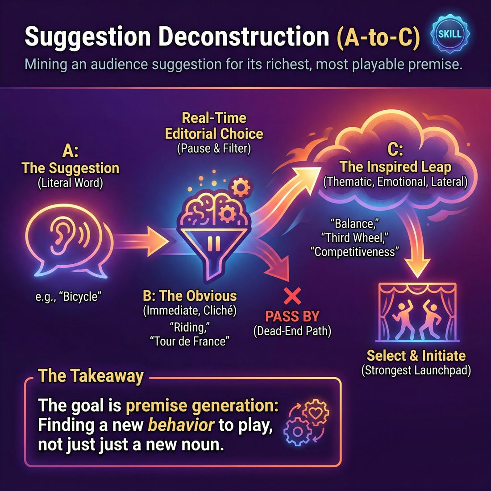
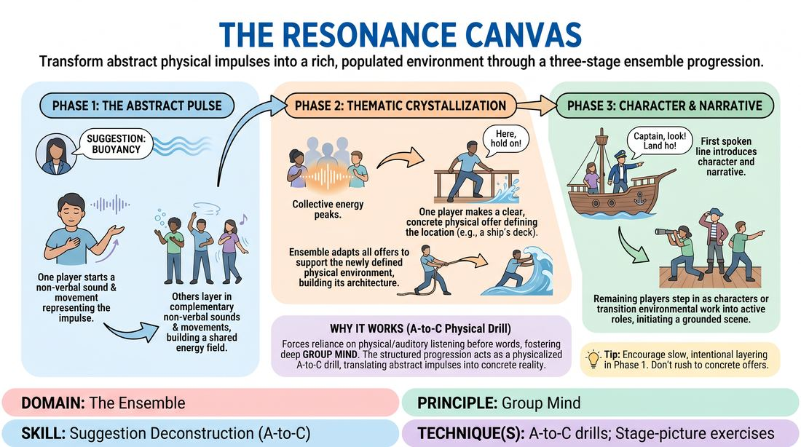
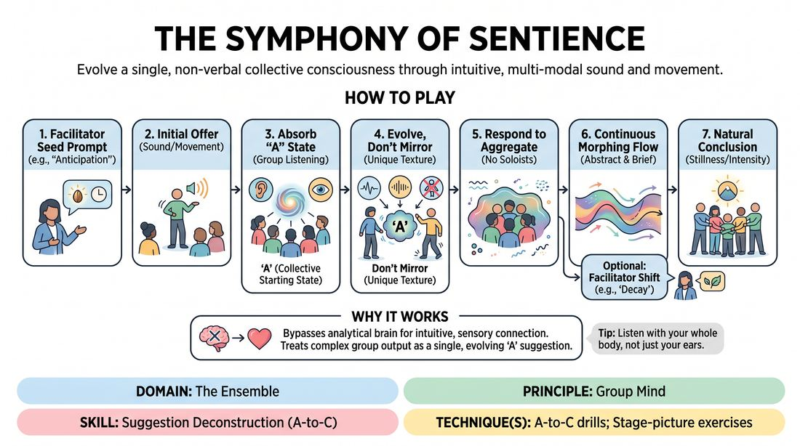

# Week 15 — A-to-C — Beyond the Obvious
> *Skip the first association; mine the suggestion for the 'C' idea.*

| Course | Week | Domain | Focus | Stage |
|---|---|---|---|---|
| Choices Under Pressure — The Competent Improviser | 15/18 | D4 — The Ensemble | `D4.S3` — Suggestion Deconstruction (A-to-C) | Competent |

## ⏱️ Session flow (60 minutes)

| Time | Block |
|---|---|
| **0:00–0:05** | 🤝 Arrival & safety check-in |
| **0:05–0:15** | 🔥 Warm-up — *The Resonance Canvas* |
| **0:15–0:27** | 🧠 Theory — *Suggestion Deconstruction (A-to-C)* |
| **0:27–0:52** | 🎲 Game 1 — *Symphony of Sentience* |
| **0:52–1:00** | 💭 Reflection & debrief |

## 1. 🧠 Today's theory

**Focus:** `D4.S3` — Suggestion Deconstruction (A-to-C)  
**Maturity goal today:** Competent: select the non-obvious ('C') premise.

{ .infographic }

- **The big idea:** Skip the first association; mine the suggestion for the 'C' idea.
- **Where you are on the path:** Competent: select the non-obvious ('C') premise.
- **The one cue to coach:** *“First thought's a gift — second and third are the game.”*

!!! abstract "📖 Go deeper"
    Read the full write-up: [Suggestion Deconstruction (A-to-C)](../../content/04_the-ensemble/04_S3__suggestion-deconstruction-a-to-c.md)

## 2. 🎲 Today's games

#### Warm-up — The Resonance Canvas

> Transform abstract physical impulses into a rich, populated environment through a three-stage ensemble progression.

{ .infographic }

`Players 3–7` · `~12 min` · `Complexity 3/5` · `Energy medium` · `Props: none`

**Trains:** Suggestion Deconstruction (A-to-C) · _mixed_

**How to play**

1. The facilitator provides a single, abstract suggestion representing a quality, force, or state (such as Friction, Buoyancy, or Decay).
2. Phase 1 (The Abstract Pulse): One player initiates a simple, repetitive, non-verbal sound or physical movement inspired by the suggestion, establishing a rhythmic baseline.
3. The remaining players gradually layer in their own unique, non-verbal sounds or movements that complement, contrast, or harmonize with the initial offer, building a unified, breathing soundscape.
4. Phase 2 (Thematic Crystallization): Once the abstract soundscape reaches a peak of collective energy, one player makes a clear, physical offer that defines a concrete environment or object represented by the sounds (such as transforming a rhythmic whoosh into pulling a heavy rowing oar).
5. The rest of the ensemble immediately adapts their physical and vocal offers to support this newly defined environment, building the physical architecture and ambient sounds of the specific location.
6. Phase 3 (Character & Narrative): With the physical environment fully established, a player introduces the first spoken line of dialogue, establishing a character who is directly reacting to or interacting with this specific setting.
7. The other players step into the space as characters or transition their environmental work into active roles, initiating a grounded, multi-character scene that honors the established atmosphere.

[Open the full game card »](../../games/D4_P1_S3_T1_G235__the-resonance-canvas.md){target=_blank rel=noopener}

#### Core game — Symphony of Sentience

> Evolve a single, non-verbal collective consciousness through intuitive, multi-modal sound and movement.

{ .infographic }

`Players 5–12` · `~15 min` · `Complexity 3/5` · `Energy medium` · `Props: none`

**Trains:** Suggestion Deconstruction (A-to-C) · _connection_

**How to play**

1. The facilitator provides an initial abstract prompt, such as 'anticipation' or 'decay', to serve as the seed of the collective consciousness.
2. One player initiates the exercise by offering a single, simple non-verbal sound or physical movement that represents their immediate reaction to the prompt.
3. The rest of the ensemble uses their peripheral vision and active listening to absorb this initial offer, treating it as the starting state ('A').
4. Instead of directly copying or mirroring the first offer, subsequent players contribute their own unique sounds or movements that logically evolve the collective state ('C').
5. Players must respond to the aggregate energy and texture of the entire group, rather than focusing on or reacting to just one individual's contribution.
6. All contributions must remain brief, abstract, and textural, ensuring no single player dominates the space or acts as a soloist.
7. The ensemble maintains a continuous, flowing dialogue of movement and sound, allowing the collective state to organically morph and transition.
8. The facilitator may occasionally call out a shifting prompt to guide the collective through a new emotional landscape, or let the evolution happen entirely organically.
9. The exercise concludes when the group reaches a natural point of stillness, high intensity, or resolution, at which point the facilitator calls a freeze.

[Open the full game card »](../../games/D4_P1_S3_T1_G096__the-symphony-of-sentience.md){target=_blank rel=noopener}

??? note "🎒 Backup games — if you have time, or a game falls flat"
    *Swap-ins drawn from the same maturity band; not part of the timed hour.*
    - **[Premise Kaleidoscope](../../games/D4_P1_S3_T2_G384__deep-dive-premise-weave.md){target=_blank rel=noopener}** — `4–8` · `~20m` · `Cx 3/5` · `Energy medium` · _Suggestion Deconstruction (A-to-C)_
    - **[The Resonance Tapestry](../../games/D4_P1_S3_T1_G470__the-collective-weave.md){target=_blank rel=noopener}** — `4–7` · `~30m` · `Cx 3/5` · `Energy medium` · _Suggestion Deconstruction (A-to-C)_

## 3. 💭 Self-reflection

**Deepen your improv**
1. How did transitioning through non-verbal phases change how you established the scene's base reality compared to starting with dialogue?
2. At what point did you feel the group mind click and align on a single, shared environment?

**Beyond the stage**
3. A-to-C thinking skips the obvious answer for the richer one. On your next problem, what's the third idea — past the first cliché — worth exploring?

---
⬅️ *Previous:* [W14 — Support Work that Lands](week-14.md)  ·  *Next:* [W16 — Editing on Time](week-16.md) ➡️
