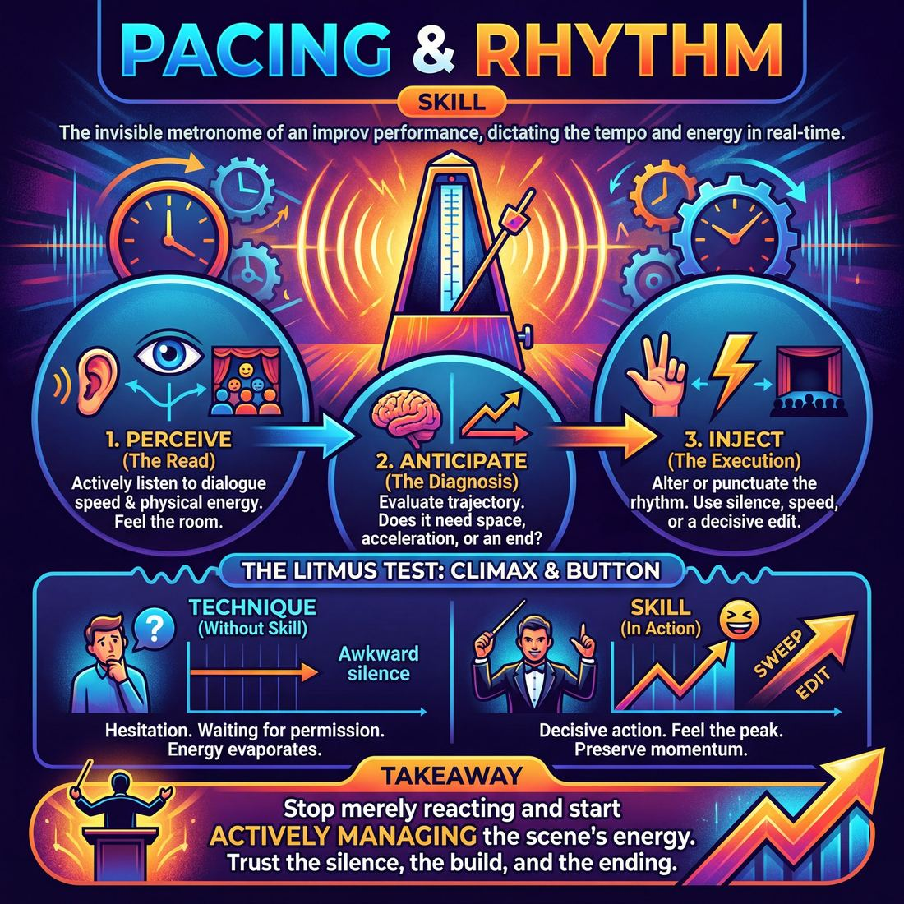

# Week 16 — Editing on Time
> *End the scene on its peak — Sweep, Tag-out, on the beat.*

| Course | Week | Domain | Focus | Stage |
|---|---|---|---|---|
| Choices Under Pressure — The Competent Improviser | 16/18 | D4 — The Ensemble | `D4.S4` — Pacing & Rhythm | Competent |

## ⏱️ Session flow (60 minutes)

| Time | Block |
|---|---|
| **0:00–0:05** | 🤝 Arrival & safety check-in |
| **0:05–0:15** | 🔥 Warm-up — *Rhythmic Resonance* |
| **0:15–0:27** | 🧠 Theory — *Pacing & Rhythm* |
| **0:27–0:52** | 🎲 Game 1 — *Resonance Bridges* |
| **0:52–1:00** | 💭 Reflection & debrief |

## 1. 🧠 Today's theory

**Focus:** `D4.S4` — Pacing & Rhythm  
**Maturity goal today:** Competent: edit at the right moment.

{ .infographic }

- **The big idea:** End the scene on its peak — Sweep, Tag-out, on the beat.
- **Where you are on the path:** Competent: edit at the right moment.
- **The one cue to coach:** *“Leave them wanting more. Cut on the laugh.”*

!!! abstract "📖 Go deeper"
    Read the full write-up: [Pacing & Rhythm](../../content/04_the-ensemble/04_S4__pacing-and-rhythm.md)

## 2. 🎲 Today's games

#### Warm-up — Rhythmic Resonance

> Shape and shift the stage's heartbeat through collective, non-verbal transitions and contrasting emotional tempos.

{ .infographic }

`Players 4–8` · `~7 min` · `Complexity 3/5` · `Energy medium` · `Props: none`

**Trains:** Pacing & Rhythm · _connection_

**How to play**

1. The facilitator obtains an abstract suggestion (e.g., 'Gravity' or 'Anticipation') to serve as the thematic anchor for the entire run.
2. One player steps into the space to initiate a brief vignette (30-60 seconds) inspired by the suggestion, immediately establishing a distinct physical tempo (e.g., frantic, sluggish, staccato) and emotional tone.
3. One or two other players may enter the space to support this initial scene, matching its established rhythm and emotional frequency.
4. While the active scene is still running, a player from the backline steps into a different part of the stage to initiate a brand-new, distinct vignette inspired by the same suggestion.
5. This new initiation must deliberately contrast the active scene's tempo and tone (e.g., shifting from a frantic, high-energy argument to a slow, melancholic silence).
6. The players in the original scene must immediately recognize this new initiation, cleanly dissolving their scene by freezing, melting into the background, or walking off stage without pulling focus.
7. The ensemble continues this cycle for 5 to 7 minutes, either entering the active scene to support its current rhythm or initiating a new 'cadence shift' to pivot the stage's energy.

[Open the full game card »](../../games/D4_P1_S4_T1_G288__rhythm-resonance.md){target=_blank rel=noopener}

#### Core game — Resonance Bridges

> Unify your ensemble by channeling the final energy of one scene into the next.

{ .infographic }

`Players 4–8` · `~20 min` · `Complexity 3/5` · `Energy medium` · `Props: none`

**Trains:** Pacing & Rhythm · _connection_

**How to play**

1. Two players step forward to initiate a scene based on the initial suggestion, establishing clear characters and relationships.
2. As the scene develops, the offstage players and facilitator actively track the emotional, physical, and rhythmic trajectory of the performance.
3. When the scene reaches a high-energy climax, a poignant realization, or a resonant silence, an offstage player executes a swift sweep edit.
4. Immediately upon the edit, the entire ensemble (both onstage and offstage players) takes a synchronized, deep, audible collective breath or a shared physical gesture.
5. For the next three to five seconds, every player silently and physically embodies the dominant emotional state, physical posture, or rhythmic pulse of the scene's final moment.
6. Two new players immediately step into the space, initiating the next scene by directly adopting, reacting to, or expanding upon this shared physical and emotional resonance.
7. The new scene must justify its high or low energy, rapid or slow pacing, and physical tension based on the inherited momentum, even if the characters and setting are entirely new.
8. Repeat this cycle of scene, edit, collective breath, physical resonance, and momentum-based initiation for four to five scenes to complete the run.

[Open the full game card »](../../games/D4_P1_S4_T1_G196__kinetic-transitions.md){target=_blank rel=noopener}

??? note "🎒 Backup games — if you have time, or a game falls flat"
    *Swap-ins drawn from the same maturity band; not part of the timed hour.*
    - **[Ensemble Snap](../../games/D4_P1_S4_T1_G511__sync-snap.md){target=_blank rel=noopener}** — `4–8` · `~25m` · `Cx 3/5` · `Energy medium` · _Pacing & Rhythm_
    - **[The Tempo Conductor](../../games/D4_P1_S4_T2_G536__the-rhythmic-collective.md){target=_blank rel=noopener}** — `4–8` · `~30m` · `Cx 3/5` · `Energy high` · _Pacing & Rhythm_

## 3. 💭 Self-reflection

**Deepen your improv**
1. How did it feel to let go of a scene based on a rhythmic shift rather than a narrative punchline?
2. What non-verbal cues made it obvious that a new scene was taking over the space?

**Beyond the stage**
3. Pacing is knowing when to end. Where in your work do you let things run long past their peak — meetings, projects, conversations? What would a clean 'edit' look like?

---
⬅️ *Previous:* [W15 — A-to-C — Beyond the Obvious](week-15.md)  ·  *Next:* [W17 — Reading the Room](week-17.md) ➡️
