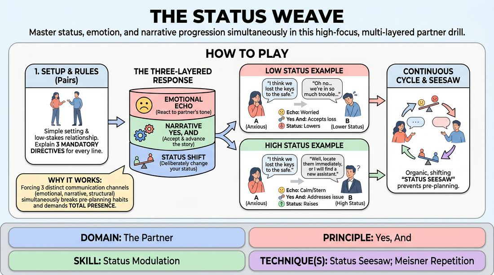
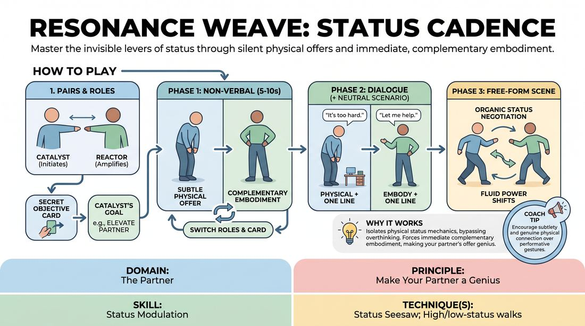

# Week 04 — Invisible Status
> *Status play that is purposeful — and unnoticed.*

| Course | Week | Domain | Focus | Stage |
|---|---|---|---|---|
| Serve the Piece — Toward Mastery | 4/18 | D2 — The Partner | `D2.S2` — Status Modulation | Proficient → Master |

## ⏱️ Session flow (60 minutes)

| Time | Block |
|---|---|
| 0:00–0:05 | Arrival & safety check-in |
| 0:05–0:15 | Warm-up game |
| 0:15–0:27 | **1. Today's theory** |
| 0:27–0:52 | **2. Today's games** |
| 0:52–1:00 | **3. Reflection & debrief** |

## 1. 🧠 Today's theory

**Focus:** `D2.S2` — Status Modulation  
**Maturity goal today:** Master: status shifts drive the story and go unnoticed.

{ .infographic }

- **The big idea:** Status play that is purposeful — and unnoticed.
- **Where you are on the path:** Master: status shifts drive the story and go unnoticed.
- **The one cue to coach:** *“Move the status to move the story.”*

!!! abstract "📖 Go deeper"
    Read the full write-up: [Status Modulation](../../content/02_the-partner/02_S2__status-modulation.md)

## 2. 🎲 Today's games

#### Warm-up — Status Weave

> Master status, emotion, and narrative progression simultaneously in this high-focus, multi-layered partner drill.

{ .infographic }

`Players 2+` · `~8 min` · `Complexity 4/5` · `Energy medium` · `Props: none`

**Trains:** Status Modulation · _skill drill_

**How to play**

1. Divide the group into pairs, standing face-to-face, and assign a simple, low-stakes relationship and setting.
2. Explain the three mandatory directives for every single line of dialogue: 1) Emotional Echo (mirror or directly react to the partner's emotional tone), 2) Yes-And (accept the factual reality and add a new detail), and 3) Status Shift (intentionally raise or lower your relative status).
3. Provide a concrete example of these three directives in action. If Player A says anxiously, 'I think we lost the keys to the safe,' Player B might respond with a low-status, anxious echo and a narrative addition: 'Oh no, I'm so terrified too (Echo)! I actually dropped them down the drain (Yes-And), and I am such an idiot for ruining our day (Lowering Status).'
4. Provide a contrasting high-status example. If Player A says anxiously, 'I think we lost the keys to the safe,' Player B might respond with a high-status, calm/dismissive echo and a narrative addition: 'Your panic is completely justified (Echo), but I already hired a locksmith who is on his way (Yes-And), so step aside and let me handle this (Raising Status).'
5. Begin the scene with Player A making a simple, emotionally grounded opening statement.
6. Player B takes a deliberate breath, identifies the emotion, and delivers their line satisfying all three directives, using physical posture and vocal tone to support the status shift.
7. Player A receives this new offer and responds in kind, continuing the cycle to create an organic, shifting status seesaw.
8. If players struggle with the cognitive load, scaffold the exercise by starting with only one directive (e.g., Emotional Echo) for one minute, then layering on the second, and finally the third.

[Open the full game card »](../../games/D2_P2_S2_T1_G459__the-status-weave.md)

#### Core game — Status Architects

> Master the invisible levers of status through silent physical offers and immediate, complementary embodiment.

{ .infographic }

`Players 2+` · `~30 min` · `Complexity 3/5` · `Energy medium` · `Props: required`

**Trains:** Status Modulation · _skill drill_

**How to play**

1. Form pairs and stand facing each other at an arm's length, designating one player as the Catalyst and the other as the Reactor.
2. The Catalyst secretly draws a Secret Objective Card detailing their status goal (e.g., 'Elevate your partner's status' or 'Lower your own status').
3. Phase 1: The Catalyst initiates a single, subtle, non-verbal physical action over 5 to 10 seconds to achieve their secret objective.
4. The Reactor immediately responds physically, embodying the complementary status to validate and complete the Catalyst's offer.
5. After a brief pause, the facilitator calls 'Switch' to reverse the roles with a new secret objective card.
6. Phase 2: Introduce a neutral scenario. The Catalyst performs their physical offer, then delivers a single line of dialogue supporting their status choice.
7. The Reactor physically embodies their response, then delivers a single line of dialogue that accepts and builds upon the Catalyst's offer.
8. Phase 3: Remove the cards and roles. Players run a free-form scene where they organically negotiate status, letting the power balance shift fluidly.

[Open the full game card »](../../games/D2_P3_S2_T1_G024__resonance-weave-status-cadence.md)

??? note "🎒 Backup games — if you have time, or a game falls flat"
    *Swap-ins drawn from the same maturity band; not part of the timed hour.*
    - **[The Living Blueprint](../../games/D2_P2_S2_T1_G277__the-living-blueprint.md)** — `2+` · `~10m` · `Cx 3/5` · `Energy medium` · _Status Modulation_
    - **[Relational Resonance](../../games/D2_P3_S2_T1_G354__the-relational-resonance.md)** — `4+` · `~20m` · `Cx 3/5` · `Energy medium` · _Status Modulation_

## 3. 💭 Self-reflection

**Deepen your improv**
1. Which of the three directives (emotion, narrative, or status) felt most natural to integrate, and which felt like the biggest cognitive hurdle?
2. How did tracking your partner's emotional state change the way you played status?

**Beyond the stage**
3. Status is something we do, not who we are. Where do you habitually play high or low at work — and where would deliberately shifting it serve the relationship?

---
⬅️ *Previous:* [W03 — The Shared Mind](week-03.md)  ·  *Next:* [W05 — Find It, Play It, Break It](week-05.md) ➡️
