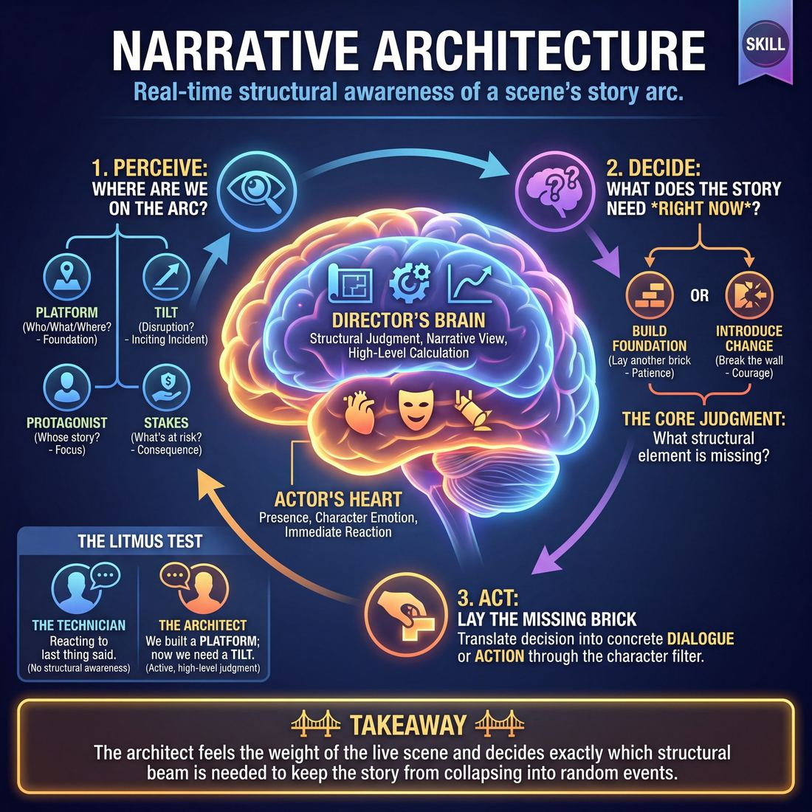
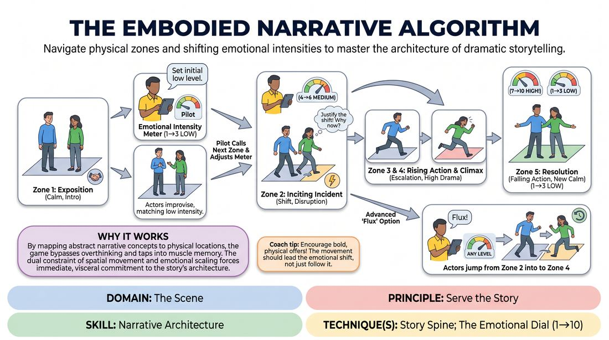
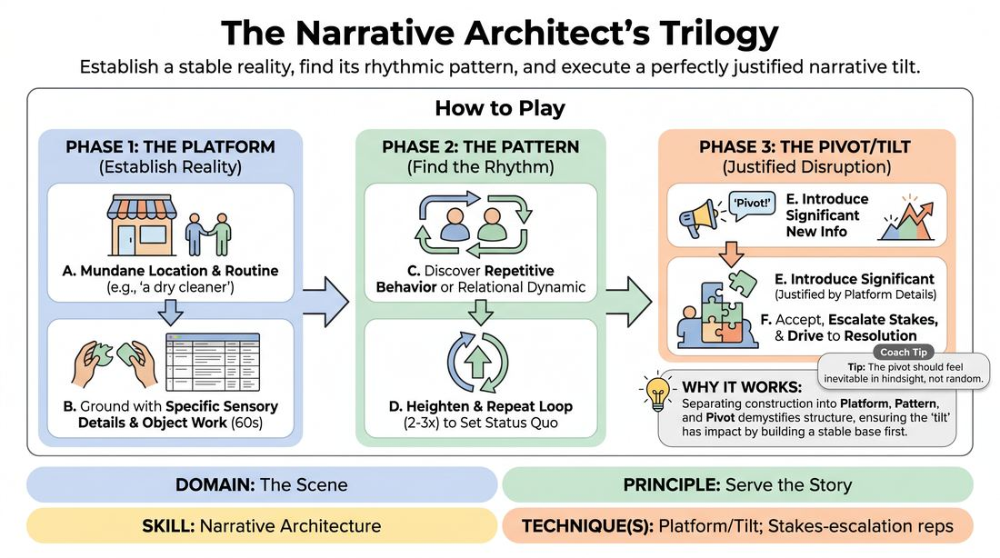

# Week 06 — Architecting the Arc
> *A full arc with consequence and change, built in real time.*

| Course | Week | Domain | Focus | Stage |
|---|---|---|---|---|
| Serve the Piece — Toward Mastery | 6/18 | D3 — The Scene | `D3.S3` — Narrative Architecture | Proficient → Master |

## ⏱️ Session flow (60 minutes)

| Time | Block |
|---|---|
| 0:00–0:05 | Arrival & safety check-in |
| 0:05–0:15 | Warm-up game |
| 0:15–0:27 | **1. Today's theory** |
| 0:27–0:52 | **2. Today's games** |
| 0:52–1:00 | **3. Reflection & debrief** |

## 1. 🧠 Today's theory

**Focus:** `D3.S3` — Narrative Architecture  
**Maturity goal today:** Master: arc and character change feel inevitable.

{ .infographic }

- **The big idea:** A full arc with consequence and change, built in real time.
- **Where you are on the path:** Master: arc and character change feel inevitable.
- **The one cue to coach:** *“Every scene changes someone. Who, and how?”*

!!! abstract "📖 Go deeper"
    Read the full write-up: [Narrative Architecture](../../content/03_the-scene/03_S3__narrative-architecture.md)

## 2. 🎲 Today's games

#### Warm-up — Spatial Story Engine

> Navigate physical zones and shifting emotional intensities to master the architecture of dramatic storytelling.

{ .infographic }

`Players 3+` · `~20 min` · `Complexity 4/5` · `Energy medium` · `Props: required`

**Trains:** Narrative Architecture · _narrative_

**How to play**

1. Assign 2-3 players as the Scene Actors and 1 player (or the facilitator) as the Narrative Pilot. The remaining participants observe as active audience members.
2. The Scene Actors begin in Zone 1 (Exposition). The Narrative Pilot sets the Emotional Intensity Meter to a low level (typically 1 to 3).
3. The Scene Actors begin improvising a scene, establishing their characters, relationship, and the initial status quo, keeping their emotional output aligned with the low intensity setting.
4. The Narrative Pilot closely monitors the scene's organic development. When they feel the current structural beat has been fully explored, they call out the next zone (e.g., 'Zone 2!') and simultaneously adjust the Emotional Intensity Meter (e.g., sliding it up to 5).
5. Upon hearing the call, the Scene Actors must immediately move physically into the designated zone and adjust their performance to match both the new structural stage and the new emotional intensity level.
6. The Scene Actors must instantly justify this shift within the narrative, explaining through dialogue or physical action why their characters are suddenly experiencing heightened emotion or a shift in stakes.
7. The Pilot continues to guide the players sequentially through the zones (Zone 3, Zone 4, Zone 5), adjusting the intensity meter dynamically to match the rising and falling action of the story.
8. For advanced play, the Pilot can call 'Flux!' and jump to a non-sequential zone (e.g., jumping from Zone 2 directly to Zone 4, or back to Zone 1 for a flashback), forcing the players to rapidly adapt and justify the non-linear narrative leap.

[Open the full game card »](../../games/D3_P4_S3_T1_G083__the-embodied-narrative-algorithm.md)

#### Core game — Platform, Pattern, Pivot

> Establish a stable reality, find its rhythmic pattern, and execute a perfectly justified narrative tilt.

{ .infographic }

`Players 2+` · `~30 min` · `Complexity 4/5` · `Energy medium` · `Props: none`

**Trains:** Narrative Architecture · _narrative_

**How to play**

1. Two players take the stage and receive a simple, mundane location suggestion that implies a routine activity (e.g., 'a dry cleaner' or 'a community garden').
2. Phase 1 (The Platform): Players spend the first 60 seconds establishing a grounded base reality using specific sensory details and physical object work, deliberately avoiding any immediate conflict.
3. Phase 2 (The Pattern): Players identify and lean into a repetitive behavioral loop or relational dynamic that naturally emerges from their interaction (e.g., one player constantly seeking approval, or a repetitive physical task).
4. The players repeat and heighten this pattern two to three times to firmly establish the scene's status quo for the audience.
5. Phase 3 (The Pivot/Tilt): On the facilitator's cue 'Pivot!' (or self-initiated once proficient), the player currently speaking introduces a significant piece of new information or a radical choice.
6. This pivot must be fully justified, drawing directly from the established details or character dynamics of the platform rather than introducing an arbitrary external event.
7. The players immediately accept the pivot, letting it permanently disrupt the pattern and escalate the emotional stakes of the scene.
8. The scene continues under this new, heightened reality, driving toward a logical resolution based on the consequences of the pivot.

[Open the full game card »](../../games/D3_P4_S3_T2_G005__the-narrative-architect-s-trilogy.md)

??? note "🎒 Backup games — if you have time, or a game falls flat"
    *Swap-ins drawn from the same maturity band; not part of the timed hour.*
    - **[Disaster Movie](../../games/D3_P4_S3_T1_G1022__disaster-movie.md)** — `6+` · `~30m` · `Cx 4/5` · `Energy high` · _Narrative Architecture_
    - **[Memorial Service](../../games/D3_P4_S3_T0_G1089__funeral-service.md)** — `4+` · `~20m` · `Cx 4/5` · `Energy medium` · _Narrative Architecture_

## 3. 💭 Self-reflection

**Deepen your improv**
1. How did physically moving to a new zone change your mental approach to the story's progression?
2. What strategies did you use to instantly justify a sudden jump in emotional intensity?

**Beyond the stage**
3. Every good story has a platform and a tilt — a normal, then a change. What 'platform' in your life are you protecting that actually needs a deliberate tilt?

---
⬅️ *Previous:* [W05 — Find It, Play It, Break It](week-05.md)  ·  *Next:* [W07 — Stakes They Can Feel](week-07.md) ➡️
