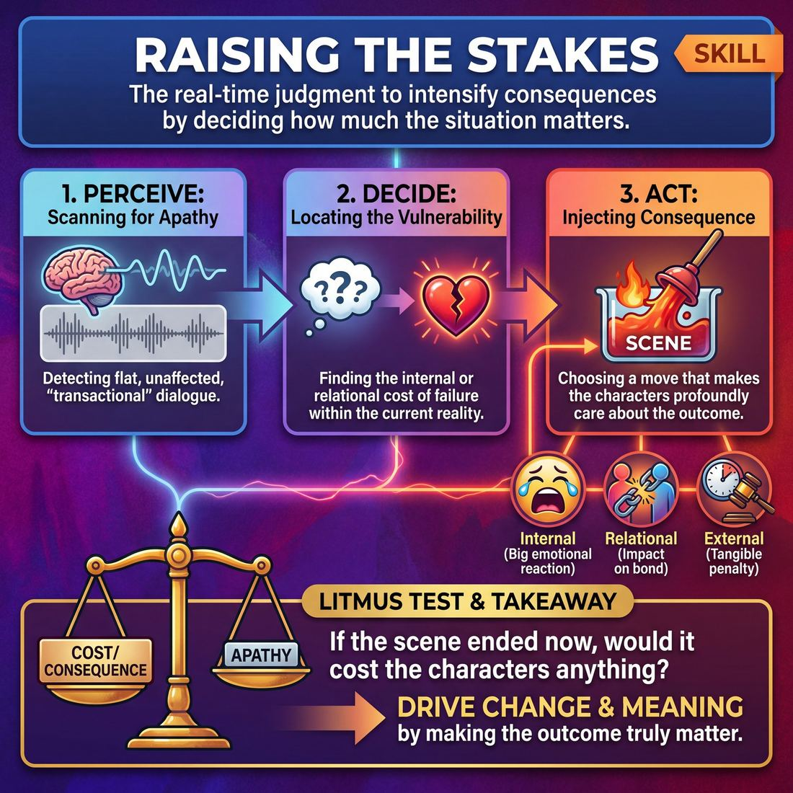

# Week 07 — Stakes They Can Feel
> *Make the audience genuinely care about absurd people.*

| Course | Week | Domain | Focus | Stage |
|---|---|---|---|---|
| Serve the Piece — Toward Mastery | 7/18 | D3 — The Scene | `D3.S7` — Raising the Stakes | Proficient → Master |

## ⏱️ Session flow (60 minutes)

| Time | Block |
|---|---|
| 0:00–0:05 | Arrival & safety check-in |
| 0:05–0:15 | Warm-up game |
| 0:15–0:27 | **1. Today's theory** |
| 0:27–0:52 | **2. Today's games** |
| 0:52–1:00 | **3. Reflection & debrief** |

## 1. 🧠 Today's theory

**Focus:** `D3.S7` — Raising the Stakes  
**Also touches:** `D3.S4` — Stakes / The “Want”  
**Maturity goal today:** Master: stakes are felt, not stated; consequences escalate.

{ .infographic }

- **The big idea:** Make the audience genuinely care about absurd people.
- **Where you are on the path:** Master: stakes are felt, not stated; consequences escalate.
- **The one cue to coach:** *“Don't say it matters. Show that it costs.”*

!!! abstract "📖 Go deeper"
    Read the full write-up: [Raising the Stakes](../../content/03_the-scene/03_S7__raising-the-stakes.md)
    · [Stakes / The “Want”](../../content/03_the-scene/03_S4__stakes-the-want.md)

## 2. 🎲 Today's games

#### Warm-up — Consequence Countdown

> Escalate narrative tension under rapid-fire time constraints and high-stakes external consequences.

`Players 2+` · `~10 min` · `Complexity 3/5` · `Energy high` · `Props: none`

**Trains:** Raising the Stakes · _narrative_

[Open the full game card »](../../games/D3_P4_S7_T1_G308__stakes-ascent-the-consequence-countdown.md)

#### Core game — The Shifting Want

> Drive narrative momentum by continuously evolving character objectives and raising what they stand to lose.

`Players 2+` · `~15 min` · `Complexity 3/5` · `Energy medium` · `Props: none`

**Trains:** Stakes / The “Want” · _narrative_

[Open the full game card »](../../games/D3_P4_S4_T1_G404__the-shifting-want.md)

??? note "🎒 Backup games — if you have time, or a game falls flat"
    *Swap-ins drawn from the same maturity band; not part of the timed hour.*
    - **[The Implication Engine](../../games/D3_P4_S7_T1_G317__the-implication-engine.md)** — `3–6` · `~10m` · `Cx 3/5` · `Energy medium` · _Raising the Stakes_
    - **[The Narrative Escalator](../../games/D3_P4_S7_T1_G186__the-narrative-escalator.md)** — `2+` · `~15m` · `Cx 3/5` · `Energy medium` · _Raising the Stakes_

## 3. 💭 Self-reflection

**Deepen your improv**
1. How did the introduction of a ticking clock change your physical energy and decision-making on stage?
2. What strategies did you use to justify the increasingly absurd or extreme consequences within the reality of your scene?

**Beyond the stage**
3. Raising the stakes makes consequences matter more. Where are you keeping things low-stakes to stay comfortable, when the situation actually deserves more weight?

---
⬅️ *Previous:* [W06 — Architecting the Arc](week-06.md)  ·  *Next:* [W08 — Engine-Switching Mid-Scene](week-08.md) ➡️
