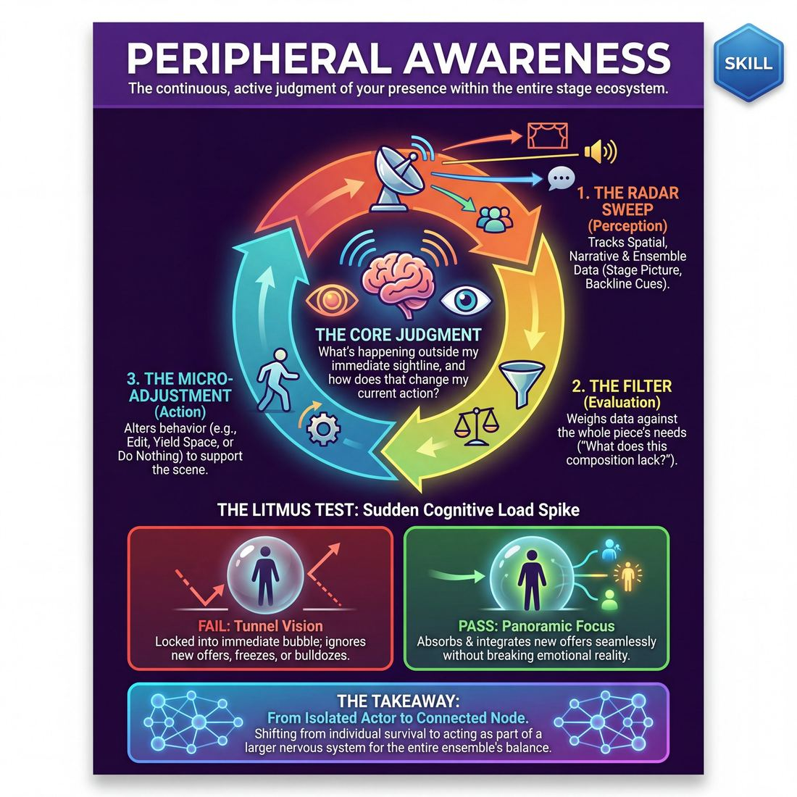

# Week 09 — Group Mind & Follow the Follower
> *See the entire show as one organism; commit to strong choices together.*

| Course | Week | Domain | Focus | Stage |
|---|---|---|---|---|
| Serve the Piece — Toward Mastery | 9/18 | D4 — The Ensemble | `D4.S1` — Peripheral Awareness | Proficient → Master |

!!! note "Builds on"
    Intermediate W13 — peripheral awareness becomes group mind.

## ⏱️ Session flow (60 minutes)

| Time | Block |
|---|---|
| 0:00–0:05 | Arrival & safety check-in |
| 0:05–0:15 | Warm-up game |
| 0:15–0:27 | **1. Today's theory** |
| 0:27–0:52 | **2. Today's games** |
| 0:52–1:00 | **3. Reflection & debrief** |

## 1. 🧠 Today's theory

**Focus:** `D4.S1` — Peripheral Awareness  
**Maturity goal today:** Master: see the whole show as one organism.

{ .infographic }

- **The big idea:** See the entire show as one organism; commit to strong choices together.
- **Where you are on the path:** Master: see the whole show as one organism.
- **The one cue to coach:** *“When someone's strong, the whole team follows.”*

!!! abstract "📖 Go deeper"
    Read the full write-up: [Peripheral Awareness](../../content/04_the-ensemble/04_S1__peripheral-awareness.md)

## 2. 🎲 Today's games

#### Warm-up — The Echo-Scape Weave

> Weave environment, movement, and dialogue into a deeply interconnected, multi-layered collective reality.

`Players 4–8` · `~20 min` · `Complexity 4/5` · `Energy medium` · `Props: none`

**Trains:** Peripheral Awareness · _mixed_

[Open the full game card »](../../games/D4_P1_S1_T2_G017__the-echo-scape-weave.md)

#### Core game — The Living Grid

> Co-create and evolve the very rules of your performance format in real-time, completely non-verbally.

`Players 4–8` · `~60 min` · `Complexity 4/5` · `Energy medium` · `Props: none`

**Trains:** Peripheral Awareness · _skill drill_

[Open the full game card »](../../games/D4_P1_S1_T2_G002__the-emergent-canvas.md)

??? note "🎒 Backup games — if you have time, or a game falls flat"
    *Swap-ins drawn from the same maturity band; not part of the timed hour.*
    - **[The Sensory Loom](../../games/D4_P1_S1_T2_G026__the-ensemble-loom.md)** — `4–8` · `~30m` · `Cx 4/5` · `Energy medium` · _Peripheral Awareness_
    - **[Resonant Currents](../../games/D4_P1_S1_T2_G037__nexus-arc-the-silent-current.md)** — `5–8` · `~25m` · `Cx 4/5` · `Energy medium` · _Peripheral Awareness_

## 3. 💭 Self-reflection

**Deepen your improv**
1. How did starting with a silent, physical environment change the way you approached your character and dialogue?
2. What did it feel like to track and synthesize multiple threads at once during Phase 3? Where did you feel the most cognitive friction?

**Beyond the stage**
3. Group mind means the team's intelligence exceeds any individual's. When have you seen a group outperform its smartest member — and what made that possible?

---
⬅️ *Previous:* [W08 — Engine-Switching Mid-Scene](week-08.md)  ·  *Next:* [W10 — Invisible Support, Surrendered Ego](week-10.md) ➡️
