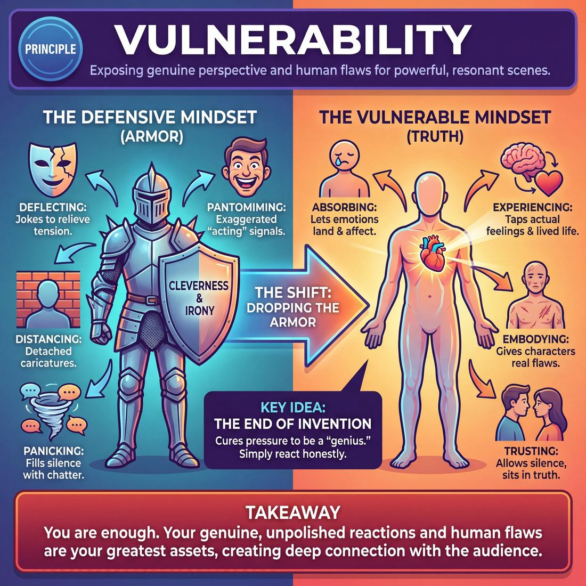

# 💎 Vulnerability

> *Relationship to truth — the best work comes from exposing your real perspective and flaws.*

{ .infographic }

## 💎 The core belief

At its core, the principle of **vulnerability** is the conviction that the most resonant, compelling improvisation comes from exposing your genuine perspective and human flaws. It is the fundamental belief that truth is always more powerful—and ultimately funnier—than pure invention. 

When improvisers step on stage, the natural instinct is often to protect themselves from judgment. They armor up, hiding behind a shield of rapid-fire cleverness, thick irony, or loud, two-dimensional caricatures. Vulnerability demands that we drop this armor. It requires the courage to let the audience see you *feeling* something real, allowing your actual emotional life and authentic reactions to bleed into the fictional circumstances of the scene.

Unpacking this belief reveals a profound shift in how a performer views their own worth on stage. It asserts that *you are enough*—that your lived experience, your actual point of view, and your unpolished, spontaneous reactions are the greatest assets you possess. By allowing yourself to be genuinely affected by a scene partner, to be caught off guard, or to play a character who shares your own quiet insecurities, you bridge the gap between the stage and the seats. Audiences rarely connect deeply with a flawless, joke-generating machine; they connect with recognizable humanity. Vulnerability is the quiet discipline of bringing your true self to the work, trusting that the audience will see their own reflection in your honesty.

!!! abstract "The relationship to truth"
    Vulnerability is not about oversharing personal trauma or forcing yourself to cry on stage. It is simply the willingness to be **seen trying, failing, and caring** in front of strangers, rather than pretending you are above it all.

## 🌱 Why it governs everything

When an improviser truly internalizes vulnerability, their entire operating system changes. The fundamental engine of their scenework shifts from *inventing something clever* to *revealing something true*. 

Before this principle takes root, a performer’s primary instinct is usually self-protection. The stage feels dangerous, so they wear **armor**. In improv, armor takes the form of deflection, gagging, playing emotionally detached "cool" characters, or rushing to fill silence with chatter. The performer works incredibly hard to ensure the audience knows they are in on the joke, terrified of looking foolish or being caught without an idea.

Once vulnerability becomes the governing value, that armor drops. The performer accepts that looking foolish, being caught off-guard, and experiencing genuine emotional stakes are not failures—they are the exact material the audience came to see. 

This belief governs everything because it acts as a ruthless filter for every choice you make on stage. When you value truth over cleverness, your behavior transforms:

| The Defensive Mindset (Armor) | The Vulnerable Mindset (Truth) |
| :--- | :--- |
| **Deflecting:** Cracking a joke to relieve the tension of a serious moment. | **Absorbing:** Letting the emotional hit land, even if it makes you look weak or foolish. |
| **Pantomiming:** "Acting" sad or angry by using exaggerated, cartoonish signals. | **Experiencing:** Tapping into your own actual emotional reserves and lived experiences. |
| **Distancing:** Playing characters as two-dimensional caricatures to keep them at arm's length. | **Embodying:** Giving your characters your own real flaws, fears, and perspectives. |
| **Panicking:** Rushing to speak because silence feels like a void of ideas. | **Trusting:** Allowing silence to sit, knowing it reveals the unspoken relationship. |

!!! abstract "Key idea: The end of invention"
    The greatest gift of vulnerability is that it cures the pressure to be a genius. When you no longer have to invent brilliant, witty fiction out of thin air, you are free to simply react honestly to what is happening right in front of you. 

Because vulnerability demands that you use *yourself* as the primary instrument, it eliminates hesitation. You stop second-guessing whether an idea is "good enough" or "funny enough," and instead ask, "Is this how I actually feel?" This shift grants the performer complete physical and vocal freedom—the courage to stand still, look your scene partner in the eye, and let yourself be entirely seen.

## 👀 How it shows up

While vulnerability is an internal conviction, it produces immediate, undeniable physical and vocal changes on stage. When an improviser truly believes that their unvarnished self is enough, the physical and verbal habits used to protect the ego melt away. 

To a coach or an audience member, a vulnerable improviser looks entirely different from a guarded one. You can spot this conviction through several key behavioral markers:

*   **Physical stillness:** Guarded players pace, fidget, or shift their weight to burn off nervous energy. Vulnerable players have the discipline to stand completely still, trusting that their mere presence is compelling.
*   **Sustained eye contact:** Rather than looking at their partner's forehead or scanning the back wall, they look directly into their partner’s eyes, allowing themselves to truly see and be seen.
*   **Emotional permeability:** When a scene partner delivers a line, a vulnerable player lets it land. You can physically see the words affect them—a flinch, a softening of the shoulders, a genuine blush—before they formulate a response. 
*   **Unironic commitment:** They drop the "cool" factor. They are willing to play characters who are low-status, foolish, heartbroken, or deeply uncool, without **winking at the audience** (subtly signaling *“I know this is silly, I’m just acting”*).

As an improviser internalizes this principle, their observable behavior evolves from forced attempts at depth to effortless authenticity.

| Stage | What the audience sees |
| :--- | :--- |
| **Novice** | Pausing before speaking. Holding eye contact even when it feels awkward. Resisting the urge to immediately break a tense silence with a joke. |
| **Intermediate** | Playing characters with real, recognizable flaws. Showing genuine emotional reactions (anger, sadness, joy) rather than pantomiming them. |
| **Master** | Complete physical and vocal relaxation, even in high-stakes scenes. Using their own real-life micro-expressions and perspectives. A total absence of defensive irony. |

!!! example "In a scene: The difference it makes"
    **The Setup:** Player A says, *"I didn't invite you because you always make it about yourself."*
    
    **The Guarded Reaction:** Player B immediately deflects to protect their ego. They cross their arms, roll their eyes, and snap back with a witty, detached insult: *"Well, your parties have cheap wine anyway."* The audience laughs, but the scene remains shallow.
    
    **The Vulnerable Reaction:** Player B takes a breath. They let the insult sting. Their shoulders drop slightly, they look down, and then back up with genuine hurt. *"I didn't know I was doing that."* The audience leans in, completely captivated by the sudden, raw reality of the moment.

!!! tip "On stage"
    If you want to project vulnerability immediately, check your hands. Guarded improvisers often cross their arms, put their hands in their pockets, or hold them rigidly at their sides. Let your arms hang loosely and keep your chest open to your partner. Physical openness breeds emotional openness.

## 🧪 Living it in practice

Vulnerability is not a passive state you simply decide to enter; it is a muscle that must be deliberately trained. Because our daily lives require us to wear social armor—to look competent, unbothered, and in control—stepping on stage without that armor requires active, conscious practice. 

To internalize this principle, improvisers must cultivate specific mindsets and run drills that systematically dismantle their defenses.

### Mindsets to cultivate

*   **Play close to self:** This is the practice of lending your actual lived experiences, genuine opinions, and real flaws to your characters. If your character is heartbroken, you don't play a cartoon of sadness; you access a sliver of your own real grief. 
*   **Embrace the "I don't know":** The need to be clever is a defense mechanism. Vulnerability means stepping into a scene without a plan, trusting that your raw, unfiltered reaction to your partner will be enough.
*   **Let yourself be altered:** An armored improviser decides how they feel and sticks to it. A vulnerable improviser allows their partner’s words to genuinely change their emotional state in real time.

!!! tip "On stage: Drop the joke"
    When you feel the sudden urge to make a witty, deflating comment during a tense or emotional scene, recognize that urge for what it is: armor. The joke is a way to protect yourself from the tension. Swallow the joke, stay in the emotion, and let the audience see you care.

### Drills for the rehearsal room

You can actively train the capacity to be seen through targeted exercises:

1.  **The "I Believe" Monologue:** One improviser stands center stage and delivers five sentences, each starting with "I believe..." Every statement must be entirely true to the performer, and they are not allowed to use irony or jokes. It trains the terrifying act of simply standing in your own truth.
2.  **Extended Eye Contact:** Before initiating a scene, two improvisers stand in silence and maintain unbroken eye contact for 30 to 60 seconds. It strips away the safety of words and forces performers to connect as humans before they connect as characters.
3.  **True Confessions / Hot Spot:** When stepping out to sing or share a story off a suggestion, performers are coached to share a memory where they were at fault, embarrassed, or petty. Practicing the exposure of minor flaws builds the courage needed for major emotional risks.

### The skills it animates

As a foundational principle, vulnerability acts as the fuel for several critical improv techniques. Without it, these skills feel hollow and mechanical; with it, they become magnetic.

| Technique | Without Vulnerability (Armored) | With Vulnerability (Open) |
| :--- | :--- | :--- |
| **Silence / Pauses** | Rushing to fill the void with words or frantic pacing to avoid the tension. | Letting the silence hang; allowing the audience to watch you process a thought or feeling. |
| **Emotional Reactions** | Faking a big, cartoonish emotion that doesn't reach the eyes. | Letting your partner's words actually sting, delight, or confuse you before you respond. |
| **Status Play** | Refusing to play low-status because it feels weak or embarrassing. | Joyfully leaning into being the fool, the loser, or the uncool person in the room. |
| **Object Work** | Mime that is rushed, sloppy, or used as a distraction from the scene. | Grounded, patient physical work that anchors the performer in their body and the present moment. |

!!! example "In a scene"
    **Armored:** 
    *Partner A:* "I'm leaving you, Tom."
    *Partner B:* (Deflecting with a joke) "Great, I'll finally have room for my vintage toaster collection!"
    
    **Vulnerable:**
    *Partner A:* "I'm leaving you, Tom."
    *Partner B:* (Takes a long pause, drops their shoulders, voice cracks slightly) "I... I don't know how to do this without you." 
    
    The first gets a quick, forgettable laugh. The second draws the audience to the edge of their seats.

## ⚖️ Tensions & nuance

Vulnerability is a potent fuel, but it does not operate in a vacuum. When applied without boundaries or theatrical discipline, it can derail a show or compromise the performer. Navigating this principle requires balancing it against other core tenets of performance and personal safety.

### Emotional truth vs. factual confession
The most common tension arises from confusing vulnerability with literal confession. You do not need to share your actual secrets, traumas, or private life on stage. The principle demands **emotional truth**, not factual reality. You can play a space alien whose home planet was just destroyed, but the *grief* you portray is drawn from your own real, human experience of loss.

| Approach | Focus | Result on Stage |
| :--- | :--- | :--- |
| **Factual Confession** | Airing literal personal secrets or real-life grievances. | Uncomfortable for the audience; feels like voyeurism or therapy. |
| **Emotional Truth** | Accessing real feelings (joy, jealousy, grief) and applying them to fictional circumstances. | Deeply relatable; the audience connects with the human experience inside the comedy. |

!!! warning "Watch out: The therapy trap"
    Improv can be therapeutic, but **it is not therapy**. If you find yourself using the stage to process unresolved personal trauma, you are no longer doing improv—you are asking your scene partner and the audience to hold emotional weight they did not consent to. Forcing yourself or your partner to tap into real, unhealed wounds for the sake of a "deep scene" is dangerous and violates the boundaries of the craft. Vulnerability must always serve the scene, not the ego's need to vent.

### Vulnerability vs. the laugh (deflection)
Because improv is usually comedic, improvisers develop razor-sharp defense mechanisms. When a scene becomes quiet, intimate, or emotionally exposed, the tension in the room naturally rises. The immediate temptation is to **deflect**—to throw out a cheap joke, break character, or make a wacky physical move to puncture the tension and get a safe, easy laugh. 

Vulnerability asks you to resist this urge. The tension is between the short-term reward of a chuckle and the long-term reward of a deeply invested audience. If you can sit in the vulnerable silence, the laugh that eventually comes will be explosive because it is rooted in recognition, not just surprise.

!!! tip "On stage: Ride the silence"
    When you feel the urge to make a joke because the scene feels "too real," take a breath instead. Look your scene partner in the eye. Let the uncomfortable emotion land. Trust that the comedy will emerge organically from the truth of the situation, rather than needing to be forced upon it.

### Vulnerability vs. personal boundaries
Vulnerability requires a bedrock of psychological safety. This principle is entirely overridden by your right to personal boundaries. If a scene partner initiates a premise that crosses into territory that is genuinely harmful, triggering, or unsafe for you as a human being, you are under no obligation to "lean in" and be vulnerable. Protecting your actual self always supersedes the demands of the fictional scene.

## 🚫 Common misunderstandings

Because vulnerability is such a deeply personal concept, it is frequently misinterpreted by improvisers trying to force it. When we misunderstand what it means to be vulnerable on stage, we often end up making the work heavier, less safe, or less theatrical. 

Here is how the principle is most commonly misread, and how to correct it:

| The Myth | The Reality |
| :--- | :--- |
| **It means oversharing personal trauma.** | Vulnerability is about emotional availability, not confession. You do not need to air your real-life secrets on stage; you just need to react with genuine, undefended emotion to the *fictional* reality of the scene. |
| **It means playing weak or sad characters.** | Vulnerability is an *actor* state, not a *character* trait. You can be incredibly vulnerable while playing a joyful, high-status, or arrogant character, provided you fully commit to their truth without distancing yourself. |
| **It kills the comedy.** | Vulnerability *fuels* the comedy. The funniest moments in improv come from characters who care deeply and sincerely about absurd things. Irony and detachment kill comedy; sincere vulnerability creates it. |
| **It means losing emotional control.** | It requires immense discipline. You are allowing yourself to be genuinely affected by your scene partner, but you remain the artist steering the scene. It is a controlled surrender, not a breakdown. |

!!! example "In a scene: High-status vulnerability"
    Imagine a scene where a ruthless, high-powered CEO is passionately and sincerely defending their deep love for a terrible 90s boy band. The *character* is high-status, confident, and completely in control. But the *improviser* is highly vulnerable, because they are playing that passion 100% straight. They are risking looking silly, stripping away the armor of irony, and letting the audience see them care deeply about something foolish.

## 🔗 Why it matters

When vulnerability is held as a foundational principle, it transforms improvisation from a disposable series of clever jokes into resonant, compelling theater. It shifts the ultimate goal of the performance from "proving you are smart" to "proving you are human."

This deep-seated belief changes the entire ecosystem of a show in three profound ways:

*   **It creates an unbreakable audience connection:** Audiences are highly attuned to authenticity. When an improviser drops their comedic armor and exposes a genuine flaw, fear, or joy, the audience instantly leans in. They stop evaluating the mechanics of the scene and start investing in the characters. 
*   **It raises the stakes of the scene:** A scene built on clever wordplay can only go as far as the next joke. A scene built on a vulnerable, truthful reaction has infinite runway. Because the characters actually care about what is happening, the scene inherently matters.
*   **It grants permission to the ensemble:** Vulnerability is highly contagious. When one player steps out and makes a raw, undefended choice, it sends a silent signal to the rest of the cast: *it is safe to be real here*. It elevates the entire group's play from two-dimensional archetypes to fully realized human beings.

To see the macro-level impact of this principle, look at how it shifts the entire texture of a performance:

| Feature | The Guarded Performance | The Vulnerable Performance |
| :--- | :--- | :--- |
| **Primary Goal** | To get the laugh and look clever. | To tell the truth and let the laugh follow. |
| **Character Stance** | Invincible, detached, and witty. | Flawed, deeply affected, and sincere. |
| **Conflict Resolution** | Won through outsmarting the partner. | Resolved through emotional change or realization. |
| **Audience Reaction** | *"Wow, they think so fast!"* | *"I know exactly how that feels."* |
| **Shelf Life** | Forgotten by the car ride home. | Remembered and quoted for years. |

!!! note "The mirror effect"
    Audiences laugh hardest at what they recognize in themselves. When you are willing to be vulnerable, you stop being just an entertainer and become a mirror. You give the audience the profound relief of realizing they are not the only ones who feel awkward, petty, heartbroken, or absurdly joyful.

Ultimately, vulnerability matters because it is the bridge between the performers on stage and the dark room watching them. It is the secret ingredient that elevates improv from a neat theatrical trick into an art form that actually moves people.

## 📚 References & Further Reading

### Foundational sources
*   **Charna Halpern, Del Close, and Kim Howard Johnson, *Truth in Comedy: The Manual of Improvisation* (1994)** — The definitive text establishing the core belief that genuine human reactions and relationships are inherently funnier and more compelling than pure invention. It outlines the philosophy that improvisers must drop their defensive joke-telling and allow the audience to recognize their own humanity on stage.
*   **Viola Spolin, *Improvisation for the Theater* (1963)** — The foundational guide to getting out of the intellect and into the body. Spolin’s exercises are designed to bypass the ego's need to control the narrative, emphasizing the importance of truly experiencing a moment rather than pantomiming or forcing an emotional state.
*   **Keith Johnstone, *Impro: Improvisation and the Theatre* (1979)** — Explores the concept of dropping the defensive shield of cleverness. Johnstone argues that the fear of being judged drives performers to invent bizarre, detached fiction, and encourages improvisers to be "obvious" and "average" to unlock their true creative and emotional potential.

### Practitioner guides & manuals
*   **T.J. Jagodowski, David Pasquesi, and Pam Victor, *Improvisation at the Speed of Life: The TJ and Dave Book* (2015)** — A masterclass in vulnerability and trust. The authors detail their approach to physical stillness, sustained eye contact, and trusting the reality of the scene over the pressure to generate jokes, arguing that the improviser's only job is to be genuinely affected by their partner.
*   **Will Hines, *How to Be the Greatest Improviser on Earth* (2016)** — Provides practical, modern advice on dropping the armor of irony. Hines focuses heavily on playing the authentic truth of the scene, avoiding two-dimensional caricatures, and becoming a riveting performer simply by being fully present and emotionally honest.
*   **David Razowsky, *A Subversive's Guide to Improvisation* (2023)** — Emphasizes kinesthetic awareness, breath, and reacting honestly to the present moment. Razowsky challenges improvisers to abandon rigid rules and "yes, and" dogma in favor of emotional permeability and genuine connection.

### Lineage & teachers
*   **iO Theater (formerly ImprovOlympic)** — The Chicago institution founded by Del Close and Charna Halpern that popularized the "truth in comedy" mantra. It shifted the art form away from gag-driven short form toward emotionally grounded, relationship-based scenework where the performer's real point of view is paramount.
*   **The Annoyance Theatre** — Founded by Mick Napier, this theater and training center is renowned for pushing improvisers to commit fully, emotionally, and unironically to their choices. It teaches performers to drop the "cool" factor and embrace looking foolish or low-status without winking at the audience.
*   **Sanford Meisner** — The legendary acting teacher whose core philosophy of "living truthfully under imaginary circumstances" heavily influenced modern improvisation. His techniques focus on stripping away the intellect and forcing the performer to rely entirely on their spontaneous, unvarnished reactions.

### Research & theory
*   **Peter Felsman, Colleen M. Seifert, and Joseph A. Himle, *The Arts in Psychotherapy* (2019)** — A psychological study demonstrating that improvisational theater training significantly reduces social anxiety and increases tolerance for uncertainty. The research highlights how the exposure to unscripted, vulnerable moments on stage acts as a mechanism for building real-world emotional resilience.
*   **Brené Brown, *Daring Greatly* (2012)** — While not an improv text, this foundational psychological research on vulnerability, shame, and the necessity of dropping one's social armor perfectly mirrors the internal shift required of a masterful improviser. It provides the vocabulary for understanding why stepping onto a stage without a script feels so dangerous, and why doing so is so rewarding.

### Talks, videos & courses
*   **Alex Karpovsky (Director), *Trust Us, This Is All Made Up* (2009)** — A documentary following master improvisers T.J. Jagodowski and David Pasquesi. It showcases the intense vulnerability, mutual trust, and quiet discipline required to step on stage with absolutely nothing planned, capturing the exact physical and vocal relaxation discussed in the principle.

### Communities & adjacent reading
*   **Sanford Meisner and Dennis Longwell, *Sanford Meisner on Acting* (1987)** — Essential reading for improvisers looking to deepen their emotional permeability. The book details the famous "repetition exercise," which trains performers to stop inventing dialogue and instead focus entirely on letting their scene partner's behavior dictate their own genuine, unfiltered reactions.

## 💬 Quotes & Anecdotes

!!! quote "— Del Close, *Truth in Comedy* (1994)"
    The truth is funny. Honest discovery, observation, and reaction is better than contrived invention.

!!! quote "— Del Close, *Truth in Comedy* (1994)"
    When we're relaxing, we don't have to entertain each other with jokes. And when we're simply being ourselves up to each other and being honest, we're usually funniest.

!!! quote "— Del Close, *Truth in Comedy* (1994)"
    Where do the really best laughs come from? Terrific connections made intellectually, or terrific revelations made emotionally.

!!! quote "— Keith Johnstone, *TEDxYYC* (2011)"
    The obvious is really your true self. The clever is an imitation of somebody else, really.

!!! quote "— TJ Jagodowski, *Improvisation at the Speed of Life* (2015)"
    That's one of my favorite things about improvisation: All it wants is you. It says you've done all the homework needed to be good at it. Improvisation wants all of you. Every angelic height and dusty corner. It says you don't have to hide any part of you anymore.

### Where it comes from
The concept of vulnerability and "truth" as the core engine of improv was most famously codified by Del Close and Charna Halpern in their 1994 book *Truth in Comedy*. It was a direct rebellion against the gag-heavy, joke-telling style of stand-up and short-form improv of the 1980s. They argued that audiences connect most deeply with performers who expose their genuine reactions and flaws, rather than those who just try to be clever. Across the Atlantic, Keith Johnstone's teachings arrived at a similar conclusion from a different angle: he pushed improvisers to stop trying to be original and instead be "obvious," which he equated with dropping the ego and revealing one's true, unvarnished self.

### A telling example
The legendary Chicago improv duo TJ Jagodowski and David Pasquesi (TJ & Dave) are widely considered masters of vulnerability. As documented in the film *Trust Us, This Is All Made Up* (2009), they begin every one-hour improvised play the exact same way: the lights come up, and they simply stand on stage in silence, looking at each other. 

They do not rush to invent a premise, force a joke, or establish a wacky character to protect themselves from the quiet. They wait—sometimes for an uncomfortably long time—until they feel a genuine reaction to their partner or the space. This physical stillness and emotional permeability is the ultimate display of vulnerability: trusting that their mere presence, unvarnished and unhurried, is enough to start a show.

## 🧭 Explore the framework

- 🎭 **Domain:** [The Self](01_D__the-self.md)
- 🔁 **Other principles here:** [Commit 100%](01_P1__commit-100.md), [Fail Joyfully](01_P2__fail-joyfully.md), [The First Thought Is a Gift](01_P4__the-first-thought-is-a-gift.md)
- 🧠 **Skills of this domain:** [Unfiltered Spontaneity](01_S1__unfiltered-spontaneity.md), [Emotional Fluidity](01_S2__emotional-fluidity.md), [Physicality & Space Work](01_S3__physicality-and-space-work.md), [Vocal Craft](01_S4__vocal-craft.md), [Silence & Stillness](01_S5__silence-and-stillness.md), [Self-Recovery](01_S6__self-recovery.md)
