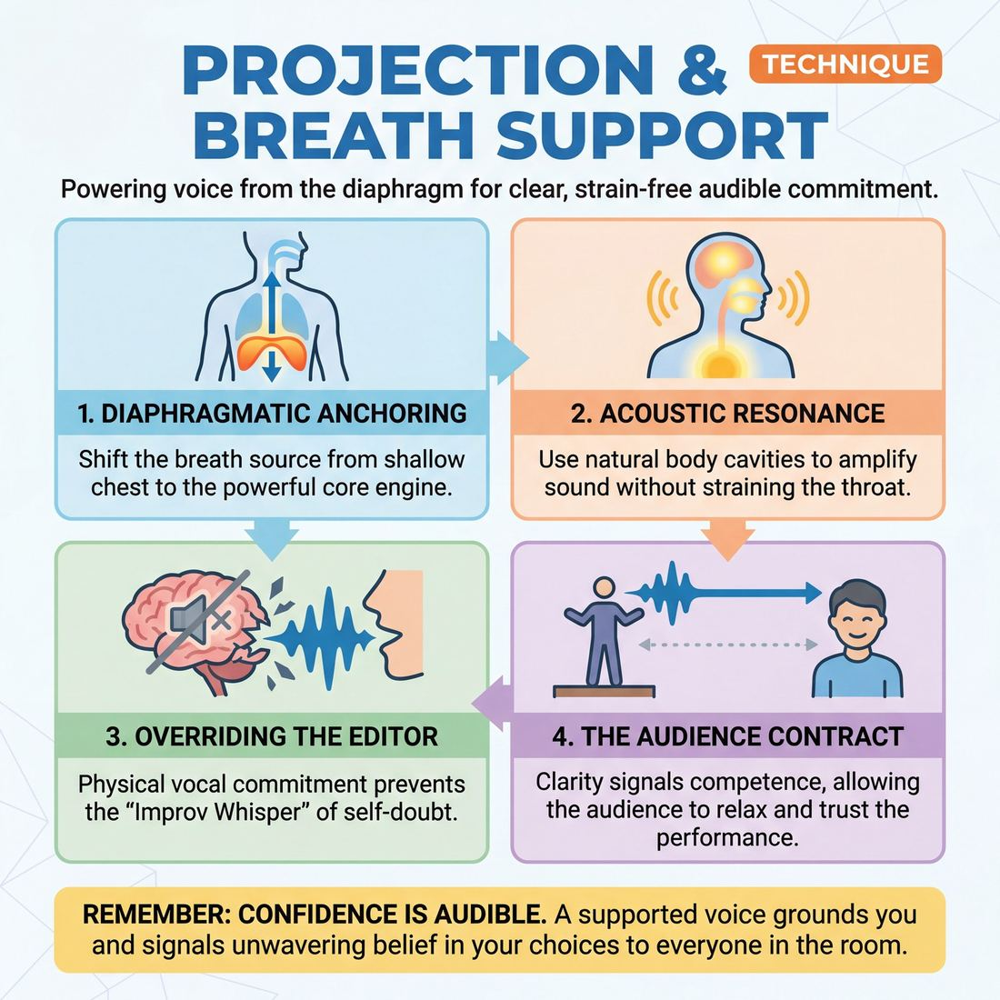

# 🎯 Projection & breath support

> *A drillable muscle that trains **Vocal Craft**.*

{ .infographic }

## 🎯 The essence

**Projection and breath support** is the physical mechanic of powering the voice from the diaphragm rather than the throat. It is the deliberate act of taking in a deep, grounded breath and using core muscles to carry sound clearly across a theater without straining the vocal cords. Practicing this technique isolates one fundamental action: physically anchoring the voice so that every offer—whether a furious shout or a devastating whisper—is fully audible, ensuring your choices are never lost to the back row.

## 🎓 What it trains

Practicing projection and breath support trains **Vocal Craft**—the ability to use your voice as a reliable, controlled instrument rather than a fragile liability. 

For an improviser, the most brilliant premise or the most devastating emotional reaction is entirely useless if the audience cannot hear it. This technique exists to solve two pervasive problems on the improv stage: the **Improv Whisper** (dropping volume the moment uncertainty or the internal "editor" creeps in) and the **Throat Yell** (straining the vocal cords to achieve volume, leading to hoarseness and fatigue).

By isolating and drilling these mechanics, you build several specific muscles:

*   **Diaphragmatic anchoring:** Shifting the source of your breath from the shallow upper chest down to the diaphragm (the muscle separating your chest and abdominal cavities), giving your voice a powerful, sustainable engine.
*   **Acoustic resonance:** Learning to use the chest, mask, and head to amplify sound naturally, allowing you to fill a room without screaming.
*   **Vocal stamina:** Developing the physical endurance to play high-energy, high-emotion, or physically demanding scenes without losing your voice by the second beat.

!!! abstract "The Deeper Principle: Confidence is Audible"
    In the domain of **The Self**, complete physical and vocal control is the gateway to freedom from hesitation. Shallow breathing triggers the nervous system's fight-or-flight response, feeding anxiety. Deep, supported breath does the exact opposite—it grounds you. Projection is not merely about being loud; it is the physical manifestation of commitment. When you support your voice, you signal to your scene partner, the audience, and your own brain that you belong on that stage and stand behind your choices. 

Ultimately, this training moves an improviser from a novice state—where volume vanishes the second they feel unsure—to a state of mastery where the voice is capable of delivering a stage whisper that cuts through the air or a booming roar that never damages the throat.

## 💡 Why it works

This technique exploits the two-way street between the physical body and the nervous system. We often assume that confidence produces a strong voice, but the reverse is equally true: a supported, resonant voice actively manufactures confidence. 

The underlying mechanisms operate on four distinct levels:

**1. The Physical Engine: Fueling the instrument**  
Sound is simply shaped air. When an improviser relies on shallow, chest-level breathing, they lack the pneumatic pressure required to send that air across a theater. To compensate, they squeeze their throat muscles, resulting in a strained, thin, or "shouty" tone. **Breath support** engages the diaphragm—a large, dome-shaped muscle at the base of the lungs—creating a steady, powerful column of air. This allows the voice to carry effortlessly without damaging the vocal folds.

**2. The Psychological Engine: Overriding the editor**  
When an improviser's inner editor doubts an idea, the body instinctively tries to hide the offer by mumbling, rushing, or trailing off. By drilling projection as a mandatory physical habit, we short-circuit this hesitation. You cannot physically project a whisper of self-doubt. When you force your body to support a line of dialogue, your brain is tricked into committing to the choice. A mediocre idea delivered with full vocal support always lands as a stronger offer than a brilliant idea mumbled into the floorboards.

**3. The Nervous System Engine: Forcing relaxation**  
The pressure of the stage often triggers the sympathetic nervous system (the "fight or flight" response), causing shallow breathing, a racing heart, and a tight throat. Deep, diaphragmatic breathing stimulates the vagus nerve, triggering the parasympathetic nervous system (the "rest and digest" response). By focusing on breath support, the improviser actively lowers their heart rate and grounds their physical center of gravity, replacing panic with presence.

**4. The Relational Engine: The audience contract**  
An audience's primary need is to feel safe in the hands of the performers. If they have to strain to hear, they tense up, become frustrated, and eventually disengage. Consistent projection signals authority and competence. It subconsciously tells the audience, "Relax, we know what we are doing," allowing them to sit back and actually invest in the scene.

## 🧩 The setup

To isolate and train the physical mechanics of the voice, you need a setup that removes the cognitive load of scene work and forces players to confront the physical space. 

* **👥 Players & Arrangement:** The full ensemble, working in pairs. Split the group evenly and have them stand in two parallel lines facing each other across the longest possible distance in the room (usually wall-to-wall).
* **🏟️ Space & Materials:** A large, completely cleared room. The greater the distance between the two lines, the harder the engine has to work. 
* **⏱️ Time:** 10–15 minutes total. Keep rounds short (2–3 minutes) to prevent vocal fatigue, followed by brief check-ins.
* **🎭 Roles:** 
    * **The Sender:** Focuses entirely on dropping their breath low into the diaphragm and sending a line of dialogue across the physical gulf.
    * **The Receiver:** Stands at the far wall, acting as a human microphone check. They listen for clarity and resonance, giving a simple physical signal (like a thumbs-up or a raised hand) to indicate if the sound was supported, or if it felt like strained shouting.
* **📋 Prerequisites:** A physical warm-up is mandatory. Players must stretch their intercostal muscles (the sides of the ribs) and do basic deep-breathing exercises to wake up the diaphragm before putting demands on the vocal cords.

!!! tip "Provide the words"
    Do not ask players to improvise dialogue during this drill. When the brain is searching for a clever idea, the breath naturally becomes shallow. Provide a simple, universal line of text (e.g., *"I need you to hear me all the way over there"*) or a nursery rhyme so they can focus 100% on their physical **Vocal Craft**.

!!! quote "How to introduce it"
    "In improv, when we feel uncertain, our breath gets shallow and our volume drops. Conversely, when we try to be loud, we often push from our throats and yell—which damages our vocal cords and sounds panicked rather than powerful. Today, we are isolating the muscle of **projection**. We are going to fill this entire room with sound by using the air deep in our bellies, not the muscles in our necks. We want resonance, not strain. Split into two lines, find a partner across the room, and put your backs against opposite walls."

## ⚙️ The mechanics

!!! abstract "Core Objective"
    To fill the performance space with clear, resonant sound using the diaphragm rather than the vocal cords, and to maintain conversational intimacy even when speaking across a large distance. 

Because projection is a physical muscle rather than a conceptual theory, its mechanics are divided into two parts: the internal physical action of the body, and the external flow of the drill used to train it.

### The Physical Mechanics (The Muscle)
Before stepping into a scene, improvisers must isolate the physical loop of supported speech. 

1. **The Drop-In (Inhale):** Instead of gasping from the chest, the improviser relaxes their abdominal wall. As air enters, the belly expands outward. The shoulders remain completely still and relaxed. 
2. **The Anchor (Support):** As the improviser begins to speak, the abdominal muscles engage, pulling slightly inward and upward. This creates a steady, pressurized column of air beneath the vocal cords.
3. **The Placement (Resonance):** The sound is directed forward into the "mask" (the hard palate, lips, and nasal bones) rather than swallowed in the back of the throat. 
4. **The Target (Focus):** The improviser visually picks a specific target at the back of the room (a light switch, a chair) and physically aims their voice to "touch" that object.

!!! warning "Watch out"
    **The "Shoulder Shrug" Inhale.** If an improviser's shoulders rise to their ears when they take a breath, they are breathing shallowly into their upper chest. This creates tension in the neck and throat, leading to shouting and vocal strain rather than true projection.

### The Drill Mechanics: "The Expanding Distance"
To train this muscle under the cognitive load of scene work, we use a structured loop called **The Expanding Distance**.

1. **The Setup:** Two players stand facing each other in the center of the stage, only an arm's length apart. 
2. **The Initiation:** The players begin a grounded, realistic scene. Because they are close, they speak at a normal, intimate conversational volume. 
3. **The Cue:** After a few lines of dialogue, the coach calls out, *"Step back."*
4. **The Adjustment:** Both players take one large step backward, increasing the physical distance between them. They immediately resume the scene. 
5. **The Core Constraint:** The players must maintain the exact same emotional intensity and conversational reality, but they must increase their **breath support** to bridge the new physical gap. They cannot acknowledge the distance in the reality of the scene (e.g., no yelling, "Why are you so far away?").
6. **The Progression:** Every 15 to 20 seconds, the coach calls *"Step back"* again. The players continue stepping back until they are pressed against opposite walls of the room.
7. **The Reset:** The round ends when the players successfully exchange three grounded, emotionally connected lines of dialogue from opposite ends of the room, using full breath support without straining their throats. The coach calls *"Scene,"* and two new players take the center.

!!! tip "On stage"
    **Volume is a byproduct, not a goal.** Do not try to be "loud." Try to be "supported." If you give your voice enough air pressure from the diaphragm and aim it at your scene partner, the volume will naturally take care of itself without sacrificing the nuance of your character's emotion.

## 🎬 Sample round

!!! example "In a scene: The 'Across the Room' Drill"
    **The Setup:** Two players, Maya and Leo, are placed at opposite ends of a large rehearsal room. They are instructed to play a grounded scene—two coworkers in a warehouse—but must ensure every word hits the opposite wall without yelling or straining.

    **Maya:** *(Takes a low, silent breath, expanding her lower ribs — **The Drop-In**)* "Did the shipment from corporate arrive yet?" 
    *(Her voice is resonant and easily crosses the room. She doesn't raise her pitch; she uses her diaphragm to push the air — **The Anchor & Release**).*

    **Leo:** *(Breathes shallowly into his upper chest, raising his shoulders)* "I checked the loading dock, but it's empty." 
    *(Because he lacks breath support, his volume drops on the word "empty," making it inaudible to the coach in the center of the room — **The Drop-Off**).*

    **Coach:** "Leo, you lost the end of that sentence. Drop the breath into your belly, feel your core engage, and send the whole line to Maya."

    **Leo:** *(Pauses. Relaxes his shoulders. Takes a deep diaphragmatic breath, feeling his stomach expand. As he speaks, he engages his core to sustain the airflow — **The Follow-Through**).* "I checked the loading dock, but it's empty." 
    *(The line lands with full clarity and a richer, warmer tone. He didn't scream; he simply supported the sound).*

    **Maya:** *(Inhales smoothly on Leo's last word, readying her next impulse)* "Then we're going to have to call the regional manager." 
    *(She sustains the volume perfectly through the multi-syllable word "manager," keeping her throat relaxed and her vocal cords free of strain).*

## 🎚️ Variations & progressions

To build true **Vocal Craft**, improvisers must move from static, conscious projection to dynamic, unconscious breath support under the pressure of scene work. These variations ramp up the difficulty, taking players from basic mechanical awareness to full vocal mastery.

**1. The Full-Scene Distance Drill (Novice to Advanced Beginner)**
Taking the core "Expanding Distance" mechanic out of a vacuum, partners now play a fully realized, open-ended scene. They begin two feet apart and step backward every 30 seconds until they hit the walls. 
*   **The goal:** Maintain the exact same emotional intimacy and conversational tone, but increase the breath support so the partner (and the room) can still hear every word. 
*   **Maturity tie-in:** This cures the **Novice** habit of dropping volume on uncertainty. It teaches the body to project on command, proving that volume is a physical requirement, not an emotional one.

!!! tip "On stage"
    When doing the Distance Drill, do not let the *nature* of the scene change. If the characters are sharing a whispered secret, they must continue sharing a secret—it just becomes a "stage whisper" supported by enough air to reach the back row.

**2. The Exertion Monologue (Competent)**
Players deliver a monologue or play a two-person scene while performing a sustained physical task—holding a wall sit, doing jumping jacks, or briskly pacing the room.
*   **The goal:** Maintain steady, un-shattered vocal delivery while the body is under stress. 
*   **Maturity tie-in:** Pushes players toward the **Competent** stage, where they must match vocal energy to emotional content without letting physical exhaustion or scene pressure collapse their diaphragm. You cannot fake breath support when your core is physically taxed.

**3. Decoupling Volume and Emotion (Proficient)**
The coach assigns an emotion and a contradictory volume level. For example: play a scene with *furious anger* but at a *whisper*, or play *deeply depressed* but at a *booming shout*.
*   **The goal:** Separate the emotional impulse from the mechanical habit of yelling. 
*   **Maturity tie-in:** Develops the **Proficient** ability to let the voice instantly convey a specific state. It proves that a fully supported whisper can cut through a theater just as effectively as a shout.

!!! warning "Watch out"
    As players try to get louder in these drills, watch for their pitch creeping upward. Raising pitch means they are tightening their vocal cords to create volume, rather than using their breath. Remind them: *Volume comes from the belly, not the throat.*

**4. The Resonance Shift (Mastery)**
Players sustain a single scene while the coach calls out different physical placements for the voice: "chest voice," "head voice," "nasal mask," or "guttural." 
*   **The goal:** Maintain perfect projection and breath support while radically altering the character's vocal quality.
*   **Maturity tie-in:** This trains the **Master** level of vocal craft, where the improviser uses the voice as a fully controlled instrument, seamlessly modulating it to serve the piece without ever sacrificing audibility.

## 🧑‍🏫 Coaching notes

Coaching projection is rarely about asking improvisers to simply "be louder." When you just ask for volume, actors tend to squeeze their vocal cords and shout, leading to strained necks and blown voices. Instead, your coaching must focus on physical alignment, relaxation, and confident air flow. 

When an improviser feels uncertain, their physical frame collapses, their breath becomes shallow, and their volume drops. Your job is to rebuild their physical foundation in the moment.

!!! tip "Coaching: The single most important cue"
    **"Give your voice a destination."**  
    Instead of saying "louder," tell the improviser exactly where the sound needs to go: *"Bounce your voice off the back wall,"* or *"Speak to the person in the very last row."* This shifts their focus outward and naturally engages their core support without triggering the instinct to shout.

### What 'Good' Looks and Sounds Like
Train your eyes and ears to catch the physical mechanics of breath support before the actor even speaks.

*   **Visual cues:** The actor's shoulders are down and relaxed, not creeping up toward their ears. When they inhale, their stomach and lower ribs expand outward (diaphragmatic breathing), while their upper chest and shoulders remain relatively still. Their knees are unlocked, grounding them to the floor.
*   **Auditory cues:** The voice has a rich, resonant quality rather than a thin, nasal, or strained tone. The volume remains consistent throughout the entire phrase.

### Effective Side-Coaching Phrases
Use these quick, actionable cues mid-scene or mid-drill to correct mechanics without stopping the action:

*   **When they drop volume at the end of a line:** *"Drive through to the period"* or *"Support the end of the thought."* (Improvisers often run out of breath or confidence halfway through a sentence, resulting in vocal fry or a whisper).
*   **When they are shouting from the throat:** *"More air, less neck,"* or *"Drop your shoulders and breathe into your belt."*
*   **When they are physically tense:** *"Unlock your knees."* (Locked knees tense the lower back and restrict the diaphragm, instantly killing breath support).
*   **When they are looking at the floor:** *"Chin parallel to the ground."* (A dropped chin pinches the airway; lifting the head opens the vocal tract).

!!! warning "Watch out for 'The Lean'"
    When improvisers try to project, they often jut their chin forward and lean their upper body toward the audience. This actually creates tension in the neck and restricts airflow. Side-coach them to **"Stand on two feet and let the air do the traveling."**

## 🧭 Debrief & reflection

After drilling projection and breath support, the debrief must shift the focus from *how loud* the players were to *how it felt* in their bodies. Vocal craft is deeply physical, and players need to memorize the somatic markers of healthy support so they can recreate them under the pressure of a real scene.

Use these questions to guide the reflection:

*   **"Where in your body did the physical effort live?"** 
    Players should begin to articulate the difference between the grounded, expansive feeling of **diaphragmatic support** (in the belly, ribs, and lower back) versus the tight, scratchy sensation of **vocal strain** (in the throat and neck).
*   **"Did you notice a specific moment where your volume dropped?"** 
    This prompts players to connect their physical voice to their mental state. Often, improvisers will realize their volume dipped exactly when they felt unsure of their next line or choice. 
*   **"How did it feel emotionally to take up that much sonic space?"** 
    Projecting requires vulnerability. For naturally quiet players, speaking with full resonance can feel aggressive or exposed. Naming this discomfort helps demystify it.
*   **"When you were fully supported, how did it affect your scene partner?"**
    Encourage players to notice how a resonant, confident voice naturally commands attention and gives the scene partner more energy to play off of.

**What a good debrief surfaces**  
A successful reflection moves the group past the mechanics of breathing and into the psychology of performance. Players will often realize that they aren't quiet because they lack lung capacity; they are quiet because they are afraid of being wrong *loudly*. 

!!! abstract "Key takeaway: The confidence loop"
    A great debrief highlights the feedback loop between breath and confidence. When an improviser doubts their idea, they instinctively hold their breath and swallow their words. Conversely, choosing to take a deep breath and project can actually *manufacture* confidence, bypassing the inner critic and forcing the player to commit fully to their choice.

## ⚠️ Common pitfalls

When improvisers are learning to manage their instrument, the physical demands of breath support often clash with the mental demands of scene work. As cognitive load increases—when a player is desperately searching for an idea or reacting to an unexpected offer—physical technique is usually the first thing to break. 

Here are the most common traps improvisers fall into, and how to correct them.

!!! warning "Watch out: The Uncertainty Drop-Off"
    **The trap:** A novice remembers to project at the start of a scene, but the moment they are unsure of their next word, their volume plummets. The physical breath support collapses under cognitive load, resulting in swallowed punchlines and trailing sentences. 
    
    **The fix:** Train the body to maintain abdominal engagement even when the brain is searching. Practice speaking gibberish or reading a menu with unwavering, booming support to decouple volume from meaning. Drive your breath through to the final consonant of every sentence, even if the sentence itself is a mistake.

!!! warning "Watch out: Shouting from the throat"
    **The trap:** Confusing *volume* with *projection*. When asked to be louder, an improviser pushes air aggressively through a tight throat, resulting in a harsh, raspy yell. This damages the vocal cords and sounds abrasive to the audience.
    
    **The fix:** Shift the workload downward. If your throat hurts after a show, you are doing it wrong. Place a hand on your belly and ensure it expands outward on the inhale and pulls inward on the exhale. The power must come from the diaphragm, while the throat remains relaxed and open.

!!! warning "Watch out: Tension masquerading as support"
    **The trap:** Trying to force projection by tensing the upper body. The improviser raises their shoulders to their ears, juts their chin forward, and locks their knees to "push" the sound out into the house.
    
    **The fix:** True breath support requires a grounded, relaxed upper body. Do a quick physical scan: drop the shoulders, unlock the knees, and align the head over the spine. The core should be doing the heavy lifting; the neck and shoulders should be entirely free.

!!! warning "Watch out: The 'Intimate Scene' collapse"
    **The trap:** Two improvisers establish a quiet, intimate scene—perhaps lovers whispering in bed or spies hiding in a closet. To honor the reality of the scene, they drop into their everyday conversational volume, becoming completely inaudible to the back row.
    
    **The fix:** Master the "stage whisper." Counterintuitively, speaking quietly on stage requires *more* breath support, not less. You must lower your vocal intensity and pitch, but increase the steady stream of air from your diaphragm to carry that quiet sound all the way to the back wall.

## 🌟 What mastery looks like

At the highest level of proficiency, projection and breath support become entirely invisible to the audience. The improviser no longer "tries to be loud"; instead, they use the voice as a **fully controlled instrument serving the piece**. Mastery is characterized by effortless acoustic power and absolute vocal safety, regardless of the physical or emotional demands of the scene.

When observing a master improviser executing this technique, you will notice:

* **The resonant whisper:** They can deliver a secret to their scene partner that sounds like a genuine, intimate whisper, yet the consonants are so crisp and the breath so supported that the back row of a 300-seat theater hears every syllable.
* **Physical independence:** Their vocal power is decoupled from their posture. They can project clearly while curled into a ball, sprinting across the stage, or facing entirely upstage.
* **End-of-line stamina:** Sentences never trail off into vocal fry or breathless gasps. The final word of a long, frantic monologue lands with the exact same energetic support as the first.
* **Emotional modulation:** They can portray extreme emotional states—sobbing, hyperventilating, or screaming in rage—without ever losing breath control or damaging their vocal cords. The *character* is out of control; the *actor's diaphragm* is completely in control.

!!! example "In a scene"
    An improviser is playing a frail, dying monarch. To convey weakness, they lie flat on their back, their physical movements slow and labored. They speak their final, halting words to their heir. To the audience, the character sounds incredibly weak and breathless. Yet, because the improviser is using masterful **diaphragmatic support**, the actual acoustic sound easily cuts through the theater's ambient noise, reaching the back wall with perfect clarity. The technique serves the illusion without breaking it.

!!! abstract "The ultimate indicator"
    Mastery of breath support means the improviser never has to choose between physical truth and audibility. The technique is so deeply ingrained in their muscle memory that the body automatically takes the exact breath needed for the thought that follows, with zero measurable latency between the impulse to speak and the physical preparation to do so.

## 🔗 Why it matters

Projection and breath support are the foundational mechanics of **Vocal Craft**. You can invent the most compelling character voice, master a flawless dialect, or deliver a devastatingly emotional monologue, but if the audience cannot hear it, the offer practically does not exist. Breath is the fuel; projection is the delivery system. 

At the level of **The Self**, mastering this technique directly serves the domain's ultimate goal: complete physical and vocal control, and freedom from hesitation. Anxiety naturally triggers shallow, clavicular (chest) breathing, which leads to a thin, unsupported voice. By actively driving the breath down into the diaphragm and supporting the sound, the improviser physically overrides the body's panic response. A grounded, supported voice generates internal confidence, giving the performer the courage to be truthful and present.

!!! abstract "The currency of audience trust"
    An audience that has to strain to hear you is an audience that cannot relax. When you project effortlessly, you subconsciously signal to the crowd that they are in safe hands. This puts them at ease, making them far more willing to laugh, gasp, and invest in the reality you are building.

Beyond the individual performer, breath support connects outward to the wider mechanics of scene work and ensemble play:

*   **Scene partner connection:** Mumbling or dropping the ends of sentences forces your partner to break their own focus to ask, "What?" or guess your offer, instantly stalling the scene's momentum.
*   **Emotional stamina:** Screaming from the throat during a high-stakes scene damages the vocal cords and sounds thin. Supporting a shout from the diaphragm allows for explosive, sustainable emotional intensity that feels genuinely dangerous rather than just loud.
*   **Pacing and stillness:** Taking a deep, supported breath before speaking naturally creates a micro-pause. This physical necessity trains the improviser to hold a beat, naturally curbing the anxious urge to rush in and fill dead air. 

Ultimately, breath support transforms the voice from a fragile liability into a fully controlled instrument, ensuring that every impulse, no matter how subtle, reaches the back row of the theater.

## 📚 References & Further Reading

### Foundational sources
*   **Kristin Linklater, *Freeing the Natural Voice: Imagery and Art in the Practice of Voice and Language* (1976, revised 2006)** — The seminal text on removing the physical and psychological blocks that inhibit the human voice. Linklater's method is crucial for improvisers struggling with the "Throat Yell," as it focuses on liberating the natural voice you already have, connecting deep breath directly to emotional impulse rather than relying on artificial muscular control. https://www.linklatervoice.com
*   **Cicely Berry, *Voice and the Actor* (1973)** — A classic, no-nonsense guide from the Royal Shakespeare Company's legendary voice director. Berry provides foundational exercises on developing relaxation, diaphragmatic breathing, and muscular control to achieve effortless stage projection, ensuring that an actor's choices are never lost to the back row.

### Practitioner guides & manuals
*   **Viola Spolin, *Improvisation for the Theater* (1963)** — The foundational text of American improv features specific, actionable side-coaching for vocal craft. Spolin uses the prompt "Share your voice!" to frame projection not as a mechanical instruction to "speak louder," but as an organic, physical responsibility to connect with the audience and share the stage space.
*   **Patsy Rodenburg, *The Right to Speak: Working with the Voice* (1992)** — An essential read for overcoming the "Improv Whisper." Rodenburg explores the psychology and physicality of claiming space with the voice, directly addressing the societal and nervous habits that cause performers to shrink their volume the moment uncertainty creeps in. https://www.bloomsbury.com/us/right-to-speak-9781472573025/
*   **Mick Napier, *Improvise: Scene from the Inside Out* (2004)** — While not strictly a vocal anatomy manual, Napier’s approach to overriding the internal "editor" relies heavily on making immediate, strong physical and vocal choices. He argues that committing to a loud, supported vocal choice forces the brain to commit to the scene, short-circuiting hesitation.

### Research & theory
*   **Xiao Ma et al., "The Effect of Diaphragmatic Breathing on Attention, Negative Affect and Stress in Healthy Adults" (*Frontiers in Psychology*, 2017)** — Clinical research demonstrating that diaphragmatic breathing actively lowers cortisol levels and negative affect. This study provides the empirical, neurological backing for why breath support works on stage: it stimulates the parasympathetic nervous system, replacing the "fight or flight" panic of performance with grounded presence. https://www.frontiersin.org/articles/10.3389/fpsyg.2017.00874/full

### Talks, videos & courses
*   **Jeannette Nelson, *National Theatre Vocal Warm-Ups* (2011)** — A highly practical, verifiable series of four video masterclasses by the former Head of Voice at the National Theatre. Nelson demonstrates the exact physical mechanics of diaphragmatic breathing, acoustic resonance (humming to find the "buzz" in the chest and mask), and opening the throat to prevent vocal fatigue. https://www.youtube.com/user/NationalTheatre

### Communities & adjacent reading
*   **F. Matthias Alexander, *The Use of the Self* (1932)** — The foundational text of the Alexander Technique, a somatic practice widely used in theater conservatories. Alexander's work focuses on aligning posture and releasing habitual neck and throat tension, which is a mandatory prerequisite for allowing the diaphragm to function optimally and preventing vocal cord strain.
*   **Voice and Speech Trainers Association (VASTA)** — The primary international professional organization for vocal coaches, speech pathologists, and theater educators. Their archives and publications (like the *Voice and Speech Review*) offer extensive, peer-reviewed resources on vocal health, acoustic resonance, and stage projection. https://vasta.org

## 💬 Quotes & Anecdotes

!!! quote "— Patsy Rodenburg, *The Actor Speaks* (1997)"
    "Voice is powered and carried by the breath. Knowing how to breathe and how to adjust our breathing allows us to produce sounds and speech of infinite variety and richness of tone."

!!! quote "— Viola Spolin, *Improvisation for the Theater* (1963)"
    "Share your voice! Produces projection, responsibility to the audience. Not simply a direction to speak louder, it helps to alert a player organically, without the need for a lecture, to the need for personal interaction with the audience."

!!! quote "— Kristin Linklater, *Freeing the Natural Voice* (1976)"
    "To free the voice is to free the person... The breath serves the thought, and each thought has an intrinsic length."

!!! quote "— Patsy Rodenburg, *The Actor Speaks* (1997)"
    "It is always easier to fill a space and bring your voice down than to work from a position of inaudibility."

### Where it comes from

While diaphragmatic breath support is a foundational pillar of classical acting and vocal pedagogy—championed by legendary voice coaches like Kristin Linklater and Patsy Rodenburg—its specific application to unscripted theater was pioneered by Viola Spolin. Spolin recognized that improvisers, when searching for ideas or feeling uncertain, naturally retreat inward and drop their volume. Rather than giving technical lectures on the anatomy of the diaphragm, she developed the side-coaching prompt *"Share your voice!"* to instantly remind players of their physical relationship with the room, framing projection as an act of generosity and connection rather than a mechanical chore. 

### A telling example

**Illustrative Scene: The Improv Whisper vs. The Supported Choice**

*The Setup:* Two improvisers step out to begin a scene. Player A initiates with a bold physical choice—miming holding a tiny, fragile object—but feels a sudden spike of self-doubt about what the object actually is. 

*Without Breath Support (The Improv Whisper):* 
Player A's chest tightens. They take a shallow, panicked breath into their upper chest and mumble into their collarbone: *"I think it's hatching."* The audience in the third row hears nothing. Player B, straining to hear, steps out of their own character's reality and leans in, asking, *"What did you say?"* The scene immediately loses its momentum, and the audience tenses up, feeling that the performers are not in control.

*With Breath Support (The Anchored Voice):* 
Player A feels the exact same spike of self-doubt. However, their physical training kicks in. They drop their breath low into their diaphragm, expanding their stomach. They anchor their feet and send the exact same line across the room on a steady, supported column of air: *"I think it's hatching."* The volume is conversational, but the resonance easily reaches the back wall. Because the voice sounds physically confident, Player B instantly accepts the reality. The audience relaxes, and Player A's own nervous system is tricked into believing the choice was brilliant all along.

## 🧭 Explore the framework

- ⬆️ **Skill it trains:** [Vocal Craft](01_S4__vocal-craft.md)
- 🎭 **Domain:** [The Self](01_D__the-self.md)
- 🔁 **Sibling techniques:** [Vocal characterization](01_S4_T2__vocal-characterization.md), [Gibberish](01_S4_T3__gibberish.md)
