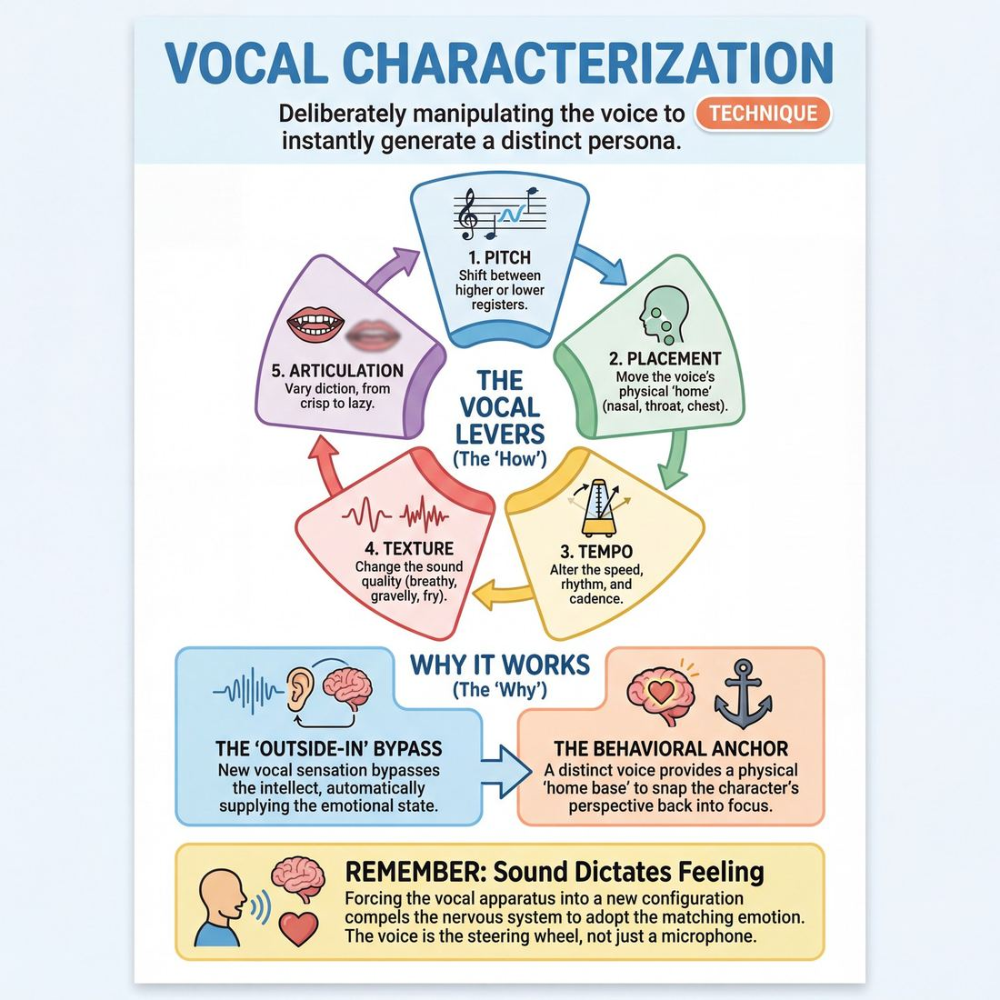

# 🎯 Vocal characterization

> *A drillable muscle that trains **Vocal Craft**.*

{ .infographic }

## 🎯 The essence

**Vocal characterization** is the deliberate manipulation of pitch, placement, tempo, and texture to instantly generate a distinct persona. As a focused technique, it isolates the vocal apparatus from the body and the intellect, forcing improvisers to build a character entirely from the "outside in." By making a single, strong vocal choice—such as dropping the resonance deep into the chest or adopting a rapid, nasal clip—the player practices the vital skill of bypassing their default speaking voice. This allows a new, unfamiliar sound to automatically dictate the character's emotional state, age, and point of view.

## 🎓 What it trains

At its core, this technique isolates and strengthens **Vocal Craft**—the ability to consciously manipulate the physical apparatus of your voice to create distinct, repeatable characters. 

For many improvisers, the voice is an afterthought. Under the pressure of inventing a scene, the brain allocates all its bandwidth to figuring out *what* to say, leaving *how* to say it on default settings. This creates a persistent problem: a stage full of improvisers playing minor variations of themselves. It limits the cast of characters to the improviser's everyday persona, often leading to scenes that feel like two writers talking rather than two distinct human beings living.

Practicing vocal characterization solves this by treating the voice as a deliberate, tunable instrument. It trains you to isolate and manipulate specific vocal levers:

*   **Pitch:** Moving beyond your natural speaking register into higher or lower frequencies.
*   **Placement:** Shifting where the voice physically "lives" in the body—from a nasal mask, to a tight throat, to a booming chest cavity.
*   **Tempo (Pace):** Altering the speed of delivery, the cadence of pauses, and the musicality of the phrasing.
*   **Texture (Timbre):** Changing the quality of the sound, such as making it breathy, gravelly, or introducing vocal fry.
*   **Articulation:** Playing with crisp, over-enunciated diction versus loose, lazy, or mumbled speech.

!!! abstract "The Deeper Principle: Outside-In Discovery"
    Vocal characterization is a gateway to mastering **The Self**. By forcing a change in your physical vocal apparatus, you bypass the intellectual "editor." When you adopt a slow, gravelly, chest-resonant voice, your posture naturally drops, your breathing slows, and your emotional state shifts to match. You aren't just *sounding* like a different person; you are tricking your brain into *feeling* like one.

Ultimately, this technique builds the courage to step entirely out of your own skin. As you progress from relying on just one "funny voice" to instantly conveying a character's age, status, and emotional state through sound alone, you achieve true freedom from hesitation. You stop thinking about who you are, and simply let the voice tell you.

## 💡 Why it works

Vocal characterization works because it exploits the deep neurological link between physiology and psychology, while simultaneously acting as a high-bandwidth transmitter of information to your scene partner and the audience. 

The engine under the hood relies on three core mechanisms:

*   **The Outside-In Bypass:** When you alter your pitch, placement, or cadence, your brain receives novel sensory feedback. Instead of agonizing over *who* you are or what your perspective is, you simply adopt a weary, low-status drawl, and your nervous system automatically supplies the persona to match. It frees you from the burden of invention.
*   **High-Bandwidth Communication:** The human ear is evolutionarily wired to decode vocal micro-expressions instantly. Before you even finish your first sentence, your tone has already communicated your character's baseline. This eliminates the need for clunky verbal exposition; the audience and your partner *feel* who you are before they *understand* what you are saying.
*   **The Behavioral Anchor:** A distinct voice acts as a psychological tether. In the middle of a chaotic scene, improvisers often lose track of their character's perspective. A specific vocal placement provides an immediate, physical "home base." The moment you drop back into that specific nasal whine or booming baritone, your character's worldview instantly snaps back into focus.

!!! abstract "Key idea: Sound dictates feeling"
    You cannot speak in a rapid, high-pitched, breathy staccato and feel entirely relaxed. You cannot speak in a slow, resonant, chest-heavy rumble and feel frantic. By forcing the vocal apparatus into a new configuration, you force the nervous system to adopt the corresponding emotional state. The voice is not just a microphone for the character; it is the steering wheel.

## 🧩 The setup

To isolate and train these physical mechanics, facilitators typically use a "Voice Lab" or "Vocal Soundboard" drill. This setup strips away the pressure of scene work, allowing players to focus entirely on the physical sensation of altering their voice.

*   **Players & Arrangement:** Full ensemble (ideally 8–16 players). Stand in a wide, single circle. Everyone must have a clear line of sight and an unobstructed path of sound to every other player.
*   **Space & Materials:** A quiet, open room where players feel comfortable making strange or loud noises. A whiteboard is highly recommended to visually list the vocal levers you will be adjusting.
*   **Time:** 10–15 minutes total. Spend about 2–3 minutes isolating and passing each specific vocal variable around the circle.
*   **Roles:** 
    *   **Facilitator:** Acts as the "sound engineer." You will provide a neutral phrase and call out specific, mechanical adjustments to the voice.
    *   **Players:** Deliver the neutral phrase to the person next to them, applying the requested vocal shift without trying to "act" or invent a backstory.
*   **Prerequisites:** A thorough physical and vocal warm-up is mandatory. Players must have already completed breathing exercises, lip trills, and articulation drills to ensure the vocal cords are warm and to prevent strain.

!!! quote "How to introduce it"
    "Today we are going to treat your voice like a soundboard. We aren't worrying about words, emotions, or even acting right now—we are just playing with the dials. 
    
    I’m going to give you a completely neutral phrase, like *'I think I left my keys in the car.'* As we pass this phrase around the circle, I will ask you to adjust one specific vocal lever: maybe the pitch, the speed, the texture, or where the sound physically vibrates in your body. 
    
    Don't try to be funny. Don't try to invent a character yet. Just make the mechanical adjustment, commit to the sound, and notice how it physically feels in your throat, mouth, and chest."

!!! warning "Watch out for vocal safety"
    Before beginning, explicitly remind players: *“If it hurts, stop.”* Vocal characterization should rely on placement and breath support, not on grinding the vocal cords. If a player feels a scratchy, painful sensation, instruct them to immediately drop the voice and return to their natural register.

## ⚙️ The mechanics

The core objective is to systematically decouple your voice from your habitual speaking patterns. Rather than trying to "think up" a character and then invent a voice for them, we reverse the process. We train this using a core drill known as the **Vocal Switchboard**.

### The Core Parameters
Before running the loop, players must understand the "dials" on their switchboard. These are the physical variables you can isolate and adjust:

*   **Placement:** Where the sound physically vibrates (e.g., the nasal mask, the deep chest, the back of the throat, the top of the head).
*   **Pitch:** The musical highness or lowness of the voice.
*   **Pace:** The speed of delivery—rapid-fire, languid, erratic, or highly measured.
*   **Texture:** The quality of the sound (e.g., breathy, gravelly, booming, thin).
*   **Articulation:** How sharply words are formed (e.g., crisp and clipped, or mushy and slurred).

!!! warning "Watch out: Accents are not characters"
    A common trap is substituting an accent (like a British or Southern drawl) for vocal characterization. An accent tells the audience *where a character is from*; vocal characterization tells the audience *who they are*. Focus on the physical parameters above, not geography.

### The Flow of Play
The drill requires a **Player** (who is exploring the voice) and a **Caller** (a coach or scene partner who provides the constraints). 

1.  **Establish Neutral:** The Player stands in a relaxed, neutral posture. They speak a simple, rote baseline sentence in their everyday voice (e.g., *"I am walking down the street to buy a loaf of bread."*).
2.  **The Caller's Prompt:** The Caller selects *one* parameter from the switchboard and gives a specific adjustment (e.g., *"Shift your placement entirely into your nose,"* or *"Drop your pitch to a 2 out of 10."*).
3.  **The Vocal Shift:** The Player takes a breath and physically adjusts their vocal apparatus to match the prompt. 
4.  **The Test Phrase:** The Player repeats the baseline sentence using the new vocal setting. They must commit 100% to the physical sensation of the sound, even if it feels ridiculous.
5.  **Character Discovery:** The Caller asks a simple, open-ended question (e.g., *"What do you care about most in the world?"* or *"What is your biggest secret?"*). 
6.  **The Response:** The Player answers the question, maintaining the vocal adjustment. Crucially, the Player must let the *sound* of the voice dictate the answer. If a breathy, high-pitched voice makes them feel fragile, they answer as a fragile character. If a booming, crisp voice makes them feel high-status, they answer with authority.
7.  **Reset:** The Caller says "Neutral." The Player shakes out their body, takes a deep breath, and awaits the next prompt.

### Rules & Constraints
*   **Isolate to integrate:** In early rounds, change only *one* parameter at a time. Do not change pitch and pace simultaneously until you have mastered them individually.
*   **No pre-planning:** The Player must not decide who the character is before speaking. The character must emerge as a surprise *from* the vocal shift.
*   **Maintain volume:** Players naturally drop their volume when trying a new, uncertain voice. The Caller must enforce consistent projection regardless of the parameter being tweaked.

!!! tip "On stage: The voice leads the body"
    While this drill isolates the voice, you will quickly notice that a vocal shift triggers a physical one. A tight, nasal voice might cause your shoulders to creep up; a deep, resonant chest voice might widen your stance. Allow this to happen. The voice is the spark that ignites the full-body character.

## 🎬 Sample round

!!! example "Sample round: Vocal Sliders"
    In this drill, players step into a two-person scene. Before speaking, they must consciously adjust three "sliders" of their vocal instrument: **Placement**, **Tempo**, and **Texture**. 

    **The Prompt:** The instructor asks the players to initiate a scene in a waiting room, leading entirely with their vocal choices rather than a pre-planned character idea.

    **Player A:** *(Decides on **nasal placement**, **fast tempo**, and a **sharp/clipped texture**.)*
    *(Speaking rapidly, pushing the sound entirely into the mask of their face)* 
    "Excuse me, I’ve been waiting for forty-five minutes and the magazine selection here is exclusively from 2014. Is there a manager?"
    
    * **The Mechanic in Action:** By isolating the nasal resonator and speeding up the tempo, Player A instantly generates a high-strung, agitated, and slightly grating persona. The vocal choice does the heavy lifting of character creation before they even think about *who* they are.

    **Player B:** *(Decides on **gut placement**, **slow tempo**, and a **gravelly texture**.)*
    *(Dropping their pitch, letting the sound rumble deep in their belly, elongating the vowels)* 
    "The magazines... are for the weak. We wait. That is what we do."
    
    * **The Mechanic in Action:** Player B contrasts Player A's frantic energy by dropping into a low, slow, resonant space. This vocal placement naturally conveys immense gravity, high status, and age, instantly establishing a comedic dynamic between the two characters.

    **Player A:** *(Maintaining the nasal, rapid-fire voice, but raising the **pitch** slightly to show rising panic)*
    "Well I am not weak, I am just highly scheduled! I have a spin class at four!"
    
    * **The Mechanic in Action:** Player A holds onto their baseline vocal characterization but modulates the pitch to react emotionally to their partner, demonstrating the transition from holding one distinct voice to matching vocal energy to emotional content.

## 🎚️ Variations & progressions

To build a robust vocal instrument, players must first isolate individual vocal mechanisms before combining them under the pressure of a scene. You can scale the difficulty of vocal characterization drills to match the ensemble's maturity.

**1. The Single Dial (Novice to Advanced Beginner)**
At this stage, players often drop their volume when trying a new voice because they feel uncertain. To counter this, isolate just *one* variable at a time.
*   **Pitch & Pace Pass:** Players stand in a circle and pass a neutral phrase. The coach dictates a single constraint: "Speak as fast as possible," "Speak at the lowest pitch you can comfortably reach," or "Speak with extreme staccato." 
*   **Goal:** The Novice learns to maintain projection while altering their voice, while the Advanced Beginner discovers they have more than just "one distinct character voice" in their toolkit.

**2. The Resonance Shift (Competent)**
Once players can manipulate pitch and pace, introduce placement.
*   **The Elevator Voice:** Players walk the room. The coach calls out different resonance centers: "Head voice" (light, airy), "Nasal mask" (bright, piercing), "Throat" (gravelly, tight), "Chest" (booming, warm), or "Belly" (deep, resonant). 
*   **Goal:** Competent improvisers begin to naturally match these physical placements to emotional content (e.g., discovering that a chest resonance naturally lends itself to high-status confidence, while a tight throat voice triggers anxiety).

!!! tip "On stage: Let the voice lead"
    If you feel stuck in your head at the top of a scene, make a bold vocal choice *first*. Adopt a nasal, rapid-fire voice, and notice how it instantly makes you feel impatient or pedantic. The voice will often hand you the character's point of view.

**3. The Vocal Cocktail (Proficient)**
This variation demands that players combine multiple variables simultaneously to instantly convey age, status, and emotional state.
*   **Three-Part Prompt:** The coach calls out a combination of pitch, pace, and placement. For example: "High pitch, slow pace, chest resonance." Players must immediately adopt the voice, speak a line of dialogue, and let the voice dictate their physical posture.
*   **Goal:** Proficient players bypass the conscious editor. The voice instantly and reliably conveys a fully formed archetype without the player needing to "think up" a character first.

**4. The Status Shift (Master)**
For advanced ensembles, the challenge is no longer *finding* the voice, but *modulating* it dynamically while maintaining the character's core truth.
*   **The Sliding Scale Scene:** Two players begin a scene with distinct vocal characters. The coach rings a bell, signaling a shift in the scene's power dynamic. Players must alter their vocal qualities (e.g., dropping volume to become menacing, or raising pitch to show submission) *without* losing the original character's identity.
*   **Goal:** The Master improviser uses the voice as a fully controlled instrument, serving the emotional arc of the piece while holding the room's focus.

## 🧑‍🏫 Coaching notes

When coaching vocal characterization, your primary job is to push improvisers past their habitual speaking patterns while ensuring they don't sacrifice basic stagecraft—like volume and clarity—in the process. 

!!! tip "Coaching: Let the voice change your spine"
    The single most important cue you can give is to connect the vocal choice to a physical one. A high, nasal voice naturally pulls the chin up and the shoulders in; a deep, chest-resonant voice drops the center of gravity. If an improviser is struggling to maintain a voice, have them exaggerate the posture that goes with it. The body anchors the sound.

**What to side-coach in the moment:**

*   **"Keep your volume up!"** Demand stage-level projection, even for "shy" or "quiet" characters.
*   **"Where does that voice live?"** Prompt the improviser to identify their **resonance chamber** (e.g., nose, throat, chest). Naming the physical location helps them return to it consistently.
*   **"How does this character laugh?"** or **"How do they sigh?"** Non-verbal sounds are the ultimate stress-test for a vocal characterization. If they drop back to their natural laugh, the voice isn't fully integrated yet.
*   **"Match the emotion."** A competent improviser can maintain the character voice whether they are furious, heartbroken, or overjoyed. Challenge them to shift emotional states without losing the vocal parameters.

**What 'good' looks and sounds like:**

You are listening for **consistency** and **specificity**. A successful vocal characterization doesn't fade away at the end of a sentence or disappear when the improviser has to think hard about the scene's plot. The voice should instantly convey the character's age, status, or state of mind without requiring exposition. Furthermore, the improviser should look physically comfortable; the voice should appear to flow effortlessly from the character's point of view.

## 🧭 Debrief & reflection

A strong debrief shifts the focus from "doing a funny voice" to understanding how vocal mechanics actively drive character, emotion, and scene logic. The goal is to help players recognize that altering their vocal instrument is a reliable shortcut to bypassing the internal editor.

Use these questions to guide the post-exercise discussion, listening for specific realizations:

*   **"Where did that voice live in your body, and how did it change your posture?"**
    *   *What it surfaces:* The physical reality of vocal placement. Players should notice that speaking from the nasal mask naturally tightens the face, while a deep chest resonance drops the shoulders. It reinforces that voice and body are inextricably linked.
*   **"Did the voice give you an opinion or an emotion before you even thought of one?"**
    *   *What it surfaces:* The power of outside-in character generation. This helps players realize they can use vocal energy to trigger emotional content, rather than waiting to feel the emotion first.
*   **"Which voice felt the furthest from your default, and why?"**
    *   *What it surfaces:* Awareness of personal habits. Identifying what feels alien helps improvisers map the uncharted territory in their vocal range.
*   **"Did anyone feel a tickle, scratch, or strain in their throat?"**
    *   *What it surfaces:* Vocal health and sustainability. It is crucial to distinguish between a character's vocal tension and actual damage to the player's vocal cords. 

!!! abstract "The Core Realization"
    A successful debrief leads players to this exact lightbulb moment: **You do not need to invent a backstory to start a scene.** When you commit fully to a distinct vocal choice, the voice dictates the character's age, status, and emotional state automatically. The voice *is* the backstory.

## ⚠️ Common pitfalls

When learning to manipulate the voice, improvisers frequently fall into a few predictable traps. Recognizing these early prevents bad habits from taking root.

!!! warning "Watch out: The Disappearing Voice"
    The single most common trap in vocal characterization is **dropping the voice under cognitive load**. An improviser steps out with a brilliant, gravelly, high-status drawl. But the moment their scene partner introduces a complex plot point or asks a difficult question, the improviser's brain scrambles to invent a response. Because processing the scene takes priority, the vocal technique is abandoned, and the improviser instantly reverts to their default, everyday speaking tone. The character vanishes. 
    
    **The fix:** Prioritize the *how* over the *what*. If you must pause to think, hold the silence in character, and ensure your next word comes out in the chosen voice, even if the dialogue itself is simple.

**1. Dropping volume on uncertainty**
*   **The trap:** A player will remember to project their character voice initially, but the moment they feel unsure of the scene's direction, their volume plummets. They mumble their offers, hoping not to be noticed if they are "wrong."
*   **The fix:** Drill speaking gibberish in your character voices. By removing the pressure to invent clever words, you can practice maintaining consistent volume, resonance, and energy regardless of what is happening in the scene.

**2. The "Party Trick" (Unsustainable or damaging voices)**
*   **The trap:** Choosing a voice that relies on tightening the throat, screaming, or grinding the vocal cords. It sounds funny for ten seconds, but it physically hurts to maintain and risks vocal damage.
*   **The fix:** True vocal craft relies on breath support and shifting your resonators (chest, nasal mask, head), not straining your throat. If a voice hurts, drop it immediately. Anchor the voice in your posture first—often, changing how you stand naturally changes how you sound without forcing it.

**3. Accent as a substitute for personality**
*   **The trap:** An improviser adopts a flawless (or terrible) French accent, but the character has no actual point of view, desires, or emotional life. The accent is treated as the entirety of the character.
*   **The fix:** Let the vocal placement dictate an attitude. Ask yourself: *How does a person who speaks with this tight, nasal rhythm view the world?* (Perhaps they are pedantic and easily annoyed). Use the voice as a doorway into the character's psychology, not just an auditory gimmick.

**4. The Monotone Emotion**
*   **The trap:** The character voice is locked into a single emotional state. The "gruff space marine" can only yell; the "timid mouse" can only whisper. When the scene logic calls for the space marine to feel heartbroken, the improviser doesn't know how to adapt the voice, so they either break character or ignore the emotion.
*   **The fix:** Practice emotional scales within your character voices. 

!!! tip "On stage: The Emotional Scale Drill"
    Take your most extreme character voice (e.g., a booming, arrogant wizard). Now, try to order a coffee in that voice while feeling deep shame. Try it while feeling giddy joy. A proficient improviser knows how their character sounds across the entire emotional spectrum.

## 🌟 What mastery looks like

At the highest level of practice, vocal characterization ceases to look like a party trick or a "funny voice" and becomes an invisible, seamless tool. A master improviser uses their voice as a fully controlled instrument serving the piece, capable of transforming the audience's perception of who is on stage with a single syllable. 

When observing an improviser who has mastered this technique, you will notice several distinct behaviors:

*   **Instantaneous calibration:** There is zero measurable latency between the impulse to play a character and the vocal execution. The improviser does not need three lines of dialogue to "find" the voice; the very first breath and sound establish the character's age, status, and state of mind.
*   **Unbreakable consistency:** The voice does not drift back to the improviser's natural **baseline** when the cognitive load of the scene increases. Whether they are arguing passionately, recalling complex scene details, or reacting to a surprise, the character's vocal parameters remain locked in.
*   **Subtle precision:** Mastery is not defined by loud, cartoonish swings. A master can create a completely distinct persona simply by shifting their placement or by altering their cadence and rhythm, without ever changing their natural pitch.
*   **Holistic integration:** The voice and the body are inextricably linked. The moment the vocal cords adjust, the improviser's posture, facial expression, and breathing automatically align to support that specific sound. 
*   **Vocal sustainability:** They never shred their vocal cords. Even when playing a screaming monster or a raspy chain-smoker, the master uses proper breath support and safe placement, ensuring they can maintain the voice for an hour without physical strain.

!!! abstract "The Illusion of Identity"
    At the master stage, the improviser is no longer "doing a voice"—they are breathing and speaking as a fundamentally different human being. The technique becomes entirely invisible to the audience, leaving only the character behind.

!!! example "In a scene"
    An improviser steps out to play a high-status, intimidating judge. Instead of adopting a stereotypical, booming yell, they simply drop their vocal placement deep into their chest, slow their tempo to a deliberate crawl, and articulate every consonant sharply. When their scene partner unexpectedly drops a glass on stage, the improviser flinches with genuine surprise—but the *character's* deep, resonant voice remains perfectly intact as they say, "Pick that up," never snapping back to the actor's natural, higher-pitched speaking voice.

## 🔗 Why it matters

Vocal characterization is the ultimate expression of **The Self**'s primary goal: complete physical and vocal control combined with the freedom from hesitation. When you step on stage and immediately speak in a voice that is entirely not your own, you sever the tether to your default persona. It demands the courage to step outside your comfort zone and the discipline to maintain that specific choice under the pressure of a developing scene.

By isolating and drilling this technique, you actively build the broader skill of Vocal Craft. You learn to treat your voice not as a static trait, but as a highly tunable instrument. Manipulating the raw variables moves you from relying on a single "funny voice" to possessing a vast, instantly accessible repertoire.

!!! abstract "The exposition shortcut"
    A distinct vocal choice does the heavy lifting of scene-setting before the scene even begins. A slow, gravelly drawl instantly communicates a different world, status, and point of view than a rapid, nasal staccato. You save precious stage time that would otherwise be spent explaining *who* you are, allowing you to focus entirely on *what* is happening between you and your partner.

Beyond the individual improviser, vocal characterization is a powerful engine for the wider craft of scene work:

*   **It triggers "outside-in" discovery:** Changing how you sound inevitably changes how you stand, which in turn changes how you feel. It provides an instant emotional baseline without requiring you to overthink.
*   **It clarifies complex formats:** In long-form structures involving multiple characters, time jumps, or "sweeps," distinct vocal silhouettes are essential. They allow the audience—and your scene partners—to instantly recognize who is speaking without visual cues, keeping the narrative clear and the world vividly alive. 
*   **It breaks habitual casting:** Improvisers often fall into playing variations of themselves. Mastering vocal characterization forces you to inhabit archetypes, ages, and energies you would normally avoid, drastically expanding your cast of playable characters.

## 📚 References & Further Reading

### Foundational sources
*   **Kristin Linklater, *Freeing the Natural Voice: Imagery and Art in the Practice of Voice and Language* (1976, revised 2006)** — The classic conservatory text on removing physical and psychological blocks. Linklater's methodology is essential for improvisers learning to connect their vocal apparatus directly to their emotional state without intellectual interference. [linklatervoice.com]{.ref}
*   **Arthur Lessac, *The Use and Training of the Human Voice: A Bio-Dynamic Approach to Vocal Life* (1960, revised 1997)** — A foundational text on the physical energies of producing sounds. Lessac's "kinesensic" approach teaches performers to feel the physical vibration and placement of their voice, which is the exact mechanism used in the "Vocal Switchboard" drill. [lessacinstitute.org]{.ref}
*   **Viola Spolin, *Improvisation for the Theater* (1963)** — The bible of improv. Spolin's "Gibberish" exercises are the direct ancestors of vocal characterization drills, forcing players to bypass the intellect and communicate meaning entirely through vocal tone, pitch, and physicalization. [spolin.com]{.ref}

### Practitioner guides & manuals
*   **Mick Napier, *Improvise: Scene from the Inside Out* (2004)** — Napier famously advocates for making a strong, unwavering physical or vocal choice at the very top of a scene. He argues that adopting a distinct voice or posture first allows the improviser to discover the character from the outside in, rather than freezing up while trying to invent a backstory.
*   **Yuri Lowenthal & Tara Platt, *Voice-Over Voice Actor: What It's Like Behind the Mic* (2010)** — A highly practical guide to the mechanics of voice acting. It breaks down how to isolate pitch, placement, tempo, and texture to build distinct, repeatable characters—skills directly applicable to the improv stage. [voiceovervoiceactor.com]{.ref}

### Lineage & teachers
*   **The Lessac Institute** — Founded by Arthur Lessac to teach "Kinesensics," a bio-sensory approach to voice and body training. Their work is heavily utilized in acting conservatories to help performers find physical anchors for their vocal choices. [lessacinstitute.org]{.ref}
*   **Kristin Linklater Voice Centre** — The global hub for Linklater's methodology, based in Orkney, Scotland. They train designated teachers worldwide to help actors free their natural voice from habitual tension, a prerequisite for safe vocal characterization. [linklatervoice.com]{.ref}

### Research & theory
*   **Jean-Julien Aucouturier et al., "Covert digital manipulation of vocal emotion alter speakers' emotional states in a congruent direction" (*Proceedings of the National Academy of Sciences*, 2016)** — A groundbreaking study that scientifically proves the "Outside-In Bypass." Researchers found that when participants heard their own voices digitally altered to sound happy or sad, their actual emotional and physiological states shifted to match the sound, proving that vocal tone dictates feeling. [pnas.org]{.ref}

### Talks, videos & courses
*   **Jeannette Nelson, *Vocal Warm-Ups* (National Theatre, 2011)** — A widely used four-part video series by the former Head of Voice at the National Theatre. Nelson isolates breath, resonance, and articulation, providing the exact physical warm-ups improvisers need before attempting extreme vocal characterizations. [nationaltheatre.org.uk]{.ref}
*   **Yuri Lowenthal & Tara Platt, *Voice-Over Voice Actor: The Course* (2025)** — An extensive online course expanding on their book, teaching the specific mechanics of vocal characterization, script analysis, and how to safely manipulate the vocal apparatus for different personas. [courses.voiceovervoiceactor.com]{.ref}

### Communities & adjacent reading
*   **Voice and Speech Trainers Association (VASTA)** — An international organization of voice and speech professionals. Their publications and conferences unite vocal coaches, speech therapists, and directors, offering a wealth of research on safe vocal manipulation and dialect work. [vasta.org]{.ref}

## 💬 Quotes & Anecdotes

!!! quote "— Keith Johnstone, *Impro: Improvisation and the Theatre* (1979)"
    Every movement, every inflection of the voice implies a status.

!!! quote "— Mick Napier, *Improvise: Scene from the Inside Out* (2004)"
    And most of the time is not what you say anyway, it's how you say it.

!!! quote "— Edward Norton, *Interview*"
    Preparation is very important. I start by looking at many things, from clothes to music to voice. I know it sounds weird, but sometimes figuring out the clothes can really start to help you inhabit a character. It's different every time. Sometimes it's music, sometimes the voice is important first.

!!! quote "— Spencer Garrett, *Interview*"
    I have always been one of those actors who likes to go from the outside in. I like to play with props and different looks... start from the outside in and then you find them as you go along.

### Where it comes from

The concept of "outside-in" acting—where a physical or vocal choice dictates the internal emotional state—has roots in the work of Michael Chekhov (Psychological Gesture) and was heavily adapted for improv by figures like Keith Johnstone and Viola Spolin. Spolin's "Gibberish" exercises specifically stripped away the intellectual burden of words, forcing improvisers to rely entirely on vocal tone, pitch, and physical expression to communicate. Johnstone's work with trance masks in *Impro* also demonstrated that altering the physical face and voice fundamentally changes the performer's psychology, requiring what he called "speech lessons" for the new persona.

### A telling example

**The Gibberish Translator**
A classic example of vocal characterization in action is the traditional improv game "Gibberish Expert" (or "Gibberish Interpreter"), pioneered by Viola Spolin. In this exercise, one player speaks entirely in a made-up, nonsensical language, while another player translates it into English for the audience. 

Because the "foreign" speaker cannot rely on actual words to convey meaning, they are forced to use extreme vocal characterization—manipulating their pitch, tempo, and texture—alongside physical gestures. If the speaker uses a rapid, high-pitched, staccato gibberish, the translator instantly knows the character is frantic or excited. If the speaker uses a slow, resonant, guttural rumble, the translator interprets authority or exhaustion. The voice alone provides all the necessary context, proving that *how* something is said is often more important than the words themselves.

## 🧭 Explore the framework

- ⬆️ **Skill it trains:** [Vocal Craft](01_S4__vocal-craft.md)
- 🎭 **Domain:** [The Self](01_D__the-self.md)
- 🔁 **Sibling techniques:** [Projection & breath support](01_S4_T1__projection-and-breath-support.md), [Gibberish](01_S4_T3__gibberish.md)
