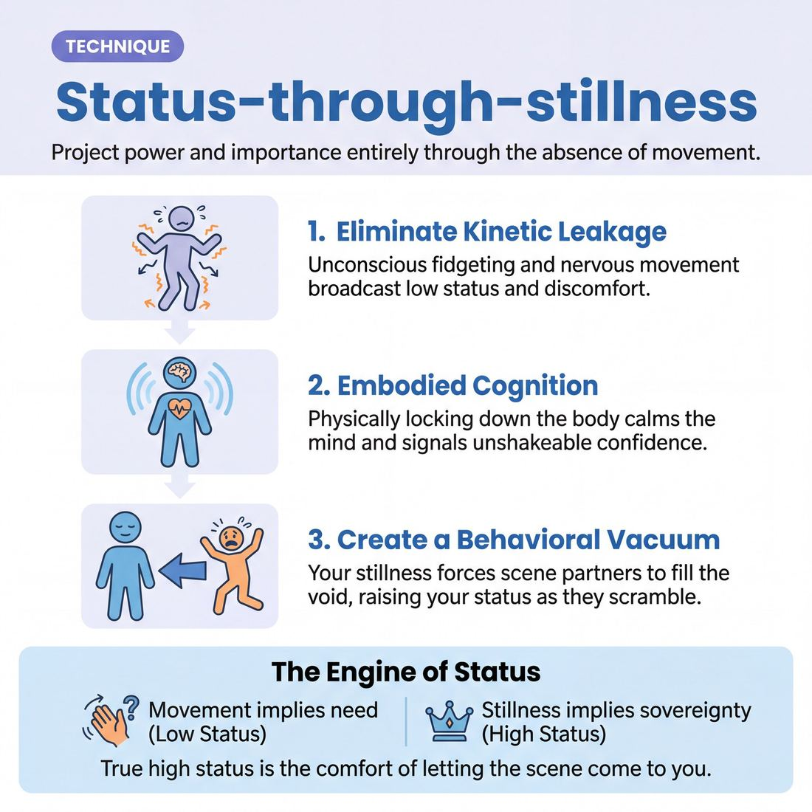

# 🎯 Status-through-stillness

> *A drillable muscle that trains **Silence & Stillness**.*

{ .infographic }

## 🎯 The essence

**Status-through-stillness** is a focused physical exercise where improvisers establish and manipulate their **status**—their relative power, confidence, and importance in a scene—entirely through the absence of movement. By stripping away dialogue, pacing, and the nervous urge to fidget, this technique forces a player to practice a single, vital muscle: the discipline to hold physical ground and tolerate the tension of silence. It proves that true stage presence often belongs not to the person making the most noise, but to the performer who possesses the courage to remain completely still.

!!! abstract "The Core Rep"
    Practicing the physical discipline to project power and intention without moving a muscle or speaking a word.

## 🎓 What it trains

Status-through-stillness isolates and drills the skill of **Silence & Stillness**. At its core, it builds the physical and mental discipline to exist on stage without the protective armor of constant motion or chatter, advancing the improviser toward complete physical and vocal control.

**The problem it solves**  
Under the lights, silence feels dangerous. A novice improviser typically equates "doing nothing" with "failing," and so they rush to fill the void. This panic manifests as **kinetic leakage**—unconscious physical tics like shifting weight from foot to foot, adjusting clothing, wringing hands, or nodding excessively. Vocally, it sounds like babbling, throat-clearing, or nervous laughter. 

This unintentional movement instantly broadcasts low status and discomfort. It signals to the audience and scene partners that the improviser is not in control of themselves, let alone the scene. 

**The deeper principle**  
This technique rewires the improviser's nervous system to understand that power and presence are rooted in economy. It teaches that high status does not require being the loudest, tallest, or most aggressive person in the room; rather, it is the profound comfort of taking up space and time. 

By forcing the body to stop moving, the improviser learns to tolerate the tension of a quiet moment. They discover that when they stop chasing the scene, they command it.

!!! abstract "The Principle of Kinetic Leakage"
    Every unnecessary movement on stage leaks power. When you fidget, you tell the audience you are nervous. When you stop moving entirely, the audience assumes you are doing it on purpose. True high status is the gravitational pull created when you are comfortable enough to let the scene come to you.

## 💡 Why it works

At its core, Status-through-stillness exploits our hardwired social and evolutionary instincts. In human interaction, unnecessary movement subconsciously signals appeasement, anxiety, or a need for approval. By deliberately stripping away these micro-movements, the improviser signals absolute comfort and unshakeable confidence. 

The technique relies on three distinct engines working simultaneously:

1. **The Behavioral Vacuum:** Improvisers (and humans in general) are terrified of dead air. When you hold your ground in perfect stillness, you create a behavioral vacuum. Your scene partner will naturally feel the urge to fill that void. As they talk more, move more, and try to elicit a reaction from you, they inadvertently lower their own status while elevating yours. You win the transaction simply by refusing to participate in the scramble.
2. **Embodied Cognition:** The brain takes cues from the body. When an improviser feels the pressure to invent, their heart rate spikes and the internal "editor" kicks in. By consciously locking down the physical body and breathing through the silence, you trick your own nervous system into feeling safe. The physical discipline of stillness creates actual mental calm.
3. **Theatrical Contrast:** On a stage full of kinetic energy, the audience's eye is drawn to the anomaly. A perfectly still actor amid chaos commands focus. It signals to the audience that this character does not *need* to move; the world moves around them. 

!!! abstract "The Engine of Status"
    *   **Movement implies need:** "I must do something to affect my environment or protect myself." (Low status)
    *   **Stillness implies sovereignty:** "My environment cannot affect me without my permission." (High status)

!!! example "In a scene"
    Player A storms into the room, waving a piece of paper, pacing back and forth, and shouting about a ruined presentation. Player B sits perfectly still behind a desk, hands resting flat, maintaining unbroken eye contact, and says absolutely nothing for five full seconds. 
    
    Without a single word, the audience instantly knows who the boss is. Player A's frantic energy crashes against Player B's stillness, forcing Player A to eventually stop, falter, and wait for permission to speak.

Understanding this mechanism is exactly how an improviser transitions from a novice who panics at dead air, to a master who can weaponize silence—holding the room with a stillness that creates an audible, collective focus.

## 🧩 The setup

To prepare the room for Status-through-stillness, you need to strip away distractions so the players and the audience can focus entirely on physical presence. 

*   **Players & Arrangement:** Played in pairs. The rest of the ensemble sits as an audience. Because this technique relies heavily on subtle physical cues, the audience should be seated close enough to observe eye contact and breathing.
*   **Space & Materials:** A clear stage. Two chairs placed center stage, facing slightly inward. (Starting seated isolates the upper body and removes the temptation to pace, making the drill much more effective for beginners).
*   **Time:** 2–3 minutes per round. Allocate 15–20 minutes total so every player gets to experience both sides of the dynamic.
*   **Roles:**
    *   **Player A (The Anchor):** Assigned **High Status**. Their physical restriction is absolute stillness. They may only move when it is deliberate and necessary.
    *   **Player B (The Satellite):** Assigned **Low Status**. Their physical restriction is continuous, unnecessary movement—fidgeting, shifting weight, breaking eye contact, or adjusting clothing.
    *   **Facilitator:** Sets the scene, side-coaches physical adjustments (e.g., *"Freeze that foot, Player A,"* *"More nervous energy, Player B"*), and calls the edit before the scene loses its focus.
*   **Prerequisites:** Players should have a basic understanding of status dynamics and be comfortable with foundational two-person scene work.

!!! quote "Facilitator Script: How to introduce it"
    "In improv, we often try to prove our character's power by talking louder, interrupting, or making big, aggressive moves. But true high status doesn't need to work that hard. Today, we are going to isolate the physical muscle of power: stillness. 
    
    In these two-person scenes, one of you will play high status by doing absolutely nothing extra. No shifting in your chair, no scratching your nose, no nodding along to show you're listening. You are a statue breathing. The other will play low status by leaking energy—fidgeting, adjusting, breaking eye contact, and moving around the space. We are going to let the stillness do the heavy lifting. Let's get two chairs out here."

## ⚙️ The mechanics

!!! abstract "Core Objective"
    To establish an undeniable power dynamic between two characters using only physical economy and movement, holding the tension of silence before a single word is spoken.

The engine of Status-through-stillness is the deliberate contrast in physical economy. It forces players to strip away clever dialogue and rely entirely on their bodies to negotiate rank. 

Here is the step-by-step flow of a standard training round:

1. **The Assignment:** Two players take the stage. The coach assigns one player High Status (dominant, powerful, or unbothered) and the other Low Status (submissive, eager, or insecure). This can be announced openly to the room or given secretly.
2. **The Silent Entrance:** Both players enter the playing space and establish a relationship to each other or an environment. **No dialogue is permitted.** 
3. **The Physical Negotiation:** For a full 15 to 30 seconds, the players interact purely through physicality. The High Status player weaponizes stillness; the Low Status player utilizes unnecessary movement. 
4. **The First Utterance:** Only when the status dynamic is completely obvious to the audience (often signaled by the coach raising a hand) does one player speak. The line of dialogue must perfectly match the physical status already established.
5. **The Sustained Scene:** The scene continues for another 60 seconds. Players must maintain their physical constraints—especially the High Status player remaining still while delivering lines.

### The Rules of Movement

To make the technique work, players must adhere to strict physical constraints that define their rank in the space.

| Element | High Status (The Stillness) | Low Status (The Movement) |
| :--- | :--- | :--- |
| **Feet & Weight** | Planted firmly. Weight evenly distributed. | Shifting weight from foot to foot. Pacing. |
| **Head & Eyes** | Slow, deliberate head turns. Sustained, unbroken eye contact. | Darting eyes. Looking down or away. Quick, jerky nods. |
| **Hands** | Resting comfortably at the sides, in pockets, or holding an object steadily. | Fidgeting, wringing hands, touching the face, neck, or hair. |
| **Relationship to Silence** | Breathes easily. Completely comfortable letting a moment hang. | Visibly uncomfortable. Rushes to fill the physical space with action. |

### Hard Constraints

* **No "Statue" Acting:** The High Status player must not lock their joints or hold their breath. Tension reads as fear (Low Status). True High Status is *relaxed* stillness.
* **No Pantomime Exaggeration:** The Low Status player should not flail wildly. The movement should consist of realistic micro-adjustments—blinking, shifting, adjusting clothing.
* **Stillness During Speech:** The hardest constraint. When the High Status player finally speaks, they must not gesture or move their head. The voice does all the work while the body remains anchored.

!!! tip "On stage"
    If you are playing High Status and feel the urge to move, **breathe out instead**. Improvisers often use physical movement to bleed off the internal adrenaline of being on stage. By forcing your body to remain still, you channel that energy directly into your presence.

### Ending and Resetting
The coach calls "Scene" once the dynamic has been successfully tested with 3 to 4 lines of dialogue. To reset, the coach can either bring up two new players, or have the current players stay on stage, swap their status assignments, and immediately begin a new silent negotiation.

## 🎬 Sample round

!!! example "Sample round: The Performance Review"
    **The Setup:** Two players take the stage. **Greg** is instructed to play low status, using high physical activity, nervous energy, and rapid speech. **Vance** is practicing Status-through-stillness.

    **Greg:** *(Pacing, shuffling a stack of imaginary folders, speaking rapidly)* "Look, I know the Q3 numbers aren't what we projected, but the supply chain issues were completely out of my hands, and honestly, the marketing team didn't even..."
    
    *(Greg trails off as he looks at Vance. Vance is seated, perfectly upright, hands resting lightly on the table. She does not shift her weight. She maintains unbroken, relaxed eye contact.)*  
    *(Mechanic: The Physical Anchor & Sustained Eye Contact)*

    **Greg:** *(Swallows hard, stops pacing but shifts his weight nervously from foot to foot)* "...didn't give us the assets in time. So. That's where we are."
    
    *(Vance does not immediately respond. She holds the silence for three full seconds. She breathes in slowly, visibly but calmly, letting Greg's nervous energy hang in the air and die out.)*  
    *(Mechanic: The Behavioral Vacuum & Holding the Beat)*

    **Vance:** *(Moving nothing but her hands, she slowly folds them together. Her voice is quiet, unhurried, and entirely devoid of tension.)* "Are you finished making excuses, Greg?"  
    *(Mechanic: Economy of Action & Vocal Control)*

    **Greg:** *(Instantly shrinking, dropping his hands to his sides)* "Yes. Yes, I am."

    **Vance:** *(Holds eye contact for one more beat before blinking)* "Sit."  
    *(Mechanic: The Micro-Offer)*

**Why this works:** Notice how Vance does almost nothing, yet completely controls the scene. Greg is doing all the physical and vocal work, but Vance's stillness acts like a black hole, absorbing Greg's energy and establishing her absolute authority. By refusing to match Greg's frantic pace, Vance forces Greg to adapt to *her* rhythm.

## 🎚️ Variations & progressions

To build a player’s tolerance for silence and their physical control, this technique can be scaled from highly structured drills to advanced, dynamic scene work. As improvisers move through the maturity stages, the focus shifts from simply surviving the silence to actively wielding it.

Here is how to ramp the difficulty:

**1. The Timed Hold (Novice to Advanced Beginner)**  
Novices naturally rush to fill silence, treating it as a void that means the scene is dying. In this variation, the coach removes the pressure of choice. 
*   **The tweak:** Player A initiates with high-energy, low-status dialogue. Player B is instructed to hold absolute stillness and silence for a painfully long, counted duration (e.g., a full 10 seconds) before responding. 
*   **The goal:** To prove that the scene does not break when the talking stops. The player learns to hold a beat on instruction, realizing that the audience leans *in* during the quiet.

**2. The Single Gesture (Competent)**  
Once a player can comfortably hold a beat, they must learn how to break it purposefully. 
*   **The tweak:** The high-status player remains perfectly still while the low-status player talks. The high-status player is allowed exactly *one* slow, deliberate physical movement before they finally speak. 
*   **The goal:** The player decides exactly *when* the moment needs silence to end. Because the stillness has built tension, the single movement carries massive theatrical weight.

!!! example "In a scene"
    **Player A** *(frantically pacing)*: "I checked the numbers three times, boss, I swear, the accounts are empty, I don't know who authorized the transfer!"  
    *(Five seconds of absolute stillness from Player B).*  
    **Player B** *(slowly removes their reading glasses, places them on the desk, and looks up)*: "Sit down, Arthur."

**3. Status Seesaw (Proficient)**  
At this stage, players let moments breathe automatically and use their bodies to instantly convey status without needing a script.
*   **The tweak:** A two-person scene with zero dialogue. Players must establish a clear high/low status dynamic using *only* stillness versus movement (fidgeting, pacing, weight-shifting). On the coach’s clap, they must seamlessly reverse the dynamic—the still player begins to crack and fidget, while the moving player roots themselves in stillness.
*   **The goal:** To make the physical expression of status fluid and automatic, proving that power in a scene is entirely negotiable through body language.

**4. The Black Hole (Master)**  
This is the ultimate test of physical discipline, where a master improviser weaponizes silence to control a room.
*   **The tweak:** Three players are instructed to start a chaotic, loud, fast-paced scene (e.g., a panicked kitchen during a dinner rush). A fourth player enters the scene and does absolutely nothing. They find a spot, root themselves, and project intense, silent focus. 
*   **The goal:** The entering player must use pure, grounded stillness to pull the scene's center of gravity toward them. They do not speak until the chaos naturally dies down, the other players are forced to look at them, and there is an audible collective focus in the room. 

!!! tip "On stage: Active vs. Dead Stillness"
    Stillness is not freezing like a paused video. **Dead stillness** is holding your breath and locking your joints; it looks like fear. **Active stillness** is breathing deeply, keeping your eyes alive, and radiating intention. You are not doing *nothing*—you are actively choosing not to move.

## 🧑‍🏫 Coaching notes

When coaching Status-through-stillness, your primary job is to spot and eliminate physical "leaks"—the unconscious micro-movements players use to bleed off nervous energy. Novices will instinctively try to fill silence or move to prove they are engaged. You must guide them to trust the void and realize that power comes from doing less.

!!! tip "Coaching: The Golden Cue"
    **"Let them come to you."**  
    This is the single most effective side-coach for this technique. High status doesn't chase; it attracts. When a player feels the urge to step forward, speak quickly, or fill the dead air, this cue reminds them to hold their ground and force the scene partner (and the audience) to lean in.

**What to watch for (and correct):**  
To build this muscle, you must be hyper-observant of the player's body. Watch for these common status leaks and address them immediately:
*   **Weight shifting:** The classic "improviser sway" from foot to foot. *Side-coach: "Plant your feet."*
*   **Fidgeting:** Hand-wringing, face-touching, or adjusting clothes. *Side-coach: "Drop your hands to your sides."*
*   **Darting eyes:** Looking at the floor or scanning the room breaks the spell of high status. *Side-coach: "Hold eye contact."*
*   **Rushing the beat:** Jumping on the end of a partner's line to avoid silence. *Side-coach: "Take a full breath before you reply."*

**Delivering your side-coaching:**  
Deliver your cues calmly, slowly, and quietly from the sidelines. Your own voice should model the grounded, unhurried status you want them to achieve. Use short, direct commands: *"Hold the silence,"* *"Make them wait for it,"* or simply, *"Breathe."*

!!! warning "Watch out"
    Don't let players confuse stillness with becoming a statue. A statue is tense, locked, and dead; high-status stillness is relaxed, breathing, and intensely alive. If a player looks like they are holding their breath or locking their knees, side-coach: *"Breathe, drop your shoulders."*

**What 'Good' Looks Like:**  
A player successfully executing this technique looks entirely comfortable in their own skin. Their posture is grounded but not rigid. Their facial expression is attentive but relaxed. When they finally do speak, their vocal energy matches their physical control—unhurried, resonant, and deliberate. You will know it is working when the audience's focus naturally gravitates toward the silent player, drawn entirely by the gravity of their composure.

## 🧭 Debrief & reflection

After the exercise concludes, the goal of the debrief is to bridge the gap between a player’s internal experience (which is often panicked) and their external projection (which is often powerful). Players need to articulate the physical sensation of resisting the urge to fidget, speak, or "save" the scene.

Use these questions to guide the discussion and lock in the learning:

*   **"Where in your body did you feel the urge to move or speak?"** 
    *   *What it surfaces:* The physical manifestation of the inner critic or "editor." Players will often identify a tightness in their chest, a twitch in their hands, or a burning desire to shift their weight. Naming this physical sensation helps them recognize it as a false alarm rather than a genuine impulse.
*   **"Who held the power in that interaction, and how did you know?"**
    *   *What it surfaces:* The direct correlation between economy of motion and status. Players usually realize that the person doing *less*—the one who didn't rush to fill the void—acted as the gravitational center of the scene. 
*   **"When you were the one moving or speaking, how did your partner's stillness make you feel?"**
    *   *What it surfaces:* The pressure and intimidation that stillness projects. The active partner will often report feeling scrutinized, foolish, or compelled to keep talking to win the still partner's approval—a classic low-status response to a high-status anchor.
*   **"Did the silence feel longer to you than it actually was?"**
    *   *What it surfaces:* The distortion of time under pressure. A three-second pause feels like an eternity to a novice, but reads as a perfectly natural, dramatic beat to the audience.

!!! abstract "The Core Realization"
    A successful debrief leads players to this specific epiphany: **Internal panic does not equal external failure.** You can feel entirely unmoored on the inside while projecting absolute, high-status control on the outside, simply by refusing to move.

!!! tip "On stage (or in the classroom)"
    **Debrief in character.** When you ask the group the first debrief question, deliberately hold your own physical stillness and let the silence hang. Watch how the room reacts. The players will immediately feel the exact high-status dynamic you just drilled, proving the technique works in real time.

## ⚠️ Common pitfalls

!!! warning "Watch out: Freezing is not stillness"
    The single biggest novice trap is confusing stillness with **freezing**. When an improviser freezes under pressure, they lock their knees, hold their breath, and tense their shoulders. This instantly reads to the audience as *fear* (low status), not power. True stillness requires breath and relaxation. You are a resting lion, not a deer in headlights.

When you strip away dialogue and movement, the cognitive load of simply *being watched* spikes. The body naturally wants to relieve this pressure, leading to several common pitfalls that instantly shatter the illusion of high status.

*   **The Fidget Leak**
    *   *The Trap:* You think you are standing still, but nervous energy is leaking out through micro-movements. You shift your weight from side to side, adjust your glasses, touch your face, or rapidly blink. High status demands economy of motion; fidgeting broadcasts insecurity.
    *   *The Fix:* Ground yourself physically before the exercise begins. Plant your feet firmly, unlock your knees, and let your arms hang loosely at your sides. If you choose to move, make it a single, deliberate, fully committed action, then return to absolute stillness.
*   **The Panic Fill**
    *   *The Trap:* The silence feels heavy and dangerous. A novice will try to hold a beat, but the internal pressure mounts too quickly, causing them to rush in and speak just to break the tension. 
    *   *The Fix:* Redefine the silence as your weapon, not your enemy. When it is your turn to react, force yourself to take one full, visible breath in and out before opening your mouth. Let the audience see the other person's offer land on you before you deign to respond.
*   **The Dead-Eyed Stare**
    *   *The Trap:* In an effort to remain perfectly motionless, you disconnect mentally. Your face goes entirely blank, your eyes glaze over, and you stop listening to your scene partner. Stillness becomes absence.
    *   *The Fix:* Stillness is physical, not mental. Your body must be anchored, but your eyes must remain fiercely alive. Maintain unbroken, active eye contact. Allow your partner's words to affect you internally—let the audience see the thought process in your eyes, even while your body refuses to flinch. 

!!! tip "On stage"
    If you catch yourself tensing up or holding your breath during a scene, don't try to "fix" your posture abruptly. Simply exhale deeply through your nose and let your shoulders drop. That tiny release of tension often reads as a high-status sigh of disappointment, perfectly serving the scene while resetting your body.

## 🌟 What mastery looks like

At the highest level of execution, Status-through-stillness ceases to look like an exercise in restraint and becomes a demonstration of gravity. The improviser no longer appears to be *trying* to hold still; instead, they look as though they completely own the space they occupy. They have successfully weaponized silence, using the absence of motion to command the room.

When observing a master employ this technique, you will see several distinct markers:

*   **Absolute economy of movement:** There are no micro-movements. No weight shifting from foot to foot, no adjusting of clothing, no nervous swallowing, and no darting eyes. Every physical choice is deliberate.
*   **Relaxed grounding:** The stillness is not rigid, locked, or tense. It is the relaxed, heavy stillness of a mountain. The shoulders are dropped, the breathing is deep and rhythmic, and the body is free of the "fight or flight" tension that plagues novice improvisers.
*   **Ocular dominance:** The improviser’s gaze is steady and unbroken. Whether they are locking eyes with their scene partner to project high-status intimidation, or staring blankly at the floor to project low-status defeat, their eyes do not wander. 
*   **Status elasticity:** The master can use the exact same physical stillness to project entirely different ends of the status spectrum. They can be the terrifying monarch who doesn't need to raise a finger to command a room, or the devastated peasant absorbing a tragedy without a flinch.

!!! abstract "The Ultimate Tell: The Room's Breath"
    The truest observable metric of mastery in this technique isn't found on the stage—it is found in the house. When an improviser achieves master-level stillness, they create an **audible collective focus**. The audience stops shifting in their seats, stops coughing, and unconsciously synchronizes their breathing with the performer. The silence becomes a physical weight in the room.

Ultimately, mastery looks like complete trust in the moment. The improviser feels no urge to rescue a quiet scene with a joke or a sudden movement, knowing that their sheer presence is more compelling than any frantic action they could invent.

## 🔗 Why it matters

Status-through-stillness is the crucible where the broader skill of **Silence & Stillness** is forged. For many improvisers, silence feels like a terrifying void that must be filled, and stillness feels like a lack of contribution. By attaching a tangible, playable objective to it—projecting high status—this technique transforms stillness from a passive state of "not doing" into an active, powerful choice. 

Within the domain of **The Self**, the ultimate goal is complete physical and vocal control, alongside the discipline to remain grounded under pressure. When we are uncertain on stage, our bodies naturally leak nervous energy through weight-shifting, hand-wringing, or wandering eyes. Mastering this technique forces you to confront and conquer that internal static. It builds the courage to exist on stage without the protective shield of constant motion.

Beyond individual body control, this muscle fundamentally alters how you interact with the wider craft of scene work:

*   **Anchoring the stage:** A perfectly still player provides a visual and energetic anchor. This allows your scene partners to be chaotic, kinetic, or highly emotional without the entire scene dissolving into a messy blur.
*   **Clarifying status dynamics:** It provides a reliable, non-verbal tool for establishing authority. You don't need to shout, interrupt, or write a clever line to be the boss; you simply need to stop moving while others scramble.
*   **Drawing audience focus:** While movement initially attracts the eye, deliberate stillness *holds* the room's breath. It signals to the audience that a character is entirely secure in their environment.

!!! abstract "The Paradox of Power"
    In improv, we often feel the desperate urge to *do more* to be seen and to contribute. Status-through-stillness teaches the exact opposite: the less you physically do, the more gravity you possess, and the more the audience will watch you.

## 📚 References & Further Reading

### Foundational sources
*   **Keith Johnstone, *Impro: Improvisation and the Theatre* (1979)** — The definitive text on status in performance. Johnstone explicitly breaks down how physical stillness raises status while "kinetic leakage" (fidgeting, unnecessary movement) lowers it. He argues that status is a physical transaction, and mastering the discipline to keep the head and hands completely still is the fastest way to project dominance on stage. https://www.routledge.com/Impro-Improvisation-and-the-Theatre/Johnstone/p/book/9780878305259
*   **Viola Spolin, *Improvisation for the Theater* (1963)** — While Johnstone owns the specific vocabulary of "status," Spolin's foundational exercises on physical focus and silent scenes (such as "Silent Tension") build the exact muscle required to exist on stage without relying on dialogue. Her work trains the improviser to tolerate the behavioral vacuum and communicate purely through physical presence. https://nupress.northwestern.edu/9780810140080/improvisation-for-the-theater/

### Practitioner guides & manuals
*   **Mick Napier, *Improvise: Scene from the Inside Out* (2004)** — Napier directly addresses the improviser's deep-seated fear of silence. He argues that rushing to speak or move out of panic destroys a player's power, whereas choosing silence and holding one's ground creates a commanding scene. His philosophy reinforces that doing "nothing" is often the strongest initial choice an improviser can make. https://www.heinemann.com/products/e00630.aspx
*   **Patti Stiles, *Improvise Freely: Throw away the rulebook and unleash your creativity* (2021)** — A masterclass in Johnstone-style status work by one of his foremost students. Stiles offers highly practical ways to embody high and low status through physical economy, eye contact, and breathing, providing modern improvisers with actionable drills to stop leaking energy. https://www.pattistiles.com/improvise-freely

### Lineage & teachers
*   **Keith Johnstone & The Loose Moose Theatre Company** — The birthplace of modern status work. Johnstone's lineage, carried on by the Loose Moose Theatre in Calgary, emphasizes that status is a physical transaction rather than a social class, and that stillness is its primary currency. This school of thought is essential for understanding how to weaponize silence in scene work. https://www.loosemoose.com/

### Research & theory
*   **Joe Navarro, *What Every BODY is Saying: An Ex-FBI Agent's Guide to Speed-Reading People* (2008)** — Provides the psychological and evolutionary backing for why this technique works on an audience. Navarro explains "pacifying behaviors" (fidgeting, touching the face or neck to self-soothe) and how absolute stillness signals high cognitive control, lack of fear, and dominance in human interaction. https://www.harpercollins.com/products/what-every-body-is-saying-joe-navarro
*   **Olivia Fox Cabane, *The Charisma Myth: How Anyone Can Master the Art and Science of Personal Magnetism* (2012)** — Explores the nonverbal cues of presence and power. Cabane specifically notes that high-status posture is characterized by an absence of unnecessary movement, warning that excessive nodding and shifting weight instantly decreases a person's perceived poise and authority. https://www.penguinrandomhouse.com/books/309068/the-charisma-myth-by-olivia-fox-cabane/

### Talks, videos & courses
*   **Keith Johnstone, *Status Masterclasses* (Various)** — Johnstone frequently demonstrated status transactions in his recorded workshops, physically adjusting actors to show how freezing the head and hands instantly elevates perceived authority. Watching him side-coach actors to stop moving their heads while speaking is the clearest visual proof of the status-through-stillness concept. https://www.keithjohnstone.com/

### Communities & adjacent reading
*   **Declan Donnellan, *The Actor and the Target* (2001)** — A vital text for actors on presence and focus. Donnellan explores how true stillness is active, not passive, and how holding physical ground forces the scene partner (the "target") to react. It helps improvisers understand that stillness is not "doing nothing," but rather a highly concentrated state of observation. https://www.nickhernbooks.co.uk/the-actor-and-the-target
*   **Patsy Rodenburg, *Presence: How to Use Positive Energy for Success in Every Situation* (2007)** — Rodenburg's concept of "Second Circle" energy aligns perfectly with status-through-stillness. She teaches the mechanics of being fully present, breathing deeply, and taking up space without leaking nervous energy, which is exactly what an improviser must do to hold the tension of a silent stage. https://www.penguinrandomhouse.com/books/301550/presence-by-patsy-rodenburg/

## 💬 Quotes & Anecdotes

!!! quote "— Keith Johnstone, *Impro: Improvisation and the Theatre* (1979)"
    If I speak with a still head, then I'll do many other high-status things quite automatically. I'll speak in complete sentences, I'll hold eye contact. I'll move more smoothly, and occupy more 'space'.

!!! quote "— Keith Johnstone, *Impro: Improvisation and the Theatre* (1979)"
    Actors needing authority — tragic heroes and so on — have to learn this still head trick. You can talk and waggle your head about if you play the gravedigger, but not if you play Hamlet. Officers are trained not to move the head while issuing commands.

!!! quote "— Keith Johnstone, *Impro: Improvisation and the Theatre* (1979)"
    A person who plays high status is saying 'Don't come near me, I bite.' Someone who plays low status is saying 'Don't bite me, I'm not worth the trouble.' In either case the status played is a defence, and it'll usually work.

!!! quote "— Keith Johnstone, *Impro: Improvisation and the Theatre* (1979)"
    Suddenly we understood that every inflection and movement implies a status, and that no action is due to chance, or really 'motiveless'. All our secret manoeuvrings were exposed.

### Where it comes from
The concept of "Status" as a foundational improv tool was pioneered by director and educator Keith Johnstone at the Royal Court Theatre in London in the 1950s and 60s, and later codified in his seminal 1979 book *Impro: Improvisation and the Theatre*. Johnstone realized that scenes only felt authentic when actors played a status slightly above or below their partner. Crucially, he discovered that status wasn't just about social class, dialogue, or volume—it was deeply physical. He observed that high-status individuals project power through physical economy, unbroken eye contact, and, most importantly, absolute stillness of the head and body. 

### A telling example
In *Impro*, Johnstone recounts a famous classroom demonstration he used to prove the invisible power of physical stillness. He would stand before his students and deliberately shift his behavior to become highly authoritative. 

When he asked the class what he had changed to suddenly command the room, they would guess things like, "You're holding eye contact," or "You're sitting straighter." Johnstone would then deliberately stop doing those specific things—breaking eye contact or slouching—yet his authoritative aura remained intact. 

Finally, he would reveal the secret: he was simply keeping his head perfectly still whenever he spoke. He noted that the urge to move is so deeply ingrained in human appeasement behavior that some students found it physically impossible to speak with a still head. Curiously, many students would insist their head was perfectly still while they were actively jerking it about, forcing Johnstone to put them in front of a mirror or use videotape to prove how much kinetic energy they were unconsciously leaking.

## 🧭 Explore the framework

- ⬆️ **Skill it trains:** [Silence & Stillness](01_S5__silence-and-stillness.md)
- 🎭 **Domain:** [The Self](01_D__the-self.md)
- 🔁 **Sibling techniques:** [Do nothing exercises](01_S5_T1__do-nothing-exercises.md), [Hold-the-beat reps](01_S5_T2__hold-the-beat-reps.md)
