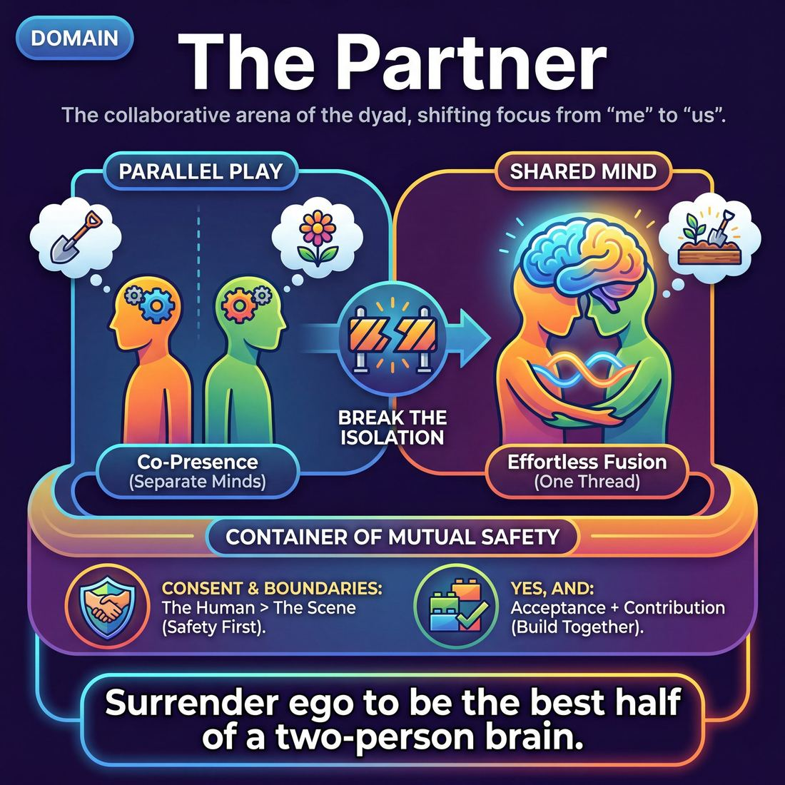

# 🎭 The Partner

> *From 'acting with someone' to a 'shared mind' — within a container of mutual safety.*

{ .infographic }

## 🎭 The arena

The **Partner** domain is the interpersonal arena of improvisation. If the first domain (The Self) is about tuning your own instrument and managing your internal state, this second domain is where improvisation truly becomes a collaborative art. It governs the immediate, one-on-one connection between you and your scene partner. 

In this arena, your focus shifts entirely outward. You are no longer an isolated inventor responsible for generating brilliant ideas from scratch; instead, your primary job is to observe, receive, and react to the human being standing across from you. This is the space of the **dyad** (the two-person unit)—the fundamental building block of almost every improvised scene.

The relationship governed by this domain is one of radical, mutual reliance. It demands a container of absolute psychological and physical safety, allowing two performers to drop their defenses and become highly permeable to each other's influence. You are not just taking turns speaking; you are actively working to make your partner look like a genius. When this domain is fully realized, the boundary between two separate performers dissolves into a **shared mind**—a state where both improvisers are so deeply attuned to each other's micro-expressions, tone, and intent that they seem to be breathing the same air and discovering the scene at the exact same moment.

!!! abstract "The Core Shift"
    In the Self domain, the driving question is *"What am I doing?"* In the Partner domain, the driving question becomes *"What are **we** doing, and what do **you** need from me right now?"*

## 🧭 The goal

The ultimate objective of this domain is to transform two individuals sharing a stage into a single, unified creative organism. We are moving from simply acting *with* someone to achieving that shared mind, all held within an unbreakable container of mutual safety.

To understand why this matters, we must unpack the three components of this goal:

**1. Escaping "Parallel Play"**  
When we first step on stage, we tend to treat our partner as a prop or a sounding board. We take turns speaking. We wait for them to finish their line so we can deliver the idea we just thought of. This is mere co-presence—two people in the same space, operating independently. The first goal of this domain is to shatter that isolation and replace polite turn-taking with true, continuous collaboration.

**2. Achieving a Shared Mind**  
A shared mind occurs when the friction between two improvisers disappears. You stop planning your next move and start reacting purely to what is given. It is the micro-level version of "group mind." When you reach this state, the scene feels effortless because you are no longer carrying the burden of invention alone; you are following the exact same logical and emotional thread as your partner. 

!!! example "In a scene"
    **Parallel Play (Acting *with* someone):**  
    *Player A:* "I brought the shovels." (Thinking: *We are grave robbers.*)  
    *Player B:* "Great, let's plant these petunias." (Thinking: *We are gardeners.*)  
    *Result:* A tug-of-war over the scene's reality.

    **A Shared Mind:**  
    *Player A:* "I brought the shovels."  
    *Player B:* (Noticing A's shifty eyes and hushed tone) "Good. The moon is full and the dirt is soft."  
    *Result:* B drops their own invention to instantly align with A's unspoken subtext.

**3. The Container of Mutual Safety**  
This level of hyper-connection requires profound vulnerability. You cannot achieve a shared mind if your own brain is busy guarding your physical or emotional boundaries. If an improviser fears their partner might physically hurt them, cross a personal line, or throw them under the bus for a cheap laugh, their defenses go up. The shared mind immediately shuts down. 

Therefore, establishing mutual safety—trusting that your partner has your back and respects your limits—is not just a nice-to-have HR policy. It is the absolute, mechanical prerequisite for taking the creative risks that make improv thrilling.

!!! abstract "Key idea"
    The Partner domain asks you to surrender your individual ego. The goal is not to be the best improviser on stage, but to be the best half of a two-person brain.

## 💎 Its principles — the Why

The principles of the Partner domain represent a profound shift in a performer's mindset. Moving from the Self to the Partner demands that you de-center your own ego and place your attention, trust, and care entirely on the person standing across from you. 

These four principles form the ethical and creative foundation required to build a shared mind.

### Consent & Boundaries
Before you are scene partners, you are two human beings. **Consent & Boundaries** form the absolute bedrock of all interpersonal play. Without physical and emotional safety, true vulnerability and risk-taking are impossible.

*   **What it asks of you:** To prioritize the safety and autonomy of your partner over the comedy, the narrative, or the "rules" of improv. You must actively read their comfort levels, respect their physical and emotional limits, and never force them into a space where the *actor* feels unsafe, even if the *character* is in danger.

    !!! abstract "Key idea: The Human > The Scene"
        The scene can always be sacrificed to protect the human. If a boundary is approached, the scene must pivot. If a boundary is crossed, the scene stops. The illusion of the stage never supersedes the reality of the partnership.

### Yes, And
This is the fundamental algorithm of improvisation. **"Yes"** is the unconditional acceptance of the reality your partner has established; **"And"** is the active contribution of new information that builds upon it. 

*   **What it asks of you:** To surrender your preconceived ideas and personal agenda. When your partner initiates, you must instantly let go of the brilliant joke you were planning and fully commit to the reality they just handed you.

    !!! example "In a scene"
        If your partner initiates with, "The spaceship is leaking pudding!", replying with "Yes, and I'll grab a spoon!" accepts the reality and escalates it. Replying with "We aren't in a spaceship, we're at the dentist" is a denial that severs the partnership and forces your partner to abandon their creation.

### Make Your Partner a Genius
This principle is the ultimate act of theatrical generosity. It means treating every offer your partner makes—even the clumsy, contradictory, or bizarre ones—as a deliberate stroke of brilliance. 

*   **What it asks of you:** To shift your goal from "looking good" to "making *them* look good." When they stumble, you justify it. When they make a bold, weird choice, you match its energy and frame it as exactly what the scene needed.

    !!! tip "On stage"
        If your partner accidentally calls you "Mom" instead of "Margaret," do not correct them or make a joke at their expense. Lean in: *"Yes, I'm your mother now, and as your mother, I forbid you from marrying that ghost."* You have just justified their slip-up, making it the most interesting dynamic in the scene.

### Assume Competence
While making your partner a genius is about elevating their offers, **Assume Competence** is about trusting their process. It is the unwavering belief that your partner is capable, intelligent, and making choices on purpose.

*   **What it asks of you:** To stop trying to "save" the scene, drive the narrative, or micromanage your partner. If they are silent, assume it is a powerful dramatic pause, not that they are frozen. If they initiate something confusing, trust that they have a destination in mind, and follow them there rather than wrestling the steering wheel away.

    !!! warning "Watch out: 'Pimping'"
        When you fail to assume competence, you might fall into **pimping**—forcing your partner to do something difficult or embarrassing (e.g., "Sing us that song you wrote!") because you don't trust them to generate their own interesting behavior. Trust them to play; don't assign them homework.

## 🧠 Its skills & techniques — the What & How

To achieve a shared mind, improvisers must master a specific set of interpersonal tools. These skills shift the focus from *what am I doing?* to *what are we building?* 

The craft of this domain can be grouped into three core actions: **Receiving** your partner, **Elevating** your partner, and **Protecting** the container you play in.

### 📥 Receiving: The Intake
Before you can build together, you must be able to accurately process what your partner is giving you.

*   **Active Listening:** This is the foundational skill of the domain. It requires silencing your internal script-writer to absorb your partner's complete communication. It means hearing the text, but also catching the subtext, the tone, and the hesitation between words.
*   **Offer Reception:** Once an offer is heard, how is it processed? This is the mechanics of letting an offer truly land. Good offer reception means allowing your partner's words or actions to genuinely alter your character's emotional state or physical reality before you respond.
*   **Single-Partner Empathy & Mirroring:** The physical and emotional alignment with your scene partner. By matching their posture, breathing rate, or energy level, you establish immediate subconscious rapport and a shared reality.

!!! tip "On stage: Listen with your eyes"
    Active listening is a full-body sport. Watch your partner's micro-expressions, where they place their weight, and what they do with their hands. Often, the most important offer they make in a scene will be entirely silent.

### 🎁 Elevating: The Output
Once you have received your partner, your output should be designed to make their job easier and their performance better.

*   **Active Gifting:** The practice of giving your partner specific, usable information (**endowments**) about who they are, what they are doing, or how they feel. It removes the burden of invention from their shoulders.
*   **Status Modulation:** The conscious adjustment of your character's social, physical, or relational dominance relative to your partner. Playing high or low **status** creates instant dynamic tension and implies a deep relationship history without needing exposition.

!!! example "In a scene: Active Gifting"
    *Vague (forces the partner to invent):* "What is that thing you're holding?" 
    *Active Gift (sets the partner up to play):* "Careful with that scalpel, Dr. Evans, your hands are shaking again." 
    The second option gives the partner a prop, an occupation, a name, and an emotional state to react to.

### 🛡️ Protecting: The Container
Deep collaboration requires deep trust. The final pillar of this domain ensures the play remains safe.

*   **Boundary Navigation:** The continuous, often unspoken process of reading your partner's comfort levels and respecting their physical and emotional limits. It involves checking in, reading body language for signs of genuine distress (versus character distress), and knowing how to pivot if a line is crossed.

!!! warning "Watch out: The 'Yes, And' Trap"
    Never use the rule of "Yes, And" to bulldoze a partner into a physical or emotional space where they feel unsafe. **Boundary Navigation** always supersedes the mechanics of the scene. If your partner subtly blocks a physical advance or a sensitive topic, accept the block gracefully and steer the scene elsewhere.

## 🪧 Engines, distinctions & scoping

The Partner domain operates on a distinct set of mechanics that separate it from both your internal process and the broader narrative of the show. To master this arena, you must understand what drives it, what limits it, and the critical differences between merely sharing a stage and truly sharing a mind.

### The Engines of the Dyad

If the Self domain is powered by your own imagination, the Partner domain is powered by **The Micro-Feedback Loop**. 

In a true improvisational partnership, the engine is not the individual ideas being generated, but the continuous, unbroken circuit of giving and receiving between two people. You do something, it affects your partner; their reaction affects you, which changes your next move. This loop generates momentum entirely on its own, removing the burden of "inventing" from either player.

!!! abstract "The Status Seesaw"
    Another primary engine in this domain is **Status Modulation**. Every human interaction involves a subtle negotiation of power, importance, and space. By consciously tilting this seesaw—raising your partner's status or lowering your own—you create an instant, compelling interpersonal dynamic that drives the relationship forward without needing a complex plot.

### Critical Distinctions

To keep your focus sharp in this domain, the framework draws several hard lines between concepts that are often confused by developing improvisers:

| Concept A | Concept B | The Distinction |
| :--- | :--- | :--- |
| **Co-acting** | **Interacting** | *Co-acting* is two improvisers taking turns delivering pre-planned lines (waiting to speak). *Interacting* means allowing your partner's move to genuinely alter your emotional state and your next choice. |
| **Character Conflict** | **Player Conflict** | Characters can scream, fight, and disagree vehemently. That is *Character Conflict*. But if the improvisers are fighting over the reality of the scene (e.g., denying each other's endowments), that is *Player Conflict*. The Partner domain requires absolute player alignment, even during character conflict. |
| **Politeness** | **Support** | *Politeness* is agreeing with everything your partner says but adding nothing, leaving them stranded. *Support* (Active Gifting) is giving them something solid to react to, even if it challenges their character. |

!!! warning "Watch out: The 'Polite' Trap"
    Novices often confuse psychological safety with narrative safety. They avoid making strong choices or endowing their partner with bold traits because they don't want to "mess up" the other person's idea. True support in the Partner domain means making a definitive choice so your partner doesn't have to do all the heavy lifting.

### Scoping: Where this domain begins and ends

The Partner domain is strictly bounded by the **dyad**—the one-on-one connection. 

It begins the moment you step out of your own head (leaving the Self domain) and place your attention entirely on the human being across from you. It ends right before you start worrying about the overarching narrative, the game of the scene, or the audience's reaction (the Scene and Ensemble domains). 

!!! tip "On stage: Shrink your world"
    When you feel overwhelmed by a scene that isn't working, the fastest fix is to aggressively scope down to the Partner domain. Stop trying to fix the plot. Stop trying to be funny for the audience. Look at your partner's eyes, notice their posture, and react only to the last thing they said. Let the universe shrink to just the two of you.

## 📈 The journey across this domain

Growth in the Partner domain is the transition from "two people taking turns talking" to a single, unified organism. It requires moving past the cognitive load of self-management (Domain 1) to truly see, hear, and support the person standing across from you. 

This journey moves from self-preservation to symbiosis. As you progress, the mechanics of listening and gifting become less conscious, and your ability to read your partner deepens from hearing their words to sensing their breath.

### The Maturity Progression

| Stage | 👂 Active Listening | 🎁 Active Gifting | 🎭 Status Modulation | 🛡️ Boundary Navigation |
| :--- | :--- | :--- | :--- | :--- |
| **1 Novice** | Tries to listen but load pulls them into planning their line. | Tries to endow but gives vague/unusable offers. | Status is accidental, unintentional. | Aware safety matters but forgets to check in under pressure. |
| **2 Adv. Beginner** | Repeats partner's words accurately in drills. | Gives a clear endowment when prompted. | Plays assigned high or low status. | Uses check-ins and "Cut" in exercises. |
| **3 Competent** | Builds on partner's *specific* offers. | Chooses gifts that ease the partner's job. | Picks status that fits the relationship. | Reads and respects limits while improvising. |
| **4 Proficient** | Hears subtext, not just text. | Gifts instinctively to set partner up to shine. | Status shifts fluidly to drive the story. | Senses comfort levels and adjusts without breaking scene. |
| **5 Master** | Reads partner's breath/micro-expressions to anticipate the offer. | Every move makes the partner look brilliant; gifting is invisible. | Status play is purposeful and unnoticed. | Models safety so fully the ensemble trusts total risk-taking. |

### The Arc of Growth

**The Novice Phase: Survival and Isolation**  
At the beginning, you are physically with a partner, but mentally alone. The sheer cognitive load of being on stage pulls you inward. You *want* to listen, but panic forces you to plan your next line. When you try to give your partner a gift, it often comes out vague ("Look at that thing!"), and your status in the scene is usually an accident of your own nervous energy. 

**The Competent Phase: Conscious Collaboration**  
With practice, the panic subsides and true collaboration begins. You stop planning and start building on the *specific* details your partner gives you. You actively choose to make their job easier—giving them a clear name, relationship, or emotional reaction. You are consciously aware of boundaries, reading their limits in real-time and adjusting your play to keep the container safe.

!!! abstract "The Turning Point"
    The most significant leap in this domain happens between Competent and Proficient. It is the moment an improviser stops asking, *"What should I do next?"* and starts asking, *"What does my partner need right now?"* 

**The Master Phase: Symbiosis**  
At mastery, the mechanics of improv disappear into pure connection. You are no longer just listening to words; you are reading micro-expressions, posture, and the sharp intake of breath before your partner even speaks. Your gifting becomes invisible—you don't just hand them an idea, you seamlessly set the stage for them to look like a genius. Because you model such profound, unwavering safety, your partner feels completely free to take massive creative risks. You share a single mind.

## 🧩 How it connects to the other domains

!!! abstract "The Bridge Between Internal and External"
    The Partner domain is the crucible of improvisation. It is the exact moment the craft shifts from a solo act of imagination to a collaborative act of creation. Sitting at the second layer of the framework, it acts as the vital bridge between your internal state and the external world of the show.

Here is how the interpersonal dynamic of the Partner connects up and down the framework:

*   **Rests upon The Self (Domain 1):** You cannot truly support a partner if you are trapped in your own head. Mastery of the Self—specifically emotional regulation, overcoming fear, and dropping your ego—is the absolute prerequisite for **Active Listening**. If your cognitive load is entirely consumed by planning your next line, the partner becomes an obstacle rather than an asset.
*   **Generates The Scene (Domain 3):** The scene is simply the exhaust fume of a good partnership. When two improvisers achieve a shared mind—operating as a single creative unit rather than two competing writers—the scene builds itself. When improvisers struggle with the Scene (e.g., arguing over the reality, stalling, or asking questions), the root cause is almost always a breakdown in the Partner domain. 
*   **Scales to The Ensemble (Domain 4):** The Ensemble is the Partner domain multiplied. The interpersonal muscles built here—**Status Modulation**, **Active Gifting**, and **Boundary Navigation**—are the exact same muscles required to navigate a chaotic group game. If you cannot share focus and yield to one person, you will inevitably bulldoze a group of six.
*   **Captivates The Audience (Domain 5):** Audiences will forgive a messy plot, but they are mesmerized by genuine human connection. When an audience watches two performers actively taking care of each other—making each other look like geniuses and playing with obvious mutual trust—they relax. The audience's feeling of safety is directly proportional to the safety the partners demonstrate with one another.

!!! tip "On stage: Diagnose down"
    If your **Scene** feels stuck, heavy, or overly transactional, do not try to fix the plot. Drop down one layer to the **Partner**. Stop inventing new information and instead look at your partner's face, mirror their posture, and react emotionally to the last thing they said. Re-establishing the interpersonal connection will almost always unstick the narrative.

## 🎓 How to train this domain

Training the **Partner** domain requires a fundamental shift in attention: your primary job is no longer to generate brilliant ideas, but to observe, support, and elevate the person standing across from you. You are building the two-person mind.

To develop this domain, focus your practice on dyad (two-person) exercises that isolate connection, listening, and mutual support.

**1. Isolate Active Listening and Reception**  
Beginners often "listen" just enough to know when it's their turn to speak, while their brain frantically plans their next line. To break this habit, use exercises that make planning impossible.
*   **Repetition exercises:** Strip away the pressure to invent plot. Have improvisers simply repeat the last thing their partner said, focusing entirely on *how* it was said (tone, body language, subtext) before responding. 
*   **Word-at-a-time:** This classic drill forces the brain to surrender control. You cannot plan a sentence when you only control half the words, forcing you into a state of pure **Offer Reception**.

!!! tip "On stage: The 'Last Word' rule"
    In rehearsal, try a constraint where your line of dialogue must begin with the exact last word your partner just spoke. It forces you to listen all the way to the period, killing the urge to formulate your response while they are still talking.

**2. Practice Active Gifting**  
Train improvisers to give gifts that are specific, usable, and flattering. The goal is to **Make Your Partner a Genius**.
*   **Endowment drills:** Practice giving your partner a clear identity, emotion, or physical state right at the top of the scene. 
*   **The "Yes, And" escalation:** Have pairs explicitly state what they love about their partner's offer before adding to it, training the muscle of **Assume Competence**.

!!! example "In a scene: Vague vs. Specific Gifting"
    *Vague (Hard to use):* "What's wrong with you today?" (Forces the partner to invent the problem).
    *Specific (Easy to use):* "I love how your eye twitches when you're trying to hide the fact that you ate my sandwich." (Gives the partner an immediate physical reaction and a clear relationship dynamic to play).

**3. Play with Status Modulation**  
Status is the seesaw of interpersonal power. Train it by making the invisible visible.
*   **Physicalizing status:** Have improvisers play scenes where they must physically raise or lower their eye level, take up more or less space, or control the pace of the conversation.
*   **Status numbers:** Assign players a secret status number (1–10) and have them interact. The goal isn't just to play the number, but to accurately read and adapt to the partner's number, shifting fluidly to drive the relationship.

**4. Normalize Boundary Navigation**  
You cannot achieve a shared mind without a container of absolute safety. Trust is built through explicit practice, not just good intentions.
*   **Practice the brakes:** Don't wait for a crisis to use safety mechanics. In early rehearsals, have improvisers practice saying "Cut," "Pause," or using physical tap-outs in completely mundane scenes. Muscle memory matters.
*   **Check-ins:** Train the habit of eye-contact check-ins. A subtle raise of the eyebrows or a squeeze of the hand can silently ask, *"Are we good here?"*

!!! abstract "Key idea: The Mirror Test"
    A great way to test your mastery of the Partner domain is to ask yourself after a scene: *Could I describe exactly what my partner was wearing, how they were standing, and what emotion they were playing?* If the answer is no, your focus was likely trapped in your own head.

## 📚 References & Further Reading

### Foundational sources
*   **Charna Halpern, Del Close, and Kim "Howard" Johnson, *Truth in Comedy: The Manual of Improvisation* (1994)** — The definitive text on long-form improv. It introduces the concept of "group mind" and codifies the core philosophy that your primary job is to make your partner look good, rather than hunting for your own jokes.
*   **Viola Spolin, *Improvisation for the Theater* (1963)** — The foundational text on theater games. Spolin emphasizes the shift from individual ego to group focus, teaching improvisers to escape "parallel play" by focusing entirely on the shared object or the game being played together.
*   **Keith Johnstone, *Impro: Improvisation and the Theatre* (1979)** — Explores status transactions and the importance of connection. Johnstone's work is vital for understanding how to assume competence in your partner and why blocking (denying an offer) destroys the shared reality of the dyad.

### Practitioner guides & manuals
*   **Matt Besser, Ian Roberts, and Matt Walsh, *The Upright Citizens Brigade Comedy Improvisation Manual* (2013)** — A highly mechanical breakdown of the "Yes, And" algorithm. It focuses heavily on agreement, deep listening, and establishing a shared base reality with your scene partner before escalating the comedy.
*   **Adam Meggido, *Improv Beyond Rules: A Practical Guide to Narrative Improvisation* (2019)** — Reframes the traditional ruleset around the interpersonal dyad. Meggido defines true listening as "a willingness to be changed" by your partner, which is the mechanical prerequisite for a shared mind.
*   **Patti Stiles, *Improvising Now: A Practical Guide to Modern Improv* (2021)** — A modern update on Johnstone's lineage that deeply explores the dyad, authentic connection, and breaking rigid rules of play to foster mutual trust and vulnerability on stage.

### Lineage & teachers
*   **Del Close & Charna Halpern (iO Theater)** — The champions of the "shared mind" and the philosophy that treating your partner like a genius will literally make them one on stage. Their teachings shifted improv from a competitive sport to a collaborative art.
*   **The Second City (Chicago)** — The institution that popularized "Yes, And" as a collaborative tool for generating sketch comedy through mutual agreement, proving that the dyad is more powerful than the lone-inventor mindset.
*   **Theatrical Intimacy Education (TIE) & Intimacy Directors and Coordinators (IDC)** — The organizations and lineages that have recently brought formal consent, boundary practices, and psychological safety into theater and improv spaces, ensuring the human is always prioritized over the scene.

### Research & theory
*   **Amy Edmondson, *The Fearless Organization: Creating Psychological Safety in the Workplace for Learning, Innovation, and Growth* (2018)** — The definitive research on psychological safety. Edmondson's work explains why the "container of mutual safety" is mechanically required for interpersonal risk-taking and vulnerability.
*   **Keith Sawyer, *Group Genius: The Creative Power of Collaboration* (2007)** — A cognitive psychologist's look at how improv ensembles create a shared mind. Sawyer proves that true innovation comes from the continuous, frictionless collaboration of the dyad and the group, not the isolated genius.
*   **Charles Limb and Allen Braun, *Neural Substrates of Spontaneous Musical Performance* (2008)** — An fMRI study showing how the brain's self-monitoring (ego) shuts down during improvisation, allowing for a highly permeable, "shared mind" state where performers react purely to what is given.

### Talks, videos & courses
*   **Kelly Leonard, *Yes, And: How Improvisation Reverses "No, But" Thinking* (Talks at Google, 2015)** — A verifiable lecture by Second City's Kelly Leonard on how the principles of the partner domain—specifically "Yes, And" and assuming competence—apply to collaboration and escaping parallel play.
*   **Charles Limb, *Your Brain on Improv* (TED Talk, 2010)** — Discusses the neuroscience of improvisation and how the brain's self-censorship mechanisms lower during collaborative, interpersonal play, facilitating the "shared mind."
*   **Tina Fey, *Bossypants* (2011)** — While technically a memoir, her widely cited "Rules of Improvisation" chapter serves as a masterclass in "Yes, And" and the theatrical generosity of making your partner look good.

### Communities & adjacent reading
*   **Chelsea Pace, *Staging Sex: Best Practices, Tools, and Techniques for Theatrical Intimacy* (2020)** — A foundational text on theatrical intimacy and consent that is increasingly applied to the improv stage to establish boundaries, ensuring performers know how to protect the human while playing the character.
*   **Mia Schachter, *Consent Culture in Improv* workshops** *(unverified)* — A leading voice in bringing explicit consent, boundary work, and physical safety protocols into improv comedy spaces, addressing the historical lack of safety in the art form.
*   **Martin Buber, *I and Thou* (1923)** — A philosophical text on the nature of the dyad. Buber explores the difference between treating someone as an "It" (an object to be used, akin to parallel play) versus a "Thou" (a true partner in a shared, mutual reality).

## 💬 Quotes & Anecdotes

!!! quote "— Tina Fey, *Bossypants* (2011)"
    The second rule of improvisation is not only to say yes, but YES, AND. You are supposed to agree and then add something of your own. If I start a scene with 'I can't believe it's so hot in here,' and you just say, 'Yeah...' we're kind of at a standstill. But if I say, 'I can't believe it's so hot in here,' and you say, 'What did you expect? We're in hell.' ... now we're getting somewhere.

!!! quote "— Del Close"
    If we treat each other as if we are geniuses, poets and artists, we have a better chance of becoming that on stage.

!!! quote "— Keith Johnstone, *Impro: Improvisation and the Theatre* (1979)"
    There are people who prefer to say 'Yes', and there are people who prefer to say 'No'. Those who say 'Yes' are rewarded by the adventures they have, and those who say 'No' are rewarded by the safety they attain.

!!! quote "— Charna Halpern, Del Close, and Kim 'Howard' Johnson, *Truth in Comedy* (1994)"
    The only way to do a comedy scene is to play it straight. Jokes are not necessary; they are a complete waste of time and energy better spent developing the scene.

### Where it comes from
The foundational concepts of the Partner domain—specifically **"Yes, And"** and **agreement**—trace their roots back to Viola Spolin's theater games in the mid-20th century, which prioritized deep listening and collaborative play over individual invention. 

The specific ethos of "making your partner look good" and achieving a "group mind" (or shared mind) was heavily championed by Del Close and Charna Halpern at Chicago's iO Theater (formerly ImprovOlympic). They developed the "Harold," a long-form improv structure that required performers to abandon pre-planned jokes and ego, relying entirely on mutual support and hyper-attunement to create a unified theatrical piece.

### A telling example
**The "Accidental" Genius**
A classic illustrative scenario of "Making Your Partner a Genius" happens when a performer makes a genuine mistake on stage. Imagine Player A walks into a scene intending to play a tough mob boss talking to their lieutenant, Margaret. However, in the heat of the moment, Player A accidentally says, "Listen to me, Mom."

In a state of *parallel play* or ego-driven improv, Player B might break character, laugh, or mock the mistake: "Mom? I'm your lieutenant, you idiot!" This breaks the reality and leaves Player A looking foolish.

But an improviser operating in the **Partner domain** assumes competence and treats the slip-up as a deliberate stroke of genius. Player B instantly drops their own plan and justifies the mistake, responding: "I know I'm your mother, Tony, but I'm also the best hitman in this family, so show some respect." By accepting and building on the error, Player B saves their partner, and together they instantly discover a much more interesting, shared reality than either could have planned alone.

## 🧭 Explore the framework

- 💎 **Principles (the Why):** [Consent & Boundaries](02_P1__consent-and-boundaries.md), [Yes, And](02_P2__yes-and.md), [Make Your Partner a Genius](02_P3__make-your-partner-a-genius.md), [Assume Competence](02_P4__assume-competence.md)
- 🧠 **Skills (the What & How):** [Active Listening](02_S1__active-listening.md), [Status Modulation](02_S2__status-modulation.md), [Single-Partner Empathy & Mirroring](02_S3__single-partner-empathy-and-mirroring.md), [Offer Reception](02_S4__offer-reception.md), [Active Gifting](02_S5__active-gifting.md), [Boundary Navigation](02_S6__boundary-navigation.md)
