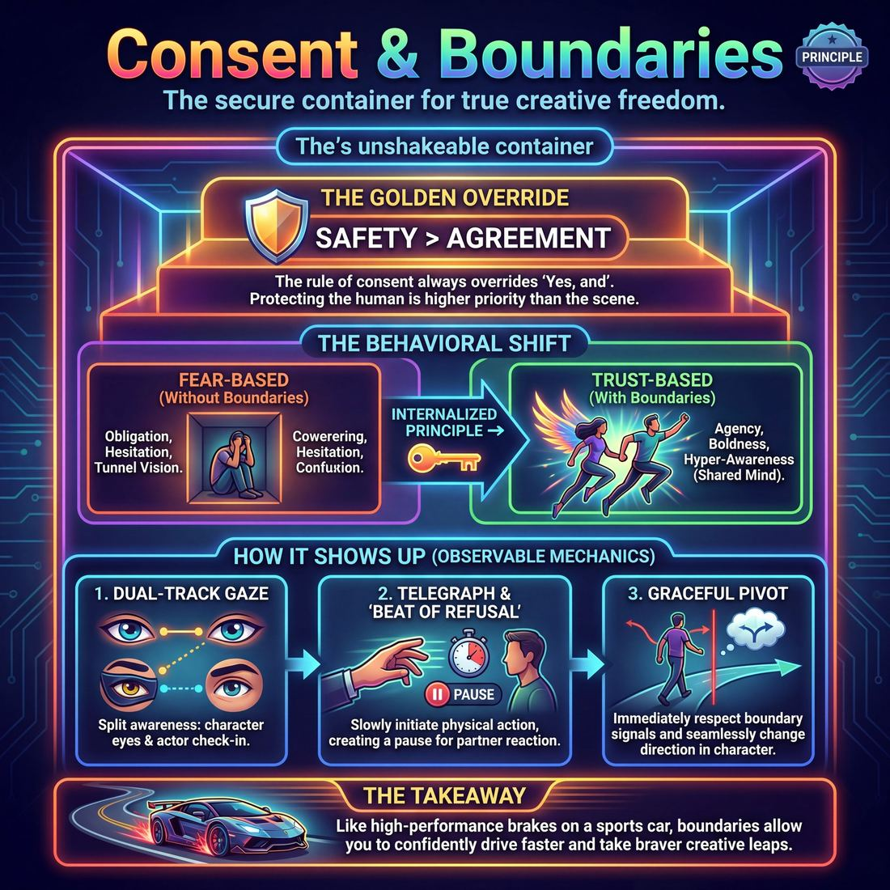

# 💎 Consent & Boundaries

> *Safety is the container Yes-And lives inside. The rule of consent overrides the rule of agreement.*

{ .infographic }

## 💎 The core belief

Improvisation demands radical vulnerability. We ask performers to step onto a stage without a script, embrace the unknown, and unconditionally accept whatever their partner offers. But this foundational rule of "Yes, and" cannot exist in a vacuum; it must live inside a secure, unshakeable container of mutual safety. **Consent and boundaries** form the walls of that container. This principle holds that true creative freedom is only possible when every player trusts that their physical, emotional, and psychological limits will be respected. Without this baseline of safety, the vulnerability required for great improv is impossible, and the work becomes a source of anxiety rather than joy.

The absolute conviction of this principle is that the rule of consent *always* overrides the rule of agreement. While improvisers are trained to accept their partner's reality, that obligation ends the moment an offer crosses a personal boundary. If a scene partner initiates unwanted physical contact, introduces deeply triggering subject matter, or pushes a dynamic that feels genuinely unsafe, the improviser has the unquestionable right to reject it. The human being standing on the stage is infinitely more important than the fictional character they are playing, and protecting that human being is the highest priority of the ensemble.

!!! abstract "The Golden Override"
    In the hierarchy of improv rules, **Safety > Agreement**. "Yes, and" applies to the fictional reality of the scene, but it never requires you to accept real-world discomfort, harm, or boundary violations.

## 🌱 Why it governs everything

When a performer truly internalizes the principle of consent and boundaries, a profound shift occurs: they stop viewing limits as restrictions on their creativity and start recognizing them as the very foundation of their freedom. 

Think of it like the brakes on a sports car. You don't install high-performance brakes because you want to drive slowly; you install them so you can confidently drive fast, knowing you can stop the exact moment you need to. When improvisers know their boundaries—and their partner's boundaries—will be respected, they can take massive, fearless creative leaps.

### The Behavioral Shift
Internalizing this principle transforms how an improviser operates on stage and in rehearsal. The focus moves from merely surviving the scene to actively protecting the partnership.

| Before holding this value | After holding this value |
| :--- | :--- |
| **Obligation:** Endures uncomfortable physical touch or triggering subject matter out of a fear of "ruining the scene" or being labeled a bad improviser. | **Agency:** Confidently steps back, breaks physical contact, or edits a scene the moment a boundary is crossed, knowing the scene is secondary to the human. |
| **Hesitation:** Plays tentatively, second-guessing choices out of fear they might accidentally upset their partner. | **Boldness:** Plays with high commitment, trusting that if they approach a line, their partner will clearly communicate it. |
| **Tunnel Vision:** Focuses solely on the narrative or the joke, missing their partner's stiffening posture, nervous laughter, or panicked eyes. | **Hyper-Awareness:** Maintains a "shared mind," constantly reading their partner's micro-expressions and breathing to gauge true, enthusiastic comfort. |

Ultimately, this principle governs everything because a scene can be rebuilt, a show can be saved, and a laugh can be found elsewhere. But the trust between partners, once broken by a violated boundary, is incredibly difficult to repair. When consent leads, trust deepens, and the work naturally becomes more daring, joyful, and connected.

## 👀 How it shows up

While consent is an internal conviction, it produces highly visible, physical behaviors on stage. You can watch a duo and immediately see whether they are operating inside a container of mutual safety or if one player is driving without a seatbelt. 

When this principle is active, it changes the literal geometry and pacing of a scene. Players do not ambush each other; they communicate their intentions just before they execute them. Here is how this conviction manifests in observable stage behavior:

### 1. The Dual-Track Gaze
Improvisers holding this principle maintain a split awareness. They are looking at their partner as a *character*, but they are also making eye contact as an *actor*. You will see players lock eyes right before a high-stakes moment—a simulated fight, an intimate confession, or a physical lift—silently asking, *“Are we doing this?”* and waiting for the micro-nod of *“Yes, we are.”*

### 2. Telegraphing and the "Beat of Refusal"
Instead of forcing a physical action, players **telegraph** their moves. Telegraphing means initiating a physical gesture slowly enough, or from far enough away, that the partner has time to react. This creates the **beat of refusal**—a fraction of a second where the partner can choose to accept the action, block it, or step away.

!!! example "In a scene"
    **Without telegraphing:** Player A suddenly lunges and picks Player B up in a bear hug. Player B yelps in genuine surprise, their arms pinned awkwardly.
    
    **With telegraphing:** Player A opens their arms wide, steps forward, and says, "Get over here, you big lug!" They pause for half a second. Player B sees the offer, smiles, and steps into the hug, bracing their core for the impact.

### 3. The Graceful Pivot
When a boundary is approached, you will observe an immediate, seamless change in direction. If Player A steps into Player B's personal space and Player B subtly shifts their weight backward or stiffens, Player A stops advancing. They do not push the issue. Instead, they justify the new distance in character (e.g., *"I can see you need space to process this"*), protecting the partner without breaking the reality of the scene.

### The Evolution of Consent on Stage

As improvisers mature, their ability to navigate boundaries becomes less disruptive to the narrative and more deeply integrated into their play.

| Stage | Observable Behaviors |
| :--- | :--- |
| **Novice** | **Hesitant and explicit.** May break character to ask, *"Can I hold your hand?"* Tends to play physically distant to avoid crossing lines accidentally. Often freezes if a scene turns unexpectedly intimate or aggressive. |
| **Intermediate** | **Checks in through character.** Uses dialogue to offer choices: *"I'm going to kiss you now, is that alright?"* Begins to use standard stage-combat or simulated intimacy techniques, though they may look slightly mechanical. |
| **Master** | **Seamless micro-calibrations.** Reads the partner's breathing, eye contact, and muscle tension in real-time. Telegraphs physical moves flawlessly. Can play incredibly intense, aggressive, or intimate scenes *because* the safety container is absolute and the "outs" are always available. |

!!! tip "On stage"
    **Offer an 'out'.** When initiating something that might brush against a boundary, give your partner a built-in excuse to decline. If you want to initiate a romantic moment, say, *"I'd love to take you to dinner, unless you're still hung up on your ex."* If they don't want to play the romance, they can easily grab the "ex" lifeline to pivot the scene.

## 🧪 Living it in practice

To move consent from a theoretical ideal to a lived reality, improvisers must build specific habits and practice them until they become muscle memory. A principle is only as strong as the behaviors that support it. 

Here are the practical ways improvisers internalize and operationalize consent:

### Essential Habits

*   **The Pre-Show Check-in:** Before stepping on stage, teams must establish a baseline. This means explicitly asking, "Are there any physical or thematic boundaries for you tonight?" A player might be recovering from a shoulder injury, or simply not in the headspace for scenes about illness. Knowing this in advance prevents accidental harm.
*   **Telegraphing Intent:** Make the "beat of refusal" a permanent habit. Before initiating physical contact or a highly charged emotional move, always give your partner a micro-second to read your intent. Don't surprise them by jumping on their back; open your arms to telegraph the move, giving them the fraction of a second needed to accept or deflect the offer.
*   **The Eject Button:** Every team needs a universal, out-of-character signal to stop a scene immediately. This might be crossing arms into an 'X', saying "Tap out," or using a specific safe word. When the button is pressed, the scene ends instantly, with no questions asked on stage.

!!! tip "On stage"
    **The In-Character Check.** If you aren't sure if your partner is comfortable with an escalating scene, you can check in *through* your character. If you say, "Are you sure you want to go down into this dark basement?" and the actor (not just the character) hesitates or looks panicked, you can seamlessly pivot: "Actually, you're right, let's stay up here where it's safe." You have protected your partner without breaking the reality of the scene.

### Drills for the Rehearsal Room

Consent is a muscle that requires active conditioning. Directors and coaches use specific exercises to normalize boundary-setting:

*   **The "No" Scene:** Two improvisers perform a scene where they must organically say "no" to at least three offers. The partner must accept the "no" as a gift and pivot gracefully. This trains the brain to hear rejection of an idea as a new direction, rather than a "block" to be fought.
*   **The Distance Drill:** Improvisers play a scene while hyper-focused on physical proximity. One player steps closer; the other either accepts the distance or steps back. The first player must instantly respect the new boundary, adjusting their character's behavior without making the physical rejection the focus of the scene.
*   **Explicit Consent Warm-ups:** Simple exercises where players walk the room and ask, "May I touch your shoulder?" or "May I hold your hand?" The partner practices saying both "Yes" and "No, thank you." This normalizes the act of asking and removes the stigma of declining.

!!! warning "Watch out"
    **The 'Just Kidding' Defense.** Never test a boundary just to see if it's real, and never brush off a boundary violation with, "I was just playing my character." The actor's safety always supersedes the character's motivation. If a boundary is crossed, acknowledge it, apologize off-stage, and adjust.

## ⚖️ Tensions & nuance

Because improvisation is an art form built on spontaneity, surprise, and the golden rule of agreement, introducing the concept of boundaries can feel like a contradiction to new players. Navigating this friction is where the true mastery of this principle lies. 

Here are the primary tensions improvisers must balance, and the nuances that keep the work both safe and thrilling:

**The "Yes, And" Paradox**  
Improvisers are heavily conditioned to accept whatever is offered. This training can accidentally create a culture where players feel obligated to accept physical touch, uncomfortable subject matter, or aggressive energy just to "save the scene." 
* **The Nuance:** "Yes, and" applies exclusively to the *fictional reality* of the scene, never to the *physical or emotional safety* of the player. You are never required to agree to something that violates your boundaries. 

!!! abstract "Key idea"
    **The Hierarchy of Rules.** If a scene requires you to choose between being a "good improviser" (agreeing to the offer) and being a safe human being (protecting your boundaries), **always choose the human**. The scene is disposable; your well-being is not.

**Character Conflict vs. Player Safety**  
Great theater requires conflict. We often need to play villains, creeps, bullies, or deeply flawed people. If we are too afraid of crossing a boundary, scenes can become polite, sterile, and boring.
* **The Nuance:** You must separate the **player** from the **character**. Your *characters* can hate each other, scream at each other, or betray each other, provided the *players* are taking care of one another. This is achieved through eye contact, checking in, and ensuring the aggression is directed at the fictional persona, not the real person standing in front of you.

!!! warning "Watch out"
    **Weaponized 'Yes, And'.** Never use the rules of improv to trap a partner. Saying, "You're my wife, give me a kiss!" forces the player into a corner where rejecting the kiss looks like rejecting the scene. This is a violation of consent disguised as an improv offer. 

**Spontaneity vs. Negotiation**  
If we have to stop and verbally ask permission for every hug, lift, or intense emotional shift, the pacing and magic of the scene will grind to a halt. 
* **The Nuance:** In improv, consent is usually negotiated non-verbally in real-time through **micro-offers**. If you want to hug your partner, you don't just grab them; you open your arms, step forward, and *wait a fraction of a second*. This micro-offer gives your partner the chance to step into the embrace (consent) or put a hand up and say, "Don't touch me, I'm still mad at you" (deflection). You maintain the surprise, but you leave the door open for a safe refusal.

## 🚫 Common misunderstandings

Because improvisation is built on agreement, newer improvisers often mistakenly believe that setting a personal boundary is a failure of technique. This tension between "accepting all offers" and "protecting oneself" leads to several dangerous misconceptions.

| The Myth | The Reality |
| :--- | :--- |
| **"Yes, And" means I must accept everything.** | "Yes, and" applies to the *fictional reality* of the scene, never the physical or emotional reality of the actor. |
| **Boundaries kill the scene's momentum.** | Boundaries define the edges of the playground. Knowing exactly where the edges are allows players to run faster and play harder without the subconscious fear of falling off. |
| **Consent is only about physical touch.** | Consent absolutely covers physical touch (kisses, lifts, grabs), but it equally covers thematic content (e.g., sexual violence, specific phobias, slurs) and emotional intensity. |
| **Experienced teams don't need to check in.** | Boundaries are dynamic, not static. What a player was comfortable with yesterday might not be okay today due to an injury, mood, or life event. Trust requires continuous maintenance, not assumptions. |

!!! warning "Watch out"
    **The 'Good Improviser' Trap.** Many improvisers suffer through uncomfortable physical contact or triggering subject matter because they want to be seen as a "good, easygoing player" who never blocks an idea. Being a good improviser means taking care of yourself first. You cannot genuinely support your partner or the scene if your nervous system is in distress. 

A common misunderstanding is that stopping a boundary violation requires stopping the scene entirely. While you should *always* break character and stop the scene if you feel genuinely unsafe, you can often protect your physical boundaries while seamlessly maintaining the fiction.

!!! example "In a scene"
    **Protecting the actor, preserving the fiction.** You can reject a physical action while fully accepting the scene's premise. 
    
    **Partner:** *(Reaching out to physically lift you)* "Come here, let me carry you across the threshold!"
    
    **You:** *(Stepping back, putting a hand up to stop the physical lift, but staying in character)* "Oh, Henry, my dress is far too delicate for that! I shall walk, but you may hold my hand."
    
    **The Result:** The actor's physical boundary (no lifting) is firmly protected, but the scene's reality (a romantic threshold crossing) is fully supported and advanced.

## 🔗 Why it matters

When an ensemble deeply internalizes consent and boundaries, the most immediate result is a paradoxical explosion of creative freedom. It is a common fear among newer performers that focusing on boundaries will make scenes sterile, polite, or overly cautious. In reality, the exact opposite is true. 

When you know exactly where the edges of the cliff are, you can dance right up to the brink without fear of falling. 

Holding this principle deeply transforms the performance in three vital ways:

*   **It eliminates defensive playing:** Improvisers who feel unsafe spend half their mental bandwidth protecting themselves—subtly blocking moves, avoiding physical proximity, or staying entirely in their heads. This is like driving with the brakes on. When consent is a given, players can drop their shields, stop anticipating harm, and react with genuine, unguarded spontaneity.
*   **It unlocks theatrical danger:** Great improv often requires our *characters* to take massive risks, face terrifying stakes, and experience intense, ugly emotions. We can only play that theatrical danger convincingly—and joyfully—if the *actors* underneath the characters feel entirely secure. 
*   **It relaxes the audience:** Audiences have highly tuned radar for genuine discomfort. If they sense an actor is trapped, physically uncomfortable, or genuinely distressed by a scene partner's choices, the comedy dies instantly. Empathy and concern override amusement. 

!!! abstract "Key idea"
    **The Playground Fence.** Think of consent as a tall, sturdy fence built around a playground. Because the fence is there, the children inside can run wild, close their eyes, and play with total abandon, knowing they won't accidentally wander into traffic. The boundary doesn't limit the play; it is the very thing that makes the play possible.

Ultimately, a culture of consent changes the texture of the work on stage. It shifts the ensemble from a group of individuals hoping they don't get thrown under the bus, into a cohesive, fearless unit capable of profound vulnerability and wild, breathtaking swings. It proves that we do not have to suffer for our art; we just have to take care of each other.

## 📚 References & Further Reading

### Foundational sources
*   **Jessica Steinrock, *Consent in Improvisational Theater* (University of Illinois Urbana-Champaign, 2017)** — Steinrock’s foundational graduate research pioneered the application of intimacy coordination and consent practices specifically to unscripted comedy. Drawing from her own experiences in the improv scene, her work established how improvisers can maintain spontaneity, teamwork, and comedic timing while actively navigating consent and avoiding unwanted physical or emotional boundary crossings.
*   **Tonia Sina, *Intimacy for the Stage* (Method/Pedagogy, 2016)** — The pioneering framework that established the modern role of the intimacy director. Sina introduced the "Pillars of Intimacy" (including explicit consent, boundary-setting, and choreographed vulnerability) that modern improv theaters have adapted to protect players during spontaneous play, shifting the industry away from the dangerous "just go for it" mentality.

### Practitioner guides & manuals
*   **Chelsea Pace, *Staging Sex: Best Practices, Tools, and Techniques for Theatrical Intimacy* (Routledge, 2020)** — While primarily focused on scripted theater and film, this is the definitive manual for desexualizing language, telegraphing physical touch, and establishing the "beat of refusal." Its techniques for checking in, offering an "out," and choreographing vulnerability are now widely taught in advanced improv classes to ensure players never feel ambushed on stage.
*   **Adam Meggido, *Improv Beyond Rules: A Practical Guide to Narrative Improvisation* (Nick Hern Books, 2019)** — Explores how a "real yes" requires genuine listening and negotiation. Meggido frames boundaries not as a block to the scene, but as the necessary foundation of committed, safe narrative play, arguing that accepting an offer means being affected by it—which is only possible when the actor feels secure.

### Lineage & teachers
*   **Intimacy Directors and Coordinators (IDC)** — The leading training and accreditation organization (led by CEO Jessica Steinrock) that has actively brought consent workshops, boundary-setting protocols, and intimacy training into major improv institutions like ComedySportz. They teach improvisers how to separate the personal from the performance.
*   **Kaci Beeler (The Hideout Theatre)** — An improviser, director, and instructor who has taught and spoken extensively on navigating intimacy, taking space, and maintaining personal boundaries in spontaneous scene work. Her teachings focus on how clear boundaries actually open up the work to more dramatic possibilities.

### Research & theory
*   **Amy Edmondson, *The Fearless Organization: Creating Psychological Safety in the Workplace for Learning, Innovation, and Growth* (Wiley, 2018)** — *(unverified direct link to improv)* While rooted in organizational psychology, Edmondson's foundational research on psychological safety perfectly mirrors the improv concept that high-risk creative leaps (the "fast driving") require a secure, boundary-respecting container (the "brakes"). Her findings prove that teams only take risks when they know they won't be punished for speaking up.
*   **Dr. Ayshia Mackie-Stephenson, *Intimacy Directing for Theatre* (2024)** — *(unverified)* Explores intimacy through the lens of race, gender, and sexuality, highlighting how power dynamics and systemic biases affect an actor's ability to consent or say "no" in a rehearsal space.

### Talks, videos & courses
*   **The Improv Conspiracy Podcast: "Intimacy & Consent in Improv" (Episode featuring Kaci Beeler)** — An in-depth, practical discussion on how improvisers can make the conversation around potentially scary or triggering topics easier. Beeler discusses how establishing a baseline of safety allows ensembles to open their work up to more intense, connected scenes without fear.
*   **Jessica Steinrock's Educational Content (TikTok/Online)** — Steinrock uses her background in improv comedy to publicly break down how intimate and high-stakes scenes are navigated safely through careful negotiation, clear communication, and the "Golden Override" of safety over agreement. Her content normalizes the use of check-ins and explicit consent.

### Communities & adjacent reading
*   **Contact Improvisation (CI) Guidelines & Literature** — The physical dance discipline of Contact Improv has long grappled with spontaneous physical boundaries. Essays and zines from the CI community (such as Brooks Yardley's writings on respecting boundaries and coexisting genders) offer vital cross-disciplinary lessons for theatrical improvisers on navigating non-verbal consent, reading body language, and the absolute right to leave a dance or scene at any time.
*   **Modern Improv Codes of Conduct** — Over the last decade, theaters like The Hideout Theatre, Highwire Improv, and others have publicly codified "Safety > Agreement" into their student handbooks. These living documents explicitly state that "No is a complete sentence," that physical touch must be telegraphed, and that the human being's personal boundaries always override the fictional character's rule of "Yes, and."

## 💬 Quotes & Anecdotes

!!! quote "— Chelsea Clarke, *Upright Citizens Brigade* (2020)"
    If it looks like they're uncomfortable, thrown or stuck, take the wheel. If they look like they're trying to make something happen, get on board.

!!! quote "— Neil Curran, *Lower the Tone* (2018)"
    Actors have a script, are blocked by directors and consent to every action and word on stage. Improvisers don't have such a luxury so we cannot assume we have permission and we cannot assume that just because you are ok with being hugged on stage that your stage partners are the same.

!!! quote "— Steve Roe, *Hoopla Impro* (2018)"
    Safety and trust is always more important than the story or scene, so sacrifice the scene and the message is clear that people look after each other in impro.

!!! quote "— Keith Johnstone, *Impro: Improvisation and the Theatre* (1979)"
    There are people who prefer to say 'yes' and there are people who prefer to say 'no'. Those who say 'yes' are rewarded by the adventures they have. Those who say 'no' are rewarded by the safety they attain.

### Where it comes from
The foundational rule of "Yes, And" was popularized in the mid-20th century by pioneers like Viola Spolin, Del Close, and Charna Halpern. However, the explicit focus on *consent and boundaries* as a prerequisite for "Yes, And" is a modern evolution. 

Historically, early improv texts sometimes framed safety as the enemy of good scene work—as seen in Keith Johnstone's famous quote above, which contrasts safety with adventure. But in the 2010s, as theatrical intimacy direction became formalized (with organizations like Intimacy Directors International), improv theaters began adopting "consent-forward" practices. Modern improv pedagogy realized that *psychological* safety isn't the opposite of adventure; it is the safety net that allows improvisers to take massive, fearless creative leaps.

### A telling example
**The "Beat of Refusal" in action**
Because improvisers do not have the luxury of pre-choreographed blocking, modern players use a technique called "telegraphing" to offer their partner a beat of refusal before initiating physical contact or crossing a boundary.

* **Without telegraphing:** Player A suddenly lunges and picks Player B up in a bear hug. Player B yelps in genuine surprise, their arms pinned awkwardly, forced to accept a physical boundary violation to avoid "ruining" the scene.
* **With telegraphing:** Player A opens their arms wide, steps forward, and says, "Get over here, you big lug!" They pause for half a second. Player B sees the offer, smiles, and steps into the hug, bracing their core for the impact. 

Alternatively, if Player B does *not* want the hug, that half-second telegraph gives them the agency to put a hand up and say, "Don't touch me, I'm still mad at you." The boundary is protected, the scene pivots gracefully, and the trust between the performers remains unbroken.

## 🧭 Explore the framework

- 🎭 **Domain:** [The Partner](02_D__the-partner.md)
- 🔁 **Other principles here:** [Yes, And](02_P2__yes-and.md), [Make Your Partner a Genius](02_P3__make-your-partner-a-genius.md), [Assume Competence](02_P4__assume-competence.md)
- 🧠 **Skills of this domain:** [Active Listening](02_S1__active-listening.md), [Status Modulation](02_S2__status-modulation.md), [Single-Partner Empathy & Mirroring](02_S3__single-partner-empathy-and-mirroring.md), [Offer Reception](02_S4__offer-reception.md), [Active Gifting](02_S5__active-gifting.md), [Boundary Navigation](02_S6__boundary-navigation.md)
