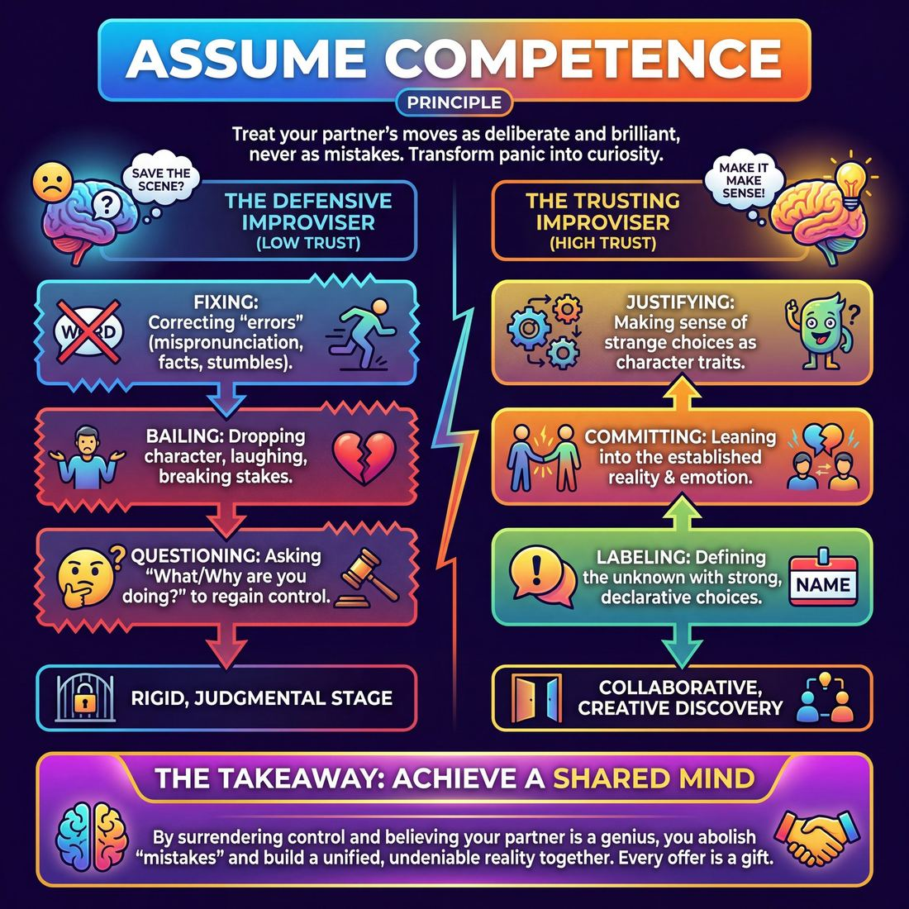

# 💎 Assume Competence

> *Trust your partner has a reason; never bail on them.*

{ .infographic }

## 💎 The core belief

To **assume competence** is to hold the unwavering belief that your scene partner knows exactly what they are doing. When they make a move—even one that seems bizarre, contradictory, or entirely out of left field—you do not view it as an error to be fixed, a joke that missed the mark, or a lapse in judgment to be ignored. Instead, you treat it as a deliberate, brilliant choice. You trust that they have a reason for what they just did, and you accept that your shared job is to discover that reason together.

This principle demands that you never bail on your partner. In scripted theater, a dropped line or a bizarre physical choice is a mistake; in improvisation, there are no mistakes, only unintegrated **offers** (any action or dialogue that establishes or advances the scene). Assuming competence shifts your internal monologue from *"How do I save this scene?"* to *"How does my partner's choice make perfect sense?"* It is a radical act of trust that transforms confusion into curiosity, ensuring that both players are always building the same reality rather than fighting for control.

!!! abstract "The Golden Rule of Partnership"
    Treat your partner like a genius. If they do something that makes no sense to you, assume the deficit is in *your* understanding, not in *their* execution.

## 🌱 Why it governs everything

When an improviser operates without this principle, they play defensively. They watch their partner with a low-level hum of anxiety, ready to step in, correct, or "save" the scene the moment something confusing happens. This defensive posture creates a rigid, judgmental stage environment where true collaboration is impossible.

Once a performer truly internalizes the belief that their partner is competent, a profound behavioral shift occurs: panic is replaced by curiosity. The brain moves out of a critical, analytical mode (*"Why did they do that? That makes no sense."*) and into a creative, supportive mode (*"That is true; now, how do I make it make sense?"*). 

This internal shift completely rewrites a performer's default reactions:

| The Defensive Improviser | The Trusting Improviser |
| :--- | :--- |
| **Fixing:** Correcting a partner's mispronunciation, physical stumble, or factual error. | **Justifying:** Treating the "error" as a deliberate character trait or a vital clue to the scene's reality. |
| **Bailing:** Dropping the emotional stakes, laughing, or breaking character when confused. | **Committing:** Leaning harder into the established reality, trusting the partner will eventually reveal their intent. |
| **Questioning:** Asking "What are you doing?" or "Why are you acting like that?" | **Labeling:** Making a strong choice to define the unknown ("You always pace when you're hiding something!"). |
| **Driving:** Forcing a preconceived plot onto the scene to maintain a sense of safety and control. | **Following:** Allowing the scene to emerge organically, step-by-step, from the partner's offers. |

!!! abstract "The Death of the 'Mistake'"
    When you assume competence, the concept of a "mistake" vanishes from your improv vocabulary. If your partner calls you "Mom" right after you established you are their husband, assuming competence means they didn't misspeak—they made a bold, weird choice. Your job is no longer to correct them; your job is to **justify** (make sense of) *why* this couple has such a deeply strange dynamic. 

Ultimately, this principle governs the work because it is the only way to achieve a **shared mind**. You cannot share a mind with someone you are secretly trying to manage. By assuming competence, you surrender control and grant your partner the ultimate theatrical respect: the absolute belief that they know exactly what they are doing, even when neither of you actually does.

## 👀 How it shows up

While a principle lives in the mind, it leaves a distinct physical and verbal footprint on stage. When an improviser truly believes their partner is acting with intention and skill, their visible reactions change entirely. The audience sees a team that moves with absolute certainty, even when the scene is careening into the unknown.

Here is how this conviction manifests in observable behavior, from basic acceptance to master-level play:

| Stage | Observable Behavior | What the Audience Sees |
| :--- | :--- | :--- |
| **Novice** | **Rolling with verbal slips.** If a partner accidentally says "Good morning" during a midnight stakeout, they do not correct the time of day. They instantly adopt the new reality. | A smooth scene without jarring stops, corrections, or out-of-character giggling. |
| **Intermediate** | **Justifying physical accidents.** If a partner trips, knocks over a chair, or breaks a mime object, the improviser treats it as a deliberate character choice. | A world that feels completely real and lived-in, where "mistakes" become plot points. |
| **Advanced** | **Matching bizarre energy.** When faced with a completely baffling or chaotic initiation, they do not ask, "What are you doing?" They match the emotional weight and physical commitment immediately. | Two actors who seem to share a secret script, moving in perfect lockstep. |
| **Master** | **Framing panic as brilliance.** If a partner genuinely blanks, freezes, or panics, the master improviser frames that hesitation as a profound, dramatic character choice, holding the silence with them. | Breathtaking vulnerability and tension; the partner looks like a genius for pausing. |

### The Behavioral "Tells"

When you watch a team that assumes competence, you will notice specific, recurring physical and verbal markers:

*   **The absence of the "Improv Flinch":** There are no micro-expressions of panic, eye-rolling, or confused blinking when a partner makes a wild choice. The improviser's face remains open and accepting.
*   **Statements over questions:** Instead of interrogating the partner's weird choice (*"Why are you standing on the table?"*), they make declarative statements that explain it (*"I told you the floor was lava, thank God you listened."*). This is the essence of justification—providing the "why" for a partner's "what."
*   **Physical mirroring:** They often subconsciously adopt the posture or energy level of their partner, signaling, *I am with you, and what you are doing is right.*

!!! example "In a scene: The Phantom Grip"
    Player A mimes dropping a coffee cup, but accidentally leaves their hand frozen in a gripping shape. 
    
    **Without assuming competence:** Player B points at the hand and laughs, *"Why is your hand still like that? You dropped it!"* (Player A looks foolish; the reality of the scene is broken).
    
    **Assuming competence:** Player B gently touches Player A's frozen hand. *"The phantom grip. Dr. Evans said the nerve damage would make you feel like you were still holding it."* (Player A looks like a master physical actor; the scene deepens instantly).

!!! warning "Watch out for 'Pimping'"
    A clear sign that an improviser is *not* assuming competence is **pimping**—forcing a partner into a difficult situation for a cheap laugh (e.g., *"Sing us that song you wrote!"*). An improviser who assumes competence doesn't test their partner; they support them.

## 🧪 Living it in practice

To move "Assume Competence" from a nice philosophical idea to a reliable reflex, improvisers must train their brains to stop looking for errors and start looking for gifts. This principle is the engine that powers core skills like justification and "Yes, And." 

Living this principle requires deliberate shifts in mindset and dedicated practice.

**The Internal Mindset Shifts**

*   **From "Mistake" to "Mystery":** When a partner says something contradictory or confusing, train yourself to view it not as an error, but as a puzzle piece you don't fully understand yet. 
*   **From "Fixing" to "Framing":** Instead of correcting your partner on stage, build a frame around their choice that makes it look brilliant. If they stumble over a word, they aren't a bad actor; their *character* is nervous, drunk, or hiding a secret.

!!! tip "On stage: The 'Wait and Justify' reflex"
    When your partner does something that seemingly breaks the established reality, suppress the urge to immediately correct them or make a joke at their expense. Take a one-second breath. Use that pause to invent a reason *why* what they just did makes perfect sense in the world of the scene.

!!! example "In a scene: Framing the 'Error'"
    *Context:* Two players have established they are astronauts on a spacewalk.
    
    *Player A:* "Look at all those beautiful pigeons!" *(A classic "mistake" — pigeons aren't in space).*
    
    *Player B (Assuming Incompetence):* "Pigeons? We're in space, idiot. Those are asteroids." *(Bails on the partner, breaks trust, gets a cheap laugh).*
    
    *Player B (Assuming Competence):* "I told Houston the experimental zero-gravity coop was a bad idea. They're getting into the thrusters!" *(Frames the partner as a genius, creates a hilarious new reality).*

**Drills to Build the Muscle**

You can actively train this belief through specific rehearsal exercises:

*   🧠 **The "You're a Genius" Drill:** Player A makes a completely random, disjointed, or contradictory statement. Player B must respond by treating it as the most profound, logical thing ever said, explicitly justifying *why* it makes sense. 
*   🙈 **Blind Offers:** One player initiates a strong physical action without deciding what it is. The second player enters and labels the action. The first player must instantly assume the second player's label is exactly what they were doing all along.
*   🧱 **"Because..." Chains:** Players sit in a circle. Player A states a bizarre fact ("The sky is made of denim"). Player B must immediately follow with "And that makes sense because..." ("...Levi Strauss bought the atmosphere in 1994"). 

By repeatedly practicing these habits, you rewire your improvisational instincts. You stop bracing for your partner to fail, and start eagerly anticipating how you will make their next move look like a masterpiece.

## ⚖️ Tensions & nuance

While treating every move as a deliberate, genius choice is the bedrock of partner trust, this principle does not exist in a vacuum. It must be balanced against the realities of live performance, human fallibility, and mutual safety. 

Here is where the principle of assuming competence meets the friction of the real world:

**The Safety Override**  
Assuming competence applies strictly to the *creative and fictional* choices within a scene, never to physical or emotional boundaries. If a partner makes a move that is physically dangerous, genuinely aggressive, or violates the safety container of the ensemble, the principle of assuming competence is immediately suspended. You do not have to "justify" a move that makes you feel unsafe. 

!!! warning "Watch out: The Safety Exception"
    Never use "Assume Competence" or "Yes, And" as an excuse to endure inappropriate behavior. If a partner grabs you too hard or introduces deeply triggering material without consent, you are not obligated to treat it as a brilliant character choice. **The container of mutual safety always supersedes the fiction of the scene.**

**The Player vs. The Character**  
What happens when you are playing with a beginner who is visibly terrified, or a partner who has genuinely just blanked on the scene's premise? The nuance here is separating the *player* from the *character*. You may know the *player* is panicking, but you assume the *character* is acting intentionally. 

!!! tip "On stage"
    If your partner freezes and stares at you blankly because they forgot their line, do not point out their panic. Instead, assume the *character's* silence is a deliberate choice. You might say, "I know, the sheer audacity of my proposal has left you speechless." You have rescued the player by assuming the competence of the character.

**Justification vs. Interrogation**  
There is a fine line between assuming your partner had a reason, and forcing them to explain what that reason is. When a partner does something bizarre, assuming competence means *you* help build the bridge to make it make sense. It does not mean you cross your arms and demand an explanation. 

!!! example "In a scene"
    Your partner walks in and inexplicably starts licking the steering wheel of the car. 
    
    *   **Interrogation (Bailing):** "What are you doing? Are you crazy?" *(Forces them to invent a reason alone).*
    *   **Assuming Competence (Supporting):** "I told you, the detailing guys used a new strawberry wax, it's irresistible." *(You provide the reason, making their weird choice look like a planned bit).*

**The Burden of Clarity**  
Assuming competence is a two-way street. Knowing that your partner will treat your moves as intentional does not give you a license to be deliberately confusing, vague, or chaotic. You cannot throw out random, disconnected offers and expect your partner to do the exhausting work of tying them together. Because your partner is assuming you are competent, you owe them the courtesy of making clear, grounded choices that they can actually work with.

## 🚫 Common misunderstandings

Because **Assume Competence** is an invisible, internal posture, it is easy to confuse with passive acceptance, toxic positivity, or abandoning your own agency. Here is where improvisers often get tangled up:

| The Misunderstanding | The Reality |
| :--- | :--- |
| **"I must pretend my partner is a flawless improviser."** | You aren't evaluating their literal skill level or resume. You are simply treating their *current choice* as deliberate and purposeful. |
| **"If they mess up, I should politely ignore it."** | Ignoring a quirk treats it as an error. Assuming competence means you highlight it, embrace it, and justify it. |
| **"I just wait for them to explain their weird move."** | It is an active, shared pursuit. *You* must do the work to help make their choice make sense in the reality of the scene. |
| **"I have to love every idea they pitch."** | You don't have to love the idea, but you must trust that they offered it with good intentions, and build on it anyway. |

### The trap of the "polite save"

One of the most common traps for intermediate improvisers is the "polite save." When a partner stumbles over a word, calls a character by the wrong name, or contradicts an established fact, the instinct is often to gloss over it to "protect" them from embarrassment. 

Glossing over a moment signals to the audience (and your partner): *"You made a mistake, but I'll cover for you."* Assuming competence means taking the exact opposite approach: *"You did that on purpose—now let's find out why."*

!!! example "In a scene: The 'Wrong' Name"
    **The Setup:** Your partner previously established your name is "Dave." Two minutes later, they slip up and call you "Steve."
    
    **The Polite Save (Misunderstanding):** You ignore the slip and keep responding as Dave, hoping the audience didn't notice the continuity error. The scene feels slightly fragile.
    
    **Assuming Competence (Correction):** You assume they called you Steve for a *reason*. You respond: *"I know I'm wearing my brother Steve's jacket, Mom, but it's still me, Dave. Are your eyes getting worse?"* You just turned a slip of the tongue into a rich, emotional character detail.

## 🔗 Why it matters

When an entire ensemble operates under the assumption of mutual competence, the texture of the performance fundamentally transforms. The audience stops watching a group of individuals scrambling to invent a scene, and instead witnesses a unified organism discovering one. The anxious tension of "will they mess up?" evaporates, replaced by the joyful thrill of "where are they taking this?"

At its core, assuming competence acts as a powerful self-fulfilling prophecy. When you treat your partner's choices as brilliant, intentional, and necessary, they begin to perform with the confidence of someone who *is* brilliant, intentional, and necessary. You literally make your partner better by believing they already are. 

This deep-seated conviction changes the show in three vital ways:

*   **Fearless risk-taking:** Players make bolder, more idiosyncratic choices because they know they won't be left hanging, corrected, or judged for a "weird" move. The stage becomes a playground rather than a minefield.
*   **The eradication of panic:** When competence is assumed, mistakes (flubbed lines, contradictory facts, physical stumbles) are no longer emergencies. They are instantly reframed as deliberate character traits or new, unexpected gifts that the team is fully equipped to unpack.
*   **Deepened theatricality:** Scenes move beyond superficial gag-chasing. When players aren't secretly worried about having to "save" the scene from a struggling partner, they can relax into the present moment, focusing entirely on exploring the relationship and the emotional truth of the scene.

!!! abstract "The Illusion of Telepathy"
    Improv at its highest level looks like magic. Audiences often ask, "How did you know what they were going to say?" That illusion of a **shared mind** is rarely the result of actual psychic connection—it is the direct, visible result of players fiercely assuming that whatever their partner just did was exactly the right thing to do, and treating it as such.

Ultimately, assuming competence is what elevates improvisation from a parlor trick of making things up on the spot into a profound theatrical art form. It proves that when humans radically trust one another, they can build something far greater together than they ever could alone.

## 📚 References & Further Reading

### Foundational sources
*   **Charna Halpern, Del Close, and Kim "Howard" Johnson, *Truth in Comedy: The Manual of Improvisation* (1994)** — The definitive text on long-form improvisation that popularized the explicit directive to "treat your partner like a genius." It argues that true group mind—the shared consciousness of an ensemble—is only achieved when players stop judging each other's choices and instead trust that every move is a deliberate step toward discovering the scene.
*   **Keith Johnstone, *Impro: Improvisation and the Theatre* (1979)** — Explores how the socialized fear of making mistakes paralyzes performers and leads to defensive play. Johnstone demonstrates how the radical acceptance of a partner's offers—treating their bizarre or contradictory choices as absolute truth—eliminates the concept of the "mistake" and creates a cohesive, shared theatrical reality.
*   **Viola Spolin, *Improvisation for the Theater* (1963)** — The foundational text on theater games, which emphasizes removing the concepts of "approval and disapproval" from the stage. By training actors to focus entirely on the point of concentration rather than evaluating their partner's performance, Spolin laid the groundwork for a stage environment where competence is assumed and collaboration is frictionless.

### Practitioner guides & manuals
*   **Matt Besser, Ian Roberts, and Matt Walsh, *The Upright Citizens Brigade Comedy Improvisation Manual* (2013)** — Provides a rigorous, mechanical breakdown of "justification," the core skill required to assume competence. The authors teach improvisers exactly how to frame unusual, accidental, or confusing choices as deliberate character traits or vital plot points, ensuring that the scene's reality is never broken by a dropped line or physical stumble.
*   **Patricia Ryan Madson, *Improv Wisdom: Don't Prepare, Just Show Up* (2005)** — Translates the improv maxim to "make your partner look good" into a practical philosophy. Madson demonstrates how sharing control, refusing to bail on a struggling partner, and treating every action as a deliberate gift transforms both stage work and daily life, shifting the brain from a critical mode to a supportive, curious one.
*   **Mick Napier, *Improvise: Scene from the Inside Out* (2004)** — While challenging some traditional improv dogmas, Napier fiercely reinforces the necessity of committing to your partner's reality. He argues that questioning a partner's choices or bailing on a scene destroys the foundational trust required for comedy, and that matching a partner's bizarre energy is the fastest route to a successful scene.

### Research & theory
*   **Amy C. Edmondson, *The Fearless Organization: Creating Psychological Safety in the Workplace for Learning, Innovation, and Growth* (2018)** — Provides the academic and psychological framework for "psychological safety," proving that teams only achieve high performance when the interpersonal fear of making mistakes is entirely removed. This mirrors the improv stage, where assuming competence eliminates the "improv flinch" and allows for true creative risk-taking.
*   **Charles J. Limb and Allen R. Braun, "Neural Substrates of Spontaneous Musical Performance: An fMRI Study of Jazz Improvisation" (*PLoS ONE*, 2008)** — A landmark neuroscientific study demonstrating that during improvisation, the brain deactivates the dorsolateral prefrontal cortex (the "inner critic"). This biological shift allows performers to act and react without conscious self-monitoring or judgment of themselves or their partners, providing a neurological basis for the "shared mind."
*   **Karl E. Weick, "Improvisation as a Mindset for Organizational Analysis" (*Organization Science*, 1998)** — Examines how highly capable improvisational groups (from jazz bands to emergency responders) treat errors not as threats to be fixed, but as raw material to be integrated into the ongoing structure. Weick's concept of *bricolage*—making do with what is at hand—perfectly describes the improviser's job of justifying a partner's unexpected offer.

### Communities & adjacent reading
*   **Herbie Hancock with Lisa Dickey, *Possibilities* (2014)** — Recounts the legendary story of Hancock playing a "wrong" chord during a live performance, and Miles Davis instantly playing a melody that made the chord sound intentional and correct. This is the ultimate real-world example of assuming competence: Davis did not judge the chord as an error, but accepted it as a new reality that simply needed to be justified.
*   **Stephen Nachmanovitch, *Free Play: Improvisation in Life and Art* (1990)** — A philosophical exploration of the creative process that argues mistakes do not exist in true improvisation; they are simply unexpected starting points that demand integration. Nachmanovitch explores how trusting the muse—and by extension, your partner—allows artists to surrender control and build a unified piece of art.

## 💬 Quotes & Anecdotes

!!! quote "— Del Close, *iO Theater*"
    If we treat our partners as geniuses, they will be.

!!! quote "— Mick Napier, *Improvise: Scene from the Inside Out* (2004)"
    When I direct, I assume competence, not inability. That's all a director wants from an improviser in this process. To take the powerful choices he or she creates, and utilize them in the show.

!!! quote "— Tina Fey, *Bossypants* (2011)"
    In improv there are no mistakes, only beautiful happy accidents.

### Where it comes from
The philosophy of "assuming competence" is deeply rooted in the Chicago style of long-form improvisation. Del Close and Charna Halpern, founders of the iO Theater, championed the foundational rule to "make your partner look good." They taught that if you treat your scene partner as a genius, the audience will view them as one, too. This radical trust removes the ego from the stage, forcing players to focus entirely on supporting the ensemble rather than protecting themselves.

The specific phrasing "assume competence" was notably codified by director and Annoyance Theatre founder Mick Napier in his 2004 book *Improvise: Scene from the Inside Out*. Napier argued that directors and scene partners alike must operate from a place of absolute trust in an improviser's choices. To constantly question, coddle, or correct a partner implies a baseline of inability; assuming competence demands that you take whatever bizarre or unexpected choice they make and utilize it powerfully in the scene.

### A telling example

**The Forgotten Name**  
In a documented stage show, an improviser was playing a mother fiercely arguing with her adult son, who was moving out of the house against her wishes. Mid-scene, the performer completely blanked on the name they had previously established for the son. 

Without the principle of assuming competence, the improviser might have broken character, stumbled, or awkwardly asked for the name again—signaling to the audience that a mistake had occurred and breaking the reality of the scene. Instead, she assumed competence in her own slip-up, trusting that the "error" could be justified within the emotional reality they had built. 

She looked at her scene partner and snapped, *"Well, good luck to you, whose name I've forgotten."* 

Because she treated the lapse as a deliberate, high-status choice, it perfectly fit the reality of a mother so furious and petty that she would refuse to even use her own son's name. The mistake vanished entirely, replaced by a brilliant character detail that got a massive laugh.

**The Mirroring Stranger**  
Another real-world application of "making your partner look good" occurred when an improviser was at a social event where an older man was dancing alone with highly unusual, erratic moves. The crowd was beginning to laugh at him. Applying her improv training, the improviser and her friend stepped onto the floor and began perfectly mirroring the man's bizarre dance moves. 

By assuming competence in his dancing and treating his random movements as deliberate choreography, they transformed the dynamic. The crowd stopped laughing at the man and started cheering for the synchronized trio, turning him from the butt of a joke into the star of the room.

## 🧭 Explore the framework

- 🎭 **Domain:** [The Partner](02_D__the-partner.md)
- 🔁 **Other principles here:** [Consent & Boundaries](02_P1__consent-and-boundaries.md), [Yes, And](02_P2__yes-and.md), [Make Your Partner a Genius](02_P3__make-your-partner-a-genius.md)
- 🧠 **Skills of this domain:** [Active Listening](02_S1__active-listening.md), [Status Modulation](02_S2__status-modulation.md), [Single-Partner Empathy & Mirroring](02_S3__single-partner-empathy-and-mirroring.md), [Offer Reception](02_S4__offer-reception.md), [Active Gifting](02_S5__active-gifting.md), [Boundary Navigation](02_S6__boundary-navigation.md)
