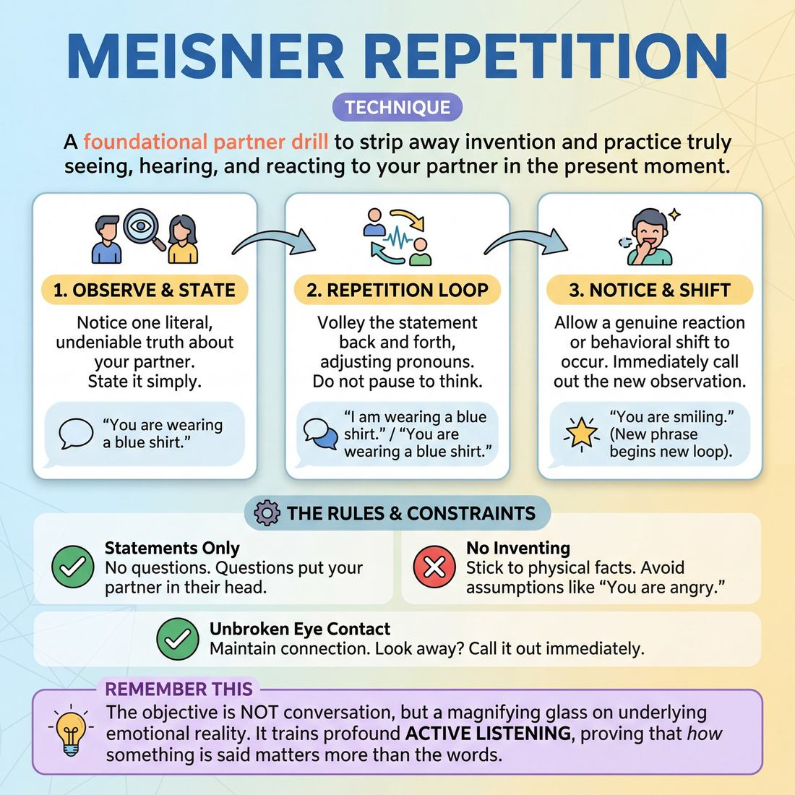

# 🎯 Meisner Repetition

> *A drillable muscle that trains **Active Listening**.*

{ .infographic }

## 🎯 The essence

Adapted from Sanford Meisner’s legendary acting training, **Meisner Repetition** is a stripped-down, two-person drill where players face each other and trade a single, truthful observation back and forth (e.g., "You're smiling," "I'm smiling"). By completely removing the pressure to invent dialogue, plot, or character, the exercise forces improvisers to isolate and drill one vital muscle: radical, present-moment **Active Listening**. It trains the brain to stop planning the next line and instead place one hundred percent of its attention on the partner, reacting honestly to micro-shifts in tone, posture, and emotion.

## 🎓 What it trains

At its core, Meisner Repetition is a centrifuge for Active Listening. It isolates the muscle of pure observation by stripping away the improviser's greatest distraction: the pressure to be interesting.

For a novice improviser, the cognitive load of being on stage is often overwhelming. Panic sets in, and they retreat into their own heads to plan their next line or manufacture a joke. But when you are planning, you are not listening—you are merely waiting for your turn to speak. You miss the subtle sigh, the shift in posture, or the slight hesitation in your partner's voice. 

Meisner Repetition solves this "inventor's panic" by completely removing the burden of writing the script. You cannot plan your next line because your next line depends entirely on what your partner does *right now*. 

By practicing this technique, improvisers train several vital, overlapping skills:
*   **Radical Presence:** Keeping your attention locked outward on your partner, rather than inward on your own anxiety.
*   **Reading Subtext:** Moving beyond the advanced beginner stage of just hearing the literal words, to the proficient stage of hearing the emotion, tone, and intent beneath them.
*   **Micro-observation:** Developing a master-level sensitivity to your partner's breath, eye movements, and physical tension.

!!! abstract "The Deeper Principle: The Answer is in Your Partner"
    Improv scenes feel disconnected when two people are just acting *at* each other. This technique forces you into the domain of **The Partner**, shifting the dynamic from two soloists sharing a stage to a true "shared mind." It proves a foundational improv truth: you don't need to manufacture brilliance out of thin air; you just need to pay absolute attention to the person standing in front of you.

## 💡 Why it works

This drill is an exercise in radical subtraction. The engine under the hood relies on three psychological and group-dynamic shifts:

*   **Eliminating cognitive load:** When a novice is on stage, their brain is usually red-lining as they try to invent a narrative (a classic hallmark of Stage 1 Active Listening). Because you already know what your line is in this drill—exactly what your partner just said—massive mental bandwidth is suddenly freed up. You can finally stop writing the script and start actually *looking* at the human being in front of you.
*   **Elevating subtext over text:** In normal scenes, improvisers often hide behind words. In repetition, because the words remain static, the *meaning* must come from somewhere else. The true communication becomes the tone, the breath, the posture, and the micro-expressions. The spoken text simply becomes a carrier wave for the underlying emotion. 
*   **Forcing an outward focus:** Improvisers frequently get trapped in their own heads, trying to steer the scene. Repetition physically and psychologically tethers you to your partner. You cannot do the exercise alone; your behavior is entirely dependent on the stimulus they just provided. It shifts the actor's locus of control from "me" to "us."

!!! abstract "The Engine: Reaction over Invention"
    The fundamental mechanism of Meisner Repetition is shifting the improviser from a state of *proactive invention* to *reactive truth*. It trains the nervous system to trust that simply responding honestly to the person in front of you is enough to sustain the moment.

## 🧩 The setup

To get the most out of this exercise, the physical and psychological environment must be deliberately stripped of distractions. 

Here is how to configure the room and the players before beginning:

*   **Players & Group Size:** Works exclusively in **pairs**. You can have the entire room work simultaneously (which creates a loud, chaotic, but low-pressure environment), or have one pair work center-stage while the rest of the group observes (higher pressure, but excellent for targeted side-coaching).
*   **Arrangement:** Players should face each other directly, about an arm’s length apart. If seated, their knees should be close but not touching. Their physical posture should be open, with unbroken eye contact.
*   **Space & Materials:** An open room. **Chairs are highly recommended** for beginners; sitting grounds the players and prevents nervous pacing, shifting, or physical fidgeting that diffuses tension. No props are used.
*   **Time:** 2 to 3 minutes per round. The total exercise usually runs 10 to 15 minutes, allowing players to rotate partners at least once. 
*   **Roles:** 
    *   **Partner A (The Initiator):** Makes the first true, observable statement about Partner B.
    *   **Partner B (The Responder):** Receives the statement and repeats it back from their perspective. 
    *   **The Facilitator:** Acts as a side-coach, gently reminding players to stay out of their heads, maintain eye contact, and stop trying to be clever.
*   **Prerequisites:** A baseline of mutual trust and an understanding of basic **Boundary Navigation**. Because this exercise requires sustained eye contact and emotional vulnerability, players must be comfortable using check-ins or calling "Cut" if the intensity becomes overwhelming.

!!! tip "How to introduce it"
    **Facilitator Script:** 
    "Find a partner, pull up two chairs, and sit facing each other. Plant your feet on the floor, rest your hands in your lap, and just look at the person across from you. 
    
    For the next three minutes, you are not allowed to invent anything. You don't need to be funny, you don't need to build a scene, and you don't need to write a story. We are stripping all of that away. Partner A, you are going to make one simple, factual observation about Partner B's physical behavior or expression right now—for example, *'You are smiling'* or *'You just blinked.'* Partner B, you will repeat that exact observation back from your perspective: *'I am smiling.'* 
    
    Keep repeating this exact phrase back and forth. Do not change the words until the underlying emotion or physical reality forces the words to change. Don't think about what to say next; just let your partner's voice and face give you your reaction."

!!! warning "Watch out"
    Ensure players are not positioned too far apart. If there is more than three feet of distance between the chairs, the energetic connection drops, and players will start shouting their lines rather than intimately observing each other.

## ⚙️ The mechanics

The objective is not to have a conversation, but to lock the words into a repetitive loop so you are forced to listen to the *subtext*.

### The Flow of Play

A standard repetition drill follows a strict, sequential loop:

1. **The Anchor:** Two improvisers stand or sit facing each other, arms relaxed, maintaining unbroken eye contact. The physical stillness focuses all energy on the connection.
2. **The Initial Observation:** Partner A makes a simple, undeniable, factual statement about Partner B's current physical state or behavior. It must be something observable right now. *(e.g., "You are shifting your weight.")*
3. **The Pronoun Shift:** Partner B immediately repeats the phrase back, changing only the pronouns to make it grammatically correct from their perspective. *(e.g., "I am shifting my weight.")*
4. **The Volley:** Partner A repeats the phrase back again *(e.g., "You are shifting your weight")*. This exact phrase volleys back and forth like a tennis rally. 
5. **The Organic Shift:** As the repetition continues, the *meaning*, *tone*, or *underlying emotion* will naturally change. Eventually, a genuine impulse will cause one partner to make a *new* observation based on the current moment *(e.g., "You are smiling," "I am smiling")*. The loop then continues with the new phrase.

!!! abstract "The Stimulus-Response Loop"
    Sanford Meisner called this the "pinch and the ouch." If someone pinches you, you don't invent an "ouch"—the ouch is the direct, involuntary result of the pinch. In this drill, your partner's tone and behavior are the pinch; your repetition is the ouch. You do not decide how to say the line; your partner's delivery dictates your response.

### The Ironclad Rules

To keep the drill focused on observation rather than invention, players must adhere to strict constraints:

* **Truth over invention:** Never fabricate an observation to be interesting. If they are blinking, say "You are blinking." Do not say "You are plotting my demise."
* **Pacing over perfection:** Respond instantly. The goal is to let the mouth move before the brain can filter, judge, or plan the response. If you stumble over the words, repeat the stumble.
* **Statements, not questions:** Questions invite the brain to think and analyze. Keep all observations as declarative statements. 
* **No acting:** Do not artificially inject emotion into the words. Let the emotion arise naturally from the repetition and the eye contact. 

!!! warning "Watch out: The Cleverness Trap"
    Improvisers are naturally wired to be witty and entertaining. In this drill, cleverness is a defense mechanism. If you find yourself searching for a "funny" observation, you have stopped listening to your partner and retreated into your own head. 

### Ending and Resetting

A single round typically lasts 2 to 5 minutes. The coach will call "Cut" or "Reset" when:
* The loop breaks down into intellectual thinking or conversational chatter.
* A player repeatedly breaks the rules (e.g., asking questions or inventing facts).
* The pair reaches a natural, authentic emotional peak and the energy resolves. 

Upon a reset, the players shake it off, re-establish neutral eye contact, and wait for a fresh, genuine observation to restart the loop.

## 🎬 Sample round

!!! example "Sample round: From mechanical to emotional"
    Here is how a standard round of Meisner Repetition sounds in practice. Notice how the words remain the same until an undeniable shift in behavior or emotion forces a new observation. 

    | Player | Dialogue | What is happening |
    | :--- | :--- | :--- |
    | **Alex** | "You are crossing your arms." | **Initial Observation:** Alex states a neutral, undeniable physical fact. |
    | **Sam** | "I am crossing my arms." | **Exact Repetition:** Sam repeats the statement from their own point of view, focusing entirely on Alex's face. |
    | **Alex** | "You are crossing your arms." | **Staying in the loop:** Alex repeats the phrase. The words are the same, but Alex is watching *how* Sam receives them. |
    | **Sam** | "I am crossing my arms." | **The Shift:** Sam says the line, but their voice drops, their shoulders tense, and they look away slightly. |
    | **Alex** | "You are pulling away." | **New Observation:** Alex notices the behavioral shift (the subtext) and calls it out. The repetition evolves. |
    | **Sam** | "I am pulling away." | **Acceptance:** Sam doesn't deny the emotional reality or try to "fix" it; they accept the observation and repeat it. |
    | **Alex** | "You are pulling away." | **Deepening:** Alex repeats it, leaning in with a tone of genuine concern. |
    | **Sam** | "You are worried about me." | **Role Reversal:** Sam notices Alex's tone of concern and makes a new observation about Alex's behavior. |
    | **Alex** | "I am worried about you." | **Taking it in:** Alex accepts the truth of Sam's observation, and the loop continues. |

    **The Takeaway:** The magic happens in the gaps between the words. By the end of this short exchange, Alex and Sam have discovered a relationship dynamic (concern and withdrawal) without inventing a single plot point or character backstory. They simply reacted to the reality of the micro-expressions and tone right in front of them.

## 🎚️ Variations & progressions

The Meisner Repetition exercise is highly modular. By tweaking the rules, you can scale the cognitive load to match the improviser’s maturity—moving from basic mechanical listening to advanced subtextual observation.

Here is how to ramp the difficulty as improvisers progress through the stages of Active Listening:

### 1. Strict Mechanical Repetition (Novice to Advanced Beginner)
For improvisers who struggle with planning their next line, strip away all pressure to invent. 
*   **The Rule:** Partner A makes a simple observational statement. Partner B repeats it exactly, applying only a **pronoun shift** (e.g., "You have a blue shirt" becomes "I have a blue shirt"). They repeat this single phrase back and forth indefinitely.
*   **The Goal:** To break the habit of thinking ahead. The actor learns to rest in the present moment, trusting that the words are already provided.

### 2. Emotional Permutation (Competent)
Once actors can repeat words accurately without panicking, allow the *delivery* to change.
*   **The Rule:** The words remain locked, but the actors allow their emotional reaction to shift based on *how* the partner delivered the previous line. 
*   **The Goal:** To build on specific, non-verbal offers. The improviser learns that *how* something is said carries more weight than *what* is said.

!!! example "In a scene"
    **A:** (Playfully) "You're wearing a blue shirt."  
    **B:** (Smiling, flattered) "I'm wearing a blue shirt."  
    **A:** (Suddenly suspicious) "You're wearing a blue shirt..."  
    **B:** (Defensive) "I'm wearing a blue shirt!"  

### 3. Calling the Behavior (Proficient)
This is the classic Meisner leap. Instead of being locked into one phrase forever, the actors are allowed to change the phrase—but *only* if they observe a genuine change in their partner.
*   **The Rule:** You repeat the current phrase until you notice a new physical or emotional shift in your partner. When you see it, you **call the behavior** (state exactly what is happening right now). That new observation becomes the phrase you both repeat.
*   **The Goal:** To train the improviser to hear subtext and read physical reality, rather than just waiting for their turn to speak.

!!! tip "On stage"
    Calling the behavior is a powerful tool for real improv scenes. If you ever feel stuck or don't know what to say next, simply observe your partner and state what they are doing: *"You're staring at the floor,"* or *"You just sighed."* It instantly grounds the scene in truth.

### 4. The "Three-Line" Scene Integration (Master)
To bridge the gap between a sterile exercise and a fluid improv scene, use repetition as a temporary scaffold.
*   **The Rule:** Actors begin a standard open scene. However, before an actor can reply with new information, they must first repeat the core of what their partner just said. 
*   **The Goal:** To make the gifting and listening invisible. The master improviser reads micro-expressions and breath, using repetition not as a crutch, but as a way to validate the partner's reality before seamlessly adding their own.

!!! abstract "Key idea: Physical Mirroring"
    A common and highly effective variant is **Physical Repetition**. Alongside the verbal repetition, improvisers subtly mirror their partner's posture, gestures, and weight shifts. This forces the brain out of the verbal center and into the body, accelerating the feeling of a "shared mind."

## 🧑‍🏫 Coaching notes

When coaching Meisner Repetition, your primary job is to bypass the improviser's intellect. You act as an external regulator for their focus, gently but firmly pushing them out of their own heads and onto their partner. Because improvisers are naturally wired to invent, your side-coaching must constantly strip away their instinct to "create" and return them to simple observation.

!!! tip "Coaching"
    **"Don't do anything until the repetition makes you do it."**  
    This is the single most important cue. Improvisers often try to *add* an emotion or *play* a reaction to make the exercise interesting. Remind them that this drill is about discovery, not invention. They must allow the words and their partner's behavior to affect them naturally, without forcing a result.

### What 'Good' Looks and Sounds Like
As the facilitator, watch the physical and vocal cues of the pair. A successful repetition round features:
*   **Zero processing time:** The response happens on impulse. There is no gap between one person finishing their sentence and the other starting.
*   **Unbroken connection:** Continuous eye contact. They aren't looking up at the ceiling to search for an emotion or an idea.
*   **Organic shifts:** The tone, volume, or underlying emotion changes naturally over time, driven by how the partner delivered the previous line, not by a conscious choice to "switch it up."
*   **Physical truth:** Breathing is natural; tension or relaxation in the body matches the genuine emotional state of the moment.

### Live Side-Coaching Cues
Do not stop the exercise to give notes. Speak softly but clearly over the repetition, offering short, actionable commands that they can apply instantly.

*   **To kill the hesitation:** *"No gap. Answer immediately."* or *"Don't think, just repeat."*
*   **To fix wandering focus:** *"Stay with them. Look at their eyes."* or *"Put your attention entirely on your partner."*
*   **To stop artificial 'acting':** *"Drop the performance. Just say the words."* or *"You're inventing. Go back to what you actually see."*
*   **To break a robotic, monotone loop:** *"Breathe."* or *"Let the words land. How did they just say that to you?"*
*   **To correct word drift:** *"Stick to the exact phrase. Let the meaning change, not the text."*

!!! note "Managing the energy"
    If a pair gets stuck in a loop of polite, nervous laughter, do not let them off the hook. Side-coach: *"Acknowledge the laugh, but keep repeating."* The breakthrough in Active Listening often happens right after the awkwardness burns off.

## 🧭 Debrief & reflection

The debrief is where the raw experience of the drill translates into stage-ready Active Listening. Because Meisner Repetition strips away the safety net of inventing dialogue, players often experience a rush of vulnerability followed by profound relief. 

To lock in the learning, guide the players to reflect on their internal experience rather than critiquing their performance. Use these questions to steer the conversation:

*   **"Where was your attention during that round?"** 
    *   *The goal:* Help players recognize the shift from internal planning to external focus. They should notice that their attention was entirely on their partner’s face, breath, and tone.
*   **"When did the meaning of the words change?"** 
    *   *The goal:* Highlight how **subtext** drives a scene. Players will often note that a simple phrase like "You're looking at my shoes" morphed from an observation into an accusation, an apology, or a flirtation, purely through behavioral shifts.
*   **"Did you feel the urge to invent, be clever, or change the words? What did you do with that urge?"** 
    *   *The goal:* Normalize the panic of the novice improviser who feels they must constantly generate new ideas. Acknowledge the discipline it takes to let that urge pass and simply respond to what is actually there.

!!! note "What a good debrief surfaces"
    A successful reflection period moves players away from judging whether the scene was "good" or "funny," and toward recognizing the mechanics of connection. You want players to articulate the realization that *they don't have to do all the work*. 

As players share their experiences, listen for reflections that map to their growth in Active Listening:

| Player realization | What it reveals about their progress |
| :--- | :--- |
| *"It was so hard not to think of a funny comeback."* | **Novice:** They are becoming aware of their own cognitive load and the habit of planning. |
| *"I didn't have to think; I just said what they said."* | **Advanced Beginner:** They have successfully surrendered to the mechanics of the drill. |
| *"I could tell they were getting angry just by how their jaw clenched before they spoke."* | **Proficient:** They are reading micro-expressions and hearing the subtext beneath the repetition. |

!!! tip "For the Coach"
    If players report feeling "stuck" or "bored" during the drill, they were likely repeating the text mechanically without letting their partner's behavior affect them emotionally. Gently guide them back to the core principle: the words are just a vehicle; the *behavior* is the scene.

## ⚠️ Common pitfalls

!!! warning "Watch out: Planning instead of receiving"
    The single most common trap for a novice is letting the pressure of the exercise pull them back into planning. When mental bandwidth spikes, improvisers panic. They stop looking at their partner and retreat into their own heads to invent a "correct" or "clever" response. If you are thinking about what to say next, you are no longer doing Meisner. 

When improvisers first strip away the safety net of character and plot, the raw exposure of the exercise often triggers defensive habits. Here is how the technique typically breaks down under pressure, and how to fix it:

*   **The Parrot Trap (Mechanical Repetition)**
    *   *The Trap:* Bouncing the exact phrase back and forth rapidly without letting it land, turning the exercise into a game of verbal ping-pong. The words are repeated, but the underlying behavior is ignored.
    *   *The Fix:* Breathe. Let the words physically hit you. It is better to take three full seconds of silence to genuinely process your partner's statement than to fire back instantly on autopilot.
*   **Inventing the "Interesting"**
    *   *The Trap:* Adding fake emotion, adopting a character voice, or making a wild, unearned leap (e.g., saying "You're plotting my murder" instead of the observable "You're squinting"). 
    *   *The Fix:* Stick to the literal, observable truth. Trust that the genuine micro-expressions and real tension between you are infinitely more compelling than a fabricated character choice.
*   **Denial and Defensiveness**
    *   *The Trap:* Arguing with the observation. If your partner says, "You're smiling," and you respond, "No, I'm not," you have broken the circuit of agreement.
    *   *The Fix:* Accept the reflection. Even if you don't *feel* like you were smiling, your partner saw it. Shift to your point of view: "I'm smiling."

!!! tip "On stage: Keep the circuit closed"
    When improvisers feel vulnerable or need to think, they instinctively dart their eyes to the floor or the ceiling. This breaks the connection. Soften your gaze, but keep it locked on your partner. The answer to what you should say next is always written on their face, never on the ceiling.

## 🌟 What mastery looks like

At the highest level, Meisner Repetition ceases to look like a mechanical acting drill and transforms into a profound, highly responsive connection between two people. The words themselves become secondary—a mere carrier wave for the emotional truth passing back and forth. 

When observing improvisers who have mastered this technique, you will see the concept of a "shared mind" in action. Specifically, you will notice:

*   **Micro-level observation:** They are no longer just listening to the text. A master **reads their partner's breath and micro-expressions**. They notice a swallowed sigh, a tightening of the jaw, or a subtle shift in weight, and let *that* physical reality inform the tone of their next repetition.
*   **Effortless, undeniable shifts:** The phrase changes organically. Novices force a change because they feel bored or want to be clever; masters change the phrase only because the underlying reality of their partner has undeniably shifted and the old phrase is no longer true.
*   **Unbroken presence:** Eye contact is sustained but relaxed. There is no "deer in the headlights" panic, nor is there the glazed-over look of someone planning their next line. They are entirely in the present moment.
*   **Emotional fluidity:** A repetition might start as a casual observation and, through escalating connection, evolve into a heated accusation, a tearful confession, or shared joy—all without changing the core words until absolutely necessary.

!!! example "The Master-Level Shift"
    **Partner A:** "You're looking at my shoes." *(Said with mild curiosity)*  
    **Partner B:** "I'm looking at your shoes." *(Said with a hint of guilt, looking away slightly)*  
    **Partner A:** "You're looking at my shoes." *(Said softer, noticing the guilt, leaning in)*  
    **Partner B:** "I'm looking at your shoes." *(Voice cracks slightly, breathing shallows)*  
    **Partner A:** "You're holding your breath." *(The organic shift, born entirely from observing the partner's physical reality)*  

Ultimately, mastery of this drill looks like the complete dissolution of the "actor's brain." There is no planning, no inventing, and no reaching for a joke. There is only the partner, the present moment, and the undeniable truth of what is happening right now.

## 🔗 Why it matters

At its core, **Meisner Repetition** is the ultimate antidote to the improviser's greatest enemy: the pressure to invent. 

When a novice steps on stage, their cognitive load is often entirely consumed by planning what to say next. They might hear their partner's words, but they miss the music. Meisner Repetition forces a radical shift. It demands that you stop acting *at* your partner and start reacting *to* them. As you progress toward mastery, this drill trains you to hear subtext, notice micro-expressions, and even read your partner's breathing before they speak. 

This profound level of observation is exactly how we achieve the ultimate goal of The Partner domain: moving from simply sharing a stage to operating with a shared mind. 

!!! abstract "The Core Philosophy"
    You do not need to manufacture a scene out of thin air. Everything you need is already present in your partner's face, voice, and posture. If you pay close enough attention, they will give you your next move.

Beyond just listening, this technique ripples outward into the wider craft of improvisation in several vital ways:

*   **It cures "inventitis":** Instead of panicking and fabricating a wacky plot or bizarre premise, improvisers trained in repetition learn to anchor the scene in the immediate, undeniable truth of how the characters feel about each other right now.
*   **It builds emotional endurance:** It teaches improvisers to sit comfortably in silence, tension, or vulnerability without rushing to break the moment with a cheap joke or a deflection.
*   **It fosters radical trust:** When you know your partner is watching you this closely—and that they will accept and use whatever tiny behavioral offer you give them—the stage becomes a container of profound mutual safety. 

!!! tip "On stage"
    You don't have to do a literal repetition exercise in a live show to use this muscle. If you ever feel lost, panicked, or disconnected in a scene, silently repeat your partner's last line in your head. Notice *how* they said it. Let their tone, rather than their words, dictate your next emotional reaction.

## 📚 References & Further Reading

### Foundational sources
*   **Sanford Meisner & Dennis Longwell, *Sanford Meisner on Acting* (1987)** — The definitive text on the Meisner Technique, providing a fly-on-the-wall view of his classroom and detailing the exact mechanics, purpose, and progression of the repetition exercise. [Penguin Random House]{.ref}

### Practitioner guides & manuals
*   **T.J. Jagodowski, David Pasquesi, and Pam Victor, *Improvisation at the Speed of Life: The TJ and Dave Book* (2015)** — While not strictly a Meisner manual, this book is the definitive guide to applying Meisner's core philosophy—"realizing what is already occurring" rather than inventing—to long-form improv. [Goodreads]{.ref}
*   **Mary Scruggs and Michael J. Gellman, *Process: An Improviser's Journey* (2007)** — Modeled after Stanislavski's *An Actor Prepares*, this book details Gellman's real-world workshops at Second City, explicitly bridging traditional acting techniques (like Meisner's focus on truth and repetition) with Chicago-style slow-burn improvisation. [Northwestern University Press]{.ref}

### Lineage & teachers
*   **The Neighborhood Playhouse School of the Theatre** — The New York conservatory where Sanford Meisner developed and taught his technique from 1935 onward; it remains the primary institution for traditional Meisner training. [Neighborhood Playhouse]{.ref}
*   **Michael Gellman** — A Second City director and teacher who was instrumental in bringing formal acting techniques, including Meisner's repetition and focus on truth, into the modern Chicago improv curriculum. [Process Theatre]{.ref}

### Research & theory
*   **John Sweller, *Cognitive load during problem solving: Effects on learning* (1988)** — The foundational paper on Cognitive Load Theory. Sweller's research explains the psychological engine behind the repetition exercise: by removing the extraneous cognitive load of inventing dialogue, working memory is freed to process subtle behavioral and emotional cues. [Cognitive Science]{.ref}
*   **Thalia R. Goldstein, *Why Theatre Education Matters: Understanding its Cognitive, Social, and Emotional Benefits* (2024)** — Goldstein's research at the intersection of developmental psychology and theater demonstrates how acting exercises (like Meisner) actively develop empathy, theory of mind, and social-emotional regulation. [Teachers College Press]{.ref}

### Talks, videos & courses
*   **Sanford Meisner Master Class (Directed by Sydney Pollack, 1980)** — A rare, digitized master class featuring Sanford Meisner himself teaching his students, providing invaluable visual reference for the speed, strictness, and emotional evolution of the repetition exercise. [IMDb]{.ref}

### Communities & adjacent reading
*   **Viola Spolin, *Improvisation for the Theater* (1963)** — While Spolin's approach is game-based rather than psychologically driven, her "Mirror Exercises" serve as a physical counterpart to Meisner's verbal repetition, training the exact same muscles of external focus and partner attunement. [Northwestern University Press]{.ref}

## 💬 Quotes & Anecdotes

!!! quote "— Sanford Meisner, *Sanford Meisner on Acting* (1987)"
    An ounce of behavior is worth a pound of words.

!!! quote "— Sanford Meisner, *Sanford Meisner on Acting* (1987)"
    If you're really doing it, then you don't have time to watch yourself doing it. You only have the time and energy to do it.

!!! quote "— Sanford Meisner, *Sanford Meisner on Acting* (1987)"
    To take the heat off yourself... to transfer the point of concentration outside of yourself, is a big battle won.

!!! quote "— Sanford Meisner (From a sign hung behind his teaching desk)"
    Act before you think — your instincts are more honest than your thoughts.

!!! quote "— William Esper, Master Meisner Teacher"
    We don't seek to develop our minds with repetition; rather we seek to develop our instincts.

### Where it comes from
The "Word Repetition Game" (now universally known as Meisner Repetition) was developed in the mid-20th century by legendary acting teacher Sanford Meisner at New York's Neighborhood Playhouse. Breaking away from the heavily internal, memory-driven techniques of his contemporaries in the Group Theatre (like Lee Strasberg), Meisner believed that actors were becoming too intellectual and trapped in their own heads. He designed repetition as a mechanical drill to force actors to stop inventing dialogue, stop planning their next move, and place 100% of their focus on their partner's immediate, observable behavior. 

### A telling example
**Illustrative scene: The organic shift**  
To understand how repetition strips away artifice, consider this illustrative scenario of two improvisers, Player A and Player B, doing the drill. 

At first, the repetition is purely mechanical. Player A says, "You are wearing a blue shirt." Player B replies, "I am wearing a blue shirt." They volley this back and forth ten times. Because the words require zero brainpower, the cognitive load drops. 

Around the eleventh volley, Player B starts to feel self-conscious saying the same phrase over and over. A genuine, involuntary smirk crosses their face. Because Player A is staring right at them and no longer thinking about what to say next, they instantly catch this micro-expression. Player A drops the old phrase and states the new truth: "You are smiling." Player B, caught off guard but accepting the reality, replies, "I am smiling." 

The drill has successfully bypassed the actors' intellects. They are no longer inventing a scene; they are simply reacting truthfully to the behavior happening right in front of them.

## 🧭 Explore the framework

- ⬆️ **Skill it trains:** [Active Listening](02_S1__active-listening.md)
- 🎭 **Domain:** [The Partner](02_D__the-partner.md)
- 🔁 **Sibling techniques:** [Last Word Response](02_S1_T2__last-word-response.md)
