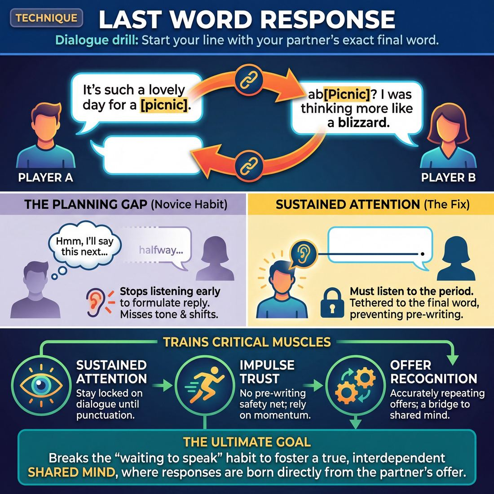

# 🎯 Last Word Response

> *A drillable muscle that trains **Active Listening**.*

{ .infographic }

## 🎯 The essence

**Last Word Response** is a foundational two-person dialogue drill where each player must begin their line using the exact final word of their partner's previous sentence. By making the start of your response entirely dependent on the very end of theirs, this technique forces a single, vital habit: listening all the way to the period. It completely short-circuits the improviser's natural urge to stop listening and start planning their next move halfway through a scene partner's dialogue.

## 🎓 What it trains

At its core, Last Word Response is a targeted drill for **Active Listening**. For many improvisers—especially at the novice stage—the sheer **cognitive load** of being on stage pulls them out of the moment and into their own heads. They hear the first half of their partner's sentence, assume they know how it will end, and spend the remaining seconds planning their own clever reply. 

!!! warning "The Planning Gap"
    When you stop listening early to formulate your next line, you aren't just missing words—you are missing the tone, the emotional shift, and the actual gift your partner is giving you. You are acting *at* them, rather than *with* them.

This technique exists to ruthlessly eliminate that planning phase. By forcing you to tether your sentence to their exact final word, it builds several critical muscles:

* **Sustained Attention:** You cannot check out early. You must stay locked onto your partner's dialogue all the way to the punctuation mark, training the brain to absorb the entire thought.
* **Impulse Trust:** It strips away the safety net of pre-writing your response. You have to trust that catching the final word will give you enough momentum to open your mouth and discover what comes next.
* **Offer Recognition:** It physically moves improvisers from the novice habit of planning into the advanced beginner stage of repeating offers accurately, which is the necessary stepping stone to eventually building on *specific* details.

Ultimately, this drill serves the domain of **The Partner**. It bridges the gap between two people politely taking turns talking, pushing them toward a true **shared mind**. When your response is undeniably born from their offer, you are no longer inventing in isolation.

## 💡 Why it works

The engine under the hood of Last Word Response is cognitive sabotage—in the best possible way. It deliberately breaks an improviser’s ability to plan ahead, forcing their brain out of the future and into the present moment. 

When improvisers struggle to connect, it is rarely because they aren't trying; it is usually because their cognitive load is too high. This technique exploits three specific mechanisms to cure the "waiting to speak" habit:

*   **The Anti-Planning Constraint:** Because you cannot know what your partner's final word will be until they actually stop speaking, you cannot pre-write your line. The technique strips away the pressure to invent by making invention impossible until the exact moment it is required.
*   **Listening to the Period:** In normal conversation, we often listen just long enough to get the gist before our mind wanders. This drill physically prevents interrupting or talking over a partner.
*   **Structural Tethering:** By forcing your sentence to begin with their final word, the technique creates an automatic, literal bridge between two minds. It guarantees that your response is an interdependent reaction, not a disconnected thought.

!!! abstract "Key idea: The Suspended Agenda"
    The true magic of this technique is how it creates a "suspended agenda." When you cannot plan, your ego takes a backseat. You stop trying to steer the scene toward your own preconceived ideas and instead become a pure reactor to what is actually happening in front of you.

By replacing the terrifying void of "What do I say next?" with a highly specific, immediate puzzle, the conscious brain is given a strict mechanical rule to follow. This frees the subconscious to react honestly and spontaneously.

!!! tip "On stage"
    While you won't use this exact constraint in a performance, the *feeling* it produces—the sensation of hanging on your partner's every word and letting their breath dictate your response—is exactly what you want to replicate in a live scene.

## 🧩 The setup

Here is everything you need to arrange before putting this technique into practice. Because Last Word Response requires intense auditory focus, managing the physical space is just as important as explaining the rules.

*   **Players & group size:** Pairs. While this can be played in a circle as a one-at-a-time warm-up, working in simultaneous pairs maximizes repetitions and forces players to tune out distractions. 
*   **Arrangement:** Pairs should stand facing each other, scattered evenly throughout the room. They should be close enough to hear each other clearly, but far enough from other pairs to avoid audio bleed.
*   **Space & materials:** An open rehearsal room. No chairs or props are required.
*   **Time per round:** 2–3 minutes per scene. 
*   **Total time:** 10–15 minutes. This allows for three or four rounds, giving players the chance to switch partners and experience different vocal rhythms.
*   **Roles:** 
    *   **Player A** initiates the scene with a single, clear line of dialogue.
    *   **Player B** must begin their response using the *exact last word* Player A just spoke. 
    *   **Player A** then responds, starting their next line with the exact last word of Player B's line. Both players share the same constraint for the duration of the scene.
*   **Prerequisites:** Players should have a basic grasp of two-person scene work and simple dialogue. 

!!! tip "Room management"
    When ten people are doing this exercise at once, the room gets loud quickly. Encourage players to step slightly closer to their partner than they normally would in a scene, and to modulate their volume. This physical proximity naturally heightens the Active Listening required.

!!! quote "How to introduce it"
    "Find a partner and find some space in the room. We are going to do a series of two-person scenes. The only rule is this: the very first word of your sentence must be the exact last word your partner just said. 
    
    If I say to you, 'I can't believe you bought this old *house*,' you must start your line with the word '*House*.' You might say, '*House* plants are the only thing keeping it *alive*.' Then I have to start my next line with '*Alive*.' 
    
    Do not plan your response while your partner is talking. You can't! You don't know what their last word will be. Just listen, wait for that final word to land, grab it, and let it launch your next thought. Take a breath, look at your partner, and begin."

## ⚙️ The mechanics

The engine of this technique is a strict verbal constraint: you cannot begin your sentence until you know exactly how your partner ended theirs. 

!!! abstract "The Core Objective"
    To sustain a coherent, grounded scene where every single line of dialogue begins with the exact final word of the preceding line.

### The Flow of Play

A standard round operates in a continuous, alternating loop between two players:

1. **The Initiation:** Player A delivers a single, complete sentence to establish the scene, an action, or an emotion. 
2. **The Catch:** Player B listens all the way to the end of the sentence, specifically isolating the absolute final word spoken by Player A.
3. **The Pivot:** Player B begins their reply using that *exact* final word as the very first word of their new sentence.
4. **The Return:** Player B finishes their thought, landing on a new final word. Player A must now catch that word and use it to begin their next line.
5. **The Loop:** The cycle continues back and forth, building the scene one linked sentence at a time.

### Rules & Constraints

To build the Active Listening muscle effectively, the mechanics must be applied with zero leniency. 

* **No buffer words:** This is the most frequently broken rule. Players may not use filler words ("Um," "Well," "So," "Ah") or even improv staples ("Yes," "And") before the target word. The target word must be the *first sound* out of their mouth.
* **Exact phonetic match:** The word must be identical. If the last word is "running," the response must start with "running," not "run" or "ran." 
* **Meaning can shift:** While the word must sound identical, its definition or part of speech can change. If Player A ends with "I can't bear it," Player B can start with "Bear tracks are all over the campsite!" This grammatical gymnastics is a feature, not a bug.
* **Punctuation is ignored:** If a player ends a sentence with a name or a title (e.g., "Thank you, Doctor."), the next player starts with "Doctor."
* **Maintain the reality:** The exercise is not a word-association game. The dialogue must still drive a coherent scene, establish a relationship, and make narrative sense.

!!! warning "Watch out for the 'Trailing Fade'"
    Because players know their partner needs the last word, they will sometimes unconsciously emphasize, isolate, or drag out their final word (e.g., "I am going to the... *store*."). Mechanically, players must speak at a natural cadence. Do not serve the word on a silver platter.

### Ending and Resetting

A round typically runs for 1 to 2 minutes, or until the scene reaches a natural resting point. 

If a player misses the word, uses a buffer word, or alters the tense, the coach should immediately call "Stop" or "Try again." The player does not need to restart the entire scene; they simply rewind to the moment of the mistake, take a breath, and deliver a new line that correctly follows the mechanical constraint.

## 🎬 Sample round

!!! example "Sample round: The Cabin Trip"
    Here is how a standard round of Last Word Response sounds in practice. Notice how the forced connection drives the scene forward while keeping both players anchored in the present moment, unable to plan ahead.

    **Player A:** "I can't believe you forgot to pack the **coffee**."  
    *(The Mechanic: Player A makes a clear initiation. Player B must drop any pre-planned response, listen through the entire sentence, and isolate the final word.)*

    **Player B:** "**Coffee** is the only thing keeping me from walking back down this **mountain**."  
    *(The Mechanic: Player B catches the word, places it at the exact start of their sentence, and expands on the reality by establishing stakes and location.)*

    **Player A:** "**Mountain** lions are probably out there waiting for us to leave the **tent**."  
    *(The Mechanic: Player A listens all the way to the end, uses the noun to heighten the danger, and ends on a strong, specific word.)*

    **Player B:** "**Tent** poles are missing anyway, so we might as well make a run for **it**."  
    *(The Mechanic: Player B justifies the situation and escalates the action. They end on a pronoun ["it"], which is a common edge-case challenge in this drill.)*

    **Player A:** "**It** was your idea to go camping in the first **place**!"  
    *(The Mechanic: Player A handles the tricky pronoun seamlessly, using it to shift the emotional focus toward their relationship and blame.)*

## 🎚️ Variations & progressions

The core exercise is highly adaptable. By tweaking the rules, you can guide improvisers from basic auditory retention to deep subtextual awareness, moving them smoothly up the Active Listening maturity scale. 

Here are the most common variations, ordered from foundational drills to advanced scene-work.

### 1. The "Last Three Words" (Advanced Beginner)
Instead of just the final word, the responding player must start their line with the exact last *three* words of their partner's sentence. 
* **Why it works:** It prevents players from zoning out and only snapping to attention at the very end of the sentence. It forces a wider net of listening and ensures they are capturing the actual syntax of the offer.

### 2. The Pivot / Homophone Challenge (Competent)
Players must use the last word, but they must change its meaning, part of speech, or use a homophone. 
* **Why it works:** To reach the **Competent** stage, players must build on *specific* offers rather than just parroting them. This variation forces the brain to actively process the word's context and creatively pivot, rather than just mechanically repeating it.

    !!! example "In a scene"
        **Player A:** "I can't believe you forgot the combination to the **safe**."  
        **Player B:** "**Safe** to say, I am not cut out for a life of crime."

### 3. Emotion & Subtext Match (Proficient)
The mechanical rule remains the same (start with the last word), but the responding player must also perfectly match or heighten the *emotional tone* or subtext of that last word. 
* **Why it works:** It trains the **Proficient** skill of hearing subtext, not just text. If Player A says the last word with a subtle sigh of disappointment, Player B must begin their line embodying that exact flavor of disappointment.

### 4. The Physical "Last Word" (Master)
Remove the verbal requirement entirely. Player B must begin their response by mirroring or directly reacting to Player A's final *physical movement, breath, or micro-expression* before they stopped speaking.
* **Why it works:** This pushes players toward **Mastery**. It shifts the focus from auditory listening to full-body listening, training the improviser to read the partner's breath and anticipate the offer before a word is even processed.

!!! tip "Ramping the difficulty in real-time"
    If you are coaching a group that is easily crushing the basic drill, increase the cognitive load by adding an activity. Have them play a game of catch, fold laundry, or build a house of cards while executing the Last Word Response. This simulates the split focus required in a real scene (where you must listen *while* doing object work or moving).

## 🧑‍🏫 Coaching notes

As a coach, your primary job during Last Word Response is to protect the integrity of the exercise. Players will naturally try to cheat the constraint because waiting until the very last second to formulate a thought feels terrifying. You must actively coach them out of their heads and into the present moment.

!!! tip "Coaching"
    **"Let the pause happen."** 
    This is the single most important cue. If a player responds instantly, they either guessed the last word or they stopped listening and started planning. A beat of silence after the partner finishes speaking is not a failure; it is the observable proof of Active Listening. Celebrate the pause.

### What to side-coach in the moment

Keep your interventions short and punchy while the exercise is in motion. Use these cues to correct common physical and mental habits:

*   **"Stay with them to the period."** Use this when you see a player's eyes glaze over halfway through their partner's sentence. Remind them that the final word could change everything.
*   **"Take the word, then build the sentence."** Use this when a player panics. Encourage them to simply say the required word out loud first, trusting that their brain will supply the rest of the grammar once the mouth is moving.
*   **"Don't serve it up."** Coach the *speaker*, not just the listener. If a player intentionally ends their sentence on an easy, predictable noun just to help their partner, they are robbing them of the workout. Demand natural dialogue.
*   **"Breathe."** Players holding their breath are usually trapped in the **Novice** stage of the maturity progression—overloaded and planning their line. A physical breath resets the nervous system.

### What 'good' looks and sounds like

When the technique is clicking, you will observe a distinct shift in the room's energy. Look for these markers of success:

*   **The "Discovery" Face:** You will see a micro-expression of surprise as the player hears the final word, followed by a spark of discovery as they realize how they are going to use it. 
*   **Grammatical Gymnastics:** Players will successfully (and often hilariously) pivot the part of speech. If the last word is "watch," they might use it as a noun (*"Watch bands are too expensive"*) or a verb (*"Watch where you're pointing that thing"*). 
*   **Unplanned Honesty:** Because the cognitive load of the constraint occupies the brain's editor, the resulting dialogue often sounds more grounded, vulnerable, and surprising than when players are allowed to plan.

## 🧭 Debrief & reflection

A strong debrief for Last Word Response shifts the focus from the mechanical constraint of the drill to the internal experience of the players. The goal is to help improvisers recognize the physical and mental sensation of waiting to respond, contrasting it with their usual habits.

Use these questions to guide the post-drill conversation and lock in the learning:

*   **"How did it feel to not be able to plan your line?"**
    *   *What it surfaces:* Novice players will often admit to feeling panic or "white-knuckling" through the scene because their usual safety net was taken away. Advanced beginners will note the eventual sense of relief that comes when they realize the partner is doing half the work for them.
*   **"What happened to the pace of the scene?"**
    *   *What it surfaces:* Players usually notice the scenes slowed down. This highlights that taking a micro-pause to process the last word and formulate a response doesn't kill the scene; instead, it creates natural, grounded conversational pacing and dramatic tension. 
*   **"Did you notice a change in your eye contact or physical focus?"**
    *   *What it surfaces:* Because players are hunting for that final word, they tend to lock in on their partner's mouth, breath, and body language. This bridges the gap toward higher-level Active Listening, where players begin to read subtext and micro-expressions, not just text.
*   **"How did the constraint affect the narrative?"**
    *   *What it surfaces:* Players often realize that by starting with the partner's last word, they were forced to stay on the same topic. It physically prevents players from ignoring an offer or driving their own unrelated agenda.

!!! abstract "The 'Aha!' Moment"
    A successful debrief should lead players to this core realization: **listening is an active, physical state, not just a passive reception of sound.** When they stop loading their own responses, they actually have *more* brain space available to react authentically to what was just said.

## ⚠️ Common pitfalls

!!! warning "Watch out: The 'Wait and Pounce'"
    The single biggest trap in this technique is **listening only for the final word** while tuning out the rest of the sentence. A player will glaze over during their partner's dialogue, waiting to "catch" the last word like a pop fly. This entirely defeats the purpose of the drill. The last word is meant to be a springboard connected to the partner's full thought, not an isolated target. 
    * **The Fix:** Coach players to maintain eye contact and react emotionally to the *middle* of the sentence, trusting that their ears will naturally catch the end.

When improvisers first encounter the Last Word Response, the sudden spike in mental effort required to track the rule, process the partner's offer, and invent a response often causes their natural conversational skills to break down. Watch for these common novice traps:

**The Grammar Panic**
Often, a partner will naturally end a sentence on a preposition, conjunction, or article (e.g., "I don't know what you're talking *about*"). Novices will freeze, their brains locking up as they try to construct a grammatically flawless sentence starting with "about." 
* **The Fix:** Give them permission to sound weird. Improv dialogue does not require perfect syntax. "About time you noticed!" or even "About... is a word I can't even think of right now because I'm so mad!" are perfectly valid. Prioritize flow over grammar.

**The Pre-planned Pivot**
As noted in the maturity progression, a novice's mental load often pulls them into planning their next line. To satisfy the rule of the exercise, they will grab the last word, say it, and then immediately pivot back to their pre-planned idea, ignoring the actual offer.
* **The Fix:** Remind players that the last word is not a tollbooth they must pass through to say what they wanted; it is the seed of their *entire* response. If they catch themselves pivoting, have them stop, drop their planned idea, and try again.

!!! example "The Pre-planned Pivot in action"
    **Player A:** "I think we should paint the kitchen yellow."  
    **Player B (Pivot):** "Yellow. Anyway, did you bring the divorce papers?" *(B satisfies the rule, but ignores the offer).*  
    **Player B (Corrected):** "Yellow is going to show every single stain we make." *(B uses the word to build on the shared reality).*

**The Stalling Echo**
Under pressure, a player might repeat the last word slowly, stretching it out to buy time while they desperately search for an idea (e.g., "Yellowwwwww... well..."). This turns the technique into a stalling tactic rather than an active listening tool.
* **The Fix:** Encourage players to speak the word at normal speed and trust that their mouth will figure out the rest of the sentence once they start talking. The goal is to leap before looking.

## 🌟 What mastery looks like

When improvisers master the Last Word Response, the technique vanishes. It no longer sounds like a rigid, mechanical drill; instead, it sounds like razor-sharp, stylized dialogue—akin to a David Mamet or Aaron Sorkin script—or simply a deeply engaged, passionate conversation between two people. 

At the highest level of Active Listening, the improviser is no longer waiting in suspense for the final syllable to drop. Because they are reading their partner’s breath, cadence, and micro-expressions, they can anticipate the shape of the offer before it finishes. 

Here is what mastery of this technique looks and sounds like on stage:

*   **Zero hesitation:** There is no "buffering" beat where the improviser catches the word, processes it, and then formulates a sentence. The response is instantaneous. The partner’s final consonant is the springboard for the next line.
*   **Grammatical elegance:** The repeated word is never awkwardly shoehorned into the sentence (e.g., "Car... car is what we are driving"). It flows naturally as a subject, an exclamation, or a seamless pivot (e.g., "Cars are a luxury we can't afford anymore, David").
*   **Emotional continuity:** The master improviser catches not just the word, but the *emotion* attached to it. If the partner delivers the last word with a whisper of grief, the response begins with that same grief before evolving. 
*   **Holistic comprehension:** They are responding to the entire meaning of the partner's sentence, not just the mechanical trigger of the final word. The last word is used to fuel a strong, additive offer (**Yes, And**), rather than serving as a stalling tactic.

!!! example "In a scene"
    **Competent execution (The mechanics work, but it feels like a drill):**  
    *Player A:* "I'm terrified of what's hiding in the basement."  
    *Player B:* "Basement... basements are usually dark." *(Player B obeys the rule, but stalls for time and drops the emotional stakes.)*
    
    **Master execution (Fluid, emotional, and driving the narrative):**  
    *Player A:* "I'm terrified of what's hiding in the basement."  
    *Player B:* "Basement doors have locks for a reason, Sarah, and you just broke ours." *(Player B catches the word instantly, matches the fear, and escalates the reality.)*

!!! abstract "Key idea"
    Mastery of this technique bridges the gap between Active Listening and a Shared Mind. When two improvisers are breathing together and anticipating each other's rhythms, the Last Word Response ceases to be a restriction. Instead, it becomes a powerful rhythm engine that propels the scene forward with undeniable momentum.

## 🔗 Why it matters

At its core, Last Word Response is the mechanical antidote to an improviser’s most common affliction: planning. When we feel exposed on stage, our brains naturally rush ahead to formulate our next line while our partner is still speaking. This technique forcibly rewires that habit. By making your partner's final word the mandatory springboard for your own dialogue, you simply cannot plan. You must stay suspended in the present moment.

This intense, sustained focus directly serves the domain of The Partner. The ultimate goal of this domain is to move from simply "acting with someone" to achieving a shared mind. When you consistently build your response from the exact place your partner left off, you send a powerful, undeniable signal: *I hear you, your contribution matters, and we are building this together.* It replaces the disjointed rhythm of two people taking turns delivering monologues with a seamlessly woven, interdependent dialogue. 

!!! abstract "From Invention to Reaction"
    Improv becomes infinitely easier when you stop trying to invent brilliant ideas out of thin air and start reacting to what is already there. This technique proves that your partner is always giving you the exact material you need to survive the scene.

In the wider craft of improvisation, this muscle is the engine behind true agreement. You cannot genuinely "Yes, And" an offer you only half-heard. By drilling the Last Word Response, improvisers learn that the most brilliant, unexpected scenes don't come from clever premises brought in from the wings. They emerge from a microscopic, unbroken chain of listening, accepting, and building upon the very last thing that was said. It transforms the stage from a place of individual panic into a container of mutual reliance.

## 📚 References & Further Reading

### Foundational sources
*   **Viola Spolin, *Improvisation for the Theater* (1963)** — Spolin is the mother of modern improvisational theater, and this is the foundational text on using strict, mechanical game rules (which she called "Points of Concentration") to distract the conscious mind. While she may not have named this exact drill, her philosophy is the engine under the hood of Last Word Response: by giving the brain a highly specific, immediate puzzle to solve (catching the final word), you lower the cognitive load, strip away the pressure to invent, and free the subconscious to react honestly and spontaneously. [Northwestern University Press]{.ref}
*   **Keith Johnstone, *Impro: Improvisation and the Theatre* (1979)** — Johnstone's work deeply explores the psychology of why improvisers plan ahead—usually rooted in a fear of the unknown, a desire to control the narrative, and the sheer terror of the "What do I say next?" void. He introduced foundational word-at-a-time and listening constraints designed to force players out of the future and into the present moment. His teachings on "impulse trust" and accepting offers are the theoretical basis for why tethering your sentence to your partner's last word creates a true shared mind. [Routledge]{.ref}

### Practitioner guides & manuals
*   **Kelly Leonard & Tom Yorton, *Yes, And: How Improvisation Reverses "No, But" Thinking and Improves Creativity and Collaboration* (2015)** — Written by executives at The Second City, this book explicitly details the "Last Word Response" exercise and its application both on stage and in high-stakes communication. The authors break down how the drill is used to cure the "listen to respond" habit, forcing participants to listen all the way to the period. They highlight how checking out early causes you to miss the actual tone and gift your partner is giving you, making this book a perfect companion for understanding the "Planning Gap." [HarperCollins]{.ref}

### Lineage & teachers
*   **The Second City Training Center** — The legendary Chicago comedy institution heavily utilizes "Last Word Response" (alongside variations like "Word at a Time Story") in both its theatrical curriculum and its corporate training arm, Second City Works. They use it specifically to teach ensemble listening and to physically move improvisers from acting *at* each other to acting *with* each other. [Second City]{.ref}
*   **Hoopla Impro** — One of the UK's largest improv schools and theaters, which catalogs "Last Word First Word" as a core technique for active listening. Their curriculum emphasizes the need to tether your response to your partner's exact offer, using the literal words provided rather than inventing in isolation. [Hoopla Exercises]{.ref}

### Research & theory
*   **Charles J. Limb & Allen R. Braun, "Neural Substrates of Spontaneous Musical Performance: An fMRI Study of Jazz Improvisation" (*PLOS One*, 2008)** — While focused on jazz musicians rather than comedic actors, this landmark neuroscientific study proves the biological mechanism behind "anti-planning" constraints. The researchers found that true improvisation requires the deactivation of the dorsolateral prefrontal cortex—the brain's self-monitoring and conscious planning center. This perfectly aligns with the "cognitive sabotage" of Last Word Response: when you cannot plan, your ego takes a backseat, and you become a pure reactor to what is actually happening in front of you. [PLOS One]{.ref}
*   **Carl Rogers & Richard Farson, *Active Listening* (1957)** — The foundational psychological paper that coined the term "Active Listening." Rogers and Farson distinguished between merely hearing words and fully comprehending the speaker's complete message, underlying emotions, and shifts in tone. Last Word Response is essentially a theatrical drill designed to enforce the psychological principles outlined in this paper, physically preventing the listener from interrupting or talking over a partner while their agenda is suspended. [Gordon Training International Archive]{.ref}

### Talks, videos & courses
*   **Authors@Wharton: Kelly Leonard and Tom Yorton on "Yes, And" (2015)** — A verified, recorded interview where the Second City executives break down the "Last Word Response" drill for Wharton management students. They discuss how critical thinkers are often taught to "listen to respond," and how this specific improv constraint physically prevents that process by forcing you to wait until the person is finished speaking. [Knowledge at Wharton]{.ref}

### Communities & adjacent reading
*   **ImprovWiki: "Last word - first word"** — A comprehensive, open-source database of improv exercises that catalogs this specific drill (often referred to interchangeably as Last Word Response or Last Word First Word). The community notes highlight its primary function: to force sustained attention and stop improvisers from running their own internal "movie" (the preconceived agenda) while their partner is talking. It serves as a practical online reference for variations of the game. [ImprovWiki]{.ref}

## 💬 Quotes & Anecdotes

!!! quote "— Mick Napier, *Improvise: Scene from the Inside Out* (2004)"
    "Inexperienced improvisers are always inventing."

!!! quote "— Keith Johnstone, *Impro: Improvisation and the Theatre* (1979)"
    "People try to use what they know. They want to be 'right.' But I prefer to see people who don't know what they're doing and take strange paths."

!!! quote "— Del Close, *widely attributed*"
    "The secret to great improv is listening. Pay attention to what your scene partner is saying and build on it."

!!! quote "— Amy Poehler, *Yes Please* (2014)"
    "You can only move if you are actually in the moment. You have to be where you are to get where you need to go."

### Where it comes from
Often referred to as "Last Word, First Word" or simply "The Last Word," this exercise is a staple of modern improv and communication training. While its exact creator is difficult to pin down, it evolved from the foundational theater games of the mid-20th century (such as those developed by Viola Spolin) which used strict, arbitrary rules to distract the conscious mind and force players into a state of spontaneous reaction. Today, it is widely used not just in comedy theaters, but in corporate training and law schools to cure the universal human habit of "listening to respond" rather than "listening to understand."

### A telling example
To see why this drill is so necessary, look at a classic **illustrative scenario** of the "Planning Gap" in action, compared to the Last Word constraint.

**Without the constraint (The Planning Gap):**
*Player A:* "I can't believe you bought this old house, it looks like it's going to fall apart."
*Player B (who stopped listening at the word "house" to plan a joke about ghosts):* "There are ghosts in the attic!"
*The result:* Player B completely missed the emotional offer of the house falling apart. The scene feels disjointed because Player B is acting *at* Player A, not *with* them.

**With the Last Word constraint:**
*Player A:* "I can't believe you bought this old house, it looks like it's going to fall apart."
*Player B (forced to listen all the way to the period):* "Apart from the roof, the foundation is actually quite solid."
*Player A:* "Solid things don't usually creak when the wind blows."
*Player B:* "Blows from the wind just give it character."
*The result:* Because neither player can pre-plan their response, they are forced to build a single, connected reality. The dialogue flows naturally from a "shared mind."

## 🧭 Explore the framework

- ⬆️ **Skill it trains:** [Active Listening](02_S1__active-listening.md)
- 🎭 **Domain:** [The Partner](02_D__the-partner.md)
- 🔁 **Sibling techniques:** [Meisner Repetition](02_S1_T1__meisner-repetition.md)
