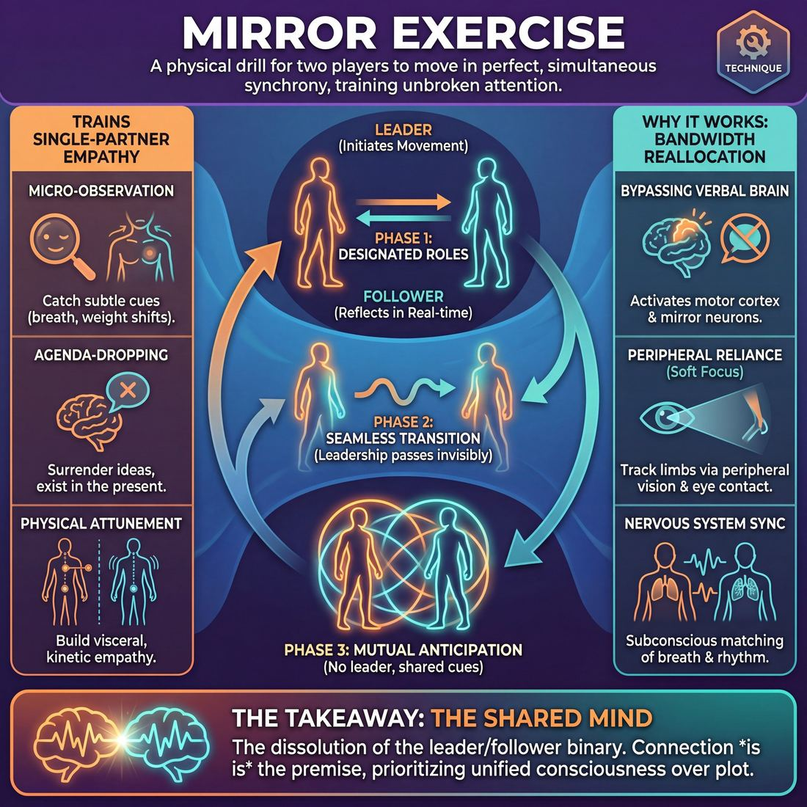

# 🎯 Mirror exercise

> *A drillable muscle that trains **Single-Partner Empathy & Mirroring**.*

{ .infographic }

## 🎯 The essence

The **Mirror exercise** is a foundational two-person physical drill where players face each other and attempt to move in perfect, simultaneous synchrony. By stripping away words, plot, and the pressure to be clever, it isolates and trains one essential muscle: unbroken, hyper-focused attention on a partner. The ultimate goal is not merely to copy physical gestures, but to surrender the ego and achieve a **Shared Mind**—a state of mutual empathy where leadership passes back and forth so seamlessly that an outside observer cannot tell who is leading and who is following.

## 🎓 What it trains

At its core, the Mirror exercise trains **Single-Partner Empathy**. While it is often introduced as a gentle physical warmup, it is actually a rigorous, high-focus drill in attention and surrender. 

Novice improvisers frequently suffer from "planning brain." Under the pressure of the stage, their cognitive load pulls them inward to plan their next line or invent a clever idea. They end up acting *at* their partner—waiting for their turn to speak—rather than acting *with* them. 

The Mirror exercise solves this problem by removing the pressure of invention, leaving only the raw mechanics of connection. It forces the improviser out of their intellectual brain and into their physical, reactive body. 

Specifically, it isolates and drills three vital muscles:

*   **Micro-observation:** To mirror seamlessly, you must watch more than just hands and arms. You train your eyes to catch subtle weight shifts, facial micro-expressions, and the rise and fall of your partner's chest. At the master level of active listening, this exact muscle is what allows an improviser to read a partner's breath and anticipate their offer before they even speak.
*   **Agenda-dropping:** You cannot successfully mirror someone if you are deciding what to do next. The exercise demands that you surrender your own ideas, let go of control, and exist entirely in the present moment.
*   **Physical attunement:** It builds a visceral, kinetic empathy. By putting your body into the exact posture, tension, and rhythm of your partner, you begin to physically feel what they feel, bridging the gap between two separate actors.

!!! abstract "The Deeper Principle: The Shared Mind"
    Improv thrives when the ensemble operates as a single organism. The Mirror exercise is the foundational step in mastering the partner domain. It physically manifests the transition from "two people taking turns" to a unified consciousness where mutual safety is established and connection is prioritized over plot.

## 💡 Why it works

The Mirror exercise is fundamentally an exercise in **bandwidth reallocation**. In a typical improv scene, a player’s brain is juggling multiple demanding tasks: inventing dialogue, tracking the narrative, remembering character details, and monitoring the audience. 

By removing those demands, the exercise frees up 100% of your cognitive load to focus on a single, observable task: your partner. 

Here is the engine under the hood that makes this technique so effective:

* **Bypassing the verbal brain:** Improvisers often rely too heavily on words to connect. The Mirror forces communication into the physical and spatial realms, activating the brain's motor cortex and mirror neurons. You aren't *thinking* about your partner; you are physically *experiencing* their movements.
* **Peripheral reliance:** To successfully mirror someone, you cannot chase their hands with your eyes—if you do, you will always be a fraction of a second late. Instead, the exercise forces players to maintain sustained eye contact and rely entirely on **Soft Focus** (peripheral vision) to track limbs and torso shifts. This sustained eye contact naturally breaks down social barriers and accelerates interpersonal trust.
* **Nervous system synchronization:** As the exercise progresses, a subtle biological shift occurs. Players begin to subconsciously match their breathing rates. They start to read the physical precursors to movement long before a hand or foot actually travels through space.

!!! abstract "The Illusion of Telepathy"
    When the Mirror works perfectly, it exploits a beautiful group dynamic: the dissolution of the leader/follower binary. Because the follower is reading the leader's breath and weight shifts, they begin to move *as* the leader moves, rather than *after*. To an outside observer, it looks like telepathy; internally, it is simply the physical manifestation of a shared mind.

Ultimately, the exercise works because it proves to the improviser's nervous system that they do not need to invent a clever premise to be deeply connected to their scene partner. The connection *is* the premise.

## 🧩 The setup

Here is everything you need to arrange before the exercise begins. Because this technique trains deep empathy, the physical setup should minimize distractions and maximize eye contact.

*   **Players & Arrangement:** Pairs. Players stand face-to-face, exactly parallel to one another, about an arm’s length apart. 
*   **Space & Materials:** An open room. Pairs need enough space to extend their arms fully and step side-to-side without bumping into other groups. No chairs, props, or music are required (though slow, ambient music can occasionally help set a focused mood).
*   **Time:** 1 to 2 minutes per round. A full cycle (A leads, B leads, shared lead) takes about 5 to 7 minutes total.
*   **Roles:** 
    *   **The Leader:** Initiates the movement. Their primary responsibility is to move at a pace and complexity that allows their partner to succeed. 
    *   **The Follower:** Acts as the reflection in the glass. Their job is to observe closely and replicate the Leader's movements in real-time, mirroring right hand to left hand.
    *   **Shared Lead (Advanced):** Both players move together without a designated leader, relying entirely on mutual anticipation and micro-cues.
*   **Prerequisites:** A basic physical warm-up to shake out stiffness. Players should already be comfortable sustaining eye contact.

!!! tip "Setting the physical distance"
    If players stand too close, they lose peripheral vision of each other's lower bodies. If they stand too far, the intimate connection of the "mirror" breaks. Have them reach out and lightly touch palms, then drop their hands—that is the perfect distance.

!!! example "How to introduce it"
    **Facilitator Script:** 
    "Find a partner and stand facing them, an arm's length apart. Decide who is A and who is B. 
    
    Player A, you are the Leader. In a moment, you are going to start moving slowly and smoothly. Your goal is *not* to trick your partner or show off how fast you can move. Your goal is to make it incredibly easy for them to follow you. You want to make them look brilliant. 
    
    Player B, you are the Follower. You are the reflection in the mirror. Keep a soft focus on your partner's eyes—don't stare at their hands, use your peripheral vision. Breathe when they breathe, and reflect their movements as exactly as you can. 
    
    We will go for one minute, and then we will switch. Player A, begin."

## ⚙️ The mechanics

The fundamental objective of the Mirror exercise is a continuous, silent loop of physical initiation and immediate, empathetic response.

Here is the exact sequence of play:

1. **Establish Connection:** Partners stand facing each other, roughly an arm's length apart. They drop into a neutral, relaxed posture and lock eyes. 
2. **The Initiation:** The designated Leader begins to move. The movement must be slow, fluid, and continuous—moving through the space as if underwater.
3. **The Reflection:** The Follower mirrors the Leader's movements exactly and simultaneously. Because it is a true mirror, if the Leader raises their right arm, the Follower raises their left arm. 
4. **The Sustained Loop:** Both players breathe together, maintaining the flow. The Leader constantly monitors the Follower, adjusting their speed and complexity to ensure the Follower is never left behind.
5. **The Switch:** On the facilitator's cue (e.g., "Seamlessly switch... now"), the roles swap. The Follower becomes the Leader without dropping the physical motion or breaking eye contact. 
6. **The Reset:** The facilitator calls "Relax" or "Shake it out." Players drop their arms, break eye contact, and physically shake off the intense focus before starting a new round or switching partners.

### Rules & Constraints

To keep the exercise focused on empathy rather than choreography, players must adhere to a strict set of constraints:

* **Absolute Silence:** No talking, whispering, or nervous giggling. The communication must remain entirely physical.
* **Continuous Motion:** No sudden stops, jerks, or rapid changes in direction. Every movement should have a clear beginning, middle, and end.
* **Stay Rooted (Initially):** In the basic version, players keep their feet planted. This prevents the exercise from turning into a chaotic dance and forces focus onto the upper body, face, and breath.

!!! abstract "The Golden Rule of Leading"
    The Leader's primary job is *not* to invent interesting or complex choreography. Their sole responsibility is to **ensure the Follower can succeed**. If the Follower is lagging, the Leader is moving too fast or being too tricky. A successful Leader takes care of their partner.

!!! tip "On stage: Use 'Soft Focus'"
    When a partner moves their hand, the natural instinct is to look down at it. **Don't.** Players must maintain eye contact (looking at the bridge of the partner's nose or directly into their eyes) and use their peripheral vision to track the limbs. This trains improvisers to read a partner's entire body language at once, rather than getting tunnel vision on a single detail.

## 🎬 Sample round

Because the Mirror exercise is entirely physical and silent, a "scene" here is a real-time choreography of movement and attention. Here is how a successful progression unfolds on the floor.

!!! example "Sample round: The Physical Mirror"
    **Players:** Sam (initially Leading) and Taylor (initially Following).

    **1. The Anchor**
    Sam and Taylor stand facing each other, about two feet apart. They drop their hands to their sides, take a synchronized, audible breath, and lock eyes. 
    * **The Mechanic in action:** *Establishing the focal point.* They are looking directly into each other's eyes, relying entirely on peripheral vision to track the rest of the body. 

    **2. The Initiation**
    Sam slowly raises their right hand, palm facing outward. Taylor simultaneously raises their left hand, keeping it exactly opposite Sam's, as if they are both pressing against the same invisible pane of glass.
    * **The Mechanic in action:** *Moving at the speed of the follower.* Sam is not trying to trick Taylor or "win" the exercise. They are moving deliberately so Taylor can maintain the illusion of a single, unbroken reflection.

    **3. Adding Nuance**
    Sam shifts their weight to their right leg, tilts their head, and lets out a silent, open-mouthed gasp. Taylor's weight shifts perfectly in tandem, their face mirroring the exact shape and intensity of the gasp.
    * **The Mechanic in action:** *Full-body and emotional mirroring.* They have moved beyond basic gross motor skills to capture posture and the emotional subtext of the movement.

    **4. The Hand-off**
    The coach calls out, "Switch leads." Sam slowly brings their hand down to their chest and pauses for a half-second. Taylor takes over, smoothly extending both arms outward into a stretch. Sam follows instantly.
    * **The Mechanic in action:** *Passing the lead.* The transition is seamless. Sam brings the movement to a neutral, easily readable resting place before Taylor initiates the new offer, ensuring the connection is never broken.

## 🎚️ Variations & progressions

The Mirror exercise is highly adaptable. By tweaking the constraints, you can scale the cognitive load to match the players' experience level, moving them from basic physical mimicry to a profound state of shared empathy.

Here is how the exercise naturally progresses alongside a player's maturity:

| Stage | Focus | Variation | Description |
| :--- | :--- | :--- | :--- |
| **1 Novice** | Accuracy | **Strict Leader/Follower** | Roles are explicitly assigned. The follower focuses entirely on matching the leader's slow, deliberate physical movements. |
| **2 Adv. Beginner** | Expansion | **Full-Body & Face** | Moving beyond just hands and arms. Players must mirror posture, weight shifts, and facial expressions. |
| **3 Competent** | Connection | **The Shared Lead** | No designated leader. Both players initiate and follow simultaneously, blurring the line of who is driving the movement. |
| **4 Proficient** | Subtext | **Vocal & Emotional Mirror** | Adding **Gibberish** (made-up language) or emotional states. Players mirror the *feeling* and tone, not just the geometry. |
| **5 Master** | Anticipation | **Breath & Micro-expressions** | Players stand close and mirror the rhythm of each other's breathing and the tiniest shifts in eye tension or jaw set. |

### Common Variations

To keep the drill fresh or target specific skills, try these established variants:

*   **Fingertip Connection:** Players hold their hands up and lightly touch fingertips with their partner. This physical feedback loop makes it much easier for novices to track movement and speed, grounding them in the physical reality of the exercise.
*   **The "Who's Leading?" Challenge:** A third player (or the instructor) acts as an observer. The pair uses the Shared Lead variation, and the observer must try to guess who is initiating the movement. If the pair is truly sharing the lead, it should be impossible to tell.
*   **Gibberish Mirror:** Players add vocalization using nonsense sounds and syllables. The follower must mirror the pitch, volume, rhythm, and emotional intensity of the gibberish exactly. This trains the ear to hear the "music" of an offer rather than just the words.
*   **Three-Way (or Group) Mirror:** Players stand in a triangle or a diamond. The person at the "front" leads. As the group slowly rotates, whoever ends up at the front seamlessly takes over the lead. This expands single-partner empathy into ensemble awareness.

!!! tip "On stage"
    You don't need to do a literal slow-motion mirror in a scene to use this skill. When you walk on stage, try subtly mirroring your partner's posture or the rhythm of their breathing. It instantly creates a sense of shared reality and relationship before a single word is spoken.

!!! warning "Watch out"
    Do not rush the progression. If players attempt the Shared Lead before they have mastered the Strict Leader/Follower, the exercise usually devolves into a chaotic, jerky tug-of-war. Build the muscle of following first.

## 🧑‍🏫 Coaching notes

As a coach, your primary job during the Mirror exercise is to regulate the room's tempo and shift the players' focus from *getting it right* to *connecting with their partner*. Left to their own devices, improvisers will naturally speed up and turn the exercise into a game of Simon Says. You must actively anchor them.

!!! tip "Coaching: The Golden Cue"
    **"Look into the eyes, see the hands."**  
    Novices will stare directly at their partner's hands to track the movement. Coach them to maintain soft eye contact and use their peripheral vision to follow the body. This shifts the exercise from a mechanical tracking task to an exercise in deep, shared empathy.

### Active Side-Coaching Phrases
Deliver these cues calmly and rhythmically while the pairs are moving. Do not stop the exercise to give these notes; let the players absorb them in motion.

* **"Slow down. Slower than that."** The universal note. When they think they are going slowly, ask them to halve the speed again.
* **"Breathe together."** Prompt them to sync their respiration. When chests rise and fall in unison, nervous systems align, and the movement naturally synchronizes. 
* **"Leaders, let your partner succeed."** Remind the leader that their job is not to trick the follower, but to move in a way that makes the follower's job effortless. This trains the core muscle of **Active Gifting**.
* **"If I can tell who is leading, you are moving too fast."** A highly effective diagnostic callout for the whole room.
* **"Smooth out the edges."** Encourage continuous, fluid motion rather than jerky, stop-and-start robotics.

### What 'Good' Looks Like
As you scan the room, look for these observable markers of success:

| Marker | What you will see |
| :--- | :--- |
| **Gaze** | Partners maintain a steady, relaxed eye contact. Eyes are not darting wildly to track limbs. |
| **Fluidity** | Movement is continuous. When a hand reaches the end of its range of motion, it smoothly arcs into the next movement without a hard stop. |
| **Accommodation** | The leader is actively reading the follower's micro-expressions. If the follower lags by a fraction of a second, the leader instinctively slows down to let them catch up. |
| **Tension** | The physical space between the partners feels thick and deliberate, rather than frantic, giggly, or competitive. |

!!! note "Spotting the shift"
    You will know the exercise is working when the room goes completely silent, the nervous laughter fades, and the pairs look like they are moving underwater. This is the moment they have transitioned from 'acting with someone' to operating with a 'shared mind'.

## 🧭 Debrief & reflection

The debrief is where the physical sensation of the Mirror exercise translates into foundational improv philosophy. By asking the right questions, a coach helps players connect the mechanics of the drill to the broader goal of achieving a shared mind. 

Here are the essential questions to ask the group once the exercise concludes, and the insights you want to draw out:

* **"At what point did you lose track of who was leading?"**
    * *What it surfaces:* The ultimate goal of the exercise. Players should realize that in a state of deep, empathetic connection, the binary of "leader" and "follower" dissolves. The movement simply becomes *ours*.
* **"Where was your visual focus?"**
    * *What it surfaces:* The shift from hard focus to Soft Focus. As novices relax, they realize it is easier to look softly at their partner's eyes or chest, using peripheral vision to track the hands. This mimics how improvisers must take in the *whole* partner on stage, not just the literal words they are saying.
* **"How did it feel to be the follower?"**
    * *What it surfaces:* The relief of dropping the invention pressure. Followers often report feeling highly focused but deeply relaxed, because their only job was to observe and react. This is the exact headspace required for active listening in a scene.
* **"Leaders, what did you have to do to keep the connection intact?"**
    * *What it surfaces:* The responsibility of the initiator. Leaders quickly learn that if they move too fast or make jerky, complex motions, they leave their partner behind. To succeed, the leader must constantly monitor the follower's capacity and adjust their speed—a direct parallel to pacing and clarifying your offers in a scene so your partner can actually use them.

!!! abstract "The Core Realization"
    A successful debrief guides players to understand that **leading is an act of service, and following is an act of creation.** The leader isn't dictating; they are offering a shared path. The follower isn't passive; their intense, active attention is what makes the movement real. When both players commit to this mutual care, the shared mind emerges.

## ⚠️ Common pitfalls

!!! warning "Watch out: The 'Gotcha' Game"
    The single most common novice trap is treating the Mirror exercise like a competitive sport. The leader moves suddenly, erratically, or at warp speed to "trick" the follower and see if they can keep up. This completely destroys the goal of the exercise. The objective is not to test your partner's reflexes; it is to make your partner look like a genius by moving in a way they can perfectly reflect. If the follower stumbles, the *leader* failed to support them.

When cognitive load spikes—usually because a player is overthinking their next move or feeling self-conscious—the exercise tends to break down in a few predictable ways. Here is how to spot and fix them:

*   **Staring at the hands:** Novices often drop their gaze to watch their partner’s hands or feet to ensure geometric accuracy. This breaks the interpersonal connection and shrinks their awareness.
    *   *The Fix:* Maintain a Soft Focus on the partner’s eyes or the bridge of their nose. You will actually mirror more accurately when you take in the whole picture rather than chasing individual moving parts.
*   **The "Dead Face":** Players get so focused on gross motor movements (arms, torso, legs) that their faces go completely slack. They mirror the body but abandon the humanity.
    *   *The Fix:* Remind players to mirror the micro-expressions—eyebrows, smiles, jaw tension, and breath. The face is the most important part of the mirror. 
*   **Anticipating the move:** The follower gets anxious about lagging behind, so they start guessing where the leader is going. Suddenly, the follower is accidentally leading, the shared mind fractures, and the movement becomes a messy negotiation.
    *   *The Fix:* Accept the micro-second delay. It is better to be a fraction of a second behind but truly following than to guess wrong and break the connection. 
*   **The Robot:** Under the pressure of being watched, players stiffen up. Movements become jerky, mechanical, and isolated to one joint at a time.
    *   *The Fix:* Focus on continuous, flowing breath. If the breath is fluid, the body will follow. Encourage leaders to imagine they are moving through heavy water, not empty air.

!!! tip "On stage"
    If you ever feel a scene derailing, you are likely falling into the mental equivalent of these traps—breaking eye contact to plan your next joke, or anticipating your partner's line instead of actually listening to it. When in doubt, drop your agenda, look them in the eye, and just reflect the emotional reality they are giving you.

## 🌟 What mastery looks like

When the Mirror exercise reaches its highest level, the mechanical delay between action and reaction completely vanishes. The two improvisers cease to look like a leader and a follower; instead, they appear as a single organism controlled by a shared nervous system. 

At this stage, the exercise transcends physical mimicry and becomes a profound display of **kinesthetic empathy**.

Here are the observable markers of a master-level Mirror:

*   **The Invisible Leader:** An outside observer walking into the room cannot tell who was assigned to lead and who to follow. The movement is so continuous, smooth, and mutually supported that the distinct roles dissolve entirely.
*   **Syncing Breath and Micro-expressions:** Mastery moves far beyond matching hand gestures. Master improvisers mirror the rise and fall of the chest, the tension in the jaw, and the subtle widening of the eyes. They read these patterns to anticipate movement before a limb even shifts, eliminating any lag.
*   **Full-Body Weight Shifts:** The mirror extends all the way to the floor. Masterful players mirror the exact distribution of weight, the angle of the spine, and the grounding of the feet. If one player shifts their center of gravity, the other shifts simultaneously.
*   **Sustained "Shared Leadership":** When prompted to drop the designated roles and simply "move together," the movement doesn't stop, stutter, or devolve into a stalemate. They enter a flow state where both are simultaneously offering and accepting movement without conscious negotiation.

!!! abstract "The 'Third Mind'"
    At the Master stage of active listening and gifting, players are so deeply attuned to each other's physical state that they stop planning their next move. Instead, a "third mind" takes over—a state of pure, spontaneous co-creation. Every subtle shift is designed to make the partner look brilliant, and the act of gifting movement becomes entirely invisible.

!!! example "In the room"
    If you watch a master pair, you won't see them staring blankly at each other's hands. Their gaze is soft, usually focused on the bridge of the partner's nose or the center of the chest, taking in the entire body using peripheral vision. When one smiles, the other's eyes crinkle at the exact same millisecond.

## 🔗 Why it matters

The Mirror exercise is the most direct physical route to achieving a shared mind—the ultimate goal of all partner work. In everyday life, we are conditioned to wait for our turn to speak, trapped in our own heads. On the improv stage, that isolation is fatal. By bypassing the intellect, this technique forces improvisers to rely entirely on Single-Partner Empathy. It physically rewires the brain to stop planning and start observing.

Consider the journey of an improviser's **Active Listening**. A novice often tries to pay attention, but the cognitive load of the scene pulls them back into planning their next line. Through dedicated mirroring, they learn to quiet that internal noise. As they approach mastery, they aren't just reacting to big, sweeping gestures; they are reading their partner's breath, subtle weight shifts, and micro-expressions to anticipate an offer before it fully materializes. The Mirror exercise is the gym where that specific, high-level observational muscle is built.

Beyond the drill itself, this physical synchronization bleeds into every aspect of the wider craft:

*   **Emotional resonance:** Physical mirroring naturally triggers emotional empathy. Subconsciously adopting a partner's slumped shoulders or tightened jaw often induces the very emotion they are playing, allowing you to react from a place of genuine, grounded truth.
*   **Pacing and rhythm:** It trains improvisers to breathe together. When two performers share a physical rhythm, their scenes feel inevitable and connected, rather than rushed, disjointed, or competitive.
*   **Ego dissolution:** By deliberately blurring the line between leader and follower, the exercise teaches improvisers that making their partner look brilliant is the only way the scene succeeds. The "I" becomes "We."

!!! abstract "The ultimate illusion"
    When the lessons of the Mirror exercise are fully internalized, the audience stops seeing two actors negotiating a scene. Instead, they see a single organism exploring a relationship. The mechanics of agreement become entirely invisible, leaving only the magic of spontaneous connection.

## 📚 References & Further Reading

### Foundational sources
* **Viola Spolin, *Improvisation for the Theater* (1963)** — The undisputed origin of the Mirror exercise in modern improvisational theater. Spolin’s text outlines the exact mechanics of the game, emphasizing the "point of concentration" and the ultimate goal of "following the follower" to dissolve the ego and achieve a state of physical and mental oneness. [Available via Northwestern University Press]{.ref}

### Practitioner guides & manuals
* **Anne Bogart & Tina Landau, *The Viewpoints Book: A Practical Guide to Viewpoints and Composition* (2005)** — While rooted in postmodern dance and physical theater, this manual is essential for mastering the physical attunement required in the Mirror exercise. Its chapters on "Kinesthetic Response" (spontaneous reaction to motion outside oneself) and "Spatial Relationship" perfectly articulate the mechanics of soft focus and non-verbal connection. [Available via Theatre Communications Group]{.ref}
* **Charna Halpern, Del Close, & Kim "Howard" Johnson, *Truth in Comedy: The Manual of Improvisation* (1994)** — The definitive text on the "Group Mind." While the book focuses on long-form ensemble work, it provides the philosophical underpinning for the "Shared Mind" concept that the two-person Mirror exercise physically introduces to novice improvisers. [Available via Meriwether Publishing]{.ref}

### Research & theory
* **Lior Noy, Erez Dekel, & Uri Alon, "The mirror game as a paradigm for studying the dynamics of two people improvising motion together" (*Proceedings of the National Academy of Sciences*, 2011)** — A fascinating study that explicitly uses the theatrical mirror game to study joint improvisation. The researchers found that when expert improvisers drop the leader/follower dynamic, they can synchronize movements to less than 40 milliseconds, providing empirical evidence for the "Illusion of Telepathy" and the "Shared Mind." [Read the study]{.ref}
* **Michael J. Hove & Jane L. Risen, "Interpersonal Synchrony Increases Affiliation" (*Social Cognition*, 2009)** — A landmark psychological study demonstrating the exact mechanism behind the Mirror exercise's effectiveness. The researchers found that moving in exact physical synchrony directly increases interpersonal trust, affiliation, and prosocial behavior, proving that the connection built in the exercise is biological, not just theatrical. [Read the study]{.ref}
* **Giacomo Rizzolatti & Corrado Sinigaglia, *Mirrors in the Brain: How Our Minds Share Actions, Emotions, and Experience* (2008)** — A highly accessible breakdown of the discovery of mirror neurons by the neuroscientists who pioneered the research. This book explains the biological engine under the hood of the Mirror exercise, detailing how observing a partner's movement activates the same motor cortex pathways as performing the movement yourself, effectively bypassing the verbal brain. [Available via Oxford University Press]{.ref}

### Talks, videos & courses
* **Alan Alda Center for Communicating Science (Workshops) & Alan Alda, *If I Understood You, Would I Have This Look on My Face?* (2017)** — Actor and science advocate Alan Alda details how his center uses Spolin's Mirror exercise to train doctors and scientists. He explicitly connects the physical mirroring drill to the development of deep, active empathy and the ability to read micro-expressions in high-stakes environments. [Visit the Alda Center]{.ref}

### Communities & adjacent reading
* **Sanford Meisner & Dennis Longwell, *Sanford Meisner on Acting* (1987)** — Meisner's famous "Repetition Exercise" is effectively the verbal equivalent of the Mirror exercise. Like the physical mirror, it is designed to strip away planning, bypass the intellectual brain, and force actors to place 100% of their attention on their partner. [Available via Vintage Books]{.ref}
* **Dance/Movement Therapy (DMT)** — A psychological and therapeutic discipline that heavily utilizes the "Mirror-game" paradigm to foster embodied empathy and emotional understanding in clinical settings. The American Dance Therapy Association provides extensive resources on how physical attunement heals and connects. [Visit the ADTA]{.ref}

## 💬 Quotes & Anecdotes

!!! quote "— Viola Spolin, *1982 Workshop*"
    [Participants] had a feeling of oneness. Now what's nicer than having a feeling of oneness? When you're standing all alone in a crowd, right? ... And following the follower does produce a unity and a union.

!!! quote "— Viola Spolin, *1982 Workshop*"
    You're taking us out of the head—we've got to think about it, and the boredom—and you're getting it into the body—body, mind, intuition. That's what we're after: body, mind, intuition.

!!! quote "— Viola Spolin, *Spolin Theater Games*"
    Following the follower, as you've just experienced it even if briefly, is key to improvisation. It is the flow between you and your fellow player that makes the games work. It is not your responsibility in a theater game to be in charge all the time. Sometimes you lead, sometimes you follow, and always you look to follow the follower.

### Where it comes from

The Mirror exercise was formalized for modern theater and improv by Viola Spolin, widely considered the "mother of modern improvisation." She introduced it in her foundational 1963 book, *Improvisation for the Theater*. Spolin developed "Theater Games" to help actors bypass their intellectual, planning brains and tap into pure physical intuition. She coined the term "following the follower" to describe the ultimate goal of the Mirror exercise: a state where neither player is consciously leading or initiating, but both are so deeply attuned to one another that they move in perfect, simultaneous flow.

### A telling example

**The "Off-Balance" Moment**
Improv teachers and Spolin practitioners often note a specific phenomenon that happens when the Mirror exercise is working perfectly. As the facilitator speeds up the switch between "Leader" and "Follower," the distinction between the two roles completely dissolves. Spolin called this the "Off-Balance moment"—a disconcerting but magical state of true unknowing where neither person is in control, yet movement continues.

Novice improvisers frequently find this sudden, intense intimacy and loss of control terrifying. When they hit this moment of true "shared mind," the tension often causes them to break eye contact, giggle, or make a joke to gracefully retreat back to the safety of their own ego. The mastery of the Mirror exercise is learning to sit in that off-balance tension, surrendering control without breaking the connection. 

**The Sidewalk Dance**
If you struggle to understand what "following the follower" feels like, Spolin practitioners often point to a common real-world accident: walking down a hallway and trying to get out of a stranger's way, only to simultaneously step to the same side. You both step back, and then both step to the other side, perfectly mirroring each other in a brief, accidental dance. For a few seconds, neither of you is leading, but you are entirely physically connected to the other person's micro-movements. The Mirror exercise simply takes that accidental synchronization and sustains it on purpose.

## 🧭 Explore the framework

- ⬆️ **Skill it trains:** [Single-Partner Empathy & Mirroring](02_S3__single-partner-empathy-and-mirroring.md)
- 🎭 **Domain:** [The Partner](02_D__the-partner.md)
- 🔁 **Sibling techniques:** [Emotional-echo drills](02_S3_T2__emotional-echo-drills.md)
