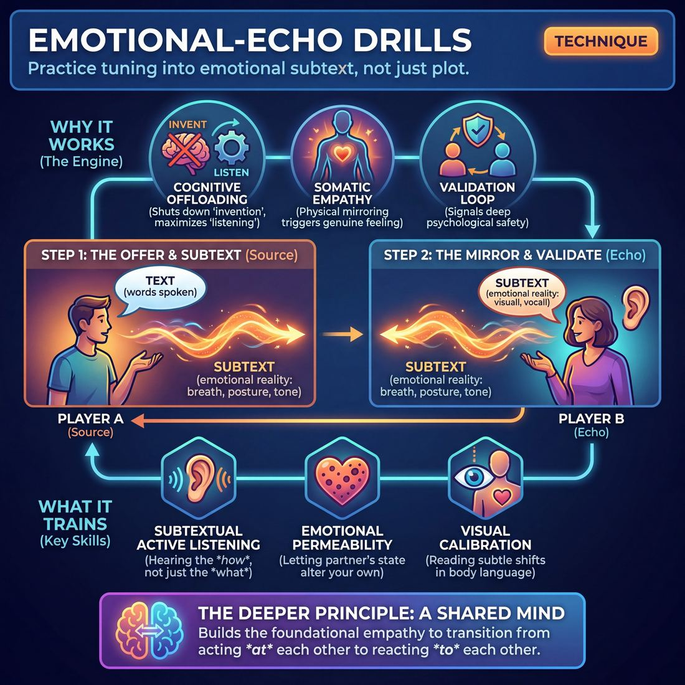

# 🎯 Emotional-echo drills

> *A drillable muscle that trains **Single-Partner Empathy & Mirroring**.*

{ .infographic }

## 🎯 The essence

**Emotional-echo drills** are focused, two-person exercises where players must explicitly identify, mirror, or vocalize the underlying emotion of their partner's last line before delivering their own response. Rather than listening merely to gather facts or plan a clever reply, this technique forces improvisers to isolate and practice a single, vital muscle: tuning into the **emotional subtext** of their scene partner. By making the implicit emotion explicit, players train themselves to react to *how* something is said, grounding the scene in genuine empathy and shared feeling rather than pure plot.

## 🎓 What it trains

At its core, this technique isolates and builds the muscle of **Single-Partner Empathy & Mirroring**. It is the antidote to the "talking head" syndrome that plagues early scene work.

When an improviser first steps on stage, the cognitive load is immense. A novice will often try to listen, but the sheer panic of *“what do I say next?”* pulls them out of the moment and into intellectual planning. They hear the **text** (the literal words spoken) but completely miss the **subtext** (the emotional reality behind the words). 

Emotional-echo drills exist to solve this exact problem. By temporarily stripping away the pressure to invent brilliant dialogue or drive a narrative forward, the drill forces the improviser to focus entirely on *how* their partner is behaving. 

Specifically, this drill trains three vital sub-skills:

*   **Subtextual Active Listening:** Training the ear to hear the sigh, the hesitation, or the sharp clip of a consonant, rather than just the vocabulary.
*   **Emotional Permeability:** The willingness to let a partner's emotional state genuinely alter your own. It teaches improvisers to stop acting *at* each other and start reacting *to* each other.
*   **Visual Calibration:** Moving the improviser's focus from their own internal monologue to their partner's physical reality—eventually training them to read subtle shifts in breath, posture, and micro-expressions.

!!! abstract "The Deeper Principle: A Shared Mind"
    This technique lives in the domain of **The Partner**. The ultimate goal of this domain is to transition from simply "acting on stage with someone" to operating with a "shared mind." You cannot share a mind if you are only sharing words. Emotional-echo drills build the foundational empathy required to make your partner's emotional reality just as important as your own.

## 💡 Why it works

This drill succeeds through **cognitive offloading**. When the burden of *what* to say is lifted, the improviser can finally focus entirely on *how* it was said. 

By entirely removing the pressure to solve a scene's plot or be funny, the improviser’s brain is freed to do something much more difficult: actually pay attention to the human being standing in front of them. This technique exploits several underlying mechanisms to build that connection:

* **Bypassing the intellectual brain:** Novice improvisers frantically scan their partner's words for logical clues to build a response. Echoing forces the brain to process the subtext—the breath, the tension in the jaw, the pitch of the voice. It shifts the improviser from linguistic processing to emotional processing.
* **Somatic empathy:** Emotion isn't just mental; it is physical. By forcing the receiver to physically mirror the sender's posture, facial expression, and vocal cadence, the drill triggers a physiological feedback loop. You begin to genuinely feel your partner's emotional state because your body is mimicking the physical markers of that state. 
* **The validation loop:** For the person *being* echoed, the experience is profoundly validating. Seeing your own emotional reality instantly and accurately reflected back to you signals deep psychological safety. It proves, on a visceral level, "I am not out here alone."

!!! abstract "The engine under the hood"
    This drill artificially isolates the **listening** muscle from the **inventing** muscle. In a normal scene, these two cognitive processes compete for bandwidth. By temporarily shutting down the invention engine, the listening engine can run at maximum capacity, training the improviser to absorb emotional data they usually miss.

Ultimately, this rewires the improviser's default response mechanism. Instead of reacting to an offer with a pre-planned idea, they learn to let the partner's emotional state physically alter their own, bridging the gap between simply sharing a stage and achieving true, resonant emotional mirroring.

## 🧩 The setup

**Players & Arrangement**
*   **Group size:** Even numbers, split into pairs. 
*   **Arrangement:** Pairs stand or sit directly facing each other, about an arm's-length apart. They need an unobstructed view of each other's faces and bodies to catch subtle shifts in breath, posture, and micro-expressions. 

**Space & Materials**
*   **Space:** An open room. Spread the pairs out generously. If the room is too loud, players will instinctively raise their voices to be heard, which artificially alters their emotional baseline and ruins the subtlety of the drill.
*   **Materials:** None required. Two chairs per pair if you prefer a seated, grounded variation.

**Time**
*   **Per round:** 1 to 2 minutes before swapping roles. Keep rounds short so the emotional intensity doesn't dilute into intellectual scene-building.
*   **Total duration:** 10 to 15 minutes, allowing both partners to play both roles multiple times with different emotional baselines.

**Roles**
*   **The Source (Player A):** Delivers a short, simple line of dialogue (or a brief, continuous monologue, depending on the variation) while holding a specific, genuine emotional state.
*   **The Echo (Player B):** Receives the line and repeats it back verbatim. Their goal is to perfectly mirror the emotional weight, vocal cadence, facial expression, and physical posture of the Source.

**Prerequisites**
*   Players should already be at an Advanced Beginner stage of **Active Listening**—meaning they can reliably repeat a partner's words accurately without panicking. 
*   A baseline comfort with sustained eye contact and mutual vulnerability.

!!! quote "How to introduce it"
    "Find a partner and stand facing them. Decide who is A and who is B. Player A, you are the Source. You are going to say a single, mundane sentence—like 'I bought a new car today' or 'The dog is outside'—but you are going to infuse it with a specific, strong emotion. 
    
    Player B, you are the Echo. Your job is to be a perfect emotional mirror. You aren't just repeating the words; you are catching and reflecting the exact feeling, the breath, the posture, and the tone. Don't parody them, and don't try to be clever. Just let their emotion become your emotion. Take a breath, receive the gift, and echo it back."

!!! tip "On stage"
    If you have an odd number of players, the facilitator should jump in to make a pair rather than creating a group of three. A triad fractures the direct, one-to-one eye contact required to build single-partner empathy.

## ⚙️ The mechanics

!!! abstract "The Core Objective"
    The goal of an emotional-echo drill is to bypass the intellectual brain (which wants to invent clever dialogue) and respond purely to the emotional data your partner is broadcasting. You are training yourself to become a flawless emotional mirror, reacting on impulse rather than planning.

The baseline mechanic of this drill relies on **strict repetition**. By locking the dialogue into a repeating loop, players are forced to communicate entirely through tone, body language, and emotional intensity.

### The Flow of Play

A standard round follows a precise, continuous loop between two players:

1. **The Initiation:** Player A delivers a single, short, mundane line of dialogue. They must infuse this line with a clear, genuine emotion (e.g., joy, suspicion, heartbreak, irritation) without overacting or "pushing" it.
2. **The Reception:** Player B maintains unbroken eye contact. They do not think about what the words mean; they actively listen to the *pitch, volume, breath, and posture* of Player A. 
3. **The Echo:** Without a microsecond of hesitation, Player B repeats the **exact same words** back to Player A. Player B's sole job is to perfectly mirror the emotional state and intensity they just received. 
4. **The Evolution:** Player A receives the echo. They repeat the phrase back to Player B. However, Player A allows their emotion to naturally shift, heighten, or soften based *only* on how Player B's echo made them feel. 
5. **The Loop:** The players continue passing the exact same phrase back and forth. The emotion will naturally morph—irritation might escalate into rage, or soften into tragic sadness—driven entirely by the shared connection.

### Rules & Constraints

To keep the drill focused on empathy and mirroring, enforce these strict boundaries:

* **Zero delay:** The echo must happen on the impulse. If a player pauses to process the words or decide *how* to say them, they have dropped into their head. 
* **Unbroken eye contact:** Players must keep their eyes locked. This trains the ability to read micro-expressions and breath (the hallmark of a Master-level improviser).
* **No premeditation:** Players cannot decide what emotion they will play before the round starts, nor can they decide to artificially change the emotion mid-loop. The emotion must evolve organically from the partner's offer.
* **The words are just a vehicle:** The phrase itself is meaningless. If the phrase is "I like your shoes," but the partner says it with devastating grief, the echo must be filled with devastating grief.

!!! warning "The Golden Rule: Don't invent, just reflect"
    Novice players often try to "act" the emotion or invent a reason for it. In this drill, you do not need a reason. If your partner gives you anger, you reflect anger. The justification comes later; right now, you are just building the muscle of empathy.

### Ending and Resetting

A single loop usually lasts between 30 and 60 seconds. The coach or instructor calls **"Cut"** or **"Reset"** when:
* The emotional arc reaches a natural, undeniable peak.
* The players get stuck in a stagnant, unchanging rhythm.
* A player breaks the constraint by changing the words or breaking eye contact.

Upon hearing "Reset," both players physically shake out the tension, take a deep breath to clear the emotional slate, and Player B initiates the next round with a brand new phrase and a new emotional baseline.

## 🎬 Sample round

!!! example "Sample round: The Fence"
    In this round, two players (Alex and Sam) are practicing the core loop: **Absorb**, **Echo**, and **Build**. Notice how the focus is not on being clever, but on proving to the partner that their emotional state was completely received.

    **Player A (Alex):** *(Slumps shoulders, lets out a long, heavy sigh, speaks with deep exhaustion)* "I can't believe we have to paint the whole fence today."
    
    **Player B (Sam):** 
    * **The Absorb:** *(Sam takes a deliberate one-second pause, letting Alex's exhaustion land. Sam drops their own shoulders and mirrors the heavy sigh.)*
    * **The Echo:** *(Matching Alex's exact tone and physical posture of dread)* "Paint the whole fence today..."
    * **The Build:** *(Staying in the shared exhaustion)* "...and the sun is already baking."

    **Player A (Alex):**
    * **The Absorb:** *(Alex takes in the new offer and the shared heat, wiping their brow and squinting upward.)*
    * **The Echo:** *(Matching the oppressive, sweaty reality Sam just introduced)* "The sun is already baking..."
    * **The Build:** *(Adding stakes)* "...we're going to roast out here before noon."

    **Player B (Sam):**
    * **The Absorb:** *(Sam fans their face, leaning heavily against an imaginary post.)*
    * **The Echo:** *(Voice cracking slightly with thirst)* "Roast out here before noon..."
    * **The Build:** "...I knew I should have bought that lemonade mix."

    **What to notice:** By the third exchange, Alex and Sam are no longer just "acting tired" at each other. Because they are forced to physically and vocally wear their partner's emotion before speaking, they have rapidly built a **shared mind** and a unified atmospheric reality.

## 🎚️ Variations & progressions

To keep players challenged as their active listening matures, you can adjust the drill's constraints. The progression moves players from literal repetition to deep, intuitive mirroring, aligning directly with their development from Advanced Beginners to Masters.

Here is how to ramp the difficulty:

**1. The Literal Echo (Advanced Beginner)**
*   **The tweak:** Player B must repeat Player A’s exact words, matching the exact emotional tone and physical posture. 
*   **Why it works:** It forces players who are stuck in their heads (planning their next line) to focus entirely on what was just given to them. It builds the baseline skill of repeating a partner's words accurately.

**2. The Gibberish Echo (Competent)**
*   **The tweak:** Player A speaks in English with a strong emotion. Player B echoes the exact emotion, volume, and physicality, but responds entirely in **gibberish** (made-up language).
*   **Why it works:** It strips away the intellectual safety net of vocabulary. Player B can no longer rely on the *meaning* of the words and must build on the specific emotional and physical offer.

**3. The Subtextual Echo (Proficient)**
*   **The tweak:** Player A delivers a line where the text contradicts the emotion (e.g., saying "I'm so happy for you" while clearly seething with jealousy). Player B must echo the *subtext*, not the text. 
*   **Why it works:** It trains the Proficient improviser's ability to hear subtext. Player B learns to validate the hidden truth of the scene rather than getting trapped by the literal dialogue.

**4. The Somatic Echo (Master)**
*   **The tweak:** Before Player B speaks, they must inhale at the exact same rate and depth as Player A, adopting their micro-expressions and muscle tension. Only after their nervous systems are physically synced do they deliver their line.
*   **Why it works:** It pushes players toward Master-level empathy, where they are reading their partner's breath and micro-expressions to anticipate the offer before it even fully lands.

!!! example "In a scene: The Subtextual Echo"
    **Player A:** *(Looking at the floor, shoulders slumped, voice trembling)* "No, really, the casserole is delicious. I'm glad you brought it."
    
    **Player B (Echoing the subtext):** *(Also looking at the floor, shoulders slumped, voice trembling)* "It tastes like ash and we are both so incredibly lonely."

### Common Variations

*   **The Heightening Echo:** Instead of matching the emotion exactly, Player B must echo it back dialed up by 10%. If Player A is mildly annoyed, Player B is visibly frustrated. This trains players to actively drive the scene's energy rather than just maintaining it.
*   **The Opposite Echo:** Player B adopts the exact *opposite* emotional state of Player A (e.g., A is frantic; B is unnervingly calm). This is an advanced variant that teaches **Status Modulation**, showing how contrasting emotional energies can define a relationship's status dynamic.

!!! tip "When to level up"
    Do not move to the Subtextual or Somatic echoes until the ensemble can consistently perform the Literal Echo without paraphrasing. If Player B changes "I hate this car" to "You don't like the car," they are still translating the offer through their own brain rather than truly catching and reflecting it. Keep them on Level 1 until the exact words land.

## 🧑‍🏫 Coaching notes

When running emotional-echo drills, your primary job as a coach is to get players out of their heads and into their bodies. Because improvisers are naturally wired to listen for information (the "who, what, where"), they will often default to intellectualizing the exercise. You must actively **side-coach**—giving verbal cues while the drill is happening—to keep them focused on the emotional undercurrent.

!!! tip "Coaching: The Golden Cue"
    **"Don't wait to understand it—reflect it."**  
    Players often pause to intellectually process the emotion before echoing it. Side-coach them to bypass the brain. The echo should be an immediate, visceral reflex, not a calculated acting choice. If they are thinking, they are too slow.

### High-Impact Side-Coaching Phrases
Use these short, direct prompts while pairs are working to adjust their focus in real time:

*   **"Look at their eyes, not their mouth."** (Shifts focus from the text to the subtext).
*   **"Match their posture."** (Forces physical mirroring, which often triggers the internal emotion).
*   **"Breathe when they breathe."** (Pushes players toward the Master-level skill of syncing breath and anticipating offers).
*   **"Drop the words, hear the music."** (Useful when a player is accurately repeating the sentence but missing the emotional tone).
*   **"Let it hit you."** (Encourages the receiver to actually feel the emotion, rather than just pantomiming it).

### What 'Good' Looks and Sounds Like
As you observe the room, look for these observable shifts in behavior to gauge if the drill is working:

| Observable Metric | What to look for |
| :--- | :--- |
| **Timing** | The delay between the initial statement and the echo shrinks. The response becomes a reflex rather than a planned reaction. |
| **Physicality** | The pair begins to look like a mirror image. If one player's shoulders tense, the other's tense simultaneously. |
| **Vocal Tone** | Pitch, cadence, and volume align perfectly. The echo doesn't sound like a mockery; it sounds like a genuine continuation of the same feeling. |
| **Vulnerability** | Players stop trying to be funny, clever, or "good at acting." The room usually gets quieter, more intense, and highly focused. |

If a pair is struggling, **adjust the speed**. If they are overthinking, force them to speed up to break their intellectual filter. If they are rushing and giving shallow, disconnected echoes, force them to slow down, hold eye contact for three seconds, and take a breath before responding.

## 🧭 Debrief & reflection

After the drill concludes, the goal is to shift players from the raw, physical experience of the exercise into a conscious awareness of *how* emotional mirroring changes a scene. A strong debrief moves the room away from discussing the plot of the scenes and focuses entirely on the mechanics of empathy and connection.

Use these targeted questions to unpack the experience from both sides of the interaction:

**For the Echoer (the player mirroring):**
*   **"Where did you feel their emotion in your own body?"** This prompts players to realize that true mirroring is somatic, not just intellectual. 
*   **"Did you feel the urge to invent new information, and what happened when you let that go?"** This highlights the relief of dropping the burden of invention. Novices often realize that simply reflecting an emotion is far more powerful than trying to write a clever response.
*   **"How did your partner's micro-expressions or breath inform your choice?"** This pushes players toward the Master stage of active listening, where they are reading the whole person, not just the text.

**For the Initiator (the player being echoed):**
*   **"How did your partner's echo affect your next line?"** Initiators will almost always report that being emotionally validated made them want to **heighten** their own emotion naturally.
*   **"Did you feel you had to work hard to keep the scene alive?"** This surfaces the feeling of a "shared mind." When a partner echoes perfectly, the initiator feels deeply supported, reducing the pressure to drive the scene alone.

!!! tip "Coach's Focus"
    If players start talking about the *content* of their mini-scenes ("I thought it was funny when we were arguing about the toaster..."), gently steer them back to the *feeling* of the connection. Ask: "But how did it feel when they matched your anger about the toaster?"

**What a successful debrief surfaces:**
A good reflection period will lead the ensemble to a collective "aha" moment: **agreement is emotional, not just verbal.** Players should walk away understanding that saying "yes" to a partner's emotional state builds a container of mutual safety much faster than simply agreeing with the facts of their reality.

## ⚠️ Common pitfalls

Emotional-echo drills require a delicate balance of observation, listening, and vulnerability. When cognitive load spikes—usually because an improviser is trying to remember words, read emotions, and perform simultaneously—they tend to retreat into safe, mechanical habits. 

Here are the most common traps and how to course-correct:

!!! warning "Watch out: The Mechanical Parrot"
    **The Trap:** The improviser perfectly repeats the partner's words but completely drops the emotional tone. This happens when the cognitive load of remembering the exact phrase overrides the ability to read the partner's state.
    
    **The Fix:** Shift the priority. Tell the improviser, "If you drop a word, fine. If you drop the feeling, stop and try again." If they are still struggling, reduce the text to a single word, a sound, or gibberish to isolate the emotional channel.

!!! warning "Watch out: Planning Over Receiving"
    **The Trap:** The classic **Novice** hurdle. The pressure of the exercise pulls the improviser into planning their reaction while the partner is still speaking. Because they aren't truly present, the resulting echo feels disconnected, delayed, or generic.
    
    **The Fix:** Enforce a mandatory physical breath between the partner's line and the echo. This forces the improviser to fully ingest the offer, let it land, and *then* respond, rather than reloading their gun while being shot at.

!!! warning "Watch out: Artificial Escalation (Overacting)"
    **The Trap:** Believing that improv must always be "big" or funny, the improviser takes a subtle emotional offer (like mild, quiet annoyance) and immediately cranks it up to a 10 (screaming rage). This breaks the mirror and abandons the partner's grounded reality.
    
    **The Fix:** Coach for a strict 1:1 match first. The goal is to reflect the exact volume, pitch, and physical tension of the partner. Remind them that true mirroring is an act of validation, not an excuse to chew the scenery.

!!! warning "Watch out: Mirroring Text, Not Subtext"
    **The Trap:** A partner delivers a line that is textually angry but physically playful (e.g., a smirk, relaxed shoulders). The improviser echoes pure, aggressive anger, missing the actual human signal.
    
    **The Fix:** Direct the improviser's focus away from the mouth and toward the eyes, breath, and micro-expressions. Remind them to echo the *actor's* underlying state, not just the *character's* dialogue.

## 🌟 What mastery looks like

When improvisers reach the highest level of this drill, the exercise stops looking like a mechanical game of "Simon Says" and transforms into a display of a **shared mind**. The cognitive lag time between the offer and the echo vanishes. The echoing partner is no longer waiting, processing, and then outputting; they are experiencing the emotion concurrently.

Here is what you will actually observe when two improvisers master the emotional-echo:

*   **Synchronized respiration:** The master improviser doesn't just watch their partner's face; they watch their chest. They inhale and exhale at the exact same depth and rhythm, grounding the emotion in the body before a word is even spoken.
*   **Micro-expression mirroring:** Instead of copying broad, cartoonish gestures (like crossing arms to show anger), they catch the tiny, involuntary tells—a tightened jaw, a slight vocal fry, a fleeting glance downward, or a subtle shift in weight.
*   **Vocal resonance over verbal accuracy:** While they still repeat the words, the focus shifts entirely to the *cadence, pitch, and weight* of the delivery. If the partner's voice catches on a specific syllable, the echo's voice catches in the exact same way.
*   **Anticipatory empathy:** Because they are reading breath and micro-expressions so closely, the echoing partner often seems to anticipate the emotional shift a fraction of a second before the verbal offer lands. 

!!! example "In a scene: Competent vs. Master"
    **Competent:** Player A says, "I just want to go home," while looking sad. Player B repeats, "I just want to go home," while frowning and looking at the floor.  
    
    **Master:** Player A takes a shallow, shaky breath, drops their shoulders, and whispers, "I just want to go home." Player B's chest drops in unison, their eyes soften, and they release the exact same shaky breath before whispering the line back. Player A instantly feels profoundly seen.

!!! abstract "Key idea"
    At the master level, the echo ceases to feel like a repetition and becomes a **validation**. The original speaker feels their own emotional offer amplified and accepted so completely that it naturally propels them deeper into their character's truth.

## 🔗 Why it matters

At its core, improv is not a writer's medium; it is an actor's medium. **Emotional-echo drills** force improvisers to stop writing the script in their heads and start reacting to the human being standing right in front of them. 

By rigorously training the nervous system to prioritize *how* something is said over *what* is said, this technique breaks the novice habit of clinging to literal text for survival. It pushes players toward proficiency, where they instinctively hear the subtext, and eventually toward mastery, where they can read a partner's breath and micro-expressions before a word is even spoken.

!!! abstract "The shift from Plot to Emotion"
    Scenes built entirely on plot ("What are we doing next?") require constant invention and often stall. Scenes built on emotional resonance ("How do we feel about what is happening?") sustain themselves effortlessly. Emotional echoing provides the fuel.

In the broader domain of **The Partner**, this drill is the fastest route to achieving a shared mind. When you accurately reflect your partner's emotional state, you send a powerful, unspoken signal: *I see you, your reality is valid, and we are in this together.* This profound validation builds a robust container of mutual safety. It transforms two individuals awkwardly taking turns talking into a single, unified organism reacting to the world.

Ultimately, mastering the emotional echo connects to the wider craft by solving the improviser's greatest fear: not knowing what to do next. When you are deeply tuned into your partner's emotional frequency, you never have to invent the next move. The shared emotion itself will tell you exactly what the scene needs.

## 📚 References & Further Reading

### Foundational sources
* **Sanford Meisner and Dennis Longwell, *Sanford Meisner on Acting* (1987)** — The definitive text on the Meisner Technique. Meisner's famous "Repetition Exercise" is the direct ancestor of the emotional-echo drill. By forcing actors to repeat a single phrase back and forth, the exercise strips away the intellectual pressure of inventing dialogue, training them instead to focus purely on subtle shifts in their partner's behavior, tone, and emotional subtext.
* **Viola Spolin, *Improvisation for the Theater* (1963)** — The foundational manual of modern improv. Spolin's "Mirror" and "Mirror Speech" exercises are essential precursors to emotional echoing. She designed these games to bypass the intellectual brain, forcing players out of their heads and into their bodies to build a profound, non-verbal sense of "oneness" and mutual focus between partners.

### Practitioner guides & manuals
* **T.J. Jagodowski and David Pasquesi (with Pam Victor), *Improvisation at the Speed of Life: The TJ and Dave Book* (2015)** — A masterclass in prioritizing the relationship and emotional truth over plot and jokes. The authors emphasize the necessity of constantly looking, listening, and responding to your partner's human behavior, perfectly encapsulating the "shared mind" goal of the emotional-echo drill.
* **Mick Napier, *Improvise: Scene from the Inside Out* (2004)** — Napier argues against overthinking the structural "rules" of improv (which often cause the "talking head" syndrome). Instead, he advocates for genuine listening, reacting in the moment, and letting the emotional context of the scene guide the performance—principles that the echo drill artificially isolates and trains.
* **Will Hines, *How to Be the Greatest Improviser on Earth* (2016)** — Hines dedicates significant focus to the power of "active listening." He discusses the necessity of letting your partner's words and emotional state genuinely change you in the moment, rather than just waiting for your turn to speak. [https://www.wgimprovschool.com/book]{.ref}

### Lineage & teachers
* **The Neighborhood Playhouse School of the Theatre** — The New York conservatory where Sanford Meisner developed his repetition exercises. Their curriculum remains the gold standard for training actors to respond truthfully to their partner's behavior rather than their own internal monologue, a lineage that heavily influences modern emotionally-grounded improv. [https://neighborhoodplayhouse.org/]{.ref}
* **The Annoyance Theatre** — Founded by Mick Napier in Chicago, this theater's training philosophy heavily prioritizes strong emotional choices, reacting in the moment, and trusting somatic instincts over rigid structural rules. It is a key institution for improvisers looking to break out of intellectual scene-building. [https://www.theannoyance.com/]{.ref}

### Research & theory
* **Evan F. Risko and Sam J. Gilbert, "Cognitive Offloading" (*Trends in Cognitive Sciences*, 2016)** — This paper explores how reducing mental processing requirements frees up cognitive bandwidth. In the context of improv, removing the burden of inventing dialogue (offloading) explains the underlying mechanism of why repetition drills allow players to suddenly notice emotional data they usually miss. [https://pubmed.ncbi.nlm.nih.gov/27475771/]{.ref}
* **Laurie Carr et al., "Neural mechanisms of empathy in humans: A relay from neural systems for imitation to limbic areas" (*PNAS*, 2003)** — A crucial study demonstrating the "embodied model of emotion understanding." The researchers show that physically mimicking facial expressions and posture (as done in the echo drill) activates the observer's limbic system, allowing them to literally feel what their partner is feeling. [https://www.pnas.org/doi/10.1073/pnas.0935845100]{.ref}
* **Giacomo Rizzolatti and Laila Craighero, "The Mirror-Neuron System" (*Annual Review of Neuroscience*, 2004)** — Foundational research on mirror neurons by the team that discovered them. This provides the neurological basis for somatic empathy, explaining how observing and mirroring a partner's physical state triggers a shared emotional reality and deep psychological validation. [https://pubmed.ncbi.nlm.nih.gov/15217330/]{.ref}

### Communities & adjacent reading
* **The Meisner Technique Community** — While traditionally an acting methodology, the Meisner approach to active listening and emotional preparation is widely studied by advanced improvisers. Cross-training in Meisner classes is a common and highly recommended path for improvisers seeking to ground their scene work in authentic human connection rather than pure comedy. [https://www.meisnerinstitute.com/]{.ref}

## 💬 Quotes & Anecdotes

**Verified quotes**

!!! quote "— Sanford Meisner, *Sanford Meisner on Acting* (1987)"
    An ounce of behavior is worth a pound of words.

!!! quote "— Mick Napier, *Improvise: Scene from the Inside Out* (2004)"
    And most of the time is not what you say anyway, it's how you say it.

!!! quote "— David Razowsky, Guest Post for *People and Chairs*"
    Emotions are at the core of all we do, not how well you can describe something/set up plot. When I gift you with an emotion I cast you. I also cast me. I am in constant response to your emotions.

!!! quote "— Viola Spolin, *Improvisation for the Theater* (1963)"
    Players (then) reflect each other without initiating … at once the initiator and the mirror (or follower). The flowing movement dissolves the walls between players.

### Where it comes from
The concept of stripping away dialogue to focus entirely on emotional subtext and mirroring is most famously rooted in the **Meisner Technique**, developed by acting teacher Sanford Meisner in the 1930s. His foundational "Repetition Exercise" requires two actors to face each other and repeat a single, mundane observation back and forth (e.g., "You're wearing a blue shirt"). Because the words never change, the actors are forced to stop intellectualizing their lines and instead react purely to the shifting emotional behavior, tone, and body language of their partner. 

This technique was heavily adapted into modern improv by figures like Del Close, David Razowsky, and Mick Napier, who recognized that improvisers often panic and invent "plot" rather than simply reacting to the human being in front of them.

### A telling example
In a classic Meisner-style repetition drill, the dialogue might look completely stagnant on paper:

**Player A:** "You're looking at my shoes."  
**Player B:** "I'm looking at your shoes."  
**Player A:** "You're looking at my shoes."  
**Player B:** "I'm looking at your shoes."  

However, the *subtext* is constantly shifting. Player A might say the first line with genuine curiosity. Player B might repeat it with defensive embarrassment. Hearing that defensiveness, Player A might repeat the line again, but this time with a teasing, playful tone. Player B, feeling mocked, repeats it back with sharp anger. 

Without changing a single word of the script, the two performers have organically navigated a complex emotional scene—moving from curiosity to embarrassment, to teasing, to anger—relying entirely on the "echo" of each other's emotional behavior.

## 🧭 Explore the framework

- ⬆️ **Skill it trains:** [Single-Partner Empathy & Mirroring](02_S3__single-partner-empathy-and-mirroring.md)
- 🎭 **Domain:** [The Partner](02_D__the-partner.md)
- 🔁 **Sibling techniques:** [Mirror exercise](02_S3_T1__mirror-exercise.md)
