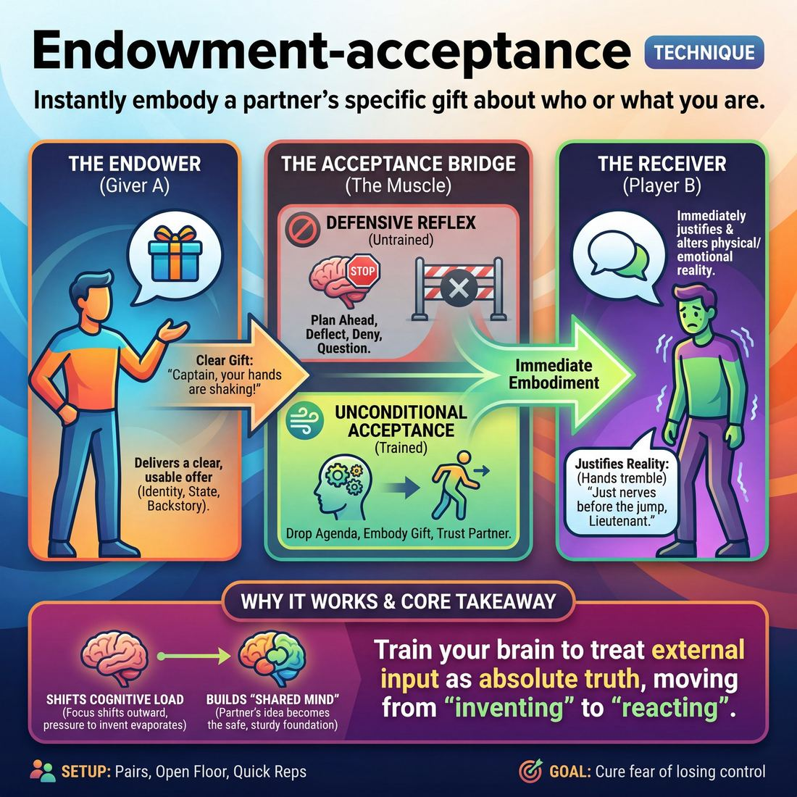

# 🎯 Endowment-acceptance

> *A drillable muscle that trains **Offer Reception**.*

{ .infographic }

## 🎯 The essence

**Endowment-acceptance** is a focused, two-person drill where one player assigns their partner a specific physical trait, emotional state, or backstory (an **endowment**), and the partner immediately embodies and justifies it (the **acceptance**). At its core, this exercise isolates a single, vital muscle: the ability to receive an unexpected offer about *who you are* or *what you are doing*, instantly drop your own preconceived plans, and treat your partner's gift as absolute truth.

## 🎓 What it trains

This technique isolates and strengthens **Offer Reception**. It exists to cure one of the most common afflictions in early improvisation: the fear of losing control. 

When a novice steps on stage, the cognitive load is heavy. To cope, they often plan their character or their next line in advance. When their partner suddenly endows them with something unexpected, that plan is shattered. 

!!! warning "Watch out: The defensive reflex"
    When handed an unexpected endowment, an untrained improviser's reflex is to deflect, deny, or ask questions to buy time. If a partner says, *"Captain, your hands are shaking!"* the improviser clinging to their own agenda might reply, *"I'm not the captain, I'm the janitor,"* or *"They aren't shaking, it's just cold in here."* This destroys the reality the partner was trying to build.

By drilling Endowment-acceptance, improvisers build the muscle memory to override this defensive reflex. It trains them to:

*   **Drop the agenda:** Instantly abandon whatever they were planning to say or do the moment new information is introduced.
*   **Embody the gift:** Move beyond merely saying "yes" to actually letting the endowment alter their physical posture, vocal tone, and emotional state. 
*   **Trust the partner:** Shift from acting *near* someone to operating with a **Shared Mind**. It reinforces the principle that your partner's ideas are a safe, sturdy foundation to build upon.

!!! abstract "Key idea: Unconditional Acceptance"
    This technique operationalizes the "Yes" in "Yes, And." It teaches improvisers that they do not need to invent everything themselves. By fully receiving and wearing the gifts their partner gives them, they make their partner look brilliant and drastically reduce their own pressure to invent. 

Ultimately, this drill moves a player from the novice stage—where the mental load pulls them into planning their own lines—to a competent state where they can confidently build on the specific, nuanced reality their partner has just handed them.

## 💡 Why it works

Endowment-acceptance works because it fundamentally alters where an improviser’s attention is directed. Instead of looking inward to invent a character, an emotion, or a reaction, the improviser must look entirely outward to their partner to discover who they are. 

This technique exploits several powerful cognitive and group dynamics:

*   **Shifting the cognitive load:** When you are endowed, the pressure to invent evaporates. You do not have to decide if you are a grumpy baker, a jealous sibling, or an anxious astronaut—your partner decides for you. Your only job is to *embody* the gift. This frees up immense mental bandwidth, allowing you to focus purely on reacting rather than generating.
*   **Enforcing external focus:** You cannot pre-plan your response if your entire persona depends on the last word of your partner's sentence. This shatters the habit of thinking ahead and forces true, active listening.
*   **Short-circuiting the inner critic:** The technique demands immediate, unhesitating embodiment. By forcing a rapid transition from hearing the offer to playing the offer, it bypasses the brain's natural hesitation, the fear of "getting it wrong," and the ego's urge to negotiate the premise. 

!!! abstract "Key idea: Mutual Surrender"
    At its core, this technique is an exercise in giving up control. Player A surrenders control of *how* their gift will be interpreted and played. Player B surrenders control of *what* their identity or circumstance will be. Neither player can complete the circuit alone.

By repeatedly firing the neural pathway between "hearing a label" and "becoming the label," the improviser trains their brain to treat external input as absolute truth. It transforms the partner's words from mere suggestions into the physical and emotional reality of the scene.

!!! note "Building the Container of Safety"
    Because the receiver is forced to step into the unknown, the giver quickly learns that their endowments must be clear, usable, and supportive. The technique naturally weeds out "gotcha" offers, teaching partners to give gifts that make the other person look brilliant.

## 🧩 The setup

Here is everything you need to arrange before putting this technique into practice. Because Endowment-acceptance is a foundational muscle-builder, the setup should prioritize high repetitions and clear sightlines.

*   **Players & Arrangement:** Pairs are ideal. Have the group form two parallel lines facing each other (an "A" line and a "B" line). This allows the facilitator to easily observe everyone at once and rotate partners quickly by having one line shift down.
*   **Space & Materials:** An open floor. No chairs, blocks, or props are required. The physical space should be clear so players can fully commit to physicalizing their endowments.
*   **Time:** 1–2 minutes per round before swapping roles, for a total of 5–10 minutes. Keep the pace brisk to prevent overthinking. 
*   **Roles:** 
    *   **The Endower (Player A):** Delivers a single, clear line of dialogue that assigns an identity, physical state, or emotional condition to their partner (e.g., *"You look exhausted, Captain."*).
    *   **The Receiver (Player B):** Immediately accepts the endowment, letting it instantly alter their posture, expression, and voice, and responds with a line that justifies the gift.
*   **Prerequisites:** Players should understand the basic definition of an endowment and the core principle of agreement.

!!! tip "On stage: The 'Neutral' Start"
    Ask the Receivers to stand in a completely neutral physical posture before the exercise begins. This creates a blank canvas, making the physical shift upon receiving the endowment much more obvious to both the players and the coach.

!!! quote "How to introduce it"
    "In improv, we often discover who we are through the eyes of our partner. In this drill, we are isolating the muscle of receiving a gift. 
    
    Player A, you are going to look at your partner and deliver one line of dialogue that endows them with a specific trait, emotion, or job. Player B, your only job is to say 'thank you' with your acting. Don't deny it, and don't ask questions. The moment you hear the endowment, let it instantly change your posture, your face, and your voice. Accept the reality they've handed you, and speak your next line from inside that new reality. We'll do three back-and-forths, and then we'll switch roles."

## ⚙️ The mechanics

!!! abstract "Key idea: The Core Objective"
    The engine of this technique is the **Endowment-Acceptance Loop**. It isolates two distinct muscles simultaneously: Player A practices giving a clear, actionable gift, while Player B practices dropping their own agenda to instantly embody that gift.

The standard format for this technique is a rapid-fire, two-person drill restricted to exactly three lines of dialogue. 

### The Flow of Play

**1. The Initiation (Player A)**  
Player A steps forward and delivers a single line of dialogue that assigns a specific trait, role, physical condition, or emotional state to Player B. The endowment must be a statement of fact about the partner.

**2. The Internal Shift (Player B)**  
Before speaking, Player B allows the endowment to land. They instantly drop whatever idea they might have been holding and adopt the physical and emotional reality of the gift. If endowed as a tired old dog, their posture sags before their mouth opens.

**3. The Justification (Player B)**  
Player B responds with a line of dialogue that explicitly confirms the endowment and adds a reason *why* it is true (the **justification**). They do not merely say "Yes, I am"; they prove it through action and context.

**4. The Validation (Player A)**  
Player A delivers a final line that accepts Player B's justification, cementing the newly established reality. The pair then steps back, and the next pair begins.

!!! example "In a scene: The 3-Line Loop"
    **Player A (Endowment):** "Captain, your hands are shaking." *(Endows a title and a physical state)*  
    **Player B (Acceptance & Justification):** *(Looks down at their hands, voice trembling)* "It's the cold, ensign. I haven't been this far north since the war." *(Accepts the physical state, justifies it with backstory)*  
    **Player A (Validation):** "Let me get you a blanket from the lower decks." *(Validates the reality and offers support)*

### Rules & Constraints

To keep the drill focused on the specific muscles of gifting and receiving, enforce the following constraints:

*   **Statements, not questions:** Endowments must be declarative. "You are bleeding" forces an immediate reality; "Are you bleeding?" invites the partner to say no or hesitate.
*   **Specific over vague:** A vague endowment ("You're weird") forces the receiver to do the heavy lifting of figuring out *how* they are weird. A specific endowment ("You're obsessed with my shoes") gives them an immediate, playable action.
*   **No denying or deflecting:** Player B cannot reject the endowment, nor can they accept it but immediately cure it (e.g., "Yes, my hands are shaking, but I just took a pill so I'm fine now"). They must sit in the reality they were given.
*   **Physicality first:** The acceptance must be visible. The audience should see the endowment take effect in Player B's body before they speak.

!!! warning "Watch out: The 'Pimping' Trap"
    There is a fine line between a generous endowment and **pimping** (forcing your partner to do something difficult or embarrassing for a cheap laugh, like *"Wow, you're a great tap dancer, show me!"*). A true endowment gives the partner a character or emotional state to play with, rather than a hoop to jump through.

### How a Round Ends and Resets
In a structured drill, the round resets immediately after Player A's validation line (Line 3). The coach calls "Next," and a new pair steps up. Once everyone has played both roles, the coach can increase the difficulty by narrowing the *type* of endowments allowed (e.g., "Only endow physical ailments" or "Only endow secret desires").

## 🎬 Sample round

!!! example "In a scene: A continuous loop"
    Here is how a pair of improvisers might execute this technique in a dedicated two-person drill, focusing on immediate embodiment and reciprocal gifting. 

    **Player A:** "Happy anniversary, honey. I bought you this solid gold bowling ball."
    
    * **The Endowment:** Player A delivers a clear, specific gift. They establish the relationship ("honey"), the occasion ("anniversary"), and a highly specific, unusual physical object.

    **Player B:** *(Straining to hold the heavy invisible object, smiling tightly)* "Oh, wow. It's... so heavy. Just what I needed for my wrist strength."
    
    * **The Acceptance & Embodiment:** Player B receives the offer. Instead of just saying "thank you," they *physically* take on the weight of the gold and *emotionally* justify the strange gift. They allow the endowment to instantly alter their physical reality.

    **Player B:** "You always buy me expensive things when you're feeling guilty about work."
    
    * **The Return Endowment:** Player B uses their line to give a gift back, endowing Player A with an internal emotional state (guilt) and a historical behavioral pattern. 

    **Player A:** *(Dropping their posture, looking at the floor, voice softening)* "I know. The merger has kept me at the office until midnight every day this week."
    
    * **The Acceptance & Embodiment:** Player A accepts the emotional endowment without hesitation or defense. They let the guilt physically lower their status, and they add a specific detail ("the merger") to build upon the shared reality rather than just agreeing.

    **Player A:** "Here, let me take your coat, you must be freezing."
    
    * **The Next Cycle:** Player A initiates the next loop, endowing Player B with a physical state (freezing) and an item of clothing (a coat), prompting Player B to shiver and react.

## 🎚️ Variations & progressions

To build the muscle of Offer Reception and active gifting, this technique can be scaled from simple, explicit agreements to complex, subtextual scene work. Adjust the constraints based on the ensemble’s comfort and maturity level.

**Level 1: Constrained Categories (Novice)**  
For players who struggle with the cognitive load of inventing offers—often resulting in vague or unusable gifts—restrict the endowments to a single, concrete category. 
*   **The rule:** Occupations only (*"Doctor, the patient is ready"*), or physical states only (*"Let me help you with that heavy cast on your leg"*).
*   **Why it works:** It removes the pressure of infinite choice, allowing the novice to focus entirely on giving a clear endowment and the partner to focus purely on accepting it.

**Level 2: The "Yes, And" Escalation (Advanced Beginner)**  
Once players can give and receive clear endowments when prompted, require the receiver to immediately justify the endowment with a specific detail.
*   **The rule:** Accept the endowment *and* explain why it is true or how it affects you.
*   **Why it works:** It moves the player from merely repeating the partner's words to actively building on them.

**Level 3: Behavioral & Action-Based Endowments (Competent)**  
Ban explicit verbal labels. Player A must endow Player B entirely through physical action, status modulation, and how they treat them. 
*   **The rule:** Instead of saying "You're the Queen," Player A must bow, avert their eyes, and frantically polish the floor. Player B must recognize the high-status treatment and adopt the persona.
*   **Why it works:** This pushes players to choose gifts that ease the partner's job through context rather than exposition, training Competent-level status play.

!!! example "In a scene: Verbal vs. Behavioral"
    *   **Verbal (Easier):** "Wow, you are incredibly angry today, boss."
    *   **Behavioral (Harder):** *Player A flinches when Player B moves, speaks in a hushed, trembling voice, and preemptively apologizes for the coffee being too hot.* Player B feels the fear and naturally adopts the angry, domineering persona.

**Level 4: Blind Endowment (Proficient to Master)**  
Often played as the performance game "Party Quirks." Player B leaves the room, and the group decides on their endowment (e.g., "Thinks they are a werewolf," "Is deeply in love with a lamp"). 
*   **The rule:** Player A must interact with Player B, gifting them so instinctively and clearly through context clues that Player B naturally discovers and adopts the trait without ever being explicitly told.
*   **Why it works:** This is the ultimate test of invisible gifting. It requires the Master-level ability to make every move set the partner up to look brilliant, reading micro-expressions to see if the partner is catching the scent of the offer.

!!! tip "On stage: Ramping Difficulty"
    Don't rush to Level 4. If an exercise breaks down, it is almost always because the endowments have become too vague. Step back to Level 1 or 2 to recalibrate the ensemble's ability to give specific, usable offers before adding the complexity of subtext or blind guessing.

## 🧑‍🏫 Coaching notes

When coaching Endowment-acceptance, your primary goal is to close the gap between the moment an offer is made and the moment it is fully embodied. You are watching for the physical and emotional shift in the receiver, and the clarity of the giver.

!!! tip "On stage: The Golden Cue"
    **"Let it change you immediately!"**  
    This is the single most important side-coach for the receiver. The moment the endowment is spoken, the receiver’s posture, voice, or emotional state should visibly shift *before* they even think of their next line. If they are endowed as a weary detective, their shoulders should drop before they open their mouth.

### Real-time side-coaching phrases

Use these short, punchy prompts while the exercise is in motion to keep players out of their heads:

*   **"Give them something they can use!"** — Use this when the endower is being vague (e.g., "You're weird"). Push them toward concrete, actionable identities or states (e.g., "You're a 19th-century blacksmith").
*   **"Take it physically."** — A reminder for the receiver to embody the gift rather than just talking about it. 
*   **"Don't ask questions, just agree."** — Catch receivers who try to buy time by asking, *"Why do you think I'm a doctor?"* 
*   **"Endow what's already there."** — For players moving toward Competent, coach the endower to notice a micro-expression or accidental posture in their partner and name it as the endowment.

### What 'good' looks and sounds like

As a coach, you know the muscle is being built when you observe the following behaviors:

| Observable Action | What it looks/sounds like | Why it matters |
| :--- | :--- | :--- |
| **The "Yes" Breath** | The receiver takes a visible, relaxed breath the moment they are endowed, rather than stiffening in panic. | Shows they are receiving the offer as a gift, not a threat. |
| **Immediate Justification** | *Endower:* "You're the worst pirate on this ship." *Receiver:* "I get seasick looking at a puddle, captain." | Proves the receiver is actively listening and building on the *specific* offer. |
| **Sustained Eye Contact** | Both players maintain connection during the hand-off of the endowment. | Builds the container of mutual safety required for strong partner work. |

!!! note "Coaching the Endower's Mindset"
    Novice improvisers often treat endowments as a way to force their partner to do all the work (a "trap"). Remind the room that **Active Gifting** means setting your partner up to shine. A great endowment contains enough specific information that the receiver's next line is practically written for them.

## 🧭 Debrief & reflection

After the energy of the drill subsides, the debrief is where the mechanics translate into lasting muscle memory. The goal here is to shift the players' focus from *what* they just did to *how it felt* to give and receive.

Use these targeted questions to guide the room toward key insights:

**For the Receivers (The Endowed)**
*   **"What was your immediate internal reaction the moment you were endowed?"** 
    *   *What it surfaces:* The natural human instinct to hesitate or defend against unexpected information. It helps players recognize the micro-second gap between hearing an offer and fully accepting it.
*   **"Did the endowment make your next choice easier or harder?"**
    *   *What it surfaces:* The realization that a strong, specific gift actually removes the burden of invention. Players often discover that being told who they are is a relief, not a trap.
*   **"How did your body change when you accepted the offer?"**
    *   *What it surfaces:* The physical reality of acceptance. True reception isn't just saying "yes" in your head; it alters posture, voice, and physical center.

**For the Endowers (The Gifters)**
*   **"What made an endowment easy for your partner to accept?"**
    *   *What it surfaces:* The power of specificity. Players will note that vague endowments are hard to play, while concrete, actionable endowments (*"Why are you eating the couch cushions?"*) give the partner an immediate physical action to execute.
*   **"Did you feel you were giving a gift to help your partner, or throwing a curveball to test them?"**
    *   *What it surfaces:* The intention behind Active Gifting. It pushes players to actively choose gifts designed to ease their partner's job rather than just being clever.

!!! abstract "Key idea: The 'Aha' Moment"
    A successful debrief usually culminates in a shared realization: improvisation is vastly easier when you let your partner do half the work. When players truly accept an endowment, they stop acting *at* each other and begin operating with a Shared Mind. 

**For the Ensemble**
*   **"Where did you see someone accept an endowment so fully that it surprised the person who gave it?"**
    *   *What it surfaces:* Positive reinforcement. Highlighting moments where a receiver took a simple endowment and heightened it brilliantly encourages the whole room to commit more deeply in the next round.

## ⚠️ Common pitfalls

!!! warning "Watch out: The Intellectual Acceptance"
    The single biggest mistake in this technique is accepting the endowment with your words, but rejecting it with your body. If your partner says, *"You're furious about the parking ticket,"* and you calmly reply, *"Yes, I am furious,"* you have intellectually accepted the offer but practically dropped it. True acceptance requires an immediate, observable behavioral shift.

When practicing Endowment-acceptance, the mechanics are simple, but the execution frequently breaks down under the pressure of performance. Here are the most common traps and how to fix them:

*   **The Cognitive Overload Freeze**
    *   **The Trap:** Novices often freeze when endowed because they immediately try to plan their next line to "prove" they accepted the gift. This cognitive load pulls them out of the present moment and into their own heads, causing a delay that kills the scene's momentum.
    *   **The Fix:** React physically first. Let your body take the gift before your brain tries to write dialogue. A gasp, a slump, a sudden smile, or a change in posture buys you time, demonstrates immediate acceptance, and often tells you what your next line should be.

*   **The Vague or Unplayable Gift**
    *   **The Trap:** The endower tries to be overly clever or abstract, offering something like, *"You are the concept of existential dread,"* or *"You are a guy who likes sandwiches, but only on Tuesdays."* This leaves the receiver with nothing concrete to act on.
    *   **The Fix:** Endow with playable, observable traits. Give gifts of emotion, physical state, or clear relationship (e.g., *"You're my overly-critical mother,"* or *"Your shoes are glued to the floor"*). A good gift eases the partner's job; it doesn't give them a riddle to solve.

*   **The Deflection (Joking the Gift Away)**
    *   **The Trap:** When handed a high-stakes, emotional, or unusual endowment, a player might feel vulnerable. To protect themselves, they deflect by making a joke *about* the endowment rather than stepping *into* it. 
    *   **The Fix:** Lean into the vulnerability. Treat the endowment as the most important truth in the room, not a punchline to be swatted away. Trust that your partner's gift is a safe container for you to play within.

*   **The "Yes, But..." Pivot**
    *   **The Trap:** The receiver accepts the endowment for a fleeting second, then immediately changes the subject to an idea they had before the scene started. (*"Yes, my shoes are glued to the floor, but look at this spaceship!"*)
    *   **The Fix:** Sit in the gift. Challenge yourself to make your next three lines of dialogue entirely about the endowment you just received before adding any new information to the scene.

## 🌟 What mastery looks like

When improvisers reach the highest level of this technique, the friction between the offer and the reaction completely disappears. It no longer looks like one person throwing a concept at another; it looks like two people simultaneously discovering a shared reality. 

Here is what you will observe when Endowment-acceptance is performed masterfully:

*   **Micro-calibrated gifting:** The endower doesn't just invent a random trait out of thin air. They read their partner's breath, posture, and micro-expressions, offering an endowment that justifies what the partner is *already* doing. The gifting becomes invisible because it feels inevitable.
*   **Cellular acceptance:** The receiver doesn't pause to process the information or merely agree with words. The endowment hits them physically. If endowed as a weary king, their shoulders instantly drop, their voice deepens, and their worldview shifts before they even speak.
*   **Mutual brilliance:** The receiver treats the endowment as the greatest gift they could have received, committing so fully that the endower looks like a genius for suggesting it. In return, the endower's offer was designed specifically to set the receiver up to shine.
*   **Fluid status shifts:** If the endowment alters the power dynamic (e.g., *"I've always admired your authority, Doctor"*), the status adjustment is immediate, purposeful, and entirely natural to the relationship, without any awkward jockeying for control.

!!! example "In a scene"
    **Player A** *(noticing Player B is breathing slightly shallowly and holding their hands close to their chest)*: "I know it's your first time defusing a bomb, rookie, but you have to stop shaking."
    
    **Player B** *(instantly amplifying the physical tremor, eyes widening, voice cracking)*: "I'm not shaking at the bomb, Captain, I'm shaking because you gave me the red wire cutters instead of the blue ones!"

    *Why this is mastery:* Player A didn't invent a random endowment; they endowed Player B's *actual physical state* (shallow breath, tight hands). Player B didn't just accept the label of "rookie defusing a bomb"; they instantly embodied the panic and heightened the stakes, making Player A's observation the perfect catalyst for the scene.

At the master level, the exercise transcends a simple "call and response" drill. It becomes a seamless display of profound empathy, where both players model such total safety and trust that absolute risk-taking feels effortless.

## 🔗 Why it matters

At its core, Endowment-acceptance is the ultimate stress test for Offer Reception. It proves that an improviser hasn't just heard the words their partner said, but has actually allowed those words to alter their reality. In improv, receiving an offer is not a passive, auditory event—it is a behavioral shift. When you accept an endowment, you are demonstrating to your partner, the audience, and yourself that the offer has truly landed.

This technique is the fastest route to achieving a true Shared Mind. 

!!! abstract "Key idea: The Trust Engine"
    When you instantly adopt the posture, attitude, or history your partner just handed you, you send a powerful signal to them: *Your ideas are safe with me. I will make them real.* This mutual validation is the bedrock of psychological safety on stage. When players know their endowments will be accepted, they take bigger, more joyful risks.

In the wider craft of improvisation, mastering this muscle solves several chronic problems:

*   **It cures "inventor's block":** Improvisers often freeze because they feel the burden to create a character or premise from thin air. This technique proves you don't have to invent anything; you just have to wear the clothes your partner gives you.
*   **It accelerates relationship building:** Scenes stall when players politely negotiate who they are to each other. By immediately accepting an endowment, the relationship, history, and dynamic are established in seconds.
*   **It kills the ego:** To accept an endowment is to surrender your own preconceived plan for the scene. It forces you out of your head and into the present moment, reacting to what is *actually* happening rather than what you *hoped* would happen.

Ultimately, the muscle of Endowment-acceptance transforms improvisation from a tug-of-war of competing ideas into a collaborative act of mutual discovery. It is the mechanism by which we let our partners write our story, trusting that we will get to write theirs in return.

## 📚 References & Further Reading

### Foundational sources
*   **Keith Johnstone, *Impro for Storytellers* (1999)** — Johnstone codified the term "endowment" in the modern improv lexicon. In this follow-up to his seminal *Impro* (1979), he dedicates specific sections and games to the mechanics of assigning traits to scene partners. Johnstone writes extensively about the improviser's natural "defensive reflex" (which he terms "blocking") and uses endowment games to force players out of their preconceived safety zones, demanding that they accept external realities instantly rather than negotiating the premise. — [Faber & Faber]{.ref}
*   **Viola Spolin, *Improvisation for the Theater* (1963)** — Widely considered the "mother of modern improvisation," Spolin's foundational text introduces the concepts of "yielding" to the partner and group agreement. Her theater games rely on a "Point of Concentration"—a specific external focus that distracts the conscious mind. In Endowment-acceptance, the partner's offer *is* the point of concentration, which cures the "approval/disapproval paradigm" (the inner critic) and trains the exact muscle of dropping one's own agenda to serve the shared reality. — [Northwestern University Press]{.ref}

### Practitioner guides & manuals
*   **Matt Besser, Ian Roberts, Matt Walsh, *The Upright Citizens Brigade Comedy Improvisation Manual* (2013)** — The UCB manual explicitly details "character endowments" as a vital structural tool for scene work. It explains how assigning specific traits, physicalities, or backstories early in a scene enriches roles and drastically shifts the cognitive load. By teaching improvisers to endow each other, the UCB method allows the receiving player to stop inventing from scratch and simply react from within the newly provided reality, operationalizing the "Yes" in "Yes, And." — [UCB Store]{.ref}
*   **Charna Halpern, Del Close, Kim "Howard" Johnson, *Truth in Comedy: The Manual of Improvisation* (1994)** — This book introduces the core Chicago long-form tenet of "making your partner look good" and the pursuit of a "Group Mind." This philosophy is the engine behind Endowment-acceptance: by fully, unconditionally, and physically embodying the gift your partner gives you, you validate their choice. It reinforces the idea that you do not need to be the sole author of your brilliance; trusting your partner's endowments builds a sturdy container of mutual safety. — [Meriwether Publishing]{.ref}
*   **Mick Napier, *Improvise: Scene from the Inside Out* (2004)** — While Napier famously advocates for taking care of yourself first in a scene, his breakdown of the mechanics of *doing something* immediately—physicalizing choices to bypass hesitation—is crucial for this technique. His work helps players struggling with the "defensive reflex" to move beyond merely saying "yes" verbally, pushing them to let the endowment instantly alter their physical posture and vocal tone before their brain has time to object. — [Heinemann]{.ref}

### Research & theory
*   **Charles Limb, *Your Brain on Improv* (2008)** — Dr. Charles Limb's groundbreaking neuroscientific studies placed jazz musicians and freestyle rappers inside an fMRI machine to observe the brain in a state of flow. He found that during spontaneous improvisation, the brain's dorsolateral prefrontal cortex (the area associated with self-monitoring, conscious planning, and the "inner critic") deactivates, while the medial prefrontal cortex activates. Endowment-acceptance is a practical, theatrical drill designed to force this exact neurological shift by overwhelming the brain's ability to pre-plan. — [TED.com]{.ref}

### Communities & adjacent reading
*   **Sanford Meisner, *Sanford Meisner on Acting* (1987)** — The Meisner Technique's famous "Repetition Exercise" is the direct dramatic cousin to the Endowment-acceptance drill. Meisner's exercise forces actors to place 100% of their attention on their partner's behavior and repeat it back, systematically stripping away self-consciousness, pre-planning, and the intellectual agenda. Like Endowment-acceptance, it trains the performer to treat external input from a partner as absolute truth, resulting in a truthful, immediate reaction rather than a manufactured one. — [Penguin Random House]{.ref}

## 💬 Quotes & Anecdotes

!!! quote "— Keith Johnstone, *Impro for Storytellers* (1999)"
    I'd define interaction as 'a shift in balance between two people'. No matter how much the actors leap about, or hang from trapezes, or pluck chickens, unless someone is being altered, it'll still feel as if 'nothing's happening'.

!!! quote "— Charna Halpern, Del Close, and Kim Howard Johnson, *Truth in Comedy* (1994)"
    When you endow, you give another improviser attributes to help flesh out their character. When done well, this is what makes a relationship fly.

!!! quote "— Keith Johnstone, *Impro: Improvisation and the Theatre* (1979)"
    In life, most of us are skilled at suppressing action. All the improvisation teacher has to do is to reverse this skill and he creates very 'gifted' improvisers.

### Where it comes from
The concept of "endowing" objects and environments with imaginary properties was heavily utilized by Viola Spolin in her foundational 1963 book *Improvisation for the Theater*. However, the specific terminology of **endowing a scene partner** with a character trait, status, or emotional state was codified and popularized by Keith Johnstone in his landmark texts *Impro* (1979) and *Impro for Storytellers* (1999). 

Johnstone drew a sharp distinction between a healthy "endowment" (giving your partner a gift they can easily react to and embody) and "pimping" (forcing your partner to do the hard work of inventing or performing something difficult, like suddenly demanding they sing an improvised opera). 

### A telling example

**The classic format: "Party Quirks" / The Endowment Game**
The purest distillation of this concept in performance is the classic short-form improv structure often called *The Endowment Game* (popularized on the television show *Whose Line Is It Anyway?* as "Party Quirks"). 

In this format, one player (the host) leaves the room. The audience and the remaining players assign specific, bizarre endowments to the other characters (e.g., "You are a superhero whose power is hindsight," or "You are a jealous ex-lover who thinks they are a cat"). When the host returns, the endowed players enter the scene one by one. While the game is usually played for laughs as the host tries to guess the quirks, its underlying engine relies entirely on Endowment-acceptance. The entering players must fully embody the bizarre traits they were handed by the audience, letting the external endowments completely alter their physical and emotional behavior.

**Illustrative Scene: The Reflex vs. The Acceptance**
To see why this muscle requires training, consider how an untrained versus a trained improviser handles the exact same endowment.

*The Defensive Reflex (Blocking the Endowment):*
> **Player A:** "Captain, your hands are shaking!"
> **Player B:** "I'm not the captain, I'm the janitor. And it's just cold in here."
*(Player B protects their own preconceived idea of who they are, but destroys the reality Player A offered.)*

*Endowment-Acceptance (Embodying the Gift):*
> **Player A:** "Captain, your hands are shaking!"
> **Player B:** *(Instantly looks at their hands, adopts a rigid, panicked posture)* "It's the caffeine, Lieutenant. If I don't drink five cups a day, the memories of the war come back."
*(Player B drops whatever they were planning, accepts the title of Captain, accepts the physical reality of shaking hands, and justifies it with a new piece of information.)*

## 🧭 Explore the framework

- ⬆️ **Skill it trains:** [Offer Reception](02_S4__offer-reception.md)
- 🎭 **Domain:** [The Partner](02_D__the-partner.md)
- 🔁 **Sibling techniques:** [Yes, And… sentence games](02_S4_T1__yes-and-sentence-games.md)
