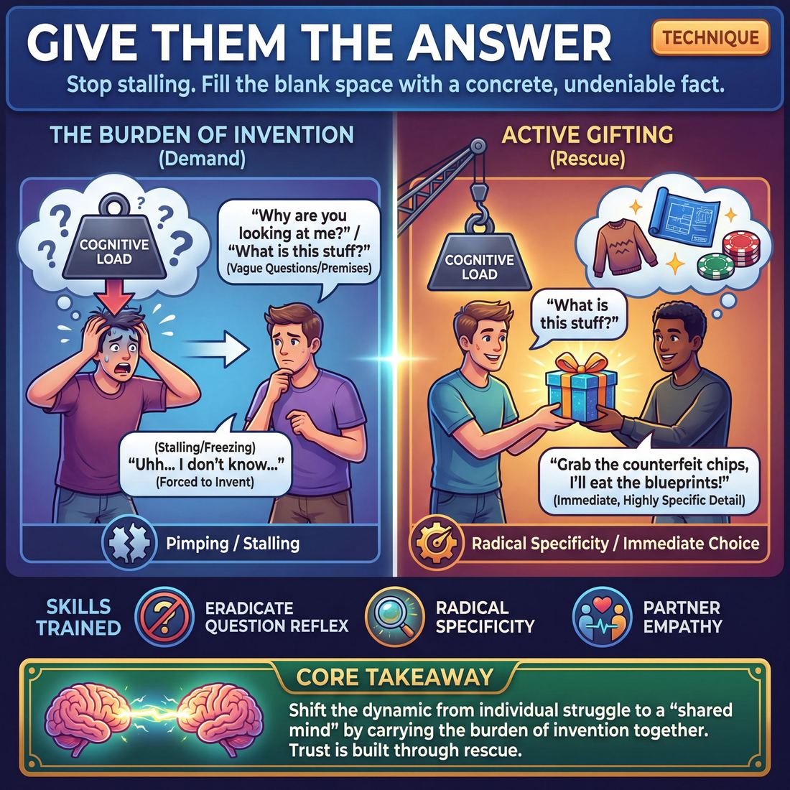

# 🎯 Give them the answer

> *A drillable muscle that trains **Active Gifting**.*

{ .infographic }

## 🎯 The essence

**Give them the answer** is a focused, two-person exercise designed to break the improviser’s habit of stalling, deflecting, or answering a question with another question. In this drill, one player asks an open-ended question or presents a vague premise, and their partner must immediately respond with a highly specific, definitive detail. 

It isolates and trains the muscle of **Active Gifting**—the practice of making bold, concrete choices that relieve a partner's cognitive load. By forcing players to instantly supply the missing information, the exercise trains them to stop making their scene partner do the heavy lifting and instead hand them a concrete, usable reality.

!!! abstract "The Core Takeaway"
    Stop asking your partner to invent the world. When they leave a blank space in the scene, step up and fill it with a specific, undeniable fact.

## 🎓 What it trains

This technique aggressively drills the ability to endow your partner, the environment, or the scene with actionable details. 

At its core, "Give them the answer" exists to solve one of the most pervasive problems in early improvisation: the unequal distribution of mental effort. When improvisers feel panicked or blank, their default defense mechanism is often to ask a question ("What are you doing in here?") or make an empty statement ("I brought the stuff you asked for"). While these moves feel safe to the speaker, they are actually demands. 

!!! abstract "The Burden of Invention"
    Every scene requires foundational information (the *Who*, *What*, and *Where*). When you ask a question or give a vague offer, you hand the "burden of invention" entirely to your partner. Active Gifting is the muscle of carrying that burden yourself.

By practicing this technique, improvisers train several critical sub-skills:

*   **Eradicating the question reflex:** It breaks the habit of using questions as a stalling tactic, forcing players to make immediate, declarative choices.
*   **Radical specificity:** It pushes players past Stage 1 of the maturity progression (giving vague or unusable offers) into Stage 3, where they actively choose gifts that make their partner's job easier. "The stuff" becomes "the stolen blueprints."
*   **Partner empathy:** It builds an acute awareness of when a partner is floundering or trapped in their own head, training the improviser to throw them a specific, undeniable lifeline.

!!! example "In a scene"
    **The Demand (Making them work):** 
    *Player A:* "Why are you looking at me like that?" 
    *(Player B now has to invent a relationship, an emotion, and a justification on the spot.)*
    
    **The Gift (Giving them the answer):** 
    *Player A:* "I know you're furious I shrank your favorite sweater, but staring at me won't un-shrink it."
    *(Player B has been handed an emotion, a conflict, and a history. All they have to do is react.)*

Ultimately, this technique serves the broader domain of **The Partner**. It shifts the dynamic from two individuals acting *near* each other to a "shared mind." When both players are relentlessly focused on giving each other the answers, the fear of not knowing what to say evaporates, replaced by a container of deep mutual safety.

## 💡 Why it works

This technique works by radically shifting the cognitive load from the person who is struggling to the person who is observing. 

When an improviser stalls or looks lost, their brain is usually spinning through a momentary gap in inspiration. The traditional, unhelpful response is to wait for them to figure it out, or worse, to answer their question with another question. "Give them the answer" exploits three powerful dynamics to rescue the moment:

*   **It neutralizes the toxicity of questions:** In improv, questions are often discouraged because they force the partner to invent the reality—a habit known as **pimping**. This technique flips the script. When Partner A asks a question, Partner B immediately provides a highly specific answer, absorbing the work of invention.
*   **It bypasses the "deer in headlights" reflex:** When a player is stuck, the pressure to be creative causes them to freeze. By handing them a concrete fact, you bypass their need to invent and allow them to immediately switch to *reacting*—a much easier, more natural, and more emotionally grounded state.
*   **It accelerates trust:** Trust on stage isn't built by talking about it; it is built by experiencing rescue. When you consistently provide the missing pieces, you prove that your partner does not have to carry the scene alone. 

!!! abstract "The Engine: Shifting the Burden"
    The underlying mechanism is a transfer of responsibility. The improviser who has the most mental bandwidth in any given second (usually the one *not* currently speaking or panicking) takes on 100% of the responsibility for defining the reality of the scene.

!!! example "In a scene"
    **Partner A (panicking):** "Oh no, the boss is coming! What are we going to do with all this... stuff?"
    
    *If Partner B leaves them hanging:* "I don't know, it's your mess!" (Partner A remains burdened and the scene stalls).
    
    *If Partner B gives the answer:* "Grab the counterfeit casino chips, I'll eat the blueprints!" (Partner A is instantly relieved of invention and can just play the physical panic of hiding chips).

By treating every gap, hesitation, or question from your partner as a beautifully wrapped empty box, you stop waiting for them to define the reality and instead hand it to them on a silver platter.

## 🧩 The setup

To prepare the room for this exercise, you need an environment that supports high-speed, high-volume repetition. The goal is to get players out of their heads and into a rhythm of immediate, concrete gifting.

*   **Players & Arrangement:** Pairs. Have the group divide into twos and stand facing each other. For large groups, form two parallel lines facing inward so you can easily rotate partners down the line. 
*   **Space & Materials:** An open floor. No chairs, props, or notebooks. Players should be standing to keep energy and physical readiness high.
*   **Time:** 5–10 minutes total. Run 1–2 minute rapid-fire rounds, then have pairs switch roles. 
*   **Roles:** 
    *   **Player A (The Setup):** Delivers a prompt that demands a specific detail. This is usually a direct question ("What's in the box?", "Who is at the door?") or an open statement ("I can't believe you wore that to a funeral..."). 
    *   **Player B (The Gifter):** Immediately replies with a highly specific, concrete answer ("It's a ticking alarm clock," "It's your ex-husband, Gary"). They must not hesitate, deflect, or answer a question with a question.
*   **Prerequisites:** Players should understand the basic concept of an **offer** (any dialogue or action that establishes reality) and be familiar with **pimping**—because this exercise deliberately *uses* pimping by Player A to aggressively train Player B's response muscle.

!!! tip "How to introduce it"
    "In scenes, we often freeze up when a partner asks us a question. We panic and give a vague answer like 'It's a thing,' or we deflect because we're afraid of making the *wrong* choice. This drill removes that fear through sheer speed. 
    
    Player A, your job is to demand a detail. Player B, your job is to **give them the answer**—instantly, specifically, and confidently. Don't worry about being clever; worry about being concrete. If they ask what's in the bag, don't say 'groceries.' Say 'three bruised grapefruits.' Make your partner's job easy by handing them a heavy, solid gift."

## ⚙️ The mechanics

!!! abstract "The Core Objective"
    To systematically remove the pressure on an improviser to come up with the "who, what, or where" on the spot by pairing every open-ended initiation with a highly specific, usable gift. You are doing the heavy lifting so your partner can simply react.

The engine of this technique is a strict, repeatable dialogue loop. Instead of letting a question hang in the air and waiting for someone to invent a reality, the answering player immediately endows their partner with everything they need to play.

### The Flow of Play

A standard drill runs in pairs, focusing on short, rapid-fire micro-scenes.

1. **The Prompt (The Gap):** Player A initiates the scene with a line of dialogue that creates a gap in the reality. This is often a direct question or an open-ended statement (e.g., *"What are you hiding behind your back?"*).
2. **The Answer (The Gift):** Without pausing or deflecting, Player B immediately delivers a definitive sentence that fills the gap. This is the endowment—a specific detail that defines the reality (e.g., *"It's a rabid badger."*).
3. **The Reaction (The Build):** Player A receives the gift. Because the "what" has already been established, Player A's only job is to react emotionally and justify the answer they were just handed (e.g., *"Put it down, it's foaming at the mouth!"*).
4. **The Reciprocation:** The roles reverse. Player B now delivers a prompt, and Player A provides the answer, continuing the cycle.

### Rules & Constraints

To keep the muscle isolated, enforce these strict boundaries during the drill:

* **The "One-Breath" Rule:** The answering player must deliver their response immediately in one breath, without filler words, stalling, or thinking out loud. 
* **Specifics over categories:** "An animal" is not an answer; "a rabid badger" is. The more specific the answer, the easier the partner's job becomes.
* **No rhetorical questions:** Every question asked must be answered with a concrete fact about the scene's reality, not a philosophical musing.
* **Accept and react:** The receiving partner cannot deny the answer provided. They must treat it as absolute truth and react to it instantly.

!!! tip "On stage"
    While this is drilled as a rigid "Question + Answer" format, the underlying mechanic applies to *any* initiation. You are training the instinct to never leave your partner stranded in a void. If you introduce a mystery, you must also introduce the clue.

### Ending and Resetting the Round

A single round consists of 4 to 6 lines of dialogue total (2 to 3 complete exchanges). Once the pair has successfully completed the loop back and forth, the coach calls "Scene" or "Reset." The current pair clears, and a new pair steps up to begin a fresh scene with a completely new initiation.

## 🎬 Sample round

!!! example "Sample round: The Open Question"
    In this scene, Player A asks a classic open-ended question. Instead of deflecting, Player B uses the technique to immediately establish the reality.

    **Player A:** "Alright, Jenkins. Do you know why I called you into my office?"  
    *(The Prompt: Player A asks a question, unintentionally placing the burden of invention onto their partner.)*

    **Player B:** "Because I replaced the breakroom water cooler with a margarita machine, sir."  
    *(The Gift: Player B doesn't stall or give a vague answer. They **give them the answer** with a highly specific, playable detail that establishes the conflict and their own status.)*

    **Player A:** "Exactly. And while the marketing department is thrilled, HR is currently in a coma."  
    *(The Build: Relieved of the pressure to invent the premise, Player A easily accepts the gift and heightens the reality.)*

!!! example "Sample round: Filling the Blank"
    Here, the technique is used to rescue a partner who is actively searching for an idea, demonstrating Stage 3 Active Gifting (choosing gifts that ease the partner's job).

    **Player A:** *(Staring at a prop map, hesitating)* "If we cross the mountains, we'll end up right in the middle of... uh..."  
    *(The Gap: Player A is stalling, experiencing cognitive overload trying to invent a location.)*

    **Player B:** "...the Goblin King's summer estate. Good eye, Captain."  
    *(The Gift: Player B steps in and **gives them the answer**. Crucially, they don't just provide the noun; they actively endow Player A as the perceptive 'Captain', making them look brilliant.)*

    **Player A:** "Right. The Goblin King's summer estate. We'll need the silver broadswords."  
    *(The Build: Feeling supported and safe, Player A instantly regains their footing and drives the scene forward with confidence.)*

!!! tip "On stage"
    Notice how in both examples, Player B doesn't just provide *any* answer—they provide a **specific** answer. "A margarita machine" is infinitely easier for Player A to react to than "a bad thing." The specificity is what makes the answer a true gift.

## 🎚️ Variations & progressions

To build this muscle, the technique can be scaled from a simple reflex drill to a highly nuanced scene-work tool. By adjusting the constraints, you can guide improvisers from simply overcoming the panic of invention to instinctively setting their partner up to shine.

### Level 1: Building the Reflex (Novice to Advanced Beginner)
At **Stage 1 (Novice)**, improvisers often freeze when asked a question, pulling inward to plan their line. These variations force immediate, unedited responses.

*   **Rapid-Fire Interrogation:** Remove the scene context entirely. Have players stand face-to-face. Player A asks a relentless stream of unconnected questions ("What's in the box?", "Who is at the door?", "Why is the sky green?"). Player B must answer instantly with the first specific noun or reason that comes to mind. 
*   **Fill-in-the-Blank:** Player A provides a sentence with a glaring, deliberate hole, forcing Player B to supply the missing piece. 
    *   *Player A:* "I can't believe you brought a [pause and point] to a wedding!"
    *   *Player B:* "...chainsaw!"

!!! tip "On stage"
    For **Advanced Beginners (Stage 2)**, the goal is simply to give a clear endowment when prompted. Do not worry if the answers are absurd or disjointed; praise the *speed* and *specificity* of the gift.

### Level 2: Adding Context and Character (Competent)
Once the reflex is built, **Stage 3 (Competent)** improvisers must learn to choose gifts that actually ease their partner's job, rather than just throwing random words at them.

*   **The Emotional Anchor:** The answer must provide not just a fact, but a point of view or emotional reaction that defines the relationship.
    *   *Player A:* "Why are you looking at me like that?"
    *   *Player B:* "Because you're wearing my dead husband's tie." *(Gives the answer and the emotional stakes).*
*   **Physicalizing the Answer:** Before speaking, the answering player must perform a physical action or piece of object work that hints at the answer. This trains the brain to use the body as an engine for ideas.

### Level 3: Invisible Gifting (Proficient to Master)
For advanced players, the technique shifts from a drill into a seamless philosophy of play. At **Stage 4 (Proficient)** and **Stage 5 (Master)**, gifting becomes invisible, and every move makes the partner look brilliant.

*   **The Escalating Answer:** The improviser gives the answer, but immediately uses it to raise the stakes, handing a massive, loaded gift *back* to the person who asked the question.
*   **Subtextual Answers:** The answer is given not through direct dialogue, but through a micro-expression, a change in breathing, or a deliberate evasion that speaks volumes.

!!! example "In a scene: The Escalating Answer"
    *Player A:* "Did you secure the perimeter?"  
    *Player B:* "Yes. **(The Answer)** And I locked the blast doors from the inside, so whatever is out there can't get in... but we can't get out. **(The Escalation)**" 
    
    *Player B has completely relieved Player A of the burden of driving the plot forward.*

## 🧑‍🏫 Coaching notes

When coaching this technique, your primary job is to ruthlessly eliminate hesitation and vagueness. Players will naturally want to buy time, deflect, or give half-answers to avoid making the "wrong" choice. You must give them permission to be entirely mundane, provided they are entirely specific. 

!!! tip "Coaching: The Golden Cue"
    **"Name the noun!"**  
    When a player hesitates or gives a vague answer (e.g., "It's that thing we talked about"), immediately side-coach them to name a specific object, person, or place. Specificity is the engine of this technique. A boring, specific answer is infinitely better than a clever, vague one.

### Essential Side-Coaching Phrases
Keep your side-coaching brief, loud, and instructional. Do not stop the scene; inject these cues while they are in motion:

*   **"Answer it right now!"** — *Use when a player pauses to think.*
*   **"Give them a gift, not a chore!"** — *Use when a player answers a question with another question.*
*   **"Commit to the first thought!"** — *Use when you see the "cleverness freeze" (a player rejecting their own ideas in search of a joke).*
*   **"Make a choice!"** — *Use when a player is waffling or hedging their response.*

### Diagnosing and Fixing in the Moment

Use this quick-reference guide to correct common evasive maneuvers on the fly:

| What you hear (The Trap) | The underlying issue | What to side-coach (The Fix) |
| :--- | :--- | :--- |
| *"It's... uh... you know, that thing."* | **Vagueness.** The player is afraid of defining the reality. | *"Name the thing! Give us a specific noun."* |
| *"Why are you asking me?"* | **Deflection.** The player is throwing the burden back to their partner. | *"Answer the question! Don't make them work for it."* |
| *"I don't know."* | **Blocking.** The player is shutting down the offer entirely. | *"Yes you do! Make it up right now."* |
| *(Silence / Deer in headlights)* | **Overthinking.** The player is searching for the "perfect" or funniest answer. | *"First thought! Say the very first word in your head."* |

### What 'Good' Looks Like
You will know the technique is working when you observe two distinct physical shifts on stage. 

First, the answering player will stop looking up at the ceiling for ideas and start making direct eye contact, delivering their answers with unearned confidence. Second, watch the partner who asked the initial question: you should physically see their shoulders drop or their face light up. They are experiencing the relief of being handed a concrete reality to play with. That visible relaxation is the ultimate proof of success.

## 🧭 Debrief & reflection

The goal of debriefing this technique is to help players recognize the physical and mental relief that comes from receiving a definitive choice, and to demystify the pressure of being the one who has to provide it. 

A strong debrief shifts the ensemble’s mindset from "I need to invent a clever answer" to "I need to give my partner something they can use right now."

Use these questions to guide the post-round discussion:

**For the player asking the question (The Receiver):**
*   *“How did it feel in your body when your partner gave you a highly specific answer immediately?”*
*   *“Compare the feeling of getting a vague answer (e.g., ‘It’s a thing’) versus a specific one (e.g., ‘It’s a titanium spatula’). How did your next line change?”*
*   *“Did you feel a sense of relief when you didn't have to invent the reality yourself?”*

**For the player providing the answer (The Giver):**
*   *“When you gave a great answer, where did it come from? Were you planning it, or did you just grab the first word in your head?”*
*   *“Did you feel the urge to be funny, or were you just trying to be factual?”*

**What a good debrief surfaces:**
Players will typically realize that the "best" answers aren't necessarily the funniest or most clever; they are the most **specific and immediate**. The discussion should highlight the leap from a Novice mindset (giving vague offers out of fear) to a Competent mindset (choosing gifts that actively ease the partner's job). 

!!! abstract "The Core Realization"
    Improvisers often ask questions on stage because they are afraid to make a choice, effectively handing their partner a heavy burden. This debrief should illuminate that **giving them the answer** is the ultimate act of taking care of your partner. It transforms a moment of shared panic into a moment of shared discovery.

## ⚠️ Common pitfalls

When improvisers are suddenly put on the spot to provide a definitive fact, the brain’s natural defense mechanisms kick in. Cognitive load spikes, and instead of actively gifting their partner, players often retreat into deeply ingrained safety habits. 

Here is where the technique usually breaks down under pressure, and how to rewire those instincts.

!!! warning "Watch out: The Vague Placeholder"
    **The Trap:** "What's in the box?" is answered with, "It's a surprise!" or "It's exactly what you asked for."  
    **The Cause:** The brain freezes and tries to buy time. To the novice, this feels like an answer, but it is actually an empty box. It leaves the partner with vague, unusable offers.  
    **The Fix:** Coach for **radical specificity**. Force the player to name a concrete, tangible noun. If they give a vague answer, stop them and ask, "Specifically what?" Train them to say, "It's a toaster" or "It's a severed toe."

!!! warning "Watch out: The Boomerang"
    **The Trap:** "Why are we in the basement?" is answered with, "Well, why do *you* think we're here?"  
    **The Cause:** Pure panic. The improviser deflects the responsibility of invention right back to the partner, effectively punishing them for initiating.  
    **The Fix:** Enforce a strict "declarative sentences only" rule during the drill. If a player boomerangs, ring a bell or call "Rewind," and have them replace the question with a definitive statement: "We are hiding from the landlord."

!!! warning "Watch out: The Gag Answer"
    **The Trap:** "Who is at the door?" is answered with, "It's the ghost of Abraham Lincoln!" (in a grounded scene about two plumbers).  
    **The Cause:** The player feels the pressure to be "interesting" or funny, rather than helpful. This breaks the scene's reality and forces the partner to do heavy lifting to justify the absurdity.  
    **The Fix:** Encourage **mundane gifts**. Remind players that a boring, grounded answer ("It's the apprentice") is infinitely more useful than a bizarre one. The humor will emerge from how the characters *react* to the answer, not the cleverness of the answer itself.

!!! warning "Watch out: The Paragraph of Justification"
    **The Trap:** The player gives a good answer, but immediately buries it in five sentences of explanation. "It's the landlord, and he's here because we didn't pay rent last Tuesday when the bank was closed..."  
    **The Cause:** Insecurity. The player doesn't trust that their simple answer is "enough," so they over-explain to justify it, killing the pace and overwhelming the partner.  
    **The Fix:** Constrain the length. Limit the response to a single, short sentence. Deliver the gift, put a period at the end of it, and let the partner react.

## 🌟 What mastery looks like

At the highest level of execution, **Give them the answer** ceases to look like an improv drill and instead looks like a scripted play performed by two people with a rich, shared history. The improviser isn't just filling in a blank; they are actively and seamlessly building the world around their partner's initiation. 

When observing master-level improvisers performing this technique, you will notice several distinct behaviors:

*   **Zero-friction delivery:** There is no "deer in the headlights" pause, no blinking, and no filler words ("um," "well..."). The answer is delivered with the absolute certainty of someone who has known the information their entire life.
*   **Contextual precision:** The answer isn't just a random noun pulled from thin air; it is perfectly calibrated to the emotional tone and physical posture of the partner asking the question. 
*   **Invisible gifting:** As outlined in Stage 5 of the maturity progression, the technique becomes entirely invisible. The answer is so fitting and specific that it makes the *initiator* look brilliant for having asked the question in the first place.

!!! example "In a scene"
    **The Setup:** Player A enters, looking panicked, holding out a closed fist. "What is this? Tell me what this is!"
    
    **Competent (Stage 3):** Player B says, "It's a glowing green rock." *(This is good! It answers the question and gives a specific detail.)*
    
    **Mastery (Stage 5):** Player B drops to their knees and whispers, "It's the last piece of the reactor core, Dr. Evans. You actually found it." *(This is masterful. It answers the question, but also instantly endows Player A with a name, a profession, a status, and high-stakes context. Player A now has a massive playground to work within.)*

Ultimately, mastery of this technique means the improviser has completely bypassed the panic of "getting it right." They trust their first instinct implicitly, allowing them to focus entirely on making their partner's initiation the most important thing in the room. The answer is no longer just a piece of data; it is a profound act of theatrical generosity.

## 🔗 Why it matters

Improvisation often feels like walking a tightrope without a net. When a scene partner asks a question, hesitates, or looks lost, they are wobbling. **Give them the answer** is how you catch them. 

By actively supplying the missing information—a name, a location, a motive, or a relationship—you hand them a fully formed brick to build with. You make their job effortless.

Zooming out to the wider craft, this muscle solves one of the most common scene-killers: the **interrogation scene**. When improvisers trade questions ("What are you doing?" "Why are we here?"), the scene stalls, and the audience's confidence drops. By stepping in and giving the answer ("I'm digging the grave, just like you asked, boss"), you instantly establish the **base reality** (the who, what, and where) and propel the narrative forward.

The ultimate goal of this work is to move from merely acting with someone to achieving a shared mind. When you consistently give your partner the answers they need, you build profound, observable trust. You prove, in real-time, that they do not have to be entirely self-sufficient. If they blank, you will fill the void. 

!!! abstract "The ultimate safety net"
    Improv is a team sport played in the dark. "Give them the answer" is how you turn on the flashlight for your partner. It transforms moments of panic into moments of discovery, proving that the ensemble's collective imagination is always stronger than the individual's.

## 📚 References & Further Reading

### Foundational sources
*   **Keith Johnstone, *Impro for Storytellers* (1999)** — In Chapter 6 ("Making Things Happen"), Johnstone defines the defensive behaviors of "wimping" (refusing to define reality) and "pimping" (forcing your partner to invent it via questions). This technique is the direct, practical antidote to both habits. https://www.keithjohnstone.com/
*   **Charna Halpern, Del Close, and Kim "Howard" Johnson, *Truth in Comedy: The Manual of Improvisation* (1994)** — Contains the foundational improv maxim directly related to the concept of Active Gifting and the burden of invention: "He who gives information is a gift-giver; he who asks questions is a thief." https://www.penguinrandomhouse.com/books/74244/truth-in-comedy-by-charna-halpern/

### Practitioner guides & manuals
*   **Mick Napier, *Improvise: Scene from the Inside Out* (2004)** — Napier aggressively challenges the paralysis caused by overthinking "the rules" of improv. He advocates for the simple, powerful act of "doing something" to establish reality immediately, supporting your partner with power rather than fear. https://www.theannoyance.com/
*   **Matt Besser, Ian Roberts, and Matt Walsh, *The Upright Citizens Brigade Comedy Improvisation Manual* (2013)** — Emphasizes the mechanics of "gift giving" and adding specific information to a scene rather than asking questions. The manual explicitly teaches how making declarative statements relieves the partner's burden of creativity. https://ucbcomedy.com/
*   **Will Hines, *How to Be the Greatest Improviser on Earth* (2016)** — Focuses heavily on making specific, concrete choices and taking the lead in defining reality. Hines breaks down how to be present and make strong choices that support your scene partner without forcing them to do the heavy lifting. https://www.wgimprovschool.com/
*   **Patricia Ryan Madson, *Improv Wisdom: Don't Prepare, Just Show Up* (2005)** — Explores the philosophy of "Noticing the Gifts" and "Acting Now." Madson frames every interaction as an opportunity to provide a concrete offer rather than stalling, shifting the focus from personal panic to partner support. https://www.improvwisdom.com/

### Lineage & teachers
*   **Keith Johnstone & The Loose Moose Theatre Company** — Johnstone's lineage heavily emphasizes narrative progression and eradicating defensive behaviors (like asking questions to stall or avoid commitment). https://www.loosemoose.com/
*   **iO Theater (formerly ImprovOlympic)** — The birthplace of the "questions are a thief" philosophy under Del Close, where players are trained to make declarative statements to build the "shared mind" required for long-form structures like the Harold. https://ioimprov.com/
*   **The Annoyance Theatre** — Founded by Mick Napier, this Chicago school's philosophy centers on taking care of yourself by making strong, immediate choices, which inherently relieves the cognitive burden on your partner. https://www.theannoyance.com/

### Research & theory
*   **Daniel Fuller & Brian Magerko, "Shared mental models in improvisational theatre" (2011)** — This paper from the *Creativity & Cognition* conference explores how improvisers build shared mental models, specifically addressing "cognitive divergence" (when assumptions don't match) and how players use concrete offers to reach consensus. https://dl.acm.org/doi/10.1145/2069618.2069659
*   **Timothy Sayer, "Cognitive load and live coding: a comparison with improvisation using traditional instruments" (2016)** — Explores how pre-encoded units or specific choices lighten the cognitive load during real-time improvisation, mirroring the psychological relief of "giving them the answer" in a theatrical context. https://www.researchgate.net/publication/311448831

### Talks, videos & courses
*   **Will Hines, *Think On Your Feet* (Knowable Audio Course, 2020)** — An audio course featuring Hines and other UCB veterans (like Matt Besser and Chris Gethard) discussing the basics of improv, including the necessity of making choices and avoiding the paralysis of invention. https://knowable.fyi/courses/think-on-your-feet
*   **Peter McGraw's *I'm Not Joking* Podcast, Episode with Will Hines (2019)** — Hines discusses moving beyond the basic "Yes, And" to focus on the mechanics of gifting and making specific choices that actually help a scene partner. https://petermcgraw.org/will-hines-on-how-to-be-the-greatest-improviser-on-earth/

### Communities & adjacent reading
*   **World's Greatest Improv School (WGIS)** — Founded by Will Hines, this online and LA-based community heavily focuses on the mechanics of specific, grounded scene work and active gifting. https://www.wgimprovschool.com/

## 💬 Quotes & Anecdotes

!!! quote "— Tina Fey, *Bossypants* (2011)"
    MAKE STATEMENTS. This is a positive way of saying 'Don't ask questions all the time.' If we're in a scene and I say, 'Who are you? Where are we? What are we doing here? What's in that box?' I'm putting pressure on you to come up with all the answers.

!!! quote "— Matt Besser, Ian Roberts, and Matt Walsh, *The Upright Citizens Brigade Comedy Improvisation Manual* (2013)"
    He who gives information is a gift-giver; he who asks questions is a thief. [...] Instead of providing fellow actors with facts, questions place the burden of invention upon the other players.

!!! quote "— Keith Johnstone, *Impro: Improvisation and the Theatre* (1979)"
    Players who ask questions are usually trying to get the other person to do the work (as when someone is handed a letter, but hands it back, saying, 'You read it! I'm illiterate').

### Where it comes from
The prohibition against asking questions is one of the oldest maxims in modern improvisation, tracing back to Keith Johnstone's development of his Impro system in the 1960s and 70s. Johnstone identified that asking questions was a form of "wimping"—a defense mechanism where a player avoids making a definitive choice by forcing their partner to define the reality. The Upright Citizens Brigade (UCB) later codified this dynamic as the "burden of invention," explicitly teaching that making declarative statements is a form of active gift-giving that relieves the scene partner of doing all the heavy lifting.

### A telling example
In *Impro*, Keith Johnstone illustrates the absurdity of the "question reflex" with a classic scenario: a player is handed a prop letter by their scene partner. Instead of opening it and reading a specific, invented fact (giving the answer), the panicked improviser immediately hands it back and says, "You read it! I'm illiterate." 

By refusing to invent the contents of the letter, the player forces their partner to not only justify the sudden illiteracy but also to read the letter themselves—doubling their cognitive load. The "Give them the answer" technique trains players to do the exact opposite: to open the letter and immediately declare, "It's from the bank. They're foreclosing on the farm," thereby handing their partner a concrete reality to react to.

## 🧭 Explore the framework

- ⬆️ **Skill it trains:** [Active Gifting](02_S5__active-gifting.md)
- 🎭 **Domain:** [The Partner](02_D__the-partner.md)
- 🔁 **Sibling techniques:** [Endowment-gifting drills](02_S5_T1__endowment-gifting-drills.md)
