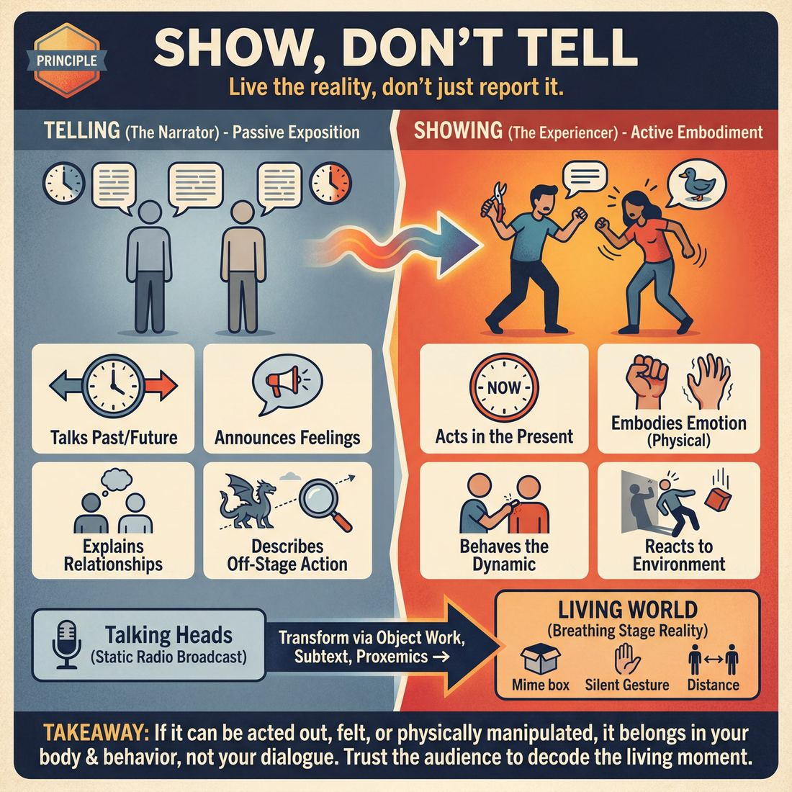

# 💎 Show, Don't Tell

> *Play the reality; never narrate what can be lived.*

{ .infographic }

## 💎 The core belief

At its heart, **Show, Don't Tell** is the conviction that improvisation is a medium of immediate, lived experience rather than a medium of exposition. It is the belief that the audience came to the theater to witness a reality unfold in real time, not to hear a report about a reality happening somewhere else. As improvisers, our job is to embody the moment—to play the truth of the scene through action, emotion, and physical behavior, rather than narrating our feelings, our history, or our environment. 

When we *tell*, we distance ourselves and the audience from the truth of the scene, reducing complex human behavior to a sterile summary. But when we *show*, we trust the audience's intelligence to decode the clues we leave on stage. We believe that a heavy sigh, a clenched jaw, or a meticulously mimed cup of coffee communicates far more about a character's inner life and relationships than a monologue explaining them ever could. This principle demands that we stop talking *about* the scene and start living *in* it.

!!! abstract "The Core Shift"
    If a detail can be acted out, felt, or physically manipulated, it belongs in your body and your behavior—not just your dialogue. You are not a narrator; you are the architect of a living moment.

## 🌱 Why it governs everything

When an improviser truly internalizes "Show, Don't Tell," their entire orientation to the stage transforms. They stop treating the scene as a plot to be explained and start treating it as a reality to be lived. 

The fundamental shift is moving from the role of a **narrator**—someone reporting on events, feelings, or off-stage action—to an **experiencer**, someone living through those events in the present moment. Because improvisation is a theatrical, visual medium, this principle acts as the ultimate filter for every choice a performer makes. It dictates that if something is important enough to talk about, it is important enough to see.

Once a performer holds this value as a core conviction, their default behavior on stage changes dramatically:

| The Narrator (Telling) | The Experiencer (Showing) |
| :--- | :--- |
| **Timeframe:** Talks about the past or the future. | **Timeframe:** Acts entirely in the present moment. |
| **Emotion:** Announces feelings ("I am so angry with you"). | **Emotion:** Embodies feelings (Slams a cabinet, glares, breathes heavily). |
| **Relationship:** Explains the dynamic ("As your mother..."). | **Relationship:** Behaves the dynamic (Picks lint off their scene partner's shirt, speaks with maternal authority). |
| **Action:** Describes off-stage events ("The dragon outside is huge!"). | **Action:** Reacts to the environment ("Get down!" *ducks as a shadow passes over*). |

This principle governs everything because it is the antidote to the most common trap in improv: the **talking heads** scene, where two people stand in a semi-circle and politely discuss a premise. When you believe in showing over telling, you can no longer tolerate standing still and delivering exposition. Holding this value forces you out of your head and into your body, demanding the use of **object work** (pantomiming physical items), stage picture, and emotional behavior to communicate. 

!!! example "In a scene: The shift in action"
    **Telling (The Narrator):** 
    "Remember when we tried to defuse that bomb yesterday? I was so scared we were going to blow up." *(The scene is a memory; the tension is already resolved.)*
    
    **Showing (The Experiencer):** 
    *(Kneeling, hands trembling as they mime holding a pair of wire cutters)* "If I cut the blue wire and my hands are shaking this much... promise you'll feed my cat." *(The scene is happening right now; the audience gets to watch the tension unfold.)*

!!! abstract "The 'Here and Now' Imperative"
    When this principle governs your play, you develop a relentless bias for the **Here and Now**. If a scene partner brings up a fascinating event that happened ten years ago, a performer governed by this value won't just talk about it—they will initiate a **flashback** (jumping back in time) or find a way to recreate that exact dynamic in the current room.

## 👀 How it shows up

When an improviser truly holds the conviction that they must play the reality, the stage transforms from a static radio broadcast into a living, breathing world. While the principle itself is an internal belief, it manifests in highly observable, physical, and structural choices on stage. 

You can watch this conviction evolve as an improviser grows:

| Stage | Observable Behavior | Example |
| :--- | :--- | :--- |
| **Novice** | **Physicalizing basic states.** Replacing descriptive dialogue with physical action. | Shivering and rubbing arms instead of saying, "It's freezing in here." |
| **Intermediate** | **Staging the action.** Using structural edits (like flashbacks) to live the story rather than recount it. | Stepping out to actively play the terrible boss they were just complaining about. |
| **Master** | **Leveraging subtext and space.** Trusting silence, micro-expressions, and physical distance to communicate complex dynamics. | Showing a failing marriage through the meticulous, silent, and separate folding of laundry. |

When a cast operates under this principle, you will consistently see four distinct behaviors:

*   **Active Object Work (Space Work):** Players interact with the invisible environment to establish reality. They don't say, "Look at this heavy box." Instead, they grunt, shift their weight, and let their knees buckle under the imaginary load.
*   **Embodied Emotion:** Feelings are worn in the body, not just spoken. A player doesn't announce, "I am furious with you." Instead, their jaw clenches, their breathing shallows, and their movements become sharp and deliberate.
*   **Relational Proxemics:** Players use the physical distance between them to signal intimacy, status, or tension. A sudden step backward reveals a breach of trust; leaning in reveals a shared secret. The audience *sees* the relationship before a single word is spoken.
*   **Playing the "Now":** Instead of standing center stage recounting a wild party that happened last night, players initiate a scene *at* the party. 

!!! example "In a scene: Raising the stakes"
    Let's look at how applying these behaviors transforms our earlier bomb-defusal premise from a static conversation into a visceral event:

    **Telling:**
    *Player A stands completely still, hands in their pockets.* "I'm so nervous about this bomb defusal. If I cut the wrong wire, we're dead."
    
    **Showing:**
    *Player A is on their knees, sweating, hands trembling as they hold an invisible pair of wire cutters inches from the floor. They take a ragged breath, look up at Player B, and swallow hard.* "Red or blue?"

!!! tip "On stage"
    If you catch yourself delivering a long monologue about a crazy event that happened yesterday, stop talking and start doing. Say, "It was exactly like this..." and physically step into that memory, inviting your scene partner to play it out with you right now.

## 🧪 Living it in practice

To move "Show, Don't Tell" from a theoretical concept to muscle memory, improvisers must shift from a *writer's* mindset (relying on dialogue to explain the scene) to an *actor's* mindset (relying on behavior to live the scene). Internalizing this principle requires deliberate habits that prioritize the physical and emotional over the verbal.

Here are the core mindsets and habits that bring this principle to life:

*   **Action precedes speech:** Train yourself to let your body move before your mouth opens. A sigh, a shift in weight, or a facial expression should telegraph your internal state before you ever articulate it.
*   **Trust the silence:** Words are often used defensively to fill dead air. Embracing silence allows the audience to read the subtext of the moment. 
*   **Grounding in the physical:** Treat the invisible environment as real. When you interact with your surroundings, you anchor the scene in a tangible reality, making explanations unnecessary.

This principle is the animating force behind several foundational improv skills. When you commit to showing, you naturally activate these techniques:

| The Urge to Tell | The Technique to Show | What it looks like on stage |
| :--- | :--- | :--- |
| Explaining an emotion | **Emotional Reaction** | A sharp inhale, a dropped gaze, or a sudden, rigid change in posture. |
| Announcing the location | **Object Work** | Pantomiming the weight of a heavy coffee mug or the heat of a steering wheel. |
| Describing the relationship | **Stage Picture** | Standing uncomfortably close to your partner, or deliberately turning your back to them. |
| Stating the stakes | **Pacing & Silence** | Letting three seconds of dead silence pass after a major accusation before responding. |

!!! example "In a scene: The ultimate wordless shift"
    Taking our bomb scenario to its ultimate, purely physical conclusion:
    
    **Telling:** "I am so nervous about this bomb defusal, my hands are shaking."
    
    **Showing:** The improviser is completely silent. They hold their hands out, trembling violently. They wipe imaginary sweat from their forehead, take a deep, ragged breath, and slowly reach for an invisible wire. The audience feels the danger without a single word being spoken.

### Drills to build the muscle

Because we are so conditioned to use language to solve problems, improvisers must use constraints in rehearsal to strip away the crutch of words. 

!!! tip "Drill: First Line Last"
    Start a scene, but neither player is allowed to speak for the first 30 to 60 seconds. You must establish the **Who** (relationship), **Where** (environment), and **What** (the activity) entirely through physical action, eye contact, and object work. When the first line is finally spoken, it should feel inevitable, resting on a foundation of established reality.

!!! tip "Drill: Gibberish Scenes"
    Play a scene speaking entirely in **Gibberish** (made-up, nonsensical sounds). Because the literal meaning of the words is gone, players are forced to communicate their intent, status, and emotions entirely through tone of voice, physicality, and proximity. 

!!! warning "Watch out: The 'Radio Play' Test"
    If you can close your eyes and understand everything happening in a scene just by listening to the dialogue, you are likely performing a "radio play." You are telling, not showing. A great improv scene should lose critical context if the audience cannot see the actors' bodies.

## ⚖️ Tensions & nuance

While "Show, Don't Tell" is a foundational principle of strong scene work, treating it as an unbreakable law can actually damage a show. The principle must breathe alongside other demands of the craft, such as pacing, stylistic form, and player safety. 

Here is where the rule bends, and how it interacts with other forces on stage:

**1. Pacing and "Skipping the Boring Stuff"**
Showing takes time. If you insist on showing every single step of a journey, the scene will drag. Sometimes, a quick line of exposition—"telling"—is the most efficient way to bypass the mundane and get straight to the interesting interaction. 
*   **Show:** The awkward tension of a first date.
*   **Tell:** The fact that you drove two hours to get to the restaurant. 

**2. The Character Who "Tells"**
There is a profound difference between an *actor* telling the audience what is happening, and a *character* who constantly narrates their own life or over-explains their feelings. If you play a character who says, "I am currently feeling very threatened by your posture," the actor is technically telling, but they are **showing** us a character who is deeply intellectualized, defensive, or socially awkward. The telling *is* the showing.

**3. Stylistic Narration and Form**
Many improv formats rely heavily on **Direct Address** (speaking right to the audience) or a dedicated narrator. In these structures, the division of labor shifts: the narrator's explicit job is to *tell*, which frees up the players in the scene to purely *show*. 

!!! example "In a scene"
    **Narrator (Telling):** "Meanwhile, deep in the hull of the submarine, the pressure was getting to Captain Miller."
    
    **Captain Miller (Showing):** *(Pacing frantically, wiping sweat, snapping at the crew)* "Did I ask for a depth check, Jenkins?! Did I?!"

**4. Safety and Physical Boundaries**
We never "show" actual physical violence, non-consensual touch, or extreme intimacy that violates the safety and boundaries of the players. In these moments, verbal framing, abstraction, or stage-combat techniques take precedence. You might "tell" the audience a character has been stabbed by reacting to the pain verbally, rather than attempting to physically mime a dangerous struggle that puts your scene partner at risk.

### Balancing the Scales

When deciding whether to lean into showing or telling, consider what serves the scene's momentum. 

| Scene Element | When to Show | When to Tell |
| :--- | :--- | :--- |
| **Emotion** | **Always.** Let us see the heartbreak, joy, or rage in your body and choices. | **Rarely.** Saying "I am sad" is almost always weaker than crying or withdrawing. |
| **Environment** | When the physical space directly impacts the relationship (e.g., hiding in a tiny closet). | When establishing a complex setting quickly (**Scene Painting**) to set the mood. |
| **Time** | When playing out the real-time silence and tension of a specific moment. | When executing a time jump ("It's been three years since the accident..."). |

!!! warning "Watch out: Punishing your partner"
    If your scene partner accidentally "tells" instead of "shows" (e.g., they walk on and say, "I am your angry boss!"), do not punish them by pointing it out or blocking the choice. **Make your partner look good** by immediately *showing* the reality they just told you about. Cower in fear, apologize profusely, and justify their anger through your actions.

## 🚫 Common misunderstandings

Because "Show, Don't Tell" is originally a literary maxim adapted for the stage, improvisers often take it too literally or apply it to the wrong elements of a scene. This leads to a few common traps where players restrict themselves unnecessarily.

Here is how the principle is most frequently misinterpreted:

| The Misunderstanding | The Reality |
| :--- | :--- |
| **"Dialogue is 'telling'."** | Dialogue is *action* when it is used to affect your partner. Pleading, attacking, or seducing with words is showing. Dialogue only becomes "telling" when it turns into **exposition** (reporting dry facts or backstory to the audience). |
| **"Showing means elaborate mime."** | Object work is a fantastic way to ground a scene, but *showing* is primarily about emotional embodiment. A silent, devastated stare shows far more than frantically miming the construction of a complex machine while feeling nothing. |
| **"We can never discuss the past."** | You can talk about off-stage or past events, provided the *emotional impact* of that past is happening to your character right now. However, if the past event is more interesting than your current conversation, you should initiate a flashback to *show* it instead. |
| **"Narrators are breaking the rule."** | Direct address or using a dedicated narrator is a valid, stylized format choice. The principle still applies: the narrator may "tell" the setup, but the actors in the scene must still "show" the reality of it. |

!!! example "In a scene: Active Dialogue vs. Exposition"
    It is easy to confuse speaking with "telling." Look at the difference in how these two lines establish the exact same reality:

    **Telling (Exposition):** "As your boss of ten years, I am angry that you are late again to this bakery." 
    *(The actor is reporting facts to the audience.)*
    
    **Showing (Active Dialogue):** "Grab an apron. The croissants are burning and I'm docking your pay." 
    *(The actor is doing something to their partner. The relationship, setting, and emotion are shown through immediate action.)*

!!! warning "Watch out for 'Play-by-Play' narration"
    A subtle form of "telling" happens when improvisers narrate their own physical actions as they do them. Saying, "I am going to pour myself a glass of water, and then I am going to sit down," robs the action of its natural reality. Just pour the water. Let the audience's eyes do the work.

## 🔗 Why it matters

Embracing "Show, Don't Tell" as a foundational principle does more than fix clunky dialogue—it fundamentally alters the DNA of a performance. When an ensemble deeply holds this value, their improv evolves from a clever, talking-head radio play into a visceral, living theatrical event. 

Internalizing this principle transforms three critical aspects of the show:

*   **It activates the audience:** When we narrate our feelings or explain the plot, the audience sits back as passive consumers. When we *show* them—through a slammed door, a trembling hand, or a loaded silence—they lean in. They get to play detective, piecing together the emotional truth. Audiences invest far more in conclusions they reach themselves than in facts they are handed.
*   **It grounds the improviser:** "Telling" traps you in your head, forcing you to act as a playwright frantically typing out the next line of dialogue. "Showing" drops you into your body. You stop inventing the future and start reacting to the physical and emotional reality right in front of you. 
*   **It generates immediate momentum:** Words can stall a scene; action demands a response. If you say, "I am angry at you," your partner can easily deflect with, "I know." If you silently pack a suitcase and throw their picture in the trash, your partner *must* deal with the immediate reality of you leaving.

| Element | When we Tell (The Radio Play) | When we Show (The Theatrical Event) |
| :--- | :--- | :--- |
| **The Audience** | Passive listeners waiting for the next joke | Active interpreters reading subtext and behavior |
| **The Improviser** | Playwright (trapped in the head) | Actor (grounded in the body and environment) |
| **The Pacing** | Stagnant (talking *about* things happening) | Dynamic (things are *actually* happening) |
| **The Stakes** | Intellectualized and easily argued away | Visceral, felt, and undeniable |

!!! abstract "The Ultimate Shift"
    At its core, "Show, Don't Tell" matters because it proves we trust the medium of theater. We don't need to explain the joke, narrate the tragedy, or justify the relationship. By living the reality fully, we trust that our scene partners are observant enough to react, and the audience is smart enough to understand, without anyone needing to hand them a manual.

## 📚 References & Further Reading

### Foundational sources
*   **Viola Spolin, *Improvisation for the Theater* (1963)** — The undisputed bible of space work and physicalizing the environment. Spolin’s theater games were designed specifically to get actors out of their heads and into their bodies, prioritizing experiential doing over intellectual telling. Her exercises are the root of what modern improvisers call "object work," teaching performers to treat invisible objects with real physical weight and consequence.
*   **Keith Johnstone, *Impro: Improvisation and the Theatre* (1979)** — Essential reading on physicalizing status and behaving truthfully in the present moment. Johnstone emphasizes that relationships are shown through physical behavior—who takes up space, who avoids eye contact, who touches whom—rather than through exposition. His work is the antidote to scenes where players simply announce how they feel about each other.
*   **Charna Halpern, Del Close, and Kim "Howard" Johnson, *Truth in Comedy: The Manual of Improvisation* (1994)** — The definitive guide to "playing the reality" of the scene. Close’s philosophy demanded that improvisers treat the stage as a lived environment with real stakes, rather than a platform for delivering jokes or narrating a premise. This book cemented the idea that the truth of a character's behavior is inherently more compelling than a clever line of dialogue.

### Practitioner guides & manuals
*   **Mick Napier, *Improvise: Scene from the Inside Out* (2004)** — Explicitly tackles the dreaded "talking heads" problem. Napier advocates for doing something physical immediately upon entering a scene to ground the performer in action. By initiating with a physical choice or an emotional state rather than a spoken premise, improvisers ensure the scene is driven by behavior rather than just words.
*   **Matt Besser, Ian Roberts, and Matt Walsh, *The Upright Citizens Brigade Comedy Improvisation Manual* (2013)** — Provides concrete mechanics for establishing a "base reality" through active behavior. The manual stresses that improvisers must establish the *where* and *what* physically before the dialogue takes over, ensuring that the audience sees the environment and the characters' relationship to it before any exposition is necessary.
*   **T.J. Jagodowski, David Pasquesi, and Pam Victor, *Improvisation at the Speed of Life: The TJ and Dave Book* (2015)** — A masterclass in trusting silence, playing the subtext, and experiencing the scene as a human being. The authors argue vehemently against inventing plot points to talk about, urging improvisers instead to simply exist, breathe, and react in the "here and now." It is the ultimate guide to moving from a "narrator" mindset to an "experiencer" mindset.

### Lineage & teachers
*   **The Second City & iO Theater (Chicago)** — The historical training grounds where the shift from vaudevillian joke-telling to "playing the reality" was codified. Directors like Del Close pushed ensembles to stop talking about off-stage events and start living the scenes in front of the audience, demanding that if an event was important, it should be shown on stage.
*   **The Annoyance Theatre (Chicago)** — Founded by Mick Napier, this theater is known for pushing improvisers to make strong, immediate physical and emotional choices. Their training emphasizes taking care of yourself first through action and emotion, rather than standing still and politely negotiating a scene's premise with your partner.

### Research & theory
*   **Edward T. Hall, *The Hidden Dimension* (1966)** — The foundational anthropological text on proxemics—the study of how humans use physical space and distance to communicate relationship, intimacy, and status. This research is directly applicable to how improvisers stage scenes, demonstrating how a sudden step backward or a lean forward can show the audience the exact state of a relationship without a single word being spoken.

### Talks, videos & courses
*   **Alex Karpovsky (Director), *Trust Us, This Is All Made Up* (2009)** — A documentary capturing a fully improvised, hour-long set by TJ Jagodowski and David Pasquesi. It serves as a visual masterclass in "Show, Don't Tell," demonstrating how to build an entire world and complex relationships through patient behavior, silence, and meticulous object work, proving that the most compelling moments in improv often contain no dialogue at all.

### Communities & adjacent reading
*   **Sanford Meisner and Dennis Longwell, *Sanford Meisner on Acting* (1987)** — Meisner's core tenet, "the foundation of acting is the reality of doing," perfectly mirrors the improv imperative to show rather than tell. His repetition exercises are designed to force actors to stop thinking about their lines and start reacting truthfully to the physical and emotional behavior of their scene partner, grounding the performance entirely in the present moment.

## 💬 Quotes & Anecdotes

!!! quote "— Viola Spolin, *Improvisation for the Theater* (1963)"
    Interpretation and assumption keep the player from direct communication. This is why we say 'show, don't tell'. Telling is verbally or in some other indirect way indicating what one is doing. This then puts the work upon the audience or the fellow actor, and the student learns nothing. Showing means direct contact and direct communication.

!!! quote "— Charna Halpern, Del Close, and Kim 'Howard' Johnson, *Truth in Comedy* (1994)"
    Too many actors make the error of talking about doing something instead of doing it; a potentially interesting scene gets frittered away because no one is actually doing anything. [...] Scenes are much more interesting when the idea is seen, rather than talked about. Active choices forward the scene. Passive choices keep it stagnant.

!!! quote "— Keith Johnstone, *Theatresports* guidelines"
    Do it, don't talk about it! Every line of dialogue is an offer that drives you to action. Make an offer that says where to go next or what to do and then start doing it. Don't keep talking.

!!! quote "— Matt Besser, Ian Roberts, and Matt Walsh, *The Upright Citizens Brigade Comedy Improvisation Manual* (2013)"
    Show, don't tell. [...] Don't talk about what you are doing.

!!! quote "— Mick Napier, *Improvise: Scene from the Inside Out* (2004)"
    That you do something is far more important than what you do.

### Where it comes from
While "Show, don't tell" is a classic literary and theatrical maxim, Viola Spolin codified it for improvisation in the mid-20th century. She used it to push actors out of their heads and into physical space, arguing that "telling" forces the audience to do the imaginative work, while "showing" creates immediate, lived reality. Later, Del Close and Charna Halpern made it a central pillar of long-form improv to combat the "talking heads" problem—scenes where improvisers stand in a static semi-circle and politely discuss a premise rather than living it. 

### A telling example
**The Off-Stage Dragon**
In *Truth in Comedy*, Charna Halpern and Del Close describe the common pitfall of improvisers discussing off-stage action. If two players stand on stage and talk about a fascinating, terrifying event happening right outside the window, the audience will naturally want to look out the window, not at the improvisers. The fix is simple: stop talking about the event, step outside, and live it. If the action is interesting enough to discuss, it is interesting enough to be shown.

**The "Do Something" Shift**
Director Mick Napier famously observed that improvisers often get so paralyzed by trying to think of the "right" or "smartest" thing to say that they freeze, leading to stagnant, talk-heavy scenes. His foundational advice to combat this is simply to "do something" at the top of a scene. The moment a player initiates a physical action—meticulously pantomiming folding laundry, fixing a watch, or sweeping the floor—the pressure to invent clever dialogue vanishes. The physical reality of the scene takes over, grounding the performers in the present moment and naturally generating behavior over exposition.

## 🧭 Explore the framework

- 🎭 **Domain:** [The Scene](03_D__the-scene.md)
- 🔁 **Other principles here:** [Base Reality First](03_P2__base-reality-first.md), [Start in the Middle](03_P3__start-in-the-middle.md), [Serve the Story](03_P4__serve-the-story.md)
- 🧠 **Skills of this domain:** [Game Identification](03_S1__game-identification.md), [Heightening & Exploration](03_S2__heightening-and-exploration.md), [Narrative Architecture](03_S3__narrative-architecture.md), [Stakes / The 'Want'](03_S4__stakes-the-want.md), [World-Building](03_S5__world-building.md), [Justification](03_S6__justification.md), [Raising the Stakes](03_S7__raising-the-stakes.md)
