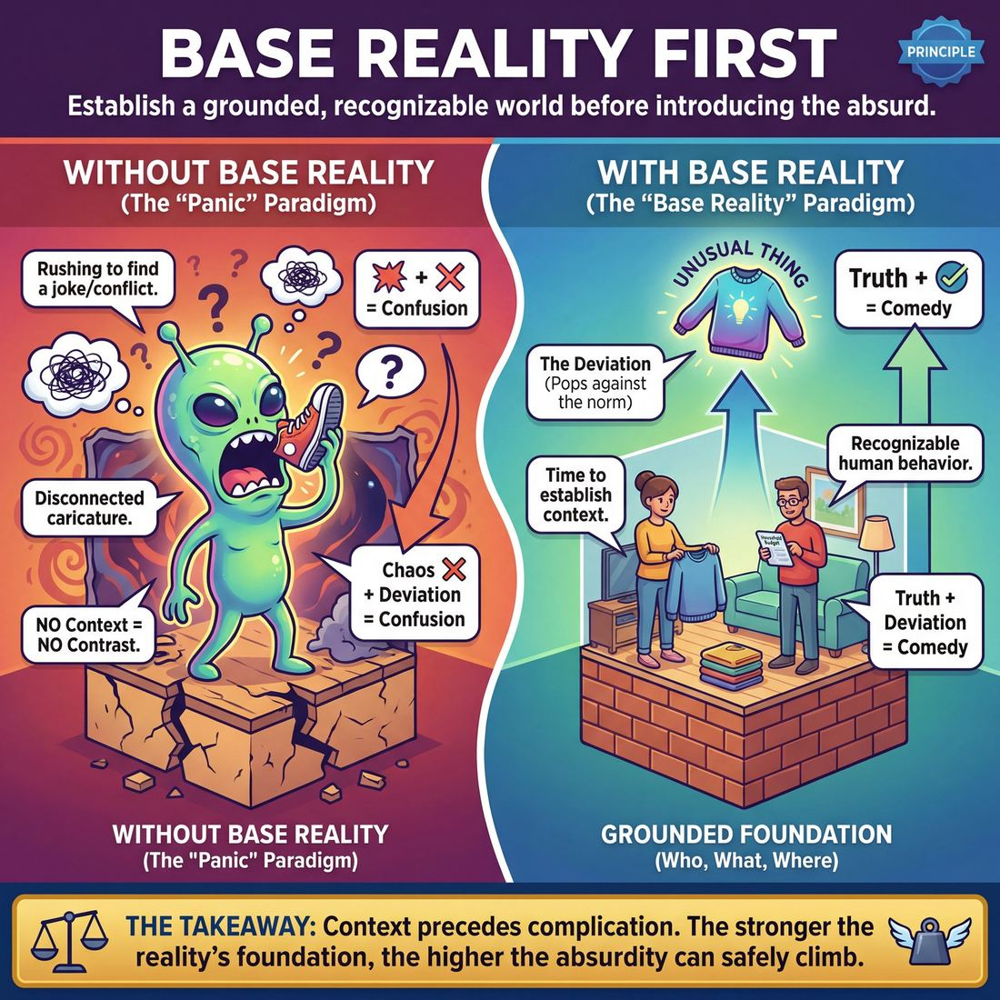

# 💎 Base Reality First

> *Establish the normal world before the unusual element.*

{ .infographic }

## 💎 The core belief

The principle of **Base Reality First** is the conviction that a scene must be grounded in a recognizable, ordinary truth before it can successfully explore the absurd. In improv, the **Base Reality** is the foundational context of the scene—the *Who* (the characters and their relationship), the *What* (what they are doing), and the *Where* (the environment they are in). This principle dictates that improvisers must build and agree upon this solid, relatable foundation *before* introducing the **Unusual Thing** (the first break from normal behavior). It is the fundamental belief that context must precede complication.

We hold this conviction because comedy and compelling narrative both rely entirely on contrast. An unusual element is only recognizable as "unusual" if it disrupts an established norm. If a scene begins in a state of chaos, absurdity, or high conflict without a grounded context, the audience has no baseline to measure the weirdness against—a trap improvisers often call "crazy town." By prioritizing the base reality, improvisers earn the right to be ridiculous. They ensure that when the reality is eventually bent or broken, the audience understands exactly what is being heightened and why it matters.

!!! abstract "The Law of Contrast"
    If everything is crazy, nothing is crazy. The audience needs a baseline of normal human behavior to appreciate the deviation from it. The stronger the foundation of reality, the higher the absurdity can safely climb.

## 🌱 Why it governs everything

When an improviser truly internalizes the principle of Base Reality First, their entire psychological approach to the stage transforms. They stop trying to *invent* comedy and start trusting themselves to *discover* reality. This single value shifts the performer’s primary job from "being funny" to "being truthful," which paradoxically makes the resulting comedy much stronger.

Before holding this conviction, improvisers often view the blank stage as a terrifying void that must be immediately filled with jokes, conflict, or wacky premises. Once they adopt this principle, the void becomes a canvas. They understand that the Unusual Thing has no power unless it disrupts a recognizable, grounded world. 

This internal shift triggers several distinct changes in a performer's behavior:

*   **The death of panic:** The improviser no longer fears the silence at the top of a scene. They comfortably use the first ten to fifteen seconds to engage in object work, establish their environment, and read their partner's body language.
*   **Embracing the mundane:** Rather than reaching for bizarre characters or extreme situations, the performer leans into relatable, everyday scenarios (folding laundry, waiting for a bus, preparing a spreadsheet). They trust that the ordinary is the most effective launchpad for the extraordinary.
*   **Connection over invention:** Because they aren't frantically searching their brain for a clever premise, their attention turns outward. They actually listen to their scene partner and react to the emotional reality of the moment.

| The "Panic" Paradigm | The "Base Reality" Paradigm |
| :--- | :--- |
| Rushing to find a joke, conflict, or gimmick in the first line. | Taking time to establish the *Who, What, and Where* before the "Why." |
| Playing a caricature disconnected from human emotion. | Playing a recognizable human being with a clear point of view. |
| Forcing a pre-planned idea onto the scene partner. | Discovering the scene together through grounded, step-by-step agreement. |

!!! abstract "The Comedy Equation"
    At its core, this principle relies on a simple equation: **Truth + Deviation = Comedy**. If you do not establish the truth (the Base Reality), the deviation (the Unusual Thing) has no contrast. Without a normal world to disrupt, a wacky choice isn't a comedic premise—it's just noise.

!!! example "In a scene"
    An improviser who hasn't internalized this value might sprint on stage yelling, "I am a space alien who eats shoes!"—leaving their partner with nowhere to go. An improviser who values Base Reality First walks on, carefully mimes folding a sweater, sighs, and says, "I think we need to talk about our household budget." The alien might still show up later, but now it has a grounded, relatable world to completely upend.

## 👀 How it shows up

Because a principle is an internal belief, we can only measure it by the behaviors it produces. When an improviser truly believes that the normal world must exist before the unusual element can thrive, it fundamentally changes the pacing and physicality of their scenes. You can observe this conviction in the first thirty seconds of their work: they do not panic, they do not rush to be funny, and they treat the stage as a real, lived-in space. 

Here is how a commitment to Base Reality First manifests on stage across different levels of experience:

| Stage | Observable Behavior | The Result on Stage |
| :--- | :--- | :--- |
| **Novice** | **Verbal exposition dumping.** The improviser knows they need a base reality, so they state it aloud awkwardly: *"Hello, my brother, here we are in the kitchen baking a cake for mom."* | The reality is established, but it feels artificial and heavy. The scene starts to feel like a chore. |
| **Intermediate** | **The slice-of-life delay.** The improviser patiently builds the *Who, What, and Where*, but becomes so focused on the normal world that they forget to introduce an unusual element. | The scene is highly grounded and believable, but often drags or lacks a comedic engine. |
| **Master** | **Instant, economical grounding.** The improviser establishes the world through posture, precise object work, and a single line of dialogue. They live in the normal world just long enough to anchor it, then seamlessly allow the unusual to emerge. | The audience instantly understands the context. When the weird thing happens, it pops brilliantly against a believable backdrop. |

Beyond the progression of skill, improvisers who hold this principle share several distinct, observable habits:

*   **Patience at the top:** They are comfortable with silence. They will often start a scene with eye contact, a sigh, or a physical action before speaking their first line. They trust that the scene has already begun even if no one is talking.
*   **Commitment to the mundane:** They endow the space with specific, ordinary details. They don't just "fix a car"; they ask for a 5/8ths wrench to tighten the alternator belt. These grounded specifics act as the concrete foundation for the absurdity to come.
*   **Proportional reactions:** Before the unusual thing is introduced, they react to their partner with genuine, recognizable human emotion. If their partner drops a prop plate, they react with mild annoyance, not screaming terror. 

!!! example "In a scene: The difference it makes"
    **Without the principle (Rushed):** 
    Player A runs on stage, waving their arms: *"Ahhh! The aliens are attacking the grocery store!"* 
    Player B: *"Quick, throw the cabbages at them!"* 
    *(The scene is instantly chaotic, but the audience has no reason to care about these people or this store.)*

    **With the principle (Base Reality First):**
    Player A is meticulously arranging invisible items on a shelf, humming quietly. 
    Player B walks in, wearing an invisible apron, and sighs: *"Corporate says we have to move the organic cabbages to aisle four."* 
    Player A: *"Again? I just got the display looking perfect."* 
    *(They have established they are coworkers at a grocery store. Now, when the alien tentacle crashes through the window, the audience cares about the ruined cabbage display.)*

## 🧪 Living it in practice

Internalizing this principle requires rewiring your improviser brain to value patience over immediate laughter. When you truly believe in establishing the base reality first, your approach to the top of a scene shifts from "What is the joke?" to "Where are we, and what are we doing?"

Here is how to turn that belief into muscle memory.

### Mindsets to adopt
*   **The "Slice of Life" assumption:** Assume every scene begins on a completely normal Tuesday. You are real people having a real day. The unusual element will find you; you do not need to force it in the first ten seconds.
*   **Specificity is the foundation:** Generalities (e.g., "Look at this thing") delay the base reality. Specifics (e.g., "Hand me that Phillips-head screwdriver") instantly build the floor you are standing on.
*   **Silence is a tool, not a void:** You do not need to speak immediately. Taking time to establish the physical space grounds the scene before a single word is uttered.

### Habits to build

| The Panic Instinct | The Base Reality Habit |
| :--- | :--- |
| **Talking immediately** to fill the silence. | **Starting with object work** (miming physical objects) to establish the *Where* and *What*. |
| **Vague agreement** ("Yes, let's do it"). | **Specific labeling** ("Yes, let's finally paint this nursery yellow"). |
| **Inventing a wacky character** instantly. | **Grounding an emotional state** (e.g., starting with a genuine sigh of exhaustion). |
| **Asking questions** ("What are we doing?"). | **Making declarative statements** ("I love sorting these tax receipts with you"). |

!!! tip "On stage: The 15-Second Rule"
    If you struggle with rushing, challenge yourself to spend the first 15 seconds of a scene doing silent, focused **object work**. Feel the weight of the objects, establish the dimensions of the room, and let your scene partner join you in that physical reality before anyone speaks. 

### Drills for the rehearsal room

To train this principle, use drills that artificially constrain the scene, forcing players to focus entirely on the foundation.

*   **First Three Lines:** Two players step out and deliver exactly three lines of dialogue total (Player A, Player B, Player A). The coach calls "Scene!" and asks the rest of the team to identify the *Who* (relationship), *What* (activity), and *Where* (location). If the team cannot answer all three, the players restart and try to be more specific.
*   **The Mundane Two Minutes:** Players are tasked with improvising a scene for two full minutes where *absolutely nothing unusual happens*. They must fold laundry, fix a tire, or eat dinner while discussing something entirely ordinary. This builds tolerance for "boring" truth and cures the itch to invent conflict too early.

### The skills this principle animates
When you hold "Base Reality First" as a core value, it naturally breathes life into specific technical skills:
*   **Endowment:** You will naturally start giving your partner specific traits and history ("You've always been the best mechanic in town, Sarah") to lock in the *Who*.
*   **Environment work:** You will treat the invisible stage as a real, three-dimensional space, because the *Where* matters to you.
*   **Active Listening:** Because you aren't busy inventing a crazy premise in your head, you can actually listen to your partner's first line and build upon the reality they just offered.

## ⚖️ Tensions & nuance

While establishing the base reality first is a foundational principle, adhering to it rigidly without reading the room can lead to overly cautious, plodding scenes. The principle must be balanced against the live, unpredictable nature of improvisation, creating a few natural tensions.

**1. The Premise Initiation (When the unusual happens first)**
Sometimes, a partner walks on stage and immediately drops a bizarre, highly unusual initiation—often called a **premise initiation** (starting a scene with the comedic idea already stated). You cannot rewind time to establish a normal base reality first. 

When this happens, the principle of "Base Reality First" is overridden by the rule of agreement ("Yes, And"), but you must immediately apply the principle in reverse through **backfilling**. Backfilling means accepting the unusual element, but instantly establishing the *Who, What, and Where* around it to ground the absurdity.

!!! example "In a scene"
    **Player A (Initiating with the unusual):** "I've replaced all your teeth with tiny piano keys!"  
    **Player B (Backfilling the base reality):** "Dr. Evans, I just came in for a routine cleaning..."  
    
    Player B accepts the crazy premise but instantly provides the base reality (a dentist's office, a doctor/patient relationship) so the scene has a solid floor to stand on.

**2. "Normal" does not mean "Mundane"**
A common trap is assuming a base reality must be two people folding laundry or drinking coffee. Base reality simply means the *status quo of the world you are in*. It is the baseline of expectations for *that specific environment*, no matter how fantastical.

!!! tip "On stage"
    If you are two astronauts on a spaceship under alien attack, the base reality is high-stakes and chaotic, but it is still the *baseline* for that scene. The unusual element isn't the lasers; the unusual element is one astronaut ignoring the battle to complain about the spaceship's Wi-Fi.

**3. Patience vs. Stalling**
There is a fine line between taking the time to build a rich base reality and simply refusing to let anything happen. 

| Approach | Characteristics | Result |
| :--- | :--- | :--- |
| **Patient Base Reality** | Making active choices about the environment, establishing a clear relationship, and reacting authentically to your partner. | Sets a sturdy launchpad; the unusual element hits hard when it arrives. |
| **Stalling** | Talking about the weather, asking empty questions ("What are you doing?"), or actively ignoring unusual offers to keep things "normal." | Bores the audience and frustrates your scene partner; the scene feels stuck in mud. |

The goal of the principle is never to delay the comedy, but to ensure the comedy has a context that makes it actually funny.

## 🚫 Common misunderstandings

Because "Base Reality First" is often taught as a foundational rule to beginners, it frequently gets flattened into rigid, unhelpful dogma. When improvisers misinterpret what "establishing the normal world" actually requires, scenes grind to a halt. 

Here are the most common ways this principle is misunderstood, and how to correct them:

| The Misunderstanding | The Correction |
| :--- | :--- |
| **"Base reality means boring."** | "Normal" is relative to the scene. As with our astronauts above, defusing a space-bomb is a valid base reality. It just means establishing the baseline rules of *that specific world* before introducing the comedic twist. |
| **"It takes a long time to build."** | Base reality can be established in two lines of dialogue and a strong physical action. It is about *clarity*, not duration. |
| **"Characters must be emotionally neutral."** | Emotion grounds the reality. If you are at a funeral, grief is the base reality. If you are on a first date, nervousness is the base reality. Starting neutral actually makes the scene feel *less* real. |
| **"You can't start with high action."** | You can absolutely start **in media res** (in the middle of the action). The action itself is the base reality, provided the audience understands *what* is happening before the unusual thing occurs. |

!!! warning "The 'Chit-Chat' Trap"
    Many newer improvisers confuse "establishing the normal world" with making small talk. They will spend two minutes folding imaginary laundry while talking about the weather, waiting for an unusual thing to magically appear. Base reality should be grounded, but it must still be *specific* and *active*. 

!!! example "In a scene: Fast vs. Slow Base Reality"
    **Slow (The Misunderstanding):**  
    *Player A:* "Sure is a nice day."  
    *Player B:* "Yep. Good day to be at the park."  
    *(They sit on a bench for a minute, waiting for a premise).*  

    **Fast (The Correction):**  
    *Player A:* (Panting, looking through binoculars) "The target is on the move. Do you have the shot?"  
    *Player B:* (Squinting through an imaginary rifle scope) "Wind is blowing east. Give me two seconds."  
    *(Base reality is instantly established: Snipers on a mission. The scene is immediately ready for the unusual element).*

Ultimately, the principle is not a mandate to delay the fun. It is a mandate to build a solid floor so that when you finally jump, you have something to push off against.

## 🔗 Why it matters

Holding **Base Reality First** as a core conviction transforms an improv show from a frantic scramble for laughs into a confident piece of spontaneous theater. When an entire cast shares this value, it fundamentally changes the texture of the performance in three vital ways:

* **It earns the audience's trust.** When improvisers take the time to establish a grounded, recognizable world, the audience relaxes. They realize they don't have to brace for random, disjointed chaos. Because they understand *where* they are and *who* the characters are, they can emotionally invest in the scene. The laughs that follow are earned, not cheap.
* **It provides a canvas for comedy.** As the Law of Contrast dictates, comedy thrives on disruption. By building a solid, mundane foundation, the eventual unusual thing (the comedic premise or "game" of the scene) stands out in sharp relief. 
* **It makes scenes sustainable.** Frantically inventing new, wacky ideas every ten seconds is exhausting and usually leads to scenes burning out in under a minute. A strong base reality gives performers a grounded world to return to. When you don't know what to do next, you can simply engage with your physical environment or your relationship, rather than panicking to invent another joke.

!!! tip "The 'Tie-Dye' Rule"
    Think of the comedic unusual element as a bright red dot. If you paint a red dot on a blank white canvas (a strong, grounded base reality), everyone in the theater sees it instantly. If you paint a red dot on a chaotic, swirling tie-dye shirt (a scene with no base reality and constant wacky inventions), it becomes completely invisible. Ground the world so the weirdness can shine.

Ultimately, a troupe that deeply values the base reality stops playing *at* the audience and starts playing *for* each other. The pressure to be instantly hilarious vanishes, replaced by the much easier, much more rewarding task of being truthful. When the foundation is real, the comedy takes care of itself.

## 📚 References & Further Reading

### Foundational sources
*   **Matt Besser, Ian Roberts, Matt Walsh, *The Upright Citizens Brigade Comedy Improvisation Manual* (2013)** — The definitive text that codified the specific terms "Base Reality" and "The Unusual Thing." This manual provides the most rigorous breakdown of why a scene must establish the *Who, What, and Where* before introducing a comedic premise, arguing that the "Game of the Scene" cannot exist without a grounded, relatable context to contrast against.
*   **Charna Halpern, Del Close, Kim "Howard" Johnson, *Truth in Comedy: The Manual of Improvisation* (1994)** — The foundational text on playing truth and grounded reality before reaching for jokes. It shifted modern long-form improv away from gag-based short form by arguing that the best comedy comes from recognizable human behavior and genuine relationships rather than forced wackiness.

### Practitioner guides & manuals
*   **Will Hines, *How to Be the Greatest Improviser on Earth* (2016)** — A practical guide by a longtime UCB teacher that heavily emphasizes the importance of being normal, present, and establishing a grounded reality before getting weird. Hines dedicates significant portions of the book to the "slice of life" approach, teaching improvisers how to comfortably exist in the mundane before introducing conflict or absurdity.
*   **Mick Napier, *Improvise: Scene from the Inside Out* (2004)** — While Napier famously challenges many rigid improv rules, he focuses heavily on the mechanics of the first few lines of a scene. He emphasizes the necessity of establishing context and grounding the reality immediately, arguing that improvisers must make a definitive choice about their environment and character to give the scene a solid foundation.

### Lineage & teachers
*   **Upright Citizens Brigade (UCB)** — The theater and training center that explicitly coined and popularized the "Base Reality" terminology. Their entire curriculum is built around the philosophy that the "Game" (the comedic engine) is found by introducing a single unusual element into an otherwise completely normal, recognizable world.
*   **iO Theater (formerly ImprovOlympic)** — The Chicago institution founded by Del Close and Charna Halpern that pioneered the "truth in comedy" philosophy. They taught generations of improvisers to react as real people in real situations, establishing the baseline of human truth that makes absurdity work.

### Research & theory
*   **Jerry Suls, "Cognitive Processes in Humor Appreciation" in *Handbook of Humor Research* (1983)** — A psychological study exploring the incongruity-resolution model of humor. Suls's research explains why a cognitive baseline (the setup, or "Base Reality") is strictly required before an incongruity (the punchline, or "Unusual Thing") can be processed by the brain as funny, perfectly mirroring the improv Law of Contrast.
*   **Christopher Vogler, *The Writer's Journey: Mythic Structure for Writers* (1992)** — A seminal text on narrative structure based on Joseph Campbell's monomyth. Vogler details the absolute necessity of establishing the "Ordinary World" before the inciting incident occurs, providing a screenwriting parallel to the improv concept of building the Base Reality before breaking it.

### Talks, videos & courses
*   **Will Hines, *Think On Your Feet* (2020)** — An audio course featuring interviews with UCB veterans (including Matt Besser and Chris Gethard) discussing improv basics. The course delves into the mechanics of establishing reality, avoiding panic at the top of a scene, and trusting the mundane.
*   **Matt Besser, *Improv4Humans* *(unverified)*** — A long-running podcast where UCB co-founder Matt Besser performs scenes with top improvisers. He frequently stops the action to dissect the mechanics of the scene, often lecturing on the importance of base reality, grounding the environment, and justifying unusual behavior within a realistic context.

### Communities & adjacent reading
*   **Konstantin Stanislavski, *An Actor Prepares* (1936)** — The foundational acting text on "Given Circumstances." Stanislavski's insistence that actors must fully understand and inhabit the specific, ordinary details of their environment and relationships directly parallels the improv concept of establishing the *Who, What, and Where* to ground a performance in truth.
*   **Viola Spolin, *Improvisation for the Theater* (1963)** — The creator of Theater Games. While her work predates the term "Base Reality," her exercises heavily emphasize "Where" and "Object Involvement," training improvisers to physically ground themselves in a space before relying on dialogue or conflict.

## 💬 Quotes & Anecdotes

!!! quote "— Matt Besser, Ian Roberts, and Matt Walsh, *The Upright Citizens Brigade Comedy Improvisation Manual* (2013)"
    The establishment of a base reality is the first task to be accomplished when starting a Long Form scene.

!!! quote "— Matt Besser, *Vice* (2014)"
    We called it a 'base reality' to get across that we're grounded. This is the ground level of the house, a sturdy foundation that we can build a house on.

!!! quote "— Will Hines, *Improv Nonsense* (2024)"
    Reality first, unusual second. [...] The point is: agree on the reality first. Then explore unusual things that the people might have.

!!! quote "— Doug Moe, *Magnet Theater Interview* (2014)"
    People can talk about playing crazy and that's very dismissive of creativity. If you're playing in Crazy Town, think of it as Crazy Town has a mayor.

### Where it comes from
The specific term "Base Reality" was coined and popularized by the founders of the Upright Citizens Brigade (Matt Besser, Amy Poehler, Ian Roberts, and Matt Walsh). While the foundational concept of establishing the "Who, What, and Where" was heavily emphasized by their mentors Del Close and Charna Halpern at iO Chicago, the UCB founders needed a distinct term to codify their specific approach to finding "The Game" of a scene. They chose "Base Reality" to emphasize that improvisers must build a sturdy, grounded foundation of normal human behavior before introducing the "first unusual thing." 

### A telling example
Improv teacher and author Will Hines uses a simple illustrative scenario to demonstrate how "Base Reality First" makes comedy work. He suggests starting a scene with a completely normal, non-comedic reality—for example, two friends happily chatting at a bus stop. The improvisers agree and live in this mundane reality for three or four lines, establishing their relationship and environment. 

Only after this foundation is set does someone introduce an unusual element—like a third person walking up, looking terrified, and whispering that the neighborhood dogs are listening to their conversation. Because the normal, relatable world of the bus stop was established first, the absurdity has something concrete to disrupt, and the audience understands exactly what the comedic premise is. 

This progression perfectly captures a famous piece of improv advice: *"Take the local train to crazy town."* You can end up in a completely absurd, heightened place by the end of the scene, but you have to start at a normal station and earn the journey there step by step.

## 🧭 Explore the framework

- 🎭 **Domain:** [The Scene](03_D__the-scene.md)
- 🔁 **Other principles here:** [Show, Don't Tell](03_P1__show-don-t-tell.md), [Start in the Middle](03_P3__start-in-the-middle.md), [Serve the Story](03_P4__serve-the-story.md)
- 🧠 **Skills of this domain:** [Game Identification](03_S1__game-identification.md), [Heightening & Exploration](03_S2__heightening-and-exploration.md), [Narrative Architecture](03_S3__narrative-architecture.md), [Stakes / The 'Want'](03_S4__stakes-the-want.md), [World-Building](03_S5__world-building.md), [Justification](03_S6__justification.md), [Raising the Stakes](03_S7__raising-the-stakes.md)
