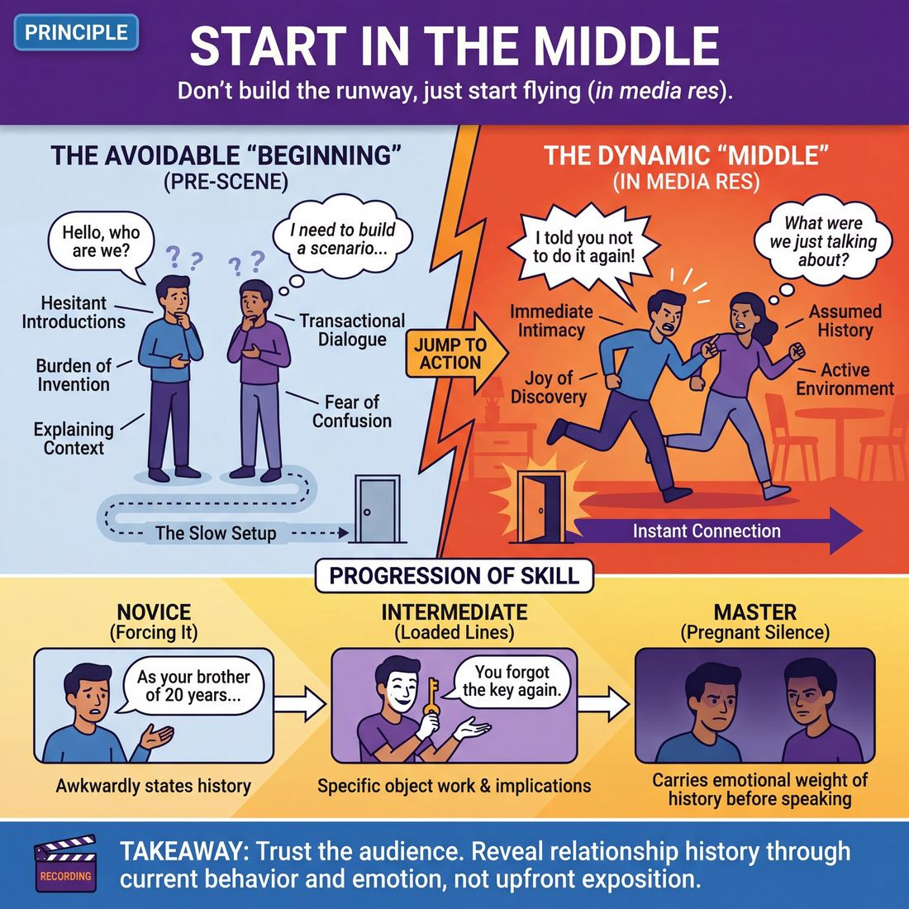

# 💎 Start in the Middle

> *Enter in media res; skip exposition.*

{ .infographic }

## 💎 The core belief

The principle of **Starting in the Middle** (often known by its literary term, *in media res*) is the conviction that the most compelling moment of a scene is already happening the second the lights come up. It is the fundamental belief that improvisers do not need to earn their way to the action through polite introductions, logistical planning, or heavy exposition. Instead, we trust that the characters already know each other, the environment is already active, and a dynamic is already in motion. We believe the audience is smart enough to catch a moving train, and that the players are capable enough to steer it without a map.

At its heart, this principle values momentum over context. When we believe that the "middle" is the best place to begin, we stop wasting stage time inventing the backstory of *how* two people arrived at a location, and start playing the reality of *what* is happening between them right now. It is a complete rejection of the **pre-scene**—that hesitant, throat-clearing phase where improvisers negotiate who they are and what they are doing. By embracing this conviction, we accept that the history of a relationship will naturally reveal itself through the characters' current behavior, rather than needing to be explained upfront.

!!! abstract "The Conviction"
    You do not need to build the runway before you take off. The scene is already flying; your job is simply to look out the window and react to the altitude.

## 🌱 Why it governs everything

When an improviser truly internalizes the belief that every scene is already underway, their entire approach to the stage transforms. They stop acting like writers trying to draft a prologue and start acting like documentary filmmakers who just hit record in the middle of a heated conversation. 

This principle governs everything because it fundamentally changes a performer's relationship with context. Instead of believing that a scene must be built from the ground up, the improviser trusts that the world already exists—they just need to step into it. 

Once this value is held as a conviction, a profound behavioral shift occurs across three main areas:

| The Old Way (Starting at the Beginning) | The New Paradigm (Starting in the Middle) |
| :--- | :--- |
| **Burden of Invention:** Performers feel they must explain who they are, where they are, and what they are doing before the scene can "start." | **Joy of Discovery:** Performers assume the who/what/where is already established in the unspoken history, and discover it through action. |
| **Transactional Dialogue:** Scenes begin with polite, stranger-to-stranger interactions (e.g., "Hello, I would like to buy a coffee"). | **Immediate Intimacy:** Scenes begin with familiarity, strong opinions, and emotional stakes (e.g., "I told you, I'm not paying for your latte again"). |
| **Fear of Confusion:** Performers over-explain, terrified the audience won't understand the premise. | **Trust in the Audience:** Performers trust that the audience is smart and actively enjoys putting the puzzle pieces together. |

Holding this value eliminates the dreaded "invention phase" of a scene. You no longer walk on stage thinking, *“I need to build a scenario.”* Instead, you walk on thinking, *“What were we just talking about?”* 

This shift eradicates tentative, shuffling entrances. When you believe the scene is already happening, you cannot enter neutrally. You must enter with an emotion, a physical action, or a mid-thought statement, because you are continuing a life that was already in motion before the lights came up.

!!! abstract "The gift of assumed history"
    The greatest relief of this principle is that it removes the pressure to *earn* your emotions. When you start in the middle, you automatically grant yourselves a shared history. You don't have to justify why you are furious, deeply in love, or terrified—you simply *are*, because the events that caused those emotions happened five minutes before the audience arrived.

## 👀 How it shows up

When improvisers truly hold the conviction that scenes must start in the middle, the audience feels as though they have just opened a door into a room where life is already happening. You don't see actors figuring out who they are; you see characters already living their lives. 

Because this is a foundational principle, its observable behaviors evolve significantly as an improviser matures.

| Level | Observable Behavior on Stage |
| :--- | :--- |
| **Novice** | **Forcing the middle.** The improviser understands they shouldn't start at the beginning, so they awkwardly state the history aloud ("As your brother of twenty years...") or jump instantly into unearned, high-volume conflict to simulate action. |
| **Intermediate** | **Loaded first lines and active environments.** The improviser enters doing specific **object work** (miming physical activities) that is already underway. They use first lines that imply a shared past ("You forgot to lock the gate again"), skipping introductions and pleasantries. |
| **Master** | **Emotional momentum and pregnant silence.** The improviser steps on stage already carrying the physical and emotional weight of a long history. The silence *before* the first line speaks volumes. The scene begins at the exact tipping point where a long-standing routine is about to change. |

Beyond the progression of skill, this principle consistently manifests in three distinct, observable markers on stage:

*   **The absence of pleasantries:** You rarely hear "Hello," "How are you," or "Welcome to my shop." The transactional, introductory dialogue that plagues the first thirty seconds of amateur scenes is entirely missing.
*   **Pronouns without antecedents:** Improvisers will confidently use "it," "he," or "they" in their first line without explaining what they mean. Saying, "He's doing it again," forces both players to immediately agree on a shared, unspoken context.
*   **Emotional velocity:** Characters do not start at a neutral emotional zero. They enter at a 4 or 5 out of 10—already annoyed, already overjoyed, already deeply in love, or already exhausted by the other person.

!!! example "In a scene: The Beginning vs. The Middle"
    **Starting at the beginning (Exposition):** 
    *Player A walks to center stage, wipes their hands on an imaginary rag.* "Hi there, welcome to Bob's Auto. What can I do for you today?"
    
    **Starting in the middle (In media res):** 
    *Player A is already underneath an imaginary chassis, grunting with effort.* "I told you on the phone, I can't source a carburetor for a '68 Mustang by Tuesday, and staring at me won't make it appear."

!!! tip "On stage: The 'Mid-Conversation' Entrance"
    A classic observable technique of this principle is entering with a conjunction. Starting a scene with "And another thing..." or "So then I told her..." instantly creates the illusion that the audience is tuning into a conversation that has been running for an hour.

## 🧪 Living it in practice

Internalizing the belief that you should start in the middle requires a fundamental shift from *creation* (building a scene from scratch) to *discovery* (uncovering a scene that is already happening). You must train yourself to walk on stage not as an actor looking for a premise, but as a character who has been alive all day.

Here are the mindsets, habits, and drills that turn this principle into muscle memory.

### The Mindset Shifts
To stop setting up scenes, you have to change your default assumptions before you even step into the lights:

*   **Assume intimacy:** You already know this person deeply. You are not strangers meeting at a bus stop; you are siblings, spouses, or lifelong rivals. 
*   **Assume history:** This is not the first time you've had this conversation. It is the hundredth time, and today is the day it boils over.
*   **Assume motion:** The physical world exists before you speak. You are already mid-task, mid-breath, or mid-thought.

### Actionable Habits
To achieve the markers of a lived-in scene, rely on these highly specific, repeatable behaviors:

*   **The Mid-Sentence Opener:** Execute the conjunction technique mentioned earlier. Start your first line of dialogue with "So," "And," "But," or "Because." 
*   **Lead with Emotion:** Enter the stage already feeling something to guarantee your emotional velocity. You do not need to know *why* you are furious, heartbroken, or ecstatic—just that you are. The justification will follow.
*   **Immediate Endowment:** Use "You" statements right away to lock in the relationship and give your partner characteristics (**endowment**). "You always do this" is infinitely more active than "Hello, sir."

!!! tip "On stage: The 'Reaction First' Rule"
    Make your very first action a reaction. Before you speak, react to your partner's posture, a sigh they made, or an invisible piece of the environment. Reacting proves that the world already exists and you are simply responding to it.

### Drills for the Rehearsal Room

To build the reflex of skipping the preamble, try these targeted exercises:

| Drill | How it works | What it trains |
| :--- | :--- | :--- |
| **"So..." Scenes** | Every scene must begin with a line starting with the word "So" or "And." | Forces players to imply a conversation that just happened off-stage. |
| **The 10-Second Cut** | Two players start a scene. After 10 seconds, the coach yells "Cut to the chase!" The players must immediately jump to the emotional core of the scene. | Highlights how much time is wasted on pleasantries, exposition, and throat-clearing. |
| **Silent Starts** | Players must engage in shared object work and environment building for 15 seconds before speaking. | Grounds the scene in physical reality, action, and relationship before words can dilute it. |

!!! example "In a scene: Preamble vs. In Media Res"
    **The Preamble (Building from scratch):**
    *Player A walks on, mimes holding a steering wheel.*
    Player A: "Well, here we are at the bank."
    Player B: "Yes, I have my gun ready for the robbery."
    *(The players are narrating their setup to the audience.)*

    **In Media Res (Starting in the middle):**
    *Player A is frantically miming driving, looking terrified. Player B is furiously scrubbing invisible ink off their face.*
    Player A: "I told you to check for dye packs!"
    Player B: "Shut up and run the red light!"
    *(The audience instantly understands they are mid-getaway.)*

## ⚖️ Tensions & nuance

"Starting in the middle" is a powerful accelerator, but it inherently wrestles with the audience's need for context. The primary tension of this principle is balancing *in media res* (being in the midst of things) with the necessity of a **base reality** (establishing the Who, What, and Where). 

If you start too early, the scene drags. If you start too deep in the middle without grounding the reality, the scene becomes a chaotic blur.

### The Context vs. Momentum Tension
The improviser must constantly negotiate how much information to give the audience while maintaining the illusion that this world existed before the lights came up. 

| Approach | Example First Line | The Result |
| :--- | :--- | :--- |
| **All Context (Too Early)** | "Hello, brother. Welcome to my kitchen on this Tuesday." | **Stagnant.** The actors are doing chores for the audience, not playing a scene. |
| **All Momentum (Too Chaotic)** | "Ahhh! The aliens are eating the wedding cake!" | **Untethered.** High energy, but the audience has no emotional anchor to care about the characters. |
| **The Sweet Spot** | "I told you not to invite your mother, David." | **Grounded Middle.** We are mid-argument, but the relationship and stakes are instantly clear. |

### Nuance: Emotional Middle vs. Plot Middle
A common trap is assuming "the middle" means the middle of a high-octane action sequence. In truth, the most sustainable way to apply this principle is to start in the middle of an **emotional state** or a **relationship dynamic**. 

You do not need to start in the middle of a bank robbery; you can start in the middle of a tense, silent standoff over who is going to pay the dinner check. The "middle" refers to the *stakes*, not necessarily the physical action.

!!! tip "On stage"
    **Silence is a valid middle.** Starting in the middle does not require immediate talking. Two characters standing at opposite ends of the stage, refusing to make eye contact while aggressively folding laundry, are already deep in the middle of a fight.

### Intersections with Other Principles

This principle does not exist in a vacuum; it relies heavily on other core improv values to function:

*   **Make Assumptions:** You cannot start in the middle if you are waiting for your partner to explain what is happening. You must boldly assume your relationship, your location, and your emotional state the moment you step on stage.
*   **Play the Reality:** When you drop the audience into the middle of a scenario, you must treat that scenario with absolute sincerity. If you start mid-funeral, you must play the gravity of the funeral, otherwise the abrupt start feels like a cheap gag rather than a window into a real world.
*   **Listen:** Because you are skipping the exposition, you must listen hyper-acutely to your partner's first line or physical offer. The clues to *why* you are in the middle of this specific moment are hidden in their tone and posture.

!!! abstract "Key idea"
    Starting in the middle is a leap of faith. You are trusting that if you provide the momentum, you and your partner can backfill the context as you go, rather than needing the context to generate the momentum.

## 🚫 Common misunderstandings

Because "Start in the Middle" is such a catchy, memorable maxim, it is frequently misinterpreted by eager improvisers who confuse *skipping the exposition* with *creating chaos*. 

When we misunderstand this principle, we end up with scenes that are loud, confusing, or ungrounded. Here is how the principle is most commonly misread, and how to correct it:

| The Misunderstanding | The Correction |
| :--- | :--- |
| **"It means starting with high-intensity conflict."** | Starting in the middle refers to the **timeline of the relationship**, not the volume of the scene. You do not need to start mid-argument. You can absolutely start in the middle of a quiet, intimate routine. |
| **"It means deliberately confusing the audience."** | Skipping the boring introductions does not mean withholding basic reality. You are trusting the audience to catch up, but you still must **ground the scene** quickly through context clues, rather than tedious exposition. |
| **"You must literally start mid-sentence."** | While starting mid-conversation is a great tactic, "the middle" is a state of being. A scene can start with ten seconds of loaded silence. As long as the characters already know each other and share a history, you are in the middle. |
| **"It means rushing straight to the climax."** | Skipping the *prologue* is not the same as skipping the *scene*. If you start at a level 10, you have nowhere to go. Start in the middle of the characters' normal lives, so you still have room to discover the unusual thing and build to a peak. |

!!! warning "The 'Who are you?' Trap"
    The fastest way to ruin a great *in media res* opening is to immediately ask an expositional question. If your partner initiates with, "I packed the bags, the car is running, let's go," and you reply with, "Wait, who are you and where are we going?", you have violently dragged the scene back to the beginning. Accept the premise, assume you already know the answers, and justify the action.

!!! tip "On stage"
    If you ever feel like you are "starting in the middle" but the scene feels completely unmoored, you likely skipped the **context** along with the exposition. Anchor the middle of the story with a specific physical action or a clear emotional point of view toward your partner.

## 🔗 Why it matters

When an entire ensemble deeply holds the belief that every scene is already underway, the DNA of the performance fundamentally changes. The show stops being a series of awkward, hesitant introductions and transforms into a vibrant, lived-in universe. 

This principle matters because it shifts the improviser’s job description. You are no longer an **inventor** burdened with constructing a reality from scratch; you become an **explorer** discovering a reality that already exists. 

This philosophical shift ripples outward, transforming the experience for both the players and the crowd:

| The Show | Without "Start in the Middle" | With "Start in the Middle" |
| :--- | :--- | :--- |
| **Pacing** | Sluggish. Scenes spend minutes searching for a premise or relationship. | Urgent. Scenes hit the ground running with immediate momentum and stakes. |
| **The Audience** | Passive. Sitting back, waiting for the improvisers to figure out the joke. | Engaged. Leaning forward, actively piecing together the context clues. |
| **The Performers** | Stressed. Feeling the pressure to write a perfect beginning on the spot. | Curious. Reacting authentically to the immediate emotional reality of the moment. |
| **World-Building** | Shallow. The world feels like a flimsy sketch built two seconds ago. | Deep. The world implies a rich, unseen history and off-stage life. |

Starting in the middle is also the ultimate sign of respect for your audience's intelligence. Viewers are incredibly literate in narrative tropes; they do not need to see the drive to the restaurant, the greeting of the hostess, and the ordering of the drinks to understand a tense anniversary dinner. By cutting straight to the tears over the appetizers, you invite the audience to be active participants in the storytelling.

!!! example "The Macro Effect on a Set"
    Imagine a 25-minute long-form piece with ten scenes. If every scene takes just one minute of exposition to find its footing, you lose nearly half your show to theatrical throat-clearing. When you start in the middle, those ten minutes are reclaimed for **heightening** (escalating the stakes), emotional exploration, and satisfying callbacks. 

Ultimately, embracing *in media res* gives improvised work weight and history. It strips away the artificiality of "making things up" and replaces it with the immediate, undeniable theatrical power of life already in motion.

## 📚 References & Further Reading

### Foundational sources
*   **Charna Halpern, Del Close, and Kim "Howard" Johnson, *Truth in Comedy: The Manual of Improvisation* (1994)** — Explicitly outlines the rule to "start in the middle," arguing that exposition is a necessary evil in writing but a complete waste of time in improv. The authors stress that nothing is more boring than two improvisers asking "Who are you?", and mandate that players assume a relationship right from the first line.
*   **Viola Spolin, *Improvisation for the Theater* (1963)** — While Spolin is famous for requiring a "Who, What, Where" in every scene, her theater games (like "Orientation" and "Part of a Whole") are designed to establish these elements immediately through physical action ("showing") rather than verbal negotiation ("telling"), effectively skipping the invention phase.

### Practitioner guides & manuals
*   **T.J. Jagodowski, David Pasquesi, and Pam Victor, *Improvisation at the Speed of Life: The TJ and Dave Book* (2015)** — The definitive text on the philosophy that "we are already in the middle of it." Jagodowski and Pasquesi teach improvisers to step out of the wings and into a scene that is already happening, shifting the performer's mindset from *inventing* a premise to *discovering* an existing reality.
*   **Mick Napier, *Improvise: Scene from the Inside Out* (2004)** — Napier aggressively dismantles the tentative "negotiation phase" (or "pre-scene") of scene starts. He advocates for making immediate, strong choices—entering with an emotion or mid-thought statement—to establish the "law of inertia," ensuring the scene has momentum before the brain has time to invent a polite backstory.
*   **Matt Besser, Ian Roberts, and Matt Walsh, *The Upright Citizens Brigade Comedy Improvisation Manual* (2013)** — Emphasizes establishing a "Base Reality" quickly through strong initiations. The manual specifically warns against transactional scenes (e.g., buying a coffee) and polite stranger-to-stranger introductions, pushing performers to initiate with context and emotional stakes.
*   **Patti Stiles, *Improvise Freely* (2021)** — A Johnstone-lineage guide that tackles the fear of starting scenes. Stiles encourages improvisers to drop the burden of invention, trust immediate narrative momentum, and avoid the trap of over-explaining the environment to the audience.

### Lineage & teachers
*   **The Annoyance Theatre (Chicago)** — Founded by Mick Napier, this school's curriculum heavily focuses on the individual performer's responsibility to enter with a strong emotion, physical action, or point of view, effectively bypassing the "invention phase" and forcing the scene to start in the middle.
*   **iO Theater (Chicago)** — The historical birthplace of the Harold, where Del Close and Charna Halpern institutionalized the practice of skipping exposition, avoiding transactional pleasantries, and starting scenes with assumed history and immediate intimacy.

### Research & theory
*   **R. Keith Sawyer, *Improvised Dialogues: Emergence and Creativity in Conversation* (2003)** — A sociological and linguistic study of Chicago improv that analyzes how performers use "collaborative emergence." Sawyer breaks down how improvisers establish a shared frame, relationship, and context within just a few interactional turns without any prior planning.
*   **Paul Werth, *Text Worlds: Representing Conceptual Space in Discourse* (1999)** — A foundational text in cognitive linguistics that explains the cognitive mechanics of the *in media res* effect. It details how audiences automatically build a mental "text-world" and fill in missing context when dropped into an already-active scenario, validating the improv technique of using pronouns without antecedents.

### Talks, videos & courses
*   **Alex Karpovsky (Director), *Trust Us, This Is All Made Up* (2009)** — A documentary following TJ Jagodowski and David Pasquesi. The performance footage provides a masterclass in watching two performers walk on stage, embrace pregnant silence, and instantly discover the middle of a relationship without any pre-scene planning or throat-clearing.

### Communities & adjacent reading
*   **Will Hines, *How to Be the Greatest Improviser on Earth* (2016)** — Contains highly practical chapters on starting scenes strongly, specifically addressing the trap of "Hey, how's it going?" pleasantries and offering actionable advice on how to initiate with assumed history and emotional velocity.

## 💬 Quotes & Anecdotes

!!! quote "— Del Close & Charna Halpern, *Truth in Comedy* (1994)"
    Exposition sucks. Backstories and explanations are rarely the most exciting part of any book or film; generally they are a necessary evil. In improvisation, actors are seldom hamstrung by exposition. Instead, they simply ignore it all, and begin their scenes in the middle! Nothing is more boring or wastes more time than two improvisers starting a scene with "Who are you?"

!!! quote "— Matt Besser, Ian Roberts, and Matt Walsh, *The Upright Citizens Brigade Comedy Improvisation Manual* (2013)"
    Exposition is uninteresting; improvisers should dive into the action without wasting time on backstories. When performers start in the middle of a scenario, they maintain energy and engage the audience effectively.

!!! quote "— Will Hines, *How to Be the Greatest Improviser on Earth* (2016)"
    Start with an idea, or at least start in the middle of something. Just starting a first beat with "Hey, how it's going?" is death to a Harold.

!!! quote "— Tina Fey, *Bossypants* (2011)"
    The next rule is MAKE STATEMENTS. This is a positive way of saying "Don't ask questions all the time." If we're in a scene and I say, "Who are you? Where are we? What are we doing here? What's in that box?" I'm putting pressure on you to come up with all the answers. In other words: Whatever the problem, be part of the solution. Don't just sit around raising questions and pointing out obstacles... Instead of saying "Where are we?" make a statement like "Here we are in Spain, Dracula."

### Where it comes from
The literary technique of *in media res* (Latin for "into the middle of things") dates back to classical epics like Homer's *Odyssey*. In modern improvisational theater, the mandate to "start in the middle" was heavily popularized in Chicago during the 1980s and 1990s by Del Close and Charna Halpern at the ImprovOlympic (iO). They codified the idea that "exposition sucks" in their foundational 1994 book *Truth in Comedy*. The principle was later cemented into the curriculum of the Upright Citizens Brigade (UCB), whose founders trained under Close and taught that skipping the "invention phase" is the fastest way to find the comedic "game" of a scene.

### A telling example
**The "Here we are in Spain" trope**
For decades, improv and sketch teachers have used the cliché line, "Well, here we are in Spain!" as the ultimate example of clunky, unnatural exposition. (The phrase reportedly dates back to a century-old vaudeville sketch). In real life, people do not announce their location to someone who is already standing there with them. Tina Fey famously parodied this in *Bossypants* with the line, "Here we are in Spain, Dracula." While absurd, Fey points out that even a ridiculous declarative statement is infinitely better than starting a scene by asking, "Where are we, and who are you?" because it instantly provides a "middle" to work from.

**Illustrative Scene: The Mid-Conversation Entrance**
A classic way improvisers force themselves to start in the middle is by entering mid-sentence, using a conjunction to imply a long, ongoing conversation.

*Player A and Player B walk to center stage, already mid-stride and gesturing.*  
**Player A:** "...and *that* is why I will never eat at a Macaroni Grill again."  
**Player B:** "I told you the breadsticks tasted like drywall, but you wouldn't listen."  

In two lines, the audience knows they have a shared history, a recent shared experience, and an established dynamic (Player B is the "I told you so" friend). No one had to say "Hello, friend" or "Welcome to my car." The scene is already flying.

## 🧭 Explore the framework

- 🎭 **Domain:** [The Scene](03_D__the-scene.md)
- 🔁 **Other principles here:** [Show, Don't Tell](03_P1__show-don-t-tell.md), [Base Reality First](03_P2__base-reality-first.md), [Serve the Story](03_P4__serve-the-story.md)
- 🧠 **Skills of this domain:** [Game Identification](03_S1__game-identification.md), [Heightening & Exploration](03_S2__heightening-and-exploration.md), [Narrative Architecture](03_S3__narrative-architecture.md), [Stakes / The 'Want'](03_S4__stakes-the-want.md), [World-Building](03_S5__world-building.md), [Justification](03_S6__justification.md), [Raising the Stakes](03_S7__raising-the-stakes.md)
