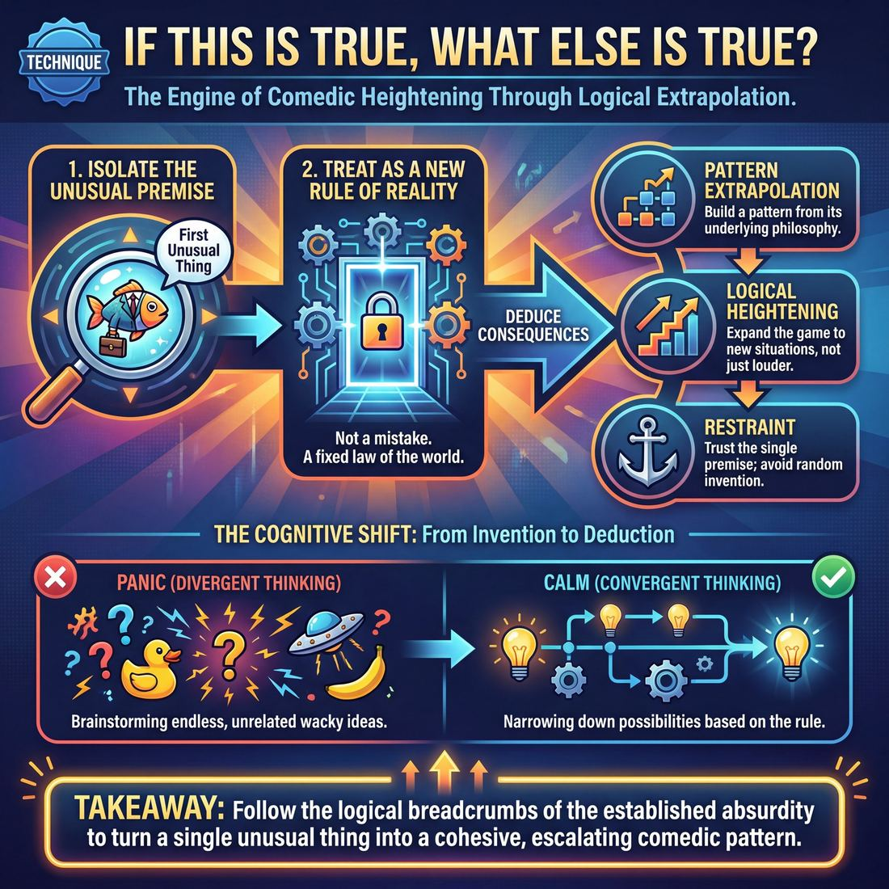

# 🎯 If this is true, what else is true?

> *A drillable muscle that trains **Game Identification**.*

{ .infographic }

## 🎯 The essence

"If this is true, what else is true?" is the foundational engine of comedic heightening. As both a mental heuristic and a rapid-fire drill, it asks players to isolate a single unusual premise—the **first unusual thing**—and logically extrapolate its consequences. Rather than inventing random new jokes or changing the subject, players practice the strict discipline of **logical escalation**: mining the reality of a world where that one specific absurdity exists, and building a cohesive, escalating pattern from it.

## 🎓 What it trains

At its core, this technique is the primary workout for **Game Identification**. It builds the improviser’s ability to spot an unusual element in a scene and use it as an engine for comedy, rather than treating it as a disposable, one-off gag. 

Specifically, it isolates and trains three distinct muscles:

* **Pattern Extrapolation:** Moving beyond merely *noticing* the unusual thing, and actively building a pattern out of its underlying philosophy.
* **Logical Heightening:** Expanding the game by applying its internal logic to new situations, rather than just repeating the exact same action louder or faster.
* **Restraint:** Trusting a single comedic premise enough to explore it deeply, rather than panicking and introducing unrelated wacky elements.

**The Problem It Solves**  
When an improviser discovers something weird or funny on stage, the immediate internal panic is often, *"What do I do now?"* Without this muscle, players typically fall into one of three traps: 

1. **Abandonment:** They drop the unusual thing and return to safe, mundane conversation.
2. **Repetition:** They repeat the exact same joke until it goes stale.
3. **Invention:** They panic and introduce a *second*, completely unrelated weird thing to keep the scene "funny" (often called putting a "hat on a hat").

!!! abstract "The Deeper Principle: Comedic Logic"
    Comedy thrives on logic, not randomness. "If this is true, what else is true?" forces you to treat the unusual thing not as a mistake or a random gag, but as a **new rule of reality**. If a character believes their golden retriever can speak English, we don't need aliens to land to make the scene funny. We just need to ask the question: *If it's true this dog speaks English, what else is true?* (Perhaps the dog helps them cheat on crossword puzzles, or perhaps the dog is actively blackmailing them).

By drilling this question, improvisers bridge a crucial gap in their development: graduating from merely recognizing a game *after* the scene is over, to actively identifying, framing, and driving the game while the scene is happening.

## 💡 Why it works

At its core, "If this is true, what else is true?" works by replacing the panic of invention with the calm of deduction. It shifts the improviser’s brain out of a purely creative, generative state and into a logical, problem-solving state. 

!!! abstract "The Cognitive Shift"
    Improvisers often struggle when they rely entirely on **divergent thinking** (brainstorming endless new, disconnected ideas). This technique forces **convergent thinking** (narrowing down possibilities based on an established rule). You no longer have to pull a funny idea out of thin air; you just have to follow the logical breadcrumbs of the idea that already exists.

Here is the engine under the hood:

* **It builds Game through pattern:** A single weird event is just an anomaly. By asking "what else is true?", you replicate the underlying logic of that anomaly, turning a random quirk into a recognizable, escalating pattern. 
* **It grounds the absurd:** Comedy thrives on contrast. When an absurd premise is introduced, this technique forces the improviser to treat it with absolute sincerity. Instead of breaking reality, you are building a *new* reality with consistent, internal rules. 
* **It aligns the ensemble:** When a scene flounders, it is often because players are pitching competing premises. This question acts as a unifying filter. Once the first unusual thing is established, the entire cast is suddenly solving the exact same puzzle.

!!! example "In a scene"
    **The First Unusual Thing:** A surgeon is using a rusty spoon instead of a scalpel.
    
    * **Without the technique (Inventing):** "Watch out, a bear just walked into the operating room!" *(Random, disconnected, destroys the established reality.)*
    * **With the technique (Deducing):** "Nurse, please hand me the dirty mop so I can swab the incision." *(Follows the logic: If it is true that this hospital uses garbage for medical equipment, what else is true?)*

By treating the unusual thing as a factual premise rather than a fleeting joke, the technique provides an infinite, reliable fuel source for the scene.

## 🧩 The setup

Here is everything you need to arrange before running this exercise. Because this technique isolates a specific cognitive muscle—extrapolating a pattern rather than inventing new random ideas—it is best introduced as a rapid-fire circle drill before being applied to full scenes.

* **Players & Arrangement:** 6 to 12 players. The group forms a single standing circle. This keeps energy high, ensures everyone can hear the pitches, and removes the pressure of "being on stage."
* **Space & Materials:** An open room. No chairs, props, or whiteboards are required. 
* **Time:** 
    * **Total time:** 10–15 minutes. 
    * **Per round:** 1–2 minutes per prompt. Keep the pace brisk; once the group exhausts the immediate logical leaps of one idea, cut it and move to a new prompt.
* **Roles:**
    * **The Caller (usually the Facilitator):** Provides the starting premise. This must be a single sentence that establishes a grounded **Base Reality** (who/what/where) and introduces exactly one unusual thing (the deviation from normal).
    * **The Ensemble:** Anyone in the circle can speak up at any time. Their job is to pitch a specific action, line of dialogue, or consequence that logically follows the Caller's premise.
* **Prerequisites:** Players should already be familiar with the concepts of Base Reality (the normal world of the scene) and the unusual thing (the first weird or out-of-the-ordinary element that breaks that normal world). 

!!! tip "Facilitator Script"
    "We are going to isolate the core muscle of playing Game. I am going to give you a single sentence that contains a normal situation and one weird thing. 
    
    Your job is to ask yourself: *'If this is true, what else is true?'* 
    
    Just shout out the logical next steps, behaviors, or lines of dialogue that would exist in a world where this weird thing is a fact. Don't invent a *second* weird thing. Just take the one I gave you, treat it as perfectly normal, and apply it to everything else. Anyone can jump in, rapid-fire."

!!! example "Setting the Baseline"
    Before starting the drill, give the group a quick theoretical example to anchor the concept (you can even reuse the hospital scenario): 
    *"If it is true that a surgeon is using a rusty spoon instead of a scalpel, what else is true? Maybe the anesthesiologist is just hitting the patient with a mallet. Maybe the nurses are washing their hands in a mud puddle. We are just applying the logic of 'crude, improvised medical tools' to the rest of the room."*

## ⚙️ The mechanics

The engine of this technique is pure deductive reasoning applied to absurdity. It forces improvisers to treat an unusual behavior not as a one-off joke, but as a new law of physics for the scene. 

When run as a dedicated drill (often in pairs or a circle), the objective is to isolate the single weird element and systematically extrapolate its consequences. Here is the step-by-step flow of the core loop:

1. **The Base Reality & The Spark:** Player A initiates with a grounded who/what/where, but deliberately includes one unusual thing (the spark). 
2. **The Diagnosis (Internal):** Player B mentally isolates the exact unusual behavior or statement. *(In early training, the coach may pause the scene and ask Player B to state the unusual thing out loud.)*
3. **The Question (Internal):** Player B asks themselves the titular question: *"If [the unusual thing] is true, what else must logically be true about this person, this place, or this situation?"*
4. **The Heightening Move:** Player B delivers a line of dialogue or an action that answers the question. This move must validate the unusual thing and push it one step further.
5. **The Pattern:** Player A accepts Player B's heightening, adopts the same internal logic, and escalates it again. The players ping-pong, building a pattern of behavior.

!!! example "In a scene"
    **Player A:** "Welcome to the bank, I'll be your teller. Just give me a second to finish building this house of cards."
    
    *Player B's Internal Monologue:* The unusual thing is a bank teller doing a fragile, distracting, childish activity instead of handling money. If it's true that this bank prioritizes delicate games over secure finance, what else is true?
    
    **Player B:** "Take your time. I'm here to deposit this Fabergé egg, and I'd like to balance it on top."

### Rules & Constraints

To build the muscle of Game Identification and heightening, players must adhere to strict constraints during the drill:

* **No new inventions:** Do not introduce a *second* unusual thing. If the scene is about a bank teller building a house of cards, do not make the customer a time-traveling alien. Explore the first anomaly deeply.
* **Play it real:** The characters must believe this behavior is entirely normal. The comedy comes from the contrast between the absurd logic and the grounded emotional commitment of the players.
* **Expand the radius:** When answering "what else is true?", players should push the logic outward. 

You can expand the radius of the logic across three distinct tiers:

| Tier | Focus | Example (The Card-House Teller) |
| :--- | :--- | :--- |
| **1. Immediate** | The physical space and current action. | "Please whisper, the vault door closing usually knocks down my Spades." |
| **2. Contextual** | The character's history, relationships, or job. | "I was passed over for branch manager because my Jenga tower fell." |
| **3. Philosophical** | The character's worldview or core belief system. | "Money is fleeting, sir. But a perfectly balanced Jack of Diamonds? That is eternal." |

### How a round ends and resets
A round of this drill ends when the pattern reaches its natural, absurd extreme—often called the **blow out** or the button. This is the point where the logic has been stretched as far as it can go without breaking the reality of the scene. The coach calls "Scene," and the next pair steps up to establish a completely new, mundane base reality to start the loop again.

!!! warning "Watch out"
    A common novice mistake is answering "what else is true?" by simply repeating the unusual thing louder or with more anger. **Heightening is not just volume; it is specificity and consequence.** If the teller likes cards, don't just yell about cards—show how it affects the mortgage rates.

## 🎬 Sample round

!!! example "Sample round: The Sentient Printer"
    Here is how the internal monologue of "If this is true, what else is true?" maps directly onto a live scene. Watch how Player A uses the technique to identify and heighten the game.

    **1. Establishing the Base Reality**  
    **Player A (Sarah):** *(Pouring coffee)* "Ugh, Monday. Did you get the agenda for the 10 AM?"  
    **Player B (Mark):** "Yeah. I'm dreading it."  
    *(The scene is grounded. We know who they are and where they are: coworkers in a breakroom.)*

    **2. The Unusual Thing Appears**  
    **Player A (Sarah):** "I need to print the quarterly reports before we go in."  
    **Player B (Mark):** *(Whispering frantically)* "Don't look directly at the Xerox machine. It's in a foul mood today and it demands a sacrifice."  
    *(This is the first unusual thing. Mark is treating standard office equipment like a vengeful, sentient deity.)*

    **3. Asking the Question (The Internal Muscle)**  
    *Sarah’s internal monologue:* "Okay, **if it is true** that Mark believes the office printer is an angry god, **what else is true** in this world?"  
    * *Idea 1:* We have to appease it with office supplies.  
    * *Idea 2:* IT isn't a tech department, they are high priests.  
    * *Idea 3:* Paper jams are divine punishment.  

    **4. Executing the Move (Heightening)**  
    **Player A (Sarah):** *(Averting her eyes, trembling slightly)* "Oh god. Did Kevin from Accounting forget to leave the overnight toner offering again?"  
    *(Sarah has chosen Idea 1. She doesn't deny Mark's reality; she uses the technique to build on it logically.)*

    **5. The Pattern Cements**  
    **Player B (Mark):** "Worse. He fed it cheap, generic recycled paper. The Xerox demands high-gloss HP premium, or it will jam our souls."  
    **Player A (Sarah):** "I'll call the IT department. Hopefully the High Priest of Troubleshooting is on duty."  

    **The Breakdown:**  
    Notice how Sarah didn't just say, "You're crazy, it's just a printer" (which would kill the game). She also didn't invent a completely unrelated weird thing, like "Watch out for the breakroom fridge, it's a time machine" (which would derail the scene). By asking **"If this is true, what else is true?"**, she stayed laser-focused on Mark's initial premise, expanding the rules of the game step-by-step.

## 🎚️ Variations & progressions

To build the Game Identification muscle, this technique can be isolated in a circle or integrated directly into scene work. Here is how to scale the difficulty as players mature from basic logic exercises to complex, character-driven scene work.

**1. The Logic Circle (Novice to Advanced Beginner)**
* **The setup:** The group stands in a circle. The coach or a player provides a single, unusual premise (e.g., *"Gravity turns off on Tuesdays"*). Moving clockwise, each player states one logical consequence of that reality. 
* **The focus:** This isolates the pure logic of the exercise. It helps novices—who often try to spot the unusual thing but miss it live—by freezing time and removing the pressure of acting, allowing them to practice pure extrapolation.

**2. The Solo Monologue (Advanced Beginner to Competent)**
* **The setup:** A player steps forward, states an unusual premise, and delivers a 30-second monologue exploring three to four escalating consequences of that premise on their own.
* **The focus:** Builds the stamina to heighten a game independently. It pushes players past naming the game *after* the fact and forces them to actively build upon it in real time.

**3. Scene Initiation Tag-Outs (Competent to Proficient)**
* **The setup:** Two players begin a scene. Player A establishes a base reality and an unusual thing. Player B’s *very first line* must be an "If this is true..." deduction that heightens the premise. The coach then calls "Tag!"—a new player taps out Player A or B, and a new scene begins immediately.
* **The focus:** Speed and application. This trains players to identify the game *during* the scene and frame the game with their first unusual line.

!!! tip "On stage: The 'Yes, And' bridge"
    When moving from drills to scenes, players often forget to agree before extrapolating. Remind them that "If this is true..." is just a targeted version of "Yes, and...". The internal monologue should be: *"Yes, I accept this weird thing is happening, and therefore..."*

**4. Psychological "What Else is True?" (Proficient to Master)**
* **The setup:** Instead of a bizarre world rule (like talking dogs), the premise is a deeply specific, grounded character flaw or worldview. The players must extrapolate how this internal logic affects mundane situations.
* **The focus:** Moves players away from wacky, external premises and into grounded, character-driven game play. 

!!! example "In a scene: Psychological extrapolation"
    **Premise:** A character treats their houseplants like a strict military platoon.  
    **Extrapolation (Proficient):** "Alright, ferns, drop and give me twenty photosyntheses!"  
    **Extrapolation (Master):** The character writes a solemn letter to a cactus's "family" after overwatering it, treating it as a tragic death in the line of duty.

**5. The Silent Extrapolation (Master)**
* **The setup:** The premise is established verbally, but all subsequent "If this is true..." deductions must be played out entirely through physical object work and environment interaction.
* **The focus:** Forces players to embody the game rather than just talking about it. A master improviser knows that the most satisfying consequences of a game are often seen, not heard.

## 🧑‍🏫 Coaching notes

Coaching this technique requires keeping players focused on *extrapolation* rather than *invention*. Your primary job is to stop them from adding random new ideas and force them to dig deeper into the one they already have.

!!! tip "Coaching: The Golden Cue"
    **"Stay on the same game board."**  
    The most common instinct when asked "what else is true?" is to panic and invent a *second, unrelated* unusual thing. If a character is obsessed with eating gravel, they don't also need to be a vampire. Side-coach immediately: *"You don't need a new weird thing. Keep the gravel, change the context. How do they order at a fancy restaurant?"*

When running drills or scenes focused on this technique, use sharp, active side-coaching to guide their logic:

* **"Take it to work." / "Take it home."** – Forces the player to apply the established unusual behavior to a completely different environment.
* **"Make it a philosophy."** – Pushes the player to elevate a quirky physical action into a deeply held, articulate worldview.
* **"Who else agrees with them?"** – Expands the game from an individual quirk to a societal norm, family trait, or faction.
* **"What is the logical extreme?"** – Prompts the player to push the pattern as far as it can go before breaking the reality.

**What 'Good' Looks and Sounds Like**  
How do you know the muscle is actually building? Look for these observable shifts in the room:

* **Declarative statements:** Players stop asking questions ("Are you eating gravel?") and start making definitive additions ("I'll ask the sommelier for the Himalayan pink gravel.").
* **Ironclad internal logic:** The scene's reality might become highly absurd, but the *rules* of that absurdity remain perfectly consistent. 
* **The "Aha" pacing:** You will see a distinct moment of recognition—a spark in the players' eyes when they collectively identify the game—followed by a rapid, joyful volley of heightening moves.
* **Joyful agreement:** Instead of negotiating or fighting the reality, players are actively delighting in making the hole deeper together.

## 🧭 Debrief & reflection

After the laughter dies down, the debrief is where the mechanics of Game Identification are actually wired into the players' brains. The goal here is to cement the improviser’s mindset shift from *inventing* funny ideas to *deducing* logical consequences. 

Use these questions to guide the post-round discussion:

* **"What exactly was the 'this'?"** 
    Force the group to articulate the core premise they were exploring. If the scene was about a dentist who uses carpentry tools, did they extrapolate about *dentistry*, about *carpentry*, or about *the specific character's blue-collar mindset*? If the group can't agree on the core unusual thing, their extrapolations will have felt scattered.
* **"Did you feel yourself inventing or deducing?"** 
    Ask players to reflect on their internal experience. Invention feels like heavy lifting—frantically searching for a new joke. Deduction feels like discovery—simply applying the established logic to a new area. 
* **"Which addition felt the most inevitable?"** 
    Identify the moves that made the whole room nod in agreement before they laughed. These are the moves that perfectly executed the "what else is true" logic.
* **"Did we step on the premise, or heighten it?"** 
    Discuss whether the additions supported the original unusual thing or accidentally replaced it with a brand new one (a lateral move).

!!! abstract "Key idea: The 'Aha' of Deduction"
    A successful debrief surfaces a specific realization: **the funniest moves are often the most logical.** Players should walk away understanding that they don't need to be wacky or wildly creative. Once the base reality is tilted by one unusual thing, their only job is to treat that absurdity with deadly, mathematical seriousness.

**Connecting to the wider skill:**  
For players at the Advanced Beginner stage, this debrief is crucial practice for naming the game *after* the fact. By repeatedly asking "What was the 'this'?", you train their brains to isolate the unusual thing. Over time, this repetition pushes them into Competence, where they begin to identify and name that core game *while* the scene is still happening.

## ⚠️ Common pitfalls

!!! warning "Watch out: The 'Hat on a Hat'"
    The single most common novice mistake is answering "what else is true?" by inventing a **completely unrelated unusual thing**. 
    
    If the first true thing is that a character is terrified of cotton balls, a panicked improviser might add, "...and I'm also an alien!" This destroys the Game. The prompt is "If *this* is true...", meaning you must drill deeper into the *original* premise, not abandon it for a new one. 

When improvisers are under the cognitive load of performing, listening, and inventing simultaneously, their brains often take shortcuts that break this technique. Here are the classic traps and how to fix them:

* **Making lateral moves (Treading water):** Under pressure, it is neurologically easier to list items in the same category than to escalate a pattern. If the unusual thing is "this guy loves eating office supplies," a lateral move is saying, "I bet you eat staples, too." It’s true, but it doesn't heighten.
    * *The Fix:* Push the philosophy or raise the stakes. Instead of naming another office supply, escalate the behavior: "I bet you're trying to get the company to cater the holiday party from Staples."
* **Losing the Base Reality:** When players get hyper-focused on answering the prompt, they often forget to react like human beings. The scene devolves into two people calmly listing absurdities in a white room.
    * *The Fix:* Ground the scene. Remember that the unusual thing only works if it contrasts with a normal world. Let one character be the voice of reason who reacts truthfully to the escalating madness.
* **Asking the prompt out loud:** Novices processing the scene in real time will sometimes literally say the prompt on stage: *"Well, if you hate the color blue, what else do you hate?"* This breaks the reality of the scene and turns the improviser into an interviewer.
    * *The Fix:* Keep the question entirely in your head. Deliver your answer as a confident, declarative statement or an action. 

!!! example "In a scene: Fixing a lateral move"
    **The Unusual Thing:** A dentist who treats teeth like precious gemstones.
    
    **❌ Lateral (Treading water):** "Wow, you polished my bicuspid like a diamond. I bet you treat my molars like rubies." *(Just swapping vocabulary).*
    
    **✅ Vertical (Heightening):** "Doctor, why is my extracted wisdom tooth set into a gold necklace in your display case?" *(Escalating the consequence of the philosophy).*

## 🌟 What mastery looks like

When a master improviser employs "If this is true, what else is true?", the process is invisible, instantaneous, and devastatingly precise. They do not merely list random, escalating absurdities; they instantly identify the underlying **worldview** of the unusual thing and apply its specific logic to entirely new contexts. 

At the highest level of proficiency, you will observe the following behaviors:

* **Lateral extrapolation (Mapping):** Instead of just doing the same unusual action *harder* (linear escalation), the master takes the core logic and applies it to different areas of the character’s life. If a character treats their car like a romantic partner, the master doesn't just have them kiss the steering wheel; they have the character introduce the car to their parents, or complain that the car is "emotionally distant" since the oil change.
* **Philosophical grounding:** The master identifies *why* the unusual thing is happening. They extrapolate the character's philosophy, not just their actions, making the resulting absurdities feel completely justified and grounded.
* **Speed of synthesis:** There is zero hesitation. The master frames the game with the very first unusual line, instantly locking onto the premise without needing to fish for ideas.
* **Intentional breaking:** As noted in the maturity progression, a master knows when a pattern has peaked. Once they have fully explored "what else is true" and pushed the logic to its absolute limit, they will intentionally break the game—grounding the scene, shifting the dynamic, or pivoting to a new engine entirely rather than beating a dead premise into the ground.

!!! example "In a scene: Basic vs. Master Extrapolation"
    **The unusual thing:** A boss is managing a modern accounting firm as if it were a 19th-century pirate ship.
    
    * **Competent extrapolation (Linear):** The boss makes an underperforming employee walk the plank, or wears an eyepatch to the board meeting. *(Funny, but stays in the exact same lane).*
    * **Master extrapolation (Lateral):** The boss pays Q3 bonuses in buried Spanish doubloons, insists that HR disputes be settled by parley, and suggests a hostile takeover of the rival firm across the street by literally swinging through their plate-glass windows on ropes.

!!! abstract "Key idea: The Inevitable Surprise"
    Mastery of this technique produces ideas that are surprising to the audience, yet feel completely inevitable in hindsight. The audience laughs because the master's extrapolation is the *only* logical conclusion to the absurd premise they just established.

## 🔗 Why it matters

"If this is true, what else is true?" is the foundational algorithm of comedic improvisation. It acts as the direct bridge between spotting an unusual thing and actually playing it. 

To ask "what else is true?", an improviser must first define the "this." By forcing yourself to isolate and articulate the core comedic logic of the scene, you actively train your brain to recognize patterns in real time. This is the exact muscle required to move from a novice (who might sense something funny but misses it live) to a proficient player who can identify and frame the game deliberately.

Beyond identifying the game, this technique is the primary fuel for the **Game Engine** of a scene. When your goal is to architect a compelling scene, you must ensure that the comedic escalation feels justified, not random. 

Here is how this single question ripples outward to support the wider craft:

* **It cures "randomness":** When improvisers panic, they often introduce unrelated wacky elements (a sudden alien invasion, a random explosion). This technique tethers your imagination to the established reality, ensuring that every new detail reinforces the central premise rather than distracting from it.
* **It drives Heightening:** Heightening is the act of escalating the stakes or absurdity of a pattern. By asking "what else is true?", you naturally push the logic to its next logical extreme, expanding the game from a minor quirk into a worldview.
* **It builds cohesive worlds:** If a character is cheap enough to wash and reuse paper towels, what does their car look like? What is their wedding going to be like? The question effortlessly generates rich, specific environments and secondary characters that all share the same comedic DNA.
* **It deepens character:** It forces you to treat the unusual behavior not as a momentary joke, but as a deeply held philosophy. It makes the audience genuinely care about—and understand—absurd people.

## 📚 References & Further Reading

### Foundational sources
* **Matt Besser, Ian Roberts, and Matt Walsh, *The Upright Citizens Brigade Comedy Improvisation Manual* (2013)** — This is the definitive, foundational text that codified this exact phrasing. In their chapter on "Game," the authors explicitly define a Game move as the act of shifting away from "Yes, And" to repeatedly answering the question, "If this unusual thing is true, then what else is true?" to create a comic pattern. https://ucbstore.com/books/the-upright-citizens-brigade-comedy-improvisation-manual

### Practitioner guides & manuals
* **Will Hines, *How to Be the Greatest Improviser on Earth* (2016)** — Written by a veteran UCB teacher and director, this book breaks down the mechanics of logical heightening. Hines dedicates significant time to explaining why treating absurdity as absolute truth—and following its logical consequences—is the core of reliable comedic scene work. https://www.willhinesimprov.com/
* **Billy Merritt and Will Hines, *Pirate Robot Ninja: An Improv Fable* (2017)** — This book categorizes improvisers into three distinct cognitive styles. It deeply explores the "Robot" style of play, which relies heavily on the analytical, convergent-thinking skills required to deduce "what else is true" and build structural game patterns. 
* **Charna Halpern, Del Close, and Kim "Howard" Johnson, *Truth in Comedy: The Manual of Improvisation* (1994)** — While the UCB founders coined the specific "If this is true..." phrasing, this book laid the essential groundwork. It introduced the concept of finding the "Game" and playing the pattern, teaching improvisers to look for the internal logic of a scene rather than reaching for random, disconnected jokes.

### Lineage & teachers
* **The Upright Citizens Brigade (UCB)** — The theater and training center that built its entire curriculum around "Game of the Scene." Their philosophy shifted the modern improv landscape by prioritizing the strict, logical heightening of a single unusual premise over narrative storytelling or character monologues. https://ucbcomedy.com/
* **iO Theater (formerly ImprovOlympic)** — The legendary Chicago institution where the founders of UCB trained under Del Close. It was here that the early concepts of pattern recognition and "truth in comedy" were developed, eventually evolving into the highly structured UCB technique.

### Research & theory
* **J.P. Guilford, *The Nature of Human Intelligence* (1967)** — The foundational psychological text introducing the concept of **Convergent Thinking** (deducing the single best or most logical answer from an established premise). This is the exact cognitive shift this improv technique demands, moving players away from divergent brainstorming and into logical deduction.
* **Mathieu Hainselin et al., "Improving Teenagers' Divergent Thinking With Improvisational Theater" (*Frontiers in Psychology*, 2018)** — Academic research exploring how improv training impacts executive functions. While improv is often associated with divergent thinking (inventing new ideas), studies like this highlight the necessary interplay with convergent thinking (evaluating and organizing those ideas into a coherent reality). https://www.frontiersin.org/articles/10.3389/fpsyg.2018.01759/full

### Talks, videos & courses
* **Will Hines, *Improv Nonsense* (Substack/Blog)** — Hines frequently writes masterclasses on this specific technique. In his essays on teaching Game, he refers to "If this is true, what else is true?" as the single essential "macro strategy" that underlies all other micro-rules of improv. https://willhines.substack.com/
* **Matt Besser, *Improv4Humans* (Podcast)** — Hosted by one of the UCB founders, this long-running podcast is essentially a weekly masterclass in this technique. Besser and top-tier improvisers execute logical heightening in real-time, frequently stopping to break down the logic of the scenes and discuss how they extrapolated the game. https://www.earwolf.com/show/improv4humans/

### Communities & adjacent reading
* **Mick Napier, *Improvise: Scene from the Inside Out* (2004)** — While Napier's Annoyance Theater style often contrasts with UCB's strict Game structure, his chapters on "doing something" and committing to your initial choice provide a crucial counter-balance. He emphasizes that once a reality is established, the improviser must commit to it fully, which supports the "what else is true" philosophy of grounding the absurd.

## 💬 Quotes & Anecdotes

!!! quote "— Matt Besser, Ian Roberts, and Matt Walsh, *The Upright Citizens Brigade Comedy Improvisation Manual* (2013)"
    Repeatedly answering the question "If this unusual thing is true, then what else is true?" creates a comic pattern. Each answer to this question (or similar, related versions of this question) is called a "Game move." A combination of game moves forms a pattern that we call a "Game."

!!! quote "— Matt Besser, Ian Roberts, and Matt Walsh, *The Upright Citizens Brigade Comedy Improvisation Manual* (2013)"
    The game makes being funny in a Long Form scene easier by forcing you to focus on a single comic idea. Its nature is to take away options so that you and your scene partner don't have to keep searching for new unusual, funny things.

!!! quote "— Will Hines, *Improv Nonsense* (2025)"
    "If this is true, what else is true" is really the same as "yes, and." You're building a choice off of an existing choice. "Yes and" applies to scenic things and "if this then what" applies to comedic things.

### Where it comes from

While the roots of long-form improvisation were developed by pioneers like Viola Spolin and Del Close, this specific phrasing and mechanical approach to comedy was codified by the founders of the Upright Citizens Brigade (Matt Besser, Amy Poehler, Ian Roberts, and Matt Walsh). It serves as the cornerstone of the UCB's "Game of the Scene" curriculum, shifting improvisers away from vague macro-advice like "play it real" and giving them a reliable, deductive engine for generating jokes. The concept is so foundational to their philosophy that the UCB Training Center adopted a Latin translation as its official school motto: *Si Haec Insolita Res Vera Est, Quid Exinde Verum Est?* ("If this unusual thing is true, then what else is true?").

### A telling example

In *The Upright Citizens Brigade Comedy Improvisation Manual*, the authors illustrate this concept with a scene between a fireman and his chief. The fireman reveals he wants to stop using sirens on the fire trucks because "they're too scary" and make people panic. This is the scene's first unusual thing. 

Without the "what else is true?" heuristic, an improviser might panic and invent a second, unrelated joke to keep the audience laughing—perhaps an alien lands, or the firehouse suddenly catches fire. But by applying the technique, the improvisers simply extrapolate the logic of a fireman who wants his job to be less intimidating. *If it is true that he thinks sirens are too scary, what else is true?* 

* He wants to replace the siren with an upbeat theme song called "Hooray for the Firemen!"
* He wants to replace the "intimidating" firehouse Dalmatian with a bunny rabbit.
* He wants to repaint the fire trucks because red is an "alarming" color. 

The comedy escalates beautifully, not by inventing random new ideas, but by rigorously mining the logic of the very first one.

## 🧭 Explore the framework

- ⬆️ **Skill it trains:** [Game Identification](03_S1__game-identification.md)
- 🎭 **Domain:** [The Scene](03_D__the-scene.md)
- 🔁 **Sibling techniques:** [Finding & Playing the Game](03_S1_T1__finding-and-playing-the-game.md)
