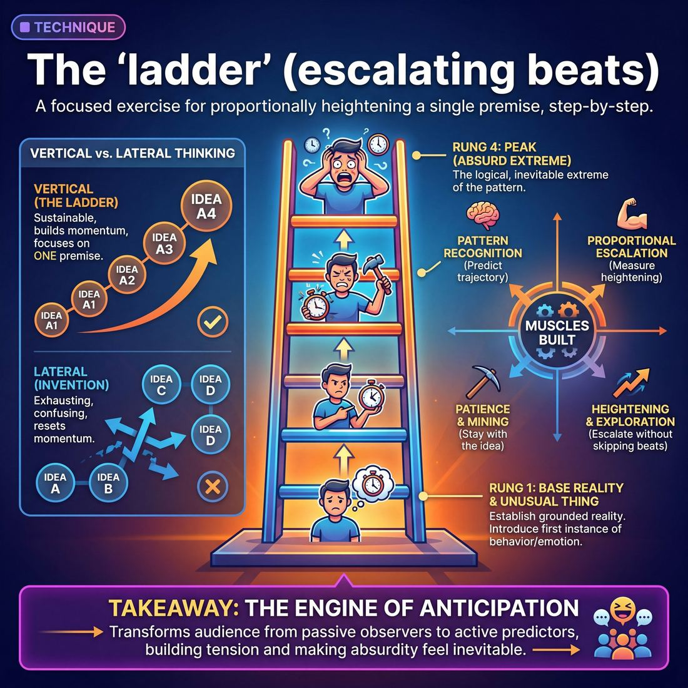

# 🎯 The 'ladder' (escalating beats)

> *A drillable muscle that trains **Heightening & Exploration**.*

{ .infographic }

## 🎯 The essence

The **ladder** is a focused exercise where players take a single unusual behavior, premise, or emotional reaction and deliberately escalate it step-by-step. It isolates and drills one essential muscle: **heightening**. Instead of inventing new ideas, bailing on the premise, or changing the subject when a scene stalls, players must climb the rungs of the ladder—making the established game bigger, more extreme, or more consequential with every single beat, while strictly maintaining the underlying logic of the scene.

## 🎓 What it trains

!!! abstract "The Core Muscle"
    The ladder isolates **Heightening** and **Exploration**—the ability to take a single comedic premise, behavior, or emotional truth and escalate it proportionally, step by step, without skipping beats or abandoning the idea.

Improvisers frequently struggle with what to do *after* they find the unusual thing in a scene (the **Game**). When faced with a great premise, untrained players usually make one of two mistakes: they either repeat the exact same behavior at the exact same intensity (plateauing), or they panic and immediately jump to the most absurd extreme imaginable (going straight to "crazy town" and breaking the scene's reality). 

The ladder exists to solve this pacing problem. It forces players to slow down and find the *next logical step* rather than the final step. 

By practicing this technique, you build several distinct muscles:

*   **Proportional Escalation:** You learn to measure your heightening. If rung one is "annoyed by a ticking clock," rung two shouldn't be "blowing up the building with dynamite." The ladder trains you to find the intermediate steps—moving the clock, smashing the clock, hearing phantom ticking.
*   **Patience and Mining:** It builds the discipline to stay with a single premise. Instead of inventing new, unrelated ideas when you feel stuck, you learn to dig deeper into the idea you already have.
*   **Pattern Recognition:** By consciously climbing steps, you train your brain to see the trajectory of a behavior. You begin to instinctively know where a scene is heading and what your scene partner needs next.

Ultimately, the ladder operationalizes the foundational improv principle: *"If this is true, what else is true?"* It bridges the gap between a novice who spots an unusual thing but doesn't know what to do with it, and a proficient player who can frame a game and escalate it so smoothly that the absurdity feels entirely inevitable.

## 💡 Why it works

The ladder works by fundamentally shifting an improviser's cognitive load. Instead of scrambling to invent *new* information, the brain is constrained to amplify the *existing* information. This constraint is the secret engine of comedic escalation and dramatic tension.

By isolating the act of heightening into distinct, escalating steps, the technique exploits three core dynamics:

1. **Removing the "What's Next?" Panic:** When improvisers don't know what to do, they often introduce random new elements. The ladder provides a reliable algorithm: *If X is true, what is More X?* This removes the pressure of pure invention and replaces it with logical deduction.
2. **Audience Pattern Recognition:** Human brains are wired to seek patterns. Once the first two "rungs" of the ladder are established, the audience subconsciously predicts the trajectory. The joy comes from fulfilling that prediction with surprising intensity.
3. **Building Inevitability:** In a strong scene, the stakes and the character's behavior should feel inevitable. The ladder trains the muscle of logical extremes, forcing the improviser to ask, "If they care about this at a level 3, what does it look like when they care at a level 10?"

!!! abstract "Vertical vs. Lateral Thinking"
    The ladder forces a shift from lateral to vertical movement in a scene:
    
    * **Lateral Thinking (Invention):** "I am mad at you for eating my sandwich. Also, the spaceship is crashing. Also, my leg hurts." *(Exhausting, confusing, resets momentum).*
    * **Vertical Thinking (The Ladder):** "I am mad at you for eating my sandwich. I am mad at you for eating my wedding cake. I am mad at you for eating my firstborn child." *(Sustainable, escalating, builds momentum).*

!!! tip "The Engine of Anticipation"
    Audiences don't laugh or gasp just because something is weird; they react because a built-up tension is released. The ladder manufactures that tension. When the audience sees you step onto rung two, they are already bracing for rung three. The mechanism works because it transforms the audience from passive observers into active predictors.

## 🧩 The setup

**Group Size & Arrangement**
*   **Players:** 4 to 8 players per group. This is enough to build a substantial escalation without the pattern dragging on so long that it exhausts the premise.
*   **Arrangement:** Players stand in a single straight line across the upstage area, facing the audience or the coach. 

**Space & Materials**
*   **Space:** A clear, open stage. 
*   **Materials:** None required. 

**Time**
*   **Per round:** 1 to 2 minutes per "ladder" (one full escalation from base to peak).
*   **Total duration:** 10 to 15 minutes, allowing each player the chance to initiate a base reality and to be the final, most extreme escalation.

**Roles**
*   **The Base (Player 1):** Steps forward to establish the grounded reality and introduces the first instance of the unusual thing, behavior, or emotion.
*   **The Climbers (Players 2+):** Step forward one by one, replacing the previous player, to heighten the pattern. They must make the behavior bigger, more specific, or raise the stakes, rather than inventing a new premise.
*   **The Coach:** Provides a starting suggestion (e.g., an emotion, a location, or a mundane activity), calls "Next" if a player hesitates, and calls "Scene" or "Reset" once the ladder reaches its logical, absurd extreme.

**Prerequisites**
*   Players should have a firm grasp of basic agreement ("Yes, And").
*   They should be at least at **Stage 1 or 2 of Game Identification**, meaning they understand the concept of an "unusual thing" even if they are still learning to spot it live. 
*   Crucially, players must understand the difference between *heightening* an existing idea and *inventing* a new one.

!!! tip "Physicalizing the beats"
    Have each player physically step forward downstage when it is their turn to heighten. This physical movement acts as a visual cue that a new **beat** has begun, helping players feel the momentum of the escalation in their bodies.

!!! quote "How to introduce it"
    "We are going to practice heightening a single idea without losing the core of what makes it interesting. We'll stand in a line upstage. Player One will step forward and establish a base reality with one unusual behavior or strong emotion. Player Two, you will step forward, replace Player One, and do the *exact same thing*, but turn the dial up by 10 percent. Player Three, you heighten Player Two. 
    
    We aren't changing the game; we are climbing a ladder. Each rung takes the same pattern and makes the stakes higher, the emotion deeper, or the specifics more absurd. Don't jump straight to a million—just take the next logical step up. Let's see how high we can climb before the ladder breaks."

## ⚙️ The mechanics

The core objective of the ladder is to practice **incremental heightening**. It trains improvisers to take a single comedic premise and escalate it step-by-step to its maximum logical absurdity, without skipping steps or plateauing. 

### The Flow of Play

A standard drill of the ladder involves two players and a coach, following a strict progression:

1. **The Base (Rung 1):** Two players establish a grounded **base reality** (who, what, where). One player introduces the first instance of the unusual thing. This is the seed of the game.
2. **The Acknowledgment (Rung 2):** The scene partner reacts to the unusual thing, framing it as unusual. The first player then repeats their unusual behavior, but with slightly more intensity, specificity, or stakes.
3. **Climbing the Rungs (Rungs 3–5):** The players consciously escalate the game. Every time the unusual behavior returns, it must be bigger than the last time. *Crucial constraint:* Each move must be a logical, proportional step up from the previous one.
4. **The Apex (Top Rung):** The scene reaches its natural climax—the most extreme, absurd, yet logically consistent manifestation of the original premise.
5. **Reset:** The coach calls "Scene" or "Reset" once the apex is reached, or if the players break the logic of the ladder. Two new players step up.

!!! example "In a scene: The 'Cheap' Ladder"
    * **Rung 1:** Reusing a paper towel.
    * **Rung 2:** Washing and hanging up a Ziploc bag to dry.
    * **Rung 3:** Asking for the neighbor's used dental floss.
    * **Rung 4:** Stealing copper wire from the walls of their own house to sell for scrap.
    * **Rung 5 (Apex):** Faking their own death to avoid paying a $5 parking ticket.

### Rules & Constraints

To build the muscle of deliberate heightening, players must adhere to three strict constraints during the drill:

* **No skipping rungs (The 1-to-10 Jump):** You cannot jump from a mild quirk straight to murder, divorce, or explosions. If you skip from Rung 1 to Rung 10, the scene loses its grounding, the logic breaks, and the audience stops caring.
* **No lateral moves (Plateauing):** A **lateral move** is doing something *different* but not *bigger*. If Rung 2 is "washing a Ziploc bag," Rung 3 cannot be "washing a paper plate"—that is the exact same level of cheapness. You must step *up*.
* **Stay on the same ladder (Consistency):** Do not change the game halfway up. If the game is about being cheap, do not suddenly escalate into being germaphobic. 

!!! tip "On stage: The 'If This, Then What?' Test"
    To find the next rung, ask yourself: *"If it is true that my character does X, what is the next logical, slightly more extreme thing they would do?"* Let the internal logic of the character dictate the heightening, rather than panicking and grabbing for a random joke.

## 🎬 Sample round

!!! example "Sample round: The Paranoid Potluck"
    **Context:** Two coworkers, Sarah and Mark, are planning the office holiday potluck. The game is Mark's extreme paranoia about food safety. 
    
    Watch how Mark climbs the ladder, escalating the absurdity one rung at a time, while Sarah acts as the voice of reason to ground the scene. If Mark jumped straight to the end, the scene would feel chaotic; by taking it step-by-step, the absurdity is earned.

    **Rung 1: The First Unusual Thing (Mild)**
    > **Mark:** I'll bring the potato salad. And I've already ordered the mandatory hairnets for everyone to wear while eating.  
    > **Sarah:** Hairnets? Mark, it's just the accounting team in the breakroom.  
    
    *Mechanic in action:* The base reality is set, and the first unusual thing is introduced. It's weird, but not impossible. Sarah grounds it by pointing out the reality of the situation.

    **Rung 2: The First Escalation (Moderate)**
    > **Mark:** Exactly, and accounting is a high-risk zone. That's why I'm also installing a sneeze-guard over the buffet and a UV sanitation airlock at the door.  
    > **Sarah:** I don't think HR will let you build an airlock by the fridge.  
    
    *Mechanic in action:* Mark steps up the ladder. He justifies his initial fear ("high-risk zone") and raises the stakes from simple wearable nets to actual architectural changes. 

    **Rung 3: The Steep Escalation (Severe)**
    > **Mark:** HR doesn't need to know about the Level 4 Hazmat team I hired to swab Linda's deviled eggs for pathogens. They arrive at noon.  
    > **Sarah:** You hired a government biohazard team for deviled eggs?  
    
    *Mechanic in action:* The absurdity spikes. We are now in heightened comedic territory, but it still strictly follows the logical progression of "keeping the potluck safe."

    **Rung 4: The Logical Extreme (The Top of the Ladder)**
    > **Mark:** Look, to be absolutely safe, I've canceled the food entirely. I've distributed sealed tubes of sterile nutrient paste to everyone's desks. We will consume them in our cars, with the windows rolled up, making zero eye contact.  
    
    *Mechanic in action:* The ultimate conclusion of the pattern. The game has been fully explored and pushed to its breaking point. The ladder has been successfully climbed.

## 🎚️ Variations & progressions

The basic ladder isolates the muscle of heightening. Once players understand the mechanics of stepping up, you can adjust the "rungs" to target specific weaknesses in game identification, stakes, and narrative architecture. 

Here is how to ramp the difficulty as players mature:

**1. The Literal Ladder (Novice to Advanced Beginner)**
At this stage, players often struggle to spot the unusual thing live. The Literal Ladder removes the pressure of scene-building and focuses purely on magnitude. If the base reality establishes a character who likes salt, the progression is strictly quantitative: adding extra salt to fries $\rightarrow$ eating a salt lick $\rightarrow$ drinking the Dead Sea. 
* **Focus:** Training the brain to identify the game and simply amplify it.

**2. The Stakes Ladder (Competent)**
Once players can identify the game during the scene, shift the focus from making the *object* bigger to making the *consequence* bigger. Instead of heightening the absurdity of the action, heighten what is at risk for the character. 
* **Focus:** Moving from playing empty activities to establishing a genuine **Want**. 

!!! example "In a scene: Literal vs. Stakes"
    **Base:** A character is obsessively cleaning a spotless kitchen.
    * **Literal heightening:** They bring out a toothbrush, then a microscope, then a laser.
    * **Stakes heightening:** They are cleaning for their mother-in-law's visit, then we learn their marriage depends on this visit, then we learn the mother-in-law is the CEO of the company they are trying to pitch.

**3. The Lateral Ladder (Proficient)**
Proficient players can frame the game early. The Lateral Ladder challenges them to heighten via the principle of *"If this is true, what else is true?"* rather than just doing "more of the same." The escalation moves outward into the world, applying the character's unusual philosophy to entirely new contexts.
* **Focus:** Letting the stakes fuel the scene and expanding the game without breaking the reality.

### Common Structural Variants

To drill specific mechanics, try these structural variations of the exercise:

* **The Tag-Out Escalation:** Instead of a single continuous scene, players use **tag-outs** to jump forward in time or space, showing the next logical extreme of the game. This trains players to edit ruthlessly and cut straight to the next beat.
* **The Silent Ladder:** Players must escalate the tension, stakes, or unusual behavior using *only* physicality, proximity, and facial expressions. This removes the crutch of dialogue and forces players to rely on stage picture.
* **Peas in a Pod:** Two players share the exact same unusual behavior and heighten *each other* in a feedback loop, while a third player acts as the grounded "voice of reason." This trains agreement and shared game-playing.

!!! tip "On stage: Earning the transition"
    A common mistake when ramping difficulty—especially in the Stakes or Lateral variations—is abandoning the gradual climb. Remind players that even when shifting contexts or raising emotional stakes, the steps must remain evenly spaced. Earn the escalation before jumping to life-or-death scenarios.

## 🧑‍🏫 Coaching notes

When coaching the ladder, your primary job is managing pace. Players naturally want to rush to the biggest, craziest idea because it feels safe to get to the punchline quickly. You are there to slow them down, forcing them to explore the rich comedic space between "slightly unusual" and "utterly absurd."

!!! tip "Coaching: 'Find the middle step'"
    The single most important cue you can give to prevent skipped rungs is: **"Find the middle step."** When a player jumps from a mild quirk (stealing a pen) directly to a felony (robbing a bank), stop the scene. Ask: *"What is the step between a pen and a bank?"* Force them to climb the ladder one rung at a time (e.g., stealing a stapler, then a coworker's lunch, then the office water cooler) before they are allowed to hit the extremes.

### High-Impact Side-Coaching Cues

Use these short, direct prompts while the scene is in motion to steer the escalation:

*   **"If this is true, what else is true?"** — The classic prompt. Use this when players stall or repeat the exact same joke. It forces them to extrapolate the next logical consequence of the unusual thing.
*   **"Heighten the concept, not the volume."** — Call this out when players try to escalate by simply yelling, talking faster, or becoming physically frantic. Remind them that true heightening is conceptual, not just energetic.
*   **"Keep the game, change the context."** — If they have exhausted the current setting, prompt them to initiate a time dash or location shift. Seeing the same behavior in a higher-stakes environment is a natural step up the ladder.
*   **"Ground the reaction."** — As the unusual behavior gets more extreme, the emotional stakes must remain tethered to reality. Remind the "straight man" or voice of reason to react authentically to the escalating absurdity.

### What 'Good' Looks and Sounds Like

You will know the technique is clicking when you observe:
1.  **A recognizable pattern:** The core game remains crystal clear at rung 1 and rung 10. The players haven't mutated the game into something else; they have just magnified it.
2.  **Inevitable progression:** Each beat feels like a logical, unavoidable consequence of the previous one. The audience should be able to anticipate the *direction* of the next step, even if the specific joke surprises them.
3.  **Elastic reality:** The base reality stretches to accommodate the absurdity but doesn't entirely snap until the very top of the ladder.

## 🧭 Debrief & reflection

After running the exercise, the debrief shifts the players' focus from the pressure of inventing to the clarity of analyzing. The goal is to build their pattern-recognition muscle, helping them transition from naming the game *after* the scene to identifying and playing it *during* the scene.

Use these targeted questions to unpack the round and lock in the mechanics of heightening:

*   **"What was the very first rung of the ladder?"** 
    Force players to identify the exact moment the unusual thing was introduced. If the group can't agree on what the first rung was, it explains why the subsequent escalation felt muddy.
*   **"Did we step *up*, or did we step *sideways*?"** 
    This is the most critical distinction in the exercise. Ask the players to evaluate if a beat actually raised the stakes/absurdity (a vertical step up the ladder) or if it was just a different example of the exact same behavior (a lateral move). 
*   **"Did we skip a rung?"** 
    Ask if the escalation felt earned. Did the scene jump from a minor annoyance straight to murder? Identifying "skipped rungs" helps players understand the need for gradual, logical progression.
*   **"Where did the ladder plateau or break?"** 
    Pinpoint the moment the scene lost its momentum. Was it because a player denied the premise, or because they ran out of ideas and stopped heightening?

!!! abstract "What a good debrief surfaces"
    A successful reflection period will lead players to a few key "aha!" moments:
    
    1.  **The Lateral Trap:** Players will realize how often they substitute *variety* for *escalation*. (e.g., "I realized I just named three different types of weird hats, rather than making the hat situation *worse*.")
    2.  **The Missing Wall:** Players will notice that a ladder needs something solid to lean against. If the base reality wasn't established, the escalating beats felt chaotic and ungrounded.
    3.  **Emotional vs. Logical Heightening:** Players will discover that when they run out of logical or absurd ways to heighten a premise, they can always step up the ladder by heightening the *emotion* or the *stakes* for the character.

!!! tip "Coach's Focus"
    Keep the debrief objective and analytical. Use the language of the technique ("base reality," "first rung," "lateral move," "escalation"). When a player successfully identifies a lateral move they made in the moment, celebrate that recognition—it is the exact skill required to self-correct in a live show.

## ⚠️ Common pitfalls

!!! warning "Watch out: Jumping straight to a 10"
    The most common novice trap is blowing out the scene too early. If the first rung of the ladder is "I'm slightly annoyed you tapped your pencil," the panicked novice jumps immediately to "I am going to murder you with a chainsaw!" You have skipped rungs 2 through 9. Once you hit a 10, the ladder is over, and the scene has nowhere left to go but down. 

When improvisers first practice the ladder, the cognitive load of tracking the game, remembering the last beat, and inventing the next one often causes the technique to break down. Watch for these specific traps:

* **Lateral Heightening (The "List" Trap):** Instead of climbing the ladder, the improviser walks sideways. They change the subject matter without raising the intensity. If the game is "being overly protective of a car," a lateral move is listing other things they protect ("Don't touch my bike either. Or my boat."). 
    * *The Fix:* Escalate the *behavior* or the *consequence*, not the noun. Move from "Don't touch the paint" to "I require all passengers to wear sterile hazmat suits."
* **Losing the Base Reality:** In the rush to escalate, players abandon the grounded context of the scene. The escalation becomes untethered, absurd noise. The audience stops caring because the stakes no longer feel real.
    * *The Fix:* Ground the scene after every escalation. Use the "straight man" or voice of reason to react truthfully to the absurdity, re-establishing the reality before taking the next step up.
* **The "Thinking" Freeze:** You can literally see the improviser's eyes glaze over as they step out of the scene to mathematically calculate the next perfect rung. This cognitive overload kills the pacing and the reality of the moment.
    * *The Fix:* Stop thinking and start feeling. If you can't think of a clever factual escalation, simply escalate your **emotion**. Feeling the exact same way, but 15% harder, is a perfectly valid step up the ladder.

!!! tip "On stage: Resetting the baseline"
    If you realize you've accidentally jumped too high too fast, don't panic. Treat that extreme reaction as the new baseline, justify *why* you reacted so strongly, and start a new ladder from there.

## 🌟 What mastery looks like

When improvisers master the ladder, the mechanics of the exercise completely vanish. You no longer see actors "trying to heighten" or mentally calculating their next move; instead, you see characters driven by an inevitable, escalating logic. The progression feels both surprising and entirely earned.

At the highest level of proficiency, mastery of the ladder is observable through three distinct behaviors:

*   **Granular pacing (Hitting every rung):** Masters do not skip from a level 2 to a level 10. They have the patience to explore the **micro-escalations**—the 3, the 4, the 5. They trust that a small, specific heightening of the game is funnier and more sustainable than a massive, unearned leap into crazy town.
*   **Grounded absurdity:** As the external behavior climbs the ladder and becomes more ridiculous, the master's emotional reality deepens. They make the audience genuinely care about absurd people because the character's internal stakes perfectly match the external escalation. The "want" is deeply felt, not just stated.
*   **The intentional break:** A master knows exactly when the ladder has run out of rungs. Rather than forcing an impossible, exhausting escalation that shatters the reality of the scene, they find, play, and *intentionally break* the game. They recognize the apex has been reached and seamlessly shift the scene's engine to provide a satisfying resolution or a new narrative tilt.

!!! example "In a scene: The Escalation of a Complaint"
    **Competent:** The improviser jumps the rungs. They go from "This soup is cold" (Rung 1) straight to "I am blowing up this restaurant with dynamite!" (Rung 10). The scene has nowhere left to go, and the reality is broken.
    
    **Master:** The improviser climbs steadily, justifying every step. "This soup is cold" (Rung 1) escalates to "I am writing a stern Yelp review right now" (Rung 3), to "I am buying this restaurant just to fire the chef" (Rung 6), to "I am dedicating my family's entire fortune to destroying the global concept of soup" (Rung 9). The audience follows them all the way to the top because every step made logical sense to the character.

!!! abstract "Key idea: Invisible Technique"
    Mastery means reading what the scene needs and serving it invisibly. The ladder is a structural tool, but in the hands of a master, it simply looks like brilliant, spontaneous human behavior.

## 🔗 Why it matters

The ladder is the architectural scaffolding of momentum. In the wider craft of improvisation, mastering this technique is what separates scenes that merely *exist* from scenes that actually *go somewhere*. 

By isolating the act of escalating beats, this technique directly builds the muscle of heightening and exploration. It forces improvisers to stop inventing random, disconnected details and instead ask: *"If this is true, what is the inevitable next step?"* 

!!! abstract "The Antidote to Invention"
    Novice improvisers often confuse *heightening* with *inventing*. When a scene feels stuck, they introduce a completely new element (a gun, an alien, a sudden heart attack). The ladder trains you to stop reaching outward for new ideas and instead reach *upward*, mining the current reality for its next logical extreme.

At the domain level—architecting compelling scenes in real time—the ladder is the primary tool for managing pacing and consequence across both engines of improv:

*   **In Game-driven scenes:** The ladder provides the structure for comedic beats. It ensures the unusual thing doesn't just repeat at the same intensity (plateauing) or jump immediately to an absurd extreme (blowing out the game). It teaches the discipline of incremental, satisfying escalation.
*   **In Narrative-driven scenes:** The ladder represents the rising action. It is how a character's **Want** meets increasing resistance, and how the **Stakes** are raised. 

Practicing the ladder pushes an improviser through the maturity progression. A Novice often plays "activities with no reason to care," letting a scene wander aimlessly. As they internalize the ladder, they become Competent at establishing what is at risk, deliberately tilting the platform. Eventually, this muscle memory allows a Proficient improviser to craft scenes where the story arc and character change feel inevitable, and the stakes fuel the scene organically. 

Ultimately, the ladder matters because it teaches **consequence**. It proves to the audience that the improvisers are paying attention to their own creation, honoring the reality they've built by taking it to its most satisfying, logical conclusion.

## 📚 References & Further Reading

### Foundational sources
*   **Matt Besser, Ian Roberts, and Matt Walsh, *The Upright Citizens Brigade Comedy Improvisation Manual* (2013)** — The definitive text on identifying the "Game of the Scene" and the algorithmic approach to heightening via the foundational question, "If this is true, then what else is true?" — https://ucbcomedy.com/product/ucb-comedy-improvisation-manual/
*   **Charna Halpern, Del Close, and Kim "Howard" Johnson, *Truth in Comedy: The Manual of Improvisation* (1994)** — The bedrock guide to long-form improv that first codified the importance of finding, playing, and escalating patterns rather than inventing random jokes.

### Practitioner guides & manuals
*   **Will Hines, *How to Be the Greatest Improviser on Earth* (2016)** — Breaks down the mechanics of "Vertical vs. Horizontal" heightening, where vertical heightening acts as the ladder (doing the exact same thing, but bigger) to avoid exhausting lateral invention. — https://www.wgimprovschool.com/book
*   **Mick Napier, *Improvise: Scene from the Inside Out* (2004)** — Features specific solo and group exercises on "Heightening," drilling the muscle of building on the previous line's energy and point of view without bailing on the premise.

### Lineage & teachers
*   **The Upright Citizens Brigade (UCB)** — The theater and training center that most rigorously codified the "Game" and the step-by-step escalation of a single comedic premise.
*   **World's Greatest Improv School (WGIS)** — Founded by Will Hines, this school heavily emphasizes the mechanics of "playing the pattern" and the discipline required to escalate a beat proportionally.
*   **The Annoyance Theatre** — Founded by Mick Napier, this theater champions a highly individual-focused approach to heightening, emphasizing taking care of your own character's escalation first before relying on a scene partner.

### Communities & adjacent reading
*   **Will Hines, *Improv Nonsense* (Substack)** — Hines' long-running newsletter frequently dissects the exact mechanics of heightening, including deep dives into vertical escalation and pattern recognition. — https://improvnonsense.substack.com/

## 💬 Quotes & Anecdotes

!!! quote "— Matt Besser, Ian Roberts, and Matt Walsh, *The Upright Citizens Brigade Comedy Improvisation Manual* (2013)"
    The game makes being funny in a Long Form scene easier by forcing you to focus on a single comic idea. Its nature is to take away options so that you and your scene partner don't have to keep searching for new unusual, funny things... The method is asking the question “if this unusual thing is true, then what else is true?” to build your scene off of your initial funny discovery.

!!! quote "— Matt Besser, *Interview with The Comic's Comic* (2013)"
    'Yes, and' pretty much begins the scene, but once you get into the game of the scene — in our language — we get into what is called 'if, then.' Which is, if this unusual thing is true, then what else is true? To me, that's an easier way to understand how comedy works.

### Where it comes from

While the general concept of "heightening" or "raising the stakes" has existed in theatre for centuries, the specific mechanics of the "ladder"—escalating a single comedic game step-by-step without inventing new premises—was heavily codified by the Upright Citizens Brigade (UCB). Building on the long-form foundation laid by Del Close at Chicago's iO Theater, UCB founders Matt Besser, Ian Roberts, Matt Walsh, and Amy Poehler turned heightening into a reliable algorithm. They popularized the foundational question, *"If this unusual thing is true, then what else is true?"*, shifting improvisers away from pure invention and toward logical, vertical escalation.

### A telling example

To see the difference between lateral invention and climbing the ladder (vertical heightening), consider an illustrative scene that starts with a couple on a romantic picnic. 

**The Base Reality & First Unusual Thing:** The boyfriend reveals he forgot to bring any cutlery. 

**The Lateral Mistake (Bailing):** 
*   *Boyfriend:* "I forgot the forks. Also, I think a bear is coming! And my dad is an alien!" 
*   *Why it fails:* The improviser panicked and invented entirely new, unrelated information. The scene loses its grounding, confuses the audience, and resets its momentum.

**Climbing the Ladder (Vertical Heightening):**
*   *Rung 1:* "I forgot the forks. We'll just have to eat this potato salad with our hands." *(Establishing the game: he is underprepared but overly committed to making it work).*
*   *Rung 2:* "I also forgot the cups. Just cup your hands together and I'll pour the hot thermos coffee into your palms." *(Heightening the stakes and the absurdity of his makeshift solutions).*
*   *Rung 3:* "I didn't bring a blanket, either. Just lie down in this patch of poison ivy, it's nature's velvet." *(Escalating the physical consequence).*
*   *Rung 4:* "I forgot the car. We walked here. I'll fashion a crude saddle out of these vines and ride a deer home." *(The logical, absurd extreme of being underprepared but relentlessly optimistic).*

By climbing the ladder, the improviser doesn't need to invent a bear or an alien; they just need to make the *existing* problem progressively worse.

## 🧭 Explore the framework

- ⬆️ **Skill it trains:** [Heightening & Exploration](03_S2__heightening-and-exploration.md)
- 🎭 **Domain:** [The Scene](03_D__the-scene.md)
- 🔁 **Sibling techniques:** [Exploring the 'why'](03_S2_T2__exploring-the-why.md)
