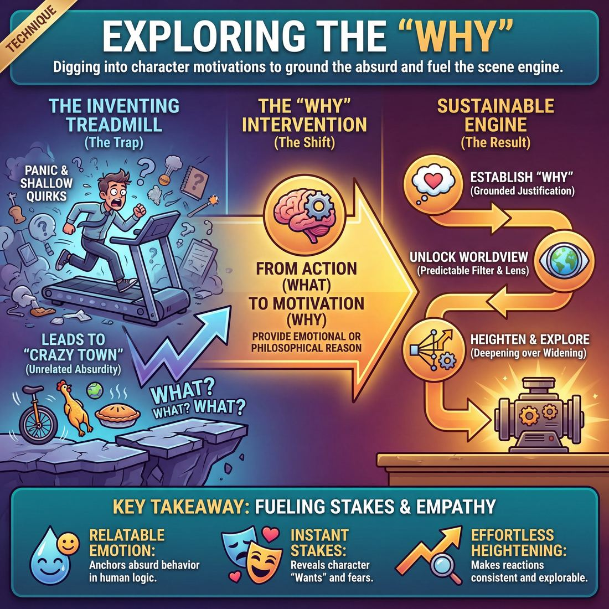

# 🎯 Exploring the 'why'

> *A drillable muscle that trains **Heightening & Exploration**.*

{ .infographic }

## 🎯 The essence

**Exploring the 'why'** is a targeted scene exercise that forces improvisers to stop inventing new plot points and instead dig downward into a character's underlying motivations. At its core, it isolates and drills the muscle of **justification**—the act of providing a grounded, emotional, or philosophical reason for an unusual behavior. By actively interrogating *why* a character cares or acts the way they do, players practice anchoring absurd premises in relatable human logic, transforming a fleeting joke into a sustainable, explorable scene engine.

## 🎓 What it trains

This technique exists to solve one of the most common traps in improvisation: the **Inventing Treadmill**. Many improvisers can easily spot an unusual behavior or establish a fun premise (the "what"). But when they don't know how to develop it, they panic. They either invent entirely new, unrelated quirks, or they simply repeat the original joke louder and faster. This leads to shallow scenes, flat characters, and the dreaded **Crazy Town**—a world where absurd things happen for absolutely no reason.

Exploring the 'why' solves this by shifting the improviser's focus from *action* to *motivation*. By drilling this technique, you train three critical facets of **Heightening & Exploration**:

* **Deepening over widening:** Instead of heightening by making an action physically bigger or wackier, you heighten by revealing the philosophy behind it. 
* **Fueling the engine:** Once you establish a character's "why," you unlock a specific, repeatable worldview. This worldview becomes the engine for the rest of the scene, allowing the character to react to *any* new information through that specific, distorted lens.
* **Grounding the absurd:** It forces players to treat unusual behavior as completely rational to the character performing it. This builds empathy and makes the audience genuinely care about absurd people.

!!! abstract "The Shift: From 'What' to 'Why'"
    * **The "What":** The observable action or unusual behavior. *(e.g., A character is meticulously ironing their socks.)*
    * **The "Why":** The emotional or philosophical justification. *(e.g., "If my feet aren't perfectly crisp, I'll lose my ruthless edge at the accounting firm.")*

Ultimately, this technique trains players to anchor their scenes in **Stakes** and **Wants**. It bridges the gap between a novice who plays activities with no reason to care (Stage 1) and a proficient player whose stakes are deeply felt, naturally fueling the scene's progression without needing to be explicitly stated (Stage 4).

## 💡 Why it works

At its core, exploring the "why" works because it shifts the improviser’s cognitive load from **fabrication** (inventing new, random details to keep the scene alive) to **justification** (making sense of the details that already exist). 

When a scene stalls, the panic-response is often to add more crazy actions. Exploring the "why" interrupts this panic by forcing the brain to look inward rather than outward. It exploits our natural human drive for psychological sense-making. 

Here is the engine under the hood of this technique:

*   **It grounds the absurd in relatable emotion:** An audience will laugh at a bizarre action, but they will *invest* in the emotional reason behind it. By answering "why," you tether a cartoonish choice to a recognizable human vulnerability.
*   **It generates immediate stakes:** The moment a character explains *why* they are doing something, they reveal what they care about. This automatically establishes the character's "Want"—the underlying desire or fear driving their behavior—which instantly raises the stakes of the scene.
*   **It creates a behavioral filter:** Once you establish a character's core philosophy or motivation, you no longer have to guess how they will react to new information. The "why" becomes a predictable lens through which they view the world, making heightening effortless.

!!! example "In a scene: 'What' vs. 'Why'"
    Imagine a character obsessively measuring the distance between the couch and the TV. 
    
    *   **Exploring the "What" (Action):** They pull out a laser pointer, then a protractor, then call in a surveyor. *(This escalates the crazy, but quickly runs out of steam).*
    *   **Exploring the "Why" (Motivation):** They explain, "If the couch is exactly 72 inches away, it means we have a normal living room, and if we have a normal living room, it means my marriage isn't falling apart." *(This instantly provides emotional depth, stakes, and a clear direction for the scene).*

!!! abstract "Key idea: Fueling both engines"
    Improv relies on two primary engines: **Game** (comedic pattern) and **Story** (narrative arc). Exploring the "why" feeds both simultaneously. If the scene leans toward Game, the "why" becomes the absurd, repeatable logic you can heighten. If the scene leans toward Story, the "why" reveals the character's emotional wound or flaw that the narrative will eventually challenge and change.

## 🧩 The setup

Here is everything you need to arrange before running this drill. Because exploring the "why" requires focus and active listening, it is best run as a "fishbowl" exercise where the whole group watches one pair at a time.

*   **Players & Arrangement:** 8 to 12 players. The group forms a semi-circle acting as the audience, with two players stepping into the center "stage" for each round.
*   **Space & Materials:** An open rehearsal space or stage. Have two chairs available; starting a scene seated helps players focus on dialogue and psychology rather than pacing the stage.
*   **Time:** 15–20 minutes total. Allocate about 60 to 90 seconds per pair. The goal is to hit the justification and heighten it once or twice, then immediately edit. 
*   **Roles:**
    *   **The Initiator:** Steps out and establishes a clear, singular unusual thing—this could be a strange physical action, a bizarre opinion, or a disproportionate emotional reaction (the *what*).
    *   **The Partner:** Steps out to meet them. Their sole job is to accept the unusual thing and help discover the justification—the *why* behind the behavior. They do this by making a strong assumption or asking a grounded, specific question.
    *   **The Coach:** Calls "Scene" to start and "Edit" to end. The coach must ruthlessly pause the action if players start inventing *new* unusual things instead of explaining the first one.
*   **Prerequisites:** Players should already be comfortable with basic agreement ("Yes, And") and have a foundational ability to spot the unusual thing in a scene. 

!!! tip "Facilitator Script: How to introduce it"
    "Improvisers are great at inventing weird, crazy things. But a weird thing on its own is just a gimmick; it doesn't give us a scene. What makes the unusual thing funny, relatable, and playable is the *reason* behind it. 
    
    In this drill, Player A is going to initiate with something unusual. Player B, you are not going to match their crazy, and you are not going to invent a second crazy thing. Your only job is to help us figure out *why* Player A is doing what they are doing. Ground them. Give them a reason. Once we know the 'why', we have our Game, and we can play."

## ⚙️ The mechanics

!!! abstract "The Core Loop"
    The objective of **Exploring the 'why'** is to pause the forward momentum of the plot (the "what happens next") and drill vertically into a character's psychology (the "why are they doing this"). It relies on a simple loop: **Initiation $\rightarrow$ Curious Probe $\rightarrow$ Internal Justification $\rightarrow$ Deeper Probe**.

The engine of this technique borrows from the "Five Whys" of root-cause analysis, but applies it to comedic or dramatic character psychology. Instead of building the scene outward, players build it downward, peeling back layers until they hit the character's bedrock worldview.

### The Flow of Play

1. **The Initiation:** Player A begins the scene with a strong, specific statement of opinion or an unusual action (the **Base Reality** with a hint of the unusual). 
2. **The Curious Observer:** Player B acts as the proxy for the audience. Instead of adding a new premise or advancing the plot, Player B asks a question focused entirely on Player A's motivation (e.g., *"Why do you cut your sandwiches with a protractor?"*).
3. **The First Justification:** Player A answers the question. This answer must be a justification that makes perfect sense to the character, revealing the first layer of their internal logic.
4. **The Deepening:** Player B actively listens to the justification and probes *that specific answer* with another question. They do not ask about the sandwich anymore; they ask about the new philosophy Player A just revealed.
5. **The Bedrock:** This loop repeats 3 to 5 times until Player A articulates a fundamental, playable worldview—a core philosophy that explains not just the sandwich, but how they view the entire universe.

### Rules & Constraints

To keep the exercise focused on exploration rather than invention, enforce these strict boundaries:

* **Curiosity, not conflict:** Player B must be genuinely fascinated by Player A, not annoyed or argumentative. If Player B attacks, Player A will become defensive, which shuts down exploration.
* **Internal over external:** Player A must find reasons *inside* themselves (their fears, desires, or bizarre logic). They cannot blame external circumstances (e.g., *"Because my wife told me to"* or *"Because the instructions say so"*). 
* **No plot advancement:** Neither player is allowed to introduce a new event, change locations, or talk about what they are going to do next. The entire exercise exists in the present moment of unpacking the initial choice.

!!! tip "On stage: The 'Yes, And' of Questions"
    In standard improv, we are taught to avoid asking questions because they often force our partner to do all the inventive work. In this specific technique, questions are the *tool of exploration*. However, Player B's questions must be **loaded with listening**. *"Why do you say that?"* is okay, but *"Why does symmetry make you feel safe?"* is a brilliant, supportive probe that builds on Player A's previous answer.

### How a Round Ends & Resets

A round does not end when a story resolves; it ends when the **Game Identification** is complete and the character's core "Want" or philosophy is fully exposed. 

The coach or director calls "Scene!" the moment Player A delivers a line that perfectly encapsulates their absurd or profound worldview (the "Bedrock"). The players step back, and two new players step up to initiate a completely new scenario, resetting the loop.

## 🎬 Sample round

!!! example "Sample round: The Breakroom"
    In this scene, notice how the players transition from simply observing a weird behavior (the "What") to discovering the character's underlying philosophy (the "Why"). 

    **Mark:** *(Crunching loudly)* "Mmm. Good turkey."  
    **Sarah:** "Mark, you're eating the plastic wrapper."  
    > *Step 1: Naming the unusual behavior. Sarah establishes the "What."*  

    **Mark:** "Yeah, I am."  
    **Sarah:** "But... *why*? It's literally garbage."  
    > *Step 2: The Prompt. Sarah actively pushes for the "Why," forcing Mark to justify the behavior rather than just repeating the weird action.*  

    **Mark:** "Because if I take the wrapper off, the sandwich touches the breakroom air. And the breakroom air is full of everyone's complaints about the new software. I can't ingest that kind of negativity."  
    > *Step 3: The Justification. Mark provides the "Why." We now have a clear, playable worldview: Mark is terrified of physically absorbing other people's bad vibes.*  

    **Sarah:** "So you're eating polyethylene to protect your peace?"  
    > *Step 4: Framing. Sarah clarifies and locks in this new philosophical truth, ensuring both players (and the audience) understand the game.*  

    **Mark:** "Exactly. It's the same reason I wear earplugs when I drink water. Hydration requires absolute emotional silence."  
    > *Step 5: Heightening the "Why." Mark heightens the scene based on his philosophy, not his initial action. He isn't eating more plastic; he is applying his hyper-paranoid wellness routine to a brand new activity.*

By shifting the focus from the physical action (eating plastic) to the emotional motivation (avoiding negativity), the improvisers unlock an infinite engine for the scene. They are no longer trapped talking about a sandwich; they can now explore how this philosophy affects Mark's entire life.

## 🎚️ Variations & progressions

The practice of **Exploring the 'why'** can be scaled from simple, rapid-fire justification drills to complex exercises in character philosophy. As players move through the maturity stages—from playing activities with no reason to care (Novice) to making the audience genuinely care about absurd people (Master)—the focus shifts from *inventing an excuse* to *discovering a worldview*.

Here are the most common variations, ordered by difficulty:

### 1. The "Because" Circle (Novice to Advanced Beginner)
A rapid-fire warm-up designed to build the reflex of immediate justification. 
*   **The mechanics:** Players stand in a circle. Player A turns to Player B and performs a bizarre physical action or makes an unusual statement (e.g., aggressively tearing up a newspaper). Player B asks, "Why are you doing that?" Player A must immediately answer starting with the word "Because..." (e.g., "Because the crossword puzzle called me a coward!"). 
*   **The goal:** Break the habit of freezing when challenged. It trains players to state a "Want" or a reason, even if it's clumsy at first.

### 2. The Press Conference (Competent)
A sustained exercise in deepening a single character's 'why' under pressure.
*   **The mechanics:** One player sits in a chair with a highly unusual belief or behavior (e.g., "I believe all dogs are undercover cops"). The rest of the group acts as reporters. Instead of asking *what* the player believes, the reporters specifically ask questions that force the player to explain *why* they believe it, *how* it affects their daily life, and *what* is at stake for them.
*   **The goal:** Moves players from simply naming a game to establishing what is actually at risk for the character. It forces the improviser to build a cohesive philosophy rather than just repeating the initial joke.

!!! example "In a scene: The 'Five Whys' Progression"
    Borrowing from root-cause analysis, you can challenge Competent and Proficient players to drill down into a character's motivation by asking "why" multiple times in a scene, moving from surface-level complaints to deep emotional stakes.
    
    *   **Level 1 (The What):** "I'm furious that you bought generic peanut butter."
    *   **Level 2 (The immediate Why):** "Because it separates and gets oily!"
    *   **Level 3 (The deeper Why):** "Because I don't have the time or energy to stir my food!"
    *   **Level 4 (The core Stake):** "Because I am holding this family together by a thread, and if I have to stir one more thing, I'm going to shatter!"

### 3. Endowing the 'Why' (Proficient)
Instead of explaining your own unusual behavior, you explain your partner's. 
*   **The mechanics:** Player A initiates with a strange action or emotion. Instead of Player A explaining themselves, Player B provides the 'why' (e.g., "I know why you're staring at that toaster, Dave. You still think it's judging your promotion."). Player A must accept this endowment and heighten it.
*   **The goal:** Trains players to frame the game for each other and ensures that stakes are felt and shared, not just generated in isolation.

### 4. The Silent 'Why' (Mastery)
For advanced players who can architect a full arc in real time.
*   **The mechanics:** Players perform a scene where a character has a deep, driving 'why' (a secret, a burning desire, a profound fear), but they are **never allowed to state it out loud**. They must play the *symptoms* of the 'why' through their reactions, choices, and treatment of their partner.
*   **The goal:** Proves that the 'why' doesn't need to be spoken to fuel the scene. It trains players to read what the scene needs and serve it invisibly, allowing the audience to feel the stakes without being spoon-fed the exposition.

!!! tip "On stage: Switching Engines"
    When practicing these variations, pay attention to which engine the 'why' is fueling. If the 'why' is absurd and repeatable ("I hate generic peanut butter because it's plotting against me"), you are fueling the **Game engine**. If the 'why' reveals vulnerability and drives the character toward a difficult choice ("I hate generic peanut butter because it reminds me we're broke"), you are fueling the **Narrative engine**. A Master improviser knows which one they just created and plays accordingly.

## 🧑‍🏫 Coaching notes

When coaching players to explore the "why," your primary goal is to shift their focus from inventing *what* is happening to justifying *why* it is happening. Players naturally want to keep adding new, wacky details to a scene. Your job is to act as the brakes, forcing them to pause, dig down, and articulate the internal logic or philosophy behind their behavior.

!!! tip "Coaching: The Golden Question"
    **"If this is true, why is it true?"**  
    This is the single most important cue you can give from the sidelines. When a player establishes an unusual thing or a strong emotional reaction, do not let them move on to a new idea. Call out: *"Why do you care?"* or *"Justify that!"* Force them to articulate the worldview driving their behavior. 

### Effective Side-Coaching Cues
Use these short, direct prompts while the scene is in motion to steer players toward justification:

*   **"Give me a 'Because' statement."** (Forces the player to explicitly link their action to a reason.)
*   **"What is your philosophy here?"** (Elevates a quirky action into a deeply held belief system.)
*   **"Stay there. Explain."** (Stops the player from fleeing a vulnerable or absurd moment by changing the subject.)
*   **"Make it personal."** (Pushes the player to connect the "why" to their specific character's history or emotional state, raising the stakes.)

### What "Good" Looks and Sounds Like
You will know the technique is working when you observe the following shifts in the room:

*   **The scene deepens, not widens:** Instead of a parade of random, disconnected weird events, the scene focuses on one specific behavior and mines it for emotional truth. 
*   **Declarative statements emerge:** You will hear players using phrases like *"I just believe that..."*, *"The reason I do this is..."*, or *"Ever since I was a kid..."*
*   **The absurd becomes relatable:** A novice plays an activity with no reason to care. A competent player establishes what is at risk. When a player successfully explores the "why," the audience suddenly understands the emotional core of a bizarre character, moving the scene toward proficient narrative architecture where stakes are felt, not just stated.

!!! note "Watch the pacing"
    Exploring the "why" often requires the scene to slow down. If players are speaking rapidly or physically rushing around the stage, they are likely stuck in the "what." Coach them to take a breath, make eye contact, and deliver their justification with weight.

## 🧭 Debrief & reflection

A strong debrief for this technique shifts the players’ focus away from *what* happened in the scene and toward *how* the scene felt once the underlying motivations were exposed. The goal is to help improvisers recognize the difference between **lateral invention** (adding new, unrelated facts) and **vertical exploration** (drilling down into the truth of what is already there).

Use these questions to guide the post-round discussion:

*   **"How did the scene's momentum change once the 'why' was spoken out loud?"** 
    *Players will often note that the scene suddenly felt easier. They no longer had to invent new things to do; they just had to view the world through the lens of that newly discovered philosophy.*
*   **"Did the justification make the character feel more grounded, or more absurd?"** 
    *A good debrief surfaces the paradox of improv: the more deeply and sincerely a character believes in their bizarre logic, the more real (and hilarious) they become to the audience.*
*   **"Were you playing an emotional 'why' or a logical 'why'?"** 
    *Help players distinguish between a heady, intellectual excuse and a deeply felt emotional driver. (e.g., "I sort my M&Ms by color because of a statistical probability" vs. "I sort my M&Ms by color because the world is chaotic and this is the only thing I can control.")*
*   **"Once you knew the 'why', did the stakes feel different?"** 
    *Connect this to the scene's engine. When players understand *why* a character cares, they move from merely playing activities to genuinely fighting for a "Want".*

!!! abstract "The 'Aha!' Moment"
    You know the exercise has clicked when players realize that finding the "why" does the heavy lifting for them. A successful reflection surfaces the realization that **justification is an engine**. Once a player knows *why* their character does something unusual, the next logical action, the stakes, and the emotional reactions all become inevitable. 

!!! tip "For the Coach: Listen for the shift in stakes"
    Pay attention to how players talk about their characters in the debrief. If they are still talking about the plot ("And then I decided to go to the store..."), gently steer them back to the internal landscape ("But *why* did you need to go to the store right in the middle of an argument?"). You are guiding them from playing activities with no reason to care toward a stage where the stakes are deeply felt and fuel the scene.

## ⚠️ Common pitfalls

!!! warning "Watch out: The Interrogation Trap"
    While the basic drill *requires* asking questions, in open scene work, leaning on literal questions is a trap. The single most common novice mistake is asking your partner, *"Why are you doing that?"* Under cognitive load, improvisers panic and push the burden of justification onto their scene partner. This stalls the scene and forces the other player to invent a reason on the spot. 
    
    **The Fix:** Make a declarative statement instead. Gift your partner a 'why'. Change *"Why are you sorting the trash?"* to *"You're sorting the trash again because you're terrified of losing control."* If you must ask a question, embed the answer within it: *"Are you sorting the trash because you're still mad about the electric bill?"*

When improvisers first practice isolating and heightening the 'why' of a scene, several predictable traps emerge. Here is how they break down and how to correct them:

*   **The Therapy Session (Over-explaining)**
    *   *The Trap:* The scene grinds to a halt as characters sit down, cross their arms, and psychoanalyze each other. The 'why' becomes a dry, intellectual discussion rather than an active, playable behavior.
    *   *The Fix:* Anchor the 'why' in action. Don't just talk about your philosophy; demonstrate it. If your 'why' is that you believe the world is out to get you, don't just say it—start aggressively locking all the doors and drawing the blinds while you speak.
*   **The Backstory Dump**
    *   *The Trap:* Confusing a character's *history* with their *motivation*. A player invents a convoluted, three-minute monologue about a childhood trauma in 1994 to explain why they don't like soup. 
    *   *The Fix:* Keep the 'why' immediate, emotional, and simple. A strong 'why' is a worldview, not a biography. *"I hate soup because it's a coward's meal—real men chew"* is infinitely more playable than a long story about a soup kitchen.
*   **Dropping the Base Reality**
    *   *The Trap:* The moment the players discover the unusual thing and begin exploring its justification, they drop their object work, forget where they are, and turn into talking heads in a void.
    *   *The Fix:* Let the physical environment fuel the 'why'. If you are fixing a car while exploring why you are so fiercely independent, use the wrench, the grease, and the engine to physicalize your frustration and punctuate your points.

!!! tip "On stage: The 'Because' filter"
    If you feel the scene getting bogged down in plot (the 'what'), silently append the word **"because..."** to the end of your partner's last action in your head, and let your next line fill in the blank. It immediately shifts the scene's focus back to character motivation.

## 🌟 What mastery looks like

When an improviser masters the technique of exploring the "why," the mechanics of the work become entirely invisible. They no longer rely on literal questions like *"Why are you doing that?"* or offer clunky, retroactive exposition. Instead, the "why" emerges as a deeply held, instantly recognizable worldview that justifies even the most bizarre behavior. 

At the highest level of execution, you will observe the following:

*   **Grounded absurdity:** Master improvisers use the "why" to make the audience genuinely care about absurd people. The weirder the action (the "what"), the more emotionally grounded and sincere the justification (the "why"). 
*   **Philosophical consistency:** The "why" is never a flimsy, one-off excuse; it becomes the character's operating system. Once the master improviser articulates their underlying philosophy, every subsequent choice, gesture, and line of dialogue is filtered through it.
*   **Invisible architecture:** They read what the scene needs and serve it seamlessly. If the scene demands a comedic game, the "why" provides the logical fuel to heighten the pattern. If it demands a narrative arc, the "why" establishes the stakes and drives the character toward inevitable consequence and change.

!!! example "In a scene"
    **The Setup:** A character is aggressively eating a raw onion like an apple.
    
    **The Novice "Why":** "I'm eating this raw onion because I lost a bet to Dave." *(This is a dead end. It explains the action but offers no philosophy to explore.)*
    
    **The Master "Why":** "If I can conquer the onion, Helen, I can conquer the regional sales conference. It's about establishing dominance over the things that make us cry." *(This is a worldview. It instantly establishes stakes, reveals the character's intense psychology, and provides endless fuel for the scene's engine.)*

!!! abstract "The Master's Paradox"
    The true mark of mastery in exploring the "why" is **sincerity**. The more ridiculous the character's actions, the more seriously the improviser takes their internal logic. Mastery is treating a foolish premise with absolute, heartbreaking conviction.

## 🔗 Why it matters

Exploring the 'why' is the foundational muscle for **Heightening & Exploration**. Without a "why," heightening is superficial—it usually devolves into doing the exact same action, just louder, faster, or crazier. But when you discover the underlying philosophy, emotional wound, or bizarre logic driving a character's behavior, you unlock an infinite well of moves. The "why" becomes the algorithm that tells you exactly what this character will do next, allowing you to explore their worldview rather than just repeating their quirks.

In the broader domain of scene work, this technique is what transforms a fleeting premise into a sustainable, compelling architecture. It serves both primary engines of improvisation:
*   **In a Game scene:** The "why" justifies the unusual behavior, grounding the absurdity so the audience can invest in it. 
*   **In a Story scene:** The "why" reveals the character's core "Want" and establishes what is at risk, driving the narrative forward.

!!! abstract "The bridge from gag to game"
    A quirk without a "why" is just a joke. A quirk *with* a "why" is a **Game**. Justification is the mortar that holds the bricks of a scene together, turning random inventions into a cohesive reality.

Ultimately, this technique is the primary vehicle for moving up the maturity scale. Novices often get stuck playing activities with no reason to care, focusing entirely on *what* is happening. By relentlessly exploring the 'why', improvisers learn to establish genuine stakes. At the master level, this is exactly how you make the audience genuinely care about absurd people. It proves that great improv isn't just about making things up—it is about making things matter.

## 📚 References & Further Reading

### Foundational sources
* **Matt Besser, Ian Roberts, and Matt Walsh, *The Upright Citizens Brigade Comedy Improvisation Manual* (2013)** — The definitive text on the "Game of the Scene." The manual explicitly teaches "Justification" as the act of answering *why* a character is doing an unusual thing. It explains how providing a grounded, philosophical reason for bizarre behavior is what transforms a fleeting joke into a sustainable, repeatable comedic pattern.
* **Charna Halpern, Del Close, and Kim "Howard" Johnson, *Truth in Comedy: The Manual of Improvisation* (1994)** — The foundational text on long-form improv and the Harold. It emphasizes that "truth is funny" and that improvisers must ground absurd premises in relatable human reality. It is essential reading for understanding why audiences invest in characters' emotional motivations rather than wacky, invented plot points.

### Practitioner guides & manuals
* **Will Hines, *How to Be the Greatest Improviser on Earth* (2016)** — A masterclass in modern improv technique from a veteran UCB teacher. Hines dedicates significant portions of this book to avoiding "Crazy Town" (the inventing treadmill) and breaks down the exact mechanics of justifying unusual behavior to stay grounded, authentic, and genuinely funny.
* **Mick Napier, *Improvise: Scene from the Inside Out* (2004)** — Napier's revisionist approach to improv challenges traditional rules, focusing instead on the power of making a strong initial physical or vocal choice (doing *something*) and then figuring out *why* you made it. It frames internal justification as the primary engine of scene work.

### Lineage & teachers
* **The Upright Citizens Brigade (UCB)** — The theater and training center that codified the "Game of the Scene." Their curriculum relies entirely on justification to make the "First Unusual Thing" playable, shifting the improviser's focus from *what* is happening to *why* it is happening.
* **iO Theater (formerly ImprovOlympic)** — The Chicago institution where Del Close developed the Harold. The theater's philosophy is rooted in the idea that characters must have grounded, emotional motivations, even in the most absurd or heightened situations.

### Research & theory
* **Konstantin Stanislavski, *An Actor Prepares* (1936)** — The bedrock of modern acting theory. Stanislavski's concepts of the "Magic If," "Units and Objectives," and "Inner Motive Forces" are the original theatrical frameworks for finding the "why" behind a character's actions, proving that improv's focus on motivation is deeply rooted in classical stagecraft.
* **Uta Hagen, *Respect for Acting* (1973)** — A seminal acting textbook that focuses heavily on character objectives and psychological motivations. Hagen's exercises force the actor to constantly ask "What do I want?" and "Why do I want it?", directly mirroring the improv technique of exploring the "why" to generate immediate stakes.
* **Taiichi Ohno, *Toyota Production System: Beyond Large-Scale Production* (1988)** — The industrial engineering text that introduced the "Five Whys" root-cause analysis technique. While originally developed for manufacturing, this iterative interrogative method (asking "why" to the answer of the previous "why") is the exact cognitive engine improvisers use in this drill to dig downward into a character's core worldview.

### Talks, videos & courses
* **Will Hines, *Improv Nonsense* Blog** — Hines' long-running Tumblr is a treasure trove of essays on justification, the voice of reason, and grounding the absurd. It serves as a practical, ongoing companion to his book. [https://improvnonsense.tumblr.com/]{.ref}
* **Jimmy Carrane, *Improv Nerd* Podcast** — A long-running interview series where Carrane speaks with veteran improvisers and teachers. The conversations frequently explore the emotional "why" behind characters and the shift from inventing plot to discovering motivation. [https://jimmycarrane.com/improv-nerd-podcast/]{.ref}

### Communities & adjacent reading
* **The Improv Resource Center (IRC)** — A historic online forum and wiki founded by Kevin Mullaney. For over a decade, it was the primary digital gathering place where UCB, iO, and Annoyance players debated the nuances of Game, Justification, and how to avoid "Crazy Town." [https://www.improvresourcecenter.com/]{.ref}

## 💬 Quotes & Anecdotes

!!! quote "— Will Hines, *Improv Nonsense* (2025)"
    The best justifications are internal: feelings and philosophies. If you're doing something because you're insecure, you can apply that insecurity again and again. And the sins! The sins are good justifications for comedic/foolish behavior.

!!! quote "— Charna Halpern & Del Close, *Truth in Comedy* (1994)"
    Everything is justified. Treat others as if they are poets, geniuses and artists, and they will be.

!!! quote "— Matt Besser, Ian Roberts, & Matt Walsh, *The Upright Citizens Brigade Comedy Improvisation Manual* (2013)"
    If this is true, why is it true?

!!! quote "— Will Hines, *Improv Nonsense* (2025)"
    Justification is a simple idea that gets complicated the second you think too much about it. In fact I try to not use the word too much when I'm giving notes because it just makes peoples' eyes glaze over. I try to say 'make that more grounded' or just 'why is that person so mad?'

### Where it comes from

The broader concept of "justification" has existed since the early days of Chicago improv, heavily emphasized by Del Close and Charna Halpern at iO Theater as a way to find truth in comedy rather than reaching for cheap jokes. However, the specific analytical approach of asking *"If this is true, why is it true?"* was codified by the **Upright Citizens Brigade (UCB)** in the late 1990s and 2000s. As UCB's "Game of the Scene" style evolved, teachers noticed that scenes were sometimes becoming too absurd and unrelatable. They began rigorously drilling "the why" to force improvisers to consciously tie their bizarre comedic premises back to grounded, recognizable human behavior. 

### A telling example

**Alex Berg's "Hand Thing"**  
Veteran improviser and teacher Alex Berg (Convoy, Sentimental Lady) created one of the most famous visual metaphors for exploring the "why," affectionately known in the improv community as "The Hand Thing." 

Imagine your hand. **The thumb** represents the first unusual thing in the scene—the bizarre action or bad idea (the "what"). Instead of just repeating that action, you trace the thumb down into **the palm**. The palm represents the justification—the underlying emotion, reason, or philosophy driving the character (the "why"). 

Once you have established the palm, you can easily build the rest of the scene. You simply extend outward into **the fingers**—which represent brand new, different unusual actions that are all motivated by that exact same core philosophy. 

**In practice:**  
If a character announces they are going to the beach without sunscreen (the thumb), the scene will stall if they just keep talking about sunburns. But if they explain *why*—"I refuse to let the sun think it's stronger than me" (the palm)—they have unlocked a repeatable philosophy of extreme, misplaced dominance. The scene can now heighten effortlessly into the fingers: challenging the ocean to a breath-holding contest, or trying to physically intimidate a seagull.

## 🧭 Explore the framework

- ⬆️ **Skill it trains:** [Heightening & Exploration](03_S2__heightening-and-exploration.md)
- 🎭 **Domain:** [The Scene](03_D__the-scene.md)
- 🔁 **Sibling techniques:** [The 'ladder' (escalating beats)](03_S2_T1__the-ladder-escalating-beats.md)
