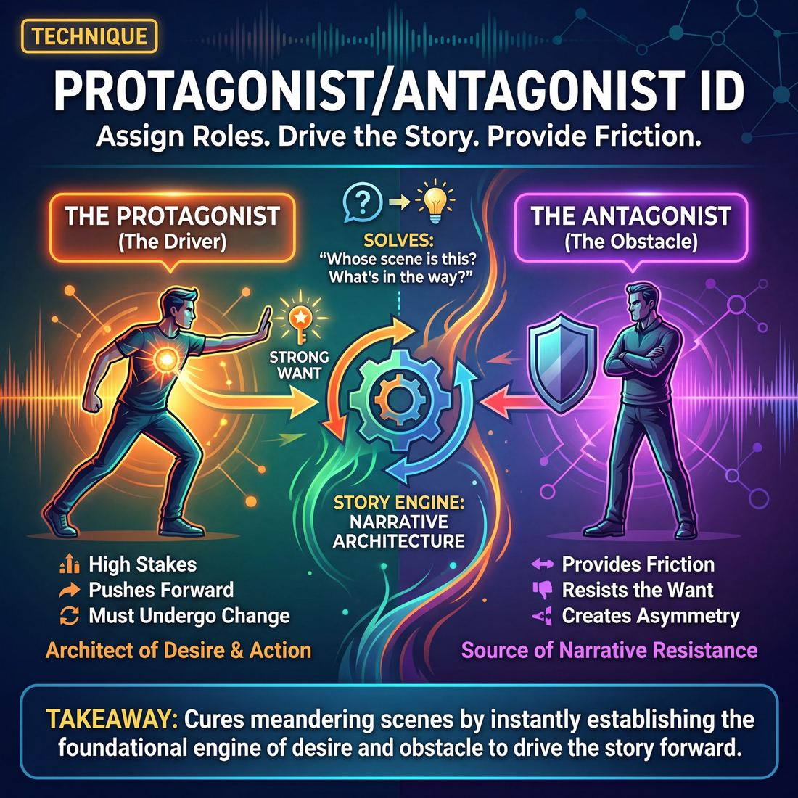

# 🎯 Protagonist/Antagonist ID

> *A drillable muscle that trains **Narrative Architecture**.*

{ .infographic }

## 🎯 The essence

**Protagonist/Antagonist ID** is a focused scene-work drill where improvisers explicitly identify who is driving the story (the **Protagonist**) and who is providing the friction (the **Antagonist**) early in a scene. It forces players to practice a single, vital muscle: recognizing and committing to clear narrative roles in real time. By consciously assigning a character who *wants* something and a character who stands in their way, improvisers learn to instantly build the foundational architecture of a story, ensuring the scene has a structural engine of desire and obstacle to drive it forward.

## 🎓 What it trains

This technique isolates and strengthens the structural backbone of **Narrative Architecture**. It trains improvisers to instantly recognize the functional roles within a story and to play those roles with deliberate focus.

In early improv, scenes frequently suffer from two structural diseases: the "two-headed monster" (where both players fight to drive the narrative in entirely different directions) or the "polite plateau" (where neither player takes a strong stance, resulting in a scene that wanders aimlessly). Both happen because the players do not know *whose* story they are telling. 

Protagonist/Antagonist ID exists to cure this by forcing improvisers to answer a fundamental question: **Whose scene is this, and what is in their way?**

By drilling this technique, improvisers develop several critical muscles:

*   **Role Clarity:** Players learn to stop asking, *"What should I do next?"* and start asking, *"Am I the driver or the obstacle right now?"* 
*   **Identifying the "Want":** It forces players to articulate a clear goal. A protagonist without a **Want** is just a person standing on stage; this drill trains players to establish what is at risk for the character.
*   **Providing Friction:** It teaches the player in the Antagonist role that their job is not to block the scene, but to provide the necessary resistance that makes the Protagonist's journey interesting. 
*   **Serving the Scene:** It shifts the improviser's mindset from individual character work to holistic scene work. You learn to surrender your own clever ideas if the scene requires you to simply be the immovable object in your partner's way.

!!! abstract "The Deeper Principle: Narrative Requires Friction"
    Two people agreeing to go to the grocery store is a transaction. One person desperately needing to get to the store while the other refuses to hand over the car keys is a scene. This technique trains the brain to see that friction not as an argument to be won, but as an engine to be fueled.

Ultimately, this drill moves an improviser up the learning curve. A novice tries to tell a story but lets it wander; a competent player deliberately establishes a platform and a Want; but a master uses this muscle to architect a full arc in real time, seamlessly shifting between driving the action and providing the obstacle as the scene demands.

## 💡 Why it works

At its core, Protagonist/Antagonist ID works by solving the root cause of those meandering scenes: **competing agendas**. 

When two improvisers step on stage without a shared narrative framework, they often suffer from the "two drivers, one steering wheel" problem, spinning out into a series of disconnected ideas. Alternatively, they fall into the trap of polite agreement, where they "Yes, and" each other into total inertia.

This technique bypasses those traps by exploiting three underlying mechanisms:

*   **Functional Division of Labor:** By explicitly assigning the roles of Protagonist (the character who wants something and must undergo change) and Antagonist (the force of opposition), the cognitive load of the scene drops dramatically. Players no longer have to invent *what* to do; they only have to execute their assigned job. 
*   **Instant Narrative Friction:** Story requires conflict. In improv, we often shy away from conflict because we mistake it for arguing. This technique reframes conflict as *structural friction*. The protagonist pushes forward; the antagonist pushes back. This push-and-pull is the engine that drives a narrative scene.
*   **Forcing the Stakes:** You cannot play a protagonist without a goal. This exercise forces the improviser to immediately establish their **Stakes**—what they want, why they want it, and what happens if they don't get it. 

!!! abstract "Key idea: Asymmetrical Power"
    Great narrative scenes rarely feature two characters with equal investment in the exact same goal. Protagonist/Antagonist ID works because it creates **asymmetry**. One character cares deeply (high stakes), while the other acts as a roadblock (often with different, conflicting stakes). This asymmetry naturally generates the **Tilt**—the moment the normal platform is disrupted and the story truly begins.

By isolating these roles, the technique rewires the improviser's brain to recognize the underlying physics of a story. Instead of two roommates politely negotiating who takes out the trash, the scene instantly snaps into focus: one is a desperate protagonist who *must* have a spotless kitchen to impress a date, and the other is an antagonist who draws their power from the filth. The scene practically writes itself.

## 🧩 The setup

Here is everything you need to arrange before running this exercise. 

*   **Players & Arrangement:** Played in pairs on stage, with the rest of the group seated as an audience. 
*   **Space & Materials:** A standard open stage. Two chairs are helpful to establish a grounded physical environment, but no special materials are required.
*   **Time:** 15–20 minutes total. Allocate 2–3 minutes per scene, plus a brief moment for the pair to assign roles before they begin.
*   **Prerequisites:** Players should already be comfortable establishing a basic **Platform** (who, what, where) and have a beginner's grasp of playing a Want.

| Role | Function in the Drill |
| :--- | :--- |
| **Player A (Protagonist)** | Enters the scene with a clear, active Want. Their job is to pursue this goal and allow themselves to be affected by the friction they encounter. |
| **Player B (Antagonist)** | Enters the scene as the obstacle. Their job is to stand between the Protagonist and their Want, providing resistance, complications, or opposing desires. |
| **The Facilitator** | Assigns the roles (or asks players to self-assign), calls the scene edits, and side-coaches if a player drops their narrative function. |

!!! note "Defining the Antagonist"
    Make sure players understand that "Antagonist" does not automatically mean "villain." The Antagonist is simply the source of friction. They could be a well-meaning mother, a bureaucratic clerk, or a best friend who just wants to go to a different restaurant. 

!!! quote "How to introduce it"
    "To build a compelling story, we need an engine: someone who wants something, and something standing in their way. In this exercise, we are going to make that architecture completely explicit. 
    
    You will go up in pairs. Before you start, decide who is the Protagonist and who is the Antagonist. If you are the Protagonist, your job is to discover a burning 'Want' early in the scene and fight for it. If you are the Antagonist, your job is to be the obstacle. Let's see how much easier a scene flows when you know exactly what your job is."

## ⚙️ The mechanics

!!! abstract "The Core Objective"
    To pause a scene at the exact moment of ignition—the Tilt—and force players to explicitly name the narrative engine driving the scene. By declaring who wants something and who is in the way, players strip away the ambiguity that causes scenes to wander.

The mechanics of Protagonist/Antagonist ID rely on a strict stop-and-declare loop. It transforms the invisible, intuitive structure of a story into a conscious, spoken agreement before the scene is allowed to proceed.

### The Flow of Play

1. **Initiate the Platform:** Two players step out and begin a standard scene. Their initial goal is simply to establish the foundational reality: the Who, What, and Where. 
2. **The Freeze:** As soon as a desire, a problem, or a point of friction emerges (usually within the first 4 to 6 lines), the coach calls, "Freeze!"
3. **The Declaration:** While frozen, the players must immediately break character and declare their narrative roles to the room. 
    * One player must claim: *"I am the **Protagonist**. My want is [X]."*
    * The other must claim: *"I am the **Antagonist**. I am stopping them by [Y]."*
4. **The Negotiation (if needed):** If both players claim to be the Protagonist (a common symptom of two improvisers driving their own separate ideas), they must negotiate on the spot. They have ten seconds to agree on who will take the Protagonist role and who will pivot to become the Antagonist.
5. **The Resumption:** The coach calls, "Unfreeze!" The players drop back into character and play out the scene, strictly honoring the dynamic they just declared.
6. **The Resolution:** The scene continues until the narrative arc resolves—either the Protagonist achieves their want, is definitively denied their want, or undergoes a fundamental change in perspective. The coach calls "Scene," and a new pair steps up.

!!! example "In a scene"
    **Player A:** "I've color-coded the spreadsheets for the merger, Mr. Vance."  
    **Player B:** "Throw them in the shredder, Jenkins. We're going analog."  
    **Coach:** "Freeze! Identify."  
    **Player A:** "I am the Protagonist. I want my hard work to be validated."  
    **Player B:** "I am the Antagonist. I am stopping him by destroying his work and changing the rules."  
    **Coach:** "Unfreeze."  

### Rules & Constraints

To keep the drill focused on Narrative Architecture, enforce these strict boundaries during the exercise:

* **The Want must be active and present.** A Protagonist cannot want "world peace" or "to be happy." They must want something they can actively pursue *in this room, right now, from this specific partner*. 
* **Only one Protagonist.** There are no co-protagonists in this drill. One person drives the change; the other provides the friction.
* **The Antagonist must hold their ground.** Once the Antagonist declares how they are stopping the Protagonist, they cannot immediately fold or give the Protagonist what they want. They must make the Protagonist work for it.

!!! tip "On stage: The Pie-Baking Antagonist"
    A common trap is assuming the Antagonist must be angry or mean. In narrative architecture, the Antagonist is simply the **obstacle**. If the Protagonist wants to leave the house, an Antagonist who says, "You can't leave, I baked you a pie and I'll cry if you don't eat it," is just as effective as a guard at a prison door.

## 🎬 Sample round

!!! example "Sample round: The Bakery"
    **Players:** Maya and Leo  
    **Setting:** A high-end bakery kitchen, 5:00 AM.

    **Step 1: Establish the Platform & The Want**  
    *Maya (kneading dough furiously):* "If I don't get this sourdough starter perfectly balanced by 6:00 AM, the food critic from the *Times* is going to ruin us."  
    *(Annotation: Maya establishes herself as the potential Protagonist. She has a clear, stated Want and immediate stakes.)*

    **Step 2: Introduce the Obstacle**  
    *Leo (eating a donut, feet up on a stool):* "You worry too much. I just poured a can of ginger ale into the vat. The bubbles do the same thing, right?"  
    *(Annotation: Leo establishes himself as the Antagonist. He is the direct obstacle to Maya's goal, driven by his own opposing philosophy of laziness.)*

    **Step 3: The Freeze & ID**  
    *Coach:* "Freeze. Identify."  
    *Maya:* "I am the Protagonist. My want is to impress the critic and save the bakery."  
    *Leo:* "I am the Antagonist. My function is to thwart her perfectionism with my careless shortcuts."  
    *Coach:* "Great. Maya, fight harder for the goal. Leo, escalate the shortcuts. Go."

    **Step 4: Play the Architecture**  
    *Maya:* "You poured soda into a hundred-year-old mother dough?! Get away from the bowls, Leo!"  
    *Leo:* "Fine, fine. I'll just go 'help' with the delicate sugar-spun roses. I brought my blowtorch."  
    *(Annotation: The scene now has a clear narrative engine. The players aren't just bickering; they are building a story arc where the protagonist's want is actively and specifically opposed by the antagonist's actions.)*

!!! tip "On stage"
    In performance, you obviously won't have a coach to freeze the scene. The goal of this drill is to internalize the "Freeze & ID" step so that it happens silently in your head. By line three, you should be thinking: *"Ah, she has a goal. I will be the obstacle,"* or *"He is blocking me; I must fight harder for my want."*

## 🎚️ Variations & progressions

To build strong Narrative Architecture muscles, this technique can be scaled from basic structural awareness to advanced, invisible scene-weaving. As players move through the maturity stages, the exercise shifts from explicit, paused identification to fluid, real-time execution.

Here is how to ramp the difficulty:

**1. Freeze & Identify (Novice to Advanced Beginner)**  
The simplest version of the drill. The coach lets a scene run until the Tilt—the moment the normal routine is broken—and calls "Freeze!" 
*   **The task:** The players (or the backline) must explicitly name: Who is the protagonist? What is their Want? Who or what is the antagonist?
*   **Why it works:** Novices often play activities with no reason to care. This forces them to stop wandering and retroactively apply story structure to what they have just created.

!!! tip "Coaching the Freeze"
    If the players cannot answer the questions when frozen, the scene lacks a clear engine. Have them rewind 30 seconds, make a strong choice to establish a Want, and try again.

**2. The Explicit Declaration (Competent)**  
Players must explicitly state their narrative function and their goal within the first four lines of the scene, breaking the fourth wall before dropping back into character.
*   **The task:** Player A: *"I am the protagonist, and I want to buy this house."* Player B: *"I am the antagonist, and I will not sell it to you because you insulted my dog."*
*   **Why it works:** It forces Competent players to establish what is at risk immediately, bypassing vague pleasantries and building the platform with deliberate intent.

!!! example "In a scene: The 'Helpful' Antagonist"
    **Variation:** Challenge players to play an antagonist who *agrees* with the protagonist but still acts as an obstacle. 
    *Protagonist:* "I need to study for my finals." 
    *Antagonist:* "Absolutely, you need to study! Let me just organize your desk first. And make you a snack. And tell you about my day so your mind is clear..." 
    This teaches that opposition doesn't require an argument.

**3. The Escalating Tag-Out (Proficient)**  
The protagonist remains constant, but the source of opposition shifts and grows. 
*   **The task:** The scene begins with a clear protagonist and antagonist. Players on the backline tag out the antagonist to introduce a *new* obstacle, escalating the difficulty for the protagonist to achieve their Want.
*   **Why it works:** It trains Proficient players to feel the stakes rather than just state them, ensuring the story arc moves forward rather than getting stuck in a circular debate.

**4. The Mid-Scene Role Swap (Master)**  
The ultimate test of narrative agility. The scene starts with a clear protagonist/antagonist dynamic. 
*   **The task:** On the coach's call (or organically), the players must seamlessly swap narrative roles *without changing characters*. The antagonist suddenly reveals a deep vulnerability and a new Want, forcing the original protagonist to become the obstacle.
*   **Why it works:** It pushes Master improvisers to architect complex, multi-dimensional arcs in real time. It proves they can read what the scene needs and serve it invisibly, making the audience genuinely care about the shifting power dynamics.

## 🧑‍🏫 Coaching notes

When coaching Protagonist/Antagonist ID, your primary goal is to help players recognize and commit to narrative asymmetry. Improvisers naturally default to equality—mirroring each other's energy or sharing the burden of the plot. This technique requires them to break that habit and accept distinct, unequal narrative functions.

!!! tip "Coaching: The Golden Cue"
    The single most important side-coach you can give during this exercise is: **"One person changes, one person pushes."** 
    
    If both players are trying to undergo a profound emotional transformation at the same time, the narrative muddies. Force them to pick a lane. Call out: *"Who is the center of this story right now? The other person, serve them."*

### High-Impact Side-Coaching
Use these sharp, direct prompts while the scene is in motion to snap players into their roles:

*   **"Protagonist, what do you want?"** – Use this if the scene is wandering. Force the protagonist to articulate or physically pursue a clear goal.
*   **"Antagonist, plant your feet."** – Use this when the antagonist is being too accommodating. Remind them that their job is to be the obstacle, the temptation, or the immovable object.
*   **"Let it affect you."** – Directed at the protagonist. If the antagonist throws a roadblock, the protagonist shouldn't brush it off; they must show the audience that the stakes are real and they are struggling.
*   **"Antagonist, you don't have to be mean."** – A crucial correction. Remind them that a loving, overprotective parent or a well-meaning but incompetent doctor can be a fantastic antagonist. 

### What "Good" Looks and Sounds Like
As players move from Novice to Competent, you will see a shift in how the scene feels:

*   **Clear Asymmetry:** The scene stops feeling like a tennis match of equal wits and starts feeling like a journey. One player is clearly the engine of the want, and the other is the environment they must navigate.
*   **Felt Stakes:** Instead of just stating, *"I need this promotion,"* the protagonist's body language and emotional reactions demonstrate *why* they care. The stakes fuel the scene rather than just decorating it.
*   **Generous Antagonism:** The antagonist isn't blocking the improviser; they are blocking the *character*. A good antagonist gives the protagonist exactly the kind of trouble that makes them look like a hero.

!!! warning "Watch out for 'The Argument'"
    The most common trap is players confusing "Antagonism" with "Bickering." If two roommates are just yelling at each other about doing the dishes, there is no protagonist—just two people complaining. Side-coach immediately: **"Stop arguing. One of you needs something the other has. Go."**

## 🧭 Debrief & reflection

A strong debrief shifts the players’ focus away from "was that scene funny?" and toward "was the narrative engine clear?" The goal is to help improvisers recognize what it feels like when a scene has genuine momentum, driven by a clear desire and specific opposition.

Use these questions immediately after a round to lock in the mechanics of narrative architecture:

**For the Protagonist:**

*   *“At what exact moment did you know what your character wanted?”* (If the answer is "I never really knew," the scene likely felt aimless.)
*   *“Did you care about getting it, or were you just saying the words?”* 
*   *“How did the opposition make you feel? Did it force you to change your tactics?”*

**For the Antagonist:**

*   *“What was your strategy for getting in the way?”*
*   *“Were you playing a villain, or just a person with a competing priority?”* 
*   *“Did you ever feel tempted to give them what they wanted too early? Why did you hold your ground?”*

**For the Observers:**

*   *“Who was the protagonist, and what was their Want?”* (If the audience disagrees on who the protagonist was, the roles weren't clearly defined.)
*   *“What was the climax of the scene? When did the tension peak?”*

!!! abstract "What a good debrief surfaces"
    A successful reflection period will usually lead players to a few core "aha" moments:
    
    1. **Opposition is a gift.** Players realize that having someone actively block their goal makes improvising *easier*, not harder, because it gives them something to fight for.
    2. **Vagueness kills momentum.** If the protagonist's want is abstract (e.g., "I want to be happy"), the antagonist has nothing concrete to push against. 
    3. **Antagonism is structural, not emotional.** The best debriefs highlight scenes where the antagonist was cheerful, oblivious, or bureaucratic, proving that narrative tension doesn't require anger.

!!! quote "The Coach's Reframe"
    "Notice how the scene practically wrote itself once we knew who wanted the thing, and who was standing in the way. You didn't have to invent a plot; you just had to pursue the goal."

## ⚠️ Common pitfalls

Assigning narrative roles in real-time adds significant cognitive load. When players first practice Protagonist/Antagonist ID, their brains are suddenly juggling character, dialogue, *and* structural architecture. Because they are trying to consciously build a story rather than just play a game, they often fall into a few predictable traps. 

Here is where the technique typically breaks down and how to fix it:

!!! warning "Watch out: Playing the Antagonist as a 'Villain'"
    **The Trap:** Novices often equate "antagonist" with "evil." When assigned the antagonist role, they immediately become angry, malicious, or combative, which flattens the scene into a generic argument.
    
    **The Fix:** Redefine the antagonist simply as the obstacle to the protagonist's want, or the agent of change. An antagonist can be deeply loving, overly helpful, or completely oblivious. 
    *Example:* If the protagonist wants to sneak out of the house, a loving mother who insists on staying in their room to bond is a fantastic, high-stakes antagonist.

!!! warning "Watch out: The Two-Protagonist Tug-of-War"
    **The Trap:** Both players establish strong, competing wants that do not intersect. Player A wants to rob the bank; Player B wants to bake a perfect soufflé. They end up fighting for control of the scene's narrative spine, resulting in two parallel stories and zero actual progression.
    
    **The Fix:** Train the **narrative yield**. As soon as one player establishes a clear, actionable want, the other player must drop their own unrelated agenda and pivot to become the antagonist (the obstacle) or a supporting character. The scene can only serve one master narrative at a time.

!!! warning "Watch out: The Passive Protagonist"
    **The Trap:** A player correctly identifies themselves as the protagonist and states their want ("I really need this promotion"), but then takes no action to achieve it. They stand still, waiting for the antagonist to drive the scene or hand them the solution.
    
    **The Fix:** Remind players that the protagonist must be the engine of action. If they want the promotion, they must actively flatter the boss, forge the documents, or sabotage their rival *in the scene*. A want without an action is just a complaint.

!!! warning "Watch out: Paralysis by Analysis"
    **The Trap:** Under the cognitive load of trying to architect a story, players get "in their heads." They stop listening to their partner and stop reacting emotionally because they are internally calculating, *"Wait, am I the protagonist? What is my arc?"*
    
    **The Fix:** Shrink the focus to the immediate moment. Instead of worrying about the whole story arc, ask players to focus on a micro-want: **"What do I want from the person standing in front of me right now?"** Let the overarching narrative architecture emerge from that simple, grounded pursuit.

## 🌟 What mastery looks like

At the highest level of proficiency, Protagonist/Antagonist ID ceases to look like a structural drill and becomes an invisible, shared instinct for narrative gravity. Master improvisers do not need to negotiate or explicitly state their roles; they feel where the scene's momentum is pulling and instantly provide the necessary counter-weight.

When observing master improvisers execute this technique, you will see:

*   **Instant, wordless alignment:** The moment one character exhibits a clear want or vulnerability, their partner seamlessly adopts the complementary role. There is no hesitation, no talking over each other, and no fighting for the spotlight.
*   **Nuanced, grounded antagonism:** The antagonist is never just a generic "blocker" or a stubborn jerk saying "no." They provide a valid, deeply held counter-perspective that creates genuine dramatic friction. They make the audience genuinely care about the conflict, even if the characters are utterly absurd.
*   **Fluid role-switching:** Mastery means reading what the scene needs in real time. If the narrative demands it, the antagonist might be changed by the protagonist's plea, or the roles might swap entirely as a new, deeper want emerges.
*   **Consequence and change:** The players architect a full arc. The friction between the protagonist and antagonist isn't static; it builds, forces a climax, and results in a permanent, observable change to one or both characters.

!!! example "In a scene"
    A novice antagonist might block a protagonist's desire to buy a sports car by simply saying, "No, we have no money." 
    
    A master antagonist provides a grounded, emotional counter-force: "You can buy the sports car, David, but you know it means admitting you're terrified of turning fifty, and I won't be the one to explain that to the kids." The resistance isn't a dead-end roadblock; it's an emotional toll that deepens the protagonist's choice and raises the stakes.

!!! abstract "The Master's Mindset"
    A Stage 5 improviser reads what the scene needs and serves it invisibly. They do not let ego dictate whether they get to be the hero or the obstacle; they only care about fueling the engine of the narrative and ensuring the story arc feels inevitable.

## 🔗 Why it matters

At its core, improvisation is about making order out of chaos. Without a clear sense of who is driving the action and what is standing in their way, a scene is just a situation—two people talking in a room, waiting for something to happen. 

Drilling Protagonist/Antagonist ID provides the structural scaffolding necessary to turn a mere situation into a compelling story. It serves the broader craft in three vital ways:

*   **Activates Narrative Architecture:** A story cannot exist without a journey, and a journey requires a driver. By identifying the Protagonist, improvisers instantly know *whose* story is being told and whose perspective matters most. By identifying the Antagonist, they establish the friction required to force the protagonist into action, consequence, and eventual change.
*   **Drives Engine Selection:** To master the domain of The Scene, improvisers must know whether they are playing a Game or telling a Story. This technique builds the meta-awareness to recognize the difference in real time. If a clear hero and obstacle emerge, you are firmly in the Story engine. If both characters share the same unusual behavior, you are likely in the Game engine. 
*   **Unlocks Stakes and The Want:** Novices often play activities with no reason to care. When you explicitly label the protagonist and antagonist, you are forced to answer *what* is being fought for and *what* is at risk. It moves the scene from a polite, meandering conversation into a dynamic narrative where the audience genuinely cares about the outcome.

!!! abstract "The Ultimate Takeaway: Craving Narrative Friction"
    Improvisers are often taught to "avoid conflict" because petty arguing stalls scenes. But structural antagonism is entirely different. This technique trains improvisers to crave *narrative friction* without resorting to bickering. It proves that a strong obstacle is the greatest gift you can give a scene.

Ultimately, this muscle is the antidote to the meandering, slice-of-life scene. It gives improvisers a shared structural vocabulary. When both players know exactly who is pushing the boulder up the hill and what is pushing back, the scene stops wandering and begins to drive forward with inevitable momentum.

## 📚 References & Further Reading

### Foundational sources
*   **Kenn Adams, *How to Improvise a Full-Length Play: The Art of Spontaneous Theater* (2007)** — The definitive text on long-form narrative improvisation. Adams explicitly details how to build cause-and-effect storytelling, raise dramatic stakes, and utilize protagonist/antagonist dynamics in real time. His exercises focus on shifting improvisers away from gag-driven sketch comedy and toward creating a structural spine where characters have clear objectives and face productive dramatic conflict.
*   **Keith Johnstone, *Impro for Storytellers* (1999)** — The foundational text for narrative improv. Johnstone breaks down the mechanics of storytelling on stage, focusing on how to build a "Circle of Expectations" and use "tilts" to disrupt the platform and launch a story. He emphasizes that a story only begins when the routine is broken, which perfectly aligns with the concept of introducing an antagonist to provide friction.
*   **Mick Napier, *Improvise: Scene from the Inside Out* (2004)** — Essential reading for understanding the power of the "Want." Napier argues that improvisers must enter scenes with a clear, declared desire to avoid the trap of polite, meandering scene work. By taking care of yourself first and establishing what your character wants, you naturally invite the friction required to build a compelling scene.

### Practitioner guides & manuals
*   **Tom Salinsky and Deborah Frances-White, *The Improv Handbook: The Ultimate Guide to Improvising in Comedy, Theatre, and Beyond* (2008)** — This comprehensive guide explores how the protagonist is fundamentally the character with the most at stake. The authors provide practical strategies for simplifying stalled scenes—often caused by "too many offers"—by identifying the core narrative engine and rallying both players around a single protagonist's goal and the obstacles in their way.

### Lineage & teachers
*   **BATS Improv (San Francisco)** — Founded in 1986 and heavily influenced by Keith Johnstone, this theater and school is a premier training ground for narrative improv. Their curriculum explicitly teaches protagonist/antagonist story structures, focusing on how protagonists get foiled on their heroic journeys and how to maintain moral complexity in antagonists, rather than relying on simple "good vs. evil" tropes.
*   **Loose Moose Theatre (Calgary)** — The birthplace of Theatresports and Keith Johnstone's home theater. It is the historical epicenter where the foundational concepts of narrative improv, status play, and spontaneous storytelling were developed, tested, and refined into a teachable pedagogy.

### Research & theory
*   **R. Keith Sawyer, *Improvised Dialogues: Emergence and Creativity in Conversation* (2003)** — A rigorous social-scientific study of improv theater. Sawyer analyzes how actors use "collaborative emergence" to co-create unscripted narrative frames, roles, and dialogue. His research demonstrates how improvisers implicitly negotiate who is driving the scene and who is reacting, providing an academic framework for why explicitly naming these roles reduces cognitive load.

### Communities & adjacent reading
*   **Lajos Egri, *The Art of Dramatic Writing* (1946)** — A classic playwriting manual that is frequently taught in advanced narrative improv classes. Egri defines the "unity of opposites"—a scenario where the protagonist and antagonist want precisely opposite things. He argues that true dramatic conflict requires a protagonist who wants something so badly they are forced into action, and an antagonist who provides equal and opposite resistance, creating structural friction rather than static, circular arguing.
*   **Robert McKee, *Story: Substance, Structure, Style, and the Principles of Screenwriting* (1997)** — A foundational text on narrative architecture. McKee’s "Principle of Antagonism" asserts that a protagonist and their story can only be as intellectually fascinating and emotionally compelling as the forces of antagonism make them—a core tenet of the Protagonist/Antagonist ID drill.

## 💬 Quotes & Anecdotes

!!! quote "— Keith Johnstone, *Loose Moose Training Manual* (c. 1990s)"
    "Whose Scene is It? You need to know. If every scene is yours, you have to pay the other players."

!!! quote "— Carol Hazenfield, *Acting on Impulse: The Art of Making Improv Theater* (2002)"
    "The non-protagonist has less to lose or gain by the outcome of the story. Any time an improviser other than the hero has a strong emotional reaction, it should feed into the hero's story, not sidetrack the story onto another path."

!!! quote "— Matt Besser, Ian Roberts, and Matt Walsh, *The Upright Citizens Brigade Comedy Improvisation Manual* (2013)"
    "Protagonist: The main character. Antagonist: The character or force opposing the protagonist."

!!! quote "— Keith Johnstone, *Impro: Improvisation and the Theatre* (1979)"
    "Bad improvisers block action, often with a high degree of skill. Good improvisers develop action."

!!! quote "— Mick Napier, *Improvise: Scene from the Inside Out* (2004)"
    "Declare what you honestly want and live that vision fearlessly."

### Where it comes from
The explicit division of scenes into "Protagonist" and "Antagonist" roles is a foundational concept in classical narrative theory, adapted for improvisational theatre by pioneers like Keith Johnstone. Johnstone heavily emphasized narrative action and status, teaching improvisers to recognize who is driving the story and who is being altered by it. Later, long-form and narrative-focused improv schools codified these terms to help players avoid the "two-headed monster" (where both players fight for control of the scene's direction) and ensure that every scene has a clear engine of desire and resistance.

### A telling example
**Illustrative Scenario: The Polite Plateau vs. The Driven Scene**

To see why this drill is necessary, look at what happens when players fail to establish these roles:

*Without Protagonist/Antagonist ID (The Polite Plateau):*
**Player A:** "I'm going to the store to get milk."
**Player B:** "Okay, I will come with you and get some eggs."
**Player A:** "Great, let's get in the car."
*(The scene flatlines. Both players are driving in the exact same direction with no friction. There is no clear protagonist with a burning want, and no antagonist providing an obstacle.)*

*With Protagonist/Antagonist ID:*
*(Before the scene, Player A is assigned Protagonist, Player B is Antagonist).*
**Player A (Protagonist):** "I need to borrow your car to get milk right now, or my recipe is ruined and the food critic will destroy my restaurant." *(Clear Want and Stakes)*
**Player B (Antagonist):** "You can't take the car. I just washed it, and you always leave a weird cheese smell in the upholstery." *(Clear Obstacle/Friction)*

The scene instantly has an engine. Player A must fight for their goal, and Player B knows their exact job is to provide the necessary resistance to make the journey interesting, rather than inventing a competing storyline.

## 🧭 Explore the framework

- ⬆️ **Skill it trains:** [Narrative Architecture](03_S3__narrative-architecture.md)
- 🎭 **Domain:** [The Scene](03_D__the-scene.md)
- 🔁 **Sibling techniques:** [Story Spine](03_S3_T1__story-spine.md), [Platform/Tilt](03_S3_T2__platform-tilt.md)
