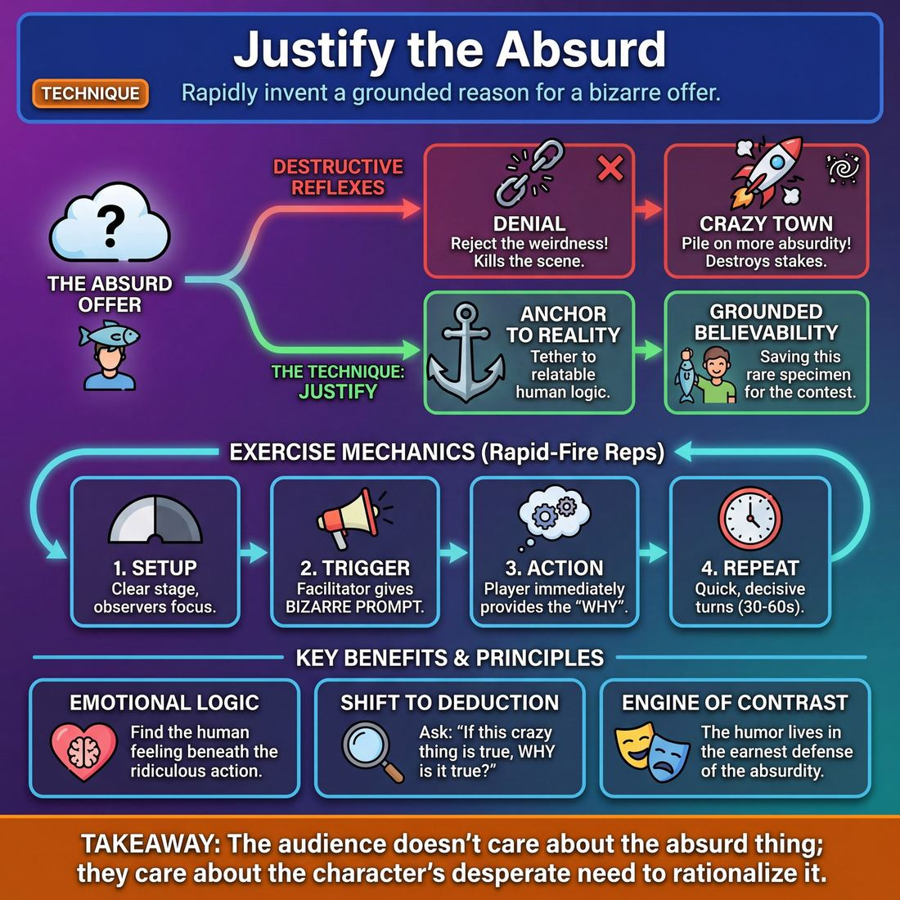

# 🎯 Justify the absurd

> *A drillable muscle that trains **Justification**.*

{ .infographic }

## 🎯 The essence

**Justify the absurd** is a rapid-fire exercise where a player is handed a bizarre, illogical, or completely out-of-context offer and must immediately invent a grounded, believable reason for *why* it makes perfect sense. It isolates and drills a single, vital improv muscle: **justification**. By forcing improvisers to treat the ridiculous as reality, it trains them to stop judging strange offers and instead instantly build the internal logic, character motivation, or worldview that makes the impossible feel inevitable.

## 🎓 What it trains

This technique isolates the improviser's ability to provide a grounded, logical "why" for a bizarre, unexpected, or accidental "what." 

When an improviser steps on stage, they are constantly bombarded with unpredictable offers. Without the muscle of justification, a bizarre initiation usually triggers one of two destructive reflexes:

1. **Denial:** The improviser rejects the weirdness to protect their own sense of logic (*"Why are you wearing a shoe on your head? Take it off, you're acting crazy!"*). This kills the offer and stalls the scene.
2. **Crazy Town:** The improviser accepts the weirdness but abandons reality entirely, piling absurdity on top of absurdity (*"Yes, I have a shoe on my head, and now I'm flying to Mars on a laser-unicorn!"*). This destroys the stakes; if anything can happen, nothing matters, and the audience stops caring.

!!! abstract "The Problem it Solves"
    Justifying the absurd is the antidote to both Denial and Crazy Town. It trains the improviser to accept the unusual offer *completely*, but then immediately tether it to a relatable, human reality. It solves the problem of untethered nonsense by forcing the player to answer: *"Under what specific circumstances would a sane, rational person do this?"*

By practicing this technique, improvisers develop several critical sub-skills:

* **Emotional Logic:** Finding a relatable human emotion or motivation beneath a ridiculous action (e.g., *I am wearing a shoe on my head because I am terrified of the new office dress code and overcompensating*).
* **Contextual Grounding:** Inventing the specific who, what, and where that makes the absurdity inevitable. 
* **Game Framing:** In a comedic scene, the "unusual thing" is the engine of the **Game**. Justification frames that unusual thing so it can be repeated, heightened, and explored without breaking the reality of the world.

!!! note "The Deeper Principle: 'If this is true...'"
    This technique is the practical application of improv's foundational logic: **"If this is true, what else is true?"** It builds the cognitive reflex to treat every mistake, wild offer, or physical anomaly not as a problem to be fixed, but as a deliberate, necessary fact of the scene's reality that simply hasn't been explained yet.

## 💡 Why it works

This exercise works because it bridges the gap between the impossible and the deeply human, exploiting the comedic and dramatic tension between a bizarre reality and a grounded explanation. 

When an improviser provides a sane reason for an insane action, it triggers several powerful mechanisms under the hood:

*   **The Cognitive Shift (Deduction over Invention):** When a bizarre element is introduced, the amateur instinct is to match it with *more* absurdity. This exhausts the brain and quickly leads to a dead end. Justification shifts the mind from **invention** to **deduction**. You are no longer asking, *"What else is crazy?"* but rather, *"If this crazy thing is true, why is it true?"* This turns a daunting creative void into a solvable puzzle.
*   **Scene Gravity:** By explaining *why* a dog is talking or a floor is made of lava, you establish rules and boundaries. This gravity prevents the scene from floating away into the weightlessness of Crazy Town.
*   **The Engine of Contrast:** Comedy thrives on contrast. The absurdity itself is rarely the funniest part of the scene; the humor lives in the earnest, mundane, or deeply emotional defense of that absurdity. 

!!! abstract "Key idea: The mundane anchors the bizarre"
    An absurd action is just a cartoon. But an absurd action driven by a highly relatable human emotion—like jealousy, petty office politics, or a desire to impress a first date—becomes brilliant satire. 

By forcing improvisers to justify, this technique naturally pushes players to mature their scene work. While a novice might play an absurd activity with no reason to care, justifying the action forces the improviser to establish **Stakes** and a clear character "Want." The audience doesn't care about the absurd thing; they care about the character's desperate need to rationalize it.

!!! example "In a scene"
    **The Absurdity:** Player A enters the scene walking on their hands.
    
    **Piling on (Weak):** Player B says, "Oh yeah? Well I'm walking on my head!" *(The scene spins into Crazy Town; no rules, no relationship).*
    
    **Justifying (Strong):** Player B says, "I see you're still trying to keep your new suede shoes pristine for the wedding." *(The absurd physical choice is instantly grounded in a relatable human trait: vanity and anxiety about a big event).*

## 🧩 The setup

To isolate and drill this muscle, the technique is best practiced as a rapid-fire exercise before being integrated into full scenes. Here is how to set up the room for maximum repetitions:

*   **Players & Arrangement:** 8 to 16 players. Form a single semi-circle facing a clear "stage" area. This keeps the focus on the active players while allowing the rest of the group to observe the mechanics.
*   **Space & Materials:** An open room. The facilitator should come armed with a list of highly absurd, context-free actions or statements (e.g., *"You are ironing a piece of toast,"* *"You just fired your dog,"* or *"You are wearing a suit of armor to the beach"*). 
*   **Time:** 30 to 60 seconds per round; 15 to 20 minutes total. The goal is quick, decisive reps rather than long, meandering scenes.
*   **Roles:**
    *   **The Facilitator:** Delivers the absurd prompt to the initiating player.
    *   **Player A (The Initiator):** Takes the prompt and makes the bold, absurd physical action or opening line.
    *   **Player B (The Justifier):** Instantly accepts the absurdity as absolute truth and provides the *why*—grounding the bizarre behavior in a relatable human emotion or relationship.
*   **Prerequisites:** A solid grasp of **"Yes, And"** (acceptance) and a basic understanding of establishing a **Base Reality**. Players must know how to play grounded, ordinary characters before they can successfully anchor the extraordinary.

!!! quote "How to introduce it"
    "Today we are going to practice treating the bizarre as completely mundane. I am going to give you an absurd action or a ridiculous opening line. Your job is not to act crazy, panic, or make a joke out of it. Your job is to instantly answer the question: *Under what specific circumstances would a sane, rational human being do this?* Don't change the weird thing—embrace it. Give us the 'why,' ground it in a relationship, and make us believe it makes perfect sense to you."

## ⚙️ The mechanics

The core objective is to build the reflex of **instant rationalization**. The engine of the drill is the **Offer-Justify Loop**: one player provides a wild "What," and the other provides a grounded "Why."

### The Flow of Play

This technique is best run as a rapid-fire, two-person drill (often in lines or a circle). 

1. **The Absurd Offer:** Player A steps out and makes a bold, physically or verbally absurd initiation based on the facilitator's prompt. It should break normal reality, physics, or social convention. 
2. **The Unflinching Acceptance:** Player B steps out to meet them. Player B must accept the premise completely, without showing shock, fear, or judgment on their face. To Player B, this is a normal Tuesday.
3. **The Justification:** Player B delivers a line that explains *why* Player A's action makes perfect sense. The justification should define the relationship and the context.
4. **The Solidifying Reaction:** Player A accepts the justification, reacting to the new context to lock the reality into place.
5. **Reset:** The instructor calls "Scene!" after these 3–4 lines. Player A goes to the back of the line, Player B becomes the new Player A, and a new Player B steps up.

!!! example "In a scene"
    **Player A:** *(Miming frantically)* "I am burying all of our silverware in the sandbox!"  
    **Player B:** *(Calmly sipping coffee)* "Well, the Smiths are coming over for dinner, and you know how much Susan loves to steal our forks."  
    **Player A:** "Exactly. She can eat her risotto with a plastic spork tonight."

### Rules & Constraints

To isolate the justification muscle, players must adhere to strict boundaries:

* **The "No Cop-Outs" Rule:** You cannot justify the absurd by erasing it. This means no using the "Crazy Pills." You are forbidden from saying:
    * *"You're crazy / insane."*
    * *"You're drunk / high."*
    * *"You're dreaming."*
    * *"You're an alien / a ghost."*
* **Play at the top of your intelligence:** The justification must make logical sense within the newly created reality. If Player A is eating a shoe, "because you are hungry" is a weak justification. "Because the cobbler said this leather is rich in iron" is a strong one.
* **Maintain the relationship:** The best justifications rely on the shared history between the two characters. Use "we" and "you" to tie the absurdity directly to the scene partner.

!!! warning "Watch out: Don't ask questions"
    A common panic response from Player B (The Justifier) is to ask, *"Why are you doing that?"* This forces Player A to justify their own absurd offer. The entire point of the standard drill is for Player B to do the heavy lifting. State the reason; do not ask for it.

### How a Round Ends

Because this is a muscle-building drill, speed and volume matter more than scene length. A round should last no more than **15 to 20 seconds**. As soon as the justification is delivered and accepted (usually 3 lines of dialogue), the coach should aggressively edit the scene. The goal is to get players out of their heads, forcing them to rely on their first instinct.

## 🎬 Sample round

!!! example "Sample round: The 'Why Are You...?' Variation"
    While the standard drill asks Player B to state the reason, a popular variation flips the dynamic: Player A initiates by pointing out an absurdity, forcing Player B to justify their *own* bizarre behavior. 

    **Player A:** "Why are you watering the plastic ferns with whole milk?"  
    *(The Absurd Offer: Player A gifts a highly unusual, specific behavior.)*

    **Player B:** "Because they're growing, David, and they need strong bones."  
    *(Acceptance & Initial Justification: Player B doesn't flinch or deny. They treat the action as completely normal and apply a twisted internal logic: milk = calcium = bones.)*

    **Player A:** "They are plastic, Helen. They don't have skeletons."  
    *(Heightening the Reality: Player A acts as the voice of reason, pointing out the factual reality to pressure the justification.)*

    **Player B:** "That's exactly what the nursery said. But ever since the kids left for college, I just need something in this house to depend on me for its calcium."  
    *(Deepening the Justification & Grounding: Player B anchors the absurdity in a deeply human, relatable emotion—empty nest syndrome.)*

**Breaking down the magic:**
Notice how Player B never acts "wacky" to match the wacky premise. The humor and the scene's momentum come from the **contrast** between the absurd action (milk on plastic plants) and the deadpan, emotionally grounded reason for doing it (missing her children). 

By the final line, the audience completely understands *why* Helen is doing this. The absurd has been successfully justified, transforming a throwaway joke into a sustainable Game with clear emotional Stakes.

## 🎚️ Variations & progressions

To build this muscle comprehensively, you can scale the technique from simple logical problem-solving to deep, emotionally driven scene work. Adjust the constraints based on the ensemble’s maturity level.

### 1. The Interrogation Room (Novice to Advanced Beginner)
At this stage, players often struggle to spot the unusual thing live. This variation (seen in the sample round above) forces them to pause, identify the absurdity, and explain it.
*   **The Mechanic:** Player A begins a bizarre, repetitive physical action (e.g., licking a shoe). Player B enters and simply asks, "Why are you doing that?" Player A must answer with a completely grounded, logical reason.
*   **The Goal:** Train the brain to connect an absurd action to a mundane reality. 

### 2. Gifted Justification (Competent)
This is the standard drill outlined in the mechanics. Instead of the initiator explaining themselves, the *partner* must justify the absurdity. 
*   **The Mechanic:** Player A makes an absurd statement or action. Player B must immediately accept it as normal and provide the reason *why* it makes sense.
*   **The Goal:** Shift the burden of justification to the partner, fostering deep listening and rapid synthesis.

!!! example "In a scene: Gifted Justification"
    **Player A:** *(Puts a colander on their head)* "The spaghetti is ready."  
    **Player B:** "Thank god. The tin-foil hats weren't blocking the alien signals anymore, but the stainless steel should buy us some time."

### 3. Emotional Justification (Proficient)
Once players can easily invent logical reasons for absurd behavior, shift the focus to **Stakes and the "Want"**. The justification must now stem from a deep emotional need or relationship dynamic, rather than just clever logic.
*   **The Mechanic:** The absurd action must be justified by how much the character loves, hates, fears, or needs the other person in the scene. 
*   **The Goal:** Move from playing a "clever game" to framing the game with genuine stakes. The absurdity becomes a symptom of a deeply felt emotion.

!!! tip "On stage"
    If a character is aggressively sorting Skittles by color, a *logical* justification is "I'm preparing for a statistics exam." An *emotional* justification is "If I don't make this bowl perfect, your mother will find another reason to say I'm not good enough for you." The latter fuels the rest of the scene.

### 4. Universal Law (Master)
For advanced improvisers who can naturally find and play the game, push them to architect a full narrative arc by expanding the justification to the entire world.
*   **The Mechanic:** The justification cannot just apply to one eccentric character; it must establish a new rule of physics, society, or reality that *everyone* in the scene must now obey.
*   **The Goal:** Make the audience genuinely care about an absurd premise by treating it with absolute, unwavering consequence. The players must read what the scene needs and serve this new reality invisibly, without forcing the joke.

## 🧑‍🏫 Coaching notes

When players encounter an absurd premise, their natural instinct is to point at it, laugh at it, or try to "fix" it. Your primary job as a coach is to keep them from ejecting. You must guide them to accept the weirdness not as a joke to be played, but as a reality to be lived.

!!! tip "Coaching: 'Why does this make perfect sense to you?'"
    This is the single most important side-coach for this technique. When a player is handed an absurd reality (e.g., their dog is doing their taxes), they will often freeze or act shocked. Call out: **"Why does this make perfect sense to you?"** This forces them out of objective reality and into their character's subjective, internal logic. 

Here is what to watch for in the moment, and the exact side-coaching cues to use:

*   **When they act shocked by the absurdity:** Players often play the "straight man" to their own weirdness. 
    *   *Side-coach:* **"You do this every day. Make it mundane."** or **"Don't be surprised by your own life."**
*   **When they try to explain it away:** A player might say, "Oh, I must be dreaming," or "It's just a prank." This kills the reality.
    *   *Side-coach:* **"No, it's real. Deal with it."** or **"Commit to the reality. No magic, no dreams."**
*   **When they justify weird with more weird:** If the absurdity is that they are eating a shoe, and they justify it by saying they are an alien from Planet Zorg, the scene loses its grounding.
    *   *Side-coach:* **"Ground it. Give me a boring, human reason."** (e.g., "Leather is the only thing that settles my stomach.")
*   **When they hesitate to name the 'Why':** Sometimes players accept the absurd but just stare at it, unsure how to build on it.
    *   *Side-coach:* **"Give us your philosophy."** or **"Tell us your secret reason."**

### What 'Good' Sounds Like

You will know the technique is clicking when the tone of the scene shifts from frantic joke-telling to earnest, grounded dialogue. 

!!! example "In a scene: Shifting the tone"
    **The Absurdity:** A character is watering their plants with gasoline.
    
    *Novice reaction (Unjustified):* "Whoa, why am I pouring gas on my ferns?! I'm so crazy!" *(The player is judging the action.)*
    
    *Proficient reaction (Justified):* "Look, the weeds are getting aggressive this year, and I'm tired of playing defense. We're going scorched earth." *(The player has a clear, grounded, emotional reason—frustration with weeds—that makes the absurd action logical to them.)*

As players move toward mastery, you will see them not only justify the absurd, but attach stakes to it. They won't just explain *why* they are doing it; they will make the audience care about the outcome, treating the absurd premise with the utmost emotional respect.

## 🧭 Debrief & reflection

After the laughter of the exercise subsides, the debrief is where the muscle memory of justification is actually built. The goal of this conversation is to help players transition from feeling like they simply "got away with" a crazy move, to understanding how they successfully engineered a solid foundation for a scene.

Use these questions to guide the room's reflection:

*   **"Which justification made you care the most, and why?"** 
    This prompts players to notice that the best justifications are rarely logical or scientific; they are emotional and relational. It highlights the difference between a clever excuse and a character-driven reason.
*   **"When did the scene stop feeling like a 'wacky premise' and start feeling like a 'real relationship'?"** 
    This helps players identify the exact moment the justification took hold. It reinforces that once the absurd is justified, it becomes the new, grounded base reality of the scene.
*   **"Did anyone feel trapped by their own explanation?"** 
    This opens a dialogue about over-explaining. Players will often reflect that when they tried to invent a complex backstory (e.g., a convoluted sci-fi plot), they felt stuck. When they used a simple, emotional justification (e.g., "I'm just terrified of losing you"), the scene immediately opened up.
*   **"How did your partner’s reaction change the weight of your justification?"** 
    This reminds the room that justification is a team sport. If a partner accepts the absurd reason as completely normal, the audience buys it instantly.

!!! abstract "The 'Aha!' Moment"
    A successful debrief surfaces a crucial realization: **an excuse stops a scene, but a justification fuels it.** 
    
    Players should walk away understanding that they don't need to apologize for or undo the weird thing that just happened. Instead, by answering *why* this specific character is doing this specific thing on this specific day, they have just handed themselves the engine for the rest of the scene.

## ⚠️ Common pitfalls

Justifying the absurd requires a delicate mental balancing act: you must recognize that an action is completely bizarre to the audience, while simultaneously treating it as entirely normal for the character. Under the cognitive load of a live scene, this tension often snaps, leading improvisers into a few predictable traps.

!!! warning "Watch out: The 'Crazy' Label"
    The most common novice trap is pointing at the absurd behavior and judging it. Saying, *"Why are you eating a shoe? You're insane!"* kills the scene's potential instantly. It tells the audience the unusual thing is a mistake to be fixed, rather than a premise to be explored.
    
    **The Fix:** Never judge the unusual thing. Instead, validate it. If you are the scene partner, ask *why* with genuine, grounded curiosity, or endow them with a reason. If you are the one eating the shoe, treat it as the most logical choice in the world.

!!! warning "Watch out: The Logical Lore Dump"
    When panicked by an absurd premise, improvisers often try to invent a complex, mechanical backstory to explain *how* the absurd thing happened (e.g., *"Well, the wizard cast a spell on the shoe factory, and now the leather is made of cake..."*). This halts the scene's momentum, traps you in the past, and ignores the character's internal reality.
    
    **The Fix:** Justify with **emotion and philosophy**, not physics. A simple, emotionally grounded reason (*"I'm eating this shoe because I'm punishing myself for losing the marathon"*) is infinitely more playable than a convoluted sci-fi explanation. 

!!! warning "Watch out: Winking at the Audience"
    This happens when an improviser plays the absurdity with a smirk, signaling to the crowd, *"Look how weird we're being!"* If the actor doesn't believe the justification, the audience won't either. This keeps the scene trapped at a novice level, playing activities with no real stakes or reason to care.
    
    **The Fix:** Play it straight. The weirder the action, the more grounded the emotion must be. Anchor the absurd choice in deeply felt, relatable human desires—like jealousy, pride, or heartbreak.

!!! warning "Watch out: The 'One and Done' Justification"
    An improviser successfully justifies the bizarre action, but then immediately drops it to talk about something mundane. They treat the absurdity as a logic puzzle they solved, rather than the engine of the scene.
    
    **The Fix:** Let the justification infect the rest of the scene. If your character eats shoes because they miss the glory of the marathon, that worldview should color every subsequent choice they make. Use the justification to fuel the Game or the Story, not just to explain away a weird opening move.

## 🌟 What mastery looks like

At the highest level, justifying the absurd stops looking like a clever mental trick and starts looking like profound empathy. A master doesn't just invent a logical excuse for bizarre behavior; they adopt a complete, unshakeable worldview where the absurd behavior is the *only* rational choice. 

When observing a master execute this technique, you will see:

*   **Zero friction:** They never wink at the audience, hesitate, or ask "Why am I doing this?" The absurdity is treated as mundane reality from the first syllable.
*   **Emotional, not just logical, grounding:** While a competent player might justify eating a shoe by saying, "I lost a bet," a master justifies it by saying, "My father was a cobbler, and this is the only way I can still feel close to him." The justification creates immediate, felt stakes.
*   **Philosophical expansion:** The justification isn't a dead-end answer; it's a doorway into the character's entire philosophy. It fuels the rest of the scene's engine—whether Game or Story—invisibly and effortlessly.
*   **Genuine audience investment:** A master makes the audience genuinely care about absurd people. The justification transforms a cartoonish, throwaway premise into a deeply human struggle.

!!! example "In a scene: Operating with a spoon"
    **The absurd premise:** A surgeon is performing open-heart surgery using a wooden spoon.
    
    *   **Novice (Apologetic logic):** "Oh man, I forgot my scalpel at home! This spoon will have to do." 
    *   **Competent (Game logic):** "Welcome to the Culinary Hospital, nurse. Hand me the whisk next."
    *   **Master (Emotional truth & stakes):** "The hospital board says we need to cut costs, Brenda. They took our scalpels. But I swore an oath to save this man's life, and if I have to scoop out his appendix like a grapefruit, I will do it with pride."

!!! abstract "The Paradox of Mastery"
    The master improviser understands a crucial inverse relationship: the more ridiculous the physical action or premise, the more grounded and sincere the emotional justification must be. They anchor the helium balloon of absurdity with the lead weight of human truth.

## 🔗 Why it matters

Practicing "Justify the absurd" is like swinging a weighted bat. If you can instantly invent a grounded, logical reason why your scene partner just declared they are a sentient jar of mayonnaise, then justifying why a husband is slightly annoyed at the breakfast table feels effortless. It is the ultimate stress test for the parent skill of **Justification**, building an unbreakable reflex to answer not just *what* is happening, but *why*.

At the domain level, this technique is vital for architecting compelling scenes because it fuels both primary engines of improvisation:

*   **The Game Engine:** Game relies on a recognizable, repeatable pattern. If an absurd move is left unexplained, it is just a random gag. By justifying it, you establish the *rule* of the absurdity, giving you a clear pattern to heighten and explore. 
*   **The Narrative Engine:** Story requires stakes and consequences. If a scene's reality is entirely random, nothing matters and the audience stops caring. Justification weaves the bizarre offer into the fabric of the world, ensuring the characters still have real wants and face real consequences.

!!! abstract "The Antidote to 'Crazy Town'"
    Improvisers often fear that a wild, surreal choice will derail a scene into chaos. Justification is the tether that keeps the scene grounded. It proves that no offer is inherently too weird, provided the *reason* behind it is treated as absolute truth.

Ultimately, this technique connects to the deepest paradox of the wider craft: the funniest and most compelling moments on stage rarely come from the absurdity itself. They come from the fierce, unwavering sincerity with which the characters believe in it. By mastering this muscle, improvisers learn to transform cheap, fleeting gags into sustainable, deeply explorable worlds.

## 📚 References & Further Reading

### Foundational sources
*   **Matt Besser, Ian Roberts, and Matt Walsh, *The Upright Citizens Brigade Comedy Improvisation Manual*, Comedy Council of Nicea (2013)** — The definitive text on finding and justifying the "Game of the Scene," explicitly teaching how to ground absurd or unusual offers in a relatable base reality.
*   **Mick Napier, *Improvise: Scene from the Inside Out*, Heinemann Drama (2004)** — Champions the "do something, anything" approach to initiating scenes, emphasizing that any bizarre action can work as long as the improviser immediately establishes context and justifies the choice.
*   **Charna Halpern, Del Close, and Kim "Howard" Johnson, *Truth in Comedy: The Manual of Improvisation*, Meriwether Publishing (1994)** — The foundational text on long-form improv that established the principle of playing the reality of the scene rather than abandoning logic for cheap, absurd jokes (the antidote to "Crazy Town").

### Practitioner guides & manuals
*   **Will Hines, *How to Be the Greatest Improviser on Earth*, Pretty Great Publishing (2016)** — Dedicates significant focus to the mechanics of "Justifying / Saying Why," explaining how to act as the voice of reason that anchors peculiar behavior in human truth.
*   **Keith Johnstone, *Impro for Storytellers*, Faber and Faber (1999)** — Discusses justification as the vital mechanism that turns onstage "mistakes" or accidental absurdities into the deliberate foundation of the story.

### Lineage & teachers
*   **Upright Citizens Brigade (UCB)** — The theater and training center that most rigorously codified "Justification" as a formal, mechanical step in scene work, popularizing the foundational question: *"If this unusual thing is true, what else is true?"*
*   **The Annoyance Theatre** — Founded by Mick Napier, this Chicago theater's training philosophy heavily relies on making bold, seemingly context-free physical or emotional choices first, and trusting the improviser's ability to justify them after the fact.

### Research & theory
*   **Michael S. Gazzaniga, *Who's in Charge?: Free Will and the Science of the Brain*, Ecco (2011)** — Details the discovery of the "left-brain interpreter," a neurological mechanism demonstrating that the human brain is biologically hardwired to invent post-hoc rationalizations for bizarre or context-free actions—the exact cognitive reflex this improv technique trains.
*   **Leon Festinger, *A Theory of Cognitive Dissonance*, Stanford University Press (1957)** — The foundational psychological text on how humans resolve the tension between conflicting realities (e.g., a normal person doing an impossible thing) by inventing new internal logic and motivations to make the behavior make sense. 

### Talks, videos & courses
*   **Will Hines and Adam Cawley, *The Backline Podcast: Justification* (2015)** — An in-depth audio breakdown by two veteran improv teachers on the subtle art of justifying wild offers without killing the fun of the scene. *(Note: Exact release year of this specific episode is unverified, but the podcast frequently covers the topic).*

## 💬 Quotes & Anecdotes

!!! quote "— Del Close, *Something Wonderful Right Away* (1978)"
    The actor's business is to justify.

!!! quote "— Matt Besser, Ian Roberts, and Matt Walsh, *The Upright Citizens Brigade Comedy Improvisation Manual* (2013)"
    Once the unusual thing is discovered, the improvisers will shift from 'Yes, and' to asking the question 'If this unusual thing is true, then what else is true?'

!!! quote "— Matt Besser, Ian Roberts, and Matt Walsh, *The Upright Citizens Brigade Comedy Improvisation Manual* (2013)"
    Failing to be affected can cause you and everything around you in the scene to seem absurd. This is what is called 'Crazy Town'. In a Crazy Town scene, there are so many absurd elements in play that it becomes difficult to distinguish the unusual from the ordinary.

!!! quote "— Mick Napier, *Improvise: Scene from the Inside Out* (2004)"
    At the top of an improv scene, in the first crucial moments, it is far more important that you do something than what it is you actually do. Just do something.

### Where it comes from
The concept of "justification" has roots in Konstantin Stanislavski's system of acting, which demanded that every stage action have a psychological motivation. In modern improv, it was codified in the 1950s by Del Close, Elaine May, and Mike Nichols during their time performing in St. Louis. Observing what made their unscripted scenes work, they established three foundational principles of improvisation: do not deny another's reality, take the active choice, and "the actor's business is to justify."

Decades later, the Upright Citizens Brigade (UCB) expanded on this by formalizing the "If this is true, what else is true?" framework. They coined the term "Crazy Town" to describe the chaotic, unfunny state a scene enters when improvisers pile on weirdness without taking the time to ground and justify the very first absurd thing that happens.

### A telling example
**The "Late for Work" Game**
The power of justifying the absurd is perfectly illustrated in the classic short-form improv game "Late for Work" (sometimes called "Excuses"). In this game, an employee must explain to their boss why they are late, relying entirely on the frantic, silent miming of their co-workers behind the boss's back. 

The employee might see a co-worker miming milking a cow, fighting a ghost, and flying a kite. The comedy does not come from the employee acting wacky or matching the physical absurdity. The biggest laughs happen when the employee earnestly *justifies* the mime, weaving the absurd actions into a grounded, logical narrative: *"I'm so sorry I'm late, sir. I was getting my morning coffee when I realized the barista was a poltergeist, and the only way to defeat him was to ground his ectoplasm using a kite string..."* The humor lives entirely in the desperate, rational defense of the ridiculous.

## 🧭 Explore the framework

- ⬆️ **Skill it trains:** [Justification](03_S6__justification.md)
- 🎭 **Domain:** [The Scene](03_D__the-scene.md)
- 🔁 **Sibling techniques:** [Reincorporation-as-justification](03_S6_T2__reincorporation-as-justification.md)
