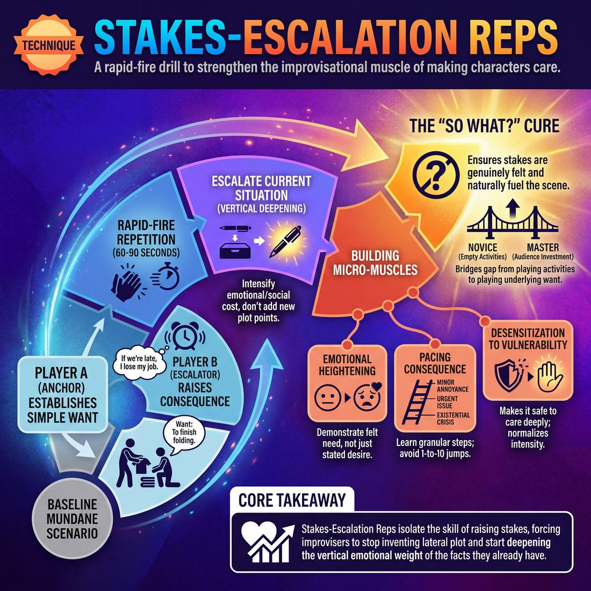

# 🎯 Stakes-escalation reps

> *A drillable muscle that trains **Raising the Stakes**.*

{ .infographic }

## 🎯 The essence

**Stakes-escalation reps** are a rapid-fire, isolated drill designed to strengthen a single improvisational muscle: making characters care. By taking a mundane baseline scenario and repeatedly heightening what is at risk, players practice the mechanics of moving a scene from a casual interaction to a vital, high-consequence moment. It forces improvisers to stop playing mere activities and start playing the underlying **want**, ensuring that every choice incrementally increases the emotional, physical, or social cost of failure for the characters involved.

!!! abstract "The Core Action"
    Taking a neutral or low-stakes scenario and repeatedly injecting it with escalating consequence, forcing the characters to care deeply about the outcome.

## 🎓 What it trains

At its core, this technique isolates and drills the skill of **Raising the Stakes**. It exists to cure one of the most common ailments in improvisation: the "So What?" scene. 

Novice improvisers often play out activities with no reason to care—two people folding laundry and talking about the weather. When they realize the scene lacks momentum, their panic-instinct is usually to invent a sudden, unrelated crisis (a bear attacks! an alien lands!). This exercise trains the exact opposite instinct: taking what is *already* there and making it matter more.

By forcing players to repeatedly escalate a single scenario, this drill builds several critical micro-muscles:

*   **Going Deep vs. Going Wide:** It trains the brain to escalate the *current* situation (deepening) rather than inventing new, distracting plot points (widening). 
*   **Emotional Heightening:** It forces players to move beyond just stating a desire ("I want that promotion") to demonstrating a deeply felt need ("If I don't get this promotion, my father will never respect me").
*   **Pacing Consequence:** It teaches improvisers the granular steps between a minor annoyance and an existential crisis, helping them avoid jumping from a 1 to a 10 too quickly.

!!! abstract "The Deeper Principle: Stakes are Emotional, Not Physical"
    In improv, "stakes" do not necessarily mean life-or-death action movie tropes. Stakes simply answer the question: *What happens to this character if they don't get what they want?* 
    
    A scene about defusing a nuclear bomb has zero stakes if the characters are bored and don't care whether they live or die. Conversely, a scene about splitting a $12 diner check has massive stakes if one character's entire fragile self-worth is tied to being seen as a generous provider. 

Ultimately, this technique bridges a vital gap in an improviser's development. It pushes a player from being an **Advanced Beginner**—who might state a "want" only when reminded by a coach—to a **Competent** and **Proficient** scene architect. It teaches them to establish exactly what is at risk for the character early on, ensuring that the stakes are genuinely felt and naturally fuel the rest of the scene.

## 💡 Why it works

This technique works through **variable isolation**. In a full scene, an improviser’s brain is juggling a massive cognitive load: establishing the platform, identifying the game, remembering names, and moving the narrative forward. By stripping away the need to invent new plot or architecture, this drill frees up 100% of the improviser’s mental bandwidth to focus on a single, vital question: *Why does this matter right now?*

It forces a cognitive shift from **horizontal invention** (adding new facts, characters, or locations) to **vertical deepening** (increasing the emotional weight and consequence of the facts we already have). When you are trapped in a loop and cannot change the subject, you are forced to change the *intensity*. 

!!! abstract "Plot vs. Stakes"
    It is incredibly common for improvisers to confuse "more things happening" with "higher stakes." 
    
    * **Plot escalation (Horizontal):** "The car is broken, and now it's raining, and now a bear is attacking!" 
    * **Stakes escalation (Vertical):** "The car is broken, which means we'll miss the wedding, which means my sister will never forgive me, which means I've finally ruined my last family relationship."
    
    This technique deliberately starves the improviser of plot so they must build stakes.

Finally, the drill exploits a powerful psychological dynamic: **desensitization to vulnerability**. Many improvisers instinctively diffuse tension with a joke or a deflection when a scene gets emotionally heavy—a reflex often called the "comedy defense mechanism." By forcing rapid, repeated exposure to high-stakes emotional choices, these reps normalize intensity. 

It teaches the improviser's nervous system that it is safe to care deeply on stage. This is the exact mechanism that bridges the gap from a **Novice**—who plays empty activities with no reason to care—to a **Master** who can make an audience genuinely invest in the lives of utterly absurd characters.

## 🧩 The setup

To run this drill effectively, you need to strip away the pressure of building a full narrative and focus entirely on the isolated muscle of making things matter. 

*   **Players & Arrangement:** 8–12 players total, divided into pairs. Working in pairs maximizes active reps and prevents players from hiding in the back of a larger group. 
*   **Space & Materials:** An open room. The facilitator should prepare a mental list (or whiteboard list) of incredibly mundane, low-stakes activities (e.g., *waiting for a bus, choosing a paint color, looking for a lost pen, folding laundry*).
*   **Time:** 10–15 minutes total. Each individual "rep" is rapid-fire, lasting only 60–90 seconds before the facilitator calls a reset.
*   **Roles:**
    *   **Player A (The Anchor):** Initiates the scene by establishing the mundane activity and a simple, baseline **want**.
    *   **Player B (The Escalator):** Agrees with the reality, but adds a detail that raises the consequence, urgency, or emotional weight of that want. (Players then volley the escalation back and forth).
    *   **The Facilitator:** Provides the prompts, acts as a timekeeper, and aggressively calls "Reset!" the moment the stakes peak or the players get bogged down in plot.
*   **Prerequisites:** Players must understand the basic definition of stakes (what a character wants, and what they stand to lose if they fail). They should be at least at the **Advanced Beginner** stage, capable of stating a "want" when prompted, so they can now practice attaching *risk* to that want.

!!! quote "How to introduce it"
    "We are going to practice making the mundane matter. I’m going to give your pair a completely boring, everyday scenario—like making a sandwich. 
    
    Your job is to go back and forth, line by line, raising the stakes. Do not change the activity. You are still just making a sandwich. But with each line, you must reveal why *this specific sandwich* is increasingly crucial to your life, your relationships, or your survival. 
    
    We aren't building a full story or worrying about the game of the scene right now. We are just isolating the muscle of making things matter. Escalate until the stakes feel impossibly high, and then I'll call 'Reset' and give you a new prompt."

## ⚙️ The mechanics

The core objective is to systematically turn a mundane interaction into a high-stakes encounter within a strict, compressed timeframe. This relies on a tight, predictable loop so players can focus entirely on the *escalation* rather than inventing plot.

### The Flow of Play

A round consists of two players stepping forward to run a "micro-scene" of exactly six to eight lines. 

1. **The Initiation (The "Want"):** Player A initiates with a grounded, mundane request or action. They must clearly state a simple desire. *(e.g., "Can I borrow your car keys?")*
2. **The Resistance (The Obstacle):** Player B provides friction. They do not block the reality, but they deny the request, hesitate, or add a condition. *(e.g., "I just got it washed, take the bus.")*
3. **The First Escalation (The "Need"):** Player A raises the stakes by revealing *why* this matters right now. The desire shifts from a casual preference to an urgent necessity. *(e.g., "If I'm late to this interview, I lose my unemployment benefits.")*
4. **The Relational Escalation (The Cost):** Player B makes the stakes personal. The focus shifts from the external problem (the car/the interview) to the relationship between the two characters. *(e.g., "You've been unemployed for a year because you refuse to wake up before noon. I'm not enabling you anymore.")*
5. **The Boiling Point (The Ultimatum):** Player A pushes the consequence to its absolute emotional peak. What happens if they don't get what they want? *(e.g., "If you don't give me those keys, I am walking out that door and I am never calling you 'Dad' again.")*
6. **The Reset:** The coach immediately calls "Scene!" or "Next!" A new pair steps up, and the loop begins again with a new mundane initiation.

### Rules & Constraints

To ensure the drill builds the right habits, enforce these strict boundaries:

* **No External Catastrophes:** Players may not escalate by introducing sudden, unrelated emergencies. The escalation must be rooted in the characters, their history, or the immediate consequence of the "Want."
* **Emotion Must Match the Facts:** A common mistake is stating high stakes with a flat, unaffected tone. If the consequence is life-altering, the character's physical and vocal emotional state must reflect that weight.
* **Keep it Grounded:** The escalation must logically track from the base reality. If the jump from "borrowing a pen" to "nuclear war" feels unearned, the rep has failed. The goal is *justified* heightening.

!!! warning "Watch out for the 'Sudden Gun'"
    When pressured to raise stakes quickly, panicked improvisers often resort to pulling a literal or metaphorical weapon (e.g., "Give me the pen or I'll shoot you!"). This is a false escalation. It destroys the established reality and replaces it with a generic hostage situation. Force players to find the **internal stakes**—why it hurts their heart, their pride, or their future—rather than threatening physical safety.

!!! tip "On stage: The 'If/Then' trigger"
    If you are struggling to escalate in the moment, use an internal "If/Then" statement to find your next line. *If* I don't get this thing, *then* [insert devastating personal consequence]. You don't have to say the "If/Then" out loud, but thinking it will instantly clarify your character's stakes.

## 🎬 Sample round

!!! example "Sample round: The Company Picnic"
    Here is a rapid-fire progression of a two-person rep. Notice how the players start with a mundane, low-stakes disagreement and systematically escalate the **consequence of failure**, the **urgency**, and the **personal cost** with every single line.

    **Player A:** "I'm not going to the company picnic this year."  
    *The Base Reality. A simple preference is stated, but there is no consequence yet. The stakes are zero.*

    **Player B:** "You have to. If you don't go, I'll be stuck talking to the CEO by myself."  
    *Adding Relational Stakes. Player B makes A's choice matter to them personally. The consequence is social discomfort.*

    **Player A:** "Every time you talk to the CEO alone, you panic and volunteer us for a weekend retreat. I can't lose another Sunday doing trust falls."  
    *Escalating the Consequence. Player A raises the stakes by defining exactly what is at risk: their precious free time and physical comfort.*

    **Player B:** "If I don't volunteer us, he's going to promote Jenkins. And if Jenkins becomes our boss, he's already said he'll fire you."  
    *Introducing the Ultimate Threat. Player B escalates from a ruined weekend to a threat to their livelihood. The stakes are now existential to the character's survival.*

    **Player A:** "If I get fired, we lose the dental plan. I am mid-root canal, Sarah. I will literally lose my teeth if I don't go to this picnic."  
    *Grounding the Existential Threat. Player A takes the abstract threat of "being fired" and makes it visceral, immediate, and highly personal. The scene is now fueled by a tangible, urgent want.*

    **Takeaway:** In just five lines, the scene has moved from a casual "I don't want to go" to "I must go to save my teeth." The players didn't change the subject; they simply dug deeper into *why* the subject mattered.

## 🎚️ Variations & progressions

To keep this drill challenging as improvisers grow, you must shift the focus from blunt *external* consequences (money, physical danger) to nuanced *internal* and *relational* vulnerabilities. 

Here is how to ramp the difficulty of the reps, aligning with the improviser's maturity stage:

| Focus | Target Stage | The Drill Constraint | Example |
| :--- | :--- | :--- | :--- |
| **Stated Wants** | **Novice / Adv. Beginner** | Players must explicitly state what they want and why they care before acting. | *"I need to win this spelling bee to prove I'm smart."* |
| **Relational Risk** | **Competent** | Stakes must directly threaten the relationship between the two characters on stage. | *"If you misspell this word, I can't be your mother anymore."* |
| **Felt, Not Stated** | **Proficient** | Players cannot use the words "want," "need," or "if/then." Stakes must be conveyed purely through tone, pacing, and urgency. | *(Trembling hands, pleading eye contact)* *"Spell 'cat' for me. Please."* |
| **Micro-Stakes** | **Master** | The object of desire must be utterly mundane, but the emotional weight must be devastating. | Making a dropped pencil feel like a Greek tragedy. |

### Common Variations

**1. The "If/Then" Escalator (Easier)**
If players are struggling to find consequences, force them into a rigid syntactic structure. Player A states an action, and Player B must reply with an "If/Then" statement that raises the stakes. 
*Player A: "I am going to paint this wall blue."*
*Player B: "If you paint that wall blue, then the homeowner's association will evict us."*

**2. The Teacup Drill (Harder)**
Ban all external emergencies. No one can be fired, divorced, arrested, or killed. The players must take a trivial, everyday activity (like pouring a cup of tea or folding a towel) and escalate the stakes entirely through their emotional reaction to how the task is being performed. 

!!! example "In a scene"
    **Player A:** *(Carefully folding a towel)* "Corners to corners. Just like you showed me."  
    **Player B:** *(Watching intensely)* "If you let that terrycloth touch the floor, David... it means you've given up on us."  
    **Player A:** *(Freezes, sweating)* "I'm holding it. I'm holding it so tight."

**3. Silent Escalation (Advanced)**
Remove dialogue entirely. Players must escalate the stakes of a shared physical activity using only eye contact, breathing, proximity, and the speed or tension of their object work. This forces players to rely on the physical sensation of stakes rather than intellectualizing them.

!!! warning "Watch out"
    **The "Death and Guns" Trap:** When asked to raise stakes, beginners will almost always jump straight to murder, explosions, or terminal illness. If you see this happening, immediately pause the rep and apply the **Teacup Drill** constraint. Teach them that a papercut that ruins a first date is vastly more playable than a sudden meteor strike.

## 🧑‍🏫 Coaching notes

!!! tip "Coaching: The Golden Cue"
    **"Make it personal, not just bigger."**  
    When players get stuck, they instinctively try to escalate the *circumstances* (adding a ticking bomb, a sudden illness, a ghost). Side-coach them to escalate the *internal consequence* instead. The stakes must matter to the character's heart, ego, or worldview, not just their physical safety.

When running these reps, your primary job as a coach is to keep the pace brisk while acting as a filter for genuine emotional investment. You are training players to move past **Novice** habits (playing activities with no reason to care) and pushing them toward **Proficient** play (where stakes are deeply felt and fuel the scene).

### The Side-Coaching Menu
Use short, punchy prompts while the players are mid-rep. Do not stop the scene to explain; just drop the cue and let them incorporate it:

*   **"What do you lose if you fail?"** — Forces the player to define the immediate consequence.
*   **"Why today?"** — Injects immediate urgency into a passive want.
*   **"Look them in the eye and tell them why it matters."** — Grounds the escalation in the relationship rather than the ether.
*   **"Drop the plot, raise the emotion."** — A quick correction when players start inventing absurd external events instead of deepening their internal need.
*   **"Make me believe you."** — Challenges the player to drop the "comedy voice" and play the reality of the risk.

### What "Good" Looks and Sounds Like
You will know the drill is working when you observe a distinct shift in the room's energy. Look for these observable markers:

| Marker | Weak Rep (Plot Escalation) | Strong Rep (Stakes Escalation) |
| :--- | :--- | :--- |
| **Physicality** | Pacing, frantic gestures, looking around the room for ideas. | Planted feet, stillness, locked eye contact. |
| **Vocal Tone** | Getting louder, yelling to simulate intensity. | Dropping into a grounded register; intensity increases, but volume might actually drop to a whisper. |
| **Specificity** | Vague threats ("I'll be ruined!" or "We're going to die!"). | Highly specific emotional risks ("If I don't get this promotion, my father will finally have proof I'm a failure."). |

!!! note "Pacing the Reps"
    Don't let a single rep drag on. If a pair hits a brilliant, grounded escalation that makes the room gasp or lean in, immediately call "Scene!" or "Next!" End on the high water mark so their bodies remember what success feels like.

## 🧭 Debrief & reflection

The goal of the debrief is to move players from an intellectual understanding of the exercise (simply naming bigger things) to a somatic, felt experience. You want to guide them from the **Competent** stage—where they can state what is at risk—toward the **Proficient** stage, where the stakes are genuinely felt and naturally fuel the scene's progression.

To lock in the learning, gather the group and ask these targeted questions:

*   **"Which escalation felt the most personal, rather than just the biggest?"** 
    This helps players distinguish between external stakes (the building is on fire) and emotional stakes (my father will finally be proud of me). 
*   **"At what point did you feel like you hit a ceiling and couldn't go any higher?"**
    This addresses pacing. It prompts players to reflect on whether they jumped from a "2" to a "10" too quickly, skipping the rich, playable middle ground.
*   **"How did your body or voice change as the stakes increased?"**
    This connects the cognitive task of raising stakes to the physical reality of acting. Did they tense up? Did they get quieter? 
*   **"When did your partner's escalation make you genuinely react?"**
    This reinforces that stakes are a shared burden. An escalation only works if the partner allows themselves to be affected by it.

!!! abstract "What a good debrief surfaces"
    A successful reflection period usually leads to a few common "aha" moments for the ensemble:
    
    1.  **Small can be massive:** Players realize that a highly specific, interpersonal consequence (e.g., "I won't be invited to the wedding") often feels heavier and is easier to play than a global catastrophe (e.g., "The earth will explode").
    2.  **The danger of the panic-jump:** The group will recognize their collective tendency to panic and immediately jump to life-or-death scenarios when pressured, realizing that gradual escalation requires more patience and trust.
    3.  **Stakes require vulnerability:** Players discover that to truly raise the stakes, their characters must care deeply about something, which requires dropping their armor and playing with genuine emotion.

## ⚠️ Common pitfalls

!!! warning "Watch out: Escalating the plot instead of the stakes"
    The single biggest trap in this drill is confusing *stakes* with *circumstances*. When asked to raise the stakes, a novice will almost always add external chaos: *"Oh no, the kitchen is on fire!"* This is plot escalation. True stakes escalation is internal and relational: *"If this dinner isn't perfect, my in-laws will make my wife miserable for the rest of our marriage."* Stakes are about why the character cares, not how crazy the world gets.

When improvisers are put under the cognitive load of rapid-fire reps, their brains often panic and default to familiar, unhelpful patterns. Here are the most common ways this technique breaks down, and how to fix them:

*   **The 1-to-10 Leap**
    *   *The Trap:* Players jump immediately from a minor annoyance to life-or-death consequences in a single rep, leaving them nowhere to go. 
    *   *The Fix:* Coach the micro-escalation. Force them to find the *next logical step* of caring. If rep one is "I want this parking spot," rep two shouldn't be "I will die for this spot." It should be "I am already late for my daughter's recital, I need this spot."
*   **Inventing instead of Deepening**
    *   *The Trap:* Under pressure, players try to invent brand new backstory, objects, or characters to make the scene feel more important. This clutters the scene and dilutes the focus.
    *   *The Fix:* Constrain them to the elements already in play. Tell them: *"You cannot add anything new; you can only care more about what is already here."* 
*   **The "Tell, Don't Show" Declaration**
    *   *The Trap:* As seen in the **Advanced Beginner** stage, players will simply state their want dryly when prompted: *"I really want to win this spelling bee."* It satisfies the intellect but lacks emotional weight.
    *   *The Fix:* Ask them to tie the stakes to a physical action or a specific consequence. *"Show me what losing looks like in your body,"* or *"Who is watching you right now?"*

!!! tip "The 'So What?' Test"
    If a player offers an escalation and it falls flat, pause the rep and ask them, *"So what?"* If they say, *"I lost the map,"* ask *"So what?"* If they can't immediately answer why losing the map destroys their character's day, they haven't found the stakes yet.

## 🌟 What mastery looks like

When an improviser masters stakes-escalation reps, the exercise stops looking like a mechanical drill and transforms into a masterclass in emotional grounding. The most obvious indicator of mastery is that the escalation is felt internally rather than pushed externally. The improviser no longer relies on volume, speed, or sudden plot twists to raise the stakes; instead, they deepen the emotional reality of the moment.

You can observe mastery in this technique through several distinct behaviors:

*   **Micro-escalations over macro-leaps:** Instead of jumping from a minor inconvenience to a life-or-death catastrophe (like a spilled coffee leading to a nuclear launch), the master escalates the *meaning* of the event. They use hyper-specific details to make the small thing matter immensely.
*   **Physical and vocal embodiment:** The body reacts visibly to the rising stakes. As the stakes escalate, the master’s voice might actually drop in volume and pitch, their posture might tighten, or their eye contact might become piercingly direct. The stakes are **felt, not stated**.
*   **Relational vulnerability:** The master always ties the escalating stakes back to the relationship between the characters. The rising tension threatens, changes, or deepens their bond, making the audience genuinely care about absurd people in absurd situations.
*   **Invisible execution:** The master reads what the scene needs and serves it invisibly. The escalation never feels forced or bolted onto the scene; it feels like the inevitable unearthing of what was already there.

!!! example "In a scene: The Master's Escalation"
    Imagine a scene starting with two friends at a bowling alley. 
    
    **Novice escalation (Plot-driven, external):** 
    "If we don't win this bowling tournament, the mob is going to blow up the alley!"
    
    **Master escalation (Character-driven, internal):** 
    "If we don't win this tournament... I don't know how I'm going to look my son in the eye tonight and tell him his dad is a winner. I need this, Dave. I need him to look at me the way he looks at you."

Ultimately, a master performing these reps demonstrates that **Raising the Stakes** is not about making the situation bigger, but about making the characters care more deeply. They architect a full arc with real consequence and change, entirely in real time.

## 🔗 Why it matters

At its core, compelling improv is simply the act of watching people care about things. **Stakes-escalation reps** isolate the exact moment a scene threatens to plateau and force you to push the intensity upward. By drilling this specific action, you build the muscle memory required for the broader skill of **Raising the Stakes**. Instead of panicking and inventing new, random details when a scene loses momentum, you learn to dig into what is already there and make it matter *more*.

This technique is vital for mastering the domain of **The Scene**, because stakes are the universal fuel for both major improv engines:

*   **In the Game Engine (comedic pattern):** Escalating stakes prevents the unusual behavior from feeling like empty, detached clowning. When a character cares desperately about their absurd worldview, the comedy hits harder and sustains longer.
*   **In the Story Engine (narrative arc):** Escalating stakes provides narrative consequence. A story only exists if something of value—a relationship, a job, a core belief, a physical object—is genuinely at risk. 

!!! abstract "Plot vs. Consequence"
    Novice improvisers often confuse *escalating stakes* with *adding plot* (e.g., "Oh no, now there's a bomb!"). This drill trains the brain to focus on *consequence* instead (e.g., "If I don't get this promotion, I'll have to move back in with my mother"). Plot is what happens; stakes are why it matters.

Ultimately, this drill pushes you along the maturity spectrum of scene work. It drags improvisers out of the novice habit of playing "activities with no reason to care" (Stage 1) and trains them to deliberately establish what is at risk (Stage 3). With enough reps, this conscious effort becomes an unconscious reflex. You reach a point where stakes are no longer awkwardly stated, but deeply felt (Stage 4), allowing you to architect scenes where the audience genuinely cares about the fate of entirely made-up, often absurd people.

## 📚 References & Further Reading

### Foundational sources
*   **Mick Napier, *Improvise: Scene from the Inside Out* (2004)** — Argues aggressively for making strong initial choices and deepening emotional stakes rather than relying on plot invention, directly addressing the fear that causes improvisers to bail on scenes.
*   **Keith Johnstone, *Impro: Improvisation and the Theatre* (1979)** — The foundational text on status and narrative, illustrating how mundane interactions are made compelling through subtle shifts in power, risk, and consequence.
*   **Charna Halpern, Del Close, and Kim "Howard" Johnson, *Truth in Comedy: The Manual of Improvisation* (1994)** — Establishes the core Chicago long-form philosophy that the emotional relationship between the characters must always take precedence over the plot of the scene.

### Practitioner guides & manuals
*   **Matt Besser, Ian Roberts, and Matt Walsh, *The Upright Citizens Brigade Comedy Improvisation Manual* (2013)** — Codifies the concept of "heightening" and explicitly breaks down the critical difference between exploring a scene vertically (deepening the stakes of the current reality) versus horizontally (inventing new plot points).
*   **Will Hines, *How to Be the Greatest Improviser on Earth* (2016)** — Offers highly practical advice on the mechanics of scene work, specifically focusing on the necessity of making characters care deeply about the current situation and practicing isolated "reps" to build muscle memory.
*   **Sanford Meisner and Dennis Longwell, *Sanford Meisner on Acting* (1987)** — While a traditional acting text, its breakdown of the "Repetition Exercise" is the direct theatrical ancestor to this improv drill, demonstrating how stripping away plot forces actors to rely entirely on observation and emotional stakes.

### Lineage & teachers
*   **The Annoyance Theatre** — Founded by Mick Napier, this Chicago theater and training center is the primary lineage for teaching improvisers to prioritize individual emotional power, bold choices, and high-stakes reactions over group plot mechanics.
*   **Upright Citizens Brigade (UCB)** — The institutional champion of the "If this is true, what else is true?" framework, which is the cognitive engine behind vertical stakes escalation.
*   **The Neighborhood Playhouse (Meisner Technique)** — The acting lineage that pioneered the use of rapid-fire, isolated repetition drills to bypass the intellect, normalize vulnerability, and train raw emotional responsiveness.

### Research & theory
*   **Charles Limb and Allen Braun, *Neural Substrates of Spontaneous Musical Performance: An fMRI Study of Jazz Improvisation* (2008)** — Demonstrates that during improvisation, the brain's dorsolateral prefrontal cortex (the inner critic) deactivates; rapid-fire reps exploit this mechanism to bypass the improviser's "comedy defense mechanism."
*   **John Sweller, *Cognitive Load During Problem Solving: Effects on Learning* (1988)** — The foundational paper on Cognitive Load Theory, explaining why "variable isolation" (removing the need to invent plot) frees up the mental bandwidth required for improvisers to focus entirely on emotional stakes. *(Adjacent theory applied to improv pedagogy).*

### Talks, videos & courses
*   **Charles Limb, *Your Brain on Improv* (TED Talk, 2010)** — A highly accessible breakdown of his fMRI research, explaining the neurological necessity of shutting down self-censorship and normalizing risk to achieve creative flow.
*   **Will Hines, *Improv Nonsense* (Blog & Newsletter)** — An ongoing, highly regarded resource where Hines frequently breaks down the exact mechanics of heightening, stakes, and avoiding the trap of horizontal plot invention.

### Communities & adjacent reading
*   **Brené Brown, *Daring Greatly* (2012)** — Though not an improv book, its research on vulnerability and the human instinct to deflect tension with humor perfectly explains the psychological "comedy defense mechanism" this drill seeks to cure. *(Adjacent reading).*

## 💬 Quotes & Anecdotes

!!! quote "— Keith Johnstone, *Impro for Storytellers* (1999)"
    A good way of advancing the scene: make the conflict or events have greater consequences for the characters.

!!! quote "— Greg Hess, *iO Chicago / The Second City* (quoted in *The Monarch Review*, 2014)"
    All the things that we learn — CROW [Character, Relationship, Objective, Where], stakes, everything — they’re all tools to help us make something onstage important. So just do that — make something important.

!!! quote "— Will Hines, *How to Be the Greatest Improviser on Earth* (2016)"
    A VERY LOOSE rule of thumb: If the character is easy going, raise the stakes. Stoners, dummies, happy idiots, chill bros. If the character is intense, lower the stakes. In each case, you're making the context contrast with the energy of the main person.

### Where it comes from
The concept of "stakes" is borrowed directly from classical acting and Konstantin Stanislavski's system (often framed as the character's "objective" and the "obstacle"). In the improv world, pioneers like Viola Spolin and Keith Johnstone adapted these ideas to help unscripted actors maintain momentum without relying on cheap jokes. Johnstone frequently taught that improvisers naturally try to protect themselves from being altered or affected on stage; raising the stakes forces the improviser out of their safety zone and demands a genuine reaction. 

The specific rapid-fire drill of "stakes-escalation" (sometimes taught under names like "Make it Matter" or "String of Pearls") is a modern coaching staple popularized by long-form training centers like the Upright Citizens Brigade (UCB) and iO Theater. It was developed to cure "inventitis"—the novice habit of endlessly adding new, wacky plot details instead of deepening the emotional reality of what has already been established.

### A telling example
To understand how stakes-escalation reps work in practice, look at this **illustrative scene** demonstrating the difference between horizontal plot invention and vertical stakes escalation.

**The Baseline (Low Stakes):**
*Player A:* "Can I borrow your car keys?"
*Player B:* "I need them to go to the store later."
*(The scene has a want and an obstacle, but no reason to care. A novice might panic and invent a horizontal plot twist: "Oh no, a meteor is falling!")*

**Escalation 1 (Adding consequence):**
*Player A:* "Can I borrow your car keys? If I don't get to this job interview, the bank is going to foreclose on my house."
*Player B:* "I need them to go to the store. The pharmacy closes in ten minutes and my mom needs her heart medication."
*(The players are still just arguing over car keys, but the physical consequences of failure are now severe.)*

**Escalation 2 (Deepening the emotional risk):**
*Player A:* "If I lose the house, my kids will finally realize I'm a failure, just like my dad was."
*Player B:* "If I don't get this medication, I'm the one who let Mom die because I was too busy watching TV to run errands earlier."
*(The plot hasn't changed at all—it is still just two people in a living room holding a set of keys—but the emotional stakes are now massive. The improvisers are forced to play the scene with genuine intensity.)*

## 🧭 Explore the framework

- ⬆️ **Skill it trains:** [Raising the Stakes](03_S7__raising-the-stakes.md)
- 🎭 **Domain:** [The Scene](03_D__the-scene.md)
- 🔁 **Sibling techniques:** [Make it matter more beats](03_S7_T2__make-it-matter-more-beats.md)
