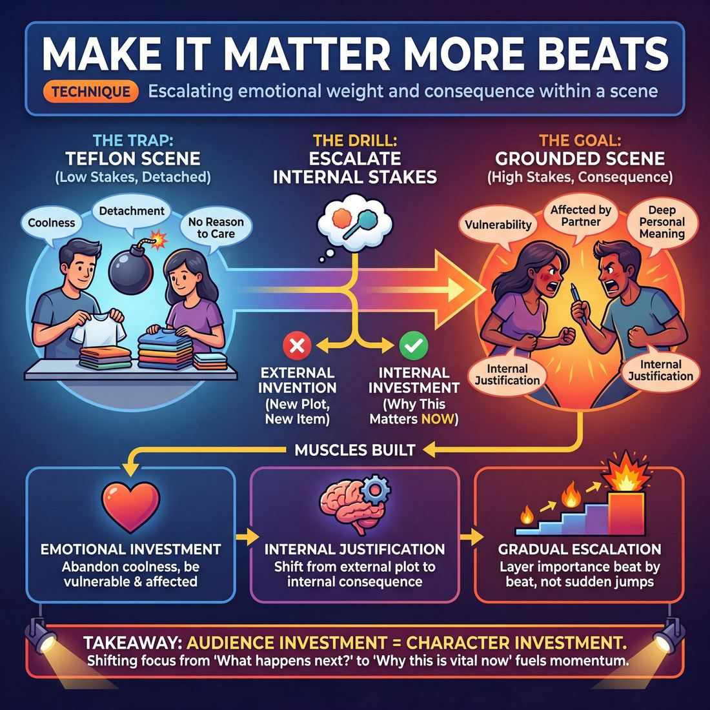

# 🎯 Make it matter more beats

> *A drillable muscle that trains **Raising the Stakes**.*

{ .infographic }

## 🎯 The essence

"Make it matter more beats" is a targeted scene exercise where improvisers are periodically prompted to increase the emotional weight, personal consequence, and urgency of whatever is currently happening on stage. Instead of inventing new plot points, introducing external conflicts, or changing the subject, players practice the single, vital muscle of **raising the stakes** from within. It forces them to take an established situation—no matter how mundane—and continuously escalate exactly *why* it is deeply, urgently important to the characters in this exact moment.

## 🎓 What it trains

This technique isolates and overloads the critical skill of raising the stakes. 

It is the direct antidote to one of the most common afflictions in early improv: the **Teflon scene**. This is a scene where characters experience bizarre, dangerous, or deeply personal events, but nothing seems to emotionally affect them. A novice improviser often plays activities with no reason to care—they might be defusing a nuclear bomb, but they converse with the casual detachment of someone folding laundry. Alternatively, they might argue endlessly about a trivial detail (like who took the last donut) without ever grounding *why* that detail matters.

By forcing players to repeatedly articulate and embody why the current situation is vital, this drill builds three specific muscles:

*   **Emotional Investment:** It trains players to abandon "coolness" and ironic detachment. You cannot make something matter without allowing your character to be vulnerable, passionate, and genuinely affected by their partner.
*   **Internal Justification:** It shifts the focus from *external* plot (what is happening) to *internal* consequence (what this means to me). Arguing over a stolen pen is a trivial plot point; arguing over a stolen pen because it represents the respect you feel you are constantly denied in this office is a compelling scene.
*   **Gradual Escalation:** It teaches the rhythm of stepping up importance. Instead of panicking and jumping immediately to absurd extremes, players learn to layer personal meaning beat by beat.

!!! abstract "The Deeper Principle"
    The audience's investment is directly proportional to the characters' investment. If the people on stage do not care about what is happening, the audience has no reason to care either. This technique bridges the gap between a beginner who merely states a "want" when prompted, and a proficient player whose stakes are deeply felt, unspoken, and actively fuel the scene's momentum.

## 💡 Why it works

!!! abstract "The Core Engine: Investment over Invention"
    This technique works by artificially constraining the improviser’s instinct to invent new plot points, forcing them instead to deepen their emotional investment in what already exists. It shifts the brain from asking *"What happens next?"* to *"Why does this matter right now?"*

At its core, "Make it matter more beats" exploits a common cognitive trap in improvisation: the false equivalence between **stakes** and **danger**. When asked to raise the stakes, a novice's panic-response is almost always external invention. They introduce a weapon, a ticking bomb, or a sudden terminal illness. 

This drill removes the escape hatch of external plot. By prompting players to escalate the importance of the *current* moment without changing the physical circumstances, it forces them to rely on emotional gravity. 

Here is why the underlying mechanism is so effective:

*   **It bypasses the "plot brain":** When you cannot add a new character or a crazy event to make a scene interesting, you are forced to look inward. You must find the consequence in the relationship, the history, or the character's core vulnerability.
*   **It demands genuine reaction:** To make something matter more, a character has to care. Caring requires letting your partner's words actually affect you. This naturally slows the scene down, forces sustained eye contact, and grounds the players in their bodies.
*   **It bridges the gap from "Want" to "Need":** It pushes players from superficial desires to profound emotional risks. 

| The Instinct (External Invention) | The Drill's Engine (Internal Investment) |
| :--- | :--- |
| Pulling out a weapon | Revealing a deeply held secret |
| Changing the location abruptly | Changing the emotional temperature of the room |
| Yelling to show intensity | Dropping to a whisper to show consequence |
| Introducing a bizarre new element | Explaining why the mundane element is sacred |

!!! example "In a scene"
    Two characters are arguing over who gets the last blueberry muffin at a cafe. 
    
    The instinct to "raise the stakes" might be to have one character pull a gun, or reveal the muffin is poisoned. The **Make it matter more** prompt forces a different path: one character reveals they are buying it for their mother, who has dementia and only remembers this specific bakery. The external action (buying a muffin) remains incredibly small; the internal consequence becomes massive.

Ultimately, the drill works because it aligns the improviser with the audience's natural empathy. Audiences rarely care about the physical objects or the imaginary geography on stage; they care intensely about how those things impact the human beings standing in front of them.

## 🧩 The setup

Here is everything you need to arrange before running this exercise. Because this drill isolates a highly specific muscle, a focused, tightly controlled environment works best.

*   **Players & Group Size:** Ideal for a standard workshop group of 8 to 16 players. 
*   **Arrangement:** Two players up on stage at a time, with the rest of the group seated as an active audience. 
*   **Space & Materials:** An open stage or playing area. Two chairs are highly recommended to encourage grounded, physical stability while the emotional stakes escalate. No other materials are needed.
*   **Time Required:** 15–20 minutes total. Allocate roughly 90 seconds to 2 minutes per pair, allowing everyone to get at least one turn.
*   **Roles:**
    *   **The Players:** Two improvisers who initiate a mundane, grounded scene and must justify sudden spikes in importance.
    *   **The Facilitator:** Acts as the external pressure valve. The facilitator watches the scene and calls out the prompt ("Make it matter more!") every 15 to 30 seconds.
    *   **The Audience:** Observes the mechanics of the scene, specifically watching for *how* the players choose to escalate (emotionally, circumstantially, or relationally).
*   **Prerequisites:** Players should already be comfortable establishing a basic **Platform** (the who, what, and where of a scene). They should be at least at the *Advanced Beginner* stage, where they can state a character's "Want," giving them a foundation to build upon when asked to increase the risk.

!!! tip "Facilitator Script"
    "We are going to practice moving a scene from casual to vital. Two players will get up and start a completely normal, grounded scene—something mundane, like folding laundry or waiting for a bus. 
    
    Every twenty seconds or so, I am going to call out, *'Make it matter more.'* 
    
    When you hear that, you cannot invent a sudden alien invasion or pull out a gun. You must stay in the exact reality you've built, but you must instantly raise the internal or relational stakes. Find a reason why this specific moment, this specific conversation, or this specific relationship is deeply important to your character right now. Don't just get louder—find a reason to care."

## ⚙️ The mechanics

The core objective of this drill is to build the muscle of **internal escalation**. It forces improvisers to systematically increase the emotional weight, urgency, and consequences of a scene without abandoning the established reality. 

Here is the step-by-step flow of play:

1. **Establish the Platform:** Two players take the stage, get a suggestion, and begin a standard scene. Their initial goal is simply to establish a grounded base reality (the who, what, and where) and discover the initial dynamic between their characters.
2. **The Prompt:** Once the platform is stable (usually 30 to 60 seconds in), the coach calls out the directive: *"Make it matter more."* 
3. **The Escalation:** The players must immediately deliver a line, make a confession, or take a physical action that raises the stakes. The situation must instantly become more important to the characters than it was five seconds ago.
4. **Sustain the New Baseline:** The players do not immediately resolve the new tension. They must play the scene at this newly heightened level of emotional investment, treating the escalated stakes as their new normal.
5. **Repeat and Compound:** Every 30 to 45 seconds, the coach repeats the prompt. With each call, the players must find a new way to compound the stakes, layering consequence upon consequence. 
6. **The Climax and Reset:** After 3 to 5 prompts, the scene will naturally reach a boiling point of high stakes and deep character investment. The coach calls "Scene," clears the stage, and a new pair steps up.

### Rules of the Drill

To ensure the technique trains genuine emotional stakes rather than cheap shock value, players must adhere to three strict constraints:

* **No external emergencies:** You cannot raise the stakes by introducing a sudden heart attack, a ninja, or a natural disaster (unless the scene was already explicitly about those things). The escalation must come from *within* the existing situation.
* **Make it relational:** The easiest way to make something matter more is to tie it to the relationship. A disagreement about washing the dishes must escalate into what the dishes *represent* about the characters' marriage.
* **React, don't just declare:** It is not enough to simply state a high-stakes fact. The characters must physically and emotionally *feel* the weight of the new information. 

!!! tip "On stage: Three ways to escalate"
    When you hear the prompt, you can pull one of three levers to instantly raise the stakes:
    1. **Time:** Add a deadline. (*"They're walking up the driveway right now."*)
    2. **Consequence:** Reveal what happens if they fail. (*"If this cake falls, I lose the bakery."*)
    3. **Vulnerability:** Reveal a secret or a deep personal need. (*"I only bought this boat because I thought it would make you love me."*)

!!! warning "Watch out for 'Artificial Inflation'"
    A strict rule of this mechanic is that volume does not equal stakes. Yelling, crying artificially, or moving frantically without a grounded reason violates the constraints of the drill. The *situation* must dictate the intensity, not the actor's volume knob.

## 🎬 Sample round

!!! example "Sample round: Packing the Boxes"
    **The Setup:** Two improvisers, Alex and Sam, are center stage miming the activity of packing cardboard boxes. 

    **Alex:** "Make sure you tape the bottom of that one twice. The plates are heavy."  
    **Sam:** "Got it. Hand me the bubble wrap."  
    
    > **Annotation:** The scene begins with a simple, grounded base reality. The stakes are purely physical and low (plates might break). They are playing the activity, but there is no reason to care yet.

    **Coach:** "Freeze. Make it matter more. Go."

    **Alex:** "Tape it twice, please. Those are the plates we bought on our honeymoon in Mexico."  
    **Sam:** *(Pauses)* "I know. I'm packing them carefully so they survive the drive to my new apartment."  
    
    > **Annotation:** The improvisers immediately elevate the stakes from physical to **relational**. The plates are no longer just dishes; they are a symbol of the marriage, and we discover the couple is separating. The "want" is starting to emerge.

    **Coach:** "Freeze. Make it matter more. Go."

    **Alex:** "If those plates break, Sam, I swear it's like the last ten years meant absolutely nothing to you."  
    **Sam:** "They mean everything to me! That's why I'm taking them! I need *something* to prove we were actually happy once."  
    
    > **Annotation:** The stakes are now **emotional and existential**. The physical object has become the battleground for their shared history and individual grief. The scene has moved from a mundane task to a deeply felt, high-stakes confrontation where both characters have something profound at risk.

    **Coach:** "Freeze. Make it matter more. Go."

    **Alex:** *(Drops the tape, voice dropping to a whisper)* "You don't need the plates to prove we were happy. You just need to look at me."  
    **Sam:** *(Drops the bubble wrap, stepping away from the box)* "I can't. Because if I look at you, I won't leave."  
    
    > **Annotation:** The ultimate escalation. The improvisers drop the physical activity entirely to focus on the raw, vulnerable truth of the moment. The stakes are no longer about the plates or the move—they are about the immediate, terrifying risk of staying versus going.

## 🎚️ Variations & progressions

As improvisers grow from playing empty activities to feeling genuine consequences, this drill must evolve. You can scale the difficulty from blunt, external coaching to subtle, internal shifts that test a player's emotional range.

Here is how to ramp the difficulty, aligned with a player's maturity in raising the stakes:

*   **Freeze & State (Stage 2: Advanced Beginner)**
    Players at this stage often only state a "want" when reminded. Instead of calling out "Make it matter more" while the scene runs, the coach yells "Freeze!" and asks each player: *"What do you stand to lose right now?"* Players answer out of character, then unfreeze and immediately inject that specific risk into their next line. 
*   **The Specific Dial (Stage 3: Competent)**
    Competent players know how to establish risk, but often default to external, life-or-death tropes. To force variety, the coach calls out *specific* dimensions of stakes:
    *   *"Make the relationship matter more!"*
    *   *"Make your reputation matter more!"*
    *   *"Make the object matter more!"*

!!! example "In a scene"
    **Player A:** "I can't believe you dropped the cake."
    *(Coach: "Make the object matter more!")*
    **Player A:** "That was my grandmother's recipe, and it's the only thing I have left of her."

*   **The Whisper Escalation (Stage 4: Proficient)**
    Proficient players understand that stakes must be *felt, not stated*. A common trap when asked to "make it matter more" is to simply get louder and angrier. In this variant, every time the coach prompts the escalation, the players must increase the emotional weight while *lowering* their volume and physical intensity. 

!!! tip "On stage"
    If you are forced to whisper your highest-stakes moment, you cannot rely on theatrical yelling to convey importance. You must rely on intense eye contact, grounded stillness, and devastatingly specific word choice.

*   **The Self-Directed Metronome (Stage 5: Master)**
    At the master level, players make the audience genuinely care about absurd people without needing a coach's intervention. In this progression, there are no external prompts. The duo agrees to internally "click" the stakes up every four lines. They must seamlessly weave escalating consequence into the narrative architecture in real time, never forcing the emotion, but letting the scene's gravity naturally deepen.

## 🧑‍🏫 Coaching notes

In this exercise, the coach acts as a real-time pressure valve. Your goal is to catch the scene right as it plateaus and force the players to dig deeper into the **"Want"** and the consequences. You are training them to move from playing activities with no reason to care to establishing what is genuinely at risk for the character.

!!! tip "Coaching"
    **The single most important cue: "Deepen, don't just deafen."** 
    Coach players to find the stakes in the *relationship* and the *emotion*, not just the volume or the action. 

**Targeted Side-Coaching Prompts**
When you call the beat, players may freeze or panic. Use these specific, targeted prompts to guide them toward grounded stakes:

*   **When they are too casual:** *"Why is today different from every other day?"* (Forces urgency).
*   **When they are arguing about objects/tasks:** *"Make it about how you treat each other."* (Shifts focus from the activity to the relationship).
*   **When they are avoiding vulnerability:** *"What are you terrified of losing right now?"* (Drives them toward the emotional consequence).
*   **When the stakes are vague:** *"Name the specific consequence."* (Pushes them to define exactly what happens if they fail).

**What 'Good' Looks and Sounds Like**
You will know the technique is working when you observe these shifts in the room:

*   **Physical grounding:** Players drop their "cool" or defensive postures. You will often see a sudden stillness, a leaning in, or sustained, intense eye contact.
*   **Heightened specificity:** The dialogue shifts from generalities to sharp details. They move from *"I really need this car"* to *"If I don't get this car, I miss my daughter's recital again."*
*   **Internalized stakes:** The players stop merely stating what they want and begin to let the weight of the situation physically and emotionally fuel their reactions. The audience should feel the tension in the silence between lines.

## 🧭 Debrief & reflection

After a round of "Make it matter more beats," the goal of the debrief is to help players recognize the internal shift from merely *doing an activity* to *caring about an outcome*. A strong debrief moves players away from inventing wild plot twists and toward deepening their emotional investment.

Use these questions to guide the post-exercise reflection:

*   **The pivot point:** "At what exact moment did the scene stop being about the physical task (the activity) and start being about the relationship or the consequence?"
*   **The internal shift:** "How did your physical or emotional state change when the stakes were raised? Did you feel your posture, pacing, or eye contact shift?"
*   **The 'Want' vs. The 'Risk':** "What did your character explicitly want in the first beat? By the final beat, what did they stand to *lose*?"
*   **The alternative:** "If the director hadn't called 'make it matter more,' how would that scene have naturally ended? What did the heightened stakes force you to do differently?"

!!! note "What a good debrief surfaces"
    A successful reflection will reveal that **raising the stakes does not mean raising the volume**. Players often realize that as the stakes got higher, they actually got quieter, more grounded, and more vulnerable. 
    
    It also highlights the progression in a player's maturity: moving from an Advanced Beginner who simply states, "I really need this job," to a Proficient player whose desperation is physically felt and drives every choice they make in the scene.

!!! tip "For the coach: Listen for the 'Aha!'"
    Listen for players noticing that the audience (or the rest of the class) leaned in exactly when the characters started to care. The ultimate takeaway you want to lock in is: **The audience will only care about the scene as much as the characters care about each other.**

## ⚠️ Common pitfalls

!!! warning "Watch out: The External Disaster Trap"
    When a coach calls out "Make it matter more!", the improviser experiences a sudden spike in cognitive load. The brain panics and grabs the loudest, easiest idea available. The result? **External disasters.** 
    
    Instead of deepening the emotional reality, the improviser introduces a gun, a bomb, a sudden terminal illness, or an alien invasion. This destroys the established reality and paradoxically *lowers* the stakes, because the audience knows the actors haven't earned this sudden life-or-death shift. 
    
    **The Fix:** Keep the stakes relational and internal. If the scene is about a broken toaster, don't make the toaster explode. Make the toaster the last gift the character's late mother gave them.

Beyond the external disaster trap, watch for these common novice pitfalls when drilling this technique:

*   **0 to 100 Escalation:** 
    *   *The Trap:* Jumping straight to the ultimate consequence on the very first beat. If a character is annoyed about a messy room, they immediately threaten divorce. This leaves the scene with nowhere to go on subsequent beats.
    *   *The Fix:* Escalate incrementally. First beat: the mess ruins the morning. Second beat: the mess shows a lack of respect. Third beat: the mess makes the character question the future of the relationship. 
*   **Telling, Not Showing:** 
    *   *The Trap:* An Advanced Beginner might remember to state their "Want," saying, "This matters to me a lot!"—but their body language, tone, and pacing remain entirely casual. The stakes are spoken, but not felt.
    *   *The Fix:* Change the physical behavior before changing the dialogue. Grip the table, lower the voice, break eye contact, or breathe heavily. Let the body lead the emotion.
*   **Abandoning the Platform:** 
    *   *The Trap:* In the rush to find higher stakes, players drop the established **Who, What, and Where** (the platform) to focus entirely on a new, unrelated high-stakes issue. 
    *   *The Fix:* Root the new stakes *in* the existing platform. The stakes must amplify the current game or relationship, not replace it. 

!!! example "In a scene: Fixing the 0-to-100 Trap"
    **Player A:** "You forgot to buy milk."
    *(Coach: "Make it matter more!")*
    **Trap:** "You forgot the milk? I'm taking the kids and leaving you!" *(Too fast, unearned).*
    **Better:** "You forgot the milk? I specifically asked you to do *one* thing for my boss's visit today. Now I have to serve him black coffee, and you know how he gets." *(Grounded, relational, leaves room to grow).*

## 🌟 What mastery looks like

When improvisers reach the highest level of proficiency in this drill, the external prompt to "make it matter more" no longer triggers panic or wild plot inventions. Instead, it acts as a scalpel, allowing the players to instantly cut to the emotional core of the scene. 

In a masterfully executed round, the escalation feels entirely inevitable, no matter how absurd the base reality is. You will observe the following behaviors:

*   **Internalizing the stakes:** Rather than adding external threats, master improvisers raise the **internal stakes**. They reveal deep-seated fears, profound loves, or fragile egos. 
*   **Relational gravity:** The focus narrows to the space *between* the characters. The improviser makes the situation matter more specifically because of *who* they are talking to.
*   **Using silence and physicality:** When the prompt is called, a master doesn't immediately rush to speak. You will see them take a breath, let the weight of the moment wash over their face, alter their posture, and hold eye contact before delivering their next line.
*   **Grounding the absurd:** As the maturity progression notes, a master makes the audience genuinely care about absurd people. Even if the scene is about two raccoons fighting over a half-eaten hot dog, the master elevates the stakes so beautifully that the audience feels the genuine heartbreak of the betrayal.

!!! example "In a scene: The Master's Pivot"
    **The Setup:** Two coworkers are arguing over who gets to use the good photocopier.
    
    **The Coach:** "Make it matter more."
    
    *Novice reaction (External/Plot):* "If I don't copy these files, the CEO is going to fire both of us and burn the building down!"
    
    *Master reaction (Internal/Relational):* *(Takes a slow breath, drops the stack of paper, looks the scene partner in the eye)* "I just need one thing in my life to come out crisp and clean, Dave. Just one thing that isn't a blurry, faded mess."

!!! abstract "The Illusion of Inevitability"
    The ultimate sign of mastery in this technique is that an audience watching the drill wouldn't even realize it *is* a drill. The master absorbs the coach's prompt so seamlessly that the sudden spike in emotional vulnerability feels like the natural, intended climax of the scene all along.

## 🔗 Why it matters

"Make it matter more beats" is the antidote to scenes that feel like a series of disconnected, low-energy events. By isolating the muscle of raising the stakes, this technique teaches improvisers to mine the current moment for its emotional weight rather than frantically searching for the next plot point. 

To architect compelling scenes in real time, an improviser must understand consequence. If a character doesn't care about what is happening, the audience won't either. This technique forces the improviser to anchor the scene in a deeply felt "Want" or vulnerability, moving them away from playing empty activities and toward genuine emotional investment.

!!! abstract "Key idea: Vertical vs. Lateral Escalation"
    Improvisers often confuse *escalating* a scene with *complicating* it. 
    
    *   **Lateral moves** add new information: a new character enters, a bomb goes off, the location changes. This dilutes the scene.
    *   **Vertical moves** deepen the existing information: the character reveals *why* the current situation breaks their heart or threatens their identity. "Making it matter more" is a purely vertical move.

Crucially, this muscle fuels both primary engines of improvisation:

*   **In Narrative scenes:** Stakes drive the story arc. When a situation matters deeply, characters are forced into difficult dilemmas. These dilemmas force decisions, and those decisions produce the inevitable character change that defines a great story.
*   **In Game scenes:** Stakes heighten the comedy. The comedic engine roars to life when a character treats a trivial, unusual thing with life-or-death importance. The harder they fight for something absurd, the funnier the game becomes.

Ultimately, mastering this technique shifts an improviser’s fundamental operating paradigm. Instead of standing on stage panicking over *"What happens next?"*, they learn to confidently ask, *"Why does this matter right now?"*

## 📚 References & Further Reading

### Foundational sources
*   **Mick Napier, *Improvise: Scene from the Inside Out* (2004)** — Napier challenges the novice instinct to invent external plot to save a dying scene. He argues instead for making bold internal choices, holding onto your "deal," and raising the stakes without selling out the scene for cheap laughs.
*   **Charna Halpern, Del Close, and Kim "Howard" Johnson, *Truth in Comedy: The Manual of Improvisation* (1994)** — The definitive text on finding the "truth" in a scene. It emphasizes that audiences laugh hardest and care the most when they recognize genuine human emotion and investment, rather than wacky, ungrounded inventions.
*   **Keith Johnstone, *Impro: Improvisation and the Theatre* (1979)** — Explores how status and stakes drive human interaction. Johnstone demonstrates that a scene's narrative power comes from how much the characters are affected by one another, rather than the physical circumstances of the stage.

### Practitioner guides & manuals
*   **Will Hines, *How to Be the Greatest Improviser on Earth* (2016)** — Hines explicitly breaks down the rule to "Be affected," arguing that characters must know what they are doing, care deeply about the issues at hand, and articulate how they feel to avoid flat, unengaging scenes.
*   **Carol Hazenfield, *Acting on Impulse: The Art of Making Improv Theater* (2013)** — Specifically diagnoses the "Teflon Syndrome" in improv—where players remain impervious to emotional pain or consequence, brushing off major revelations. She provides tools for taking the emotional "hit" on stage and letting it matter.
*   **Matt Besser, Ian Roberts, and Matt Walsh, *The Upright Citizens Brigade Comedy Improvisation Manual* (2013)** — Teaches the principle of "If this is true, what else is true?", which forces players to ground their base reality and escalate the internal logic and emotional weight of a scene rather than bailing into absurdity.

### Lineage & teachers
*   **TJ Jagodowski, David Pasquesi, and Pam Victor, *Improvisation at the Speed of Life: The TJ and Dave Book* (2015)** — A masterclass in slow, relationship-based improv. The authors demonstrate how to build massive stakes out of mundane, grounded interactions simply by caring intensely about the other person and reacting truthfully line by line.
*   **Viola Spolin, *Improvisation for the Theater* (1963)** — The foundational text of American improv. Spolin’s exercises focus on genuine connection, physicalization, and staying present in the moment, which trains the exact muscles needed to justify internal stakes.

### Research & theory
*   **Constantin Stanislavski, *An Actor Prepares* (1936)** — Introduces the "Magic If" and "Given Circumstances," the foundational acting theories that require performers to internally justify their actions and treat imaginary stakes as real, urgent needs.
*   **Sanford Meisner and Dennis Longwell, *Sanford Meisner on Acting* (1987)** — Details the Meisner technique's focus on "the reality of doing" and the absolute necessity of being genuinely affected by your scene partner—the exact psychological antidote to the detached "Teflon scene."
*   **Robert Poynton, *Do Improvise: Less push. More pause. Better results. A new approach to work (and life)* (2013)** — Explores the psychological benefits of slowing down, noticing what is already present, and deepening investment rather than constantly pushing to invent new ideas.

### Talks, videos & courses
*   **Will Hines, *Think On Your Feet* (2020)** — An audio course featuring interviews with veteran improvisers that breaks down the mechanics of listening, reacting, and allowing yourself to be emotionally altered by your partner in real time.
*   **TJ & Dave, *Trust Us, This Is All Made Up* (2009)** — A feature-length documentary look at Jagodowski and Pasquesi preparing for and performing a show, perfectly illustrating how to make a scene matter without relying on external plot devices or gimmicks.

### Communities & adjacent reading
*   **Stephen Nachmanovitch, *Free Play: Improvisation in Life and Art* (1990)** — A cross-disciplinary look at the creative process that emphasizes mindfulness, accepting things as they are, and finding deep meaning in the present moment rather than forcing an outcome.
*   **Malcolm Gladwell, *Blink: The Power of Thinking Without Thinking* (2005)** — Often cited by improv teachers to explain rapid cognition and why trusting your immediate, grounded emotional instinct is more effective than engaging the "plot brain" to invent external stakes.

## 💬 Quotes & Anecdotes

!!! quote "— Carol Hazenfield, *Acting on Impulse: The Art of Making Improv Theater* (2002)"
    A common defense mechanism is what I call the Teflon Syndrome. Improvisers suffering from this malady are impervious to pain on stage, especially emotional pain. The Teflon player's wife says to him, 'I want a divorce.' The Teflon player says, 'I was expecting as much,' or 'So what?' or 'I've already filed for divorce.' Anything to keep from taking the hit. Don't let offers slide off you like eggs off a pan. Let them stick to you. Be affected.

!!! quote "— Mick Napier, *Improvise: Scene from the Inside Out* (2004)"
    If the improvisers launch these scenes with high-stakes initiations, all the better. It's a joy to see the relationship of, say, two brothers where the first line of the scene is, 'Sorry I couldn't make it to the funeral.' If both improvisers are in agreement that they are not going to sell out the scene for laughs, that is, play it seriously without joking it out or bailing, improvisation reaches a greater depth.

!!! quote "— Keith Johnstone, *Impro: Improvisation and the Theatre* (1979)"
    There are people who prefer to say 'Yes', and there are people who prefer to say 'No'. Those who say 'Yes' are rewarded by the adventures they have. Those who say 'No' are rewarded by the safety they attain.

!!! quote "— Keith Johnstone, *Impro for Storytellers* (1999)"
    [I] became notorious as the acting coach who would shout 'Be more boring!'

### Where it comes from
The concept of "raising the stakes" is foundational to all dramatic acting—often traced back to Konstantin Stanislavski's focus on character objectives and obstacles. However, its specific application in improv, where players must *discover* the stakes rather than read them in a script, was heavily championed by early Chicago improv directors like Del Close. 

The specific term "Teflon Syndrome" (or the "Teflon player") to describe improvisers who refuse to let a scene matter to them was coined by Carol Hazenfield in her 2002 book *Acting on Impulse*. Meanwhile, Keith Johnstone's famous directive to "be more boring" was his direct antidote to the panic-driven invention of external stakes, forcing players to stop inventing bizarre plot twists and instead find deep importance in mundane, grounded reality.

### A telling example

**The Teflon Divorce**
In *Acting on Impulse*, Carol Hazenfield provides the classic example of a "Teflon" scene: A player initiates with a massive emotional stake, saying, "I want a divorce." Instead of letting this matter, the scene partner deflects to protect themselves, replying, "I was expecting as much," or "So what?" The external plot is highly dramatic, but the internal stakes are zero because neither character allows themselves to be genuinely affected. 

**Illustrative Scenario: The Lost Keys**
Two roommates are looking for a set of lost apartment keys. 
* **External invention (Panic):** "Oh no, the keys were stolen by the Russian mafia, and now they're breaking down the door with lasers!"
* **Internal escalation (Making it matter):** "I need to find these keys because if I'm late to this job interview, I can't make rent." $\rightarrow$ "If you can't make rent, I have to ask my parents for money again, and they'll make me move back to Ohio." $\rightarrow$ "I can't let you move back to Ohio, you're the only reason I haven't lost my mind in this city." 

The physical action remains identical (looking under couch cushions), but the emotional weight of the scene has escalated beat by beat from a minor inconvenience to a relationship-defining crisis.

## 🧭 Explore the framework

- ⬆️ **Skill it trains:** [Raising the Stakes](03_S7__raising-the-stakes.md)
- 🎭 **Domain:** [The Scene](03_D__the-scene.md)
- 🔁 **Sibling techniques:** [Stakes-escalation reps](03_S7_T1__stakes-escalation-reps.md)
