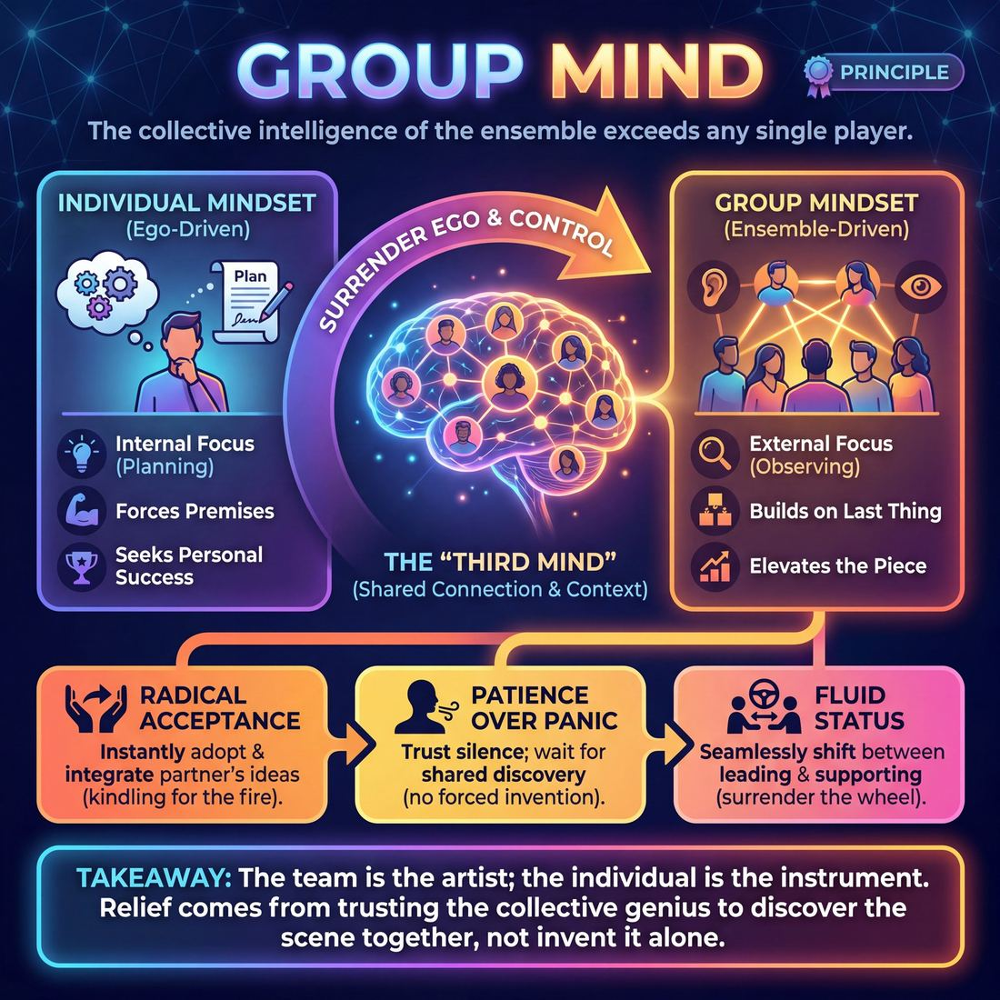

# 💎 Group Mind

> *The team's collective intelligence exceeds any individual.*

{ .infographic }

## 💎 The core belief

At its heart, **Group Mind** is the profound conviction that the collective intelligence of an ensemble far exceeds the capacity of any single improviser within it. It is the belief that when a group of performers breathes, listens, and reacts as a single organism, they can generate art that is more intricate, surprising, and resonant than anything a solo genius could pre-plan. In improv, the ensemble is not merely a collection of individuals taking turns; it is a distinct, emergent entity. When you trust in Group Mind, you operate under the assumption that the **third mind**—the invisible web of connection and shared context between players—is the true author of the show.

To hold this principle is to fundamentally surrender the ego. It requires letting go of personal agendas, the desire to be the standout star, and the instinct to steer a scene toward a predetermined outcome. Instead, the improviser becomes a conduit for the group's shared intuition. You are no longer responsible for inventing the whole picture; your only job is to contribute your single brushstroke and trust that your partners will do the same. Group Mind dictates that the most brilliant move is never the one you force onto the stage, but the one the ensemble discovers together in the moment.

!!! abstract "The Core Thesis"
    The team is the artist; the individual is the instrument. By surrendering personal control to the collective, the ensemble unlocks a shared genius that no single player could access alone.

## 🌱 Why it governs everything

When an improviser truly internalizes this principle, their fundamental operating system changes. They transition from being a solo creator who happens to be sharing a stage, to becoming a sensory organ for a larger, collective organism. This belief governs everything because it redefines the performer's relationship with control, ego, and responsibility. 

Before this shift, an improviser views a scene as something they must *make* happen. After this shift, they view the scene as something they are *discovering* alongside their partners. 

!!! abstract "Lifting the Burden of Invention"
    The greatest gift of Group Mind is relief. When you genuinely believe the ensemble is smarter, funnier, and more capable than you are alone, you no longer have to invent the "perfect" premise. Your only job is to provide one small piece of the puzzle and trust the group to complete the picture.

Once this principle takes root as a core conviction, it dictates a cascade of behavioral shifts:

*   **Radical acceptance of alteration:** You offer an idea, and your partner completely misinterprets it. Instead of correcting them to protect your original vision, you instantly adopt their interpretation. You recognize that your initial idea was just kindling; the group's resulting fire is what actually matters.
*   **Patience over panic:** Silence stops feeling like a terrifying void that must be filled with jokes. Because you trust the collective intelligence, you allow moments to breathe, knowing the right move will emerge from the connection between players rather than from one person's panicked invention.
*   **Fluid status:** There are no permanent leaders or followers. The improviser who holds this value seamlessly transitions between driving a scene and supporting it, surrendering the steering wheel the moment someone else has a clearer view of the road.

This internal shift creates a stark contrast in how a performer approaches the craft:

| The Operating System | 👤 The Individual Mindset | 🧠 The Group Mindset |
| :--- | :--- | :--- |
| **Primary Focus** | Internal (planning what to say next) | External (observing what is happening now) |
| **Reaction to "Mistakes"** | Panic, denial, or covering up | Celebration, justification, and integration |
| **Idea Generation** | Forcing a pre-planned premise | Building strictly on the last thing said |
| **Definition of Success** | Standing out and being funny | Elevating the piece and making partners look brilliant |

Because Group Mind demands the surrender of the individual ego, it acts as the ultimate governor of an improviser's choices. You cannot simultaneously try to steal the spotlight and serve the ensemble; the principle forces you to choose the group, every single time.

## 👀 How it shows up

Because Group Mind is an internal conviction, you cannot see it directly—but you can absolutely see its byproducts. When a cast truly believes the ensemble is the primary creator, their physical, verbal, and structural behaviors shift dramatically. 

The ego dissolves, and the team begins to operate as a single organism. This transformation is highly observable and evolves as a team gains experience together.

### The Progression of Group Mind

| Stage | Observable Behaviors on Stage |
| :--- | :--- |
| **Novice** | **Polite cooperation.** Players take turns speaking, overtly state their agreement ("Yes, and..."), and step forward to help when a castmate is visibly struggling. The backline watches attentively. |
| **Intermediate** | **Pattern recognition.** Players actively balance stage time, catch and heighten each other's games, and provide physical support (playing furniture, animals, or crowds). The backline leans in, ready to edit or support. |
| **Master** | **Simultaneous discovery.** Seamless, wordless edits. Players finish each other's physical and verbal thoughts. The group breathes together and knows exactly when to leave the stage empty. The backline and the active scene feel like one continuous entity. |

### Key Behavioral Markers

When you watch a team operating with a high degree of Group Mind, look for these specific manifestations:

*   **Physical entrainment:** Players naturally synchronize their rhythms. You will see improvisers matching posture, breathing rates, and energy levels, often without making direct eye contact. If one player drops their weight, the ensemble grounds themselves in response.
*   **Ego-less editing:** Scenes are cut at their absolute peak, regardless of whose "turn" it is or who is getting the laughs. Players will ruthlessly edit their own brilliant scenes if it serves the pacing of the overall piece.
*   **The "hive" initiation:** Multiple players step out at the exact same millisecond with complementary ideas. Three people might walk on stage and instantly become the three distinct moving parts of a printing press, without a single word of negotiation.
*   **Comfort in silence:** A profound lack of panic. When Group Mind is strong, players do not rush to fill dead air with chatter. They trust the collective to find the next move in the quiet, allowing the tension or emotion of the moment to breathe.

!!! example "In a scene"
    Player A, playing a frustrated father, sighs heavily and looks at his watch. Player B, playing the rebellious teenager across the stage, simultaneously sighs and rolls her eyes at the exact same tempo. Player C, on the backline, immediately sweeps the stage to edit, recognizing the perfect thematic button. No one planned it; the group simply felt the rhythm of the scene peak at the exact same millisecond.

!!! tip "On stage"
    To gauge a team's Group Mind, watch the **backline** (the players standing at the sides or back of the stage, not currently in the scene). A team with strong Group Mind has an active, emotionally engaged backline. They are not checking out or planning their next move; they are mirroring the emotions of the active players and are physically primed to enter the moment the piece demands it.

## 🧪 Living it in practice

Group Mind is often described in mystical terms—a telepathic connection or a sudden spark of magic. In reality, it is a highly trainable muscle. You do not summon Group Mind; you cultivate the habits, mindsets, and reflexes that allow it to emerge. 

Living this principle requires shifting your focus outward. It means moving from "What am I going to do?" to "What does the piece need?"

### The Mindsets
To embody this principle on stage, improvisers must adopt specific internal postures:

*   **Drop your brick:** If you walk on stage clinging to a preconceived idea (a "brick"), your hands are too full to catch what your teammates are throwing. You must hold your own ideas lightly and be willing to abandon them the moment the group builds something else.
*   **Assume genius:** Treat every accidental movement, stumbled word, or bizarre choice from a teammate as a deliberate, brilliant offer. When the whole team assumes everyone else is a genius, mistakes disappear and become the foundation of the scene.
*   **Follow the follower:** A concept borrowed from physical theatre. If everyone is trying to lead, you get chaos. If everyone is trying to follow, you get stagnation. Group Mind requires a fluid state where leadership passes invisibly from person to person based on who has the most energy or the clearest idea in that exact second.

!!! tip "On stage: The 'Yes, And' of silence"
    Group Mind often lives in the pauses. When a scene hits a moment of silence, do not panic and rush to fill the dead air with chatter. Breathe, make eye contact with your partner, and listen to the room. The collective intelligence of the group will tell you when to speak and when to move.

### The Training Ground: Core Drills
Improv ensembles use specific warm-ups to synchronize their rhythms and strip away individual ego before a show. 

| Drill | How it works | What it trains |
| :--- | :--- | :--- |
| **Group Counting** | The team stands in a circle, eyes closed, and attempts to count to 20. Only one person can speak at a time. If two people speak at once, the count resets to zero. | **Hyper-listening** and sensing the energetic rhythm of the ensemble without visual cues. |
| **The Mind Meld** | Two players look at each other, count "1, 2, 3," and simultaneously say a random word. They then take those two words and try to find the common denominator, repeating the process until they say the exact same word at the same time. | **Convergent thinking**. It forces players to anticipate how their partner thinks, rather than just pushing their own logic. |
| **Flocking** | The team moves around the space in a diamond formation. Whoever is at the front of the diamond is the "leader," and everyone mimics their movements. As the leader turns, a new person is at the front and seamlessly takes over. | **Physical synchronization** and the fluid, ego-less passing of control. |

### The Skills it Animates
When Group Mind is fully embraced as a core value, it acts as the engine for several concrete improv techniques:

*   **Support moves:** You do not enter a scene to "save" it or to steal focus. You enter because the collective piece requires a walk-on, a piece of scenery, or a sound effect to elevate the primary players.
*   **Organic editing:** A scene does not end because one person decides they are bored. An organic edit (like a sweep or a blackout) happens when the entire backline collectively senses the scene has peaked and moves as one to transition.
*   **Group Games:** In scenes with three or more people, Group Mind prevents the scene from fracturing into multiple two-person conversations. It allows the ensemble to identify the single **game of the scene** (the core comedic pattern) and play it together, heightening as a unified front.

!!! example "In a scene"
    Player A is miming a struggle with a heavy box. Player B enters and, instead of starting a conversation about the weather, immediately mimes lifting the other end of the box. Player C, on the backline, makes a loud *creaking* sound effect. Player D steps forward to act as a door swinging open. No one planned this. The Group Mind perceived the physical reality of the box and instantly distributed the necessary roles to make it real.

## ⚖️ Tensions & nuance

The pursuit of Group Mind requires navigating a delicate balance between competing improvisational forces. It is not a static, peaceful state of agreement, but a highly active, dynamic equilibrium. 

**The Paradox of Individual Brilliance**
To achieve a collective intelligence, the group relies on the fearless, idiosyncratic contributions of individuals. Surrendering your ego to the piece does not mean suppressing your unique voice, your weirdness, or your specific point of view. 
* **The Tension:** You must make bold, highly specific individual choices, while simultaneously remaining completely unattached to them if the group moves in a different direction. 
* **The Resolution:** Bring your full, brilliant self to the initiation, but leave your ego at the door during the exploration. 

**Initiative vs. Surrender**
There is a constant tug-of-war between driving the scene and following the scene. 
* **The Tension:** If everyone waits for the "group" to organically decide what the scene is, you get **Polite Improv**—a hesitant, muddy stage where no one wants to step on toes, resulting in a lack of forward momentum.
* **The Resolution:** Group Mind requires *someone* to take the wheel with absolute conviction, and everyone else to instantly become the engine. Leadership in Group Mind is fluid; you must be willing to lead fiercely for ten seconds, and follow fiercely for the next ten minutes.

!!! warning "Watch out for 'Polite Improv'"
    When improvisers over-index on being agreeable, they often stop making choices. Waiting for consensus is not Group Mind; it is abdication. The most supportive thing you can do for the group is to make a definitive, undeniable choice they can react to.

**Serving the Piece vs. Serving the Player**
Usually, supporting your partner and supporting the overall piece are the exact same thing. But occasionally, these principles collide. 
* **The Tension:** A teammate initiates a scene they are clearly excited about, but the rhythm of the show desperately needs a fast edit, a blackout, or a completely different energy. 
* **The Resolution:** Group Mind dictates that the *piece* is the ultimate authority. Sometimes, serving the collective means ruthlessly editing a scene your friend is enjoying, or stepping out to frame a moment rather than jumping in to play.

!!! example "In a scene"
    Two players are deep in a slow, emotional, two-person dialogue. A third player on the backline realizes the show has had three slow scenes in a row and the overall energy is dipping. Serving the *players* might mean letting them finish their beautiful moment. Serving the *Group Mind* (and the piece) means the third player initiates a high-energy sweep edit to break the rhythm, trusting their teammates to understand the needs of the show over their individual scene.

## 🚫 Common misunderstandings

Because "Group Mind" sounds like a concept from science fiction or a spiritual retreat, it is frequently misinterpreted. When improvisers misunderstand this principle, they tend to either wait around for magic to happen or flatten their own performances in the name of "the team." 

Here is how the principle is most commonly misread, and how to correct it:

| The Misunderstanding | The Correction |
| :--- | :--- |
| **It requires telepathy or magic.** | It requires **mechanics**. Group mind is built on observable behaviors: sustained eye contact, active listening, and recognizing patterns. It looks like magic to the audience, but it is just rigorous, practiced attention. |
| **Everyone must think the exact same thing.** | Everyone must focus on the *same thing*, but react with their own voice. It is a shared point of focus, not a hive-mind of clones. The group needs your specific perspective to make the collective interesting. |
| **It means waiting for consensus.** | It means moving instantly on the *first* strong idea. If everyone waits for a group decision, the scene stalls. Group mind thrives when one person makes a bold move and everyone else instantly treats it as the plan. |
| **You must erase your individuality.** | You surrender your **agenda** (your pre-planned ideas of what *should* happen), not your **personality**. The collective intelligence is only powerful because it combines the unique, vibrant viewpoints of its members. |

!!! warning "Watch out: The Polite Ensemble"
    Building on the danger of "Polite Improv," teams sometimes become so overly deferential that they step back and wait for the "group" to decide what the scene is about. This results in a stage full of people politely waiting for someone else to drive. Group Mind doesn't mean *no one* drives; it means *anyone* can drive, and everyone else immediately gets in the passenger seat.

!!! abstract "Key idea: A flock, not the Borg"
    Group Mind is often confused with assimilation—erasing yourself to become a faceless part of a machine. Instead, think of a flock of birds (a murmuration). Each bird is flying under its own power and making its own micro-adjustments, but they are so deeply attuned to the birds immediately next to them that the entire flock turns on a dime as one fluid organism.

## 🔗 Why it matters

When an ensemble fully embodies the principle of Group Mind, the fundamental physics of the performance change. The show ceases to be a frantic relay race where improvisers anxiously pass the baton of responsibility, and instead becomes a single, breathing organism. This shift from "me" to "we" is what elevates improvisation from a series of clever parlor tricks into profound, spontaneous theater. 

Holding this value deeply transforms the work across every level of the experience:

*   **Effortless synthesis:** Themes, callbacks, and structural connections begin to appear without conscious planning. The show feels scripted because the collective subconscious is tracking and weaving patterns far better than any single conscious mind ever could.
*   **Fearless exploration:** Performers take bigger, wilder risks. When you know the ensemble will catch you, justify your move, and build upon it, the fear of "making a mistake" vanishes. You stop playing it safe.
*   **Ego-free pacing:** Scenes end exactly when they should. Players enter not because *they* want stage time, but because the *piece* demands an entrance. The ensemble serves the show, rather than the show serving the improvisers.
*   **Audience transcendence:** Audiences are highly attuned to group dynamics. When they witness a team operating with a single, unified mind, they experience a visceral thrill. They aren't just laughing at jokes; they are marveling at the magic of pure human connection.

!!! abstract "The ultimate relief"
    For the individual performer, trusting the Group Mind is the greatest known cure for stage fright. When you deeply believe that the team's collective intelligence exceeds your own, the pressure to be a solo genius evaporates. You realize you don't have to be brilliant, funny, or original. You only have to be present, listen, and add your single brick. The genius belongs to the group.

Ultimately, Group Mind is the reason we perform ensemble improvisation rather than stand-up comedy. It is the pursuit of something larger than ourselves—the radical, joyous belief that when we surrender our individual egos to the collective, we are capable of creating spontaneous masterpieces that none of us could have imagined alone.

## 📚 References & Further Reading

### Foundational sources
*   **Charna Halpern, Del Close, and Kim "Howard" Johnson, *Truth in Comedy: The Manual of Improvisation* (Meriwether Publishing, 1994)** — The definitive text on the "Harold" structure and the absolute origin point for the term "Group Mind" in modern long-form improv. It outlines Del Close’s philosophy that the ensemble is the true artist, explicitly teaching players to surrender their individual egos to access the "third mind" of the group.
*   **Viola Spolin, *Improvisation for the Theater* (Northwestern University Press, 1963)** — The foundational text on theater games. While Spolin didn't use the exact phrase "Group Mind," her concepts of "group agreement," "focus," and the "non-judgmental" ensemble laid the groundwork for the idea that a team must operate as a single, responsive organism. Her exercises were specifically designed to bypass the intellectual, planning mind to achieve spontaneous, collective discovery.

### Practitioner guides & manuals
*   **Charna Halpern, *Art by Committee: A Guide to Advanced Improvisation* (Meriwether Publishing, 2006)** — A deeper dive into advanced ensemble work. This sequel focuses heavily on how a group can collectively discover the "game" of a scene and support each other without ego, directly addressing the pattern recognition and simultaneous discovery that mark the master stages of Group Mind.
*   **T.J. Jagodowski, David Pasquesi, and Pam Victor, *Improvisation at the Speed of Life: The TJ and Dave Book* (Solo Roma, Inc., 2015)** — A masterclass in two-person group mind. This book perfectly captures the concept of "lifting the burden of invention," focusing on radical listening, breathing together, and trusting that the scene is already there waiting to be discovered rather than forced into existence by a solo creator.
*   **Mick Napier, *Improvise: Scene from the Inside Out* (Heinemann, 2004)** — A valuable, pragmatic counterpoint to the mystical view of Group Mind. Napier challenges the idea of waiting passively for the group to save you, arguing instead that strong, individual, ego-less choices and clear context are the true drivers of ensemble success. It is an essential read to avoid the "polite cooperation" trap of novice improvisers.

### Lineage & teachers
*   **Del Close & Charna Halpern (iO Theater)** — The primary architects of the Group Mind philosophy in Chicago long-form improv. They built an entire training center and performance style around the radical conviction that the team's collective intelligence is the primary engine of comedy.
*   **Viola Spolin & Paul Sills (The Compass Players / The Second City)** — The originators of the "theater games" lineage, which fundamentally shifted American comedic performance away from individual stand-up and vaudeville star turns, moving it toward collective play, shared focus, and ensemble support.

### Research & theory
*   **R. Keith Sawyer, *Group Genius: The Creative Power of Collaboration* (Basic Books, 2007)** — A psychological study by a jazz pianist and creativity researcher demonstrating that true innovation emerges from collaborative, unscripted interaction rather than lone geniuses. Drawing directly on research into Chicago improv ensembles, it provides the academic backing for the "third mind" concept.
*   **Mihaly Csikszentmihalyi, *Flow: The Psychology of Optimal Experience* (Harper & Row, 1990)** — The foundational psychological framework for "flow states." Researchers later adapted Csikszentmihalyi's work to explain the phenomenon of "group flow"—the exact psychological and neurological state an improv ensemble enters when Group Mind is fully achieved.

### Talks, videos & courses
*   **Charles Limb, "Your Brain on Improv" (TEDxMidAtlantic, 2010)** — A fascinating presentation of fMRI research on jazz musicians and freestyle rappers. Limb demonstrates that during improvisation, the brain's dorsolateral prefrontal cortex (the self-monitoring, ego, and inner critic center) deactivates, while the medial prefrontal cortex (associated with language and creativity) lights up, proving the biological necessity of surrendering the ego to the moment.

### Communities & adjacent reading
*   **Stephen Nachmanovitch, *Free Play: Improvisation in Life and Art* (Jeremy P. Tarcher / Penguin, 1990)** — A philosophical look at spontaneous creation across disciplines. It explores how surrendering the ego, embracing "mistakes," and trusting the collective allows a deeper intuition to emerge in any collaborative art form.
*   **Anne Bogart and Tina Landau, *The Viewpoints Book: A Practical Guide to Viewpoints and Composition* (Theatre Communications Group, 2005)** — While rooted in postmodern dance and theater rather than comedy, this is the ultimate manual for the "physical entrainment" aspect of Group Mind. It trains ensembles in spatial awareness, kinesthetic response, and moving as a single, breathing organism without a single word of negotiation.

## 💬 Quotes & Anecdotes

!!! quote "— Del Close, quoted in *Truth in Comedy* (1994)"
    A melding of the brains occurs on stage. When improvisers are using seven or eight brains instead of just their own, they can do no wrong!

!!! quote "— Charna Halpern, Del Close, and Kim 'Howard' Johnson, *Truth in Comedy* (1994)"
    The only star in improv is the ensemble itself; if everyone is doing his job well, then no one should stand out.

!!! quote "— Charna Halpern, Del Close, and Kim 'Howard' Johnson, *Truth in Comedy* (1994)"
    If one person controls the Harold, it is no longer a group effort, and the group mind is destroyed.

!!! quote "— Charna Halpern, Del Close, and Kim 'Howard' Johnson, *Truth in Comedy* (1994)"
    When an improviser lets go and trusts his fellow performers, it's a wonderful, liberating experience that stems from group support.

!!! quote "— Matt Besser, Ian Roberts, and Matt Walsh, *The Upright Citizens Brigade Comedy Improvisation Manual* (2013)"
    Group mind is how a team incorporates multiple, individual voices into one single voice. A team with strong group mind will not generate information in isolation.

### Where it comes from

While the foundational idea of ensemble-first playing traces back to Viola Spolin's theatre games in the 1930s and 40s, the specific term and philosophy of **"Group Mind"** was popularized by **Del Close** and **Charna Halpern** in the 1980s and 90s as they developed long-form improvisation at Chicago's ImprovOlympic (iO). Close, known for his eccentric and sometimes mystical approach to the craft, believed that an ensemble could literally wire their consciousnesses together to form a "super-brain." He argued that the complex, recurring patterns seen in a successful "Harold" (the signature long-form structure) were impossible for one person to pre-plan, but emerged naturally when a group surrendered their individual egos to the collective intelligence.

### A telling example

**Illustrative Scenario: The Wordless Edit**  
A classic manifestation of Group Mind occurs in the timing of scene edits. In a novice ensemble, players often wait for a scene to completely die, or for a single designated leader to step forward and physically sweep the stage to end it. 

In a team with a highly developed Group Mind, the edit happens organically and simultaneously. Imagine two players in a heated, emotional scene about a breakup. They reach a moment of profound, tense silence. Without looking at each other, three players on the backline all step forward at the exact same millisecond to initiate the next beat. They didn't plan it, and no one signaled the others. They simply all felt the rhythm of the scene peak and knew, collectively, that the stage needed to be cleared. 

**The "Flock of Birds" Analogy**  
Improv teachers frequently compare Group Mind to a flock of starlings in flight (a murmuration). When the flock suddenly darts to the left, there is no "leader" bird giving a command. Instead, each bird is paying hyper-close attention to the birds immediately adjacent to it. When one shifts, the others react instantly, creating a massive, fluid shape that looks entirely choreographed but is actually the result of pure, real-time collective agreement.

## 🧭 Explore the framework

- 🎭 **Domain:** [The Ensemble](04_D__the-ensemble.md)
- 🔁 **Other principles here:** [Follow the Follower](04_P2__follow-the-follower.md), [Serve the Piece](04_P3__serve-the-piece.md)
- 🧠 **Skills of this domain:** [Peripheral Awareness](04_S1__peripheral-awareness.md), [Support Work](04_S2__support-work.md), [Suggestion Deconstruction (A-to-C)](04_S3__suggestion-deconstruction-a-to-c.md), [Pacing & Rhythm](04_S4__pacing-and-rhythm.md), [Thematic Synthesis](04_S5__thematic-synthesis.md), [Format Literacy](04_S6__format-literacy.md)
