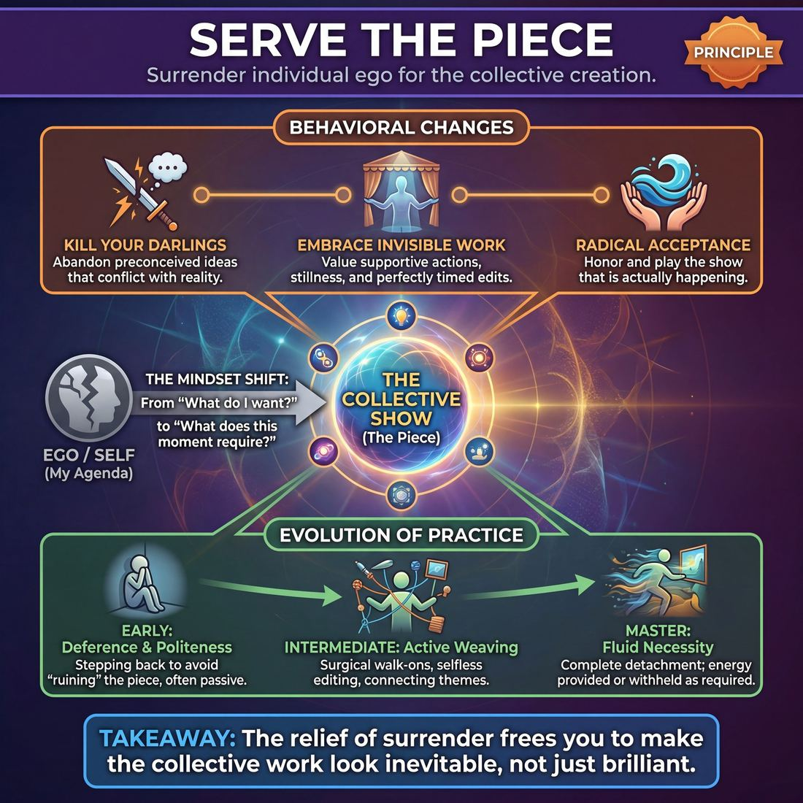

# 💎 Serve the Piece

> *Choose what the show needs, not what you want to do.*

{ .infographic }

## 💎 The core belief

At its heart, **Serve the Piece** is the ultimate act of ego surrender in improvisation. It is the deeply held conviction that the collective creation—the scene, the format, the show itself—is infinitely more important than any single performer's agenda, clever idea, or desire to shine. When you hold this principle, your primary internal compass shifts from *“What do I want to do?”* to *“What does this moment require?”* You become a willing instrument of the ensemble, ready to step center stage to drive the action, or fade into the background to become a silent tree, a sound effect, or a supportive extra if that is what makes the whole look best.

Unpacking this conviction reveals a radical shift in artistic responsibility. It means treating the emerging show as a living, breathing entity that dictates its own direction, rather than a blank canvas for your personal material. If you are waiting in the wings dying to play a loud, chaotic cowboy, but the current scene organically evolves into a quiet, mournful funeral, serving the piece means instantly dropping the cowboy. You sacrifice your personal inspiration to honor the reality that is actually happening. True brilliance in improv does not come from individual virtuosity, but from a group of artists fiercely dedicated to making the work they are building together look inevitable.

!!! abstract "The Mindset Shift"
    **From:** *How can I show the audience how funny, smart, or talented I am?*  
    **To:** *What is the show trying to become right now, and how can I help it get there?*

## 🌱 Why it governs everything

When an improviser truly internalizes this principle, a profound psychological shift occurs. The fundamental question they ask themselves on the **backline** (the area where performers stand when not in a scene) changes from *"What can I do to be good?"* to *"What does this show need right now?"*

This value governs everything because it acts as a universal filter for decision-making. It removes the individual ego from the driver's seat and replaces it with a collective mission. You are no longer a soloist trying to play the loudest; you are a musician listening to the orchestra, waiting for the exact moment the symphony requires a single strike of the triangle.

This shift completely rewires a performer's default behaviors:

| The Ego-Driven Performer | The Piece-Driven Performer |
| :--- | :--- |
| **Focuses on:** "How am I doing?" | **Focuses on:** "What is the show doing?" |
| **Listens for:** An opening to insert their idea. | **Listens for:** Patterns, themes, and missing elements. |
| **When off-stage:** Plans their next brilliant character. | **When off-stage:** Watches the stage intently, ready to support. |
| **In a struggling scene:** Tries to "save" it by being funny. | **In a struggling scene:** Edits it, or supports the base reality. |

Once this shift takes root, several distinct behavioral changes emerge across the ensemble:

*   **Killing your darlings:** You learn to abandon a preconceived idea or joke the moment it conflicts with the established reality. If you have a hilarious idea for a swashbuckling pirate, but the scene has just evolved into a grounded, emotional breakup, you drop the pirate. The piece demands sincerity, not a sword fight.
*   **Embracing invisible work:** You realize that a perfectly timed edit, a silent walk-on to become a piece of furniture, or simply staying off-stage to give a duo room to breathe are just as valuable as delivering a punchline. 
*   **Radical acceptance:** You stop fighting the current of the show. If the ensemble has organically built a slow, atmospheric piece, you don't try to "fix" it by injecting frantic energy. You play the show you are in, not the show you wish you were in.

!!! abstract "The relief of surrender"
    Counter-intuitively, serving the piece is incredibly relaxing. When you are no longer responsible for being the most interesting or inventive person on stage, the pressure to "be funny" evaporates. Your only job is to pay attention and provide the next logical brick.

## 👀 How it shows up

Because "Serve the Piece" is an internal conviction, you cannot see the belief itself—but you can absolutely see its footprint on the stage. It manifests as a radical shift in an improviser's attention, moving outward from *"What am I doing?"* to *"What are we making?"* 

While the principle remains constant, the behaviors it produces evolve dramatically as an improviser gains experience.

**Early attempts: Politeness and deference**  
For newer improvisers, serving the piece often looks like stepping back. They might hug the back wall, play inanimate objects (like a coat rack), or constantly defer to louder players. While well-intentioned, this is often just politeness masquerading as support. They are trying not to "ruin" the piece, rather than actively building it.

**Intermediate practice: Active weaving and support**  
As players grow, their support becomes active and observable. You will see them:
*   **Executing surgical walk-ons:** Entering a scene to provide exactly what is missing—a prop, a piece of information, or an environmental detail—and then immediately leaving so focus returns to the main characters.
*   **Selfless editing:** Sweeping the stage to end a scene at its perfect peak, even if they aren't in it, rather than waiting until they have a personal idea for the next scene.
*   **Connecting the dots:** Bringing back a character, a location, or a theme from scene one into scene four, weaving the show together rather than inventing unrelated ideas.

**Master level: Fluid necessity**  
At the highest levels, serving the piece looks like **fluid necessity**. The master improviser has completely detached their ego from their stage time. They might stay offstage for twenty minutes if the show is humming along perfectly without them. Conversely, if the show is dragging and needs a jolt of energy, serving the piece might mean aggressively taking center stage, initiating boldly, and driving the action. 

!!! example "In a scene"
    Two players are deep in a quiet, grounded scene about a failing marriage. A third player on the back wall suddenly thinks of a hilarious, high-energy character: a wacky marriage counselor on a unicycle. 
    
    *   **Serving the ego:** The player enters, gets a massive laugh from the audience, but completely shatters the fragile reality the other two players worked hard to build. 
    *   **Serving the piece:** The player recognizes the tone of the scene, swallows the joke, and stays on the back wall. They sacrifice their personal laugh to protect the integrity of the show.

Ultimately, you can spot an improviser who serves the piece by watching them when they are *not* in the scene. They are not staring at the floor or planning their next move. They are leaning forward, watching their castmates intently, ready to provide exactly what the moment demands.

!!! tip "On stage"
    **Watch the show you are in.** You cannot serve a piece you aren't paying attention to. Treat your time on the back wall or in the wings as active participation. Listen to the themes, feel the pacing, and ask yourself: *"What does this show need right now?"*

## 🧪 Living it in practice

Internalising this principle requires a fundamental shift in perspective: you must stop watching the show from behind your own character’s eyes, and start watching it from the director’s chair. Living it in practice means cultivating habits that prioritize the whole over the parts.

### Mindsets to cultivate

To serve the piece, improvisers must adopt specific mental postures before they even step on stage:

*   **The Director’s Eye:** When on the backline, watch the stage composition, the pacing, and the energy. Are the scenes all high-energy? The piece might need a quiet, grounded scene next. Are two players stuck in a talking-head argument? The piece might need a physical distraction.
*   **The Stagehand Mentality:** Be entirely willing to be a prop, a sound effect, a piece of furniture, or a silent background character. You do not need a name, a voice, or a laugh to be essential to a scene.
*   **Soft Focus:** Instead of just listening to the words being spoken, watch the physical space. Notice the themes emerging across different scenes. 

!!! tip "On stage"
    When standing in the wings, change your internal monologue. Instead of asking, *"What funny character can I bring out next?"* ask yourself, *"What does this scene lack right now?"* or *"What does the overall show need next?"*

### Drills for the ensemble

Certain exercises are designed specifically to strip away ego and train the muscle of collective support:

*   **I Am a Tree:** The classic physical support drill. Player A becomes a tree; Player B adds to the picture ("I am the apple on the tree"); Player C completes it ("I am the boy picking the apple"). The crucial "serve the piece" moment belongs to Player A, who must choose one player to take with them as they leave, leaving the other to start the next picture. It trains players to build a cohesive image, and then ruthlessly edit it to keep the momentum going.
*   **Scene Painting:** Players describe a physical environment one detail at a time ("There is a grandfather clock here," "The wallpaper is peeling here"). No characters are allowed. This forces players to listen to each other's contributions and build a single, unified reality rather than competing for the spotlight.
*   **String of Pearls:** A long-form drill where players must initiate scenes based *only* on a minor detail, word, or theme from the immediately preceding scene. It trains the ensemble to treat every scene as a servant to the one that came before it, weaving a tight thematic web.

### The skills it animates

When an improviser truly serves the piece, it supercharges specific technical skills:

*   **The Edit:** The ultimate act of serving the show. A player with a strong sense of the piece will run across the stage to cut a scene exactly at its peak, saving their castmates from a dying scene, even if it means delaying their own chance to play.
*   **The Walk-on:** Entering an active scene to provide a specific, necessary element—and then leaving. 
*   **The Callback:** Reincorporating an earlier character, object, or phrase. When done to serve the piece, a callback isn't a cheap grab for applause; it is a structural tool used to tie the show's universe together.

!!! example "In a scene"
    Two players are in a scene playing nervous teenagers getting ready for prom. The scene is sweet, but it lacks stakes and is starting to drag. 
    
    **Ego-driven move:** You enter as a loud, unrelated character (like a lost scuba diver) to get a laugh and inject energy, completely derailing their established reality.
    
    **Serving the piece:** You enter as the father, tap your watch, say, *"The limo is outside, you have two minutes,"* and immediately exit. You gave the scene a ticking clock and heightened their anxiety, then got out of the way so they could play it out.

## ⚖️ Tensions & nuance

While "Serve the Piece" is the ultimate guiding star for an ensemble, it is not always a simple directive. Because "the piece" is an invisible, emerging entity, figuring out what it actually wants can create friction, and applying the principle too rigidly can lead to unintended traps. 

Here is where the principle meets the messy reality of the stage:

*   **The Martyrdom Trap:** A common misunderstanding is that serving the piece means constantly deferring to others—playing the silent tree, holding the door, or always giving up the punchline. But sometimes, the piece desperately needs a protagonist, a bold initiation, or a high-energy emotional reaction. If the show is lagging, stepping into the spotlight and taking a big swing *is* serving the piece. Humility does not mean invisibility.
*   **Subjective Interpretations:** The piece does not speak English; it communicates through patterns. What happens when two improvisers read the pattern differently? Player A might feel the scene needs a grounded, quiet resolution, while Player B feels it needs a chaotic, fast-paced walk-on. When interpretations clash, the principle of **Yes, And** must immediately override your personal vision. You serve the piece best by fully supporting the move that actually happened, rather than fighting for the move you thought was "right."
*   **Serving vs. "Fixing":** It is easy to disguise ego as service. When a scene feels slow or confusing, an improviser might bulldoze the reality, invent a wacky new premise, or aggressively edit, claiming they were "saving the show." True service means loving the scene you are actually in, flaws and all. You serve a struggling piece by clarifying what is already there, not by abandoning it for something shinier.

!!! example "In a scene"
    Two players are stuck in a transactional scene about buying a toaster. It is dry and going nowhere. 
    
    **Fixing it (Ego):** A third player runs on as a bank robber with a gun to force some action. They have destroyed the reality to "save" the scene.
    
    **Serving it (Ensemble):** A third player walks on as the store manager, gently pointing out that the two characters have been arguing over this toaster for four hours. They have framed the boring transaction as a fascinating, obsessive relationship, elevating the existing reality without destroying it.

!!! abstract "The Ultimate Override: Human Boundaries"
    "The piece" is a fictional construct; the improvisers are real human beings. **Serving the piece never overrides physical safety, emotional boundaries, or basic respect.** If the logical pattern of a scene demands a physical stunt you cannot safely perform, or pushes into subject matter that crosses a personal boundary, you must drop the principle. You are a human first, an improviser second, and a character third. The health of the ensemble always supersedes the demands of the art.

## 🚫 Common misunderstandings

Because "Serve the Piece" asks improvisers to surrender their ego, it is frequently misinterpreted as a demand to surrender their *power*, *personality*, or *joy*. When players misunderstand this principle, they often shrink on stage, confusing passivity with good ensemble work. 

Here is how this principle is most commonly distorted, and how to correct it:

| The Misunderstanding | The Correction |
| :--- | :--- |
| **"Serving means playing small."** | Surrendering your ego does not mean erasing your presence. If a show is dragging, quiet, and overly polite, serving the piece might mean kicking the doors down with a massive, high-energy, disruptive character. You give the show what it lacks. |
| **"Serving means only supporting."** | If everyone waits to support, nothing happens. Sometimes the piece desperately needs a bold **initiation** (a strong opening offer or new premise). Stepping up to lead a scene *is* an act of service when the stage is empty. |
| **"Serving means sacrificing my fun."** | Joy is a vital ingredient in any show. If you are miserable, bored, or feeling stifled, the audience will feel it, and the piece will suffer. You serve the piece best when you play with inspiration and follow the fun. |
| **"The 'piece' is a puzzle to solve."** | Players sometimes freeze because they are trying to "figure out" what the piece wants, treating it like a hidden script. The piece is just the emerging pattern of the show. You serve it by reacting honestly in the present moment, not by out-thinking it. |

!!! warning "Watch out: The Improv Martyr"
    Beware the trap of becoming the "Improv Martyr"—the player who only ever plays the waiter, the tree, or the silent background character, secretly resenting that they never get to do the "fun stuff," while claiming they are just "serving the piece." True service requires bringing your full artistic weight to the stage. If you are hiding behind the excuse of being a "support player," you are actually starving the ensemble of your unique voice.

!!! abstract "Key idea: Service is active, not passive"
    To serve the piece is to provide the missing ingredient. If the scene is chaotic, serve it by providing grounded reality. If the scene is entirely exposition, serve it by initiating physical action. Serving the piece is an active, dynamic diagnosis of the present moment—not a mandate to blend into the wallpaper.

## 🔗 Why it matters

When **Serve the Piece** moves from a theoretical concept to a deeply held conviction across an entire cast, the alchemy of the performance fundamentally changes. The stage ceases to be a platform for individual brilliance and becomes a shared, living canvas. 

Holding this value deeply transforms the show from a fragile string of disconnected scenes into a robust, unified theatrical experience. It is the invisible glue that makes long-form improvisation possible.

Here is how this principle reshapes the entire ecosystem of a performance:

*   **It eradicates the pressure to be a genius:** When the entire cast agrees that their only job is to give the show what it needs, the collective burden of being constantly funny, clever, or inventive evaporates. No single player has to "save" a scene; they just have to provide the next necessary brick.
*   **It builds unshakeable ensemble trust:** If you know every player on stage is prioritizing the show over their own ego, you can take massive, terrifying risks. You know that if you fall, the ensemble will catch you, justify your move, and weave it into the larger tapestry.
*   **It creates structural integrity:** Shows stop feeling like a random assortment of sketches. Callbacks stop being cheap applause breaks and become meaningful thematic echoes. The narrative or thematic arc holds together because everyone is actively tending to it.
*   **It relaxes the audience:** Audiences are highly empathetic; if the cast is panicked, competitive, or fighting for the spotlight, the audience feels tense. When a cast is calmly serving the piece, the audience senses that the steering wheel is in safe hands and allows themselves to be fully swept up in the world.

!!! abstract "The burden of brilliance"
    Improvisers often suffer from the exhausting belief that they must individually dazzle the audience. Serving the piece offers the ultimate relief: *you do not have to be brilliant; the ensemble will be brilliant for you.* By surrendering your ego to the needs of the show, you trade the heavy armor of the solo performer for the immense, buoyant power of the group.

### The Shift in the Room

When a cast successfully internalizes this principle, the entire atmosphere of the theater shifts. 

| Dimension | When Ego Leads | When Serving the Piece |
| :--- | :--- | :--- |
| **The Player** | Anxious, pre-planning, looking for a chance to stand out. | Present, listening deeply, ready to support or step back. |
| **The Ensemble** | Competitive, talking over each other, dropping established ideas. | Collaborative, breathing together, elevating each other's offers. |
| **The Show** | A disjointed talent show; a fight for the loudest laugh. | A cohesive, satisfying piece of theater with rhythm and dynamics. |
| **The Audience** | Judging individual performances ("Who is the funniest?"). | Invested in the world, the relationships, and the unfolding story. |

Ultimately, serving the piece is what elevates improvisation from a neat party trick to a profound art form. It proves that a group of people, listening deeply and prioritizing the whole over themselves, can spontaneously create something far greater—and far more beautiful—than the sum of its parts.

## 📚 References & Further Reading

### Foundational sources
*   **Charna Halpern, Del Close, and Kim "Howard" Johnson, *Truth in Comedy: The Manual of Improvisation* (1994)** — Introduces the concept of "Group Mind," emphasizing that the ensemble is the star and that players must surrender their individual egos to build a cohesive long-form piece.
*   **Viola Spolin, *Improvisation for the Theater* (1963)** — Her foundational concept of the "Point of Concentration" trains actors to focus entirely on the shared task or game at hand, naturally dissolving the ego and preventing players from showing off.

### Practitioner guides & manuals
*   **T.J. Jagodowski, David Pasquesi, and Pam Victor, *Improvisation at the Speed of Life: The TJ & Dave Book* (2015)** — Argues that "the scene is already there" and the improviser's only job is to listen and discover what the piece wants to be, rather than inventing or forcing their own agenda.
*   **Mick Napier, *Behind the Scenes: Improvising Long Form* (2015)** — Focuses on the mechanics of the whole show, teaching improvisers how to watch from the backline with a "director's eye," edit effectively, and provide exactly what the larger piece requires.
*   **Will Hines, *How to Be the Greatest Improviser on Earth* (2016)** — Features practical, modern advice on being a supportive ensemble member, specifically addressing the psychological hurdle of dropping your own brilliant ideas when the scene takes a different turn.
*   **Matt Besser, Ian Roberts, and Matt Walsh, *The Upright Citizens Brigade Comedy Improvisation Manual* (2013)** — Details the mechanics of "support moves" (walk-ons, tag-outs, and mapping), teaching players how to enter a scene solely to serve the established Game, rather than to introduce new, unrelated ideas.

### Lineage & teachers
*   **iO Theater (formerly ImprovOlympic)** — The birthplace of the Harold, where the philosophy of treating the ensemble as a single organism and prioritizing the overarching structure of the show was codified by Del Close.
*   **The Annoyance Theatre** — While known for strong individual initiation, their training heavily emphasizes taking care of yourself *so that* you can effectively serve the scene, promoting radical acceptance of whatever reality is established.

### Research & theory
*   **R. Keith Sawyer, *Group Genius: The Creative Power of Collaboration* (2007)** — A psychological study of improv ensembles that explores "group flow," demonstrating how peak collective creativity occurs only when individuals surrender control to the group dynamic.
*   **Dusya Vera and Mary Crossan, *Theatrical Improvisation: Lessons for Organizations* (Organization Studies, 2004)** — Academic research analyzing how improv teams use agreement and ego-surrender to build cohesive, emergent structures without pre-planning or centralized leadership.

### Talks, videos & courses
*   ***Trust Us, This Is All Made Up*, directed by Alex Karpovsky (2009)** — A documentary capturing T.J. Jagodowski and David Pasquesi, showcasing their master-level ability to patiently serve the emerging piece without forcing jokes or rushing the narrative.
*   **Jimmy Carrane, *Improv Nerd* Podcast (2011–Present)** — An interview series that frequently features master improvisers discussing the difficult transition from ego-driven early careers to ensemble-focused, piece-serving veterans.

### Communities & adjacent reading
*   **Anne Bogart and Tina Landau, *The Viewpoints Book: A Practical Guide to Viewpoints and Composition* (2005)** — A foundational theater text on spatial awareness and ensemble movement, teaching actors to view the stage as a whole composition and provide exactly what the stage picture needs.
*   **Arthur Quiller-Couch, *On the Art of Writing* (1916)** — The origin of the "murder your darlings" advice, a crucial concept for improvisers learning to sacrifice their favorite preconceived jokes for the good of the overall piece.
*   **Stephen Nachmanovitch, *Free Play: Improvisation in Life and Art* (1990)** — Explores the spiritual and psychological aspects of surrendering to the creative process, emphasizing that true art flows through the artist when the ego steps out of the way.

## 💬 Quotes & Anecdotes

!!! quote "— Stephen Colbert, *Northwestern University Commencement Address* (2011)"
    Now there are very few rules to improvisation, but one of the things I was taught early on is that you are not the most important person in the scene. Everybody else is. And if they are the most important people in the scene, you will naturally pay attention to them and serve them. But the good news is you're in the scene too. So hopefully to them you're the most important person, and they will serve you. No one is leading, you're all following the follower, serving the servant. You cannot win improv.

!!! quote "— Charna Halpern, *Truth in Comedy* (1994)"
    If one person controls the Harold, it is no longer a group effort, and the group mind is destroyed. [...] When an improviser lets go and trusts his fellow performers, it's a wonderful, liberating experience that stems from group support.

!!! quote "— Keith Johnstone"
    Your best work comes when you're absorbed; because then your ego is away.

!!! quote "— Del Close"
    If we treat each other as if we are geniuses, poets, and artists, we have a better chance of becoming that on stage.

!!! quote "— Common Improv Adage"
    Bring a brick, not a cathedral.

### Where it comes from
The philosophy of surrendering to the piece is most famously codified in the concept of "Group Mind," championed by Del Close and Charna Halpern at Chicago's iO Theater in the 1980s and 1990s. As they developed long-form improvisation, they realized that individual gag-writing and scene-stealing destroyed the organic connections of the show. They taught that the ensemble must function as "one mind, many bodies," treating the emerging show as a living entity that dictates its own direction. The phrase "serve the scene" (or "serve the piece") became the practical, everyday instruction for achieving this ego-less state.

### A telling example
**The Cathedral vs. The Brick**  
The common improv adage "Bring a brick, not a cathedral" perfectly illustrates what it means to serve the piece in action. 

Imagine an illustrative scenario where a player is waiting in the wings. They suddenly think of a hilarious, fully-formed character: a loud, wacky pirate looking for his lost parrot. They have built a "cathedral" in their mind. However, the two players currently on stage have just organically established a quiet, tense scene about two surgeons performing a delicate operation. 

If the improviser chooses to **serve their ego**, they will burst onto the stage as the pirate anyway, forcing the surgeons to deal with their absurd intrusion. They might get a quick laugh, but they have shattered the reality of the scene and blocked collaboration. 

If the improviser chooses to **serve the piece**, they drop the pirate idea entirely. They bring a "brick" instead: they step forward silently, hold out their hands, and play a scrub nurse handing the surgeon a scalpel. By sacrificing their personal joke, they support the reality that is actually happening, allowing the ensemble to build a cathedral together that no single person could have planned.

## 🧭 Explore the framework

- 🎭 **Domain:** [The Ensemble](04_D__the-ensemble.md)
- 🔁 **Other principles here:** [Group Mind](04_P1__group-mind.md), [Follow the Follower](04_P2__follow-the-follower.md)
- 🧠 **Skills of this domain:** [Peripheral Awareness](04_S1__peripheral-awareness.md), [Support Work](04_S2__support-work.md), [Suggestion Deconstruction (A-to-C)](04_S3__suggestion-deconstruction-a-to-c.md), [Pacing & Rhythm](04_S4__pacing-and-rhythm.md), [Thematic Synthesis](04_S5__thematic-synthesis.md), [Format Literacy](04_S6__format-literacy.md)
