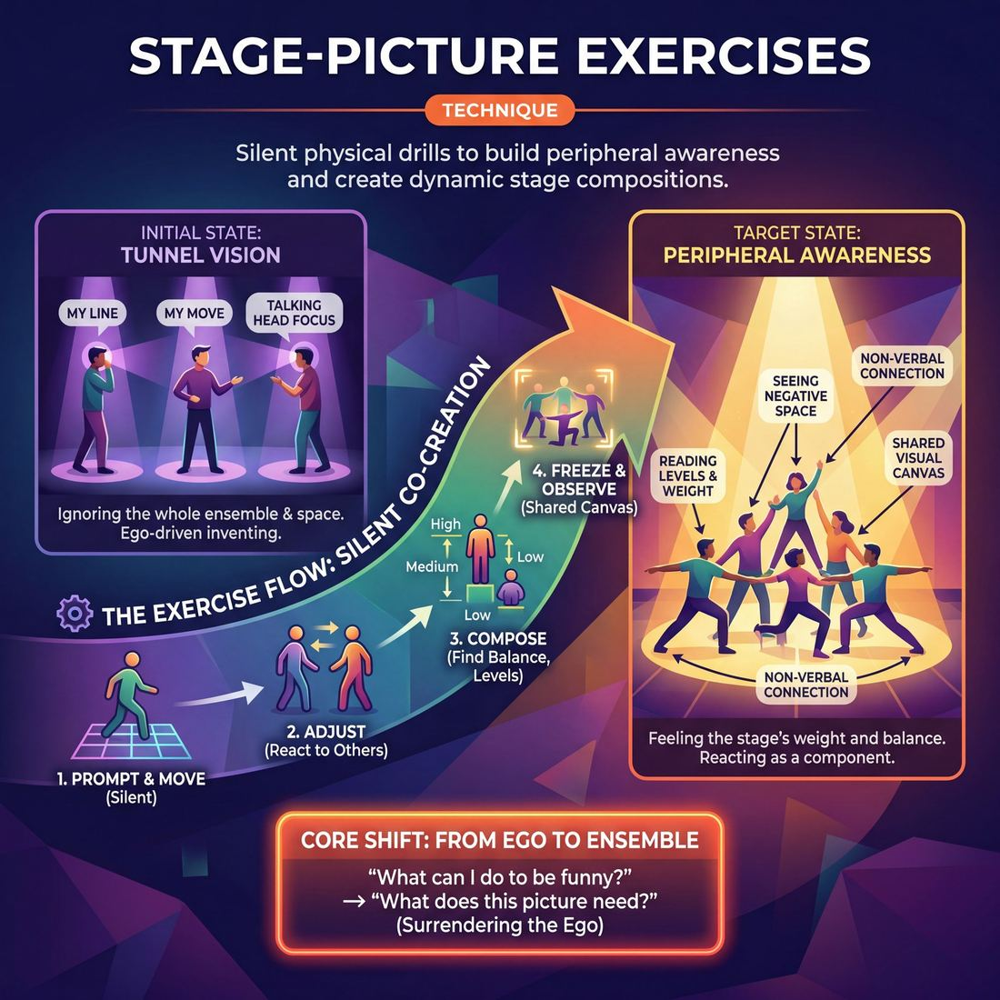

# 🎯 Stage-picture exercises

> *A drillable muscle that trains **Peripheral Awareness**.*

{ .infographic }

## 🎯 The essence

**Stage-picture exercises** are a family of physical, often silent drills where an ensemble moves together to create balanced, dynamic, or specific visual compositions. By stripping away dialogue and narrative, these exercises force improvisers to constantly adjust their physical position in relation to their teammates. The single core muscle this builds is **peripheral awareness**—training players to break out of their individual tunnel vision and begin seeing the entire stage as a single, shared visual canvas.

## 🎓 What it trains

These exercises are explicitly designed to build peripheral awareness: the ability to expand your focus beyond your immediate scene partner and take in the entire physical space. 

In the early stages of improvisation, performers often suffer from "tunnel vision." A novice might try to track the stage, but under the pressure of performance, they inevitably lock their eyes and attention solely on the person speaking or the immediate action. They become "talking heads," ignoring the physical composition of the scene and the rest of the ensemble. 

By temporarily removing the pressure of dialogue and plot, stage-picture exercises isolate and drill three critical muscles:

* **Spatial awareness:** Knowing exactly where you are in relation to everyone else, the architecture of the stage, and the audience's sightlines.
* **Visual composition:** Recognizing balance, symmetry, levels (high, medium, low), and depth (downstage vs. upstage).
* **Non-verbal connection:** Communicating and reacting to teammates purely through physical proximity, posture, and shared focus.

!!! abstract "The Deeper Principle: Surrendering the Ego"
    At its core, this technique serves the domain of **The Ensemble**. When you train yourself to look at the whole stage, you stop asking, *"What can I do to be funny?"* and start asking, *"What does this picture need?"* It shifts the improviser from an individual actor trying to invent a clever move, to a sensitive component of a larger organism—ready to fill an empty space, mirror a teammate, or provide striking physical contrast.

!!! tip "On stage"
    When your peripheral awareness is fully engaged, you don't need to look directly at a teammate to know they are about to move. You begin to feel the shift in the stage's weight and balance, allowing you to react to the ensemble before a single word is spoken.

## 💡 Why it works

Stage-picture exercises work by deliberately removing the improviser’s most relied-upon crutch: words. When the pressure to invent dialogue is stripped away, the brain’s language centers power down, allowing spatial and kinesthetic awareness to take over. 

By silencing the verbal engine, these exercises exploit three underlying mechanisms:

* **Bypassing the "Writer's Brain":** Improvisers often stare blankly at a scene partner while frantically planning their next line. Stage pictures make internal planning useless. You cannot think your way into a balanced stage; you have to *look* at it, process the geometry, and react physically.
* **Forcing a Macro Perspective:** Instead of focusing on a one-on-one interaction, players must expand their field of vision to encompass the entire playing space. They learn to read **negative space** (the empty areas on stage), physical levels, and the overall physical weight of the group.
* **Democratizing the Ensemble:** In a physical tableau, there are no lead roles, witty punchlines, or scene-stealers. Every player becomes a single pixel in a larger image. A player learns that crouching quietly in the upstage corner is just as vital to the picture as standing center stage.

!!! abstract "The Engine Under the Hood: Sensory Shift"
    The core mechanism here is a forced sensory shift. Because the improviser cannot rely on auditory cues (listening for a joke, a name, or a plot point), they must rely entirely on visual and proprioceptive cues (where bodies are in space). This rewires the ensemble to communicate through proximity, posture, and stillness.

Ultimately, these exercises train the body to recognize when a stage is crowded, when a picture is incomplete, and when a scene needs physical support—long before the conscious mind has time to process it. 

## 🧩 The setup

To run stage-picture exercises effectively, you need a blank canvas and a group ready to move as a single organism. Here is exactly how to set the room up before the first prompt is given:

* **Group size:** Full ensemble (ideally 6 to 12 players). If you have fewer than five, the pictures lack structural complexity; if you have more than fifteen, the stage easily devolves into a chaotic blob.
* **Arrangement:** Players begin in a neutral "ready" position on the sidelines or backline. The central playing area must be completely empty. 
* **Space & materials:** A wide, clear rehearsal room or stage. Remove all chairs, rehearsal blocks, and physical props. The only materials used are the players' bodies.
* **Time:** 10–15 minutes total. Each individual "picture" takes about 10 to 30 seconds to form, followed by a brief 10-second hold to observe, and a quick reset.
* **Roles:**
    * **The Coach/Facilitator:** Stands downstage center (in the "audience" position). They call out the prompts, dictate when to freeze, and briefly point out areas of tension, balance, or focus before clearing the stage.
    * **The Ensemble:** Moves into the space silently, reacting instantly to the prompt and—more importantly—to each other's physical choices.
* **Prerequisites:** A basic grasp of stage geography (knowing upstage from downstage) and a baseline comfort with physical stillness and proximity to teammates.

!!! quote "How to introduce it"
    "We are going to create a series of living photographs. I will call out a prompt—it might be a location, an emotion, or an abstract concept. As soon as I say 'Go,' you will step onto the stage and freeze in a physical pose that contributes to that prompt. 
    
    Don't plan your spot before you move. Keep your eyes up, look at where your teammates are going, find the empty space, and balance the stage. You don't all need to be the center of attention; some of you will be the background, some will be the focal point. When I say 'Freeze,' hold your exact position. Let's paint the stage."

!!! tip "On stage"
    If you are working in a room with mirrors, have the players face *away* from them. Stage pictures train peripheral awareness—the ability to feel the stage and see teammates out of the corner of your eye. Mirrors allow players to cheat by looking at the reflection rather than sensing the room.

## ⚙️ The mechanics

!!! abstract "The Core Objective"
    To collaboratively build, balance, and dynamically adjust a unified physical tableau without speaking. The ensemble must rely entirely on spatial relationships and peripheral awareness to create a visually compelling stage picture.

The mechanics of a stage-picture exercise (often run as "Complete the Picture" or "The Tableau") strip away narrative, forcing improvisers to communicate purely through physical space, levels, and focus. 

Here is the step-by-step flow of the foundational drill:

### The Flow of Play

1. **The Anchor:** The stage is empty. Player 1 steps into the playing space and strikes a distinct, frozen physical pose. This pose should have clear geometry—perhaps reaching high, crouching low, or leaning sharply. 
2. **The Relationship:** Player 2 steps in. They observe Player 1's pose and strike a complementary frozen pose. If Player 1 is high, Player 2 might go low. If Player 1 is looking stage left, Player 2 might look stage right, or look directly at Player 1 to create a **focal point**.
3. **Building the Picture:** Players 3, 4, and the rest of the ensemble enter one by one. Each new player must take in the *entire* existing picture—not just the last person who entered. They must find the "missing piece" of the visual composition, considering levels, depth, and balance.
4. **The Hold:** Once all players are in, the group holds the frozen picture in complete silence for three to five seconds. The ensemble breathes together, feeling the tension and balance of the shape they have created.
5. **The Subtraction (Dynamic Adjustment):** Without planning, one player drops their pose and steps off the stage. The remaining players must immediately and silently adjust their bodies or positions to "fill the gap" and re-balance the stage picture. 
6. **The Reset:** The director calls "Clear," the stage is emptied, and a new round begins with a different player initiating.

### Rules & Constraints

To isolate the target muscle, enforce these strict boundaries during the exercise:

* **Absolute silence:** No talking, whispering, or vocalized sound effects. The communication must be entirely visual and spatial.
* **Commit to the freeze:** Once a player chooses a spot and a pose, they must lock it in. Fidgeting destroys the clarity of the picture for the players entering after them.
* **One at a time (during the build):** Players must enter sequentially so the picture evolves clearly. If two players step forward simultaneously, one must yield.
* **See the whole organism:** Players must resist the urge to just stand next to their best friend or the center-stage player. They must look at the edges, the empty spaces, and the overall weight of the stage.

!!! tip "On stage: Soft focus"
    To truly see the stage picture, use **soft focus**. Instead of staring intently at one person's face, relax your gaze so you can see the edges of the room and the bodies of your teammates in your peripheral vision. This is how a master improviser sees the entire show as one organism.

!!! warning "Watch out for 'The Clump'"
    Novice improvisers tend to suffer from "moth-to-a-flame" syndrome, crowding tightly around the first player in the center of the stage. Force the ensemble to use the extreme downstage corners and the deep upstage areas to create a three-dimensional picture.

## 🎬 Sample round

!!! example "In a scene: Building a Tableau"
    **The Prompt:** The coach calls out, "Build a picture of a busy diner kitchen during the Sunday rush."

    **Step 1: The Anchor**  
    *Player A* immediately steps to center stage, adopts a wide, grounded stance, and begins furiously miming chopping onions.  
    *(Annotation: Player A establishes the focal point, the baseline energy, and the central physical plane.)*

    **Step 2: Balancing the Space**  
    *Player B* observes Player A taking up the center. To balance the stage picture, Player B moves upstage right, stands tall on their tiptoes, and mimes pulling order tickets off a high rail.  
    *(Annotation: Player B adds a high level and fills the upstage quadrant, demonstrating basic peripheral awareness by not crowding the center.)*

    **Step 3: Finding the Gap**  
    *Player C* scans the stage. Center and upstage right are occupied; the energy is frantic. Player C drops to the floor downstage left, curling into a tight ball, miming scrubbing a stubborn grease trap.  
    *(Annotation: Player C completes the spatial triangle, adds a low level, and contrasts the frantic upper-body energy with a heavy, grounded physical choice.)*

    **Step 4: Enhancing the Relationship**  
    *Player D* sees the stage is physically balanced but notices Player A is isolated in their task. Player D steps close to Player A, holding out an empty tray and tapping their foot impatiently.  
    *(Annotation: Rather than just filling empty space, Player D uses proximity to create a relationship and narrative tension. The picture shifts from a collection of individuals to an interconnected ensemble.)*

    **Step 5: The Restraint**  
    *Player E* steps forward, scans the stage, realizes the picture is perfectly balanced, and steps back to the sideline.  
    *(Annotation: Player E demonstrates competence—choosing to enter only when a scene needs something, and actively deciding that the best support is leaving the picture uncluttered.)*

## 🎚️ Variations & progressions

To move players from tunnel-visioned novices to masters who see the stage as a single organism, stage-picture exercises must scale in complexity. You can ramp the difficulty by shifting the focus from simple spatial awareness to dynamic movement, and finally to narrative meaning.

Here is how to progress these exercises alongside the ensemble's maturity:

* **The Grid (Novice):** 
    Players walk the space in straight lines, making only 90-degree turns. The rule is simple: try to fill the empty spaces. 
    * *The Ramp:* Add the rule that if *one* person stops walking, *everyone* must stop. If one person starts, everyone starts. This forces the novice to break their tunnel vision and keep at least one eye on the rest of the room.
* **Balance the Raft (Advanced Beginner):** 
    Tell the ensemble the stage is a giant raft balanced on a single point in the center. If too many people gather on one side, the raft tips and everyone "drowns." Players must constantly adjust their position to counter-balance their teammates. This directly trains the ability to notice when a stage is getting crowded and physically fix it.
* **One-by-One Tableau (Competent):** 
    The coach provides a prompt (e.g., "A bank robbery," "The royal court," "A heavy storm"). One player steps in and freezes in a strong physical pose. One by one, the rest of the team enters and freezes, adding to the picture. Competent players must track all active physical threads, choosing a position, level, and physical relationship that completes the picture rather than duplicating what is already there.
* **Flocking (Proficient):** 
    The group stands in a diamond formation and moves around the room in silence. Whoever is at the front of the diamond is the leader; everyone else mirrors their exact movements. When the leader turns, a new person is now at the front and seamlessly takes over leadership. This requires proficient players to anticipate where their teammates will go and surrender their ego entirely to the group's movement.

!!! tip "Adjusting difficulty on the fly"
    You can instantly dial the difficulty of any stage-picture exercise up or down using three levers:
    
    1. **Speed:** Force them to move at a sprint (relies on pure instinct) or in extreme slow-motion (requires agonizingly sustained awareness).
    2. **Eye Contact:** For an extreme challenge, have them balance the space or build a tableau while keeping their eyes fixed *only* on the floor or straight ahead, relying entirely on their peripheral vision and hearing.
    3. **Silence:** Remove the ability to giggle, whisper, or make sound effects. Silence forces the ensemble to communicate purely through physical proximity and tension.

!!! example "In a scene"
    When these drills take root, you will see it in standard scene work. If two players are arguing intensely downstage right, a proficient player won't just stand directly behind them. They will instinctively drift upstage left to balance the visual weight of the stage, creating a beautiful, cinematic picture for the audience without a word being spoken.

## 🧑‍🏫 Coaching notes

As a coach, your role during stage-picture exercises is to act as the external eye while the ensemble develops their internal, collective eye. Your side-coaching should constantly pull players out of their individual tunnel vision and into the shared space.

!!! tip "Coaching: Soften the gaze"
    The single most important cue you can give is to adjust *how* players are looking. 
    
    **"Soften your focus. See the whole room at once."** 
    
    Novices will stare intensely at one person (usually the perceived leader) to figure out what to do. A soft focus relaxes the eyes, allowing the brain to process movement, levels, and negative space in the periphery without fixating on a single point.

**Effective side-coaching prompts:**
Deliver these calmly and rhythmically while the exercise is in motion. Do not stop the group to give these notes; let them adjust in real-time.

* **"Find the empty space."** Prompts players to balance the stage by moving into the negative space rather than clumping together.
* **"Who is leading right now? Let it change."** Reminds the group that leadership should be fluid and shared, preventing one dominant player from hijacking the exercise.
* **"Change your level."** Encourages physical variety. If everyone is standing, the picture is flat.
* **"Breathe together."** A powerful reset when the group becomes frantic or out of sync. It grounds the ensemble and establishes a shared rhythm.
* **"Don't invent; just reflect."** Stops players from trying to be "clever" or pre-planning a funny pose, pulling them back to simply supporting what is already happening.

**What "good" looks and sounds like:**
You will know the exercise is working when you observe the following shifts in the room:

* **The room gets quiet:** The frantic energy of overthinking drops away, replaced by a highly focused, meditative silence. 
* **Micro-adjustments:** Players stop making massive, disruptive movements and begin making tiny shifts—adjusting a shoulder, dropping a knee, or turning a head—to perfectly complement the overall tableau.
* **Seamless transitions:** The role of the "leader" passes invisibly from player to player without anyone speaking, pointing, or hesitating.
* **Spatial harmony:** Players move through and around each other without colliding, demonstrating that their peripheral awareness has expanded to include the entire ensemble.

## 🧭 Debrief & reflection

The goal of debriefing a stage-picture exercise is to help players articulate the physical sensation of peripheral awareness. Because the exercise itself is largely non-verbal and highly physical, the post-round conversation is where the cognitive connections are forged. 

Rather than judging whether the pictures were "good" or "bad," guide the ensemble to reflect on their internal focus and spatial intuition. Use these questions to lock in the learning:

* **On shifting focus:** "Where was your attention when you were moving? Where did it go the moment you froze?" *(Helps players recognize the shift from internal action to external observation.)*
* **On spatial balance:** "Did you feel a moment when the stage was perfectly balanced? How did you know without talking?" *(Encourages players to trust their physical intuition over intellectual planning.)*
* **On restraint:** "Did anyone have a strong impulse to move, but chose to stay still? Why?" *(Highlights that stillness is an active, supportive choice, moving them away from the novice urge to constantly grab focus.)*
* **On vision:** "How much of the room were you seeing at the beginning of the exercise versus the end?" *(Tracks the physical shift from tunnel-vision to a wider, softer focus.)*

!!! note "The 'Aha' Moment"
    A successful debrief surfaces the realization that the ensemble is a single organism. Players will often note that when they stopped trying to "invent a cool picture" and simply allowed themselves to fill the negative space, the stage naturally balanced itself. They begin to understand that they don't have to carry the whole scene—they just have to provide the missing piece.

!!! tip "For the Coach"
    Keep the conversation grounded in *sensation* rather than *judgment*. If a player says, "I messed up the picture by moving too late," redirect them away from self-critique. Ask instead: "What did the stage look like from your vantage point in that moment? What did you see?"

## ⚠️ Common pitfalls

When training peripheral awareness, players are forced to surrender their individual ego to the group mind. This is an unnatural muscle, and several predictable traps emerge as players try to navigate it:

!!! warning "Watch out: Tunnel Vision Under Cognitive Load"
    The most common trap for a novice is reverting to tunnel vision. When asked to track the entire stage, the brain gets overwhelmed by the sudden spike in cognitive load. Instead of softening their gaze to take in the whole group, the player locks eyes on a single teammate, stares at the floor, or retreats into their own head. They stop seeing the stage picture entirely.  
    * **The Fix:** Instruct players to use "soft eyes"—expanding their field of vision without focusing on any one specific point. Have them physically stop, take a breath, and consciously name (internally) where the other bodies are before moving again.

* **The "Traffic Cop" (Over-leading)**
    * *The Trap:* A player notices the stage is unbalanced and tries to fix it by gesturing, whispering, or aggressively pulling focus to direct others. They are trying to *manage* the ensemble rather than *surrender* to it.
    * *The Fix:* Enforce a strict "no directing" rule. Coach players to communicate only through their own physical choices. If the stage needs balance, *they* must be the one to move to balance it.

* **The "Math Face" (Dropping the Actor)**
    * *The Trap:* Players concentrate so intensely on spatial relationships, grids, and spacing that their faces go entirely blank. They look like they are solving a geometry equation rather than performing.
    * *The Fix:* Remind the ensemble to breathe. Once they understand the basic mechanics, layer in an emotional restriction (e.g., "Balance the stage, but you are all deeply suspicious of one another"). This forces them to maintain a theatrical presence while tracking the space.

* **The Ping-Pong Effect (Frantic Adjusting)**
    * *The Trap:* As soon as one person moves to balance the picture, three others immediately move to compensate, creating a chaotic, never-ending shuffle. The picture never actually settles.
    * *The Fix:* Enforce stillness. Require the group to hold a complete, frozen tableau for three full seconds before anyone is allowed to initiate the next movement. Teach them that stillness is a valid and powerful part of the stage picture.

## 🌟 What mastery looks like

When an ensemble reaches the master level in stage-picture exercises, the group ceases to look like a collection of individuals trying to coordinate. Instead, they operate as a single, breathing organism. The ego is entirely surrendered to the visual composition of the piece, and the players' peripheral awareness is so highly tuned that they seem to share a single nervous system. 

If you watch a master-level team execute these drills, you will observe several distinct behaviors:

* **Instant equilibrium:** The stage is perpetually balanced. If one player rushes downstage right, another instinctively drifts upstage left to counterweight them. This happens without hesitation, eye contact, or conscious calculation.
* **Fluid focus-shifting:** Leadership passes invisibly. A master player knows exactly when to initiate a movement and, crucially, when to instantly drop their own impulse to support someone else's. There is no fighting for the spotlight.
* **Exploitation of all dimensions:** The ensemble naturally utilizes the full depth of the stage, varying levels (standing, kneeling, lying down), and playing with proximity (tight, claustrophobic clusters versus wide, lonely isolation). 
* **Active stillness:** Players understand that *not* moving is a powerful choice. They hold their positions with intense physical commitment, providing a stable, energized frame that highlights the movement of others.

!!! example "The Master Tableau"
    Watch a highly proficient ensemble build a frozen picture. Player A steps center and freezes with a raised fist. Player B doesn't just stand next to them; they slide to the floor, cowering to create a level change. Player C immediately frames them from behind, standing tall on a block. Players D and E form a tight, whispering cluster far downstage, pulling focus just enough to create visual tension. The picture is dynamic, emotionally resonant, and built in under three seconds—looking entirely choreographed despite being completely improvised.

Mastery in these exercises looks like effortless anticipation. The players are no longer reacting to what just happened; they are moving into the negative space exactly as it opens up.

## 🔗 Why it matters

Stage-picture exercises are the physical gym for peripheral awareness. By isolating and drilling the visual composition of the stage, improvisers learn to "listen with their eyes." They build the muscle memory required to widen their gaze, track multiple bodies, and process the geometry of the space in real time.

This technique is a direct pathway to the ultimate goal of ensemble work. When you step into a stage picture, you learn to view yourself as a compositional element—a counterweight, a framing device, or a splash of contrast. You give exactly what is missing, whether that means filling a void downstage left or remaining perfectly still on the back wall. 

!!! abstract "From individual to organism"
    Mastering stage pictures marks the transition from a Stage 1 Novice (who tunnel-visions on their own scene) to a Stage 5 Master (who sees the entire show as one breathing organism). It teaches the ensemble to communicate and balance themselves entirely without words.

In the wider craft, this visual awareness pays massive dividends. A visually balanced stage subconsciously communicates competence to the audience. When improvisers clump together awkwardly, the audience feels anxious; when the stage is dynamically composed, the audience relaxes, trusting that the performers are in control. Furthermore, this spatial awareness naturally leads to cleaner edits, more dynamic group scenes, and a profound, non-verbal trust among the cast.

## 📚 References & Further Reading

### Foundational sources
* **Viola Spolin, *Improvisation for the Theater* (1963)** — Spolin explicitly details the exercise "Creating a Stage Picture" and uses "Stage picture!" as a frequent side-coach during scenes. Her goal was to force players to break out of their individual tunnel vision, see the stage from the audience's perspective, and balance the physical space as a collective. She recognized early on that "talking heads" destroy the reality of the physical environment.
* **Augusto Boal, *Games for Actors and Non-Actors* (1992)** — Boal's "Image Theatre" techniques, specifically the classic "Complete the Image" exercise, are the direct ancestors of modern silent tableau drills. The exercise forces players to communicate purely through physical relationship, proximity, and negative space without the crutch of spoken language, democratizing the ensemble by making every body an equal part of the visual message.

### Practitioner guides & manuals
* **Charna Halpern, Del Close, and Kim "Howard" Johnson, *Truth in Comedy: The Manual for Improvisation* (1994)** — Discusses the importance of the "stage picture" in group scenes and the Harold opening. It emphasizes that players must surrender their ego to act as scenery, sound effects, and choreographers to support the ensemble's visual composition, shifting the focus from "what can I say to be funny?" to "what does this picture need?"
* **Matt Besser, Ian Roberts, and Matt Walsh, *The Upright Citizens Brigade Comedy Improvisation Manual* (2013)** — Details how to use stage pictures and physical tableaus during group games and long-form openings to establish themes and group mind without relying on dialogue.
* **Mick Napier, *Improvise: Scene from the Inside Out* (2004)** — Emphasizes the necessity of making strong physical choices and "doing something" in the environment rather than standing around as "talking heads"—which is the exact novice habit that stage-picture exercises are designed to break.

### Lineage & teachers
* **Anne Bogart and Tina Landau, *The Viewpoints Book: A Practical Guide to Viewpoints and Composition* (2005)** — While rooted in postmodern dance and physical theatre, Viewpoints training is the definitive methodology for teaching performers peripheral awareness. The specific viewpoints of Spatial Relationship, Architecture, and Shape are essentially advanced, codified stage-picture exercises that train improvisers to feel the stage's balance and react kinesthetically before a word is spoken.
* **Jacques Lecoq, *The Moving Body (Le Corps Poétique)* (2000)** — *(unverified)* Lecoq's physical theatre pedagogy heavily influences how improvisers understand the "weight" of the stage, the physical dynamics of the ensemble, and the use of the neutral mask to strip away verbal crutches and force spatial awareness.

### Research & theory
* **Lior Noy, Erez Dekel, and Uri Alon, "The mirror game as a paradigm for studying the dynamics of two people improvising motion together" (Proceedings of the National Academy of Sciences, 2011)** — This cognitive science research uses a physical improvisation paradigm to study "joint action." It found that expert improvisers achieve a state of "togetherness" and high performance where neither is leading or following. Instead, they rely entirely on peripheral and kinesthetic awareness to move as a single organism, bypassing the conscious "writer's brain."
* **Johann Issartel et al., "Joint-improvisation: a social motor coordination perspective" (Frontiers in Psychology, 2017)** — Examines the kinematic markers of joint action in performance. The study demonstrates that high-level ensemble togetherness is characterized by smooth, symmetric movement properties and heightened visuo-motor coordination, scientifically validating the physical mechanics and spatial awareness trained by stage-picture drills.

### Talks, videos & courses
* **SITI Company, *Viewpoints Training Workshops*** — *(unverified)* Various documented masterclasses by Anne Bogart's SITI Company that visually demonstrate how an ensemble moves as a single organism. Watching these sessions provides the best visual example of peripheral awareness and spatial composition in action.
* **Augusto Boal, *Theatre of the Oppressed / Image Theatre Demonstrations*** — *(unverified)* Archival footage and workshop videos showing the "Complete the Image" exercise in practice, illustrating how non-verbal physical tableaus are built step-by-step by participants reacting solely to each other's physical choices.

### Communities & adjacent reading
* **Keith Johnstone, *Impro: Improvisation and the Theatre* (1979)** — While primarily known for his work on narrative and status, Johnstone's exploration of how physical proximity, levels (high vs. low), and spatial relationships dictate status is essential reading. It helps improvisers understand the psychological and narrative impact of where they place themselves in a stage picture.
* **Physical Theatre and Devised Theatre communities** — The broader world of devised theatre (e.g., companies like Frantic Assembly or Complicité) relies heavily on stage-picture exercises to generate narrative material, proving that improvisation is not just verbal comedy but a deeply physical, spatial art form.

## 💬 Quotes & Anecdotes

!!! quote "— Viola Spolin, *Improvisation for the Theater* (1963)"
    Stage picture! Helps players to see from the audience's view. Brings players and audience into the stage space.

!!! quote "— Charna Halpern, Del Close, and Kim 'Howard' Johnson, *Truth in Comedy* (1994)"
    The actors must always be aware of their movement and blocking in a scene, as well as the "stage picture" they provide in larger group scenes.

!!! quote "— Anne Bogart and Tina Landau, *The Viewpoints Book* (2005)"
    Spatial Relationship is the distance between things on stage... What kinds of groupings allow us to see a stage picture more clearly? Which groupings suggest an event or emotion, express a dynamic?

### Where it comes from

The concept of the "stage picture" as an improvisational tool was pioneered by **Viola Spolin** in the mid-20th century. In her foundational text *Improvisation for the Theater*, she introduced "Stage Picture" as both a specific theater game and a live sidecoach—a prompt yelled from the sidelines during play to instantly snap actors out of their heads and force them to consider the visual composition of the whole stage. 

The concept was later expanded in the 1970s and 80s by choreographer **Mary Overlie** and director **Anne Bogart** through the "Viewpoints" technique. Bogart codified *Spatial Relationship* and *Architecture* as distinct physical vocabularies, training actors to instinctively read the distance between bodies and adjust their positions to create readable, dynamic stage pictures without needing a director to dictate their blocking. In modern long-form improv, these principles were heavily championed by **Del Close**, who demanded that ensembles treat the stage as a shared visual canvas rather than just a place to stand while talking.

### A telling example

**The "Apple Orchard" Tableau**

Imagine an ensemble is given the prompt "Apple Orchard" for a silent stage-picture exercise. Novice improvisers will often suffer from tunnel vision: five players might all rush to the center of the stage and mime picking apples from the exact same invisible tree. The result is a cluttered, unbalanced blob of bodies that leaves the rest of the stage entirely empty.

An ensemble trained in peripheral awareness will build the picture entirely differently. Player 1 steps upstage and freezes with arms raised, forming the gnarled branches of a tree. Seeing that the high level is taken, Player 2 crouches low downstage, forming a woven basket. Player 3 steps into the negative space between them, freezing mid-reach to pick an apple. Player 4 notices the stage is physically heavy on the right side, so they step far stage-left, freezing with a hand wiping sweat from their brow to provide a focal counterweight. 

Without speaking or planning, the ensemble has used depth, levels, and spatial relationship to paint a complete, balanced photograph.

## 🧭 Explore the framework

- ⬆️ **Skill it trains:** [Peripheral Awareness](04_S1__peripheral-awareness.md)
- 🎭 **Domain:** [The Ensemble](04_D__the-ensemble.md)
- 🔁 **Sibling techniques:** [Thread-tracking drills](04_S1_T2__thread-tracking-drills.md)
