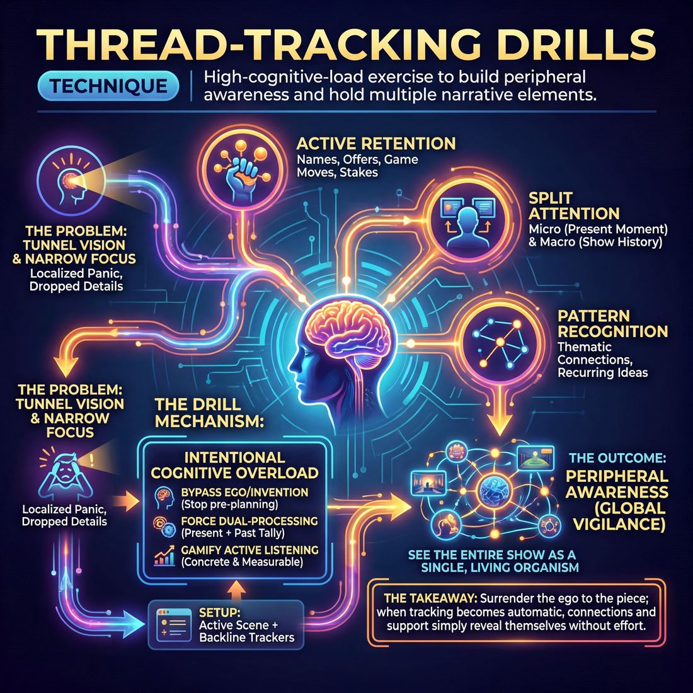

# 🎯 Thread-tracking drills

> *A drillable muscle that trains **Peripheral Awareness**.*

{ .infographic }

## 🎯 The essence

**Thread-tracking drills** are a family of high-cognitive-load exercises where improvisers must actively monitor, recall, and reincorporate multiple distinct narrative elements—such as characters, themes, or plotlines—while simultaneously performing in or observing other scenes. By forcing players to hold several "open loops" in their working memory under pressure, these drills isolate and train a single, vital muscle: **Peripheral Awareness**. They teach an improviser how to split their attention, remaining fully grounded in the immediate reality of their current scene while keeping a wide, active radar on the entire ecosystem of the show so that no offer is ever left behind.

## 🎓 What it trains

Thread-tracking drills isolate and build Peripheral Awareness—the cognitive capacity to hold multiple pieces of information in your working memory while simultaneously acting in the present moment. 

At its core, this technique solves the most common cognitive bottleneck in improvisation: **tunnel vision**. When improvisers are new or stressed, their awareness shrinks. A novice will hyper-focus on their own immediate scene, desperately trying to figure out what to say next. As a result, they drop character names, forget established locations, and completely lose track of scenes they aren't actively playing in. Thread-tracking drills force the brain to widen its aperture, moving the improviser from localized panic to relaxed, global vigilance.

By practicing this technique, improvisers train three specific capacities:

*   **Active Retention:** Holding onto specific details (names, offers, game moves, emotional stakes) long after a scene has ended.
*   **Split Attention:** Dividing focus between the micro (what my scene partner is saying right now) and the macro (what has happened in the show so far).
*   **Pattern Recognition:** Spotting the thematic connections and recurring ideas that naturally emerge when you remember the whole show.

!!! abstract "The Deeper Principle: Surrendering the Ego"
    You cannot support what you do not perceive. In the domain of ensemble play, the ultimate goal is to surrender your ego to the piece—to weave, support, and generate without pre-planning. Thread-tracking is the mechanical prerequisite for this surrender. Before you can elevate others with invisible support or execute a brilliant callback, you must first be able to see the entire show as a single, living organism rather than a series of disconnected turns.

## 💡 Why it works

Thread-tracking drills work by fundamentally shifting an improviser’s **cognitive load**—the amount of mental effort actively used in working memory. 

In a typical scene, a novice uses their brainpower to invent dialogue, worry about the plot, or judge their own performance. Thread-tracking intentionally overloads the brain with *retention* tasks, leaving absolutely no bandwidth for *invention*. 

By forcing the brain to juggle multiple disparate pieces of information, these drills exploit three core dynamics:

*   **Bypassing the ego:** When you are actively trying to remember that Scene A is about a stolen toaster, Scene B is about a phobic astronaut, and Scene C needs a callback, you cannot pre-plan your next clever joke. The pressure to be funny vanishes, replaced by the urgent, mechanical need to simply pay attention. 
*   **Developing dual-processing:** These drills force the brain to run two processes simultaneously. The improviser learns to play the immediate, present moment while keeping a running, subconscious tally of the broader show's patterns. This is the exact mental state required to track all active threads in a complex format.
*   **Gamifying active listening:** Listening is often taught as a passive, abstract virtue ("make sure you listen out there!"). Thread-tracking turns listening into a high-stakes, observable game. You either caught the detail and wove it in, or you dropped it. This makes an abstract skill concrete and measurable.

!!! abstract "The Engine Under the Hood"
    The secret to these drills is that they trick the improviser into surrendering. By making *memory and observation* the primary goal of the exercise, the brain naturally drops its defense mechanisms. You stop trying to write the script and start simply reporting on, and supporting, what already exists on stage. When the cognitive habit of tracking becomes automatic, the connections simply reveal themselves.

## 🧩 The setup

**Players & Group Size:** 6 to 12 players. 

**Arrangement:** A standard stage setup with a clearly defined **backline** (the area where players stand when not actively in a scene). 

**Space & Materials:** An open rehearsal room. No props are required. You may choose to have the backline sit in chairs; removing the physical readiness to enter often forces players to focus entirely on the mental work of active listening.

**Time:** 
*   **Per round:** 3–5 minutes.
*   **Total time:** 15–20 minutes, allowing the group to run several iterations so everyone experiences the cognitive load of tracking multiple threads.

**Roles:**
*   **Active Players:** The 2–3 improvisers currently in the scene, responsible for advancing their specific narrative, relationship, or game.
*   **The Backline (Trackers):** The rest of the ensemble. Their primary job is active observation—holding names, details, offers, and emotional stakes in their working memory.
*   **The Facilitator (Caller):** The coach who controls the flow. The facilitator dictates when scenes switch, pauses the action to test the group's memory, or prompts threads to merge.

**Prerequisites:** Players should be comfortable with basic two-person scene mechanics and standard edits (such as sweeps and tag-outs). They should be ready to move past tunnel-visioning on their own scene and begin noticing the wider ecosystem.

!!! quote "How to introduce it"
    "Today we are going to stretch your working memory and train your peripheral awareness. We are going to juggle multiple scenes at once. When I call 'Scene One,' two players will step out and begin. When I call 'Scene Two,' Scene One freezes in place, and a new group starts a completely different scene. 
    
    Here is the catch: whether you are in the active scene or standing on the backline, you must track *everything*. Memorize the names, the games, the locations, and the emotional stakes of every single thread. Your goal is to surrender your ego to the whole piece. You won't have time to pre-plan your own clever ideas, because your brain will be entirely occupied holding the details of everyone else's work."

!!! tip "On stage"
    Before starting the first round, explicitly ban "checking out." Remind the backline that looking at the floor, whispering to a neighbor, or staring blankly at the back wall are habits that kill peripheral awareness. Tracking is an active, observable physical state.

## ⚙️ The mechanics

The core objective of any thread-tracking drill is to force the improviser’s brain to split its attention. It builds the cognitive capacity to maintain a **foreground focus** (acting in the immediate scene) while sustaining a **background awareness** (monitoring the wider stage for specific information). 

To isolate this muscle, the baseline drill—often called the **Three-Thread Scene**—uses a strict dual-task loop.

### The Flow of Play

1. **Assign the Threads:** The coach assigns specific, observable elements for the players to track. These can be verbal (e.g., "Track every time someone says the word *'well'*") or physical (e.g., "Track every time someone shifts their weight"). 
2. **Establish the Signal:** The coach defines exactly how players will prove they are tracking. Typically, this is a sharp, neutral action: a single clap, snapping fingers, or keeping a running numerical tally out loud (e.g., saying "One," "Two," "Three").
3. **Launch the Primary Scene:** Two players step up and begin a standard, grounded scene. They must establish a relationship, an environment, and an objective just as they normally would.
4. **Trigger and Acknowledge:** As the scene unfolds, whenever a tracked element occurs, the responsible player must immediately execute the signal. 
5. **Seamless Continuation:** The players must absorb the signal and continue the scene without pausing, breaking character, or justifying the signal within the reality of the scene. The scene simply flows over the interruption.

!!! abstract "Key idea: The Dual-Task Loop"
    The magic of the mechanic lies in the friction between step 3 and step 4. The brain wants to drop the scene to focus on the tracking, or drop the tracking to focus on the scene. The drill forces the improviser to hold both simultaneously.

### Rules & Constraints

* **The scene is sacred:** The primary scene must maintain its integrity. If the acting becomes robotic, or the narrative stalls because players are thinking too hard, the drill is failing.
* **No "hunting":** Players cannot artificially force the triggers to happen just to get points. They must play naturally and let the triggers arise organically.
* **Instant acknowledgment:** The signal must happen the *millisecond* the trigger occurs. A delayed clap means the player was processing the scene sequentially, not simultaneously.
* **No breaking:** Players must not laugh, apologize, or step out of character when a signal is missed or triggered. 

!!! warning "Watch out: The 'Turtling' Effect"
    When cognitive load gets too high, improvisers often "turtle"—they freeze physically, stop making eye contact, and give short, non-committal answers so they can dedicate 100% of their brainpower to the tracking task. Coaches must demand full physical and emotional commitment to the scene.

### Ending and Resetting

A standard round lasts two to three minutes. The coach calls "Scene!" and immediately asks the players for their final tally or to recall specific moments the threads were triggered. 

The coach verifies the accuracy (often relying on the rest of the ensemble, who are also tracking from the backline), briefly notes where attention dropped, and resets the drill with new players and entirely new threads.

## 🎬 Sample round

!!! example "Sample round: The Switchboard"
    In this standard thread-tracking drill, three pairs of improvisers are on stage. The coach acts as a "switchboard," pointing to activate one scene at a time. Players must freeze when deactivated, listen to the active scene, and instantly resume their own thread when pointed to.

    **The Setup:**
    
    * **Scene 1:** Alex & Bo (Astronauts)
    * **Scene 2:** Charlie & Dani (Bakers)
    * **Scene 3:** Eli & Finn (Dog walkers)

    **The Play:**
    
    *Coach points to Scene 1.*  
    **Alex:** "Hand me the spanner, the oxygen is leaking."  
    **Bo:** "I can't reach it, my tether is caught on the solar array!"  

    *Coach points to Scene 2.*  
    *(Alex and Bo freeze instantly. Charlie and Dani spring to life.)*  
    **Charlie:** "Knead it harder, Dani. We need the gluten to develop before the morning rush."  
    **Dani:** "My arms are burning, Chef. This sourdough is like concrete."  

    *Coach points to Scene 1.*  
    *(Charlie and Dani freeze.)*  
    **Alex:** *(Without missing a beat)* "Well, pull the tether! If we lose oxygen, we're dead."  
    
    > **Tracking Check:** Alex demonstrates baseline tracking. They held their own scene's emotional and physical thread during the downtime, rather than dropping the stakes or forgetting their physical environment.

    *Coach points to Scene 3.*  
    **Eli:** "Buster, stop pulling! You're tangling the leashes."  
    **Finn:** "It's not Buster, it's Princess. She saw a squirrel."  

    *Coach points to Scene 2.*  
    **Charlie:** "Keep kneading! If we don't get this bread in the oven, we're dead."  
    **Dani:** "I'm trying, Chef, but my apron strings are tangled worse than a dog leash!"  
    
    > **Tracking Check:** Dani demonstrates active Peripheral Awareness. By borrowing the "tangled leash" offer from Scene 3, Dani proves they were listening to the whole stage while frozen, rather than tunnel-visioning on their own scene. They are successfully tracking all active threads and weaving them together.

## 🎚️ Variations & progressions

To move players from tunnel-visioning on their own ideas to seeing the entire show as one interconnected organism, thread-tracking must be scaled progressively. You cannot ask a team to weave three storylines together if they cannot remember the names established in scene one. 

Here is how to ramp the difficulty of thread-tracking drills as your ensemble's awareness matures:

**1. The "Previously On" Pause (Advanced Beginner)**
*   **The Goal:** Break the backline's habit of zoning out. 
*   **The Drill:** Run a standard two-person scene. At a random moment, the coach claps and points to a player on the backline. That player must instantly state the last concrete fact established in the scene (e.g., *"You are in a submarine, and the captain just lost his keys"*). 
*   **The Progression:** If they succeed, the scene continues. If they fail, the scene ends and a new one begins.

**2. The Two-Scene Intercut (Competent)**
*   **The Goal:** Train the working memory to track all active threads simultaneously.
*   **The Drill:** Two pairs take the stage. Pair A begins a scene. After 30 seconds, the coach calls "Switch!" Pair A freezes, and Pair B starts a completely different scene. The coach continues calling "Switch!" at random intervals. 
*   **The Progression:** Players must resume their scene *exactly* where they left off—not just the plot, but maintaining the exact physical posture, emotional tone, and mid-sentence thought. Once they master two scenes, add a third pair.

**3. Cocktail Party Cross-Pollination (Proficient)**
*   **The Goal:** Anticipate where teammates are going and actively weave threads together.
*   **The Drill:** Three pairs conduct simultaneous, low-volume scenes (like mingling at a party). The coach points to one pair to raise their volume to stage-level. 
*   **The Progression:** When a pair becomes the focus, they must naturally incorporate a detail, name, or object they just overheard from one of the *other* pairs' quiet conversations, proving they were tracking the periphery while playing their own scene.

**4. Blind Support (Master)**
*   **The Goal:** Track the show so deeply that support work becomes invisible and ego-free.
*   **The Drill:** The backline turns their backs to the stage, tracking the active scene entirely by ear. When an off-stage player feels the scene needs a walk-on or an environmental offer, they must enter "blind," relying solely on their mental map of the audio threads they've tracked.

!!! tip "Ramping the difficulty"
    If a team is struggling to track two scenes in an intercut drill, do not add a third. Instead, slow the pace of the edits. Give them longer in each scene to establish a firm **base reality** (the who, what, and where) before forcing them to hold it in their working memory. Memory relies on context; if the scene is vague, it will be impossible to track.

## 🧑‍🏫 Coaching notes

Your primary goal as a coach during thread-tracking drills is to stretch the ensemble’s working memory without letting them collapse under the cognitive load. You are training their brains to hold multiple realities at once.

!!! tip "Coaching: 'Widen your lens'"
    The single most important cue you can give during a tracking drill is to remind players to soften their focus. When cognitive load increases, improvisers naturally tunnel-vision on the active speaker or their own internal panic. Prompt them to physically widen their gaze to take in the entire stage picture, the backline, and the physical environment. 

### Essential side-coaching cues
Deliver these cues calmly from the sidelines while the drill is in motion. Do not stop the scene unless the ensemble is completely lost.

* **"Who else is here?"** – Prompts players to remember silent characters, established objects, or environmental elements they’ve dropped.
* **"Keep the first plate spinning."** – A reminder not to let the original premise or character dynamic die just because a new thread was introduced.
* **"Breathe and absorb."** – Tension destroys working memory. If you see furrowed brows, rigid shoulders, and panicked eyes, coach them to physically exhale and relax.
* **"What was the last offer?"** – Forces a player who is stuck in their own head to reconnect with the immediate reality of their scene partner.

### What 'good' looks and sounds like
When the ensemble is successfully building their tracking muscles, you will observe specific shifts in their behavior:

* **Calm readiness:** Players look relaxed but highly alert. They aren't frantically scanning the room; they are simply present.
* **Active sidelines:** Players not currently in the scene are physically engaged. They are watching the active threads unfold rather than zoning out, planning their own moves, or waiting for their "turn."
* **Seamless integration:** When a player brings back an earlier thread, it serves the current moment. It doesn't feel like a forced, jarring callback just to prove they remembered it.

!!! note "Calibrating the pressure"
    Your job is to find the team's breaking point and hover just below it. If they are dropping every thread and the drill is devolving into chaos, **pause and simplify**. Ask the group to verbally recount the active threads before resuming. If they are tracking effortlessly, **increase the speed** or throw in a completely unrelated physical task to test their limits.

## 🧭 Debrief & reflection

The debrief is where the cognitive friction of the drill translates into lasting skill. Because thread-tracking is inherently taxing, players will often finish the exercise feeling either exhilarated or entirely overwhelmed. The coach’s job is to help them unpack *why* they dropped threads and *how* their internal state shifted when they succeeded.

Use these targeted questions to guide the conversation:

*   **The Recall Check:** "Without looking at them, what was the exact physical activity happening in the stage-left scene? What was the core dynamic of the stage-right scene?"
*   **The Bandwidth Question:** "At what exact moment did you feel your focus narrow and tunnel-vision onto your own scene?"
*   **The Effort Question:** "How did knowing you had to watch the other scenes change the way you played your own?"
*   **The Ensemble Question:** "Did anyone notice a moment where two separate scenes accidentally mirrored each other or synced up?"

### What a good debrief surfaces

A successful reflection period moves players from a mindset of individual survival toward tracking all active threads. Listen for and highlight these common "aha" moments:

1.  **Doing less yields seeing more:** Players usually realize that when they stopped trying to be clever, drive the plot, or dominate their own scene, they suddenly had the cognitive bandwidth to hear the rest of the stage. 
2.  **Silence is a tool:** Improvisers will note that they naturally started using pauses and silence in their own scenes so they could listen to the others.
3.  **The illusion of isolation:** The ensemble will often discover that scenes they thought were completely separate actually shared a rhythm, a theme, or an emotional tone, simply because everyone was breathing the same air.

!!! note "Normalizing the overload"
    Expect players to admit they completely forgot about one of the scenes. Normalize this! The brain naturally wants to shed cognitive load. Remind them that the goal of the drill isn't to have a perfect memory, but to build the *muscle* of pulling their awareness outward when their ego tries to pull it inward.

## ⚠️ Common pitfalls

!!! warning "Watch out: The Grocery List Trap"
    The single biggest mistake in thread-tracking is treating the exercise like a rote memory test. Novices try to memorize raw data—names, locations, and plot points ("Okay, Bob is at the bank, Sarah is sad, the dog is loose..."). This spikes cognitive load, causing the player's eyes to glaze over as they detach from the present moment. You cannot act while reciting a list in your head. Track the **game** or the **emotional core**, not just the trivia.

When cognitive load exceeds a player's capacity, their awareness collapses. They revert to tunnel-visioning on their own immediate survival and dropping the wider ensemble. Here is how that overwhelm manifests during drills, and how to coach players out of it:

*   **The "Ghost Player" (Sacrificing the Present)**
    *   *The Trap:* A player is physically in the current scene, but mentally reviewing the previous three threads. They stop listening to their current scene partner, resulting in delayed reactions and missed offers.
    *   *The Fix:* Coach players to anchor in the present. The active scene deserves 90% of their attention. Teach them to trust their subconscious—and their teammates—to hold the periphery. If they must choose between saving a past thread and reacting honestly in the present, always choose the present.

*   **Tracking Trivia over Game**
    *   *The Trap:* A player successfully recalls a thread, but brings back the wrong element. They remember that the character was a pirate, but forget that the scene was about the pirate being deeply insecure about their peg-leg. 
    *   *The Fix:* Shift the focus of the tracking. Ask players, *"What was the unusual thing?"* or *"What was the emotional deal?"* Tracking a behavior or an emotion is much lighter on the brain than tracking a sequence of plot events.

*   **The Panic Spiral (The Solo Burden)**
    *   *The Trap:* A player blanks on a thread they are supposed to recall. They freeze, break character, or panic-invent something entirely unrelated, feeling they have "failed" the drill.
    *   *The Fix:* Remind them that thread-tracking is an **ensemble** muscle, even in individual drills. If a player drops a thread, coach them to make a strong, open emotional offer and let their scene partner fill in the missing context. 

!!! tip "On stage"
    If you completely lose the thread during a show, don't freeze. Look your scene partner in the eye, adopt a strong emotion, and say a line of dialogue that could apply to anything (e.g., *"I can't believe we are doing this again."*). Your partner—who was hopefully tracking the thread—will instantly contextualize it for you.

## 🌟 What mastery looks like

At the highest level of execution, the cognitive strain of "remembering" completely vanishes. The improviser no longer looks like a frantic juggler trying to keep multiple plates in the air. Instead, they have internalized the details so deeply that they can play with absolute freedom, seeing the entire exercise as a single, breathing organism.

When an improviser has mastered thread-tracking drills, you will observe several distinct behaviors:

*   **Zero hesitation:** When a thread is called, rotated, or triggered, the master steps back into it instantly. There is no "searching the ceiling" for a character name or premise. They resume the exact physical and emotional posture they held when the thread was paused.
*   **Effortless cross-pollination:** They do not merely keep parallel storylines isolated in their head. They notice the thematic echoes between threads and subtly weave them together, allowing a detail from Thread A to organically influence Thread C.
*   **The "shared brain" effect:** They track information for the ensemble, not just for themselves. If a teammate drops a detail or loses the thread, the master seamlessly provides it—often in character, as a gift—without breaking the reality of the scene or making their partner look foolish.
*   **Physical ease:** The furrowed "thinking face" disappears. Their peripheral vision is wide, their posture is relaxed, and they are entirely present in the current moment, trusting that the background threads will be there when needed.

!!! example "In the drill"
    Imagine a drill where the ensemble is rapidly cycling through three distinct, unrelated scenes. 
    
    A novice will pause for a half-second upon returning to Scene 2, trying to remember who they are. A master will instantly snap back into the flour-dusted physicality of the baker in Scene 2. Furthermore, they might casually drop a line about "ruthless efficiency" that perfectly, subtly echoes the tense corporate boardroom of Scene 1—weaving the threads together without ever breaking the reality of the bakery.

!!! abstract "The Master Stage: One Organism"
    In the framework's maturity progression, a master improviser sees the entire show as one organism. In thread-tracking drills, this manifests as a complete surrender of ego. They aren't trying to prove they have a flawless memory; they are holding the safety net for the entire ensemble, ensuring that no offer, character, or premise is ever truly lost.

## 🔗 Why it matters

Improv is often described as building an airplane in flight. If that’s true, **thread-tracking** is the radar system that keeps the ensemble from building three different planes that eventually crash into each other. 

At its core, this technique is the gym where improvisers build the muscle of Peripheral Awareness. It cures the novice instinct to survive by shrinking the world down to a single scene. By forcing the brain to expand its bandwidth, the improviser learns to hold multiple pieces of information simultaneously without dropping their current reality.

This directly serves the ultimate goal of ensemble play. When you are actively tracking the threads your teammates have introduced, you no longer need to force your own pre-planned ideas onto the stage. Instead, you become a steward of the show's collective memory. You realize that the answers to the current scene are almost always hiding in the scenes that came before it. 

!!! abstract "From Invention to Recognition"
    Great improvisation rarely requires inventing something entirely new in minute twenty of a show. It requires recognizing what was built in minute two and bringing it back. Thread-tracking shifts your brain from the exhausting work of *invention* to the joyful work of *recognition*.

In the wider craft of long-form improvisation, this muscle is the absolute foundation of structure. Forms like the Harold, the Armando, or the Deconstruction rely entirely on the ensemble's ability to weave disparate ideas together. Without rigorous thread-tracking, a long-form show is just a series of disconnected sketches. With it, the show becomes a cohesive, satisfying universe where every detail matters, every character returns, and the audience feels the magic of a world snapping perfectly into place.

## 📚 References & Further Reading

### Foundational sources
*   **Charna Halpern, Del Close, and Kim "Howard" Johnson, *Truth in Comedy: The Manual of Improvisation* (1994)** — The definitive guide to the Harold, the foundational longform structure that first necessitated the cognitive skill of tracking multiple distinct scenes. It explains why holding onto details from the opening and first beats is essential for creating a cohesive, woven piece of theater.
*   **Viola Spolin, *Improvisation for the Theater* (1963)** — While not explicitly about longform tracking, Spolin’s concept of the "Point of Concentration" and her exercises on split attention (such as "Mirror Speech" and "French Doors") are the mechanical ancestors of modern tracking drills, teaching actors to divide their focus without losing presence.

### Practitioner guides & manuals
*   **Matt Besser, Ian Roberts, and Matt Walsh, *The Upright Citizens Brigade Comedy Improvisation Manual* (2013)** — Codifies the mechanics of "Second Beats" and "Group Games," which require players to actively track and recall specific details, names, and comedic patterns from earlier in the show to execute successful callbacks and thematic connections.
*   **Billy Merritt and Will Hines, *Pirate Robot Ninja: An Improv Fable* (2019)** — Introduces the "Ninja" archetype: the improviser who excels at peripheral awareness, tracking all the disparate threads of a show, remembering the details everyone else forgot, and weaving them together into a cohesive whole.
*   **Will Hines, *How to Be the Greatest Improviser on Earth* (2016)** — Offers practical advice on the mental habits of improvisation, including specific techniques for expanding your awareness, remembering character names, and staying grounded in the present moment while tracking the broader ecosystem of the show.
*   **Mick Napier, *Improvise: Scene from the Inside Out* (2004)** — Discusses the cognitive load of improvising and how to bypass the analytic, fearful brain. Napier emphasizes focusing on active, present-moment choices while maintaining a relaxed awareness of the scene's context, rather than panicking about what to invent next.

### Lineage & teachers
*   **iO Theater (formerly ImprovOlympic)** — The Chicago theater where Del Close and Charna Halpern developed the Harold, making thread-tracking a mandatory, observable skill for modern longform improvisers rather than just an abstract concept.
*   **Upright Citizens Brigade (UCB)** — Institutionalized the practice of tracking the "Game of the Scene" across multiple beats, turning active listening and pattern recognition into a concrete, structural requirement taught from the earliest levels of their curriculum.

### Research & theory
*   **Clément Canonne and Jean-Julien Aucouturier, "Play together, think alike: Shared mental models in expert music improvisers" in *Psychology of Music* (2016)** — Demonstrates that experienced improvisers develop "shared mental models," allowing them to track and coordinate complex, unscripted performances without explicit communication, mirroring the "group mind" sought in ensemble comedy.
*   **Shahar Keisari et al., "Improvisational theater as a cognitive intervention..." in *Frontiers in Psychology* (2022)** — Empirical research demonstrating that improvisational theater exercises actively engage and improve attentional abilities, working memory, and cognitive flexibility.
*   **Charles J. Limb and Allen R. Braun, "Neural Substrates of Spontaneous Musical Performance: An fMRI Study of Jazz Improvisation" in *PLoS ONE* (2008)** — A landmark study showing that improvisation deactivates the dorsolateral prefrontal cortex (associated with self-censorship and ego) while relying heavily on working memory to sustain flow, perfectly illustrating the neurological goal of tracking drills.
*   **John Sweller, "Cognitive Load Theory, learning difficulty, and instructional design" in *Learning and Instruction* (1994)** — The foundational psychological framework explaining how working memory can be overloaded. Thread-tracking drills intentionally exploit this by filling the working memory with retention tasks, leaving no bandwidth for the ego to invent or judge.

### Talks, videos & courses
*   *(unverified)* **World's Greatest Improv School (WGIS) Curriculum** — Online and in-person courses founded by Will Hines that frequently feature specific modules on tracking, memory, and weaving threads in longform, emphasizing the "Ninja" skill set.

### Communities & adjacent reading
*   **Mihaly Csikszentmihalyi, *Flow: The Psychology of Optimal Experience* (1990)** — Essential reading for understanding the state of "surrender" that thread-tracking drills aim to induce. Csikszentmihalyi explains how perfectly balancing high cognitive challenge (tracking multiple scenes) with skill leads to a loss of self-consciousness.
*   **Keith Johnstone, *Impro: Improvisation and the Theatre* (1979)** — While Johnstone's narrative approach differs from Chicago-style structural tracking, his writings on bypassing the intellect, dropping defense mechanisms, and entering a state of relaxed, hyper-aware play are deeply relevant to the psychological goals of these drills.

## 💬 Quotes & Anecdotes

!!! quote "— Charna Halpern, Del Close, and Kim 'Howard' Johnson, *Truth in Comedy* (1994)"
    Players must remember, not invent.

!!! quote "— Tom Salinsky and Deborah Frances-White, *The Improv Handbook* (2008)"
    Beginner improvisers often get "tunnel vision." Asked to play a scene set in a coffee shop, they talk of nothing but coffee.

!!! quote "— Charna Halpern"
    Listening, remembering, recycling, and connecting... those are the skills needed.

!!! quote "— Del Close"
    One mind, many bodies.

!!! quote "— Del Close"
    If we treat each other as if we are geniuses, poets, and artists, we have a better chance of becoming that on stage.

### Where it comes from
Thread-tracking drills as a formal concept stem from the development of long-form improvisation in Chicago, specifically "The Harold," created by Del Close and Charna Halpern. The Harold required players to hold multiple storylines (usually three distinct "beats" or threads) in their working memory and weave them together over 30 to 45 minutes. To train this capacity, directors at theaters like iO (formerly ImprovOlympic) and later the Upright Citizens Brigade (UCB) developed high-cognitive-load exercises. These drills were designed to force players to expand their awareness beyond their immediate scene, track the details of other scenes, and cultivate what Close called the "group mind."

### A telling example
**The "Three-Thread" Number Game**
A classic thread-tracking drill forces players to gamify their listening. Three pairs of improvisers are assigned three distinct scenes (e.g., Scene A is a breakup at a zoo, Scene B is two astronauts fixing a panel, Scene C is a job interview). The coach calls "Scene A," and the players begin. 

However, the coach has given the backline a tracking task: *Count out loud every time a player shifts their physical weight.* 

As Scene A plays out, the backline must watch like hawks. When the person playing the zookeeper leans on their right leg, the entire backline shouts, "One!" When the other player steps back, "Two!" The coach then abruptly calls "Scene B!" The astronauts begin. A player shifts their weight. "Three!" 

The actors in the scene must maintain the reality and emotional stakes of their scene, while the backline (and the actors themselves) must maintain a global awareness of the physical tracking game. The ego's desire to invent a clever joke is entirely overridden by the mechanical necessity of tracking the threads.

## 🧭 Explore the framework

- ⬆️ **Skill it trains:** [Peripheral Awareness](04_S1__peripheral-awareness.md)
- 🎭 **Domain:** [The Ensemble](04_D__the-ensemble.md)
- 🔁 **Sibling techniques:** [Stage-picture exercises](04_S1_T1__stage-picture-exercises.md)
