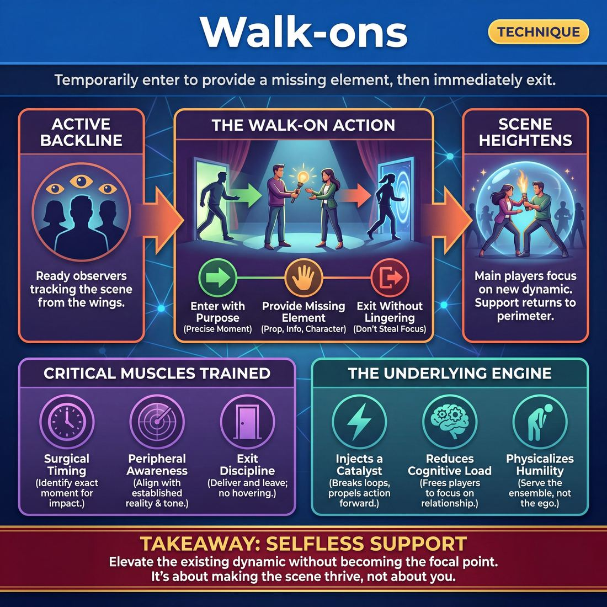

# 🎯 Walk-ons

> *A drillable muscle that trains **Support Work**.*

{ .infographic }

## 🎯 The essence

A **Walk-on** is a foundational support technique where an off-stage improviser temporarily enters an active scene to provide a specific, missing element—such as a physical prop, a quick character interaction, or a vital piece of information—and then immediately exits. It isolates and drills the critical muscle of **selfless support**, forcing players to practice reading a scene from the outside, identifying exactly what will heighten or clarify the existing dynamic, and delivering it without lingering or stealing focus.

## 🎓 What it trains

At its core, practicing walk-ons isolates and strengthens **Support Work**. It teaches improvisers how to actively contribute to a scene they are not starring in, transforming the backline from a passive waiting room into an engaged, breathing ensemble. 

When a scene is unfolding, the players on the sides are the supporting cast, the environment, and the cavalry. Walk-ons train the specific muscle of entering an existing dynamic, providing exactly what is needed, and immediately leaving. 

Specifically, this technique builds three critical muscles:

* **Surgical timing:** Learning to identify the exact moment a scene needs a catalyst, a clarification, or a heightened detail—and entering precisely then.
* **Peripheral awareness:** Tracking the reality of the scene from the outside so that when you enter, you align perfectly with the established base reality and tone.
* **Exit discipline:** The physical and mental restraint required to deliver a line or action and then *get out*, rather than lingering and muddying the stage picture.

!!! abstract "The Deeper Principle: Ego Surrender"
    Walk-ons are a masterclass in surrendering your ego to the piece. You are training yourself to accept that you are not the focal point. A masterful walk-on is an act of "invisible support"—giving the primary players exactly what they need to shine, without the audience ever consciously noticing your intervention.

**The problem it solves:** 
Novice improvisers often suffer from the "savior complex." When they see a scene struggling, they want to help, but they attempt to rescue it by grabbing focus—usually by introducing a loud, wacky character or a brand-new premise that derails the original players. Alternatively, they enter, deliver a joke, and then awkwardly hover on stage like a ghost because they don't know how to leave. Drilling walk-ons cures this by shifting the improviser's mindset from *"How can I make this funny?"* to *"What does this scene need to thrive?"*

## 💡 Why it works

A walk-on functions as a surgical strike of support. The underlying engine of this technique relies on three distinct psychological and group dynamics:

* **Injecting a Catalyst:** Scenes often plateau when players get trapped in a conversational loop or run out of new information to react to. A walk-on introduces a sudden, external variable—a ringing phone, a nosy neighbor, a delivered package. This forces an immediate, instinctual reaction from the primary players, breaking them out of their heads and propelling the scene forward.
* **Reducing Cognitive Load:** When a player on the backline provides a missing element, the players on stage don't have to invent it or mime it awkwardly. If a character yells, "Where is the waiter?!", a walk-on player immediately stepping in as the waiter relieves the primary players of the burden of justifying the delay. The main players can stay entirely focused on their emotional relationship.
* **Physicalizing Humility:** For the improviser executing the move, a walk-on exploits the tension between wanting stage time and serving the ensemble. To work, the move must be entirely about elevating the existing scene, giving exactly what is missing, and then leaving. 

!!! example "In a scene"
    Two players are arguing about a secret letter. They are stuck in a repetitive loop of "Give it to me!" and "No, it's mine!"
    
    **The Walk-on:** A third player enters, briskly walks between them, snatches the invisible letter, says, *"The Queen requires this,"* and immediately exits.
    
    **The Result:** The argument is broken. The stakes are instantly heightened. The original players now have a shared problem to react to, and the walk-on player took zero focus away from their core dynamic.

!!! note "The Safety Net Effect"
    Consistent, well-executed walk-ons create profound psychological safety for the whole team. When the primary players know the backline is actively watching—ready to provide a prop, play a background character, or heighten a joke—they play with much more freedom. They realize they are not alone on stage; the entire ensemble has their back.

## 🧩 The setup

Here is everything you need to arrange before running a dedicated walk-on drill. 

* **Group Size:** Full ensemble (ideally 6 to 12 players).
* **Arrangement:** Two players begin center stage. The remaining players stand on the wings or the backline, forming a perimeter of active observers.
* **Space & Materials:** An open stage. Two chairs placed center stage can help anchor the base scene, but no other materials are required.
* **Time:** 15–20 minutes total. Each scene should run for about 2–3 minutes to allow a solid foundation to form before support is needed.
* **Roles:**
    * **Core Players:** The two improvisers who initiate the scene and maintain its primary focus.
    * **Support Players:** The ensemble members on the sidelines. Their job is to track the scene, identify missing elements, enter briefly to provide them, and exit.
* **Prerequisites:** Players should already be comfortable establishing a clear **Base Reality** (the *Who, What, Where*). If the base reality is muddy, walk-ons will only add to the confusion.

!!! note "The 'Active' Backline"
    Ensure the players on the wings are standing in a neutral, ready position. A successful walk-on requires sharp **Peripheral Awareness**; players leaning against the wall, crossing their arms, or mentally checking out will miss the exact moment the scene needs them.

!!! tip "Facilitator Script"
    "We are going to practice the art of the Walk-on. Two players will start a scene center stage. The rest of you are on the wings, watching like hawks. 
    
    Your job is to look for what the scene needs to feel more real or to heighten its dynamic. When you see an opportunity—maybe they need a waiter, a delivery driver, a ringing phone, or a nosy neighbor—walk on, deliver that specific thing, and immediately leave. 
    
    Do not hijack the scene. Do not start a new plotline. Serve the core players, give them a gift, and get out."

## ⚙️ The mechanics

The mechanics of a walk-on rely on precision, brevity, and deep listening. The core objective is to enter an existing scene, provide exactly one piece of specific value (a prop, a piece of information, or an environmental detail), and exit immediately without pulling focus from the **primary players** (the improvisers leading the scene). 

When drilled as an exercise, the flow of play follows a strict, repeatable loop.

### The Flow of Play

1. **Track the Scene (The Backline):** Players on the **backline** (the off-stage area where improvisers stand when not in a scene) actively watch. They look for a gap: an unnamed character, a missing physical object, or an ambiguous location that needs defining.
2. **Commit and Enter:** The supporting player steps onto the stage with a clear, singular purpose. They adopt a physical posture that matches the established reality of the scene.
3. **Deliver the Gift:** The walk-on executes their action or line. This must be brief, specific, and loud enough to be heard, but delivered in a way that serves the existing dynamic.
4. **Exit Immediately:** Once the purpose is fulfilled, the walk-on leaves the stage. They do not linger to see the reaction, wait for a laugh, or try to become a primary character.
5. **Integrate (Primary Players):** The improvisers in the scene accept the new information, allow it to affect them, and continue their scene without breaking the reality.

!!! tip "On stage: The 'In-and-Out' Rule"
    A proficient walk-on is almost invisible. Enter, drop the puzzle piece, and leave. If you are on stage for more than five seconds, you are likely no longer doing a walk-on—you have joined the scene.

### Rules & Constraints

To keep the technique focused on support rather than scene-stealing, enforce these constraints during practice:

* **One thing only:** Bring exactly one piece of information. Do not introduce a complex backstory or multiple new variables.
* **Serve the primary dynamic:** Your addition must heighten what the primary players are already doing. Do not introduce a distracting subplot or a brand-new game.
* **No "Drive-bys":** A walk-on must exist within the reality of the scene. Do not run across the stage doing something wacky just to get a laugh at the expense of the scene's grounded reality.

### Walk-on Archetypes

When drilling, encourage players to practice different *types* of walk-ons to build a versatile toolkit:

| Type | Purpose | Example Action / Line |
|---|---|---|
| **The Delivery** | Provides a needed object, message, or physical action. | Handing over a clipboard: *"Sign here for the lumber, ma'am."* |
| **The Environment** | Fleshes out the physical world without pulling focus. | Silently walking through as a waiter pouring water at a restaurant table. |
| **The Clarifier** | Names an ambiguous relationship, location, or stakes. | Over an intercom: *"Attention passengers, Flight 42 to Omaha is boarding."* |
| **The Heightener** | Escalates the existing game or emotional stakes. | *"Hey guys, the boss is coming down the hall right now!"* |

!!! example "In a scene"
    **Primary Players:** Two astronauts are arguing vaguely about "the controls" being broken, but haven't established what is actually going wrong.
    
    **The Walk-on:** A player steps forward, grabs a non-existent handle on the wall, and yells, *"Captain, the oxygen levels are dropping!"* then immediately steps back to the backline. 
    
    **The Result:** The scene now has immediate stakes and clarity, and the primary players can resume their argument with specific focus.

### Running the Drill

To isolate and train this muscle, set up a **Walk-on Gauntlet**:

1. Two players step center stage and begin a grounded, mundane scene (e.g., folding laundry, fixing a car).
2. The coach sets a timer. Every 15 to 20 seconds, a player from the backline *must* execute a walk-on.
3. The primary players must justify and incorporate every walk-on without dropping their original activity or relationship.
4. The round ends when the coach calls "Scene" (usually after 2–3 minutes or 5–6 walk-ons). The stage clears, and two new primary players step up to reset the loop.

## 🎬 Sample round

!!! example "Sample round: The Q3 Financials"
    **The Setup:** Two players are center stage. Player A is playing a high-status, aggressive boss. Player B is playing a nervous, cornered employee. 
    
    **Player A (Boss):** "Jenkins, I've been waiting all morning. If you don't have the Q3 financials in your hands right now, you can pack up your desk."
    
    **Player B (Jenkins):** *(Sweating, pantomiming empty hands)* "Sir, I... I can explain. You see, the printer on the fourth floor..."
    
    *(Player C, watching from the backline, recognizes the scene is about Jenkins being trapped. They see an opportunity to heighten the stakes rather than rescue him.)*
    
    **Player C (Walk-on):** *(Enters quickly from the wing, pantomiming carrying a massive, heavy box. They walk directly between A and B.)* "Here are the 4,000 pages of the Q3 financials you asked me to print, Mr. Jenkins! I used the expensive glossy paper just like you said!" 
    
    *(Player C drops the imaginary box on Jenkins' desk and immediately exits back to the wing without waiting for a response.)*
    
    **Player A (Boss):** *(Staring at the massive pile, then glaring at Jenkins)* "Glossy paper, Jenkins? We are in a budget crisis!"

    **The Breakdown:**
    
    * **Observe:** Player C listened from the backline and identified exactly what the scene was about (Jenkins' incompetence and fear) and what physical object was missing (the financials).
    * **Enter with Purpose:** C didn't wander in looking for a character to play. They entered with a strong physical choice (the heavy box) and a clear identity (the overly helpful subordinate).
    * **Deliver and Heighten:** C gave the scene exactly what it asked for, but added a specific detail ("4,000 pages," "expensive glossy paper") that gave Player A new ammunition to attack Player B. 
    * **Exit Cleanly:** C did not linger to see the reaction or try to become a permanent third character in the scene. By leaving immediately, they surrendered the ego of the moment, forcing the focus back onto the primary relationship between A and B.

## 🎚️ Variations & progressions

To build the muscle of the walk-on, you must move players from hesitant, focus-stealing entrances (**Novice**) to surgical, ego-free support (**Proficient**). Use these progressions to ramp up the cognitive load and refine the ensemble's timing.

**1. The Revolving Door (Advanced Beginner)**

* **The Drill:** Two players begin a grounded scene. Every 15 to 20 seconds, the coach claps or calls "Walk-on!" A player from the backline must immediately enter, justify their presence with one line or action, and exit within five seconds.
* **The Focus:** Breaking hesitation. This trains the Advanced Beginner to execute a clean walk-on on instruction, removing the pressure of "waiting for the perfect moment" and building the sheer physical muscle memory of stepping forward.

**2. The Delivery Service (Competent)**

* **The Drill:** Two players start a scene. Backline players are tasked with entering *only* to provide a specific, missing piece of context—a physical object, a name, or a relationship—and then immediately leaving. 
* **The Focus:** Adding value without lingering. This forces the Competent improviser to diagnose what the scene needs rather than entering with their own unrelated premise.

!!! example "In a scene"
    **Player A:** "I can't believe the boss is making us work late again."  
    **Player B:** "I know, and I'm starving."  
    *(Walk-on enters holding a mimed box)*  
    **Walk-on:** "Pizza delivery for accounting. That'll be twenty bucks." *(Takes money, exits)*.  
    
    *Result:* The base reality is enriched, the characters have a new activity (eating), and the walk-on didn't hijack the narrative.

**3. The Invisible Support (Proficient)**

* **The Drill:** Walk-ons are allowed, but they must be entirely **silent**. Players enter to manipulate the environment, play an inanimate object or animal, or provide a physical obstacle, then exit.
* **The Focus:** Surrendering ego. This trains the Proficient improviser to support invisibly. By removing dialogue, the walk-on cannot accidentally steal the scene; they can only elevate the primary players (e.g., walking through as a sudden gust of wind that forces the characters to huddle closer).

**4. The Game Heightener (Mastery)**

* **The Drill:** The walk-on must enter specifically to escalate the established comedic pattern or emotional dynamic of the scene, then leave. 
* **The Focus:** Advanced listening. If the scene is about a character who is terrified of germs, the walk-on enters to sneeze violently on a nearby table and walk out. The walk-on becomes a surgical tool to push the main characters deeper into their established behaviors.

!!! warning "Watch out"
    When progressing through these drills, watch for the **lingering walk-on**. A common regression is a player entering to deliver a line, but then staying on stage because they got a laugh or don't know how to leave. Enforce the exit: a walk-on is a hit-and-run, not a hostile takeover.

## 🧑‍🏫 Coaching notes

When coaching walk-ons, your primary job is to manage the threshold of the stage. Players will naturally hesitate to enter, or conversely, they will enter and refuse to leave. Your side-coaching must act as their external pacing mechanism until they internalize the rhythm of support.

!!! tip "Coaching: The Golden Rule"
    **"Get in, give the gift, get out."**  
    This is the single most important cue to drill. A walk-on is a delivery mechanism for support, not an audition for a starring role. The moment the "gift" (a prop, a piece of information, a heightened reaction) is delivered and registered, the walk-on must exit. 

### Active Side-Coaching Cues
Use these short, direct prompts while scenes are in motion to shape the players' instincts:

* **To cure hesitation:** *"Go now!"* or *"Don't think, just enter."* (Force them to cross the threshold before they have a perfect plan; they can justify it on the way).
* **To fix overstaying:** *"And leave,"* *"You're done, exit,"* or *"Don't move in."* (Call this out the exact second their purpose is fulfilled).
* **To correct focus-stealing:** *"Serve the scene,"* *"Make them look good,"* or *"Lower your status."* (Remind them they are the framing, not the picture).
* **To demand specificity:** *"Bring a specific object,"* *"Give them a name,"* or *"What's your point of view?"* (Prevent them from entering as a generic, unhelpful blob).

### What 'Good' Looks Like
You will know the ensemble is building the **Support Work** muscle when you observe the following behaviors:

* **Decisive entry:** The player crosses the threshold with physical purpose. There is no shuffling, hovering, or apologizing for being there.
* **Immediate justification:** They instantly establish who they are and why they are there, usually in a single line of dialogue or a clear physical action.
* **Preserved focus:** The original players remain the center of gravity. The walk-on acts as a catalyst that gives the main characters more to play with, rather than hijacking the narrative.
* **Clean exits:** The player finds a natural, immediate reason to leave the stage, returning the scene to the original duo. 

!!! note "Calibrating the Ego"
    Watch closely for the transition from **Novice** to **Competent**. Novices often enter because *they* have a funny idea and want to grab focus. Competent players enter because *the scene* needs something. Praise the walk-ons that are almost invisible—the ones that perfectly set up a teammate for a punchline or an emotional reaction, and then vanish.

## 🧭 Debrief & reflection

A strong debrief for walk-ons shifts the ensemble’s focus away from "Was that funny?" and toward "Was that helpful?" The goal is to calibrate the group's **Support Work** instincts, helping players recognize the difference between a surgical enhancement and a scene hijacking.

Use these questions to guide the post-exercise discussion:

**For the player who walked on:**

* **"What was your impulse to enter?"** (Listen for: *“They needed a waiter to deliver the check”* vs. *“I thought of a funny character.”*)
* **"Did you give the scene exactly what it needed, or did you introduce a brand-new problem?"**
* **"How did you know it was time to leave?"** (Prompting self-awareness about overstaying their welcome and the necessity of the exit).

**For the base players (the original scene partners):**

* **"Did you feel supported or derailed?"** 
* **"Did the walk-on clarify your relationship and game, or force you to drop it?"**
* **"Did you even notice them leave?"**

!!! abstract "The 'Aha' Moment"
    A successful debrief surfaces a crucial realization: **the best walk-ons are often entirely functional and ego-free.** Players transition from Novice (entering to grab focus or "save" a scene) to Competent when they realize that silently bringing a prop, delivering a single line of contextual information, and immediately exiting is a profound act of ensemble support. 

!!! tip "Coaching the pivot"
    If a base player reports feeling "hijacked" by an entrance, use that as a constructive teaching moment. Ask the group: *“How could that exact same walk-on idea have been executed so the base players retained their status and focus?”* This trains the muscle of modifying an entrance to serve the existing piece, rather than serving the walk-on's ego.

## ⚠️ Common pitfalls

!!! warning "Watch out: The Scene Hijack"
    The most common novice trap is entering to "save" a scene, but actually stealing it. Driven by the anxiety of watching teammates struggle—or simply a desire to get a laugh—the improviser enters with a loud, brand-new, unrelated premise. Instead of supporting the existing reality, they force the original players to drop their work and deal with the new distraction. 
    
    **The Fix:** A walk-on must serve the *existing* game or base reality. If the scene is about two people quietly arguing over a map, walk on as a passing hiker who drops a compass—not as a time-traveling alien. Give the gift, then get out.

Beyond the hijack, walk-ons frequently break down when the improviser's cognitive load spikes upon entering the stage. Watch for these specific traps:

**The Lingerer (Overstaying the Welcome)**

* **The Trap:** The improviser executes a helpful walk-on—delivering a mimed prop or dropping a line of context—but then their brain freezes under the pressure of being in the scene. Lacking an exit plan, they just stand there, permanently turning a clean two-person dynamic into a clunky three-person scene.
* **The Fix:** Enter with an exit strategy. Once your specific function is complete, find an immediate, justified reason to leave. *("Here's your coffee, boss. Back to my desk!")*

**The Timid Ghost (Under-committing)**

* **The Trap:** Fear of interrupting makes the improviser enter with low energy, mumbling, or hovering in the background. The primary players don't notice them, and the audience is left confused about who this new person is.
* **The Fix:** If you choose to enter, commit fully. Make eye contact, speak clearly, and establish your character's physical weight in the space. A walk-on is brief, but it must be undeniable. 

**The Clown Car (Piling On)**

* **The Trap:** One person walks on, which triggers a chain reaction of other improvisers walking on. Suddenly, there are six people on stage, the original scene is obliterated, and the stage picture is a mess.
* **The Fix:** Practice **Peripheral Awareness**. Before stepping out, check the wings. If someone else is moving, yield. If the stage is already crowded, the absolute best support move you can make is to stay firmly planted on the backline.

## 🌟 What mastery looks like

At the highest level of proficiency, a walk-on is the ultimate culmination of ego surrender. The master improviser does not enter to save a floundering scene, steal a laugh, or insert their own brilliant premise. They enter purely to serve the existing dynamic, providing exactly what is missing before seamlessly disappearing. 

When observing a master-level ensemble executing walk-ons—whether in a drill or a performance—you will notice several distinct, observable behaviors:

* **Surgical economy:** The improviser does exactly one thing. They deliver a prop, drop a single piece of vital information, or provide an environmental sound effect, and then they stop. There is no unnecessary dialogue or lingering.
* **The immediate exit:** The moment the "gift" is delivered, the player leaves. They do not wait to see how the primary players react, nor do they try to wedge themselves into the core relationship. 
* **Off-focus support:** The master player draws zero unnecessary attention to themselves. If they enter as a waiter, they play a grounded, realistic waiter. They allow the couple arguing at the table to remain the absolute focal point of the stage.
* **Heightening the core:** The walk-on does not introduce a brand-new, distracting conflict. Instead, it acts as a magnifying glass for the *existing* game or relationship.

!!! example "In a scene"
    Two players are in a tense, whispered argument about whether or not to open a mysterious locked box they found in the attic. 
    
    **A novice walk-on** might enter as a wacky ghost, pulling focus and forcing the scene to become about the ghost. 
    
    **A master walk-on** enters silently as a roommate, drops a crowbar on the table between them without making eye contact, grabs an apple from the fridge, and exits. The core players are left with exactly what they need to escalate their own scene, and the walk-on player has vanished.

!!! abstract "The Paradox of Mastery"
    The ultimate sign of a masterful walk-on is that the audience often forgets it happened. Because the master improviser fully surrenders their ego to the piece, their entrance feels so natural and inevitable that it simply becomes part of the scene's fabric. They make the primary players look like geniuses.

## 🔗 Why it matters

Walk-ons are the physical embodiment of **Support Work**. They transform the backline from a passive waiting area into a dynamic, engaged part of the ensemble. When an improviser executes a walk-on, they are actively demonstrating that they are listening, tracking the reality of the scene, and willing to contribute without needing to own the spotlight.

This technique strikes at the very heart of **The Ensemble** domain. You enter not to save a dying scene or to steal a laugh, but to provide exactly what the primary players need—a physical prop, a piece of information, a status reaction, or a heightening move—and then you leave. It trains the improviser to value the *scene's* success over their *personal* stage time.

!!! abstract "The Architectural Function"
    The greatest walk-ons are structural. Because the entrance perfectly serves the established reality, it feels like that character or element was always meant to be there. In the architecture of a scene, a walk-on is the mortar, not the bricks. It holds the primary pieces together without drawing attention to itself.

Beyond immediate support, practicing walk-ons sharpens an improviser’s diagnostic eye for the wider craft. To know *when* to walk on, you must understand the scene's pacing and rhythm. To know *what* to bring, you must understand the scene's game, status dynamics, and base reality. 

By drilling this muscle, improvisers learn to watch scenes not as spectators, but as co-creators, constantly asking: *"What does this picture need to be complete?"* Ultimately, this creates a cohesive theatrical organism where the entire cast breathes, builds, and supports together, even from the wings.

## 📚 References & Further Reading

### Foundational sources
* **Charna Halpern, Del Close, and Kim "Howard" Johnson, *Truth in Comedy: The Manual of Improvisation* (1994)** — The definitive text on long-form improv and the concept of the "group mind." It establishes the core philosophy that a successful scene relies on making your partner look good rather than stealing focus, laying the psychological groundwork for selfless support moves like the walk-on.
* **Viola Spolin, *Improvisation for the Theater* (1963)** — The foundational text on theater games and ensemble play. Spolin’s exercises on "giving and taking" and "supporting" are the bedrock of modern improv, training performers to take the focus off their own egos, observe the stage picture, and provide exactly what the group needs in the present moment.

### Practitioner guides & manuals
* **Matt Besser, Ian Roberts, and Matt Walsh, *The Upright Citizens Brigade Comedy Improvisation Manual* (2013)** — Contains an explicit, mechanical breakdown of support moves, including walk-ons, tag-outs, and cutaways. The manual details the strict rules for entering a scene to inject energy or heighten a game, and emphasizes the discipline required to exit immediately without derailing the base reality.
* **Will Hines, *How to Be the Greatest Improviser on Earth* (2016)** — Offers practical, modern advice on being a supportive ensemble member. Hines specifically addresses the pitfalls of the "savior complex," teaching improvisers how to execute walk-ons effectively by giving scenes what they actually need rather than what the improviser thinks is funny.
* **Mick Napier, *Improvise: Scene from the Inside Out* (2004)** — Explores the dynamics of entering scenes and the psychological barriers improvisers face on the backline. Napier emphasizes the importance of committing to a strong choice that serves the existing dynamic, while also warning against hovering or muddying the stage picture.
* **TJ Jagodowski, David Pasquesi, and Pam Victor, *Improvisation at the Speed of Life: The TJ and Dave Book* (2015)** — While focused on two-person improv, their philosophy of "the scene is already there, you just have to discover it" perfectly encapsulates the peripheral awareness required for a walk-on. It trains the improviser to observe the existing reality so deeply that any addition feels inevitable rather than invented.

### Lineage & teachers
* **iO Theater (formerly ImprovOlympic)** — The Chicago institution where Del Close and Charna Halpern championed the Harold. The theater's curriculum relies heavily on the philosophy of "group mind," making selfless, perfectly timed support moves a core tenet of their long-form style.
* **Upright Citizens Brigade (UCB)** — Codified the "Game of the Scene" approach, which treats the walk-on as a surgical tool. UCB teaches improvisers to use walk-ons specifically to heighten a comedic premise or clarify a base reality, strictly discouraging walk-ons that introduce random chaos or pull focus from the primary players.

### Research & theory
* **R. Keith Sawyer, *Group Creativity: Music, Theater, Collaboration* (2003)** — A cognitive psychologist's academic study of jazz ensembles and improv theater groups. Sawyer explores the concept of "distributed cognition" and group flow, detailing how performers successfully submerge their individual egos into the group mind to create a cohesive narrative that no single person could have planned.
* **Mihaly Csikszentmihalyi, *Flow: The Psychology of Optimal Experience* (1990)** — While not exclusively about improv, this foundational psychological text on "flow states" explains the loss of self-consciousness and ego surrender that occurs during peak performance. It provides the theoretical backing for why a perfectly executed, selfless walk-on feels so satisfying for both the ensemble and the audience.

### Talks, videos & courses
* **Jimmy Carrane, *Improv Nerd* (Podcast)** — A long-running interview series where Carrane and veteran improvisers frequently dissect the mechanics of support moves. Carrane specifically addresses the dangers of being "walk-on happy" and discusses the emotional maturity and restraint required to serve the scene from the backline.

### Communities & adjacent reading
* **Anne Bogart and Tina Landau, *The Viewpoints Book: A Practical Guide to Viewpoints and Composition* (2005)** — A foundational text on spatial awareness, ensemble building, and the physical relationship between actors on stage. The Viewpoints framework deeply informs the "peripheral awareness" and "exit discipline" required to step into a stage picture, alter its dynamic, and leave without breaking the tension.
* **Improv Resource Center (IRC) Forums** — A historic online hub where generations of improvisers have debated the exact timing, etiquette, and mechanics of walk-ons, edits, and support work. The archives serve as a masterclass in the evolving philosophy of ensemble support.

## 💬 Quotes & Anecdotes

!!! quote "— Matt Besser, Ian Roberts, and Matt Walsh, *The Upright Citizens Brigade Comedy Improvisation Manual* (2013)"
    A walk-on is when an improviser from the back-line enters the scene to help find the game, play the game, or support the reality of the scene. Walk-ons that happen before a game is found should be done to clarify or 'underline' a game that two improvisers are close to finding but seem unclear or unsure of in some way.

!!! quote "— Charna Halpern, Del Close, and Kim 'Howard' Johnson, *Truth in Comedy* (1994)"
    Walk-ons should enrich a scene without taking over.

!!! quote "— Neil Casey, *UCB Instructor Notes* (2008)"
    Walk-ons, tag-outs, swinging doors, are not for jokes or one-lines, they are for adding information or heightening the game.

!!! quote "— Jimmy Carrane, *Improv Nerd* (2019)"
    I think walks-on are used when an edit would serve the show better... I tell them before we start that every time you feel the impulse to do a walk-on, I would like you to do an edit instead.

!!! quote "— Ben Bowman, *The Boiling Point* (2010)"
    Walk-ons are one of the most dangerous moves in improv... I've heard teachers and coaches say the impulse to walk-on is usually the impulse to edit. That's true 90% of the time. ... If a scene is working, they don't need you. Stay out.

### Where it comes from
The concept of the "walk-on" is as old as theater itself, originating as a minor, non-speaking or single-line role in traditional stage plays. In modern long-form improvisation, it was codified by theaters like iO (ImprovOlympic) and the Upright Citizens Brigade (UCB) as a specific "support move." In the UCB curriculum, walk-ons are strictly categorized as tools to "heighten the game" or "support the reality," explicitly warning students against using them just to deliver a funny one-liner and steal focus.

### A telling example
**The Stalemate Breaker**  
In a classic breakdown of a UCB *ASSSSCAT* performance, improv blogger Ben Bowman highlights a scene where Matt Besser and another player get stuck in a repetitive, argumentative loop ("Show me the ocean." / "There is no ocean." / "Show me the ocean."). Recognizing that the scene has hit a dead end and become a mechanical negotiation rather than a character-driven interaction, Andy Daly executes a surgical walk-on. He enters as Besser's husband, immediately providing new context, breaking the repetitive cycle, and giving the primary players a new emotional reality to react to, rather than leaving them to drown in the stalemate. 

**The "Christopher Walk-on"**  
Because walk-ons are so easily abused by improvisers wanting to grab a quick laugh, the UK-based Hoopla Impro training center playfully refers to the move in their glossary as a "Christopher Walkon." The pun serves as a warning: while a walk-on can be incredibly helpful, it carries the constant risk of being highly distracting—like a bizarre celebrity cameo that completely derails the established tone and leaves the original players struggling to justify the interruption.

## 🧭 Explore the framework

- ⬆️ **Skill it trains:** [Support Work](04_S2__support-work.md)
- 🎭 **Domain:** [The Ensemble](04_D__the-ensemble.md)
- 🔁 **Sibling techniques:** [Tap-ins](04_S2_T2__tap-ins.md), [Playing architecture/objects](04_S2_T3__playing-architecture-objects.md)
