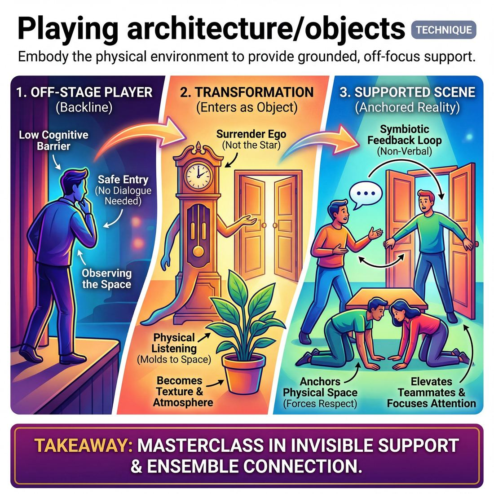

# 🎯 Playing architecture/objects

> *A drillable muscle that trains **Support Work**.*

{ .infographic }

## 🎯 The essence

Playing architecture and objects is an ensemble technique where improvisers enter a scene to embody the physical environment—becoming doors, trees, chairs, or props—rather than human characters. At its core, this exercise isolates and drills **off-focus support**: the ability to surrender your ego, step on stage to provide exactly what a scene needs to feel grounded and textured, and elevate your teammates without pulling the audience's attention away from the primary action.

## 🎓 What it trains

For many improvisers, the default way to contribute to a scene is to walk on and speak. This technique solves the "talking head" problem by proving that you can radically alter and elevate a scene without ever saying a word. It is a masterclass in **Support Work**.

It addresses the common improviser anxiety that they must be the center of attention to be useful, training them instead to provide texture, reality, and atmosphere. By isolating this specific action, the technique builds several vital muscles:

*   **Surrendering the ego:** You are no longer the protagonist; you are the grandfather clock, the automatic sliding doors, or the creaky floorboards. It trains the ensemble to prioritize the needs of the *piece* over personal stage time.
*   **Off-focus contribution:** It builds the ability to add immense value to the environment while actively directing the audience's attention *toward* the primary actors.
*   **Physical listening:** Instead of listening merely to formulate a verbal response, improvisers learn to listen with their bodies. They must observe the physical space the main characters are defining and mold themselves to fit it.

!!! abstract "The Support Work Progression"
    This technique forces a direct leap across the improviser's maturity scale. A **Novice** often wants to help a scene but enters only to grab focus, steal the premise, or deliver a punchline. By restricting the improviser to becoming an inanimate object or architectural feature, this exercise strips away the ability to steal the spotlight. It forces the **Proficient** and **Master** behaviors: supporting invisibly, giving exactly what the physical environment is missing, and elevating others.

Ultimately, this technique roots the improviser in the domain of **The Ensemble**. It teaches that a scene is not just two people talking in a void, but a living, breathing organism where every player on the sidelines can weave the world together without pre-planning.

## 💡 Why it works

This technique fundamentally bypasses the improviser’s ego. It shifts the brain out of the anxious, verbal state of *"what clever thing do I say next?"* and into a grounded, physical state of *"how can I physically serve this exact moment?"* 

By stripping away the need to invent dialogue or drive a narrative, playing architecture exploits several powerful cognitive and group dynamics:

*   **It lowers the cognitive barrier to entry:** Novice improvisers often hesitate to provide support because they fear they need a fully formed character, a joke, or a plot-altering revelation to justify stepping on stage. Entering as a bubbling cauldron removes that pressure entirely. Your only job is to exist in space, making the act of entering feel safe and low-stakes.
*   **It enforces symbiotic, full-body listening:** To be a convincing object, you cannot zone out. A human-door must read the exact micro-movements of the primary actor reaching for the knob to know precisely when to swing open, how much resistance to offer, and whether to creak. This creates a tight, non-verbal feedback loop where the object and the actor breathe and move together.
*   **It anchors the physical reality:** When a stage is empty, improvisers frequently forget their own mime work—walking through tables or leaving imaginary refrigerators open. When the environment is populated by living teammates, the primary actors are forced to respect the space. You cannot accidentally walk through a kitchen island if that island is played by two of your friends.

!!! abstract "The Engine of Ego Surrender"
    To play a coat rack is to accept that you are not the star of the scene. This technique trains the highest levels of ensemble work by making the improviser comfortable with being entirely off-focus. It is the literal embodiment of surrendering to the piece: existing solely to make someone else's scene look and feel more real.

!!! example "In a scene"
    Two players are in a tense scene driving a getaway car. A third player enters, crouches near the front, and becomes the sputtering, overheating engine. The primary actors don't need to invent dialogue about the car breaking down; the "engine" player is providing the physical and auditory reality. The actors can simply react to the smoke and the noise, allowing the object-player to effortlessly heighten the stakes without ever speaking a word.

## 🧩 The setup

Here is everything you need to prepare and launch the exercise before the first scene begins.

*   **Players & Group Size:** Ideal for a full ensemble of 6 to 12 players. Arrange the group with 2 to 3 players center stage, while the rest stand on the wings or the **backline** (the off-stage area where improvisers wait), actively watching.
*   **Space & Materials:** A completely bare stage or rehearsal room. **Remove all physical chairs, blocks, and props.** The ensemble’s bodies will provide the entire physical environment. 
*   **Time:** 15 to 20 minutes total. Plan for 3 to 4 scenes, allowing each to run for about 3 to 4 minutes so the environment has time to establish and evolve.
*   **Roles:**
    *   **The Protagonists:** The 2 to 3 players center stage who initiate and drive the scene's dialogue, relationship, and narrative.
    *   **The Environment (Support):** The remaining players on the perimeter. Their job is to enter the stage solely to physically embody inanimate objects, architecture, or atmospheric elements (e.g., a coat rack, a ticking grandfather clock, a heavy oak door).
*   **Prerequisites:** Players should have a basic grasp of mime and space work. More importantly, the group must have established trust regarding physical boundaries and safe touch, as this exercise often involves close proximity or simulated weight-bearing.

!!! warning "Safety and Weight-Bearing"
    Before starting, explicitly clarify how physical contact will work. Teach the difference between *actual* weight-bearing (which can be dangerous if unexpected) and the *illusion* of weight. When a protagonist sits on a "human chair," they should support their own core weight in a wall-sit or squat, rather than dropping their full body weight onto their teammate's back or knees.

!!! tip "Facilitator Script: How to introduce it"
    "In this exercise, we are going to practice total, ego-free physical support. Two players will step out and begin a scene in a specific location. The rest of you are the furniture, the walls, the props, and the weather. 
    
    If a player mimes holding a steering wheel, someone step in and *be* the steering wheel. If they walk through a door, be the door that creaks open. Your goal is to make their physical world incredibly rich and real without ever pulling focus. Do not speak, do not try to be funny, and do not hijack the narrative. Surrender your ego to the piece, and just be the best lamp, sofa, or fireplace you can possibly be."

## ⚙️ The mechanics

The core loop of playing architecture and objects is **observe, embody, support, and dissolve**. In this technique, the ensemble acts as a living set design, providing physical context that grounds the primary actors. 

The flow of play follows a strict, repeatable sequence:

1. **Establish the Base Reality:** The primary actors initiate a scene, defining the *who, what, and where*. They begin moving through the space, implying a physical environment.
2. **The Scan:** Players on the backline actively watch the physical space. They look for implied objects, missing architecture (pillars, windows), or environmental elements (trees, wind) that would heighten the scene's reality.
3. **The Entry and Embodiment:** A supporting player steps into the scene and physically transforms into the object. This must be done with total physical commitment—locking into the shape, tension, and function of the item. 
4. **The Interaction:** The primary actors incorporate the human-object into their **object work** (mimed interaction with the environment). The human-object reacts mechanically to being used (e.g., a door swinging open, a coat rack swaying slightly when a heavy coat is hung on it).
5. **The Dissolve:** When the scene transitions, the location changes, or the object is no longer relevant, the supporting player drops the physicality and cleanly exits back to the backline.

### Rules and Constraints

To ensure this technique trains true support rather than scene-stealing, players must adhere to specific boundaries:

* **Focus discipline:** The object must remain entirely peripheral. You are there to serve the primary actors, not to invent a parallel comedy routine. 
* **Safety first:** Primary actors must *never* put their full body weight on a human-object. The primary actor must engage their own core while *appearing* to rest on the supporting player.
* **Vocal restraint:** Objects are generally silent. However, they may provide subtle, realistic sound effects (a ticking clock, a creaky floorboard, the hum of a refrigerator) if it enriches the atmosphere without drowning out dialogue.
* **Mechanical reaction:** If you are a door and an actor turns your "knob" and pushes, you must swing open. You are bound by the physics of the object you have chosen to be.

!!! tip "On stage"
    Enter with purpose. Do not wander into the center of the stage and *then* decide to be a floor lamp. Make the decision on the backline, execute a clean **walk-on**, walk directly to the spot, and snap into the shape instantly. 

!!! warning "Watch out"
    Avoid becoming a "gag" object. If you enter as a singing bass on the wall and start improvising your own jokes while the main actors are arguing about their marriage, you have hijacked the scene. 

### Ending and Resetting
A round of this technique does not end when an object leaves; it ends when the scene itself is edited (via a sweep, tap-out, or blackout). When the edit occurs, all human-objects immediately drop their physical choices, clear the stage, and return to the backline to reset for the next initiation.

## 🎬 Sample round

!!! example "Sample round: The Antique Shop"
    **Players:** 
    
    * **Primary:** Sam (Customer) and Alex (Shopkeeper)
    * **Support:** Jordan and Taylor (Playing architecture/objects)

    **The Scene:**
    *(Sam mimes pushing open a heavy front door. Jordan immediately steps from the backline, positioning their body as the door frame and swinging their arm as the heavy glass door, providing physical resistance and a low squeaking sound.)*

    **Sam:** "Hello? Is anyone here?" 
    
    *(Sam lets go of the 'door'. Jordan swings their arm back, making a heavy *THUD* and a bell *DING* sound, then freezes completely, remaining part of the background.)*

    **Alex:** *(Stepping from the back)* "Welcome to Curiosities. Mind the grandfather clock, it's temperamental."

    *(Taylor immediately steps upstage, standing rigid with arms swinging slowly like a pendulum. They softly vocalize the rhythm: "Tick... tock... tick... tock...")*

    **Sam:** "I'm looking for a cursed amulet." 
    
    *(Sam casually leans against the 'clock'. Taylor physically braces to support Sam's weight, then lets out a sudden, loud "BONG!" that startles Sam.)*

    **Alex:** "I told you, temperamental."

    **Mechanics in action:**
    
    * **Observation & Timing:** Jordan saw Sam's initial mime and instantly materialized the door to give it weight, sound, and reality. They didn't wait to be asked.
    * **Egoless Support:** Once the door closed, Jordan froze. They didn't try to pull focus, pitch jokes, or speak; they surrendered entirely to being the architecture. 
    * **Yes, And-ing the Environment:** Taylor listened to Alex's dialogue ("grandfather clock") and immediately manifested it. They didn't just stand there; they added a steady, atmospheric rhythm to the scene.
    * **Physical Interaction:** Taylor accepted Sam leaning on them, adjusting their physical tension to support the primary player's object work. They then reacted *as the object* (the "BONG!") to heighten the scene, without breaking the reality of being a clock.

## 🎚️ Variations & progressions

To build the support muscle effectively, this technique should scale from simple, static physical shapes to fluid, invisible scene support. By ramping up the difficulty, improvisers move from simply standing on stage to actively elevating the primary scene.

Here is how to progress the exercise, mapped to the maturity of the ensemble:

### 1. Set the Stage (Novice to Advanced Beginner)
In this foundational version, the architecture is built *before* the scene begins. The coach calls out a location (e.g., "A medieval dungeon" or "A 1950s diner"), and the ensemble has ten seconds to rush the stage and freeze as the physical environment. 
* **The Goal:** Train players to enter the stage with purpose and commit to a physical choice without trying to steal focus. 
* **The Rule:** Once the scene starts, the architecture remains completely static. 

### 2. On-Demand Architecture (Competent)
Instead of pre-building the room, the backline watches a two-person scene unfold. When an active player mimes an object—reaching for a steering wheel, opening a heavy vault, or sitting on a stool—a backline player immediately steps in to *be* that object.
* **The Goal:** Train players to track active threads and choose to enter *only* when a scene explicitly needs something.
* **The Rule:** The improviser must leave the stage the moment the object is no longer being used. 

!!! tip "On stage"
    When playing an object that an actor must interact with (like a chair or a door), make eye contact with the actor as you enter. This non-verbal check-in ensures physical safety and signals, *"I am here to support your mime."*

### 3. The Living Environment (Proficient to Master)
At the highest level, architecture is not just physical; it is reactive and atmospheric. The objects begin to reflect or heighten the emotional reality of the scene, providing off-focus support that elevates the primary actors.
* **The Goal:** Support invisibly. The ego is fully surrendered to the piece, giving exactly what is missing to heighten the scene's pacing and rhythm.
* **The Rule:** The architecture may move, make sound, or react, but it must never pull the audience's primary attention away from the main actors.

!!! example "In a scene"
    Two actors are playing out a tense, passive-aggressive argument in a kitchen. A proficient supporting player, acting as the boiling tea kettle on the stove, begins to emit a low, vibrating hiss that slowly grows louder in perfect tandem with the rising tension of the argument, peaking exactly as one actor finally snaps.

### Common Variations

| Variation | How it works | Best used for |
| :--- | :--- | :--- |
| **Human Props** | Instead of large architecture, players become handheld items (a mop, a crying baby, a chainsaw). The primary actor physically manipulates them. | Teaching physical trust and yielding control to a scene partner. |
| **Foley Artists** | Players provide only the *sound* of the architecture from the backline (creaking floorboards, wind, a ticking clock) without entering the physical space. | Ensembles that struggle with crowding the stage but still need to practice active listening. |
| **The Moving Vehicle** | Four or more players form a single complex machine (like a helicopter or a horse-drawn carriage). When the "driver" leans, accelerates, or hits a bump, the entire vehicle reacts as one organism. | Building group mind and synchronizing physical rhythm across the whole team. |

## 🧑‍🏫 Coaching notes

Coaching this technique requires balancing two seemingly contradictory directions: demanding intense physical commitment while insisting on absolute ego surrender. You are training players to move from a Stage 1 mindset (entering to grab focus) to a Stage 4 or 5 mindset (supporting invisibly and elevating others).

!!! tip "Coaching: The Golden Cue"
    **"Commit 100% physically, 0% ego."**  
    This is the single most important reminder. The player must fully embody the weight, shape, and function of the object, but they must do so without pulling the audience's attention away from the primary scene. If the audience is watching the "coat rack" instead of the scene, the coat rack is too loud.

Here are the most effective side-coaches to use while the exercise is in motion:

*   **"Give them the physical world."** Call this out when primary players are miming heavy or complex objects in thin air. Prompt the backline to step in and become the table, the steering wheel, or the heavy oak door.
*   **"Provide the resistance."** If an actor is trying to open a stuck jar, the player playing the jar needs to tense their muscles and fight back. If someone sits on a "chair," the chair must safely brace to support that illusion.
*   **"Find the sound of the room."** Objects aren't always silent. Side-coach players to add ambient audio: the rhythmic ticking of a grandfather clock, the low hum of a refrigerator, or the hiss of a radiator. 
*   **"Stay the object."** Novices often break their physical hold to laugh at a joke or watch the scene as a spectator. Remind them to maintain the physical reality until the scene edits or they are naturally dismissed.
*   **"Where are your eyes?"** A lamp does not make eye contact with a human. Coach players playing architecture to drop their focus, stare blankly, or look at the floor to help erase their human presence.

### What 'Good' Looks Like

When observing the ensemble, look for these markers of success:

*   **Physical specificity:** A player playing a beanbag chair looks soft, low, and formless; a player playing a wooden stool looks rigid, upright, and locked at the joints.
*   **Seamless integration:** The object enters exactly when the scene demands it (e.g., an actor reaches for a phone, and a hand is suddenly there holding the receiver) without interrupting the dialogue.
*   **Total surrender:** The player accepts whatever the primary actors do to them. If the actor decides the "sports car" is actually a "broken lawnmower," the improviser playing the machine instantly alters their physical shape and sound to match the new reality, without arguing or hesitating.

!!! warning "Watch out for the 'Gag Object'"
    Be quick to correct players who turn their object into a joke—like a toaster that bites the actor's hand, or a mirror that starts mocking the person looking into it. While funny in a vacuum, this is a Stage 1 behavior (stealing focus). Remind them that true support means making the primary actors look brilliant, not manufacturing a laugh for yourself.

## 🧭 Debrief & reflection

After the exercise concludes, the debrief must shift the room’s focus away from the comedy of the scene and directly onto the mechanics of support. The goal is to help players articulate what it feels like to surrender their ego and serve the primary action.

Use these targeted questions to guide the conversation, dividing your focus between the players who acted as the environment and the players who inhabited it.

### Questions for the "Architecture" (Support Players)
*   **"Where was your attention focused?"** 
    *   *Listen for:* Answers that indicate they were tracking the primary players' physical movements and emotional pacing, rather than planning their own jokes.
*   **"How did it feel to be essential to the scene, but not the center of attention?"**
    *   *Listen for:* The realization that off-focus support is liberating. It removes the pressure to invent narrative and replaces it with the simple task of reacting.
*   **"How did you decide *when* to make a sound or move?"**
    *   *Listen for:* Cues about timing. Did they wait for the primary player to initiate contact (e.g., turning the doorknob), or did they offer a proactive gift (e.g., the grandfather clock chiming to interrupt an awkward silence)?

### Questions for the Scene Actors (Primary Players)
*   **"How did a 'living' environment change your scene work?"**
    *   *Listen for:* Observations about feeling grounded. When the environment reacts, actors are forced out of their heads and into their physical bodies.
*   **"Did the objects give you any unexpected gifts?"**
    *   *Listen for:* Moments where the *way* an object was played (a stubbornly stuck drawer, a surprisingly bouncy armchair) altered the character's emotion or the scene's trajectory.

!!! abstract "The Core Realization"
    A successful debrief surfaces a crucial shift in the maturity progression. Novice players often believe that to "help" a scene, they must enter with a loud character or a new plot point—inadvertently stealing focus. By reflecting on this exercise, players realize that **invisible support** is incredibly powerful. They learn that giving the scene exactly what it needs—even if it's just the sound of a creaky floorboard—elevates everyone else.

!!! tip "Coach's Ear"
    If a support player says, *"I was just waiting for a chance to do something funny,"* gently redirect them. Remind the ensemble that playing architecture is an exercise in ego surrender. The highest form of mastery here is when the audience barely registers the support player as a separate human, but the primary actors feel completely held by the world they are in.

## ⚠️ Common pitfalls

!!! warning "Watch out: The Wisecracking Coat Rack"
    The single biggest trap when playing architecture or objects is **upstaging the primary scene**. A novice wants to help but enters to grab focus. If you enter to play a grandfather clock and start loudly ticking, chiming, and pulling the audience's eyes away from the emotional dialogue happening downstage, you are no longer supporting—you are stealing. 
    
    **The fix:** Surrender your ego. Your job is to be invisible infrastructure. Be silent, be still, and let the primary actors shine.

When improvisers first practice becoming the physical environment, the cognitive load of tracking the scene while maintaining a physical shape often causes a few predictable breakdowns:

*   **Dropping the reality:** 
    *   *The Trap:* You form a sturdy chair for your scene partner. They "sit" on your knee. A minute later, you get engrossed in watching the scene, relax your legs, and stand up—leaving your partner awkwardly pantomiming a squat in mid-air. 
    *   *The Fix:* Lock in your physicality. Once you become an object, maintain the necessary muscle tension until the scene edits or the actors explicitly move away from you. 
*   **The Swarm (Overcrowding):** 
    *   *The Trap:* One person initiates a scene in a forest, and suddenly six improvisers rush on to be trees, completely boxing in the primary actors and cluttering the stage picture.
    *   *The Fix:* Exercise **peripheral awareness**. Notice when the stage is crowded. If the environment is already established by one or two teammates, stay on the backline. Enter only when the scene actually *needs* something.
*   **Half-hearted physicality:** 
    *   *The Trap:* You step in to be a door, but you just stand there limply with your arms at your sides. The primary actor doesn't know where the handle is, which way it swings, or how to interact with you.
    *   *The Fix:* Make strong, clear physical choices. Use your whole body to create angles and define the shape of the object. Offer a clear interaction point (like an extended fist for a doorknob) so the actor knows exactly how to use you without having to guess.

## 🌟 What mastery looks like

At the highest level of execution, playing architecture and objects is the ultimate act of ego surrender. A master improviser performing this technique becomes an invisible, load-bearing pillar of the scene. They do not play the object for laughs; they play it to give the primary actors a rich, tactile reality to inhabit. 

When observing a master at work, you will see several distinct behaviors:

*   **Anticipatory physicality:** They do not wait for an actor to mime a chair and then rush in to become it. They read the actor's body language and form the chair *just as* the actor's knees begin to bend.
*   **Emotional resonance:** The object breathes with the scene's subtext. A master playing a grandfather clock might tick aggressively during a tense argument, or a door might stick stubbornly when a character is secretly reluctant to leave.
*   **Tactile resistance:** They provide actual physical weight and boundaries. If they are playing a brick wall, they brace themselves so the primary actor can genuinely lean their weight against them without the "wall" crumbling.
*   **Absolute stillness:** They know how to be completely inert. They do not fidget, pull focus, or try to make the object "funny" unless the scene's specific game demands an animated object.

| Competent (Stage 3) | Master (Stage 5) |
| :--- | :--- |
| Becomes the object when explicitly asked or obviously needed. | Anticipates the need; the object is fully formed before the actor reaches for it. |
| Holds the physical shape accurately. | Breathes with the scene; the object's subtle sounds or movements reflect the emotional tone. |
| Stays quiet to avoid pulling focus. | Surrenders ego entirely; provides genuine physical weight and resistance for the actors to use. |

!!! example "In a scene"
    Two improvisers are playing out a tense, whispered argument in a moving car. The master improviser playing the "car seat" doesn't just kneel behind them; they provide firm, physical tension for the actor to lean against. As the argument escalates and the driver mimes slamming the brakes, the "seatbelt" (played by another master) catches the actor with the exact physical jolt of the car's momentum. The audience never consciously looks at the improvisers playing the car—they only feel the heightened, grounded reality of the argument.

!!! abstract "The Ultimate Ego Surrender"
    At Stage 5 of Support Work, the improviser's ego is fully surrendered to the ensemble. They are perfectly content to spend a five-minute scene as a silent coat rack, knowing their off-focus support is exactly what elevates their teammates' work from good to transcendent.

## 🔗 Why it matters

Playing architecture or objects is the purest physical manifestation of Support Work. To step on stage and become a coat rack, a ticking grandfather clock, or the automatic doors of a grocery store requires a deliberate choice not to speak, not to drive the narrative, and not to pull focus. Instead, you are offering your body and energy entirely to make your teammates' reality more vivid.

In the domain of The Ensemble, the ultimate goal is to perceive, support, and weave together a piece without individual grandstanding. When an improviser sees a teammate pantomiming a heavy vault door and immediately steps in to *be* that door—providing physical resistance and a satisfying mechanical *clunk*—they are weaving themselves seamlessly into the fabric of the scene. They are answering the question, *"What does this stage picture need?"* rather than *"How can I get a laugh?"*

Beyond immediate scene support, this technique builds vital muscles for the wider craft:

*   **Dynamic Stage Pictures:** It transforms a bare stage into a rich, three-dimensional environment, breaking the visual monotony of "talking heads" standing center-stage.
*   **Physical Commitment:** It forces improvisers out of their heads and into their bodies, demanding full-body engagement to convey weight, texture, and mechanics.
*   **Peripheral Awareness:** It trains the ensemble on the backline to watch the *environment* being established by the active players, not just listening to the dialogue.

!!! abstract "The ultimate ensemble test"
    If you want to measure the health and maturity of an ensemble, watch how they treat the physical environment. A team of individuals will leave a player to mime a bumpy carriage ride alone. A true ensemble will immediately rush out to become the horses, the wooden wheels, and the bouncing carriage frame, elevating the moment from a solo mime to a shared theatrical event.

## 📚 References & Further Reading

### Foundational sources
*   **Viola Spolin, *Improvisation for the Theater* (Northwestern University Press, 1963)** — Spolin’s foundational text is the bedrock of physical ensemble work. It introduces exercises like "Part of a Whole" (where players physically become parts of a larger machine or object) and "Space Walks." These games train improvisers to embody their environment, listen with their bodies, and bypass the intellectual anxiety of needing to invent clever dialogue.
*   **Charna Halpern, Del Close, and Kim "Howard" Johnson, *Truth in Comedy: The Manual of Improvisation* (Meriwether Publishing, 1994)** — The definitive guide to long-form improvisation and the Harold. It introduces the concept of the "Group Mind" and organic support, emphasizing that players must surrender their individual egos. The text explicitly discusses how improvisers can become the physical environment—doors, trees, or weather—to serve the ensemble and elevate the scene rather than seeking the spotlight.

### Practitioner guides & manuals
*   **Matt Besser, Ian Roberts, and Matt Walsh, *The Upright Citizens Brigade Comedy Improvisation Manual* (Comedy Council of Nicea, 2013)** — The UCB manual provides highly technical, actionable advice on ensemble play. It explicitly details "Support Moves" and "Walk-ons," instructing players on how to enter a scene specifically to become furniture, props, or architecture. It highlights how these off-focus contributions ground the primary action and establish the base reality without pulling narrative focus.
*   **Mick Napier, *Improvise: Scene from the Inside Out* (Heinemann Drama, 2004)** — While Napier is famous for challenging traditional improv rules, he heavily emphasizes the critical importance of context and environment. He argues that using the physical environment and spatial context anchors a scene, moving improvisers away from the "talking heads" trap and forcing them to make strong, physical choices that support their scene partners.

### Lineage & teachers
*   **Jacques Lecoq, *The Moving Body (Le Corps Poétique)* (Methuen Drama, 1997)** — A foundational physical theater text detailing Lecoq's pedagogy of "Mimodynamics." Lecoq trains actors to observe and physically embody natural elements, materials, and inanimate objects. This practice of "becoming the object" is directly applicable to improv, as it enriches an improviser's physical vocabulary, spatial awareness, and ability to communicate reality without words.
*   **Anne Bogart and Tina Landau, *The Viewpoints Book: A Practical Guide to Viewpoints and Composition* (Theatre Communications Group, 2005)** — This essential guide to movement and stage composition details the Viewpoint of "Architecture." It trains performers to physically relate to, define, and embody the spatial environment and topography of the stage. It is a masterclass in off-focus support, teaching actors how their physical placement and shape can alter the mood and reality of a scene.

### Research & theory
*   **C. L. Scott, R. J. Harris, and A. R. Rothe, "Embodied Cognition Through Improvisation Improves Memory for a Dramatic Monologue" (*Discourse Processes*, 2001)** — A psychological study demonstrating that physically dramatizing and embodying a scene significantly improves cognitive engagement and recall compared to mere verbal discussion. This supports the underlying theory of playing architecture: that shifting the brain into a physical, embodied state lowers cognitive barriers and bypasses verbal anxiety.
*   **R. Keith Sawyer, *Group Creativity: Music, Theater, Collaboration* (Lawrence Erlbaum Associates, 2003)** — A deep dive into the psychology of "group flow" in ensemble improvisation. Sawyer explains how surrendering individual ego to the collective physical action creates a heightened state of performance. The book provides an academic framework for why exercises like playing objects successfully forge a "group mind" by forcing symbiotic, non-verbal listening among the ensemble.

### Communities & adjacent reading
*   **Mary Overlie, *Standing in Space: The Six Viewpoints Theory & Practice* (Fallon Press, 2016)** — Written by the originator of the Viewpoints theory, this book offers deep philosophical and practical exercises on deconstructing space, shape, and movement. Overlie teaches performers to exist in space without the hierarchy of narrative or ego, perfectly mirroring the improv technique of stepping on stage simply to exist as a piece of the physical environment.
*   **Stephen Nachmanovitch, *Free Play: Improvisation in Life and Art* (Jeremy P. Tarcher/Penguin, 1990)** — A philosophical exploration of the improvisational spirit across all art forms. Nachmanovitch discusses the concept of surrendering to the muse and the materials at hand, which aligns beautifully with the ego-less surrender required to step on stage and simply be a coat rack or a bubbling cauldron for the benefit of the piece.

## 💬 Quotes & Anecdotes

!!! quote "— Matt Besser, Ian Roberts, and Matt Walsh, *The Upright Citizens Brigade Comedy Improvisation Manual* (2013)"
    When miming objects, your goal should be to make them as real as possible. Remember that whenever you mime, your hand isn't becoming the object; it is holding the object... Do not get seduced by those easy laughs and make your object work the only funny aspect of your scene. Use object work as another way to make everything except your single comedic idea seem real.

!!! quote "— Mick Napier, *Improvise: Scene from the Inside Out* (2004)"
    Assume a posture. Grab an object. Start a motion. Engage your environment.

!!! quote "— Del Close (as quoted by Charna Halpern in *Truth in Comedy*, 1994)"
    If we treat our partners as geniuses, they will be.

!!! quote "— Patricia Ryan Madson, *Improv Wisdom* (2005)"
    Make your partner look good — support him or her.

!!! quote "— Hannah Platts, *The Improv Chronicle Podcast* (2023)"
    I can play anything. I can be a dog, I can be a chair. I can be like the romantic lead. And it doesn't matter what you look like. You can be any gender, you can be any anything.

### Where it comes from
The foundational concepts of "Space Work" and "Object Involvement" were coined and popularized by Viola Spolin in her seminal 1963 book, *Improvisation for the Theater*. Spolin used physical games to train actors to interact with their environment rather than just talking about it, noting that physicalizing the space prevents actors from getting trapped in their own heads and relying solely on dialogue. 

Later, long-form pioneers like Del Close and the founders of the Upright Citizens Brigade pushed this further. They realized that having ensemble members step in from the backline to literally *play* the environment (becoming a door, a coat rack, or a bubbling pot) was the ultimate act of off-focus support. It allowed the primary actors to stay entirely focused on the scene's comedic game or emotional truth, knowing the physical reality was being handled by their teammates.

### A telling example
**The "Human Prop" Game**
A classic training ground for this technique is the "Human Prop" (sometimes called "Human Scenery") exercise. In this setup, two improvisers perform a standard scene, but they are not allowed to mime any objects themselves. Instead, a third player (or the rest of the ensemble) must use their bodies to create every single prop or piece of furniture the scene requires. 

If a protagonist walks into a courthouse and needs to stamp a document, a supporting player must rush in to become the desk, while another becomes the heavy ink stamp. If a player needs to sit, someone becomes the chair. The supporting players are forbidden from speaking or hijacking the narrative; their sole purpose is to listen with their bodies and provide immediate, physical reality to whatever the protagonists invent. It is a masterclass in surrendering the ego to make your scene partners look like geniuses.

## 🧭 Explore the framework

- ⬆️ **Skill it trains:** [Support Work](04_S2__support-work.md)
- 🎭 **Domain:** [The Ensemble](04_D__the-ensemble.md)
- 🔁 **Sibling techniques:** [Walk-ons](04_S2_T1__walk-ons.md), [Tap-ins](04_S2_T2__tap-ins.md)
