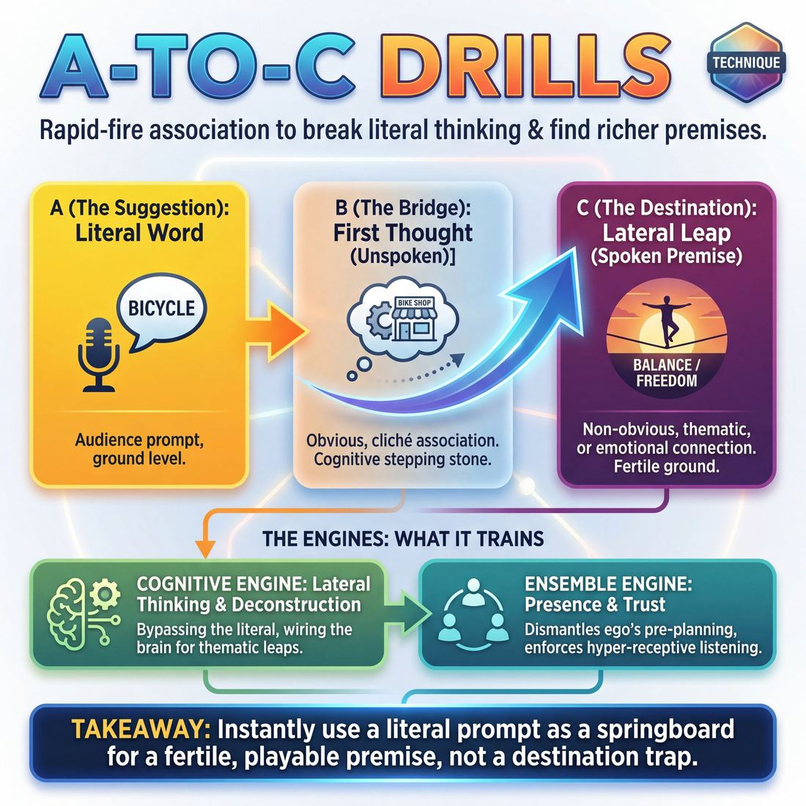

# 🎯 A-to-C drills

> *A drillable muscle that trains **Suggestion Deconstruction (A-to-C)**.*

{ .infographic }

## 🎯 The essence

An **A-to-C drill** is a rapid-fire association exercise designed to break improvisers out of literal, linear thinking. It trains a single, vital mental muscle: the ability to take a starting suggestion (the **"A"**), mentally bypass the most obvious, cliché first thought (the **"B"**), and leap to a richer, lateral, or thematic connection (the **"C"**). By forcing the brain to take one extra step away from the literal prompt, this drill teaches players how to mine a suggestion for its underlying premise, emotion, or philosophy, rather than just playing a scene about the word itself.

## 🎓 What it trains

At its core, this drill isolates and strengthens **Suggestion Deconstruction**—the cognitive muscle required to take a single word from the audience and spin it into a fertile, playable premise. 

When improvisers first step on stage, their brains are naturally wired for safety. If the audience suggests "Bicycle," the panic of the blank stage often drives a player to initiate a scene about riding a bike, fixing a flat tire, or shopping at a sporting goods store. This is the problem A-to-C drills exist to solve: the trap of the literal, first-degree association.

By forcing the brain to leap past the obvious, this technique trains improvisers in **lateral thinking**. It builds the habit of looking for thematic or emotional weight.

!!! abstract "The A-B-C Leap"
    *   **A (The Suggestion):** The literal word given by the audience. *(e.g., "Bicycle")*
    *   **B (The First Thought):** The most obvious, cliché association. Often a location or direct action. *(e.g., A bike shop, the Tour de France, a child taking off training wheels.)*
    *   **C (The Lateral Leap):** The non-obvious, thematic, or emotional connection. This is where rich scenes live. *(e.g., The feeling of finally balancing on your own; a parent realizing they are no longer needed; the concept of cyclical, exhausting effort.)*

Practicing this leap builds a crucial bridge in an improviser's development. A **Novice** will tunnel-vision on the literal "A," while an advanced beginner might brainstorm a few "B" ideas. But as this muscle develops, a **Competent** player learns to instinctively select the non-obvious "C" premise. Ultimately, a **Master** improviser can take *any* word, no matter how mundane, and instantly extract an angle that the entire ensemble can run with.

Beyond individual brain plasticity, A-to-C drills train the **Ensemble** domain. When a team practices deconstructing suggestions together, they learn the unique architecture of each other's minds. They discover how their teammates connect ideas, building the deep, subconscious trust required to surrender ego and weave a unified piece without pre-planning.

## 💡 Why it works

This drill works by hacking the brain’s default pattern-matching software. When an improviser hears a suggestion, their mind instantly reaches for the safest association. The A-to-C technique exploits that natural reflex, using it as a springboard rather than a destination.

Here is the engine under the hood:

*   **Bypassing the literal (The Cognitive Engine):** The brain naturally wants to go from A to B. If the suggestion is "Bicycle," the brain screams "Wheels!" By forcing the improviser to take one more step—associating off of "Wheels" to arrive at "C" (e.g., "Hamster," "Revolution," or "Cheese")—the drill uses the cliché as a disposable bridge. It trains the mind to arrive at a premise inspired by the suggestion, but not trapped by it.
*   **Lowering the stakes (The Emotional Engine):** Generating a strong scene premise on the spot is intimidating. By stripping away character, staging, and dialogue, this drill isolates the pure mechanics of **ideation**. It removes the pressure to "be funny" or "invent a scene," lowering the affective filter and allowing freer, weirder, and more authentic connections to emerge.
*   **Enforcing presence (The Ensemble Engine):** Because the drill moves rapidly around a circle, players cannot pre-plan their answers. You cannot know what your "A" will be until the person right before you speaks. This completely dismantles the ego's desire to script ahead, forcing improvisers into a state of hyper-receptive listening.

!!! abstract "The Disposable Bridge"
    The secret to A-to-C thinking is that the "B" step is never spoken on stage, but it is entirely necessary in the brain. The drill doesn't ask improvisers to *stop* having obvious thoughts; it simply trains them to accept those obvious thoughts and immediately use them as stepping stones to more fertile ground.

!!! example "The Cognitive Leap"
    *   **A (The Suggestion):** "Dentist"
    *   **B (The Bridge - unspoken):** "Teeth" or "Pain"
    *   **C (The Destination - spoken):** "Lying to authority figures" or "Medieval torture"
    
    The drill wires the brain to make this leap in a fraction of a second, moving a player from playing the literal suggestion to playing the richer premise.

## 🧩 The setup

Before diving into the mechanics, you need to establish a physical and mental environment that encourages rapid, unjudged thinking. Here is exactly what you need to get the room ready:

*   **Players & Arrangement:** 6 to 12 players standing in a circle. A circle removes hierarchy, keeps energy contained, and ensures everyone can clearly hear the spoken associations.
*   **Space & Materials:** An open room. No props or chairs are required. (A whiteboard can be useful for a visual breakdown if the group struggles to grasp the concept initially, but the drill itself is entirely verbal).
*   **Time:** 5 to 10 minutes total. A single round—where one initial word is explored by the entire circle—takes about 60 seconds. Keep the pace brisk to prevent overthinking.
*   **Roles:**
    *   **Facilitator:** Provides the initial suggestion and maintains the rhythm.
    *   **Players:** Receive the "A" word, silently generate the obvious "B" connection, and speak aloud the next associative leap ("C").
*   **Prerequisites:** Players should already be comfortable with basic, rapid-fire word association (A-to-B). If they are still freezing up on simple word association, drill that first before asking them to skip a step.

!!! quote "How to introduce it"
    "We are going to practice getting away from the most obvious idea, so we can find richer, more unique starting points for our scenes. 
    
    I am going to give the group a word—let's call it **'A'**. When you hear it, I want you to think of the very first thing that pops into your head. That is your **'B'**. 
    
    *Keep your 'B' a secret.* Do not say it out loud. Instead, think of what that secret 'B' word reminds you of. That is your **'C'**. 
    
    We will go around the circle. When it is your turn, just say your 'C' word out loud with confidence. Don't worry if it makes sense to anyone else—just trust your own brain's pathway."

!!! tip "On stage"
    As a facilitator, have a list of 5 to 10 evocative "A" words ready in your head before you start. Good starting words are tangible nouns with strong cultural associations (e.g., *Circus, Ocean, Wedding, Midnight, Kitchen*). Avoid abstract concepts (e.g., *Freedom, Justice*) for the first few rounds, as they tend to trap players in their heads.

## ⚙️ The mechanics

To build this muscle, the drill is typically run in two phases: a rapid-fire group chain to build the associative reflex, followed by a solo application to practice scene initiations.

### Phase 1: The Group Chain
This phase is run in a circle. The goal is pure speed and linear association, passing the baton from player to player.

1. **The Seed (A):** Player 1 provides a starting noun or concept (e.g., "Ocean").
2. **The Bridge (B):** Player 2 immediately says the first word that comes to mind based *only* on Player 1's word (e.g., "Salt").
3. **The Destination (C):** Player 3 says the first word that comes to mind based *only* on Player 2's word (e.g., "Pepper"). 
4. **The Reset:** Player 4 treats Player 3's word as a brand new **A**, and the cycle repeats (e.g., Player 4 hears "Pepper" and says "Sneeze").

!!! warning "Watch out: The Gravity of A"
    The most common error is letting the original suggestion pull you backward. If **A** is "Ocean" and **B** is "Salt", Player 3 might say "Shark". But "Shark" associates with Ocean, not Salt! Player 3 has just given another **B**. To truly hit **C**, Player 3 must associate *only* with "Salt" (e.g., "Margarita", "Wound", "Pepper").

### Phase 2: The Solo Initiation
Once the group understands the linear flow, the drill shifts to individual application. Here, a single player handles the entire A-to-C chain to launch a scene.

1. **The Suggestion (A):** The coach or a teammate gives the active player a single word.
2. **The Out-Loud Bridge (B):** The player states their obvious, literal association out loud. *(e.g., Suggestion is 'Lumberjack'. Player says: "Axe.")*
3. **The Out-Loud Destination (C):** The player states their second association out loud. *(Player says: "Body spray.")*
4. **The Initiation:** The player immediately steps forward and delivers a single line of dialogue or a physical action that initiates a scene based *entirely* on the **C** premise. *(Player mimes aggressively spraying themselves: "If I use the whole can, maybe Jessica will finally notice me in homeroom.")*

### Rules & Constraints
* **Speed over cleverness:** The **B** step must be a pure reflex. If a player pauses to calculate a "good" bridge, they are in their head. The magic of **C** comes from the friction of rapid, unfiltered association.
* **No defending the leap:** If a player's association makes no logical sense to the rest of the group, they should not stop to explain it. The drill moves forward relentlessly. 
* **Leave A behind:** Once the initiation happens, the original suggestion should not appear in the scene. If the suggestion was "Lumberjack" and the scene is about a middle-schooler wearing too much body spray, no one should walk on stage holding a chainsaw.

!!! tip "On stage"
    In a real performance, the **B** and **C** steps happen silently in your head in a fraction of a second. The audience gives you **A**, and you step out and initiate with **C**. They will marvel at your creativity, completely unaware of the invisible bridge you used to get there.

## 🎬 Sample round

!!! example "Sample round: The A-to-C Circle"
    The ensemble stands in a circle. The coach provides the initial suggestion to start the flow, and the players speak their internal associative steps out loud.

    **Coach:** "The suggestion is *Pineapple*." (**A** — The Suggestion)

    **Player 1:** "Pineapple makes me think of *Hawaii*." (**B** — The Obvious Association)

    **Player 2:** "Hawaii makes me think of *tourists wearing matching outfits*." (**C** — The Tangential Association)

    **Player 3:** *(Steps into the center to initiate a scene based only on C)* "Honey, I know we're at a funeral, but we bought these shirts as a set and we are going to get our money's worth."

    **Coach:** "Great. Notice how we aren't talking about fruit at all, but we have a strong comedic premise. Player 4, start a new chain. The word is *Telescope*."

    **Player 4:** "Telescope makes me think of *looking at the stars*." (**B**)

    **Player 5:** "Looking at the stars makes me think of *feeling incredibly small and insignificant*." (**C**)

    **Player 6:** *(Steps in)* "Look, I know you're breaking up with me, but in the grand scheme of the cosmos, does it really matter who left the garage door open?"

    **Coach:** "Excellent. The suggestion of 'telescope' gave us a scene about existential dread and avoiding responsibility. That is a perfect A-to-C."

## 🎚️ Variations & progressions

The beauty of the A-to-C drill is its elasticity. By tweaking the rules, you can scale it from a high-speed warm-up that bypasses the inner critic to a deliberate, theatrical tool for generating complex show openings. 

Here is how to ramp the difficulty as your ensemble matures:

**1. Out-Loud Math (For Novices & Adv. Beginners)**
Instead of hiding the connective tissue, the player says all three steps out loud: *"Apple leads to Tree, Tree leads to Family."* 
* **Why it works:** Novices often play the first, most obvious association, or they panic and say a completely random word. Forcing them to speak the "B" out loud allows the coach to hear their mental math and ensure they are actually taking two distinct associative steps. 

**2. The Silent "B" (For Competent Players)**
This is the standard baseline drill. Player 1 says "A". Player 2 thinks "B" in silence, and says "C". 
* **Why it works:** It trains players to confidently select a non-obvious premise without needing to explain how they got there. It builds trust that the audience will enjoy the leap.

**3. A-to-C Initiation (For Proficient Players)**
Instead of responding with a single "C" word, the receiving player responds with a complete, playable opening line of a scene based on their "C". 
* **Why it works:** It bridges the gap between a warm-up and actual scenework. Players learn to mine a suggestion not just for a clever word, but for its richest, most playable angle.

!!! example "In a scene: A-to-C Initiation"
    * **A (Suggestion given):** "Bicycle"
    * **B (Silent thought):** Training wheels
    * **C (The Initiation):** "I know you're thirty-five, son, but I'm not taking them off until you stop wobbling."

**4. Hub-and-Spoke / The Harold Brainstorm (For Masters)**
Instead of passing the word around a circle, the coach gives a single "A" word to the entire group. Going around the circle, *every* player must generate a completely different "C" premise from that exact same "A". 
* **Why it works:** This simulates a classic long-form opening. It forces the ensemble to look at a single suggestion from a dozen different angles (literal, thematic, emotional, historical). It trains the team to turn a single word into a diverse ecosystem of premises.

!!! tip "On stage: Speed vs. Depth"
    When coaching these progressions, actively toggle your constraints between **speed** and **depth**. 
    * **Fast rounds** force players to drop their ego and bypass the inner critic. 
    * **Slow rounds** give players permission to pause, breathe, and hunt for the *richest* "C" rather than just the *first* "C". Both muscles are required for great improv.

## 🧑‍🏫 Coaching notes

As a coach, your primary job during this drill is to act as a filter for the ensemble's instincts. You are guiding them away from the habit of playing the obvious association and toward the skill of selecting the non-obvious, playable premise. To do this, you must actively side-coach the rhythm, the leaps, and the justifications.

!!! tip "Coaching: The Golden Cue"
    **"Don't categorize it, react to it."**  
    When improvisers get stuck, they default to synonyms, categories, or literal definitions (e.g., *Ocean* $\rightarrow$ *Water*). Cue them to find an *experience*, an *emotion*, or a *theme* instead (e.g., *Ocean* $\rightarrow$ *Feeling small*). 

### Essential Side-Coaching Phrases

Keep the drill moving at a brisk pace to prevent over-intellectualizing, and use short, sharp interventions:

*   **"That's a B. Go one step further."** Use this when a player gives a purely literal or highly predictable association. Force them to take the thought they just had and leap again.
*   **"Walk me back."** Use this when a player gives an association that feels completely random (an "A-to-Z"). Make them articulate the missing "B" out loud. If they can explain the leap, it's a valid C. If they can't, they are just saying random words.
*   **"Faster. Trust the weird thought."** Use this when the rhythm drags. Hesitation usually means the player is judging their own ideas and trying to find the "perfect" C. 
*   **"Give me a point of view."** If the associations are too dry or noun-heavy, push the players to respond with opinions, phrases, or emotional states.

### Tuning Your Ear: What 'Good' Sounds Like

You will hear three types of responses during this drill. Here is how to identify them and how to react:

| The Suggestion (A) | What you hear | Diagnosis | Your Coaching Response |
| :--- | :--- | :--- | :--- |
| **"Mirror"** | "Reflection" | **The "B" (Too obvious)**. The player is just defining the object. | *"Too literal. What does a mirror make you feel?"* |
| **"Mirror"** | "Vampire" | **The "C" (The Sweet Spot)**. The hidden "B" is *reflections*, and vampires don't have them. It's a thematic leap. | *"Yes! Great leap. Next person, go!"* |
| **"Mirror"** | "Bicycle" | **The "Z" (Too random)**. There is no discernible connective tissue. | *"Hold. Walk me back. How did we get to bicycle?"* |

!!! note "The 'Aha!' Moment"
    A successful A-to-C leap should provoke a tiny "Aha!" from the rest of the room. It shouldn't be the first thing the ensemble thought of, but the moment it is said, everyone should instantly understand the connective tissue. When you hear that collective chuckle or nod of recognition, point it out: *"That right there—that's a C."*

## 🧭 Debrief & reflection

After the rapid-fire energy of an A-to-C drill, the debrief slows the room down to examine the cognitive leaps the ensemble just made. The goal is to move players from unconsciously blurting out words to consciously recognizing which leaps yield the richest scene premises.

To lock in the learning, ask the ensemble a few targeted questions:

*   **"Which 'C' made you immediately picture a scene?"** 
    This forces players to evaluate their associations for *playability*. It highlights the difference between a word that is merely distant, and a word that contains a relationship, emotion, or strong point of view.
*   **"Did anyone catch themselves getting stuck in a category?"** 
    This normalizes the common habit of lateral thinking (e.g., listing "Apple," "Banana," "Orange" instead of moving from "Apple" to "Teacher" to "Burnout"). 
*   **"Who can trace their exact path from A to B to C?"** 
    Having a player articulate their mental stepping stones demystifies the process for the rest of the room, proving that brilliant, non-obvious ideas come from a logical chain, not magic.
*   **"How did it feel to throw away your first idea?"** 
    This addresses the ego of improvisation. It asks players to reflect on the sensation of letting go of a perfectly good "B" to discover a more unique "C."

!!! tip "Coach's Ear: What to listen for"
    A successful debrief often surfaces a specific realization: *“I thought my first idea was the best, but when I forced myself to go one step further, the idea became much more fun to play.”* This marks the mental shift from playing the first obvious association to selecting the non-obvious premise.

A good debrief will naturally surface the distinction between **nouns** and **themes**. Players will begin to notice that when their "C" is a tangible object (like "spaceship"), it often leads to plot-heavy, inventive scenes. But when their "C" is a theme or human experience (like "isolation" or "bureaucracy"), it instantly provides an emotional core that the whole team can run with.

## ⚠️ Common pitfalls

!!! warning "Watch out: The A-to-B Rut vs. The A-to-Z Leap"
    The most common novice trap is failing to find the "C." Under pressure, beginners usually default to **A-to-B** (playing the first, most obvious association, like hearing "Ocean" and saying "Water"). Conversely, when pushed to be more creative, they often overcorrect into **A-to-Z** (saying something entirely random, like hearing "Ocean" and saying "Toaster"). A true "C" is neither obvious nor random—it is a distinct, traceable lateral step.

When running A-to-C drills, cognitive load is high. Players are trying to listen, process, associate, and speak in a rapid rhythm. Here is how the drill typically breaks down and how to fix it:

*   **The "Right Answer" Freeze**
    *   *The Trap:* A player’s eyes dart around the room, the rhythm dies, and they apologize. Their brain has locked up because they are judging their own ideas before speaking, trying to calculate the "perfect" C.
    *   *The Fix:* Lower the stakes. Remind the ensemble that this is a muscle-building exercise, not a performance. If a player freezes, tell them to just blurt out an A-to-B to keep the rhythm alive, then challenge them to push further on their next turn. 
*   **Showing the Math**
    *   *The Trap:* Instead of just delivering the final word, the player explains their mental journey: *"Okay, so 'Apple' makes me think of 'Tree', and trees are cut down by 'Lumberjacks', so... Lumberjack!"*
    *   *The Fix:* Enforce a strict "one word/phrase only" rule. The power of A-to-C lies in trusting the ensemble's intelligence to feel the connection without needing a roadmap. 
*   **The Synonym Loop**
    *   *The Trap:* The group gets stuck in a tight thematic cul-de-sac. *Car* leads to *Truck*, which leads to *Van*, which leads to *Bus*. They are just naming items in a category rather than taking lateral steps.
    *   *The Fix:* Stop the drill. Ask the players to shift their association from *what the thing is* to *how the thing feels*, *who uses it*, or *where it lives*. (e.g., *Car* $\rightarrow$ *Traffic Jam* $\rightarrow$ *Road Rage*).

!!! tip "The 'Traceable' Test"
    If you suspect a player has made an A-to-Z leap (pure randomness), pause and ask them: *"How did you get there?"* If they can explain the link in one or two logical steps, it's a brilliant C. If they shrug and say, *"I don't know, it just popped into my head,"* they have disconnected from the suggestion. Gently guide them back to the source word.

## 🌟 What mastery looks like

When an ensemble masters A-to-C drills, the exercise stops feeling like a frantic word-association test and transforms into an effortless premise-generation engine. The cognitive friction disappears, and the drill looks less like a mental puzzle and more like a shared, rhythmic meditation.

At the highest level of proficiency, a master improviser turns any word into a premise the whole team can run with. You can observe this mastery through several distinct behaviors:

*   **Thematic leaps over literal steps:** Instead of landing on another physical object, the master lands on a theme, an emotion, a relationship dynamic, or a philosophy. They move from the tangible to the playable.
*   **The invisible "B":** The intermediate step is processed so quickly that it becomes entirely subconscious. The player hears the suggestion and instantly outputs a rich, disconnected-yet-resonant idea.
*   **Self-evident playability:** When a master delivers their "C", you will physically see the rest of the ensemble nod or light up. The word or phrase offered is so evocative that it instantly sparks three different scene ideas in the minds of their teammates.
*   **Relaxed velocity:** There is no panic in their body language. They don't squint, stare at the ceiling, or stall with filler words. If the leap takes an extra second, they hold the silence with relaxed confidence until the right concept arrives.

| The Suggestion (A) | The Novice's "C" (Literal/Tangible) | The Master's "C" (Thematic/Playable) |
| :--- | :--- | :--- |
| **"Bicycle"** | "Helmet" *(A to Chain to Pedal to Helmet)* | **"Childhood freedom"** *(A to First Bike to Leaving the Neighborhood)* |
| **"Coffee"** | "Mug" *(A to Beans to Roaster to Mug)* | **"Corporate burnout"** *(A to Office to Overwork to Burnout)* |
| **"Ocean"** | "Sand" *(A to Waves to Beach to Sand)* | **"Fear of the unknown"** *(A to Deep Water to Monsters to Fear)* |

!!! abstract "The Ultimate Indicator"
    You know a team has mastered A-to-C deconstruction when they no longer need to explain their leaps. In early stages, a player might feel compelled to justify their "C" (*"I said 'Divorce' because 'Apple' made me think of 'Lawyer'..."*). A master simply drops the evocative "C" into the space, trusting that the exact logic doesn't matter—only the rich, playable inspiration it provides to the ensemble.

## 🔗 Why it matters

A-to-C drills are the foundational weightlifting for **Suggestion Deconstruction**. By forcing the brain past the literal and the immediate, improvisers build the cognitive flexibility to land on the thematic, emotional, or philosophical. This muscle ensures that a team isn't just reacting to a word, but mining it for its richest, most playable angle. 

In the context of **The Ensemble**, this technique is a vital tool for collective generation. When a group shares a rich web of "C" associations, they aren't relying on one person to pre-plan a clever premise. Instead, they create a shared pool of inspiration. It allows the ensemble to weave complex, non-obvious connections throughout a piece, surrendering individual ego to a broader thematic tapestry. 

!!! abstract "Thematic over Literal"
    The ultimate value of A-to-C thinking is that it frees improvisers from the burden of playing *about* the suggestion. If the suggestion is "Pineapple," a literal ("A") scene is about buying fruit. An A-to-C scene might explore the theme of being "prickly on the outside, sweet on the inside"—perhaps a scene about a tough biker gang adopting a stray kitten.

Furthermore, this drill rewires how improvisers listen. When you train yourself to hear the underlying concepts rather than just the surface words, you become a better scene partner. You begin to support the *idea* of a scene rather than just its plot. This associative agility is what allows long-form improvisation to feel magical, cohesive, and deeply resonant to an audience—moving a player from a novice who plays the first obvious association to a proficient improviser who gives exactly what the scene's theme is missing.

## 📚 References & Further Reading

### Foundational sources
*   **Matt Besser, Ian Roberts, Matt Walsh, *The Upright Citizens Brigade Comedy Improvisation Manual* (2013)** — The definitive text that codified the specific "A to C" terminology. The manual details exactly how to use this cognitive leap for pattern games, scene initiations, and avoiding literal, first-degree interpretations of audience suggestions. It is the primary source for learning how to use a suggestion as a springboard for a premise rather than the literal subject of the scene.
*   **Charna Halpern, Del Close, Kim "Howard" Johnson, *Truth in Comedy: The Manual of Improvisation* (1994)** — While predating the specific "A to C" phrasing, this book establishes the foundational "Pattern Game" and the associative group-mind thinking required to build a Harold. It introduces the concept of exploring the thematic weight of a suggestion rather than just playing the word itself.

### Practitioner guides & manuals
*   **Will Hines, *How to Be the Greatest Improviser on Earth* (2016)** — Expands heavily on the UCB philosophy. Hines specifically details how to use A-to-C thinking to navigate tricky or cliché suggestions, find the "bad idea," and make lateral leaps that lead to richer, more playable comedic premises. He emphasizes how this technique helps improvisers get out of their heads and stop pre-planning.
*   **Mick Napier, *Improvise: Scene from the Inside Out* (2004)** — Napier focuses heavily on the mechanics of spontaneous generation and bypassing the brain's natural hesitation. He offers solo exercises (such as rapid-fire object riffing and character relays) that build the exact associative muscles required to make A-to-C leaps without self-judgment, effectively lowering the improviser's affective filter.

### Lineage & teachers
*   **The Upright Citizens Brigade (UCB)** — The theater and training center most responsible for formalizing "A to C" as a core curriculum concept. UCB teaches this technique as the primary method for deconstructing suggestions in long-form improv, particularly for opening games where the ensemble must generate multiple distinct premises from a single word.
*   **iO Theater (formerly ImprovOlympic)** — The Chicago institution where Del Close developed the Harold. The associative pattern games and "group mind" exercises developed here are the direct ancestors of the modern A-to-C drill, teaching players to trust their subconscious connections.

### Research & theory
*   **Sarnoff A. Mednick, "The Associative Basis of the Creative Process" (*Psychological Review*, 1962)** — The foundational psychological paper proposing that creativity is essentially the ability to form remote associations. Mednick's theory—that highly creative people can easily connect seemingly unrelated nodes—is the exact cognitive mechanism trained by A-to-C drills. He also introduced the Remote Associates Test (RAT), which functions similarly to an A-to-C exercise.
*   **Edward de Bono, *The Use of Lateral Thinking* (1967)** — The text that introduced the concept of "lateral thinking." De Bono explains how to deliberately bypass vertical, logical, and obvious steps (the "B") to arrive at innovative, unexpected ideas (the "C"). His "provocation" techniques mirror the way improvisers use a suggestion as a disposable bridge rather than a final destination.
*   **Charles Limb & Allen Braun, "Neural Substrates of Spontaneous Musical Performance: An fMRI Study of Jazz Improvisation" (2008)** — A landmark neuroscience study demonstrating that during improvisation, the brain deactivates the dorsolateral prefrontal cortex (the inner critic and literal filter) and activates the medial prefrontal cortex (associated with self-expression). A-to-C drills are designed to force this exact neurological shift by moving too fast for the inner critic to engage.

### Talks, videos & courses
*   **Charles Limb, *Your Brain on Improv* (TED Talk, 2010)** — A highly accessible, engaging breakdown of Limb's fMRI research. This talk explains how the brain's pattern-matching and filtering systems change when forced to generate ideas spontaneously, providing the scientific "why" behind rapid-fire association drills and the necessity of bypassing the brain's default safety mechanisms.

## 💬 Quotes & Anecdotes

!!! quote "— Matt Besser, Ian Roberts, and Matt Walsh, *The Upright Citizens Brigade Comedy Improvisation Manual* (2013)"
    If [a suggestion] is the A, the improviser went right to their B, or first thought. When you go from A to B, you often end up just listing synonyms for the suggestion or a subset of elements that belong in the category represented by the suggestion…. Making these A to B moves is natural. The way you can learn to make less obvious moves is to manually go through the process of 'going A to C.'

!!! quote "— Matt Besser, Ian Roberts, and Matt Walsh, *The Upright Citizens Brigade Comedy Improvisation Manual* (2013)"
    Hearing 'sand' might first make you think of 'rock.' … Forcing yourself to go from A to C means not saying 'rock,' but instead going to your next thought. … So, 'sand' was A, 'rock' was B, and 'Rolling Stones' was C. When you manually go A to C, you keep your B in your head and say your C out loud.

### Where it comes from
The concept of "A to C" thinking was codified by the Upright Citizens Brigade (Matt Besser, Amy Poehler, Ian Roberts, and Matt Walsh) in the late 1990s as they developed their curriculum in New York City, and it was later formalized in their 2013 *Comedy Improvisation Manual*. While earlier improv philosophies (like those of Del Close) encouraged players to avoid literal interpretations of suggestions, UCB gave the cognitive process a specific, drillable name. It was designed to solve a persistent problem in long-form improv: scenes that merely demonstrated the audience's suggestion rather than using it as inspiration for a unique, playable premise.

### A telling example

**The "Tulips" Leap (Illustrative Scenario)**
To understand how A-to-C thinking transforms a scene, consider a common trap improvisers face when asking the audience for a word. 

If the audience shouts **"Tulips"** (the A), a nervous improviser's first instinct is to play a florist or a gardener (the B). If they initiate from this "B" space, the scene is immediately predictable to the audience—it is exactly what everyone in the room pictured when the word was yelled. 

However, if the improviser uses A-to-C thinking, they keep "florist" in their head, and ask themselves what a florist reminds them of. They might think of Valentine's Day, or a frantic last-minute apology (the C). Alternatively, "Tulips" (A) might make them think of the song "Tiptoe Through the Tulips" (B), which makes them think of a creepy haunted house (C). 

By initiating a scene about a husband desperately trying to buy a gas station gift to save his marriage, or two ghost hunters tiptoeing through a dark hallway, the improviser has successfully used the suggestion without being trapped by it. The "B" is the disposable bridge that gets them to a richer, unexpected "C."

**Ian Roberts' "The Flash"**
UCB co-founder Ian Roberts often teaches a variation of A-to-C thinking called "The Flash." When an improviser hears a suggestion, rather than trying to invent a clever fictional leap, they are instructed to notice the very first specific, real-life memory that flashes into their mind (the B), and then initiate a scene based on the *feeling* or *dynamic* of that memory (the C). For example, if the suggestion is "Ice Cream," the improviser might flash to a memory of their father dropping a cone and swearing loudly. The resulting scene isn't about an ice cream parlor; it's about a father trying and failing to maintain his composure in front of his children.

## 🧭 Explore the framework

- ⬆️ **Skill it trains:** [Suggestion Deconstruction (A-to-C)](04_S3__suggestion-deconstruction-a-to-c.md)
- 🎭 **Domain:** [The Ensemble](04_D__the-ensemble.md)
- 🔁 **Sibling techniques:** [Premise brainstorm rounds](04_S3_T2__premise-brainstorm-rounds.md), [What's interesting about this? mining](04_S3_T3__what-s-interesting-about-this-mining.md)
