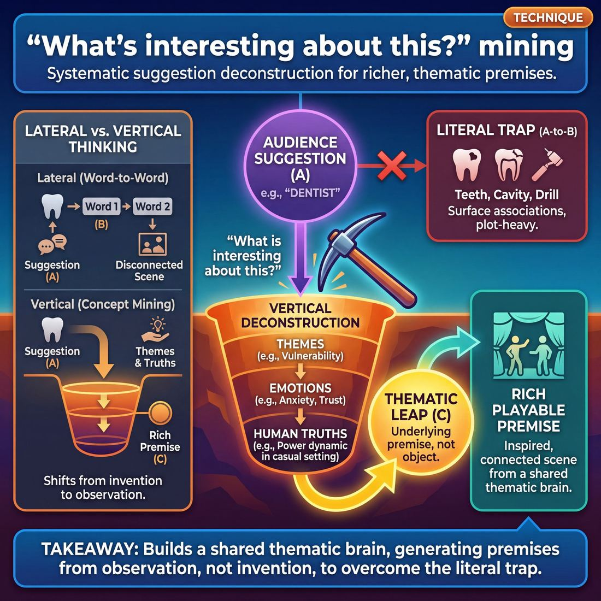

# 🎯 What's interesting about this? mining

> *A drillable muscle that trains **Suggestion Deconstruction (A-to-C)**.*

{ .infographic }

## 🎯 The essence

**"What's interesting about this?" mining** is a rapid-fire ensemble exercise where players take a single audience suggestion and systematically unpack it by repeatedly asking, *"What is interesting about this?"* Rather than settling for the first literal association (the "A"), players practice the specific muscle of **Suggestion Deconstruction**—mining a word for its underlying themes, emotional resonances, and non-obvious connections (the "C"). It trains the cast to look past the surface of a simple noun and collaboratively extract the richest, most playable premises hidden inside before a scene ever begins.

## 🎓 What it trains

At its core, this technique isolates and drills the cognitive leap known as **A-to-C thinking**. 

When given a suggestion like "Dentist," a novice improviser will often play the first, most obvious association: a literal scene about a teeth cleaning. An advanced beginner might brainstorm related words—"floss," "waiting room," "cavity"—but still end up in predictable, plot-heavy scenes. This is the "literal trap." 

"What's interesting about this?" mining solves this problem by forcing the improviser to stop word-associating and start *concept-mining*. It builds the mental muscle to look at a mundane word and extract its underlying themes, emotional dynamics, or philosophical quirks. You aren't looking for what the object *is*; you are looking for what the object *represents*.

Practicing this technique trains three specific abilities:

*   **Thematic extraction:** Finding the human element inside an object (e.g., "A dentist appointment is about the vulnerability of having someone's hands in your mouth while they ask questions you can't answer").
*   **Premise generation:** Translating a theme into a playable dynamic (e.g., "Let's play a scene about a power dynamic where one person is literally unable to defend themselves in a casual conversation").
*   **Patience:** Training the brain to bypass the easy, obvious joke in favor of selecting the non-obvious premise and mining it for its richest angle.

!!! abstract "A-to-C Thinking"
    In improv terminology, **A** is the suggestion, **B** is the literal association, and **C** is the thematic leap. 
    
    *   **A (Suggestion):** "Dentist"
    *   **B (Obvious):** Teeth, drills, cavities.
    *   **C (Interesting):** The vulnerability of having someone's hands in your mouth while they ask you casual questions you can't answer.
    
    This technique trains the brain to skip B and jump straight to C.

Ultimately, this drill serves the ensemble. By asking what is genuinely interesting about a suggestion, improvisers learn to generate material that is *inspired* by the prompt rather than constrained by it. It bridges the gap between a random audience shout-out and a deeply woven, thematic show.

## 💡 Why it works

This technique works by shifting the improviser’s brain from **invention** to **observation**. 

When a team receives a suggestion, the immediate cognitive reflex is often panic: the pressure to instantly invent a clever, funny, or highly original leap. Asking the simple question, *"What is interesting about this?"* short-circuits that panic. It gives the brain a highly specific, analytical task that relies on lived experience rather than comedic invention. You no longer have to be funny; you just have to be observant.

This exploits a fundamental shift in how we process ideas, moving the ensemble from **lateral thinking** to **vertical thinking**.

*   **Lateral thinking (A-to-B-to-C):** Jumps from word to word. It often leads the team so far away from the suggestion that the resulting scenes feel disconnected, or it strands the players with a list of nouns (props and locations) rather than actual scene ideas.
*   **Vertical thinking (Mining):** Digs straight down into the suggestion itself. It unpacks the inherent ironies, human behaviors, rules, and philosophies attached to the word. 

| Approach | The Suggestion | The Thought Process | The Resulting Scene |
| :--- | :--- | :--- | :--- |
| **Lateral (Word Association)** | *Bicycle* | Bicycle ➡️ Wheels ➡️ Car ➡️ Traffic ➡️ Road rage. | Two people yelling in traffic. (The original suggestion is lost). |
| **Vertical (Mining)** | *Bicycle* | *What's interesting?* You never forget how to ride one. It's permanent muscle memory. | A retired assassin whose body automatically reacts to threats while trying to bake a cake. (A rich, playable premise). |

By forcing the brain to articulate *why* something is interesting, the technique automatically generates **premises instead of props**. A noun ("bicycle") only gives you an object to mime. An observation ("you never forget how to ride one") gives you a behavioral dynamic, a relationship, or a philosophy to play. 

!!! abstract "The Group Dynamic Engine"
    When an ensemble mines a suggestion together, they are doing more than generating ideas—they are building a **shared thematic brain**. By discussing what is weird, true, or fascinating about a topic, the team aligns their point of view before anyone steps forward. This shared understanding allows players to support each other invisibly (a Stage 4 maturity skill), because everyone is operating from the exact same thematic playbook.

## 🧩 The setup

*   **Players & Arrangement:** Full ensemble (typically 6–12 players). Arrange the group in a semi-circle facing the facilitator so everyone can see the board and hear each other clearly.
*   **Space & Materials:** A whiteboard, chalkboard, or large easel pad with markers. While this can be done purely verbally, visually mapping the web of ideas is highly recommended so players can see the deconstruction unfold.
*   **Time:** 3–5 minutes per suggestion. Plan for 15–20 minutes total to allow the group to mine 3 to 4 different words.
*   **Roles:** 
    *   **The Facilitator:** Acts as the scribe and the inquisitor. They write the initial suggestion in the center of the board, repeatedly ask "What's interesting about this?", and map the group's answers.
    *   **The Players:** Act as the "miners." They pitch facts, mechanics, cultural associations, emotional themes, and specific angles related to the word.
*   **Prerequisites:** Players should already be comfortable with basic word association (A-to-B) and understand the difference between a literal suggestion and a thematic premise.

!!! tip "Make it visual"
    Using a whiteboard isn't just for the facilitator's benefit. Seeing the words written down prevents the ensemble from looping back to the same obvious ideas. It visually demonstrates how a single, simple word (the "A") can branch out into a massive web of non-obvious, highly playable premises (the "C").

!!! quote "Facilitator Script"
    "We are going to take a single audience suggestion and squeeze every drop of inspiration out of it before we ever step foot in a scene. I’m going to write a word on the board. Instead of just giving me the first literal thing you think of, I want you to tell me *what is interesting about it*. 
    
    What are the mechanics of it? Who uses it? What are the emotions, stereotypes, or themes attached to it? We aren't pitching scenes or characters yet; we are mining for the raw, thematic materials that make great scenes. I'll keep asking 'What else?' and 'What's interesting about that?' until the board is full."

## ⚙️ The mechanics

!!! abstract "The Core Loop"
    The objective of this technique is to systematically bridge the gap between a flat, literal suggestion and a rich, **Playable Premise**. The ensemble works together to strip away the obvious, interrogate the core concept, and extract a thematic or character-driven angle that can fuel a scene.

The exercise is typically run in a circle or a loose line across the stage. It follows a strict, five-step progression that forces players to bypass their first instincts and dig deeper.

**1. The Drop**  
The coach or a designated player provides a single, random noun or concept (e.g., "Mirrors"). 

**2. The Purge (A-Level)**  
Players immediately call out the most obvious, literal associations. This is the "A" in A-to-C deconstruction. The goal here is not to be clever, but to empty the brain of the low-hanging fruit so the team doesn't accidentally play it later.  
*Players might say: "Reflections," "Glass," "Vanity," "Funhouse."*

**3. The Pivot**  
Once the obvious associations slow down (usually after 5–10 seconds), a player verbally asks the pivot question: *"What's interesting about [Suggestion]?"* To mine effectively, players can use specific variations of this question to crack the concept open:
*   **The Character Pivot:** "What kind of person cares *too much* about this?"
*   **The Philosophical Pivot:** "What is the worldview or philosophy behind this?"
*   **The Emotional Pivot:** "What is the hidden tragedy or joy of this?"
*   **The Metaphorical Pivot:** "What does this represent in society?"

**4. The Mining (C-Level)**  
The ensemble answers the pivot question, building on each other's ideas. They are no longer naming objects; they are stating opinions, behaviors, and dynamics. This is the "C-Level"—the non-obvious, highly playable leap.  
*Players might say: "It's interesting how we only trust mirrors, but never photographs of ourselves." ➡️ "Yeah, the delusion of controlling your own image." ➡️ "People who practice their apologies in the mirror."*

**5. The Launch**  
The moment a rich, specific premise is spoken, the mining stops. Two players immediately step forward and initiate a scene based *entirely* on that final premise. 

!!! example "In the circle"
    **Coach:** "The suggestion is *Lawnmower*."  
    **Player 1:** "Grass."  
    **Player 2:** "Gasoline."  
    **Player 3:** "Dad's chores." *(The Purge ends)*  
    **Player 4:** "What's interesting about dad's chores?" *(The Pivot)*  
    **Player 1:** "It's the one time nobody is allowed to bother him."  
    **Player 2:** "Yeah, it's weaponized productivity. You can't be mad at him because he's 'working,' but he's really just hiding." *(The Mine)*  
    **Player 3:** *(Steps out to initiate)* "Honey, I know the kitchen is on fire, but I simply must edge the driveway right now." *(The Launch)*

### Rules & Constraints

*   **No literal scenes:** Once the scene launches, the original suggestion (e.g., the lawnmower) should ideally never appear or be mentioned. The scene is about the *mined premise* (weaponized productivity / hiding from family chaos).
*   **Yes, And the Deconstruction:** Players must listen to the mining phase just as closely as a scene. If someone introduces a philosophical angle, the next player should heighten that angle, not pivot back to a literal association.
*   **The 30-Second Clock:** The entire process from "The Drop" to "The Launch" should take no more than 30 seconds. Mining is a quick, surgical strike, not a meandering philosophical debate. 

!!! warning "Watch out"
    A common trap is **The Infinite Mine**. Players get so caught up in sounding clever during the discussion phase that they forget they are supposed to be generating a scene. The moment a premise makes the ensemble laugh or nod in recognition, stop talking and start playing.

## 🎬 Sample round

!!! example "Sample round: Mining 'Umbrella'"
    Here is how a team moves a single-word suggestion through the mechanics of the exercise, transforming a static noun into a dynamic scene initiation.
    
    **Coach:** "Your suggestion is *Umbrella*."

    **Player A:** "Rain. Mary Poppins. Bad luck to open indoors."  
    *(Mechanic: The Purge. The team deliberately gets the immediate, obvious A-to-B associations out of their system so they don't default to them on stage.)*

    **Player B:** "What's interesting about an umbrella is that it's a completely socially acceptable way to take up way too much space on a crowded sidewalk."  
    *(Mechanic: The Pivot. Player B asks the core question and finds a human behavior, a relatable truth, or a specific point of view, rather than just another noun.)*

    **Player C:** "Yes! And people play this weird game of 'umbrella chicken' where they have to raise or lower theirs to pass each other, but no one wants to be the one who yields."  
    *(Mechanic: The Expansion. Player C 'Yes, Ands' the interesting truth, adding stakes and a relational dynamic.)*

    **Player A:** "So the playable premise is: Two incredibly stubborn, status-obsessed commuters refusing to adjust their umbrella heights on a narrow bridge."  
    *(Mechanic: The Premise Pitch. The team has successfully mined a simple noun into a rich, character-driven A-to-C scene initiation.)*

Notice how the final premise doesn't actually require a physical umbrella to be the focus of the scene. The umbrella was simply the vehicle used to discover the **behavior** (stubbornness and status). By asking "What's interesting about this?", the team bypassed a generic scene about getting wet and instead found a scene about human ego.

## 🎚️ Variations & progressions

To build the muscle of Suggestion Deconstruction, this technique can be slowed down for deliberate, analytical practice, or sped up to match the instantaneous demands of a live show. 

Here is how to ramp the difficulty as your ensemble progresses through the stages of maturity.

### 1. The "Fact & Feeling" Split (Novice to Adv. Beginner)
When players are stuck at **Stage 1** (playing the first, most obvious association), they often struggle to answer "What's interesting?" without just listing synonyms. 
*   **The Tweak:** Divide a whiteboard into two columns: *Literal Facts* and *Human Feelings*. 
*   **How it works:** If the suggestion is "Bicycle," the facts might be "two wheels, requires balance, chain grease." The feelings might be "childhood freedom, fear of falling, spandex-clad arrogance." This forces **Stage 2** players to generate a wider brainstorm and separates the physical object from the emotional themes it evokes.

### 2. The "Who Cares?" Filter (Competent)
Once players can generate interesting observations, they must learn to translate them into action. This variation helps **Stage 3** players select the non-obvious ("C") premise by grounding it in character.
*   **The Tweak:** Instead of asking "What is interesting about this object?", ask "Who finds this object incredibly interesting?" or "Who is deeply threatened by this?"
*   **How it works:** An abstract observation about a "Lighthouse" (it's isolating) immediately becomes a playable relationship: two people who are desperate for company but completely lack social skills.

!!! tip "On stage"
    The "Who Cares?" filter is your best friend in a live show. If the suggestion is "Spreadsheet," don't play a scene *about* a spreadsheet. Ask yourself who cares about spreadsheets (a micromanager planning a casual family picnic) and play *them*.

### 3. "If This, Then What?" Chaining (Proficient)
This variation pushes **Stage 4** players to mine a suggestion for its richest, most playable angle by forcing them to pitch the actual scene initiation.
*   **The Tweak:** The player must state the interesting observation, followed immediately by an opening line or action that proves it.
*   **How it works:** "What's interesting about a *waiting room* is the forced intimacy with strangers. *If that's true*, I'm going to sit right next to the only other person in the room and say, 'So, do you think my rash looks contagious?'"

### 4. Silent / Instant Mining (Master)
At **Stage 5**, the ensemble must be able to turn any word into a premise the whole team can run with, without the luxury of a verbal brainstorm.
*   **The Tweak:** The coach gives a suggestion. The team has exactly three seconds of silence to internally ask "What's interesting about this?" Then, a player must step out and initiate.
*   **How it works:** There is no discussion. The team must rely on their shared **Peripheral Awareness** to recognize the thematic angle the initiator has chosen, instantly dropping the literal suggestion to support the deeper premise.

!!! example "In a scene"
    **Suggestion:** "Toothbrush"  
    *(Three seconds of silence. Player A steps out, miming holding a tiny object, looking devastated.)*  
    **Player A:** "You left this here. Does this mean we're... official?"  
    *(Player A mined the suggestion for the theme of 'commitment and boundaries' rather than just brushing teeth.)*

## 🧑‍🏫 Coaching notes

When coaching this technique, your primary goal is to move the ensemble out of their logical, trivia-retrieval brains and into their theatrical, human-behavior brains. You are listening for the leap from a dry fact to a **playable premise**.

!!! tip "Coaching"
    **"Who cares about this?"**  
    This is your single most powerful side-coach. When a player offers a dry fact (e.g., "A compass always points north"), ask them who cares about that fact, or how that fact translates into a human relationship. The answer shifts the focus from an object to a behavior (e.g., "Someone who is rigidly obsessed with always being right, no matter the context").

**Effective Side-Coaching Cues**  
Use these prompts in the moment to keep the momentum going and steer the ensemble toward richer territory:

*   **"Make it personal."** – Forces the improviser to connect the concept to an emotion or a specific type of character.
*   **"What is the opposite of that?"** – Great for breaking a chain of overly similar, agreeable associations.
*   **"If this object were a roommate, what would they be like?"** – Instantly anthropomorphizes a lifeless suggestion into a playable dynamic.
*   **"Give me a strong opinion about [Suggestion]."** – Bypasses neutral facts and generates immediate comedic or dramatic friction.

**What 'Good' Sounds Like**  
You will know the technique is clicking when the ensemble's answers stop sounding like Wikipedia entries and start sounding like scene initiations. You are guiding them from Stage 1 (the most obvious association) to Stage 4 (the richest, most playable angle).

| Suggestion | The "Trivia" Answer (Push them further) | The "Mined" Answer (Ready to play) |
| :--- | :--- | :--- |
| **Coffee** | "It has caffeine and wakes you up." | "It's a socially acceptable way to mask crippling exhaustion." |
| **Mirrors** | "They are made of glass and silver." | "They force us to confront the fact that we are aging." |
| **Bridges** | "They connect two pieces of land." | "They require immense trust in engineers you will never meet." |

!!! note "Pacing the Drill"
    Keep the rhythm brisk. If the group gets stuck on a suggestion, don't let them agonize in silence. Count down from three, and if nothing emerges, enthusiastically call out, *"New word!"* This reinforces that the goal is fluid generation and ensemble mind-meld, not finding the "perfect" philosophical answer.

## 🧭 Debrief & reflection

After the rapid-fire energy of the exercise, the debrief is where the intellectual muscle of Suggestion Deconstruction is actually built. The goal is to shift players from simply generating ideas to evaluating their *playability*. 

Use these questions to guide the post-round conversation:

*   **"Which specific idea made you immediately want to step on stage?"**
    *   *What it surfaces:* The difference between a clever intellectual connection and a rich, playable premise. Players will quickly realize that emotional, relational, or thematic angles (the "C" ideas) spark scenes much faster than literal facts (the "A" ideas).
*   **"At what point did we leave the literal suggestion behind?"**
    *   *What it surfaces:* The exact moment the group transitioned from obvious, first-thought associations to non-obvious premises. It helps players map the A-to-C journey in retrospect, making the pathway repeatable.
*   **"Did we get stuck on any 'clever but dead' ideas?"**
    *   *What it surfaces:* The trap of generating jokes instead of platforms. A joke is a closed loop that leaves you with nowhere to go; a premise is an open door that invites action.
*   **"How did it feel when someone else articulated the exact angle you were circling?"**
    *   *What it surfaces:* The power of the **Ensemble** mind. It reinforces that suggestion mining is a collective effort, not an individual race to be the smartest person in the room.

!!! abstract "The Key Takeaway"
    A successful debrief moves the ensemble from thinking, *"Look how many ideas we had,"* to realizing, *"Look how much depth was hiding inside that single word."* Players should walk away understanding that the richest scenes live in the thematic and emotional resonance of a suggestion, not its dictionary definition.

!!! tip "On stage application"
    Ask the team to recall the physical feeling of hitting a truly great premise during the drill. That sudden rush of collective energy—the "Ooh, I want to play that!" feeling—is exactly what they should be hunting for when they step out to initiate a scene in a real show.

## ⚠️ Common pitfalls

!!! warning "Watch out: The Wikipedia Trap"
    The single most common novice mistake is confusing "mining" with "defining." When asked what is interesting about a suggestion like *submarine*, a player under cognitive load will often just list dry facts: "It goes underwater," "It has a periscope," "It's made of metal." This yields zero playable premises. 
    
    **The fix:** Shift the focus from the *object* to *human behavior* or *theme*. Instead of stating facts, ask: "What kind of person chooses to live in a metal tube underwater?" or "What's interesting about being trapped with your coworkers for six months?"

When improvisers first learn to deconstruct a suggestion, the cognitive load of analyzing an idea while standing in front of an audience often triggers a few predictable failure modes. Here is how the technique breaks down and how to course-correct:

*   **Shallow Word Association (The A-to-B Trap)**  
    Novices naturally gravitate toward the first, most obvious association. If the suggestion is *Coffee*, they say *Starbucks* or *Caffeine*. This is a lateral step, not a deep dive. 
    *   **The fix:** Push for the "C" connection. Force the ensemble to ask *why* that association matters. "What's interesting about caffeine? It's a socially acceptable addiction that makes us jittery and hyper-productive." Now you have a theme to play.

*   **The Philosophical Rabbit Hole**  
    Sometimes, a team will find a genuinely interesting theme but get stuck talking *about* it. They intellectualize the concept ("It's fascinating how society demands constant output...") until the energy dies, leaving them with a thesis statement instead of a scene.
    *   **The fix:** Ground the philosophy in immediate action. As soon as the abstract idea is named, a player should ask, "Who is doing this right now?" or "Where does this happen?" Turn the thesis into a playable premise (a specific who/where/what that can be acted out).

*   **The Solo Miner**  
    Under pressure, one confident player might try to do all the heavy lifting, pitching a fully formed, complex premise while the rest of the ensemble watches passively. This defeats the purpose of group deconstruction and leaves the team disconnected.
    *   **The fix:** Treat mining as a strict "Yes, And" exercise. Coach players to build on the *last* interesting thing said, rather than returning to the original suggestion. 

!!! example "In a scene: Shallow vs. Deep Mining"
    **Suggestion:** *Mirror*
    
    **Shallow (Novice):** "Reflection." "Glass." "Brushing your teeth." *(Result: A literal scene about brushing teeth in a bathroom.)*
    
    **Deep (Competent):** "It's interesting that we only ever see a flipped version of ourselves." ➡️ "Yeah, we never see what other people actually see." ➡️ "What if someone was obsessed with finding out what they *really* look like to others?" *(Result: A character-driven scene about vanity and perception.)*

## 🌟 What mastery looks like

At the highest level of practice, "What's interesting about this?" ceases to be a mechanical brainstorming drill and becomes a shared, instantaneous lens for viewing the world. A master ensemble doesn't just find a clever, non-obvious connection; they can take *any* word—no matter how mundane—and mine it into a rich, thematic premise that the entire team can immediately run with.

When observing a master-level group execute this technique, you will notice several distinct behaviors:

*   **Thematic over literal:** They bypass the physical properties of the suggestion entirely. Instead of seeing objects or locations, they extract human behaviors, societal norms, philosophies, or emotional metaphors. 
*   **Frictionless consensus:** The group does not pitch competing ideas or argue over which angle is best. They listen deeply to each other's mining. When someone articulates the richest, most playable angle, the whole team recognizes the spark and organically aligns behind it.
*   **Immediate playability:** The insights generated aren't just intellectually stimulating—they are active. The mined ideas instantly suggest character dynamics, emotional stakes, or specific stage pictures.

!!! example "In the room: Mining 'Toothbrush'"
    *   **Novice (The "A" association):** "Dentists, cavities, mint toothpaste."
    *   **Competent (The "C" association):** "The bristles wear out over time. Let's do a scene about feeling worn down by a repetitive job."
    *   **Master (The playable theme):** "What's interesting about a toothbrush is that it's an incredibly intimate object we put in our mouths every day, but the moment it accidentally touches someone else's toothbrush in the cup, it feels completely contaminated and ruined. Let's play a scene about a couple where one person is overly precious about their boundaries being slightly crossed, and the other is oblivious."

!!! abstract "The Ultimate Goal"
    Mastery of this technique reflects a complete surrender of ego to the piece. The improviser isn't trying to prove they are the smartest person in the room by having the most obscure take. Instead, they are acting in pure service to the ensemble, transforming a single word into a catalyst that makes the upcoming scenes effortless for everyone to play.

## 🔗 Why it matters

At its core, asking "What's interesting about this?" is the engine of Suggestion Deconstruction. A raw suggestion from the audience is rarely a scene in itself; it is usually just a noun, a location, or an occupation. This technique forces improvisers to stop looking for mere word associations and start looking for *premises*. It trains the brain to extract the emotional core, the irony, or the inherent dynamic of a word, moving a player from simply playing the most obvious association (Stage 1) to mining a suggestion for its richest, most playable angle (Stage 4).

!!! abstract "Lateral vs. Vertical Deconstruction"
    As a final reminder, traditional A-to-C word association is often *lateral*: moving sideways from "Apple" to "Tree" to "Lumberjack." Mining is *vertical*: digging down into "Apple" to find "the temptation of forbidden knowledge," "the arrogance of tech culture," or "the disappointment of a bruised lunchbox snack." Vertical mining yields stronger, more specific scenes.

For the ensemble, this technique is a profound exercise in surrendering ego to the piece. When a team mines a suggestion together, no single player owns the resulting premise. The group perceives, generates, and weaves ideas collectively without pre-planning. By the time the first scene begins, the entire cast shares a unified thematic vocabulary. They aren't just doing scenes *near* each other; they are exploring a shared thesis, which allows for seamless, off-focus support later in the show.

Beyond the opening of a performance, this muscle is foundational to the wider craft of improvisation. The habit of asking "What is interesting about this?" is exactly how improvisers discover the **Game of the Scene**. Whether it is an audience suggestion, a scene partner's unusual line delivery, or an accidental stumble on stage, this technique trains the improviser to treat everything as a clue waiting to be unpacked. It shifts the performer's mindset from the exhausting *"What can I invent next?"* to the sustainable *"What is already here, waiting to be explored?"*

## 📚 References & Further Reading

### Foundational sources
*   **Charna Halpern, Del Close, and Kim "Howard" Johnson, *Truth in Comedy: The Manual of Improvisation* (Meriwether Publishing, 1994)** — Introduces the "Pattern Game" and the Harold opening, which are the foundational ensemble exercises for deconstructing a single suggestion into a web of themes, philosophies, and associations rather than literal scenes.
*   **Matt Besser, Ian Roberts, and Matt Walsh, *The Upright Citizens Brigade Comedy Improvisation Manual* (Comedy Council of Nicea, 2013)** — Explicitly codifies "A-to-C thinking" and premise generation, detailing exactly how improvisers can pull a thematic core or "unusual thing" from a suggestion instead of playing the obvious "B" association.

### Practitioner guides & manuals
*   **Will Hines, *How to Be the Greatest Improviser on Earth* (Pretty Great Publishing, 2016)** — Provides highly practical advice and exercises for premise generation, A-to-C thinking, and bypassing the "literal trap" of audience suggestions to find playable comedic dynamics.
*   **Mick Napier, *Improvise: Scene from the Inside Out* (Heinemann Drama, 2004)** — Addresses the psychological pressure of the audience suggestion, offering strategies for how improvisers can use a prompt as a springboard for genuine inspiration rather than a rigid, literal constraint.
*   **Billy Merritt and Will Hines, *Pirate Robot Ninja: An Improv Fable* (Pretty Great Publishing, 2017)** — Explores different cognitive styles of improvisers (the analytical "Robot," the fearless "Pirate," the synthesizing "Ninja") and how each processes information and suggestions to build a shared thematic brain.

### Lineage & teachers
*   **iO Theater (formerly ImprovOlympic)** — The Chicago institution where Del Close and Charna Halpern developed the Harold, training generations of ensembles to deconstruct suggestions collectively before initiating scenes.
*   **Upright Citizens Brigade (UCB)** — The theater and training center that popularized the specific terminology of "A-to-C thinking" and premise-based improvisation, shifting the focus to mining a suggestion for a playable comedic game.
*   **Armando Diaz, *The Armando Diaz Experience* (1995)** — Creator of the "Armando" long-form format, which uses true, grounded monologues to deconstruct a suggestion into themes, acting as a verbal mining exercise that fuels the ensemble's scenes.
*   **Miles Stroth, *The Deconstruction* (1990s)** — *(unverified)* Founder of the Pack Theater and creator of the "Deconstruction" form, which specifically focuses on taking a single source scene or suggestion and systematically mining it for thematic and character-driven tangents.

### Research & theory
*   **Edward de Bono, *Lateral Thinking: Creativity Step by Step* (Harper Colophon, 1970)** — Coined the terms "lateral" and "vertical" thinking, providing the psychological framework for how improvisers shift from jumping between disconnected words (lateral) to digging deeply into the inherent themes of a single concept (vertical).
*   **Charles J. Limb and Allen R. Braun, *Neural Substrates of Spontaneous Musical Performance* (PLOS One, 2008)** — A foundational neuroscience study showing that improvisation requires deactivating the brain's self-monitoring centers (the dorsolateral prefrontal cortex). This explains why structured mining exercises help bypass the panic of instant invention by giving the brain an analytical task.
*   **R. Keith Sawyer, *Group Genius: The Creative Power of Collaboration* (Basic Books, 2007)** — Examines the psychology of ensemble creativity, explaining how a "shared thematic brain" is built through collaborative observation and how group flow emerges when participants align their point of view.

### Talks, videos & courses
*   **UCB Training Center, *Improv 301/401 Curriculum* (Ongoing)** — The specific levels in the UCB curriculum dedicated to the Harold, premise generation, and pulling thematic ideas from an opening deconstruction.
*   **Will Hines, *Improv Nonsense* (Blog/Podcast, Ongoing)** — *(unverified)* An extensive, ongoing collection of essays and audio discussions by Hines that frequently breaks down the mechanics of A-to-C thinking, premise generation, and how to avoid literal scene initiations.
*   **Matt Besser, *Improv4Humans* (Earwolf Network, Ongoing)** — A masterclass in suggestion deconstruction, where Besser and guests regularly take a single word, anecdote, or YouTube video and verbally mine it for its most interesting, playable comedic premises before launching into scenes.

### Communities & adjacent reading
*   **Anne Bogart and Tina Landau, *The Viewpoints Book* (Theatre Communications Group, 2005)** — Though focused on physical theater, this book trains ensembles to observe and extract meaning from what is present (space, time, shape) rather than inventing plot, paralleling the cognitive shift from invention to observation required in suggestion mining.
*   **Twyla Tharp, *The Creative Habit: Learn It and Use It for Life* (Simon & Schuster, 2003)** — Explores how to systematically mine raw materials, memories, and everyday observations for creative premises, mirroring the improv process of thematic extraction.
*   **Viola Spolin, *Improvisation for the Theater* (Northwestern University Press, 1963)** — While Spolin's games predate long-form deconstruction, her focus on the "point of concentration" provides the foundational theory for giving the improviser's brain a specific task (like asking "What's interesting?") to bypass the pressure to be funny.

## 💬 Quotes & Anecdotes

!!! quote "— Matt Besser, Ian Roberts, and Matt Walsh, *The Upright Citizens Brigade Comedy Improvisation Manual* (2013)"
    "When you go from A to B, you often end up just listing synonyms for the suggestion or a subset of elements that belong in the category represented by the suggestion…. The way you can learn to make less obvious moves is to manually go through the process of 'going A to C.' ... Forcing yourself to go from A to C means not saying 'rock,' but instead going to your next thought."

!!! quote "— Charna Halpern, Del Close, and Kim 'Howard' Johnson, *Truth in Comedy* (1994)"
    "The suggestion is the inspiration to discover the theme."

!!! quote "— Del Close (as recounted by his students at iO Theater)"
    "Del always told us to throw out our first thought when we are about to respond in a scene. The first thought is usually a knee-jerk reaction... The second thought would be better, and the third would probably be the best and the most intelligent."

### Where it comes from

The specific terminology of "A-to-C thinking" was codified by the founders of the Upright Citizens Brigade (Matt Besser, Ian Roberts, Matt Walsh, and Amy Poehler) in the late 1990s and formalized in their 2013 *Comedy Improvisation Manual*. They used it to train improvisers to pull thematic premises from a suggestion rather than just playing the literal word. 

However, the underlying philosophy of deconstructing a suggestion traces back to Del Close and Charna Halpern at Chicago's iO Theater in the 1980s. Close famously taught his students to "throw out the first thought" (a concept often summarized by improvisers as the "third thought, best thought" rule) to avoid cliché, sitcom-style jokes. In their 1994 book *Truth in Comedy*, Halpern and Close emphasized that the audience's suggestion is not meant to be the literal subject of the scene, but rather the jumping-off point to discover a deeper, playable theme.

### A telling example

**Illustrative Scenario: The "Dentist" Trap**

If an ensemble asks for a suggestion and hears "Dentist," a team relying on lateral (A-to-B) thinking will immediately populate the stage with literal associations: a dentist chair, a drill, a patient with a toothache, and a receptionist. The resulting scene is almost guaranteed to be a predictable transaction about a painful cavity.

However, if the team uses "What's interesting about this?" mining (A-to-C thinking), they pause to deconstruct the suggestion:
*   *What's interesting about a dentist?*
*   "It's someone who asks you complex questions while your mouth is forced open."
*   "It's a socially acceptable form of torture."
*   "You lie to them about how much you floss, and they know you're lying, but everyone politely pretends."

The team takes that last thematic observation (the "C") and applies it to a completely different context. The resulting scene might be a husband and wife lying to each other about their finances, both knowing the other is lying, but maintaining a polite, clinical facade to avoid conflict. The literal "dentist" is nowhere to be seen, but the *theme* of the suggestion drives a rich, original, and highly playable scene.

## 🧭 Explore the framework

- ⬆️ **Skill it trains:** [Suggestion Deconstruction (A-to-C)](04_S3__suggestion-deconstruction-a-to-c.md)
- 🎭 **Domain:** [The Ensemble](04_D__the-ensemble.md)
- 🔁 **Sibling techniques:** [A-to-C drills](04_S3_T1__a-to-c-drills.md), [Premise brainstorm rounds](04_S3_T2__premise-brainstorm-rounds.md)
