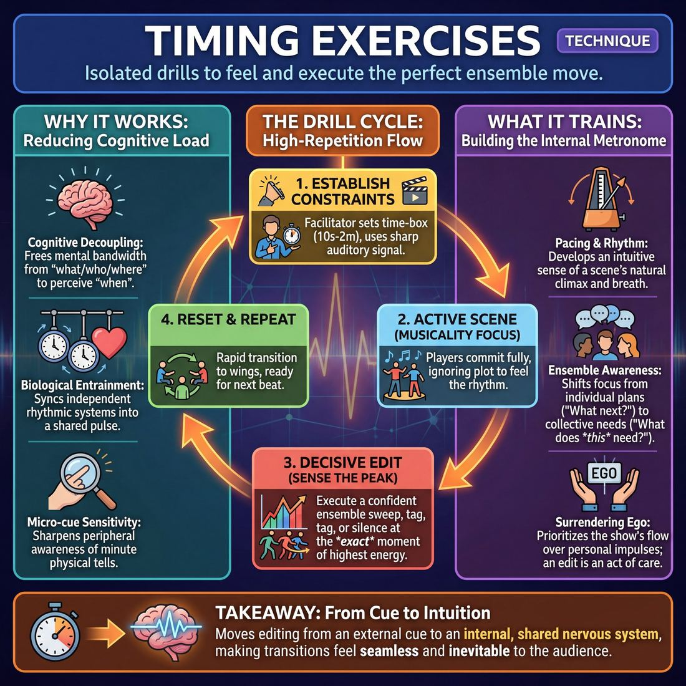

# 🎯 Timing exercises

> *A drillable muscle that trains **Pacing & Rhythm**.*

{ .infographic }

## 🎯 The essence

!!! abstract "In a breath"
    **Timing exercises** are a family of isolated, high-repetition drills that strip away the complexities of narrative and character to focus entirely on the musicality of improvisation. By artificially constraining scene length, dictating specific moments to edit, or forcing rapid transitions, these exercises train a single, vital muscle: the intuitive ability to feel a scene’s natural rhythm and execute a decisive ensemble move—such as a sweep, a tag, or a beat of silence—at the exact right millisecond.

## 🎓 What it trains

Timing exercises isolate and strengthen the muscle of **Pacing & Rhythm**. In the heat of a performance, improvisers often suffer from tunnel vision. They become so focused on generating dialogue, remembering names, or finding the "game" that they lose all sense of time. 

This technique exists to solve a universal problem on the improv stage: the missed exit. Novice improvisers frequently let scenes run long, blowing past the natural climax because they are waiting for a perfect punchline. Conversely, they might edit prematurely out of panic when a scene hits a moment of quiet tension. Timing exercises strip away the pressure of scene content to focus purely on the *musicality* of the performance.

By drilling these exercises, improvisers develop an internal metronome and train several specific sub-skills:

*   **Sensing the peak:** Recognizing the exact moment a scene has reached its highest energy, comedic height, or emotional resolution, rather than waiting for it to deflate.
*   **Decisive editing:** Executing a move with absolute confidence and physical commitment, replacing the hesitant half-jog across the stage.
*   **Ensemble awareness:** Shifting the improviser's focus from the wings ("What am I going to do next?") to the stage ("What does this piece need right now?").

!!! abstract "The Deeper Principle: Surrendering Ego"
    At its core, mastering timing is an act of surrendering your ego to the ensemble. An edit is not a judgment that a scene is "bad" and needs to be saved; it is an act of care. It protects the performers on stage by giving them a clean out, ensuring the pacing of the overall show continues to breathe.

Ultimately, these exercises move an improviser from merely executing an edit on a coach's cue to feeling the rhythm intuitively. This paves the way toward mastery, where edits arrive so naturally on the exact peak of a scene that the audience never consciously notices the transition.

## 💡 Why it works

Timing exercises work by isolating a single, invisible variable: the "when." 

In a standard improv scene, a player’s brain is flooded with **cognitive load**—inventing dialogue, remembering the base reality, tracking the game, and maintaining character. By stripping away the *what*, the *who*, and the *where*, timing exercises leave the ensemble with nothing to manage but the *when*. 

This radical simplification exploits three underlying mechanisms:

*   **Cognitive decoupling:** When players are relieved of the pressure to be funny, clever, or narrative, their mental bandwidth is entirely freed up to perceive rhythm. They stop thinking about what to say and start feeling the space between actions.
*   **Biological entrainment:** This is the phenomenon where independent rhythmic systems synchronize (like pendulum clocks on the same wall eventually swinging together). By forcing a group to clap, step, or speak in unison or in a precise sequence, the exercise physically aligns their breathing, heart rates, and internal metronomes. They begin to operate with a shared nervous system.
*   **Micro-cue sensitivity:** To succeed at a timing exercise, a player cannot look inward. They must expand their **peripheral awareness** to the absolute limit. The brain is trained to detect the microscopic physical tells that precede action—a sharp inhale, a subtle shift in weight, a darting glance, or the tension in a scene partner's shoulders.

!!! abstract "The Engine Under the Hood"
    The true engine of any timing exercise is subordinating your individual impulse to the collective pulse. You cannot "win" a rhythm drill by being the fastest, the loudest, or the most inventive. Success requires total alignment with the group. 

!!! tip "On stage"
    This shared nervous system is the exact mechanism that allows a Competent team to edit *at the right moment*. Because they have trained their collective internal metronome, they no longer need to awkwardly signal for a sweep or step on each other's walk-ons. They feel the peak of the scene simultaneously.

## 🧩 The setup

To effectively isolate and train a group’s internal clock, the physical setup must remove all distractions and establish a clear, undeniable rhythm. 

* **Players & Arrangement:** 6 to 12 players. The group stands on the "wings" (the sides of the playing space) or in a wide semi-circle, leaving a clearly defined center stage. Everyone must have an unobstructed view of the action.
* **Space & Materials:** An open rehearsal room. The facilitator requires a **stopwatch** (a phone timer works perfectly) and a sharp auditory signal—a loud clap, a bell, or a whistle. The sound must be capable of cutting through loud stage dialogue instantly.
* **Time:** 10 to 15 minutes total. Individual scenes or reps within the exercise will be strictly time-boxed (typically ranging from 10 seconds to 2 minutes, depending on the variation).
* **Roles:**
    * **The Facilitator:** Acts as the external metronome. They track the time, enforce hard stops, and dictate the rhythm of the room. 
    * **The Active Players:** Step into the center to initiate and play the scene, committing fully without worrying about resolving a plot.
    * **The Ensemble:** Stands on the wings, actively tracking the energy of the scene and preparing to edit or initiate the next beat.
* **Prerequisites:** Players should already know how to initiate a basic scene. They must also understand the physical mechanics of a **Sweep** (running across the downstage line to wipe the stage clean) and a **Tag-Out** (tapping a player's shoulder to replace them), even if they haven't yet mastered *when* to use them.

!!! quote "How to introduce it"
    "Today, we are taking the pressure off the plot and putting our focus entirely on rhythm. We are going to run a series of rapid-fire scenes. I have a stopwatch. When I call 'Go,' two people step out and start a scene with high energy. When I clap, the scene is over—instantly. 
    
    Do not finish your sentence. Do not try to resolve the conflict or find a punchline. Just drop it and clear the stage immediately so the next group can start. We are training our internal clocks to feel exactly how long 15 seconds, 30 seconds, and one minute actually take on stage, and learning to let go of scenes the second they are over."

## ⚙️ The mechanics

!!! abstract "The Core Objective"
    The goal of any timing exercise is to build a shared **internal clock** within the ensemble. By imposing strict, artificial time constraints on a scene, players are forced to strip away filler, find the core premise immediately, and execute sharp, decisive edits at the exact right moment.

While there are many ways to drill pacing, the most fundamental and widely used mechanic is the **Time-Boxed Compression Drill** (often called "Half-Life"). This drill forces players to execute a complete scene arc within a strict time limit, and then repeatedly compress that same scene into shorter and shorter windows.

Here is the step-by-step flow of play:

**1. The Baseline Setup**
Two players take the stage. The coach or a designated timekeeper gets a stopwatch. The players are given a suggestion and a strict time limit to perform a complete scene—usually **60 seconds**. 

**2. The Execution**
The players begin. Because they know the clock is ticking, they must immediately establish the **base reality** (the who, what, and where) and find the "meat" or comedic premise of the scene without meandering. They must heighten the stakes while internally tracking the time.

**3. The Sharp Edit**
As the 60 seconds draw to a close, a player on the backline (or the coach) must execute a **Sweep** exactly as the time expires. The goal is to time this edit so it lands perfectly on a laugh, a peak emotional moment, or a definitive button, rather than awkwardly cutting someone off mid-sentence.

**4. The Compression (The Halving)**
The *same* two players immediately reset to their starting positions. The timekeeper announces the new limit: **30 seconds**. The players must perform the *exact same scene*—hitting the same narrative beats, the same emotional shifts, and the same climax—but in half the time. 

**5. The Climax and Reset**
The halving process continues. The scene is performed in **15 seconds**, then **7 seconds**, and finally **3 seconds**. By the final round, the scene is reduced to its absolute microscopic essence—usually a single physical gesture and a definitive line of dialogue. Once the 3-second scene is swept, the round ends, the stage is cleared, and two new players step up for a new 60-second baseline.

### Rules & Constraints

*   **No talking faster:** Players must not simply speed up their speech like an audio cassette on fast-forward. They must compress the *structure* by cutting out the throat-clearing, the polite agreements, and the filler dialogue.
*   **No looking at the clock:** The players on stage must rely entirely on their internal rhythm and their teammates on the backline to know when the time is up.
*   **The edit is physical:** A verbal "Scene!" is not allowed. The edit must be a decisive, physical sweep that trains the muscle memory of entering the stage to end a piece.

!!! warning "Watch out: The 'Polite' Edit"
    Novice improvisers often wait for a scene to naturally die down before editing, letting scenes run long and bleed energy. In timing exercises, the backline must be ruthless. If the 30 seconds are up, you sweep—even if the players on stage are in the middle of a brilliant monologue. This ruthlessness trains the ensemble to value the overall rhythm of the show over any individual's stage time.

!!! tip "On stage: Finding the 'Cuts'"
    When compressing a 60-second scene into 30 seconds, think like a film editor. You don't need the three lines of dialogue where you walked through the door and took off your coat. Start the 30-second version with the coat already off, delivering the line that actually started the fight.

## 🎬 Sample round

!!! example "In a scene: The Rapid-Fire Edit Drill"
    In this variation, the ensemble is practicing **Three-Line Scenes** to build the muscle of recognizing the energetic peak and executing a crisp, immediate edit. The mechanics being drilled are: *Initiate, Heighten, Peak, Edit, Reset*.

    **Scene 1: Finding the peak**
    
    *   **Player A (Initiation):** *(Miming a steering wheel)* "I told you, we aren't stopping for ice cream until we cross the state line."
    *   **Player B (Heightening):** "But Dad, the ice cream is melting in my pockets *now*."
    *   **Player A (The Peak):** "That's what you get for shoplifting at Baskin-Robbins!"
    *   **Player C (The Edit):** *(Instantly runs across the front of the stage, performing a **Sweep** before the imaginary audience laugh can die down.)*
    *   *Annotation:* Player C demonstrates Stage 3 maturity (*Edits at the right moment*). They didn't wait for Player B to respond; they recognized the punchline and cut the scene exactly on the beat.

    **Scene 2: Maintaining the rhythm**
    
    *   **Players C & D (The Reset):** *(Step into the center immediately as the sweep finishes, keeping the pacing tight and the stage full of energy.)*
    *   **Player C (Initiation):** "Doctor, is it serious?"
    *   **Player D (The Peak):** "I'm afraid so. You have... disco fever."
    *   **Player E (The Edit):** *(Sweeps immediately after the word "fever".)*
    *   *Annotation:* Here, the scene only took two lines to hit a recognizable climax. Player E was tracking the thread and didn't force the scene to reach three lines just for the sake of a rule. They felt the rhythm and edited on the natural out.

    **Scene 3: A missed beat**
    
    *   **Players E & F (The Reset):** *(Step up, but hesitate for three seconds before speaking, letting the room's energy drop.)*
    *   **Player E (Initiation):** "I love this painting."
    *   **Player F (The Peak):** "It's a mirror."
    *   *(Silence. No one sweeps. Player E starts to speak again to fill the void...)*
    *   **Coach:** "Freeze! Backline, you missed the edit. The joke landed, the energy peaked, and then it dropped. Let's rewind and edit right on 'mirror'."
    *   *Annotation:* This highlights a Stage 1 tendency (*lets scenes run long, misses the exit*). The backline was watching passively as an audience rather than actively anticipating the edit point.

## 🎚️ Variations & progressions

Timing exercises are highly modular. Once your ensemble understands the basic mechanics of a drill, you can adjust the constraints to target specific weaknesses—whether that is rushing, missing edits, or failing to feel the collective rhythm of the group. 

Here are the most common variations and how to sequence them as your team matures.

### 📈 The Editing Progression
To train the specific muscle of **Pacing & Rhythm**, use this progression to move players from hesitant novices to decisive editors.

| Stage Target | Variation | How it works | The Goal |
| :--- | :--- | :--- | :--- |
| **Adv. Beginner** | **The Director's Cut** | The coach claps or yells "Edit!" at random intervals. The backline must immediately execute a physical **Sweep** or **Tag-Out**. | Builds the physical muscle memory of editing on cue, without the pressure of deciding *when* to do it. |
| **Competent** | **The 15-Second Clock** | Scenes are strictly capped at 15 seconds. The backline must find the peak and edit *before* the coach calls time. | Forces the ensemble to actively track the scene and edit *at the right moment*, rather than letting it run long. |
| **Proficient** | **The 3-Line Scene** | A scene consists of exactly three lines of dialogue (A, B, A). The backline must edit immediately after the third line. | Trains the backline to anticipate where teammates will go and recognize the rhythm of a complete micro-narrative. |
| **Master** | **The "Breathe" Edit** | Scenes are not allowed to end on a joke or a loud punchline. The backline must edit on a moment of silence, emotional resonance, or a shared breath. | Teaches that pacing breathes; edits can arrive on a silent peak, completely invisible to the audience's conscious mind. |

### ⏱️ Rhythm & Pacing Variations

If your team struggles with the internal speed of their scenes (either rushing frantically or dragging endlessly), shift away from editing drills and use these pacing constraints.

*   **The Metronome Scene:** Set a literal metronome (using a phone app) to 60 beats per minute. Two players initiate a scene, but they may only speak, move, or react *exactly on the beat*. 
    *   *Progression:* Drop the tempo to 30 BPM to force players to sit in uncomfortable silence and discover the power of slow pacing. Then, crank it to 120 BPM to train high-energy, rapid-fire reactions without losing the core reality of the scene.

!!! tip "On stage"
    When playing with a slow metronome, do not freeze between beats. Let your physical reactions, facial expressions, and stage business continue fluidly. The beat dictates the *rhythm of the interaction*, not a pause button.

*   **Blind Group Counting (The Ninja Variant):** The classic group counting exercise (the ensemble attempts to count from 1 to 20, one person at a time, resetting to zero if two people speak at once) is a staple for building peripheral awareness. To ramp up the difficulty:
    1.  **Eyes closed:** Removes visual cues, forcing players to rely entirely on auditory rhythm and group breath.
    2.  **In motion:** Players walk randomly around the room while counting. 
    3.  **The Silent Count:** Instead of speaking numbers, the group must collectively execute 10 synchronized claps, with a random, un-planned amount of time between each clap. If anyone claps out of turn, reset.

!!! warning "Watch out"
    In counting exercises, players often develop "tells" (a sharp inhale, a twitch of the hand) to signal they are about to speak. A strict coach will call these out and reset the count. The goal is to surrender ego to the piece and feel the rhythm, not to invent a secret signaling system.

## 🧑‍🏫 Coaching notes

When coaching timing exercises, your primary job is to bypass the improvisers' analytical brains. You are trying to build muscle memory for **Pacing & Rhythm**. If players are thinking, they are already late. Your voice should act as the external metronome until the ensemble internalizes the collective heartbeat.

!!! tip "Coaching: Sacrifice the idea for the beat"
    The single most important cue to give your ensemble is: **"Serve the rhythm, not the idea."** If an improviser pauses to think of a clever response or the perfect edit, the collective rhythm dies. Explicitly reward the player who does something simple or nonsensical but perfectly on time, over the player who delivers a brilliant move two seconds too late.

### Active Side-Coaching Cues
Keep your side-coaching short, rhythmic, and loud enough to cut through the exercise without stopping it. 

* **"Out of your head, into the room!"** — Use this when players are staring at the floor, crossing their arms, or visibly calculating their next move.
* **"Breathe together."** — A vital reminder that rhythm isn't just speed; it is shared physical presence. If the group is rushing out of panic, force them to take a collective breath.
* **"Feel the peak... edit!"** — When drilling scene edits, help them identify the natural climax (the laugh, the emotional spike, the revelation) so they learn to cut the scene before the energy deflates.
* **"Match the pulse."** — If the rhythm naturally speeds up or slows down, ensure the whole group moves as one organism, rather than individuals fighting the current.

### What 'Good' Looks and Sounds Like
How do you know the exercise is working? Look for these observable shifts in the room:

* **Eye contact replaces anticipation:** Players stop staring at the person who is "next" in the circle and start maintaining a soft focus on the entire group.
* **Silence becomes active:** Pauses are no longer filled with panic or nervous shuffling. The ensemble learns that a shared, deliberate silence has its own powerful rhythm.
* **Physical relaxation:** Shoulders drop. The frantic, jerky movements of a Novice trying to "keep up" smooth out into the fluid, relaxed readiness of a Competent player.
* **Seamless transitions:** Edits, walk-ons, and sweep-outs begin to happen exactly when the scene needs them, driven by instinct rather than hesitation.

## 🧭 Debrief & reflection

Timing is highly subjective, and the adrenaline of performance often distorts a player's **internal clock**. The debrief is where the ensemble calibrates their individual rhythms into a shared, unified group pulse. 

Use these questions immediately after a round to move pacing from an intellectual concept to a felt, physical sense:

* **"Where did you feel the energy peak, and how did that compare to when the edit actually happened?"** This reveals the gap between recognizing the right moment and actually acting on it.
* **"For those on the backline who thought about editing but didn't—what stopped you?"** This directly addresses the **bystander effect** (assuming someone else will do it) and the fear of cutting a scene off too early.
* **"How did the moments of silence feel?"** Helps players distinguish between "dead air" (a loss of momentum) and "loaded space" (dramatic tension or necessary breathing room).
* **"Did the pacing feel driven by panic, or by purpose?"** Encourages the group to reflect on whether they were rushing to fill space or confidently riding the rhythm of the piece.

!!! abstract "What a successful debrief surfaces"
    A strong reflection period will often lead to a collective "aha" moment where the team realizes they *all* felt the scene peak at the exact same time. Once players realize their instincts are aligned, they stop second-guessing their impulses. 
    
    You will also hear players begin to articulate the physical cues of a scene's natural end—a definitive statement, a shift in posture, or the natural decay of an audience laugh—moving them away from arbitrary time limits and toward organic rhythm.

!!! tip "On stage: The Stage-Time Distortion"
    Remind players that three seconds of silence on stage can feel like three minutes to a novice. If players report feeling panicked by pauses during the debrief, challenge them in the next round to silently count to three before making their move. This forces the pacing to breathe.

## ⚠️ Common pitfalls

!!! warning "Watch out: Playing the math, not the music"
    The single biggest mistake in any timing exercise is treating it like a reflex test or a game to be "won." When players get overwhelmed by the cognitive load of tracking the group, they retreat into their own heads. They start counting beats, anticipating their turn, and tensing their muscles. The result is a mechanical, rushed rhythm. The goal of these drills is never speed—it is **connection and shared breath**.

When the ensemble's rhythm breaks down during these exercises, it usually falls into one of these predictable novice traps. Here is how to spot and fix them:

**1. The Polite Hesitation (The Deferral Loop)**
* **The Trap:** Two players initiate an action, speak, or step out to edit at the exact same time. Both immediately freeze, apologize, and say, "No, you go." The rhythm completely dies.
* **The Cause:** A desire to be a "good, supportive improviser" overriding the need to keep the momentum alive. 
* **The Fix:** Coach players to commit to the collision. If two people step out to edit, they should both edit together. If two people speak, one should confidently yield while the other pushes through. **Hesitation kills rhythm; bold mistakes create it.**

**2. Anticipating the Beat (Jumping the Gun)**
* **The Trap:** A player passes a pulse, delivers a line, or sweeps the stage *before* the previous moment has fully landed. They step on the laugh or cut off the end of their partner's sentence.
* **The Cause:** Tunnel vision. The player is so focused on executing their own upcoming move that they stop observing the present moment. 
* **The Fix:** Enforce a mandatory micro-pause. Ask the player to make deliberate eye contact and take one physical breath before they execute their action. Teach them to edit on the *reaction* to a line, not the line itself.

**3. The Mechanical Chop**
* **The Trap:** A player edits a scene simply because "it feels like it's been long enough," often chopping the scene off right before its natural peak or punchline. 
* **The Cause:** Stage 1 and 2 improvisers often panic about scenes running long. Lacking the peripheral awareness to feel the scene's actual arc, they rely on an internal stopwatch.
* **The Fix:** Shift their focus from *time* to *energy*. Ask them to listen for the "out-breath" of the scene—a moment of shared laughter, a major revelation, or a heavy silence. 

**4. Tunnel Vision (The Proximity Trap)**
* **The Trap:** In a circle exercise, players only look at the person passing to them. On stage, they only watch the active speaker, completely missing a teammate trying to tag in from the wings.
* **The Cause:** High cognitive load forces the brain to narrow its field of vision to the most immediate threat or stimulus.
* **The Fix:** Coach **soft focus**. Instruct players to look at the negative space in the center of the circle or the stage, allowing their peripheral vision to take in the entire ensemble at once.

## 🌟 What mastery looks like

When an ensemble reaches the master level in timing exercises, the mechanical scaffolding of the drill completely disappears. The group ceases to look like a collection of individuals trying to synchronize, and instead operates as a single, breathing organism. 

Here is what mastery looks like in the room:

*   **The invisible edit:** In scene-editing drills, players don't just cut scenes off; they arrive on the exact peak. The edit feels so inevitable and satisfying that the audience (or the rest of the class) never consciously notices the transition—they only feel the impact of the punchline or emotional climax.
*   **Pacing that breathes:** The ensemble demonstrates a massive dynamic range. They can execute rapid-fire, high-energy sequences without spiraling into chaos, and they can hold absolute, tension-filled silence without anyone panicking and rushing to fill the void. 
*   **Total ego surrender:** The recurring theme of these drills reaches its culmination. No one is trying to be the fastest, the loudest, or the one to "save" a lagging rhythm. Players support invisibly, giving exactly what the collective rhythm needs in that microsecond and nothing more.
*   **Anticipation over reaction:** Master improvisers aren't just reacting to the last beat; they feel the trajectory of the pattern. They know when a scene or a rhythm is about to end before the final word is even spoken.

!!! example "In a scene: The Masterful Edit Drill"
    Imagine a rapid-fire **Sweep** or **Tag-Out** exercise. Novices will edit randomly or step on each other's lines. A master-level team will execute ten edits in two minutes, with every single player entering on the exact syllable of the laugh line or emotional peak. The rhythm of the edits becomes a musical beat of its own—*setup, heighten, peak, SWEEP*—flowing seamlessly without a single dropped beat, rushed entrance, or lingering hesitation.

Ultimately, mastery in timing exercises proves that the ensemble has stopped thinking about *when* to move, and has started *feeling* the collective pulse of the piece.

## 🔗 Why it matters

Timing exercises are the crucible where the skill of **Pacing & Rhythm** is forged. By isolating the exact moment of an edit, a walk-on, or a transition, these drills calibrate a team's shared internal metronome. Instead of relying on a single dominant player to rescue scenes, the entire group learns to feel the natural peaks, valleys, and resting heart rate of the work.

This directly serves the ultimate goal of **The Ensemble**: surrendering ego to the piece. When you drill timing, you train yourself to listen to the needs of the show rather than your own desire to be seen. 

Mastering this muscle connects to the wider craft in three vital ways:

*   **It transforms support into an instinct:** A perfectly timed edit is an act of profound support. It rescues a scene before it drags, or caps it exactly at its highest point of energy. 
*   **It eliminates pre-planning:** When players are tuned into the rhythm of the moment, they don't need to invent a clever reason to enter. The rhythm itself dictates the entrance, allowing the ensemble to weave threads together organically.
*   **It creates dynamic contrast:** A show with a single, frantic speed quickly exhausts a crowd. Timing exercises teach a team how to let pacing breathe—balancing high-energy chaos with grounded, pregnant silences.

!!! abstract "The Invisible Architecture"
    Good timing is the invisible architecture of a great show. When a team's rhythm is locked in, the audience relaxes. They stop worrying about whether a scene will awkwardly drag on and instead trust that the ensemble is in complete control. 

Ultimately, the muscle of timing ensures that every idea, character, and game is given exactly the space it deserves—no more, no less. As players progress from nervously watching scenes run long to executing edits that arrive on the exact peak, the craft elevates from a clunky series of sketches into a seamless, living organism.

## 📚 References & Further Reading

### Foundational sources
* **Viola Spolin, *Improvisation for the Theater* (1963)** — Spolin’s seminal theater games (particularly her mirroring, space walks, and focus exercises) are the bedrock of training an ensemble to physically synchronize. By removing the pressure of inventing a plot, her exercises allow players to focus entirely on the "when," developing a shared rhythm.
* **Keith Johnstone, *Impro: Improvisation and the Theatre* (1979)** — While famous for its exploration of status, Johnstone’s work deeply analyzes the natural rhythm of human interaction. He explores how improvisers can manipulate time—through fast/slow pacing and interrupting routines—to create tension, execute perfect comedic timing, and avoid the trap of "wimping" (hesitating).

### Practitioner guides & manuals
* **Matt Besser, Ian Roberts, Matt Walsh, *The Upright Citizens Brigade Comedy Improvisation Manual* (2013)** — The definitive text on the mechanical execution of edits. It codifies the "sweep," the "tag-out," and the "cut-to" as essential tools for protecting the ensemble, maintaining a show's overall rhythm, and editing decisively on the peak of the "game."
* **Mick Napier, *Improvise: Scene from the Inside Out* (2004)** — Napier challenges improvisers to stop waiting for the "perfect" moment to enter or edit. He offers practical advice on scene pacing, doing something immediately to establish momentum, and trusting your internal clock over rigid structural rules.
* **Will Hines, *How to Be the Greatest Improviser on Earth* (2016)** — Offers clear, practical advice on ensemble awareness and pacing. Hines breaks down the mechanics of editing decisively without hesitation, emphasizing that a confident, early edit is always better than a hesitant, late one.

### Lineage & teachers
* **iO Theater (formerly ImprovOlympic)** — The birthplace of the Harold, where the concept of "group mind" was pioneered by Del Close and Charna Halpern. iO trained improvisers to feel the peak of a scene collectively, moving away from relying on a director's cue to intuitively knowing when a piece needed to breathe or end.
* **Upright Citizens Brigade (UCB)** — Institutionalized the rapid-fire, game-driven pacing style. UCB's curriculum heavily relies on drilling sharp sweeps and tag-outs to maintain high energy, teaching students to "cut on the laugh" rather than letting a scene deflate.
* **The Annoyance Theatre** — Founded by Mick Napier, this Chicago school emphasizes individual pacing and immediate action. It trains performers to break conventional rules to find a scene's unique, organic rhythm rather than forcing it into a predetermined time box.
* **Hoopla Impro (UK) & ComedySportz** — Foundational and short-form schools that heavily utilize the "Half-Life" (often called 60-30-15-7) time-boxed compression drill in their core curriculums. This lineage uses artificial time constraints to teach economy of movement, rapid editing, and the elimination of cognitive load.

### Research & theory
* **Ingar Brinck, *Joint Improvisation in the Arts Practices: Entrainment, Engagement, and Expert Skill* (2016)** — Explores the cognitive and biological phenomenon of "entrainment," explaining how improvisers synchronize their behavior, align their internal metronomes, and create shared action spaces without pre-planning.
* **Charles J. Limb & Allen R. Braun, *Neural Substrates of Spontaneous Musical Performance* (2008)** — A landmark fMRI study showing that during improvisation, the brain's self-monitoring centers (dorsolateral prefrontal cortex) deactivate. This supports the concept of "cognitive decoupling," which frees up the mental bandwidth required for intuitive timing.
* **Sarah Hawkins, Ian Cross, & Richard Ogden, *Alignment across speech and music* (2021)** — Research demonstrating how interactants in both conversation and ensemble improvisation naturally entrain to a shared regular pulse, providing a biological basis for the "shared nervous system" of a competent improv team.
* **M. Seppänen et al., *The impact of applied improvisation on acute social stress and interpersonal confidence* (2023)** — Discusses how improvisation training reduces cognitive load and social stress, allowing performers to expand their peripheral awareness and heighten their sensitivity to the micro-cues that precede an edit.

### Talks, videos & courses
* **David Charles (ImprovDr), *Game Library: Half Life* (2024)** — A documented breakdown of the 60-30-15-7 second compression drill, detailing how artificial time constraints force players to strip away filler, heighten stakes, and execute sharp transitions.
* **Baltimore Musical Improv, *Half Life Musical* (2020)** *(unverified exact year)* — Demonstrates how the time-boxed compression drill is adapted for musical improv, forcing singers to find the emotional and physical core of a song in fractions of the original time, relying entirely on rhythm and ensemble trust.

### Communities & adjacent reading
* **Keith Sawyer, *Group Genius: The Creative Power of Collaboration* (2007)** — A highly relevant look at group flow and jazz ensembles. Sawyer's research provides the closest academic parallel to comedic timing, focusing on how ensembles communicate, pace themselves, and edit without a conductor.
* **Neuro-Linguistic Programming (NLP) & Pacing/Mirroring** — The psychological concepts of pacing and mirroring are frequently referenced by improv coaches (tracing back to Spolin) when discussing how to get in sync physically, verbally, and rhythmically with a scene partner to establish a baseline before heightening.

## 💬 Quotes & Anecdotes

!!! quote "— Sam Shepard, quoted by Patti Smith in *Just Kids* (2010)"
    "What if I screw up the rhythm?" I said. "You can't," he said. "It's like drumming. If you miss a beat, you create another."

!!! quote "— Charna Halpern, *Truth in Comedy* (1994)"
    Learning how to edit a scene is easy. Knowing when to cut a scene off requires a little more effort. Players have to respect the length and timing of the individual pieces.

!!! quote "— Ian Roberts, *Upright Citizens Brigade* (Class instruction, 2002)"
    The object is 'don't think.' We'll think about it after the scene, so you can build those muscles and not have to think in a scene.

!!! quote "— Thelma Schoonmaker, *Three-time Academy Award-winning film editor*"
    The slight beat, maybe two or three seconds, before you answer a question, or the beat you put in the middle of a line, is all where comedy lies.

### Where it comes from
The concept of isolating rhythm and timing through artificial constraints has roots in Viola Spolin's foundational theater games, which frequently utilized strict time limits to bypass the intellect and force spontaneous physical reactions. The specific "Half-Life" drill (compressing a scene's time repeatedly) is a universal theater exercise with origins in early short-form comedy and corporate team-building (often attributed to facilitators like Matt Weinstein). Today, it has been universally adopted by long-form schools like iO and the Upright Citizens Brigade specifically to train the "editing muscle" and force players to find the core of a scene faster.

### A telling example
A classic illustration of how timing exercises work is the final round of a "Half-Life" drill. 

In this illustrative scenario, two improvisers are given 60 seconds to perform a scene. They establish they are bank robbers waiting in a getaway car, arguing over who forgot to fill the gas tank. They hit a natural comedic peak around 45 seconds, and the coach calls "Time."

They are then forced to perform the *exact same scene arc* in 30 seconds, then 15, then 7, then 3. 

By the time they reach the 1-second mark, there is absolutely no time for dialogue, establishing the base reality, or advancing a plot. The coach yells "Go!" One improviser simply grips the steering wheel and screams in panic, while the other aggressively face-palms. The coach yells "Time!" 

The exercise proves to the players that the actual "meat" of their 60-second scene wasn't the clever dialogue about the gas tank—it was the pure, instantaneous emotional dynamic between the two characters. By stripping away the time, the exercise trains the ensemble to get to that peak immediately and edit the moment it hits.

## 🧭 Explore the framework

- ⬆️ **Skill it trains:** [Pacing & Rhythm](04_S4__pacing-and-rhythm.md)
- 🎭 **Domain:** [The Ensemble](04_D__the-ensemble.md)
- 🔁 **Sibling techniques:** [Edits (Sweep, Tag-Out, Sound/Light)](04_S4_T1__edits-sweep-tag-out-sound-light.md)
