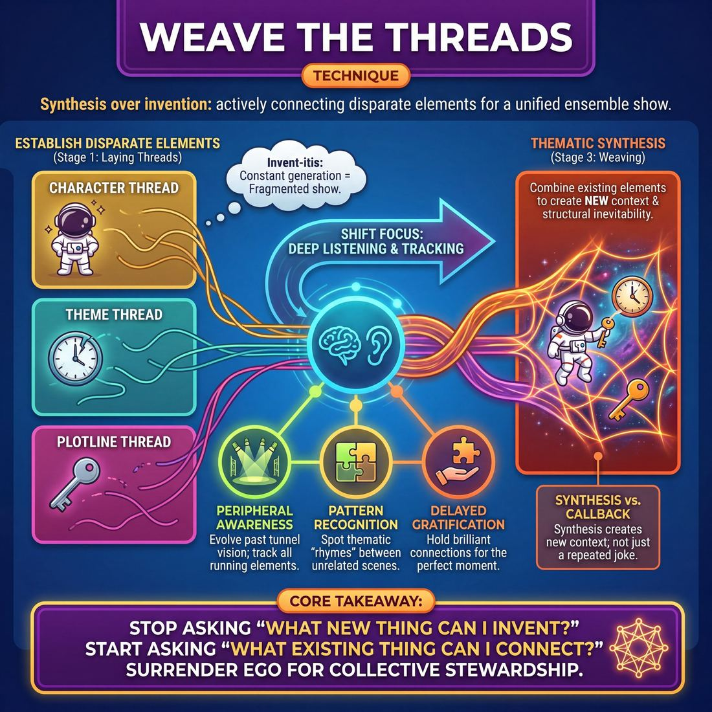

# 🎯 Weave the threads

> *A drillable muscle that trains **Thematic Synthesis**.*

{ .infographic }

## 🎯 The essence

**Weave the threads** is an ensemble technique where improvisers actively connect disparate characters, themes, or plotlines established earlier in a performance. Instead of inventing new information, players practice the discipline of **synthesis**—pulling existing elements together to reveal how they belong in the same universe. It trains the ensemble to stop generating and start combining, forcing players to widen their awareness and treat the entire show as a single, interconnected organism rather than a series of isolated scenes.

## 🎓 What it trains

At its core, this technique is the primary workout for **Thematic Synthesis**: the ability to recognize disparate elements in a performance and elegantly tie them together into a cohesive whole. 

**The Problem it Solves**  
Inexperienced improvisers often suffer from "invent-itis." Believing that more is always better, they constantly generate new characters, locations, and premises. This results in a fragmented show that feels like a random assortment of disconnected sketches. The improviser feels the exhausting, anxiety-inducing pressure to constantly create from scratch, while the audience feels overwhelmed and untethered. 

**The Muscle it Builds**  
This technique teaches improvisers that the ingredients for a masterpiece are already on stage. By practicing how to weave existing threads, performers learn to *deepen* rather than *widen* the show. 

!!! abstract "The Core Shift"
    You are training the brain to stop asking, *"What new thing can I invent?"* and start asking, *"What existing thing can I connect?"*

Specifically, this technique isolates and drills three vital muscles:

*   **Peripheral Awareness:** It forces the improviser to evolve past the Stage 1 Novice habit of tunnel-visioning on their own scene. To weave effectively, you must become a Stage 3 Competent player who actively tracks all running characters, themes, and games across the entire piece.
*   **Pattern Recognition:** The ability to spot the thematic "rhymes" between seemingly unrelated scenes. 
*   **Delayed Gratification:** Learning to hold onto a brilliant callback or connection until the exact right moment, rather than rushing to play it immediately.

**The Deeper Principle**  
Tying directly into the domain of **The Ensemble**, weaving is an act of profound ego surrender. It requires you to let go of your own pre-planned, clever ideas in order to serve what the group has already built. You become a steward of the piece rather than the star of the moment, trusting that a satisfying, unified show doesn't require a script—it just requires players who are paying fierce attention to each other.

## 💡 Why it works

The engine under the hood of "Weave the threads" relies on a fundamental shift in the improviser’s mindset: moving from invention to recognition. In the early stages of a show, the ensemble's cognitive load is heavy with creating new premises. By the second half, this technique flips the script, exploiting the human brain's natural craving for patterns, connection, and closure.

Here is why this mechanism is so effective:

*   **It exploits cognitive pattern recognition:** The human brain is a meaning-making machine. When an audience sees two seemingly unrelated scenes, characters, or philosophies, they subconsciously look for the connection. When improvisers finally weave those threads together, it triggers a cognitive reward—a dopamine-fueled "aha!" moment—that makes the improvised show feel magically pre-written.
*   **It acts as a pressure valve:** Instead of staring at an empty stage wondering what to create next, the improviser treats the stage like a well-stocked pantry. This conserves the group's creative energy and transforms the terrifying void of a blank stage into a playground of existing toys.
*   **It demands and rewards deep listening:** You cannot weave what you haven't tracked. Because the technique requires players to maintain their peripheral awareness across the entire show, it naturally shifts the group dynamic away from individual ego and toward collective stewardship.

!!! note "Synthesis vs. Callback"
    A simple **callback** is repeating a joke or bringing a character back for a quick laugh of recognition. **Synthesis** (weaving the threads) is structural. It works because it combines two existing elements to create a *new* context—like taking the arrogant astronaut from Scene 1 and putting them in the mundane DMV waiting room from Scene 3. The friction between the two threads is what generates the power.

By treating every offer as a puzzle piece rather than a disposable joke, the ensemble builds a web of inevitability. The audience feels taken care of, and the performers get to ride the momentum of their own shared history.

## 🧩 The setup

Here is everything you need to arrange before putting this technique into practice. Because weaving requires players to track and synthesize multiple pieces of information, a clean, distraction-free setup is essential.

*   **Players & Group Size:** Best run with a full ensemble of 6 to 10 players. 
*   **Arrangement:** Players stand in a wide, straight backline or sit in the wings. Every player must have an unobstructed view of the stage and each other, as tracking the details of every scene is mandatory.
*   **Space & Materials:** A standard bare stage. 
    *   *Optional (for Novices):* A whiteboard and marker placed off-stage for the facilitator to jot down the core elements of the initial scenes, helping players who struggle to hold multiple threads in their working memory.
*   **Time:** 20–30 minutes total. Allocate 7–10 minutes per round. This allows enough time for the "establishment phase" (laying down the threads) and the "synthesis phase" (weaving them together).
*   **Roles:** 
    *   **Initiators:** The players who step out to establish the first three distinct, unrelated scenes (the "threads").
    *   **Weavers:** The players remaining on the backline who actively look for thematic, physical, or narrative connections to bring the disparate elements together. *(Note: Players will fluidly swap between these roles as the drill progresses).*
    *   **The Caller (Facilitator):** In early rounds, the coach dictates the pacing, calling "Scene" or "Next thread" to ensure the base elements are clearly established before the weaving begins.
*   **Prerequisites:** Players should already be comfortable with basic scene starts, standard support moves (like walk-ons and tag-outs), and have a baseline ability to remember character names and locations from previous scenes.

!!! tip "Facilitator prep"
    Before starting, explicitly define what a "thread" can be for your group. Remind them that they aren't just weaving *plot*—they can weave a specific character, a recurring physical gesture, a philosophical theme, or a specific object. 

!!! quote "How to introduce it"
    "We are going to start by creating three completely separate, unrelated scenes. I want you to treat them like three distinct threads of different colors. Pay close attention to the who, what, and where of each. Once all three are established, your job on the backline is to start weaving. Look for how the character from thread A might naturally wander into the location of thread B, or how the core argument in thread C perfectly applies to the relationship in thread A. Don't force a violent collision; look for the natural gravity between the scenes and gently pull them together."

## ⚙️ The mechanics

!!! abstract "The Core Objective"
    To hold multiple, seemingly unrelated narrative or thematic elements in your working memory, and systematically combine them into a single, cohesive scene. The goal is **synthesis**, not just a chaotic collision of references.

The mechanics of this technique operate in two distinct phases: generating the raw material, and executing the convergence. 

### The Flow of Play

**1. Generating the Source Material (The Threads)**  
Three pairs of improvisers perform three short, entirely unrelated scenes back-to-back (Thread A, Thread B, and Thread C). 
*   These scenes should be brief (30–45 seconds).
*   Players must establish a clear **base reality**, a distinct character dynamic, or a strong philosophical point of view. 
*   The rest of the ensemble watches with intense peripheral awareness, mentally cataloging the core elements of each thread.

**2. Initiating the Convergence Scene**  
Two new improvisers step forward to begin a fourth scene (The Weave). They do not immediately reference the previous scenes. Instead, they must establish a completely new, grounded base reality. This serves as the canvas for the synthesis.

**3. The Organic Pull**  
Once the new base reality is stable, the players (or ensemble members via support walk-ons) begin to pull threads from scenes A, B, and C into the current scene. 
*   A player might introduce an object established in Thread A.
*   A character from Thread B might enter the space.
*   The core philosophical argument of Thread C might be adopted by one of the current characters.

**4. The Synthesis**  
The players must now justify *why* these disparate elements exist in the same universe. They cannot simply acknowledge the references; they must make them interact. The scene's conflict or game becomes the friction between these woven threads.

**5. The Edit and Reset**  
An ensemble member on the backline watches for the moment of peak convergence—the exact second the final thread is successfully integrated and the synthesized joke or thematic point lands. They execute a decisive edit (a sweep or blackout). The exercise then resets with a new suggestion and three new source scenes.

### Types of Threads to Pull

To prevent the exercise from feeling like a shallow callback machine, players must practice pulling different *types* of threads.

| Thread Type | Description | Example |
| :--- | :--- | :--- |
| **Literal** | Bringing back a specific character, physical object, or location. | The stolen cursed amulet from Scene A is found in the pawn shop in Scene D. |
| **Thematic** | Reusing a core philosophy, worldview, or emotional argument. | The hyper-competitive attitude of the spelling bee parents in Scene B is adopted by the astronauts in Scene D. |
| **Structural** | Repeating a specific rhythm, stage picture, or game mechanic. | The rapid-fire, overlapping interrogation tactic from Scene C is used by a kindergarten teacher in Scene D. |

### Rules & Constraints

*   **No "Frankensteining":** Do not just dump elements together for the sake of it. If a thread is pulled, it must be justified within the reality of the new scene.
*   **Patience is required:** Do not rush to pull a thread in the first ten seconds of the convergence scene. If the canvas isn't painted first, the threads have nothing to weave into.
*   **Share the load:** The players in the convergence scene shouldn't have to do all the work. The ensemble should use **off-focus support** (like a timely walk-on or a background action) to deliver a missing thread exactly when the scene needs it.

!!! warning "Watch out"
    Avoid the trap of the **"List-Off."** This happens when a player simply names the elements from the previous scenes ("Wow, I can't believe we found that amulet, and look, here comes that competitive dad!"). Show the elements interacting; don't just tell the audience they are there.

## 🎬 Sample round

!!! example "In a scene: The Montage Weave"
    In this exercise, the ensemble generates three distinct, unrelated scenes, then initiates a fourth scene tasked entirely with weaving the threads together. 

    **Phase 1: Generating the Threads**
    *   **Scene 1 (Thread A):** A baker (Player 1) is obsessively cradling a jar of sourdough starter, singing it a lullaby and calling it "my bubbly little boy."
    *   **Scene 2 (Thread B):** Two bank robbers (Players 2 & 3) are mid-heist, bickering intensely over who gets to wear the "cool" mirrored sunglasses.
    *   **Scene 3 (Thread C):** A hyper-intense fitness instructor (Player 4) is screaming at a spin class to "Embrace the burn! The burn is your friend!"

    **Phase 2: The Synthesis (Scene 4)**
    *Player 2 (from Scene 2) steps out, panting, miming holding a heavy bag. Player 1 (from Scene 1) steps out to join them.*

    **Player 2:** *(Adjusting imaginary sunglasses)* "Alright, we cracked the vault. Did you grab the diamonds?"
    > *Mechanic in action: **Re-establishing the base.** Player 2 brings back the world of Thread B (the heist and the sunglasses) to serve as the foundation for the weave.*

    **Player 1:** *(Cradling the heavy bag delicately)* "Better. I got the 1849 San Francisco mother-dough. Look at him, he's so bubbly."
    > *Mechanic in action: **Transplanting the element.** Player 1 weaves in Thread A (the sourdough baby). By placing the baker's obsession into the high-stakes heist, they create a brand new, synthesized comedic premise.*

    **Player 2:** "Are you kidding me? The cops are outside! We're going to jail for yeast?!"

    **Player 4:** *(Enters as a SWAT commander with a megaphone)* "Come out with your hands up! And remember: Embrace the burn! The tear gas is your friend!"
    > *Mechanic in action: **Thematic echo.** Player 4 tracks the active threads from the backline and executes a precise walk-on. They weave in Thread C (the fitness catchphrase), adapting it to fit the reality of the SWAT standoff, perfectly capping the synthesis.*

## 🎚️ Variations & progressions

To build the muscle of synthesis, start with explicit, mechanical connections and gradually remove the scaffolding until the ensemble is weaving ideas intuitively. These progressions move players from basic plot collisions to advanced, subtle resonance.

**1. The Two-Scene Collision (Novice to Advanced Beginner)**  
Players at the Novice stage often tunnel-vision on their own scene. To break this, limit the exercise to exactly two distinct scenes. 
*   **The tweak:** The instructor claps or calls "Weave!" halfway through the exercise. The characters from Scene A must immediately enter the physical location of Scene B (or vice versa) and justify why they are there. 
*   **The goal:** Force a literal, plot-based connection. It trains players to notice the other reality on stage and execute a clean walk-on that bridges the two worlds.

**2. The Object Thread (Competent)**  
Once players can track multiple active threads, remove the forced character crossovers. 
*   **The tweak:** Introduce a highly specific, imaginary object in the first scene (e.g., a vibrating, neon-green briefcase). In the subsequent two scenes, that exact object must appear and be utilized, even if the scenes are set in completely different centuries or realities.
*   **The goal:** Trains the ensemble to track a single, tangible through-line and anticipate where teammates will go next, without needing the original characters to return.

**3. The Thematic Echo (Proficient)**  
At this stage, players move away from literal connections (same characters, same objects) and begin weaving the *ideas* beneath the scenes.
*   **The tweak:** Play three scenes in rotation. Players are forbidden from crossing characters over. Instead, they must identify the core emotion, game, or philosophical premise of Scene 1, and weave that *theme* into Scenes 2 and 3 using entirely different contexts.

!!! example "In a scene"
    *   **Scene 1:** Two astronauts argue about who has to step outside to fix the ship, terrified of the vast emptiness of space.
    *   **Scene 2 (The Echo):** A teenager refuses to leave their bedroom for a family party, terrified of the vast emptiness of small talk. 
    *   *The weave is the shared theme of "fear of the void," not the characters.*

**4. The Silent Motif (Master)**  
For ensembles that see the entire show as one organism, the weave becomes entirely non-verbal.
*   **The tweak:** The synthesis must happen beneath the dialogue. Players track a specific physical gesture, a stage picture, or a rhythm established early on, and weave it into the physical life of later scenes. 
*   **The goal:** Ego is fully surrendered. The audience may never consciously notice the edit or the weave, but they will feel the cohesive, rhythmic unity of the piece.

!!! tip "On stage"
    Don't rush to the Thematic Echo. If an ensemble is struggling to weave themes, drop back to the Object Thread. Tangible anchors give improvisers a concrete focal point, freeing up their brain space to practice the *timing* of the weave before they have to manage the *poetry* of it.

## 🧑‍🏫 Coaching notes

As a coach, your primary job during this technique is to serve as the ensemble’s external memory. When players are in the thick of a scene, they often suffer from tunnel vision, focusing only on the immediate moment. Your side-coaching should gently widen their aperture, reminding them of the rich inventory they have already built.

!!! tip "On stage: The Golden Cue"
    **"Stop inventing, start connecting."** 
    This is the single most important phrase to use when the ensemble looks lost. When improvisers panic, their default instinct is to generate *new* information. Call this out immediately to redirect their energy back toward the existing threads. The answers are already on stage.

### High-leverage side-coaches
Deliver these cues clearly and concisely from the sidelines while the scene is in motion. Do not stop the scene; let the players integrate the note in real-time.

*   **"Who haven't we seen?"** Use this when the backline is stagnant. It prompts players to resurrect a character or dynamic from an earlier beat that has been left dangling.
*   **"Bring [Character A] into [World B]."** A direct, prescriptive coach for Advanced Beginners who need help seeing how two distinct threads can physically intersect.
*   **"What was our opening idea?"** Use this when a scene is drifting into generic territory. It forces the players to re-anchor the current action to the core theme or suggestion.
*   **"Play the other side of that argument."** If Scene 1 featured a character obsessed with cleanliness, and Scene 3 features a mud-wrestling tournament, this cue prompts a player to weave the *thematic* thread (order vs. chaos) rather than just bringing back the specific character.
*   **"Let it breathe."** Weaving requires pacing. If players are rushing to smash ideas together clumsily, remind them to slow down and let the connection emerge naturally.

### What 'good' looks and sounds like
When the ensemble is successfully drilling this technique, you will observe specific shifts in the room's energy:

*   **Active backline listening:** Players on the sides are physically leaning in, tracking the details of the current scene, and visibly scanning their memories for how it connects to earlier moments. They are no longer just waiting for their turn.
*   **Structural callbacks over superficial ones:** Instead of just repeating a funny catchphrase from Scene 1, players will apply the *game* or *philosophy* of Scene 1 to the entirely new context of Scene 3.
*   **The "Click":** You will hear a distinct, audible reaction from the rest of the class (or audience) when two seemingly unrelated threads suddenly lock together. It sounds less like a laugh and more like a collective *"Ahhh."* 

!!! note "Adjusting for experience levels"
    For **Novices**, you will need to explicitly name the threads: *"Bring back the angry baker."* As they move toward **Competent**, your coaching should become more abstract, prompting them to find the connection themselves: *"How does this relate to the bakery?"* By the time they are **Proficient**, your coaching should be nearly silent, only stepping in to manage the pacing of the weave.

## 🧭 Debrief & reflection

After the dust settles on a round of weaving, the debrief is where the ensemble shifts from instinct to conscious competence. The goal is to move players away from tunnel-visioning on their own scenes and toward seeing the entire piece as a single, breathing organism.

Use these questions to guide the reflection:

*   **"What was a seemingly insignificant detail from an early scene that became crucial later?"**
    *   *Why ask it:* This proves to the ensemble that they don't need to invent massive plot twists; they just need to listen to the throwaway lines and physical offers already established.
*   **"When you made a connection, did you plan it on the backline, or did it emerge in the moment?"**
    *   *Why ask it:* This highlights the difference between **shoehorning** (forcing a pre-planned, clever idea onto the stage regardless of context) and **organic discovery** (stepping out to support and finding the connection in real-time). 
*   **"Whose original idea was completely hijacked or transformed by a teammate—and how did it feel?"**
    *   *Why ask it:* This addresses the ego. Weaving requires players to surrender ownership of their premises. A healthy ensemble celebrates when their "A" story becomes a supporting thread to serve the whole.
*   **"At what exact moment did we realize what this piece was actually about?"**
    *   *Why ask it:* This targets thematic synthesis. It helps the team identify the tipping point where disparate threads suddenly braided into a unified, overarching theme.

!!! abstract "The 'Aha' Moment"
    A successful debrief surfaces a collective sigh of relief. Players should realize that they don't have to work so hard to invent new information in the back half of a show. The answers to the scene are already on stage, waiting to be picked up and woven together. When they trust the threads, the show writes itself.

## ⚠️ Common pitfalls

!!! warning "Watch out: The Shoehorn"
    The most glaring mistake when attempting to weave threads is **The Shoehorn**—forcing a connection that violates the base reality of the current scene just to prove you remembered a previous detail. If a grounded, emotional scene between two divorcing parents is suddenly interrupted by the wacky talking muffin from scene one for no logical reason, the audience groans instead of cheering. A successful weave must feel inevitable and justified, not violently jammed in.

When improvisers first practice thematic synthesis, the sheer cognitive load of tracking multiple storylines, characters, and games often causes the technique to break down. Here are the most common traps and how to fix them:

*   **The "Dropped Plates" (Cognitive Overload)**
    *   *The Trap:* An improviser tries to memorize every single name, object, and offer from the top of the show. Overwhelmed by the data, they revert to a novice mindset, tunnel-visioning on their immediate scene and dropping all peripheral awareness.
    *   *The Fix:* Stop trying to track the trivia; track the **themes** and **energies**. You don't need to remember the exact name of the fictional corporation if you remember the theme of "corporate greed." Furthermore, trust the ensemble mind—you only need to hold onto one or two threads, trusting your teammates are holding the rest.

*   **The Checklist Ending**
    *   *The Trap:* As a piece nears its end, improvisers panic and try to physically bring back every single character introduced in the show to tie up loose ends. This results in a crowded, chaotic stage where everyone is talking and nothing is resolved.
    *   *The Fix:* Synthesize ideas, not just bodies. You don't need a ten-person scene to weave the threads. A single character in a solo scene can make a choice that resolves the thematic tension of the entire piece. 

*   **Sacrificing the Present for the Past**
    *   *The Trap:* An improviser stops listening to the beautiful, organic offers happening *right now* because they are waiting in the wings, desperately hunting for the perfect moment to deploy a callback from ten minutes ago.
    *   *The Fix:* Play the scene you are in first. The most satisfying weaves happen when a past thread naturally aligns with the present moment. 

!!! tip "On stage: Let the weave breathe"
    If you realize two threads belong together, you don't have to smash them together in one line of dialogue. **Pacing breathes.** Bring the element back slowly. Let the audience recognize the returning thread a few seconds before the characters do. The anticipation is half the magic.

## 🌟 What mastery looks like

When this technique is executed at the highest level, the act of weaving becomes invisible. The improviser no longer feels like a writer desperately trying to tie up loose ends; instead, they operate from a place of profound peripheral awareness, seeing the entire piece as a single, breathing organism. 

In a master-level execution of this drill, you will observe the following behaviors:

*   **Thematic, not just literal, connections:** Masters don't just smash two characters together in a room to force a crossover. They weave the *ideas*. If thread A is about a pirate losing his ship, and thread B is about a mother at a bake sale, the master weaves them by having the mother express the exact same emotional philosophy about "going down with the ship" regarding her cupcakes.
*   **Ego-less setups:** Operating with their ego fully surrendered, a master will often lay down the perfect puzzle piece for *someone else* to connect. They do the off-focus support work required to set up a brilliant synthesis, perfectly content to let a teammate deliver the final, satisfying blow.
*   **Extreme patience:** They do not rush the weave. While novices panic and try to tie threads together in the second beat, masters let the disparate storylines breathe, trusting that the synthesis will naturally present itself at the climax. 
*   **Structural callbacks:** They weave using the rhythm and staging of the piece, repeating a specific physical picture, a lighting cue, or a stage picture from an earlier thread to create a subconscious link for the audience.

!!! example "In a scene: Literal vs. Thematic Weaving"
    **The Novice Weave (Literal):** 
    *(Walking into the bake sale)* "Ahoy! I am the pirate from the first scene, and I would like to buy a snickerdoodle with my doubloons!" 
    *(This is functional, but often jarring and illogical.)*

    **The Master Weave (Thematic):** 
    *(At the bake sale, looking at a ruined batch of cookies)* "I told you, Brenda. A good captain never abandons her crew, even when the frosting melts. We go down with the ship." 
    *(The audience gasps as they realize the bake sale is a perfect emotional mirror of the pirate scene.)*

!!! abstract "The Invisible Thread"
    At the master stage, the audience should feel the connection a split-second before they intellectually understand it. The weave feels less like a clever comedy trick and more like an inevitable, deeply satisfying conclusion that was destined to happen from the very first suggestion.

## 🔗 Why it matters

"Weaving the threads" is the technique that elevates an improv show from a random assortment of isolated scenes into a cohesive, satisfying piece of theater. It is the mechanical foundation of **Thematic Synthesis**; while synthesis is the artistic goal of making disparate ideas resonate together, weaving is the physical and verbal muscle that gets you there. You cannot synthesize a theme if you do not first practice the deliberate act of pulling a detail from Scene 1 into the world of Scene 4.

Crucially, this technique is the ultimate expression of **The Ensemble** domain's core directive: *surrender ego to the piece*. When you choose to weave an existing thread rather than invent a brand new premise, you are explicitly valuing what the group has already created over your own individual cleverness. It shifts your internal monologue from *"What is my next funny idea?"* to *"What does our show need right now?"* 

!!! abstract "The magic trick of long-form"
    To an audience, a perfectly woven thread feels like magic. When a seemingly throwaway line from the opening is reincorporated as the emotional climax of the third act, the audience assumes it must have been planned. By mastering this technique, you are learning how to reverse-engineer that feeling of inevitability in real time.

Beyond its immediate parent skill, practicing this muscle sends powerful ripple effects throughout your wider craft:

*   **It enforces an economy of ideas:** Improvisers often suffer from invention fatigue, burning out by constantly generating new information. Weaving teaches you that you already have everything you need; you just have to use it.
*   **It builds profound team trust:** Reincorporating a teammate's idea is the highest form of validation on stage. It proves you are listening to the entire show, not just waiting for your turn to speak.
*   **It unlocks complex forms:** Structures like the Harold, the Deconstruction, or the Armando rely entirely on the ensemble's ability to track and weave multiple storylines. This technique is the prerequisite for playing those forms successfully. 

Ultimately, weaving the threads transforms improvisers from a group of individuals sharing a stage into a single organism writing a play together.

## 📚 References & Further Reading

### Foundational sources
*   **Charna Halpern, Del Close, Kim "Howard" Johnson, *Truth in Comedy: The Manual of Improvisation* (1994)** — The definitive text on the Harold, a long-form structure entirely built around the discipline of establishing three distinct threads (beats) and systematically synthesizing them into a cohesive whole.
*   **Matt Besser, Ian Roberts, Matt Walsh, *The Upright Citizens Brigade Comedy Improvisation Manual* (2013)** — Contains essential, highly technical chapters on "Connections" and "The Convergence," detailing the exact mechanics of how to merge disparate scenes, characters, and games without forcing a violent collision.

### Practitioner guides & manuals
*   **TJ Jagodowski, David Pasquesi, Pam Victor, *Improvisation at the Speed of Life: The TJ & Dave Book* (2015)** — A masterclass in ego surrender and trusting the piece. It emphasizes that improvisers don't need to invent the plot, but rather discover how the existing elements already belong to the same universe.
*   **Billy Merritt, Will Hines, *Pirate, Robot, Ninja: An Improv Fable* (2017)** — Categorizes improvisers into three archetypes, specifically highlighting the "Ninja"—the player who hangs back on the wings, tracks the entire show, and executes the perfect, delayed-gratification moves that weave the threads together.
*   **Mick Napier, *Improvise: Scene from the Inside Out* (2004)** — Directly addresses the anxiety of "invent-itis" (the pressure to constantly create) and provides practical advice on how to reuse, remember, and recontextualize existing stage elements to conserve creative energy.

### Lineage & teachers
*   **iO Theater (formerly ImprovOlympic)** — The Chicago institution founded by Charna Halpern and Del Close that pioneered the concept of the "Group Mind," where ensemble synthesis and collective stewardship are prioritized over individual invention.
*   **Upright Citizens Brigade (UCB)** — Formalized the rigorous tracking of thematic "games" across a show, teaching performers how to execute structural, thematic callbacks that elevate a performance from a series of isolated sketches to a unified piece.

### Research & theory
*   **R. Keith Sawyer, *Group Genius: The Creative Power of Collaboration* (2007)** — A cognitive psychologist's look at "collaborative emergence" in improv, explaining how a unified narrative arises not from a pre-planned script, but from the group's continuous, real-time synthesis of each other's offers.
*   **R. Keith Sawyer, *Improvised Dialogues: Emergence and Creativity in Conversation* (2003)** — Analyzes transcripts of Chicago improv performances to demonstrate how coherence and structure are achieved retrospectively by players recognizing and weaving earlier threads.
*   **Daniel Kahneman, *Thinking, Fast and Slow* (2011)** — While not about theater, its breakdown of the brain as an "associative machine" explains the cognitive dopamine reward audiences experience when improvisers successfully connect seemingly unrelated patterns on stage.

### Talks, videos & courses
*   **Alex Karpovsky (Director), *Trust Us, This Is All Made Up* (2009)** — A documentary capturing a live performance by TJ Jagodowski and David Pasquesi, showcasing the ultimate real-time execution of weaving a single, multi-threaded universe over an hour without any pre-planned structure.
*   **Upright Citizens Brigade, *ASSSSCAT!* (2005)** — The Bravo television special of UCB's flagship show, providing a clear, recorded example of how an ensemble extracts multiple distinct threads from a single monologue and eventually weaves them into a chaotic but unified convergence.

### Communities & adjacent reading
*   **Stephen Nachmanovitch, *Free Play: Improvisation in Life and Art* (1990)** — A philosophical exploration of the improvisational mindset across disciplines, focusing on how artists synthesize existing materials and trust their unconscious pattern recognition.
*   **Anne Bogart, Tina Landau, *The Viewpoints Book: A Practical Guide to Viewpoints and Composition* (2005)** — Though rooted in physical theater, its concepts of "Architecture" and "Spatial Relationship" train the exact peripheral awareness required to track and synthesize a full stage picture.

## 💬 Quotes & Anecdotes

!!! quote "— Keith Johnstone, *Impro: Improvisation and the Theatre* (1979)"
    The improviser has to be like a man walking backwards. He sees where he has been, but he pays no attention to the future. His story can take him anywhere, but he must still 'balance' it, and give it shape, by remembering incidents that have been shelved and reincorporating them.

!!! quote "— Charna Halpern, Del Close, and Kim 'Howard' Johnson, *Truth in Comedy* (1994)"
    Because the laughs in a Harold come from the connections made in the work, the audience has to see where the information originated. In other words, they are involved with the development of the piece right from the very start.

!!! quote "— Del Close, as quoted in *Truth in Comedy* (1994)"
    Where do the really best laughs come from? Terrific connections made intellectually, or terrific revelations made emotionally.

!!! quote "— Charna Halpern, Del Close, and Kim 'Howard' Johnson, *Truth in Comedy* (1994)"
    Improvisers have been trained to notice the connection in everything, which may be the answer. The connections are always there; they run through our work and through our lives.

!!! quote "— Del Close, as quoted in *Truth in Comedy* (1994)"
    Honest discovery, observation, and reaction is better than contrived invention.

### Where it comes from

The concept of weaving threads is foundational to two major pillars of modern improv: **Reincorporation** and **The Harold**.

**Reincorporation** was coined and popularized by Keith Johnstone in his 1979 book *Impro*. He argued that a narrative isn't formed by constantly inventing new things (which he called "free association"), but by bringing back earlier elements so the audience feels a satisfying sense of completion. 

**The Harold**, the signature long-form structure developed by Del Close and Charna Halpern, is entirely built on this premise. The "third beat" of a Harold is specifically designed for convergence—taking the disparate scenes, characters, and themes established early in the show and weaving them together to reveal that they all exist in the same interconnected universe.

### A telling example

*An illustrative scenario of weaving the threads in action:*

Imagine an ensemble establishes three distinct, unrelated scenes:
1. Two astronauts argue about who forgot to pack the Tang, establishing a theme of petty bickering in high-stakes situations.
2. A nervous teenager asks his crush to prom while her intimidating father silently cleans a shotgun.
3. A DMV worker slowly processes a license renewal for a man in a desperate hurry.

Novice improvisers will often try to invent a Scene 4 that is completely new, adding to the cognitive overload of the show. But an ensemble practicing *synthesis* will weave the threads. 

Scene 4 might open at the DMV, but the person in a hurry is now the astronaut in full gear, trying to renew his license before launch. The DMV worker is revealed to be the intimidating father from Scene 2, who applies the exact same petty bickering tactics the astronauts used in Scene 1. No new information was invented, but the collision of existing threads creates a massive comedic and structural payoff.

## 🧭 Explore the framework

- ⬆️ **Skill it trains:** [Thematic Synthesis](04_S5__thematic-synthesis.md)
- 🎭 **Domain:** [The Ensemble](04_D__the-ensemble.md)
- 🔁 **Sibling techniques:** [Callbacks & Mapping](04_S5_T1__callbacks-and-mapping.md)
