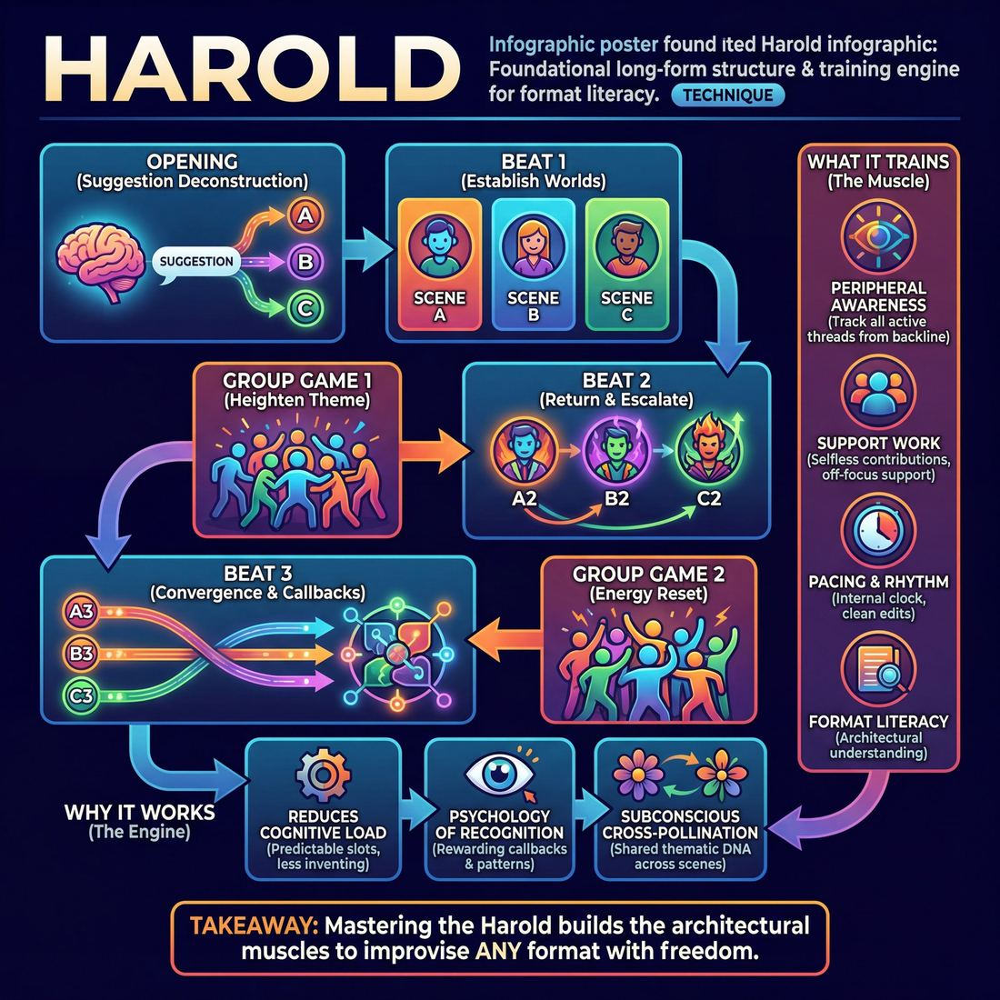

# 🎯 Harold

> *A drillable muscle that trains **Format Literacy**.*

{ .infographic }

## 🎯 The essence

The **Harold** is the foundational structure of modern long-form improvisation—a multi-beat format that weaves an opening, three distinct storylines, and energetic group games into a single cohesive piece, all derived from one audience suggestion. While it is widely performed as a signature show, at its core, the Harold is a rigorous training tool. 

It forces a player to practice thematic weaving and pattern recognition across a crowded stage. By requiring the ensemble to hold multiple narrative threads in their collective memory and connect them without pre-planning, it builds the ultimate muscle for format literacy and surrendering individual ego to the needs of the whole.

## 🎓 What it trains

The Harold is often described as the "scales and arpeggios" of long-form improvisation. While it is a performance format in its own right, its primary value lies in being a demanding training matrix. It exists to solve a fundamental problem for improvisers: the terrifying void of an empty stage and a ticking 25-minute clock. Without a script, improvisers often panic, scenes meander, and ensembles fracture into individuals fighting for the spotlight. 

The Harold solves this by providing a rigid scaffold. It forces players to look up from their individual scenes and take responsibility for the entire show, directly building **Format Literacy** and serving the ultimate domain goal: **The Ensemble**.

By practicing the Harold, improvisers isolate and drill several critical muscles:

*   **Suggestion Deconstruction:** It trains the brain to move past the first, most obvious association (the "A" idea) to mine a single word for its richest, most playable thematic angles (the "C" ideas).
*   **Peripheral Awareness:** Because the format requires scenes to return in second and third beats, players cannot tunnel-vision on their own work. They must actively track all active threads, characters, and details while standing on the backline.
*   **Support Work:** The Harold demands group games and second-beat walk-ons. It builds the instinct to enter a scene *only* when it needs something, to provide off-focus support, and to surrender individual glory to elevate the piece.
*   **Pacing & Rhythm:** It develops an internal clock. Players learn to recognize when a scene has hit its peak, how to execute clean edits, and how to manage the breathing energy of a long-form set from the opening to the final blackout.

!!! abstract "Key idea"
    You do not learn the Harold just to perform the Harold. You learn it to internalize structure, pacing, and callback mechanics. Once an ensemble has mastered the discipline required to weave three disparate storylines together, they possess the architectural muscles to successfully improvise *any* format.

## 💡 Why it works

The Harold is often called the "training wheels" of long-form, but it is more accurately a psychological and structural engine. It works by taking the daunting prospect of a half-hour blank stage and applying a framework that paradoxically creates total creative freedom. 

Under the hood, the Harold exploits several powerful cognitive and group dynamics:

*   **Managing Cognitive Load:** By dividing a long show into predictable, discrete slots (an opening, three scenes, a group game, etc.), the Harold drastically reduces the pressure to invent. Improvisers do not have to ask, *"What do we do with the next twenty minutes?"* They only have to ask, *"What does this specific slot need right now?"* 
*   **The Psychology of Recognition:** The human brain is a pattern-recognition machine that rewards us with dopamine when we spot a connection. By returning to the same three worlds in subsequent **beats** (Beat 2 and Beat 3), the Harold shifts the improviser’s task from *inventing* (which is exhausting) to *escalating* (which is exhilarating). The audience feels a thrill of recognition the moment a familiar character walks back on stage.
*   **Subconscious Cross-Pollination:** Because every scene is generated from the same initial **Opening**, the entire show shares a hidden thematic DNA. Even if the scenes seem entirely unrelated in the first beat, the ensemble's shared headspace guarantees that ideas, philosophies, and motifs will naturally bleed across scenes. 
*   **Distributed Pressure:** No single scene has to carry the weight of the entire show. If Scene 1A struggles to find its footing, Scene 1B can bring high energy, or the subsequent **Group Game** can reset the stage entirely. 

!!! abstract "The Paradox of Structure"
    The rigid rules of the Harold—knowing exactly when to edit, when to play a group game, and when to return to a scene—act as a safety net. When the ensemble no longer has to worry about *form*, they can pour 100% of their mental energy into *content*, allowing for deeper listening, richer character work, and fearless play.

!!! note "The Illusion of Genius"
    When three seemingly disparate storylines suddenly converge in the third beat, audiences often gasp, assuming the improvisers planned it all along. The Harold works because it manufactures this "genius" organically. If you put three parallel tracks in motion from the same starting point, they will inevitably collide.

## 🧩 The setup

Here is everything you need to arrange before your ensemble steps on stage. Because this structure demands high-level group mind, a clean, disciplined physical setup is essential.

*   **Players & Arrangement:** An ensemble of 6 to 8 players. When not actively in a scene or a group game, players must stand on the **backline** (the upstage edge of the performance space) or in the wings. They must remain visible, attentive, and physically neutral, maintaining active peripheral awareness of the stage.
*   **Space & Materials:** A clear, open stage. Place two to four armless chairs on the backline or just offstage, easily accessible for quick scene setups. No other props or materials are needed. 
*   **Time:** A standard Harold runs 25–30 minutes. For a training session, allocate at least 45–60 minutes total per run to allow for a thorough, beat-by-beat debrief. *(Note: If drilling specific muscles, you can run 12-minute "Turbo Harolds" to increase reps).*
*   **Roles:** 
    *   **The Ensemble:** Every player shares equal responsibility for initiating scenes, providing off-focus support, and executing edits. There are no designated "stars" or "directors" on stage.
    *   **The Facilitator/Coach:** Sits in the audience (the "house") with a notebook. For novices, the coach may actively side-coach edits (e.g., calling "Sweep!"). For competent players, the coach remains entirely silent, letting the team navigate their own pacing until the final blackout.
*   **Prerequisites:** Before attempting a full Harold, players must be proficient in grounded two-person scenes, basic editing techniques (specifically the **Sweep Edit** and the **Tag-Out**), and Suggestion Deconstruction.

!!! tip "Facilitator Script: How to introduce it"
    "Today we are going to run a Harold. We will take a single, non-geographical suggestion from the audience and deconstruct it together in an opening. From the ideas generated in that opening, we will pull premises for three distinct, two-person scenes—these are our First Beats. 
    
    We will separate our scene beats with group games, and then return to our scenes for Second and Third Beats. As we progress, allow the themes, characters, and ideas from different scenes to weave together organically. Do not force the connections and do not pre-plan how it ends. Trust your scene partners, support invisibly, and let the structure do the heavy lifting. Let's get a word."

## ⚙️ The mechanics

!!! abstract "The Core Objective"
    The Harold is a structural container designed to turn a single audience suggestion into a cohesive piece of improvised theater. The objective is not to tell one long story, but to explore a theme through multiple fragmented lenses—three distinct scenes and ensemble games—that eventually weave together into a unified whole.

The classic "Training Wheel" Harold follows a strict, symmetrical architecture. While advanced teams bend these rules, learning the mechanics requires adhering to this precise flow of play.

### The Flow of Play

**1. The Opening (Suggestion Deconstruction)**
The ensemble gets a single word from the audience. Instead of immediately starting a scene, they stay on stage to deconstruct the word. Through monologues, word association (a **Pattern Game**), or physical movement, the team generates a web of themes, characters, and premises. 

**2. First Beat (Scenes 1A, 1B, 1C)**
The ensemble steps back, and players initiate three distinct, unrelated scenes. 
*   **Scene A:** Establishes the first world and comedic game.
*   **Scene B:** Establishes a completely different world, tone, and game.
*   **Scene C:** Establishes a third distinct world.
*(Note: All three scenes draw their inspiration from the ideas generated in the Opening, not directly from the raw suggestion.)*

**3. First Group Game**
The entire ensemble returns to the stage. This is a palate cleanser—a commercial parody, a scenic montage, or an abstract physical game. It breaks the rhythm of two-person scenes and explores the overarching theme from a new angle.

**4. Second Beat (Scenes 2A, 2B, 2C)**
The ensemble returns to the three original worlds, strictly in the same A-B-C order. The objective here is **heightening**. Players do not just continue the plot; they escalate the comedic game established in the first beat. This is often done via a **Time Dash** (jumping forward or backward in time) or an **Analogous Situation** (putting the same characters in a new environment that triggers the same behavior).

**5. Second Group Game**
Another full-ensemble piece. This game is typically faster, higher-energy, or more structurally rigid than the first, serving to accelerate the momentum of the show.

**6. Third Beat (The Convergence)**
The rigid A-B-C structure dissolves. The pacing accelerates rapidly. This is where the magic happens: characters from Scene A might walk into Scene C's environment. Thematic threads collide. Scenes become shorter and punchier, culminating in a final, high-energy moment that synthesizes the entire piece.

### Rules & Constraints

To keep this complex machine running, players rely on strict mechanical constraints:

*   **The Sweep Edit:** Because there is no director, players transition between scenes using a **Sweep**. A player on the backline runs decisively across the downstage line, visually "wiping" the stage clean. The current players exit, and the players for the next beat immediately step forward.
*   **The Backline as Active Participants:** When not in a scene, players stand on the backline. This is not a waiting area; it is an active observation deck. Players must track the "Who, What, Where," and the core comedic game of every scene so they can initiate the Second Beat or provide support.
*   **Support Work:** Players on the backline can enter a scene to provide a **Walk-on** (playing a minor character to add information) or a **Tag-out** (tapping a player's shoulder to replace them, usually to show a different time or location, before tagging the original player back in). 

!!! tip "On stage: Trust the Order"
    In the Second Beat, if you were in Scene B, you must wait for Scene A to be edited before you step out. If the stage is swept and nobody steps out for Scene B, the structure collapses. **Know your letter.**

### How the Round Ends
The Harold does not have a pre-planned ending. The piece concludes when the ensemble collectively recognizes a peak moment of convergence in the Third Beat—often a callback that perfectly ties the disparate worlds together. A player (or the lighting improviser in a theater) calls "Blackout," and the ensemble steps forward to bow.

## 🎬 Sample round

!!! example "In a scene: The 'Bicycle' Harold"
    Because a Harold unfolds over 25 to 30 minutes, this beat sheet condenses a full performance to show how the mechanics of generation, heightening, and weaving operate in practice.
    
    **The Suggestion:** "Bicycle"
    
    **The Opening**
    The ensemble steps forward to deconstruct the word. 
    *Player 1:* "The wind in your hair, the bugs in your teeth."
    *Player 2:* "I didn't take my training wheels off until I was fourteen. I liked the stability."
    *Player 3:* "It's all about balance. If you stop moving, you fall over."
    *(The team extracts core themes: forced stability, momentum, and childhood milestones).*
    
    **First Beats (Establishing the worlds)**
    *   **1A (Theme: Forced stability):** A mother and father are at a car dealership, aggressively insisting the salesman install "training wheels" on their 25-year-old son's new Honda Civic.
    *   **1B (Theme: Momentum/Bugs):** Two bugs on a windshield treat their impending doom like an extreme sport. "Keep moving, bro! Feel the G-force!"
    *   **1C (Theme: Childhood milestones):** A high-stakes negotiation between a kid and the Tooth Fairy, who refuses to pay out because the kid knocked the tooth out in a bike crash, violating the "natural loss" clause.
    
    **First Group Game**
    The whole cast creates a chaotic, rhythmic "Tour de France" peloton, but they are gossiping like middle-schoolers about who is drafting off whom.
    
    **Second Beats (Heightening the premises)**
    *   **2A:** The parents are now at the son's first date, sitting at the next table, trying to cut his steak for him. *(Heightening the behavior: the parents' overreach).*
    *   **2B:** The extreme-sport bugs are now on a space shuttle during atmospheric re-entry. "This is the ultimate windshield, bro!" *(Heightening the context: bigger stakes, same dynamic).*
    *   **2C:** The kid is now trying to sell a jar of appendixes and tonsils to the Tooth Fairy on the black market. *(Heightening the stakes: the kid's hustle).*
    
    **Second Group Game**
    A quiet, abstract scene: players become the gears and chain of a bicycle, making rhythmic clicks and whirrs that slowly grind to a halt as someone forgets to oil them.
    
    **Third Beats (The Weave)**
    The boundaries between scenes dissolve as the pacing accelerates. The 25-year-old son (1A) tries to escape his overbearing parents by jumping into the space shuttle (2B), but the extreme bugs tell him he needs to lose his "training wheels" to survive re-entry. He crashes the shuttle, knocking out a tooth. The black-market Tooth Fairy (1C) arrives to collect it. The parents rush in to protect him, but he finally stands up to them: "I have to crash on my own!" 
    *(The lights fade to black on the peak of the resolution).*

## 🎚️ Variations & progressions

The Harold is not a rigid cage; it is a flexible framework that can be scaffolded for beginners or blown wide open for veterans. By adjusting the structure, you can isolate specific muscles—from basic scene initiation to advanced thematic weaving.

### 📈 The Progression Path

To build an ensemble's capacity without overwhelming them, scale the format's complexity alongside their maturity.

*   **The Half-Harold (Novice to Advanced Beginner)**
    *   *The Structure:* Opening $\rightarrow$ Scenes 1A, 1B, 1C $\rightarrow$ Group Game $\rightarrow$ Blackout.
    *   *The Focus:* Novices naturally tunnel-vision on their own scenes and play the most obvious associations. The Half-Harold removes the cognitive load of remembering scenes for a second or third beat. It isolates the muscles of Suggestion Deconstruction and executing clean, decisive edits.
*   **The Classic Strict Harold (Competent)**
    *   *The Structure:* The traditional 3x3 grid (Opening $\rightarrow$ 3 Scenes $\rightarrow$ Group Game $\rightarrow$ 3 Second Beats $\rightarrow$ Group Game $\rightarrow$ 3 Third Beats).
    *   *The Focus:* This forces the ensemble to track all active threads. Players must practice Support Work by choosing to enter *only* when a scene needs something, and they must learn to edit *at the right moment* rather than letting scenes run long. 
*   **The Organic Harold (Proficient to Master)**
    *   *The Structure:* The rigid A-B-C scene order dissolves. Scenes might bleed into one another, a group game might erupt in the middle of a two-person scene, and beats return thematically rather than sequentially.
    *   *The Focus:* The ensemble now sees the entire show as one organism. Pacing and rhythm breathe naturally. Edits happen invisibly, arriving on the exact peak of a scene, and off-focus support elevates the piece without pulling focus.

!!! warning "Watch out: The 'Organic' Excuse"
    Ensembles often try to play an Organic Harold before they have mastered the Classic Harold, using "organic" as an excuse for sloppy tracking, missed edits, and forgotten scenes. You must know the rules perfectly before you can successfully break them.

### 🎭 Opening Variations

The opening is the engine of the Harold. Swapping the opening changes the flavor of the entire piece, training different methods of generation.

| Opening Variant | How it works | What it trains |
| :--- | :--- | :--- |
| **The Pattern Game** | A structured web of word association, moving from the suggestion to tangential ideas, and back again. | Group mind, active listening, and finding the non-obvious ("C") premise. |
| **The Invocation** | The team speaks *about*, *to*, and finally *as* an object or concept (e.g., "It is a toaster" $\rightarrow$ "You heat my bread" $\rightarrow$ "I burn what you love"). | Heightening, emotional commitment, and discovering strong character points of view. |
| **The Monologue** | One player tells a true, grounded, personal story inspired by the suggestion. | Grounding the absurd, pulling thematic inspiration rather than literal plot points. |

### 🦇 Extreme Format Variants

For advanced ensembles looking to stress-test specific skills, these extreme variants isolate and overload particular muscles:

*   **The Bat:** The entire Harold is performed in pitch blackness. Players cannot rely on visual cues, staging, or physical walk-ons. It forces absolute mastery of Peripheral Awareness through audio alone, demanding intense listening, distinct character voices, and flawless verbal edits.
*   **The Sybil:** A solo Harold. One improviser performs the opening, plays all characters in all scenes, executes their own edits (often through physical sweeps or turning in place), and weaves the threads together. It is the ultimate test of tracking, pacing, and character differentiation.

!!! tip "On stage: The 'Premise-Only' Drill"
    If your team is struggling to pull ideas from the opening, run a drill where you do the Opening, and then immediately initiate scenes 1A, 1B, and 1C—but call "Scene!" after just three lines of dialogue. This forces players to establish the *who, what, and where* immediately, directly tying their initiation to the opening's deconstruction.

## 🧑‍🏫 Coaching notes

When coaching the Harold, your primary job is to act as the team's external pacing and structure monitor until they internalize the rhythm themselves. Because the format is highly structured, players often get trapped in their heads trying to "do the Harold right." Your side-coaching must pull them back into the present moment.

!!! tip "Coaching: The Golden Cue"
    **"Play the scene, not the format."** 
    When players panic about how a second beat should work or how to tie threads together, they stop listening. Remind them that the structure is a safety net, not a straitjacket. If they focus on playing a grounded, truthful scene with a clear game, the Harold will naturally take care of itself.

Here is what to look for and call out during the different phases of the piece:

**During the Opening**
*   **"Generate, don't evaluate!"** Push the team to brainstorm freely. If they latch onto the very first, most obvious association, coach them to push further: *"Give me the 'C' premise. What's three steps away from that word?"*
*   **"Listen to the group."** Watch for players trying to dominate the opening. Encourage them to build on each other's ideas rather than introducing entirely new, disconnected thoughts.

**During First Beats (1A, 1B, 1C)**
*   **"Ground it."** Ensure the **Base Reality** (who, what, where) is established early. Players often rush to be funny because they feel the pressure of the format.
*   **"Find the game."** Once the unusual thing happens, coach them to play with it. *"If that's true, what else is true?"*
*   **"Edit!"** Novice teams let first beats run too long. Call out *"Sweep!"* the moment the scene hits its first clear peak or laugh. Train their internal clock.

**During Group Games**
*   **"Share the focus."** The group game is about ensemble mind. If one player is driving too hard, coach: *"Follow the follower,"* or *"Support, don't steal."*
*   **"Break the pattern."** Ensure the group game feels distinctly different in energy and staging from the two-person scenes that preceded it.

**During Second Beats (2A, 2B, 2C)**
*   **"Heighten, don't repeat."** A common pitfall is simply doing the exact same scene again. Coach them to take the established game to a new location, time, or relationship: *"Same game, new context!"*
*   **"Use the opening."** If they are stuck, remind them to pull a fresh idea or theme from the opening to inject into the second beat.

**During Third Beats (3A, 3B, 3C)**
*   **"Pace, pace, pace!"** Third beats should be fast, punchy, and energetic. Coach them to get in, hit the game hard, and get out.
*   **"Look for the collision."** Encourage players to merge characters or themes from different beats. *"Bring character A into world B!"* 

!!! warning "Watch out: Forced connections"
    As a coach, do not let players shoehorn characters together just to "tie it up in a bow." If a connection doesn't make sense for the reality of the scenes, it will feel cheap. Coach them to let connections emerge organically from the themes, rather than forcing a literal crossover.

**On Support Work (Walk-ons and Tag-outs)**
Monitor the sidelines. If players are entering just to get stage time, pull them back. Coach them to enter *only* when the scene needs something. *"What does this scene need right now? Give it that, then leave."*

## 🧭 Debrief & reflection

After a Harold, the temptation is to forensically dissect the structure—who missed a beat, who forgot a character's name, or which scene went off the rails. A strong debrief shifts the focus away from the *math* of the form and back to the *muscle* of the ensemble. 

To lock in the learning, guide the cast to reflect on their listening, support, and thematic awareness.

**Questions to ask the ensemble:**

*   **On Suggestion Deconstruction:** "Did we play the first, most obvious association from the opening, or did we successfully pull a non-obvious 'C' premise?" 
*   **On Peripheral Awareness:** "What overarching theme or philosophy emerged across the three beats?" and "When did you first notice that two different scenes were actually exploring the same idea?"
*   **On Support Work:** "Name a moment where a teammate supported you invisibly—giving your scene exactly what it needed without stealing focus."
*   **On Pacing & Rhythm:** "How did our edits feel today? Did we catch the scenes at their peak, or did we let them run long and miss the exit?"

**What a good debrief surfaces:**
A productive reflection reveals where the team sits on the maturity spectrum. Novice players will often tunnel-vision on their own scenes, apologizing for "messing up" the structure or missing a callback. As the ensemble approaches competence and proficiency, the debrief naturally shifts toward the group mind. Players will start pointing out off-focus support moves, celebrating how a teammate elevated their premise, and recognizing how the entire show breathed as a single organism.

!!! tip "Handling the 'Trainwreck' Harold"
    Every improviser has been in a Harold that completely collapses under its own weight. When this happens, **do not dissect every mistake**. The cognitive load of the form is already high. Instead, ask: *"What is one single moment of connection we actually achieved?"* and *"What is the one specific muscle—just one—we are going to focus on in the next rep?"*

## ⚠️ Common pitfalls

!!! warning "Watch out: Playing the math, not the scene"
    The single biggest trap of the Harold is letting its structure crush your scene work. Under the immense cognitive load of tracking three distinct storylines, group games, and an opening, improvisers often get "in their heads." They stop listening to their partner and start calculating: *"How do I bring back the toaster from scene 1A?"* 
    
    **The fix:** Trust the structure to hold you. When you step out for a scene, forget the rest of the Harold. Play the reality of the two people on stage right now. The thematic connections will emerge naturally if you just do good, grounded scene work.

Beyond the cognitive overload, several specific traps catch teams as they learn the format:

*   **Forced connections (Shoehorning):** Novices often feel pressure to tie everything together too early. They will drag a character from Scene 1A into Scene 1B, or awkwardly force the opening suggestion into a line of dialogue just to prove they remembered it. 
    *   *The fix:* Keep your worlds separate in the first and second beats. A second beat is simply a heightening of the game or dynamic of the first beat, not a crossover episode. Save the weaving for the third beat—and even then, only if it happens organically.
*   **The "polite" edit:** Because players on the backline are trying to figure out what a scene is about, or waiting for a magical "Harold connection" to happen, they let scenes run painfully long. The energy dies, and the pacing drags.
    *   *The fix:* Edit aggressively. As soon as the game is established and heightened, or on the first solid laugh, run across the stage for a Sweep Edit. A premature edit is always better than a late one.
*   **Steamroller support:** In an eagerness to help, players will initiate walk-ons or tag-outs that grab focus rather than serving the existing scene. They enter with their own funny idea, derailing the primary players.
    *   *The fix:* Practice invisible support. Enter only when the scene is missing something specific (a physical object, a piece of information, a heightening move), deliver it, and immediately exit. 
*   **Group game chaos:** The transition from two-person scenes to a full-cast group game often results in everyone talking at once, with no clear focus or shared premise.
    *   *The fix:* Treat the group game like a single organism. Establish a clear, simple pattern (like a commercial, a chorus, or a physical game) and surrender your ego to it. If someone establishes a rhythm, match it immediately rather than inventing a new one.

## 🌟 What mastery looks like

When a team masters the Harold, the format itself disappears. It no longer looks like a rigid mathematical grid of "three scenes, a group game, three scenes." Instead, it feels like a single, breathing piece of theater. The structure becomes an invisible scaffold that supports pure ensemble play.

At the master level, you will observe these distinct behaviors on stage:

*   **The show as a single organism:** Players no longer tunnel-vision on their own scenes or track threads as isolated math problems (1A, 1B, 1C). They track the thematic resonance of the entire piece. Connections between the first beat and the third beat happen effortlessly—not through forced, mechanical callbacks, but because the whole team is exploring the same core philosophy.
*   **Ego-less, invisible support:** Master improvisers provide off-focus support that elevates the primary scene without ever drawing focus. They provide the exact sound effect, physical architecture, or walk-on line that is missing, and then immediately recede. Ego is fully surrendered to the ensemble; a player might spend an entire show making others look brilliant without ever taking center stage.
*   **Thematic alchemy:** The opening transforms a single, mundane suggestion into a rich tapestry of premises. The team doesn't just play the first obvious association; they mine the suggestion for its richest angles, turning any single word into a premise the entire team understands and can run with.
*   **Cinematic, peak editing:** The pacing breathes. Edits arrive at the exact peak of a scene—whether that is a massive laugh, a moment of high tension, or a poignant silence. The audience never consciously notices the mechanics of a sweep or a tag-out; they only feel the satisfying, inevitable rhythm of the show.

!!! abstract "The Invisible Scaffold"
    In a novice Harold, the audience sees the scaffolding: they can count the beats and see the players thinking about what comes next. In a master-level Harold, the scaffolding vanishes. The audience simply experiences a cohesive, deeply connected play that seems impossible to have been made up on the spot.

## 🔗 Why it matters

The Harold is the ultimate crucible for **The Ensemble**. To successfully execute this technique, an improviser must completely surrender their ego to the piece. You cannot "win" a Harold by yourself; it demands that players perceive what is happening across multiple scenes, support their castmates invisibly, and weave disparate threads together without pre-planning. It forces a team to operate as a single, breathing organism rather than a collection of funny individuals waiting for their turn to speak.

As a training tool for Format Literacy, the Harold acts as the Rosetta Stone of long-form improvisation. Because it contains every fundamental architectural element of a show—an opening, isolated scene beats, group games, and converging callbacks—learning the Harold teaches you how to read and navigate *any* structure. 

Once a team understands the rhythm of returning to a "Beat 2" or the function of a palate-cleansing group game, they possess the structural vocabulary to tackle an Armando, a Slacker, a Deconstruction, or a completely improvised one-act play. 

!!! abstract "The Bridge to Show-Level Thinking"
    Ultimately, the Harold shifts an improviser’s perspective from the micro to the macro. It elevates a player from **scene-level thinking** (*"How do I make this three-minute interaction work?"*) to **show-level thinking** (*"How does this scene serve the thematic whole?"*). 

Even if a team eventually abandons the strict structure of the Harold to perform their own custom formats, the muscles built here—tracking multiple storylines, pacing a thirty-minute piece, and trusting that disparate ideas will eventually connect—remain permanently embedded in their craft. It is the foundational workout that makes all other long-form structures possible.

## 📚 References & Further Reading

### Foundational sources
*   **Charna Halpern, Del Close, and Kim "Howard" Johnson, *Truth in Comedy: The Manual of Improvisation* (1994)** — The definitive text that introduced the Harold to the world. It outlines the format's original structure, the philosophy of "group mind," and the mechanics of building thematic connections across seemingly unrelated scenes. It is the primary source for understanding how to surrender individual ego to the needs of the ensemble.

### Practitioner guides & manuals
*   **Matt Besser, Ian Roberts, and Matt Walsh, *The Upright Citizens Brigade Comedy Improvisation Manual* (2013)** — A highly detailed, structural breakdown of the Harold. This manual is essential for understanding how to execute the format through the lens of the "game of the scene." It provides the definitive guide to the editing techniques required for the format (such as the Sweep Edit and the Tag-Out) and offers specific mechanics for executing first, second, and third beats.
*   **Mick Napier, *Improvise: Scene from the Inside Out* (2004)** — Offers a critical, revisionist perspective on rigid improv rules. Napier's work is highly useful for improvisers who feel constrained by the Harold's strict scaffolding. It teaches players how to address the terrifying void of an empty stage by prioritizing authentic, character-driven scene work over format mechanics.
*   **Will Hines, *How to Be the Greatest Improviser on Earth* (2016)** — Practical advice from a veteran UCB teacher on executing long-form structures. Hines focuses heavily on presence, authenticity, and navigating the mental habits required to succeed in a demanding, multi-beat format like the Harold without panicking or tunneling-visioning on your own ideas.
*   **Jason Chin, *Long-Form Improvisation & The Art of Zen: A Manual for Advanced Performers* (2009)** — Merges long-form techniques with Zen philosophy. Chin's book helps advanced players navigate the complexities, ego-surrender, and cognitive demands of multi-beat formats, emphasizing flow, deep listening, and off-focus support.

### Lineage & teachers
*   **Del Close & Charna Halpern (iO Theater, formerly ImprovOlympic)** — The creators and primary developers of the Harold. They transformed it from a chaotic performance experiment into the foundational training tool for modern long-form improvisation in Chicago, using it to build ensemble trust and subconscious cross-pollination.
*   **Upright Citizens Brigade (UCB)** — The theater and training center that codified the Harold into a strict, repeatable curriculum. By making "Harold Night" the centerpiece of their theaters in New York and Los Angeles, UCB standardized the format's pacing, editing, and callback mechanics, turning it into a rigorous drill for format literacy.

### Research & theory
*   **Clay Drinko, *Theatrical Improvisation, Consciousness, and Cognition* (2013)** — Examines the cognitive load and dual-process theory behind theatrical improvisation. Drinko's research helps explain the "Paradox of Structure" mentioned in the concept page—why rigid frameworks like the Harold actually free up the brain's cognitive resources, allowing improvisers to stop worrying about form and pour their mental energy into spontaneous play.
*   **R. Keith Sawyer, *Group Genius: The Creative Power of Collaboration* (2007)** — Explores how innovation and the "illusion of genius" emerge organically from collaborative groups. Sawyer draws directly on his research into jazz and improv ensembles to explain how distributed pressure and shared headspace create results no single individual could pre-plan.
*   **R. Keith Sawyer, *Improvised Dialogues: Emergence and Creativity in Conversation* (2003)** — A rigorous social-scientific study of Chicago improv theater. Sawyer analyzes how unscripted dialogue creates coherent, emergent structures, providing an academic lens on how improvisers use pattern recognition to weave disparate narrative threads together across a crowded stage.

### Talks, videos & courses
*   **Brian Stack, *Del Close Interview at CrossCurrents Cabaret* (1986)** — A rare, foundational cable-access interview where Del Close describes the early birth of the Harold. He discusses the goal of creating "art by committee" and how the format forces the group brain to function as a single entity to discover connections organically.
*   **UCB & iO *Harold Night* performances** — The long-running weekly live shows (and their archived livestreams) where the format is continually practiced, tested, and evolved by house ensembles. Watching these sets is the most direct way to study the pacing, rhythm, and peripheral awareness required to execute the structure from the opening to the final blackout.

## 💬 Quotes & Anecdotes

!!! quote "— Del Close, *Truth in Comedy* (1994)"
    Life is a slow Harold.

!!! quote "— Charna Halpern, *Truth in Comedy* (1994)"
    Harold is very economical — nothing is lost.

!!! quote "— Matt Besser, Ian Roberts, and Matt Walsh, *The Upright Citizens Brigade Comedy Improvisation Manual* (2013)"
    To me the game is only a structure, the same way that Harold's a structure. What makes Harold work is what you bring to Harold.

!!! quote "— Del Close"
    The Beatles called their haircut Arthur, so I'll call this Harold… Probably my most significant contribution and it's got that stupid name.

### Where it comes from
The Harold was first performed in 1967 in Concord, California, by the San Francisco-based improv group The Committee, which included Del Close. After performing a long, free-form improvisation about the Vietnam War at a local high school, the group was riding home in a Volkswagen bus and wondering what to call their new format. Member Bill Mathieu jokingly suggested "Harold"—a reference to a scene in the Beatles' film *A Hard Day's Night* where a reporter asks George Harrison what he calls his haircut, and Harrison deadpans, "Arthur." 

The format remained a chaotic, 45-minute free-form piece until the 1980s, when Del Close and Charna Halpern codified it at Chicago's ImprovOlympic (iO). They introduced the "training wheels" structure (three beats of three scenes, separated by group games) to help improvisers manage the chaos, popularizing it globally in their 1994 book *Truth in Comedy*.

### A telling example

**The "Peanut Butter and Chocolate" Collision**  
When Del Close first brought the Harold to Chicago, it was still a sprawling, chaotic free-form exercise that was often too messy for the stage. At the same time, Charna Halpern was directing short-form games, including one called the "Time Dash" (a three-part scene showing the same characters across different spans of time). 

When they combined forces, they realized that inserting Halpern's structured, multi-part games into Close's chaotic Harold provided the exact scaffolding the format needed. As Halpern recalled in *Truth in Comedy*: "Del and I felt like the people in the candy commercial who collide together. One says, 'You've got chocolate in my peanut butter!' The other replies, 'You've got peanut butter on my chocolate!' Hence, the birth of the Harold as it is known today."

**An Illustrative Harold**  
To see the Harold's "economy" in action, imagine a First Beat with three entirely separate scenes:
*   **1A:** Two astronauts bickering over a lost map.
*   **1B:** A stressed baker trying to create the perfect croissant.
*   **1C:** A nervous teenager taking a driving test.

In the Second Beat, the scenes heighten their individual games and relationships. But by the Third Beat, the thematic DNA crosses over: the teenager crashes the driving instructor's car into the bakery (merging B and C), and the baker's perfect, crescent-shaped croissant is revealed to be the "moon" the astronauts were looking for all along (merging A, B, and C). The audience gasps at the connection, even though the improvisers discovered it in real-time.

## 🧭 Explore the framework

- ⬆️ **Skill it trains:** [Format Literacy](04_S6__format-literacy.md)
- 🎭 **Domain:** [The Ensemble](04_D__the-ensemble.md)
- 🔁 **Sibling techniques:** [Armando](04_S6_T2__armando.md), [Montage](04_S6_T3__montage.md), [Longform vs. shortform mechanics](04_S6_T4__longform-vs-shortform-mechanics.md)
