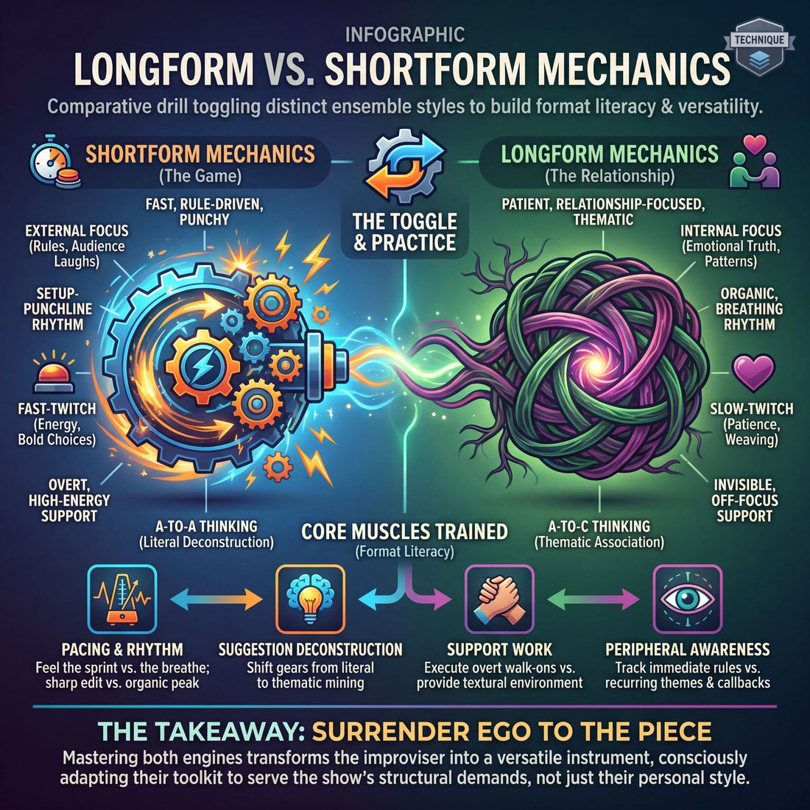

# 🎯 Longform vs. shortform mechanics

> *A drillable muscle that trains **Format Literacy**.*

{ .infographic }

## 🎯 The essence

The **Longform vs. Shortform Mechanics** drill is a comparative exercise where an ensemble plays the exact same scene premise twice: first using the fast, rule-driven, punchy engine of shortform, and then using the patient, relationship-focused, thematic engine of longform. By deliberately toggling between these two distinct styles, players isolate and practice **format literacy**—the ability to consciously adjust their pacing, editing, and support work to serve the specific structural demands of the show they are in.

!!! abstract "The Core Objective"
    To physically feel the difference between "playing the game" (shortform) and "playing the relationship" (longform), teaching the ensemble to consciously shift their collective rhythm and support mechanics on demand.

## 🎓 What it trains

Drilling these distinct mechanics side-by-side builds the improviser’s ability to recognize the structural container they are playing in and instantly adapt their toolkit to fit it. 

Improvisers often develop a "default speed." A strictly shortform player might rush a patient scene, hunting for immediate laughs and bailing before relationships can deepen. Conversely, a strictly longform player might drag down a fast-paced game with unnecessary subtlety, missing the required structural beats. Isolating and practicing both solves the problem of being a one-trick performer.

!!! abstract "The Core Muscle: Format Literacy"
    Format literacy is the ability to read the room, the rules, and the rhythm of a show, and deploy the right tools for that specific environment. It is the difference between knowing *how* to do a scene and knowing *what kind* of scene the show needs right now.

Practicing this contrast trains four specific, observable muscles:

*   **Pacing & Rhythm:** You learn to feel the difference between a scene that needs to sprint and a scene that needs to breathe. You train the muscle to edit sharply on a punchline versus editing organically on an emotional peak.
*   **Suggestion Deconstruction:** You practice shifting your brain's associative gears. You learn to take a suggestion literally for immediate recognition (**A-to-A thinking**), and how to mine it for non-obvious, thematic premises (**A-to-C thinking**).
*   **Support Work:** You learn the spectrum of ensemble support. You train to execute overt, high-energy walk-ons when a game demands it, and to provide invisible, off-focus support when a thematic piece needs texture.
*   **Peripheral Awareness:** You expand your focus from tracking the immediate rules of a three-minute game to tracking the recurring themes, callbacks, and overarching organism of a thirty-minute piece.

!!! note "Complementary, not contradictory"
    Think of shortform and longform mechanics like different weight machines in the gym. Shortform builds your fast-twitch muscles (energy, game-recognition, bold choices). Longform builds your slow-twitch muscles (patience, relationship, thematic weaving). 

Ultimately, mastering both sets of mechanics ties directly to the highest goal of **The Ensemble**: surrendering your ego to the piece. You stop forcing your personal style onto the stage and become a versatile instrument.

## 💡 Why it works

The engine under the hood of this technique relies on **comparative kinesthetic learning**—the psychological principle that we understand a state best by immediately experiencing its opposite. By forcing improvisers to rapidly toggle between styles, the abstract differences between the two become concrete, observable behaviors. 

This contrast exploits three core cognitive and group dynamics:

**1. Shifting the Locus of Attention**  
Shortform mechanics pull an improviser’s awareness *outward*. The cognitive load is spent tracking external rules: the gimmick of the game, a host's bell, or the audience's immediate laughter. Longform mechanics push awareness *inward*. The focus narrows to the relationship, emotional truth, and the unspoken patterns between characters. Toggling between them trains the brain to consciously choose where to place its attention rather than defaulting to panic.

**2. Exposing the Associative Muscle**  
When improvisers struggle with longform, it is often because they are using shortform suggestion deconstruction. Shortform thrives on literal A-to-A thinking (if the word is "pineapple," you eat a pineapple). Longform requires thematic A-to-C thinking ("pineapple" means "prickly on the outside, sweet on the inside," inspiring a scene about a tough biker with a heart of gold). Placing these mechanics side-by-side forces the brain to recognize which associative muscle it is currently flexing.

**3. Recalibrating the Edit**  
Shortform is built on a rhythm of setup-and-punchline; scenes are often ended externally by a host or a buzzer. Longform requires the ensemble to collectively sense the rhythm, breathe through silences, and execute an organic edit (like a **Sweep**, where a player runs across the downstage to wipe the stage clean) at the exact peak of the scene. 

!!! abstract "Key idea: Contrast creates clarity"
    You cannot fully grasp the patience required for a grounded longform scene until you have just sprinted through a high-octane shortform game. The friction between the two styles highlights the boundaries of both.

By isolating these mechanics, the technique removes the vague note to "slow down" or "play the game" and replaces it with a binary, physical shift in how the team operates.

!!! note "Ego and the Ensemble"
    This technique is a powerful tool for surrendering ego. In shortform mode, players are often rewarded for individual wit and "saving" the scene. Switching to longform mode immediately demands that they drop the armor of the joke, trust their scene partner, and let the scene build itself without pre-planning.

## 🧩 The setup

To effectively isolate and contrast these distinct muscles, this exercise operates as a "format toggle." The facilitator acts as a dial, forcing the ensemble to instantly switch their pacing, editing, and support mechanics on the fly.

*   **Players & Arrangement:** Full ensemble (6–12 players). Players begin in a traditional **backline** (a straight line across the upstage wall) or in the wings, ready to step forward and initiate or support.
*   **Space & Materials:** A clear stage with two standard armless chairs available downstage. A whiteboard is highly recommended to visually list the contrasting mechanics being drilled (e.g., *Sweep edit* vs. *Host wipe*; *Invisible support* vs. *Presentational walk-ons*).
*   **Time:** 20–30 minutes total. Run continuous 5–7 minute rounds so players experience multiple forced shifts in pacing and rhythm without stopping.
*   **Roles:**
    *   **The Ensemble:** Executes the scenes, actively shifting their toolset—how they edit, how they enter, how they treat the audience—based on the active mode.
    *   **The Facilitator:** Acts as the "format dial." Calls out the shifts between "Shortform" and "Longform," provides the initial **suggestion**, and occasionally steps in as a presentational "Host" to frame a shortform segment.
*   **Prerequisites:** Players should be at least Advanced Beginners (Stage 2) in Format Literacy. They must already know how to execute a clean walk-on/tap-in on instruction and perform a basic sweep edit on cue.

!!! tip "How to introduce it"
    "We are going to play a continuous montage, but I hold a remote control that switches the 'channel' between a high-octane shortform show and a patient, grounded longform set. 
    
    When I call out **'Shortform!'**, I want you to instantly shift your mechanics: play the most obvious association, use fast tags, break the fourth wall if it serves the game, and keep the energy punchy. 
    
    When I call **'Longform!'**, shift the gears down: ground yourselves in the relationship, look for organic edits, support invisibly from the backline, and let the pacing breathe. We aren't just changing the scene; we are changing the *machinery* of how we play."

## ⚙️ The mechanics

Rather than treating the two styles as entirely different art forms, this drill treats them as mechanical levers—adjusting pacing, support, and suggestion deconstruction on command. 

### The Mechanical Levers
Before running the drill, the ensemble must understand the observable differences in the mechanics they are about to manipulate:

| Mechanic | Shortform Engine | Longform Engine |
| :--- | :--- | :--- |
| **The Goal** | Hit the rules of the game and generate immediate laughs. | Discover the relationship and explore the behavioral pattern. |
| **Suggestion Deconstruction** | Plays the first, most obvious association (A-to-A/B). | Selects the non-obvious ("C") premise; mines for theme. |
| **Initiation** | High energy, immediate premise, often presentational. | Grounded, environmental, discovering the relationship. |
| **Pacing & Rhythm** | Fast, punchy, driving relentlessly toward a specific game or joke. | Patient, breathing; allows for silence and explores the "why." |
| **Support Work** | High frequency, highly visible. Walk-ons designed for quick laughs or heightening the gimmick. | Invisible or structural. Entering only when the scene needs something, then exiting. |
| **Editing** | Hard, fast, external edits on the biggest, most obvious laugh. | Nuanced, internal edits that arrive on a thematic peak or emotional shift. |

### The Flow of Play (The Toggle Drill)

**1. The Setup & Suggestion**
Two players take the stage. The coach gets a single, simple suggestion (e.g., "Bicycle"). 

**2. Round 1: The Shortform Sprint**
The coach calls, "Shortform—Go!" The players launch a strict 60-second scene. Their objective is to establish an immediate, absurd premise, play the most obvious association of the suggestion, and drive the pacing hard. The backline should be highly active, looking for quick tags or walk-ons to heighten the joke. The coach edits aggressively on the first major laugh.

**3. Round 2: The Longform Simmer**
The stage clears. The *same two players* return, using the *same suggestion*. The coach calls, "Longform—Go!" This time, the scene runs for 3 to 4 minutes. Players must initiate with a grounded environment and focus entirely on the relationship. The backline must practice **Peripheral Awareness**, tracking active threads and choosing to enter *only* to support the base reality or elevate the existing dynamic. 

**4. Round 3: The Mid-Scene Toggle (The Core Loop)**
Two new players take the stage with a new suggestion. They begin a scene. Every 30 to 60 seconds, the coach calls out either **"Shortform!"** or **"Longform!"** 
*   When "Shortform" is called, players instantly accelerate the pacing, heighten the absurdity, and the backline looks for immediate, punchy support.
*   When "Longform" is called, players must instantly ground the scene, justify the absurdity they just created, slow their rhythm, and focus on their emotional connection. 

!!! example "In a scene"
    **Suggestion:** "Coffee"
    *(Coach calls: "Longform!")*
    **Player A:** *(Miming wiping a counter slowly)* "I think we need to talk about the lease, Sarah. The roaster is breaking down again."
    **Player B:** "We've put ten years into this shop. I'm not letting a broken belt end it."
    *(Coach calls: "Shortform!")*
    **Player A:** *(Instantly heightening the stakes and pacing)* "You're right! I'm going to fix it with my bare hands!" *(Shoves hands into imaginary roaster, screams in exaggerated agony)*
    **Player B:** "Your hands are turning into espresso beans!"
    *(Coach calls: "Longform!")*
    **Player A:** *(Stops screaming, looks at hands with quiet devastation)* "I... I can't hold my daughter like this. What have I done to our family for this business?"

### Rules & Constraints
*   **Maintain the Base Reality:** During a mid-scene toggle, players cannot change their characters, their relationship, or their location. They are only changing the *engine* (pacing, stakes, and support style) driving the scene.
*   **Backline Compliance:** The backline must obey the toggle. If the coach calls "Longform," players waiting in the wings must immediately drop any plans for a cheap joke walk-on and shift to tracking the emotional threads.

!!! tip "On stage"
    When the coach toggles you from Shortform to Longform, the easiest way to mechanically shift gears is to **take a physical breath and touch your environment**. Silence and object work instantly ground a scene that was just flying off the rails.

### How a Round Ends
The drill ends when the coach calls "Scene" or performs a sweep edit. In advanced variations, the backline is tasked with editing the scene—requiring them to recognize whether they are currently in a "Shortform" phase (edit on the hard joke) or a "Longform" phase (edit on the emotional peak) and execute the sweep accordingly.

## 🎬 Sample round

!!! example "Sample round: The Suggestion is 'Dentist'"

    To see the mechanical shift in action, watch how an ensemble handles the exact same suggestion using the two different operational modes. 

    **Mode 1: Shortform Mechanics (High energy, quick premise, external edit)**
    *The host gets the suggestion "Dentist" and starts a quick scenic game.*
    
    * **Player A:** *(Miming a drill aggressively)* "Open wider, Mr. Smith! I need to fit my whole fist in there!"
    * **Player B:** *(Muffled screaming)* "Ahhh! You said this was just a cleaning!"
    * **Player A:** "I'm cleaning out your wallet! That'll be four thousand dollars!"
    * **Player C:** *(Claps loudly from the side)* "Freeze!" 
    * *Player C tags out Player A, assumes the aggressive drill posture, and initiates a new, unrelated premise.*
    * **Player C:** "I told you, the jackhammer is the only way to fix this pothole!"

    * **Mechanics in play:** The players use the first, most obvious association (**Suggestion Deconstruction**). The pacing is rapid, driving straight to the punchline, and the edit is a sharp, external cut dictated by a game rule (**Pacing & Rhythm**).

    ***

    **Mode 2: Longform Mechanics (Patient discovery, relationship, organic edit)**
    *The team takes the same suggestion, "Dentist", but deconstructs it to the theme of "dreading an inevitable pain."*
    
    * **Player A:** *(Sitting in a waiting room chair, nervously tapping a magazine)*
    * **Player B:** *(Enters, sits next to A, sighs heavily)* "They always make you wait just long enough to rethink your life choices."
    * **Player A:** "I've been staring at this *Highlights* magazine for twenty minutes. I'm a forty-year-old man, and I still can't find the hidden umbrella."
    * **Player B:** "It's in the tree. It's always in the tree." *(Pause)* "You nervous about the root canal, or just avoiding going back to the office?"
    * **Player A:** "A little of column A, a lot of column B."
    * *Player C walks across the downstage edge, wiping the stage to transition the scene directly to Player A's office.* 

    * **Mechanics in play:** The players select a non-obvious, thematic premise (**Suggestion Deconstruction**). They prioritize relationship and allow the scene to breathe with silence (**Pacing & Rhythm**). The edit is an organic **Sweep**, executed by a supporting player tracking the active thread to push the narrative forward (**Support Work**).

## 🎚️ Variations & progressions

To build **Format Literacy**, you must isolate the specific mechanics of shortform and longform before asking an ensemble to seamlessly blend or switch between them. Use these progressions to ramp up the cognitive load, moving players from basic, coach-directed shifts to intuitive, ensemble-driven mastery.

### 1. The Rapid Toggle (Advanced Beginner)
This variation isolates the mid-scene shift from Round 3 of the core drill, focusing purely on **Pacing & Rhythm**. Two players begin a scene. Every 30–60 seconds, the coach calls out either *"Shortform!"* or *"Longform!"* 
*   **On "Shortform":** Players instantly accelerate the pace, heighten the comedic game aggressively, turn their physical focus slightly out toward the audience, and drive toward a punchline.
*   **On "Longform":** Players immediately drop the tempo, ground their emotional reactions, turn their focus entirely to their partner, and prioritize relationship over the joke. 

!!! tip "On stage"
    Don't change the characters or the reality of the scene when the coach calls the toggle. Change the *engine* driving it. The same two characters arguing about a parking ticket can be played as a rapid-fire gag or a patient exploration of a failing marriage.

### 2. The Suggestion Split (Competent)
This drill isolates **Suggestion Deconstruction**. Take a single suggestion from the audience (e.g., "Bicycle").
1.  **The "A" Scene:** Two players immediately step out and perform a 60-second shortform scene using the most literal, obvious association (e.g., riding a bike, getting a flat tire). 
2.  **The "C" Scene:** The moment the first scene is swept, two new players step out and perform a 4-minute longform scene using a non-obvious, thematic association (e.g., the feeling of taking training wheels off, or a scene about someone who never forgets a grudge, playing on "it's like riding a bike").

### 3. The Edit Alternator (Proficient)
To train players to edit *at the right moment* and match the energy of the piece, run a montage where the **style of edit must strictly alternate** between shortform and longform mechanics.
*   **Scene 1:** Must end with a shortform edit (a high-energy, definitive sweep on a hard punchline).
*   **Scene 2:** Must end with a longform edit (a thematic tag-out, a slow organic transition, or a silent walk-across that changes the stage picture).
*   *Progression:* If a player uses the wrong edit style for that slot, the coach blows a whistle and the ensemble must justify the mistake and fix it in real-time.

!!! example "In a scene"
    If it is a "longform edit" slot, but a player accidentally runs across the stage with a high-energy shortform sweep, the next players must instantly match that high energy, perhaps starting their scene mid-sprint or mid-shout, rather than dropping back into a slow, patient start.

### 4. Form Inversion (Mastery Challenge)
For advanced ensembles who see the show as one organism, invert the mechanics entirely to test their **Support Work** and adaptability.
*   **Longform with Shortform Mechanics:** Perform a 15-minute Harold or montage, but every scene must be played at breakneck speed, feature direct audience address, and rely on obvious, literal associations.
*   **Shortform with Longform Mechanics:** Play a classic shortform gimmick game (like *Party Quirks* or *Freeze Tag*), but execute it with agonizing patience, deep emotional grounding, and invisible, off-focus support. No winking at the audience; treat the absurd rules with absolute dramatic sincerity.

## 🧑‍🏫 Coaching notes

When coaching the mechanics of longform versus shortform, your primary job is to act as the ensemble’s external dial. Because players often default to a single comfortable rhythm, you must actively push them to feel the stark contrast in pacing, support, and suggestion deconstruction between the two formats.

!!! tip "Coaching: The Metronome"
    The single most important cue when drilling these mechanics is **managing the internal clock**. 
    
    * For shortform, coach: *"Hit the game, find the button!"* 
    * For longform, coach: *"Breathe. Let the silence do the work."* 
    
    You are the metronome helping them feel the difference in time and urgency.

### Side-Coaching by Format

Use sharp, active side-coaching to keep players in the correct mechanical lane. If they blur the lines, call it out immediately.

**When drilling Shortform Mechanics:**
* *"First thought, best thought!"* — Pushes players to play the first, most obvious association rather than overthinking.
* *"Drive the game!"* — Reminds them to focus on the immediate comedic engine rather than deep character backstory.
* *"Sweep it!"* or *"Tag out!"* — Prompts a **Sweep** or a **Tag-Out** on cue, building muscle memory for fast, decisive edits.
* *"Big energy, take focus!"* — Encourages bold, explicit support work where entering players are meant to be seen.

**When drilling Longform Mechanics:**
* *"What's the 'C' premise?"* — Pushes them past the obvious association to find the third, more nuanced, thematic angle of a suggestion.
* *"Support invisibly."* — Coaches players to give exactly what the scene is missing (a sound effect, a chair, a background character) and then exit without stealing focus.
* *"Track the thread."* — Reminds the backline to maintain **peripheral awareness** of all active storylines, rather than tunnel-visioning on their own upcoming scene.
* *"Find the organic edit."* — Encourages them to wait for the scene's natural peak rather than rushing to cut it off.

### What 'Good' Looks Like (Observable Assessment)

You will know the ensemble is internalizing these mechanics when you observe distinct shifts in their physical and mental posture:

| Mechanic | Shortform "Good" (Observable) | Longform "Good" (Observable) |
| :--- | :--- | :--- |
| **Suggestion Deconstruction** | Players instantly generate and play the most direct, high-energy association without hesitation. | Players pause to mine the suggestion for its richest, most playable thematic angle before stepping out. |
| **Support Work** | Walk-ons and tag-outs are executed cleanly, sharply, and with the clear intent to heighten the immediate joke. | Off-focus support elevates others; players choose to enter *only* when a scene needs something, surrendering their ego. |
| **Pacing & Rhythm** | Scenes are punchy; edits happen rapidly and decisively on the laugh. | Pacing breathes; players allow for silence, and edits arrive on the exact emotional or thematic peak. |

!!! warning "Watch out for the 'Mush'"
    A common novice trap is playing everything at a medium pace with medium energy—too slow for shortform, too shallow for longform. If you see this "mush," stop the scene. Force them to the extreme end of whichever format you are currently drilling.

## 🧭 Debrief & reflection

After running drills that contrast these mechanics, the debrief should shift the ensemble’s focus from *what* they played to *how* the structural container changed their behavior. A strong debrief helps players recognize that while pacing and suggestion deconstruction differ wildly between the two styles, the underlying need for peripheral awareness remains constant.

**Questions for the Ensemble:**

*   **On Pacing & Rhythm:** "In the shortform rounds, how did the external game rules dictate your energy? In the longform rounds, without a host to call time, how did you know when it was the right moment to edit or sweep?"
*   **On Suggestion Deconstruction:** "Did you find yourself reaching for the immediate, obvious association (the 'A' choice) in shortform? How did you give yourself permission to find the non-obvious ('C') premise in longform?"
*   **On Support Work:** "When did a walk-on or tag-out feel like it was giving the scene exactly what it was missing, versus when did it feel like a grab for focus?"
*   **On Peripheral Awareness:** "During the longform montage, who was tracking the backline? Did you feel yourselves tunnel-visioning on the active scene, or were you anticipating where your teammates would go next?"

!!! abstract "The Core 'Aha' Moment"
    A successful debrief surfaces the realization that **shortform mechanics** often demand explosive energy, immediate stakes, and driving a specific gimmick, while **longform mechanics** require patience, thematic weaving, and trusting the organic discovery of the scene's game. 
    
    Crucially, players should walk away understanding that *both* formats demand the exact same level of ego-less support. The master improviser doesn't view one as "harder" than the other; they simply adjust their pacing and support tools to fit the organism of the show.

**Signs of Growth to Listen For:**
Listen for players moving past basic observations ("I liked that scene") to structural insights. You want to hear an advanced beginner say, *"I noticed the stage was getting crowded, so I stayed on the backline,"* or a proficient player note, *"I realized the scene didn't need another character; it just needed a sweep because the energy had peaked."*

## ⚠️ Common pitfalls

!!! warning "Watch out: The Format Bleed"
    The most common overarching mistake is applying the pacing of one format to the mechanics of the other. This looks like rushing to a frantic punchline in a patient longform set, or meandering through a slow, slice-of-life scene while ignoring the ticking clock of a shortform game. Respect the container you are playing in: shortform demands immediate game execution, while longform requires you to lay bricks before you build the house.

When improvisers are first learning to navigate the distinct mechanics of different formats, cognitive load spikes. Trying to remember the rules of a game, track callbacks, and maintain a character all at once often causes players to regress to novice habits. 

Here are the most common traps and how to fix them:

*   **The "Rescue" Walk-On**
    *   *The Trap:* A player senses a scene is slowing down and panics. Wanting to help, they enter to "save" it, but end up grabbing focus, introducing a wild new premise, and derailing the original players. 
    *   *The Fix:* Support invisibly. Enter only to provide exactly what the scene is missing—a physical prop, a quick piece of information, or a justification—and then exit. If you don't have a specific gift to give, stay on the backline and trust your teammates to find their way.
*   **The Missed Edit**
    *   *The Trap:* Letting a scene run long because the backline is waiting for the "perfect" joke to end on, or because they are too timid to initiate a sweep. The energy bleeds out, and the scene misses its natural exit.
    *   *The Fix:* Edit on the first clear peak, or the moment the scene's premise has been fully articulated and heightened once. A confident, early sweep is always better than a late, apologetic one. 
*   **Tunnel Vision Under Cognitive Load**
    *   *The Trap:* Overwhelmed by the sprawling callbacks of a longform piece or the strict gimmicks of a shortform game, players get "deer in the headlights" syndrome. They tunnel-vision on their own immediate lines, stop tracking the rest of the stage, and miss obvious offers.
    *   *The Fix:* Simplify and breathe. In shortform, return to the base reality and your relationship to your scene partner; the game will naturally follow. In longform, remember you don't have to hold the whole show in your head—trust the ensemble mind to track the threads you drop.
*   **The Literal Translation**
    *   *The Trap:* Hearing a suggestion like "pineapple" and immediately starting a scene in a grocery store buying a pineapple. Playing this first, most obvious association leaves the scene shallow and gives the players nowhere to go.
    *   *The Fix:* Deconstruct the suggestion. Move from the literal "A" idea (pineapple) to a "B" idea (a tropical vacation) or a "C" idea (a prickly, defensive character). Play the thematic premise, not just the literal word.

## 🌟 What mastery looks like

When an ensemble masters the mechanics of both longform and shortform, the artificial wall between the two styles dissolves. They no longer view shortform as "just jokes" or longform as "serious acting." Instead, they possess a complete, unified toolkit of pacing, support, and game-play that they can deploy at will, shifting gears instantly based on what the moment requires.

Here is what that mastery looks like in action, mapped to the core skills of this technique:

*   **Peripheral Awareness:** The improviser **sees the entire show as one organism**. Whether playing a rapid-fire shortform game or a sprawling longform montage, they track every active thread. They know exactly when the stage is crowded, when a scene needs a jolt of energy, and how their individual scene serves the overarching rhythm of the night.
*   **Support Work:** Their **ego is fully surrendered**. Masterful players provide off-focus support that elevates others. In shortform, this means perfectly setting up a teammate to deliver the winning punchline rather than taking it themselves. In longform, it means playing a silent, physical piece of scenery or a background character that makes the protagonist shine. They give exactly what is missing, and then they exit.
*   **Suggestion Deconstruction:** They can **turn any word into a premise the whole team can run**. If the format demands shortform, they instantly identify the most literal, high-energy, and immediately playable angle. If it demands longform, they mine the suggestion for its thematic depth, finding the non-obvious premise that can sustain a 30-minute piece.
*   **Pacing & Rhythm:** Their **edits are something the audience never consciously notices**. Because they anticipate where their teammates will go, they arrive on the exact peak of the scene. The pacing breathes naturally—allowing for silence and tension in longform, and driving relentless, escalating energy in shortform.

!!! example "In a scene"
    A master improviser is playing a shortform game that requires rapid, witty one-liners. They don't just stand in a line waiting for their turn; they actively listen, building on the previous player's joke to create an escalating pattern. 
    
    Later in the same show, during a longform set, that same improviser initiates a slow, grounded scene in complete silence, trusting the relationship and the environment to do the work. They haven't changed who they are as a performer; they have simply mastered the *mechanics* of both speeds.

## 🔗 Why it matters

Mastering the distinct mechanics of longform and shortform is the absolute bedrock of **Format Literacy**. An improviser cannot successfully navigate complex structures—whether a sprawling Harold or a tight TheatreSports match—if they do not first understand the fundamental differences in pacing, editing, and suggestion deconstruction required by different styles of play. Drilling these mechanics ensures that when the container changes, the improviser’s toolkit adapts instantly.

This adaptability directly serves the ultimate goal of **The Ensemble**: surrendering your ego to the piece. Serving the piece means playing the show the team agreed to play, rather than defaulting to your personal comfort zone. 

*   If the ensemble is executing a fast-paced, rule-bound shortform game, bringing slow, patient, longform relationship-building will kill the momentum and frustrate your scene partners. 
*   Conversely, treating a patient longform scene like a race to a punchline robs the ensemble of the grounded reality they need to weave a larger, unscripted piece. 

By isolating and practicing these mechanics, improvisers learn to respect the boundaries of the format. They learn that a shortform game demands economy, high energy, and precision, while a longform piece demands patience, thematic weaving, and trust in the unseen structure. 

!!! abstract "The Dual-Threat Improviser"
    The ultimate value of drilling both mechanics is synthesis. An improviser who masters both becomes a versatile powerhouse. They know how to inject punchy, shortform energy into a lagging longform set to wake up the audience, and they know how to bring grounded, longform relationship depth to a silly shortform game to give it stakes. They don't just know the rules of the container—they know how to use those rules to elevate the entire ensemble.

## 📚 References & Further Reading

### Foundational sources
*   **Keith Johnstone, *Impro for Storytellers* (1999)** — The definitive guide to shortform and Theatresports. Johnstone details the fast-twitch mechanics, audience interaction, and presentational energy required for game-based play, serving as the blueprint for the "shortform" half of this drill.
*   **Charna Halpern, Del Close, and Kim "Howard" Johnson, *Truth in Comedy: The Manual of Improvisation* (1994)** — The foundational text on modern longform (specifically The Harold). It emphasizes prioritizing the relationship over the joke, pattern recognition, and thematic A-to-C thinking—the exact slow-twitch muscles this exercise isolates.
*   **Viola Spolin, *Improvisation for the Theater* (1963)** — The origin of theater games. Spolin's focus on kinesthetic learning, physicalizing abstract concepts, and shifting the locus of attention away from the ego is the exact psychological engine that makes this comparative drill work.

### Practitioner guides & manuals
*   **Matt Besser, Ian Roberts, and Matt Walsh, *The Upright Citizens Brigade Comedy Improvisation Manual* (2013)** — Codifies the specific longform mechanics drilled in this exercise. It provides concrete vocabulary for "Game of the Scene," A-to-C associative thinking, and organic transitions like the sweep edit.
*   **Mick Napier, *Improvise: Scene from the Inside Out* (2004)** — Challenges rigid adherence to improv "rules," focusing instead on the internal mechanics of pacing, context, and how to consciously adjust your play style to serve the specific scene you are in.
*   **Will Hines, *How to Be the Greatest Improviser on Earth* (2016)** — Offers highly practical advice on pacing, slowing down, and the crucial difference between playing the grounded reality of a relationship (longform) versus rushing to play a comedic game (shortform).
*   **Rob Norman, *Improvising Now: A Practical Guide to Modern Improv* (2014)** — Provides actionable tools for navigating the stress of scene work, heightening ideas, and adapting to different structural demands on stage, directly supporting the goal of format literacy.

### Lineage & teachers
*   **iO Theater (Chicago)** — The birthplace of modern longform improvisation, where the patient, relationship-focused, and thematic mechanics of the Harold were developed as a direct counterpoint to the fast-paced games of the era.
*   **Theatresports and ComedySportz** — The institutional homes of shortform improvisation, responsible for codifying the fast-paced, rule-driven, and highly presentational mechanics used when the facilitator dials the ensemble into "shortform" mode.
*   **The Second City (Chicago/Toronto)** — The historical bridge where shortform theater games (via Spolin) were first stretched and woven into longer, relationship-based scenic revues, requiring actors to master the transition between punchy and patient play.

### Research & theory
*   **Charles J. Limb and Allen R. Braun, "Neural Substrates of Spontaneous Musical Performance: An fMRI Study of Jazz Improvisation" (*PLOS ONE*, 2008)** — A landmark neuroimaging study demonstrating that improvisation deactivates the dorsolateral prefrontal cortex (the inner critic) and activates the medial prefrontal cortex. This supports the drill's goal of dropping ego and shifting cognitive load through forced spontaneity.
*   **Daniel Kahneman, *Thinking, Fast and Slow* (2011)** — While not explicitly about improv, Kahneman’s psychological breakdown of System 1 (fast, automatic, literal) and System 2 (slow, deliberate, analytical) perfectly mirrors the cognitive shift improvisers must make between shortform’s A-to-A association and longform’s A-to-C thematic deconstruction.

### Talks, videos & courses
*   **Upright Citizens Brigade, *ASSSSCAT* (Live shows and 2005 DVD release)** — A masterclass in observing longform mechanics in action. Watching this cast demonstrates patient scene-building, invisible backline support, and organic sweep edits executed by a highly literate ensemble.
*   **Dan Patterson and Mark Leveson (Creators), *Whose Line Is It Anyway?* (1988–Present)** — The quintessential visual reference for shortform mechanics, showcasing fast-twitch pacing, presentational walk-ons, literal suggestion deconstruction, and host-driven external edits.

### Communities & adjacent reading
*   **Jimmy Carrane and Liz Allen, *Improvising Better: A Guide for the Working Improviser* (2006)** — Addresses the improviser as a whole, offering practical exercises for improving ensemble dynamics, repairing bad habits (like defaulting to a single speed), and shifting gears between different performance demands.

## 💬 Quotes & Anecdotes

!!! quote "— Joshua Funk, *Backstage* (2013)"
    Long form is one suggestion and then you improvise for 25 minutes, and in short form you are constantly coming to the audience for suggestions throughout the evening and treating each improv game as its own little three- or four-minute piece. [...] Another way to think of it is that long form is to jazz as short form is to pop.

!!! quote "— Matt Besser, *YayWithMe Interview* (2018)"
    Short-form is what you tell your mom improv is – like *Whose Line is it Anyway?* Long-form improvisation means we go for 30 minutes off of one word. There are lots of ways to deconstruct that one word and do scenes off of those scenes and it just builds and builds and builds.

!!! quote "— Del Close, *as quoted by Matt Besser* (2018)"
    Just because they're laughing doesn't mean you're doing it right.

### Where it comes from
The distinction between shortform and longform emerged as a defining schism in 20th-century improv. Shortform mechanics are rooted in the theater games of Viola Spolin and the competitive formats of Keith Johnstone (creator of Theatresports, which heavily influenced *Whose Line Is It Anyway?*). Longform was pioneered by Del Close and Charna Halpern in Chicago. Frustrated by the quick, joke-heavy resets of shortform, they developed "The Harold" at ImprovOlympic (iO) to prove that an ensemble could generate a cohesive, 30-to-40-minute piece of thematic theater from a single suggestion, relying on "group mind" rather than gimmicks.

### A telling example
To see the "Format Toggle" drill in action, imagine an ensemble given the suggestion "Dentist."

**Shortform mode:** The players immediately launch into a fast-paced game. Player A says, "Ah, my tooth hurts!" Player B says, "Bite down on this drill." The focus is entirely outward: hitting the rules of the game, delivering rapid-fire jokes, and keeping the energy high. The scene is punchy, literal (A-to-A thinking), and ends quickly on a laugh.

**The Facilitator calls "Longform!":** The players instantly drop the gimmick and shift their locus of attention inward. The pacing slows. Player A is now a dentist silently, meticulously organizing their tools. Player B is a nervous patient staring at the ceiling. Player A says, "You haven't been flossing, David." Player B replies, "I've been distracted since the divorce." 

The scene shifts from hunting for an immediate punchline to exploring the emotional reality of the relationship. By physically experiencing this contrast back-to-back, the improvisers feel the exact difference between playing the game and playing the truth.

## 🧭 Explore the framework

- ⬆️ **Skill it trains:** [Format Literacy](04_S6__format-literacy.md)
- 🎭 **Domain:** [The Ensemble](04_D__the-ensemble.md)
- 🔁 **Sibling techniques:** [Harold](04_S6_T1__harold.md), [Armando](04_S6_T2__armando.md), [Montage](04_S6_T3__montage.md)
