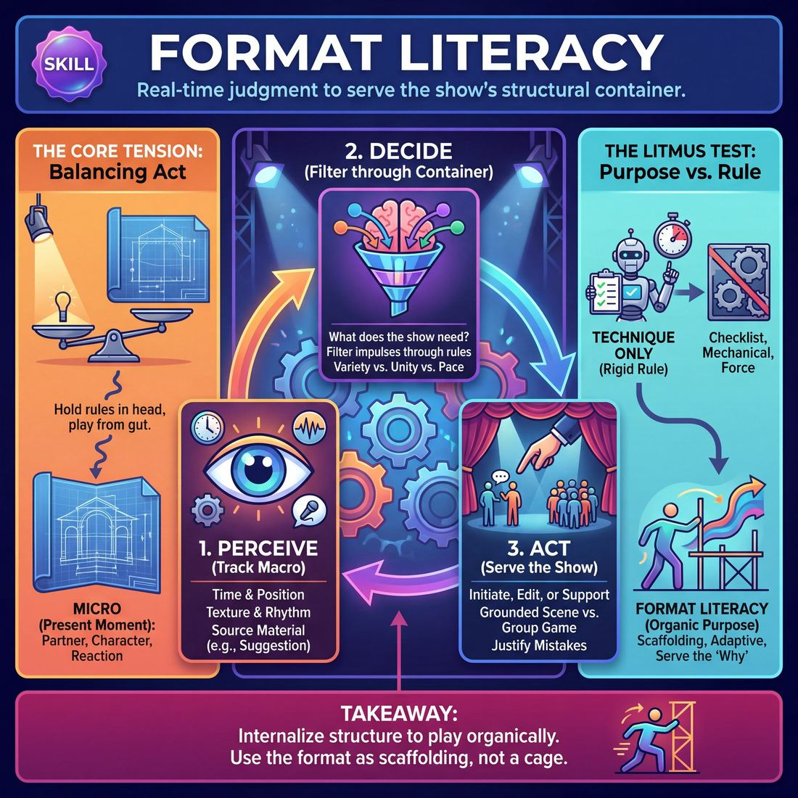

# 🧠 Format Literacy

> *The judgment of which technique to use, when, and how much.*

{ .infographic }

## 🧠 What it is

**Format Literacy** is the real-time judgment of how to serve the structural container of your show. Every improv format—whether a sprawling **Harold** (a multi-beat, interwoven longform), a thematic **Armando** (scenes inspired by true monologues), a rapid-fire **Montage** (a free-flowing series of unconnected scenes), or a tightly ruled shortform game—has its own distinct rhythm, rules, and architectural needs. 

This skill is the improviser’s internal compass. In the moment, it represents the decision of *what the piece requires right now* to fulfill its promise. It is the judgment to know whether the current beat demands a grounded, patient relationship scene, a high-energy group game, or a sweeping edit to tie two disparate narrative threads together. You are reading the blueprint of the show while actively building the house.

This is genuinely difficult because it demands a split attention that often feels contradictory. An improviser must be entirely present in the **micro**—listening intently to their partner, reacting honestly, and playing their character—while simultaneously tracking the **macro** of the entire piece. It is a delicate balancing act. If you focus too heavily on the format, your scenes become mechanical, lifeless, and "mathy" as you force structural connections that haven't been organically earned. Conversely, if you focus entirely on the immediate scene and ignore the format, the show loses its shape, bleeding into an aimless series of disconnected events. 

!!! abstract "The Core Tension"
    Format literacy requires you to hold the rules of the structure in your head, but play from your gut. The ultimate goal is to internalize the format so deeply that executing a structural requirement—like initiating a second beat or pulling a theme from an opening monologue—feels like a natural, organic impulse rather than a mathematical obligation.

## 👀 The litmus test

Knowing the rules of a format is merely a technique. You can memorize a structural diagram in five minutes. Format Literacy, however, is a skill because it requires real-time, contextual judgment under the live pressure of a show. 

The litmus test for this skill is simple: **When the show is happening, are you playing the *rules* of the format, or the *purpose* of the format?**

An improviser with mere technical knowledge treats a format like a rigid checklist. An improviser with Format Literacy treats it like scaffolding that can be leaned on, adapted, or even dismantled if the show demands it. They understand *why* a structural rule exists and use that knowledge to make choices that serve the macro-level piece.

Here is how that difference looks under pressure:

| The Situation | Technique Only (The Rule) | Format Literacy (The Skill) |
| :--- | :--- | :--- |
| **The opening is dragging.** | Waits patiently for the opening to hit its predetermined time limit before editing. | Recognizes the energy is dying and initiates a hard edit to launch the first scene early. |
| **A teammate makes a structural mistake.** | Panics, ignores the move, or awkwardly tries to force the scene back into the "correct" beat. | Instantly justifies the mistake, weaving the "wrong" character into the current beat to create a new, unexpected pattern. |
| **Initiating the third scene.** | Walks out and starts a scene because "it's time for scene three." | Realizes scenes one and two were heavy and grounded, so initiates something fast, absurd, or high-status to balance the show's rhythm. |

!!! example "In a show"
    Imagine a team performing a Montage. The last three scenes have all been two-person, slow-paced, emotional dialogues. 
    
    A player without Format Literacy might step out and initiate yet another two-person dialogue, simply because they have a funny premise. A player *with* Format Literacy reads the structural deficit of the show. They realize the audience is starving for variety, so they initiate a fast-paced, full-cast group game, or a rapid-fire series of **Tag-Outs** (tapping a player on the shoulder to replace them and heighten a specific joke). They choose their move not just based on what they want to play, but on what the *format* needs in that exact second.

## ⚙️ How it works in a scene

Format literacy operates as a continuous background process, especially when you are on the **backline** (the area where improvisers stand when not actively in a scene). It is the macro-lens through which you view the micro-moments of the show. 

While your scene-partner focus remains on the immediate reality of the stage, your format literacy runs a constant, three-step cognitive loop:

**1. Perceive: Tracking the Macro-Structure**
You aren't just watching the current scene; you are holding the shape of the entire show in your head. You are actively tracking:
*   **Time and Position:** *Where are we?* Are we two minutes into a fast-paced montage, or entering the second **beat** (the return or escalation of an earlier scene) of a structured longform?
*   **Texture and Rhythm:** *What has the show felt like so far?* Have we had three loud, chaotic scenes in a row? Has everyone been playing high-status characters? 
*   **The Source Material:** *What was the opening?* You keep the original audience suggestion, or the opening monologue, alive in your peripheral awareness.

**2. Decide: Filtering through the Container**
Once you know where you are, you evaluate what the specific format *demands* next. You filter your comedic impulses through the rules of the container you are playing in. You ask: *What does the show need right now?* 
*   If the show needs variety, you decide to initiate a quiet, grounded scene to contrast the previous high-energy group game.
*   If the format requires thematic unity, you look for a way to connect the current scene's philosophy back to the opening monologue.
*   If a scene has hit its climax and the format dictates rapid pacing, you decide it is time to edit.

**3. Act: Executing the Structural Move**
Finally, you deploy a specific technique—a **sweep edit** (running across the stage to wipe and end the scene), a walk-on, a tag-out, or a callback—to fulfill the structural promise of the format. You step off the backline not just because you have a funny idea, but because your idea serves the architecture of the piece.

!!! example "In a scene: The same moment, two different formats"
    Imagine you are on the backline watching two teammates play a scene about a frustrated driving instructor and a terrified student. The student finally snaps and drives the car onto the sidewalk. The audience erupts in laughter.
    
    *   **If you are playing a Montage:** Your format literacy tells you this is the peak of the scene. You immediately run across the stage for a sweep edit and initiate a brand new, entirely unrelated scene about astronauts to keep the momentum fast and fresh.
    *   **If you are playing a Harold:** Your format literacy tells you this is the end of "Scene 1, Beat 1." You sweep the stage, but instead of starting a random scene, you initiate "Scene 2" by stepping out as a completely different character, ensuring the show builds its required three distinct worlds.

!!! tip "On stage: Play the game you are in"
    Format literacy means never fighting the container. If you are in a fast-paced shortform game with a gimmick, hit the gimmick hard and get out. If you are in a slow, theatrical narrative, do not rush the plot with cheap gags. Let the format dictate your pacing.

## 📈 The maturity arc

Format Literacy is not merely memorizing structural beats. It is the real-time synthesis of four distinct muscles: **Peripheral Awareness** (tracking the whole piece), **Support Work** (serving the ensemble), **Suggestion Deconstruction** (generating the thematic fuel), and **Pacing & Rhythm** (managing the show's energy). 

As an improviser matures, they move from rigidly trying to remember "what comes next" to fluidly serving the needs of the piece as a living organism.

| Stage | Peripheral Awareness | Support Work | Suggestion Deconstruction | Pacing & Rhythm |
| :--- | :--- | :--- | :--- | :--- |
| **1 Novice** | Tries to track the stage but tunnel-visions on own scene. | Wants to help but enters to grab focus or steal. | Plays the first, most obvious association. | Tries to edit but lets scenes run long, misses the exit. |
| **2 Adv. Beginner** | Notices when the stage is crowded. | Executes a clean walk-on/tap-in on instruction. | Generates several associations in a brainstorm. | Performs a Sweep/Tag-Out on cue. |
| **3 Competent** | Tracks all active threads. | Chooses to enter only when a scene needs something. | Selects the non-obvious ("C") premise. | Edits *at the right moment*. |
| **4 Proficient** | Anticipates where teammates will go. | Supports invisibly; gives exactly what's missing then exits. | Mines a suggestion for its richest, most playable angle. | Pacing breathes — energy, silence, ending. |
| **5 Master** | Sees the entire show as one organism. | Off-focus support elevates others; ego fully surrendered. | Turns any word into a premise the whole team can run. | Edits the audience never consciously notices — arrives on the exact peak. |

!!! abstract "The Turning Point: Competent to Proficient"
    The most significant leap in Format Literacy happens between Stage 3 and Stage 4. A **Competent** improviser executes the format correctly—they initiate a group game because the structure dictates it, and they edit when a scene feels finished. A **Proficient** improviser, however, uses the format to *serve the show*. They anticipate the ensemble's needs, allow the pacing to breathe, and provide invisible support that makes the format feel like a natural, inevitable consequence of the scenes, rather than a cage placed over them.

## 🧰 The techniques that train it

Specific show structures are not just performance vehicles; they are the training grounds where an improviser develops their structural intuition. By practicing rigid or distinct formats, the ensemble builds the mental muscles required to understand pacing, thematic weaving, and the overarching needs of a show. 

Here is how specific techniques and formats train the brain for broader Format Literacy:

*   **The Harold:** The classic, multi-beat longform structure is the ultimate workout for tracking and weaving. Because it requires the ensemble to establish three distinct scenes, play a group game, and then return to those original scenes in subsequent beats, it forces the brain to keep multiple tabs open. Practicing the Harold trains an improviser to recognize when a narrative thread needs to be advanced, when a theme needs to be heightened, and how to synthesize disparate ideas into a cohesive climax.
*   **The Armando:** Driven by true, grounded monologues, this format trains the ensemble in Suggestion Deconstruction and thematic extraction. It teaches improvisers to listen to a story and pull out varied, non-obvious premises (often called **A-to-C thinking**) rather than simply re-enacting the monologue. It builds the judgment of how to support a central voice and weave a single inspiration into a tapestry of different scenes.
*   **The Montage:** Without the safety net of a rigid structure like the Harold, the Montage trains pure Pacing & Rhythm. The ensemble must rely entirely on their collective internal clock to know when a scene has peaked, when the stage needs a sweep, or when a run of high-energy scenes requires a grounded, quiet scene to balance the show.
*   **Longform vs. Shortform Mechanics:** Deliberately practicing the difference between these two styles trains contextual adaptability. Shortform relies on a "game-of-the-rules" (external constraints, high energy, rapid punchlines), while longform relies on a "game-of-the-scene" (relationship-driven, discovered patterns, patient pacing). Understanding both teaches an improviser to instantly read the container they are in and adjust their energy, patience, and toolset accordingly.

!!! abstract "The Training Wheels Principle"
    You learn the rigid rules of a format so that you can eventually forget them. Once an ensemble has mastered the strict architecture of a Harold or the thematic discipline of an Armando, they develop a shared format literacy. They can step on stage with no planned structure at all and organically build a show that feels entirely deliberate.

!!! tip "On stage"
    When practicing a new format, don't just memorize the order of operations (e.g., "Scene 1, Scene 2, Scene 3, Group Game"). Ask yourself *why* the format is built that way. What energy does the Group Game inject? Why do we return to Scene 1 right after? Understanding the *why* is what builds true Format Literacy.

## 🔀 Dialing it up vs. down

Format literacy is your ensemble’s architectural blueprint. But audiences do not go to the theater to look at blueprints; they go to experience the house. Knowing when to enforce the structure and when to let the show breathe organically is the hallmark of a mature improviser. 

Format literacy is not a rigid set of rules, but a dial you adjust based on what the ensemble needs in the moment.

**Dialing it UP (Leaning on Structure)**
You should crank up your format literacy when the show feels untethered, chaotic, or low on energy. Structure provides a safety net. 
*   **When the team is lost:** If scenes are bleeding together without purpose, a sharp, format-literate move—like initiating a structured group game or pulling a clear callback from a first-beat premise—acts as a life raft. It signals to the ensemble, "I know where we are in the show; follow me."
*   **To reset pacing:** If scenes are running long and the energy is dragging, dialing up your structural awareness helps you execute a ruthless, necessary edit to inject momentum. 

**Dialing it DOWN (Exercising Restraint)**
You must loosen your grip on the format when the organic reality of the stage is more compelling than the planned structure. The format serves the show, not the other way around.
*   **Protecting the organic moment:** If a scene is organically evolving into a masterpiece of grounded character work, do not sweep it just because "it's been three minutes" or "we need to get to the second beats." 
*   **Avoiding predictability:** If you rigidly adhere to a format's exact timing every single show, your pacing becomes mechanical rather than breathing with the audience.

!!! warning "Watch out: 'Playing the Format'"
    A common trap for intermediate improvisers is **playing the format instead of the scene**. This happens when a player enters a scene not to support the base reality, but to force a structural requirement (e.g., "I'm walking on as the guy from scene one because this is a Harold and we need to cross threads!"). The audience feels the math, and the magic dies.

### Balancing the Scales

Format Literacy sits at the intersection of macro-level planning and micro-level spontaneity. It must be balanced against neighboring skills to keep the show alive:

| If you over-index on... | At the expense of... | The result is... |
| :--- | :--- | :--- |
| **Format Literacy** | **Scene Work** | A mathematically perfect show that feels hollow, rushed, and devoid of human connection. |
| **Spontaneity** | **Format Literacy** | A messy, self-indulgent show where players get stranded in endless scenes with no narrative payoff. |
| **Pacing & Rhythm** | **Suggestion Deconstruction** | Fast, punchy edits that look slick, but fail to explore the actual thematic depth of the audience's suggestion. |

!!! example "In a scene"
    Two players are discovering a deeply emotional, quiet moment in what was supposed to be a fast-paced Montage. A player with rigid, low-level format literacy might think, *"This is too slow, I need to tag out to keep the energy up."* A highly format-literate player dials *down* the structural urge, recognizing that the pacing needs to breathe, and lets the scene reach its natural, unforced peak before editing.

## 🤝 How it serves the domain

The ultimate goal of **The Ensemble** is to surrender individual ego to the greater piece, perceiving, supporting, and weaving a cohesive show without pre-planning. Format Literacy provides the invisible scaffolding that makes this collective mind-meld possible. 

When an entire cast deeply understands the structure they are playing within, they stop negotiating *what* kind of show they are doing and can focus entirely on *how* they are playing together. The format becomes a shared language.

Here is how mastering format literacy directly advances the ensemble's goals:

*   **Surrendering ego to the piece:** A format-literate improviser knows that the show's structural needs supersede their personal comedic desires. If the rhythm of a Harold demands a high-energy, palate-cleansing group game, you do not force your brilliant, slow-burn two-person scene idea. You sacrifice your individual impulse to serve the architecture of the piece.
*   **Perceiving and supporting:** Formats dictate rhythm, pacing, and expectations. If you know you are playing an Armando, you listen to the storyteller specifically for thematic premises and emotional core, not just wacky details. You know *how* to support your castmates because the format tells you *what* kind of support is valuable in that exact phase of the show.
*   **Weaving without pre-planning:** Formats are inherently designed to create convergence. When every improviser understands the mechanics of a "third beat" (the final phase of a Harold where earlier scenes return and collide), the ensemble can collectively steer disparate storylines into a unified, satisfying climax without ever whispering a plan offstage. The format acts as a shared compass pointing toward the same true north.

!!! abstract "The Paradox of Structure"
    It can feel counterintuitive to newcomers, but strict format literacy actually *increases* an ensemble's freedom. When the rules of engagement—the edits, the transitions, the beat structures—are completely internalized by the group, the conscious brain stops worrying about "what are we supposed to do next?" This frees the ensemble's collective subconscious to play, react, and connect entirely in the present moment.

## ⚠️ Common failure modes & how to grow

When players learn a new format, they often fall into one of two extremes: ignoring the structure entirely, or worshipping it at the expense of good scenework. Format literacy is about finding the middle path where the structure serves the art.

Here are the most common ways players stumble when navigating formats:

*   **The Checklist (Format Tyranny):** Prioritizing the map over the territory. This player forces a time-dash in a second beat just because "that's what you do in a Harold," even if the scene's emotional reality didn't call for it. They are checking boxes rather than listening to the show.
*   **The Amnesiac (Format Panic):** Completely losing track of the show's architecture. This player forgets to return for their second beat, initiates a chaotic group game during a slot meant for a grounded two-person scene, or leaves the stage empty because they didn't realize a transition was required.
*   **The Monotone:** Playing every format with the exact same energy. They treat a fast-paced, chaotic Montage exactly like a patient, thematic Armando, ignoring the unique pacing and rhythm that different formats demand.

!!! warning "Watch out for 'Frankenstein' Formats"
    A common ensemble failure mode is when half the team is playing one format (e.g., looking for thematic connections) while the other half is playing another (e.g., doing rapid-fire, disconnected blackout gags). Format literacy requires the *entire* team to agree on the game of the show.

### How to Grow at Every Stage

To improve your format literacy, your focus must shift from merely surviving the structure to using it as a tool for ensemble elevation. Here is the next step to take based on your current maturity stage:

*   **Novice $\rightarrow$ Advanced Beginner:** 
    *   *The hurdle:* You tunnel-vision on your own scenes and forget the format's map. 
    *   *The next step:* Develop your **Peripheral Awareness**. Make it your primary goal off-stage to simply track what is happening. Count the scenes. Note who is in them. Know whether you are in the beginning, middle, or end of the piece.
*   **Advanced Beginner $\rightarrow$ Competent:** 
    *   *The hurdle:* You know the rules and execute them mechanically (e.g., doing a sweep edit just because it's been three minutes).
    *   *The next step:* Focus on **Pacing & Rhythm**. Stop editing based on a mental timer and start editing *at the right moment*. Learn the difference between a scene that needs a quick tag-out and a scene that needs to breathe.
*   **Competent $\rightarrow$ Proficient:** 
    *   *The hurdle:* You track all active threads perfectly, but your format play feels predictable or formulaic.
    *   *The next step:* Deepen your **Suggestion Deconstruction**. Instead of just plugging scenes into the format's slots, use the format to mine the suggestion for its richest, most playable angles. Anticipate where your teammates are taking the theme and build on it.
*   **Proficient $\rightarrow$ Master:** 
    *   *The hurdle:* You play the format flawlessly, but you are still "playing the format" rather than letting the show dictate its own needs.
    *   *The next step:* Perfect your **Support Work**. Support invisibly. Give the piece exactly what is missing—whether that is a silent walk-on, a thematic callback, or breaking the format's rules entirely because the show demands it. Surrender your ego to the organism of the show.

!!! tip "On stage: The 'Format Check' Breath"
    If you feel lost in the structure mid-show, do not panic and rush the stage. Take a deep breath on the backline, look at your teammates, and ask yourself: *"What does this piece need right now?"* Often, the answer to that question will naturally fulfill the format's requirements.

## 📚 References & Further Reading

### Foundational sources
*   **Charna Halpern, Del Close, and Kim "Howard" Johnson, *Truth in Comedy: The Manual of Improvisation* (Meriwether Publishing, 1994)** — Introduced the Harold to the masses, establishing the foundational concept of tracking beats, themes, and callbacks across a multi-scene macro-structure.
*   **Matt Besser, Ian Roberts, and Matt Walsh, *The Upright Citizens Brigade Comedy Improvisation Manual* (Comedy Council of Nicea, 2013)** — The definitive textbook on the mechanics of longform, offering rigorous breakdowns of edits, group games, and how to execute the structural requirements of the Harold.

### Practitioner guides & manuals
*   **Mick Napier, *Behind the Scenes: Improvising Long Form* (Meriwether Publishing, 2015)** — A deep dive into the complexities of longform, specifically addressing the art of edits, utilizing the backline, and managing the dominant energy of a show.
*   **Billy Merritt and Will Hines, *Pirate Robot Ninja: An Improv Fable* (2019)** — Explores different archetypes of improvisers and how they must adapt their natural tendencies to serve the overarching structure and needs of the ensemble.
*   **Ben Hauck, *Long-Form Improv: The Complete Guide to Creating Characters, Sustaining Scenes, and Performing Extraordinary Harolds* (Allworth Press, 2012)** — Breaks down the architecture of longform, offering practical techniques for sustaining scenes and executing complex formats.
*   **Will Hines, *How to Be the Greatest Improviser on Earth* (2016)** — Contains invaluable chapters on how to play the Harold without letting the "math" of the format ruin the organic, grounded reality of the scene.

### Lineage & teachers
*   **Del Close & iO Theater (Chicago)** — The birthplace of modern longform improvisation, where the philosophy of treating the entire show as a single, cohesive piece of art was pioneered.
*   **The Upright Citizens Brigade (UCB)** — Codified the mechanics of format literacy, turning abstract structural concepts into a highly teachable curriculum of sweeps, tags, and beats.
*   **Armando Diaz** — Creator of "The Armando Diaz Experience," a foundational format that trains improvisers to pull thematic inspiration from true monologues and weave them into a cohesive show.

### Research & theory
*   **Charles J. Limb and Allen R. Braun, *PLoS ONE* (2008)** — A landmark fMRI study on jazz improvisation which found that the dorsolateral prefrontal cortex (responsible for conscious self-monitoring) deactivates during improvisation, highlighting the cognitive shift required to internalize rules and play from the gut.
*   **Henrique Fernandes, Peter Vuust, et al., *Annals of the New York Academy of Sciences* (2025)** — Neuroimaging research demonstrating that as improvisation becomes freer, the brain relies less on executive control (planning) and more on rapid auditory-motor networks, mirroring the tension of holding format rules while playing organically.
*   **Mihaly Csikszentmihalyi, *Flow: The Psychology of Optimal Experience* (Harper & Row, 1990)** — Foundational psychological theory on the "flow state," explaining how improvisers can hold complex format rules in their peripheral awareness while remaining entirely present in the scene.

### Talks, videos & courses
*   **UCB Comedy, *ASSSSCAT 3000* (Various years)** — Watching recorded or live performances of ASSSSCAT is the premier way to observe format literacy—specifically the Armando format—executed by masters in real time.
*   **Jimmy Carrane, *Improv Nerd* Podcast (2011–Present)** — Features hundreds of interviews with veteran improvisers, frequently dissecting how they approach show structure, pacing, and the balance between micro and macro play.

### Communities & adjacent reading
*   **Keith Johnstone, *Impro for Storytellers* (Faber and Faber, 1999)** — While rooted in narrative and shortform, Johnstone’s insights on stage picture, transitions, and managing audience attention are vital for macro-level format literacy.
*   **Katie Salen and Eric Zimmerman, *Rules of Play: Game Design Fundamentals* (MIT Press, 2003)** — An adjacent text on game design that perfectly articulates how rigid rules and structural containers generate emergent, spontaneous play.

## 💬 Quotes & Anecdotes

!!! quote "— Del Close and Charna Halpern, *Truth in Comedy* (1994)"
    Harolds are composed of three basic elements: scenes (involving two to four players), games (usually involving the full company) and one-person monologues.

!!! quote "— Del Close"
    Harold eats everything. In other words, you can have dance, music, acrobatics, poetry, mime, or anything else you can imagine can be a part of the form. It's not just scenes or group scenes.

!!! quote "— Mick Napier, *Improvise: Scene from the Inside Out* (2004)"
    Good improvisation isn't thinking about those things [the rules]. It's finding your individual deal with another's individual deal and realizing a common context and surprising from within it.

!!! quote "— Charna Halpern (teaching workshop, 2008)"
    The 'training wheels' structure of Opening, First Beats, Group Game, Second Beats, Group Game, Third Beats was just [my] and Del's way of teaching people callbacks and connections. It was never intended to be a rigid format.

### Where it comes from
The tension between rigid structure and free-flowing play has defined longform improv since its inception. When Del Close developed the "Harold" in San Francisco and Chicago in the 1960s and 70s, it was originally a sprawling, organic piece of performance art. To make it teachable to beginners, Close and Charna Halpern codified it into a strict 3x3 grid (the "training wheels" Harold) in their 1994 book *Truth in Comedy*. Later institutions like the Upright Citizens Brigade further formalized structural rules in the *UCB Comedy Improvisation Manual* (2013). "Format Literacy" is the modern improviser's term for the maturity required to internalize these rigid structures, then transcend them—using the rules as a flexible language rather than a mathematical formula.

### A telling example
In the early days of longform improv, students learning the Harold were taught a strict structural grid: an opening, three distinct scenes, a group game, the second beats of those three scenes, another group game, and the final beats. 

Improvisers without format literacy would treat this grid as an unbending checklist. If Scene 1 and Scene 2 were both slow, grounded, two-person living room scenes, a player lacking format literacy would step out and initiate *another* slow, two-person living room scene simply because the rules dictated it was time for "Scene 3." They were playing the *rules*, not the *show*, ignoring the fact that the macro-piece was desperately starving for variety and high energy.

When Charna Halpern toured to teach advanced workshops years later, she frequently had to break improvisers of this habit. She introduced them to fluid, structureless formats like "Cat's Cradle," reminding them that the famous 3x3 grid was only ever invented as a temporary teaching tool to help beginners understand callbacks and thematic connections. True format literacy, as Del Close intended with his famous maxim "Harold eats everything," means recognizing that the structure is there to serve the ensemble, not the other way around.

## 🧭 Explore the framework

- 🎭 **Domain:** [The Ensemble](04_D__the-ensemble.md)
- 🧰 **Techniques that train it:** [Harold](04_S6_T1__harold.md), [Armando](04_S6_T2__armando.md), [Montage](04_S6_T3__montage.md), [Longform vs. shortform mechanics](04_S6_T4__longform-vs-shortform-mechanics.md)
- 💎 **Principles of this domain:** [Group Mind](04_P1__group-mind.md), [Follow the Follower](04_P2__follow-the-follower.md), [Serve the Piece](04_P3__serve-the-piece.md)
- 🔁 **Other skills here:** [Peripheral Awareness](04_S1__peripheral-awareness.md), [Support Work](04_S2__support-work.md), [Suggestion Deconstruction (A-to-C)](04_S3__suggestion-deconstruction-a-to-c.md), [Pacing & Rhythm](04_S4__pacing-and-rhythm.md), [Thematic Synthesis](04_S5__thematic-synthesis.md)
